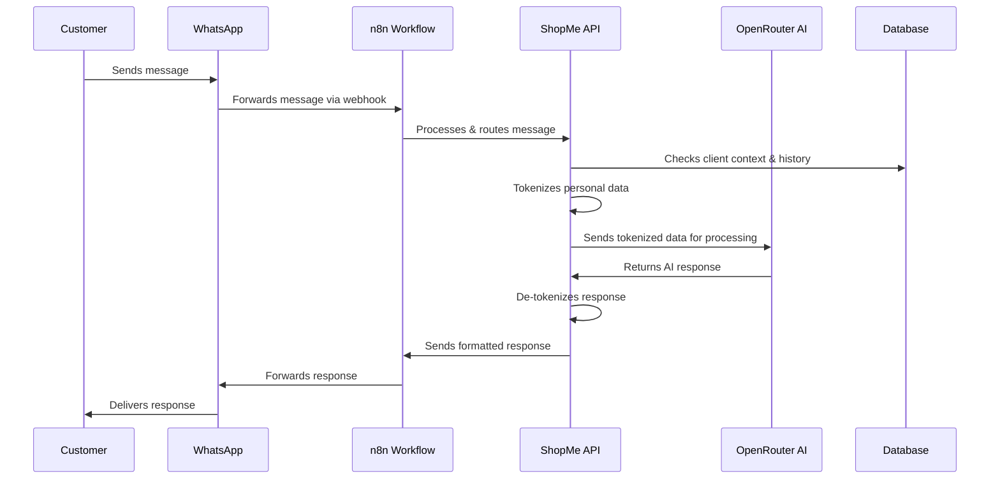

# ShopMe - WhatsApp E-commerce Platform

## Overview

ShopMe is a SaaS (Software as a Service) platform that enables businesses to create their own WhatsApp-based e-commerce presence with minimal setup. The platform leverages the WhatsApp Business API and AI technology to automate client support and order management, providing 24/7 assistance to enhance client experience and streamline business operations.

### Key Features

- **AI-Powered Messaging**: Automated client support with contextual understanding
- **Product Catalog Management**: Easy management of products and categories
- **WhatsApp Cart Management**: Seamless shopping experience through WhatsApp
- **Order Processing**: Complete order lifecycle management
- **Client Management**: Detailed client profiles and communication history
- **Analytics Dashboard**: Insights into sales, clients, and messaging

## Message Processing Flow

When a customer interacts with the ShopMe platform via WhatsApp, a sophisticated message processing flow is activated. Here's a detailed explanation of what happens:

### Step-by-Step Process

1. **Initial Customer Interaction**

   - Customer sends a message via WhatsApp to the business phone number
   - This message can be a product inquiry, order placement, question, etc.

2. **WhatsApp Business API Processing**

   - The WhatsApp Business API receives the message
   - It forwards the message to the configured webhook endpoint

3. **n8n Workflow Orchestration**

   - n8n receives the webhook from WhatsApp
   - Initial processing occurs:
     - Message parsing
     - Sender identification
     - Message categorization
   - The processed data is routed to the appropriate ShopMe API endpoint

4. **ShopMe API Processing**

   - The API identifies the client based on WhatsApp number
   - Retrieves client context and conversation history
   - Determines the appropriate response type:
     - Direct response (for simple queries)
     - Product showcase
     - Order confirmation
     - AI-assisted response for complex queries

5. **Data Protection and AI Integration**

   - For messages requiring AI processing:
     - Personal data is tokenized (replaced with non-identifying tokens)
     - The tokenized message is sent to OpenRouter
     - OpenRouter processes the query with context
     - The response is returned to the API
     - The API de-tokenizes the response, replacing tokens with actual data

6. **Response Delivery**
   - The formatted response is sent back to n8n
   - n8n forwards the response to the WhatsApp Business API
   - The customer receives the response on their WhatsApp

### Technical Components

- **WhatsApp Business API**: Interface with customer WhatsApp accounts
- **n8n**: Workflow automation platform handling message routing
- **ShopMe API**: Core backend services built with Node.js and Express
- **OpenRouter**: AI service using Retrieval Augmented Generation (RAG)
- **PostgreSQL Database**: Stores product, order, and customer information
- **Redis**: Caching and session management

### Security Features

- **Data Pseudonymization**: Tokenization of personal data before AI processing
- **End-to-End Encryption**: Secure transmission of messages
- **GDPR Compliance**: Data minimization and purpose limitation

## Getting Started

[Coming soon]

## Technical Architecture

[Coming soon]

## Deployment

[Coming soon]
