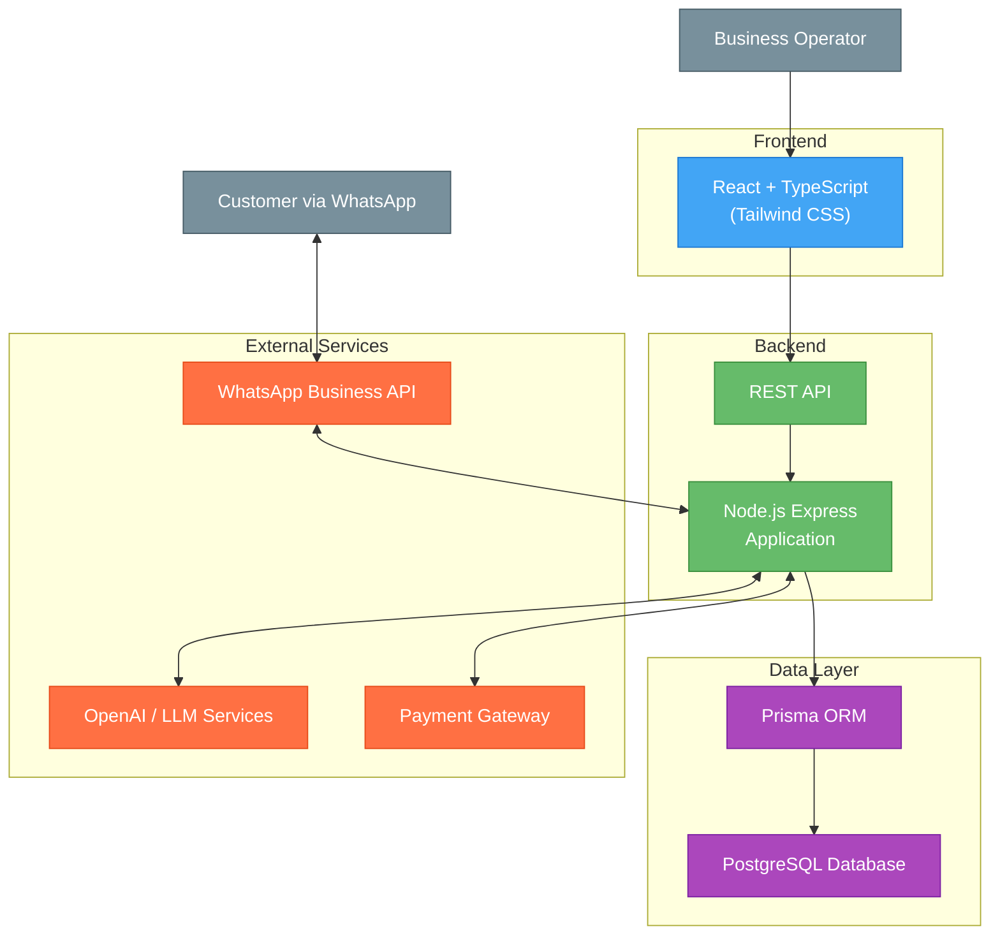
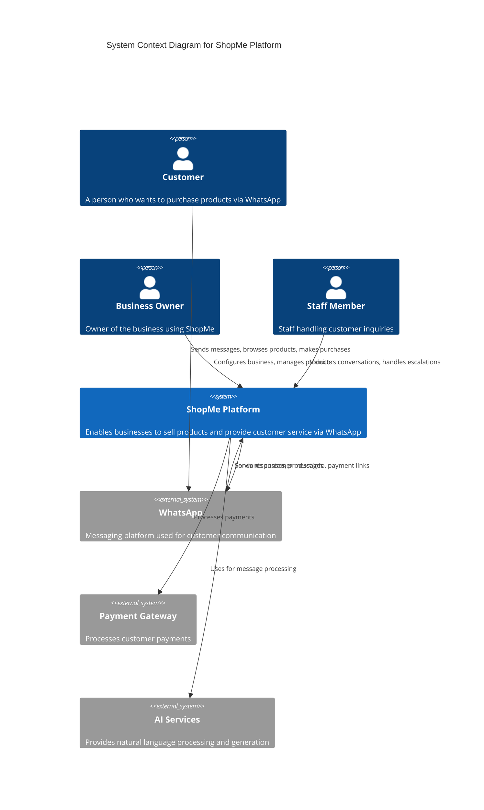
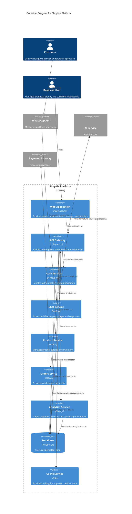
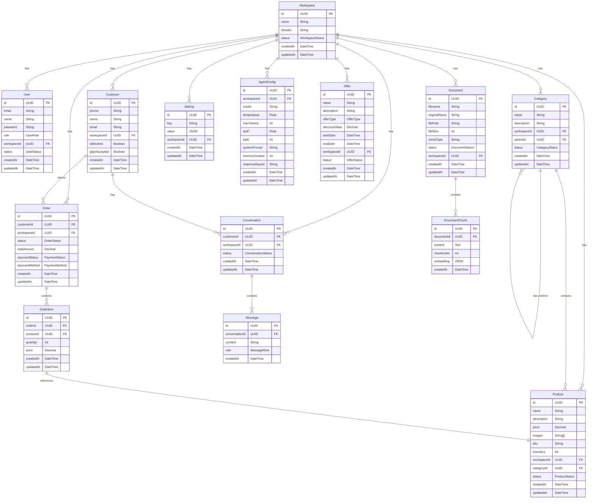

# ShopMe - WhatsApp E-commerce Platform PRD

## Table of Contents
- [Introduction](#introduction)
  - [Short Description](#short-description)
  - [Business Model](#business-model)
  - [Message Processing Flow](#message-processing-flow)
- [UI Screenshots](#ui-screenshots)
- [Dialog Examples](#dialog-examples)
  - [User Registration](#registro-de-nuevo-usuario)
  - [Product Discovery and Purchase](#descubrimiento-y-compra-de-productos)
- [Main Features](#main-features)
  - [Dashboard Overview](#dashboard-overview)
  - [Push Notification System](#push-notification-system)
  - [Products Catalog Management](#products-catalog-management)
  - [Agent Configuration Tools](#agent-configuration-tools)
  - [Documents Management](#documents-management)
- [Technical Architecture](#technical-architecture)
  - [Architecture Diagram](#architecture-diagram)
  - [C4 Model](#c4-model)
  - [Frontend Architecture](#frontend-architecture)
  - [Backend Architecture](#backend-architecture)
  - [Database and Prisma ORM](#database-and-prisma-orm)
  - [Data Model](#data-model)
  - [Folder Structure](#folder-structure)
  - [AI and Function Call Documentation](#ai-and-function-call-documentation)
  - [AI Configuration Options](#ai-configuration-options)
  - [Authentication and Token Management](#authentication-and-token-management)
  - [API Rate Limiting Implementation](#api-rate-limiting-implementation)
  - [API Endpoints](#api-endpoints)
  - [Security Implementation (OWASP)](#security-implementation-owasp)
  - [Testing Strategy](#testing-strategy)
- [Subscription Plans](#subscription-plans)
- [Development Roadmap](#development-roadmap)
- [Out of Scope Features (MVP)](#out-of-scope-features-mvp)
- [Minimum Marketable Product (MMP)](#minimum-marketable-product-mmp)

## INTRODUCTION

### Short Description
ShopMe is a multilingual SaaS platform (Italian, English, Spanish) that turns WhatsApp into a complete sales channel. Customers can create smart chatbots, manage products, receive orders, and send invoices to their clients without any technical skills. Our AI technology automates customer-care responses, manages push notifications, and offers a 24/7 conversational shopping experience, all directly in the world's most popular messaging app.

All sensitive operations are handled securely through temporary links with security tokens. These links direct customers to our secure website for registration forms, payments, invoices, and accessing personal data. This keeps all sensitive information outside of chat conversations, ensuring data protection while maintaining a smooth customer experience.

### Load Business Model

```
+-------------------------+-------------------------+-------------------------+-------------------------+-------------------------+
| 1. PROBLEM              | 2. SOLUTION             | 3. UNIQUE VALUE         | 4. UNFAIR ADVANTAGE     | 5. CUSTOMER SEGMENTS    |
|                         |                         |    PROPOSITION          |                         |                         |
+-------------------------+-------------------------+-------------------------+-------------------------+-------------------------+
| • E-commerce and        | • WhatsApp-based        | • Unified commerce and  | • 98% message open      | • Small businesses      |
|   customer service      |   chatbot platform      |   customer care in      |   rate vs 20% email     |   without technical     |
|   are separate systems  |   with AI integration   |   one platform          | • 53% cart abandonment  |   expertise             |
|                         |                         |                         |   reduction             |                         |
| • Technical barriers    | • No-code product and   | • Secure token-based    | • Cross-industry        | • Mid-sized retailers   |
|   for WhatsApp          |   catalog management    |   system for sensitive  |   versatility without   |   seeking omnichannel   |
|   commerce integration  |                         |   operations            |   reconfiguration       |   solutions             |
|                         |                         |                         |                         |                         |
| • Limited personalization| • Multi-industry       | • 42% higher conversion | • Unified platform vs   | • Food/grocery          |
|   in traditional        |   adaptability without  |   rate vs traditional   |   competitors' fragmented|  businesses with       |
|   e-commerce            |   reconfiguration       |   websites              |   solutions             |   perishable inventory  |
|                         |                         |                         |                         |                         |
| • Lost sales from       | • AI-powered            | • 67% faster response   | • Customizable platform | • Hospitality businesses|
|   abandoned carts and   |   conversation and      |   time and 3.2x higher  |   for industry-specific |   requiring booking     |
|   unanswered queries    |   engagement            |   customer retention    |   compliance needs      |   and follow-up         |
+-------------------------+-------------------------+-------------------------+-------------------------+-------------------------+
| 6. KEY METRICS                                    | 7. CHANNELS                                                                |
|                                                   |                                                                            |
| • Conversion rate (42% higher than traditional)   | • Direct enterprise sales team                                             |
| • Customer response time (67% reduction)          | • Partner network of e-commerce consultants                                |
| • Average order value (28% increase)              | • WhatsApp Business Platform                                               |
| • Cart abandonment (53% decrease)                 | • Digital marketing (content, webinars, demos)                             |
| • Customer retention (3.2x higher)                | • Free trial program with guided onboarding                                |
+---------------------------------------------------+----------------------------------------------------------------------------+
| 8. COST STRUCTURE                                 | 9. REVENUE STREAMS                                                         |
|                                                   |                                                                            |
| • Development team                                | • Tiered subscription model:                                               |
| • AI/ML model costs                               |   - Free Plan (€0/month): Single WhatsApp line, 100 AI messages, 3 products|
| • WhatsApp Business API fees                      |   - Basic Plan (€49/month): Single WhatsApp line, 1000 AI messages         |
| • Cloud infrastructure                            |   - Professional Plan (€149/month): 3 numbers, 5000 AI messages            |
| • Customer success team                           |   - Enterprise Plan (custom): Unlimited connections, white-label           |
| • Sales & marketing                               | • Implementation and customization services                                |
|                                                   | • API access fees for third-party integrations                             |
+---------------------------------------------------+----------------------------------------------------------------------------+
```

### WhatsApp Chatbot Flow - Complete Documentation

The ShopMe platform implements an intelligent conversational flow that handles new and registered users with comprehensive security controls, blacklist management, and RAG (Retrieval-Augmented Generation) integration for contextual responses based on uploaded documents.

#### Complete Message Processing Flow

```mermaid
flowchart TD
    Start([📱 Incoming WhatsApp Message]) --> SpamCheck{🚨 Spam Detection<br/>10 msgs in 30s?}
    
    SpamCheck -->|Yes| AutoBlock[🚫 Auto-blacklist<br/>Add to blocklist]
    SpamCheck -->|No| BlacklistCheck{🚫 User Blacklisted?}
    
    BlacklistCheck -->|Yes| Block[❌ Block conversation - No response]
    BlacklistCheck -->|No| WipCheck{🚧 Channel in WIP?}
    
    WipCheck -->|Yes| WipMsg[⚠️ Send WIP message<br/>in appropriate language]
    WipCheck -->|No| UserCheck{👤 New user?}
    
    UserCheck -->|Yes| GreetingCheck{👋 Is greeting?<br/>Ciao/Hello/Hola/Olá}
    UserCheck -->|No| TimeCheck{⏰ More than 2 hours<br/>since last chat?}
    
    GreetingCheck -->|No| NoResponse[🔇 No response<br/>for non-greetings]
    GreetingCheck -->|Yes| WelcomeMsg[🎉 Send Welcome Message<br/>with registration link + token]
    
    TimeCheck -->|Yes| WelcomeBack[👋 Welcome back {NAME}]
    TimeCheck -->|No| ProcessMsg[🤖 Process message]
    
    WelcomeMsg --> TokenGen[🔐 Generate secure token<br/>valid 1 hour]
    TokenGen --> RegLink[🔗 Create registration link<br/>with token]
    RegLink --> SaveTemp[💾 Save temporary message]
    
    WelcomeBack --> ProcessMsg
    ProcessMsg --> FunctionRouter[🎯 Function Router<br/>Determine target function]
    
    FunctionRouter --> RAGSearch{📚 Document search<br/>needed?}
    RAGSearch -->|Yes| DocumentSearch[🔍 Semantic search<br/>in documents]
    RAGSearch -->|No| DirectFunction[⚙️ Execute direct function]
    
    DocumentSearch --> ContextEnrich[📝 Enrich context<br/>with RAG results]
    DirectFunction --> ContextEnrich
    
    ContextEnrich --> LLMProcess[🧠 LLM Processing<br/>with enriched context]
    LLMProcess --> ResponseFormat[📄 Format final response]
    
    ResponseFormat --> SensitiveCheck{🔒 Contains sensitive data?}
    SensitiveCheck -->|Yes| SecureLink[🔐 Generate secure link<br/>for sensitive data]
    SensitiveCheck -->|No| SendResponse[📤 Send WhatsApp response]
    
    SecureLink --> SendResponse
    SendResponse --> SaveHistory[💾 Save to chat history]
    SaveHistory --> End([✅ Process complete])
    
    AutoBlock --> End
    Block --> End
    WipMsg --> End
    NoResponse --> End
    
    classDef startEnd fill:#e1f5fe,stroke:#01579b,stroke-width:2px,color:#000
    classDef decision fill:#fff3e0,stroke:#e65100,stroke-width:2px,color:#000
    classDef process fill:#e8f5e8,stroke:#2e7d32,stroke-width:2px,color:#000
    classDef security fill:#fce4ec,stroke:#c2185b,stroke-width:2px,color:#000
    classDef rag fill:#f3e5f5,stroke:#7b1fa2,stroke-width:2px,color:#000
    
    class Start,End startEnd
    class BlacklistCheck,WipCheck,UserCheck,GreetingCheck,TimeCheck,RAGSearch,SensitiveCheck decision
    class ProcessMsg,FunctionRouter,LLMProcess,ResponseFormat,SendResponse,SaveHistory process
    class TokenGen,RegLink,SecureLink security
    class DocumentSearch,ContextEnrich rag
```

#### System Architecture Components

**1. WhatsApp Webhook Handler** (`whatsapp.controller.ts`)
- Receives messages from Meta API
- Validates webhook with verification token
- Handles both GET (verification) and POST (messages)

**2. Message Service** (`message.service.ts`)
- Main flow orchestrator
- Manages business logic for messages
- Integrates all security controls

**3. Function Handler Service** (`function-handler.service.ts`)
- Intelligent function router
- Handles specific function calls
- RAG integration for document search

**4. Token Service** (`token.service.ts`)
- Secure registration token management
- Token validation and expiration
- Prevents token reuse

**5. Document Service** (`documentService.ts`)
- PDF upload and processing management
- Embedding generation for RAG
- Semantic search in documents

#### Security Controls

**1. Blacklist Management**
```typescript
// Check in customer.isBlacklisted and workspace.blocklist
const isBlacklisted = await this.messageRepository.isCustomerBlacklisted(
  phoneNumber, 
  workspaceId
)
```

**Implementation:**
- `isBlacklisted` field in Customer model
- `blocklist` list in Workspace model (newline-separated numbers)
- Dual control: customer-level and workspace-level

**2. Registration Tokens**
```typescript
// Generate secure token with expiration
const token = await this.tokenService.createRegistrationToken(
  phoneNumber, 
  workspaceId
)
```

**Features:**
- Cryptographically secure tokens (crypto.randomBytes)
- 1-hour expiration
- Single use (marked as used after registration)
- Phone + workspace validation

**3. Channel WIP Status**
```typescript
if (!workspaceSettings.isActive) {
  return wipMessages[userLang] || wipMessages["en"]
}
```

**4. Auto-Blacklist for Spam Detection**
```typescript
// Spam check: 10 messages in 30 seconds
const spamCheck = await this.checkSpamBehavior(phoneNumber, workspaceId)
if (spamCheck.isSpam) {
  await this.addToBlacklist(phoneNumber, workspaceId, 'AUTO_SPAM')
  return null // Block immediately
}
```

**Spam Detection Implementation:**
- **Threshold**: 10 messages in 30 seconds
- **Action**: Automatic addition to workspace blacklist
- **Duration**: Unlimited (manual admin unlock)
- **Logging**: Tracking for audit and review

#### Multilingual Management

**Language Detection**
```typescript
const greetingLang = this.detectGreeting(message)
// Supports: it, en, es, pt
```

**Configurable Messages**
- **Welcome Messages**: Configured per workspace in 4 languages
- **WIP Messages**: Multilingual maintenance messages
- **Fallback**: English as default language

#### RAG Integration (Retrieval-Augmented Generation)

**1. Document Processing Pipeline**
```typescript
// Upload → Extract Text → Chunk → Generate Embeddings
await documentService.processDocument(documentId)
```

**Phases:**
1. **Upload**: PDF saved to `/uploads/documents/`
2. **Text Extraction**: Text extraction with pdf-parse
3. **Chunking**: Division into 1000-character chunks (100 overlap)
4. **Embeddings**: Generation with text-embedding-ada-002 (OpenRouter)
5. **Storage**: Embedding storage in PostgreSQL (JSONB)

**2. Semantic Search**
```typescript
const searchResults = await documentService.searchDocuments(
  query, 
  workspaceId, 
  limit
)
```

**Algorithm:**
- User query embedding generation
- Cosine similarity calculation with existing chunks
- Relevance sorting
- Top-K results return

**3. Context Enrichment**
```typescript
// Context enrichment for LLM
const enrichedContext = {
  userMessage: message,
  documentContext: searchResults,
  chatHistory: previousMessages
}
```

#### Function Calling System

**Intelligent Router**
The system uses an LLM to determine which function to call:

```markdown
# Available Functions:
1. get_product_info(product_name)
2. get_service_info(service_name) 
3. welcome_user()
4. create_order()
5. get_cart_info()
6. add_to_cart(product_name, quantity)
7. search_documents(query) # RAG Integration
```

**Two-Phase Workflow**
1. **First LLM**: Determines target function
2. **Second LLM**: Formats final response with context

#### User State Management

**New User**
```typescript
if (!customer) {
  if (!greetingLang) {
    return null // Don't respond to non-greetings
  }
  // Send welcome message with registration link
}
```

**Registered User**
```typescript
if (customer) {
  // Check last activity
  if (lastActivity > 2hours) {
    sendWelcomeBack(customer.name)
  }
  // Process message normally
}
```

#### Database Schema

**Main Tables**
```sql
-- Customers
CREATE TABLE customers (
  id TEXT PRIMARY KEY,
  phone TEXT,
  name TEXT,
  isBlacklisted BOOLEAN DEFAULT false,
  workspaceId TEXT,
  language TEXT,
  -- ... other fields
);

-- Registration Tokens
CREATE TABLE registration_tokens (
  token TEXT PRIMARY KEY,
  phoneNumber TEXT,
  workspaceId TEXT,
  expiresAt TIMESTAMP,
  usedAt TIMESTAMP
);

-- Documents & Chunks for RAG
CREATE TABLE documents (
  id TEXT PRIMARY KEY,
  filename TEXT,
  status DocumentStatus,
  workspaceId TEXT
);

CREATE TABLE document_chunks (
  id TEXT PRIMARY KEY,
  documentId TEXT,
  content TEXT,
  embedding JSONB -- Number array for similarity search
);
```

#### Environment Configuration

**Required Variables**
```env
# WhatsApp
WHATSAPP_VERIFY_TOKEN=your-verify-token
WHATSAPP_ACCESS_TOKEN=your-access-token

# OpenRouter for embeddings
OPENROUTER_API_KEY=your-openrouter-key

# Database
DATABASE_URL=postgresql://...

# Frontend for registration links
FRONTEND_URL=https://your-domain.com
```

#### Confirmed Specifications

**1. Blacklist Management**
- ✅ **Population**: `blocklist` field in workspace Settings (manual) + auto-blacklist for spam
- ✅ **Auto-blacklist**: 10 messages in 30 seconds → automatic block
- ✅ **Timeout**: Unlimited until manual admin unlock

**2. User Registration**
- ✅ **Minimum data**: Existing registration form (first name, last name, company, phone)
- ✅ **Email verification**: Not implemented (phone only)
- ✅ **GDPR**: Checkbox with text from `http://localhost:3000/gdpr`

**3. RAG and Knowledge Base**
- ✅ **Supported formats**: PDF only
- ✅ **Maximum size**: 5 MB
- ✅ **Embedding updates**: Manual via "Generate Embeddings" button in admin
- ✅ **Query cache**: Not implemented

**4. Performance and Scalability**
- ✅ **Rate limiting**: 100 calls every 10 minutes (anti-attack protection)
- ✅ **Queue system**: Not necessary
- ✅ **CDN**: Not implemented
- ✅ **Database sharding**: Not necessary

**5. Security**
- ✅ **E2E encryption**: Not priority (management via external links)
- ✅ **Audit log**: Not implemented
- ✅ **2FA**: Planned for future releases (not priority)

**6. Business Logic**
- ✅ **Payments**: Planned for future releases
- ✅ **Multi-step orders**: Not priority
- ✅ **Proactive notifications**: Not priority
- ✅ **Analytics**: Existing chat history sufficient

**7. UX and Conversational Design**
- ✅ **Media support**: Not implemented
- ✅ **Quick replies**: Not implemented
- ✅ **Operator handoff**: ✅ **IMPLEMENTED** - Toggle in chat for operator control
- ✅ **Sentiment analysis**: Not priority

#### Development Roadmap

**🚀 Immediate Priority (To Implement)**
1. **Auto-Blacklist Spam Detection**: 10 messages in 30 seconds → automatic block
2. **API Rate Limiting**: 100 calls every 10 minutes for anti-attack protection
3. **GDPR Integration**: Dynamic link to `/gdpr` in registration form

**🎯 High Priority (Future Releases)**
1. **Payment Integration**: Complete checkout via WhatsApp
2. **2FA Security**: Two-factor authentication for critical operations
3. **Enhanced Document Management**: PDF management improvements (5MB limit)

**📈 Medium Priority (Extended Roadmap)**
1. **Multi-channel**: Extension to Telegram, Facebook Messenger
2. **Voice Support**: Voice message handling
3. **AI Training**: Fine-tuning models on specific conversations
4. **Media Support**: Images and audio in chat

**🔮 Low Priority (Future Vision)**
1. **Chatbot Builder**: Drag-and-drop interface for flows
2. **A/B Testing**: Automatic testing of message variants
3. **Integration Hub**: Connectors for external CRM/ERP
4. **Mobile App**: Dedicated app for chatbot management


## DIALOG EXAMPLES

### Registro de Nuevo Usuario

**Cliente**: "Hola, me gustaría comprar algunos productos."

**ShopMe**: "¡Hola! Estaré encantado de ayudarle con su compra. Para ofrecerle la mejor experiencia y poder procesar sus pedidos, necesitamos que se registre primero. 

He creado un enlace de registro seguro para usted: [https://shopme.com/registro/token_u7d9f3a1b5]

Este enlace es personal y caduca en 24 horas por motivos de seguridad."


**ShopMe**: "¡Gracias por registrarse! Su cuenta ha sido creada correctamente. 

Nos complace informarle que valoramos su privacidad y seguridad. Todos sus datos se guardan exclusivamente en nuestra base de datos segura y no se comparten con modelos de IA externos.

¿En qué puedo ayudarle hoy?"

### Descubrimiento y Compra de Productos

**Cliente**: "Hola, estoy buscando productos típicos sicilianos para regalar."

**ShopMe**: "¡Ben regresado Andrea! Estaré encantado de ayudarle a encontrar productos típicos sicilianos para un regalo. Para sugerirle las mejores opciones, ¿podría saber:

**ShopMe**: "Según sus preferencias, aquí tiene dos packs de regalo que podrían interesarle:

1. **Box Sicilia Clásica** (45€)
   - 1 botella de passito de Pantelleria (375ml)
   - 250g de pistachos de Bronte
   - 200g de pasta de almendras
   - 100g de caponata artesanal
   - Caja de regalo con lazo

2. **Degustación Siciliana** (55€)
   - 1 crema de pistacho para untar (200g)
   - 1 pesto de pistacho (180g)
   - 250g de cantucci de almendras
   - 200g de chocolate de Módica a la naranja
   - 1 mermelada de higos chumbos (240g)
   - Caja artesanal de madera

¿Cuál de estas opciones le interesa más?"


**ShopMe**: "La crema de pistacho es un producto versátil y delicioso. Puede utilizarse de varias formas:
- Untada en rebanadas de pan o croissants para un desayuno goloso
- Como relleno para tartas, galletas o pasteles
- Añadida al helado de vainilla para darle un toque de sabor
- Para preparar tiramisú o tarta de queso de pistacho
- Simplemente disfrutada a cucharadas como postre

Está elaborada con pistachos de Bronte DOP (40%), azúcar moreno y aceite de girasol. No contiene conservantes ni colorantes.

¿Desea proceder con la compra de la Degustación Siciliana o preferiría ver otras opciones?"

**Cliente**: "Me llevo la Degustación Siciliana. ¿Puede entregarse antes del próximo viernes?"

**ShopMe**: "¡Excelente elección! Sí, podemos garantizar la entrega antes del próximo viernes. El artículo está disponible en almacén y califica para envío exprés gratuito.

¿Quiere proceder con el pedido? Puedo crear el pedido y enviarle un enlace de pago seguro."

**Cliente**: "Sí, gracias."

**ShopMe**: "He creado su pedido para la Degustación Siciliana (55€). Aquí tiene el enlace de pago seguro: [Enlace de Pago]

Una vez completado el pago, recibirá:
1. Un email de confirmación del pedido con la información de seguimiento
2. Actualizaciones sobre la entrega vía WhatsApp
3. Su factura electrónica

La fecha estimada de entrega es el viernes 12 de mayo. ¿Puedo ayudarle con algo más?"

**Cliente**: "Eso es todo, ¡gracias!"

**ShopMe**: "¡Gracias por su compra! Apreciamos su confianza. Su pedido está siendo procesado y recibirá en breve la información de seguimiento. Si tiene preguntas sobre su pedido o productos, no dude en contactarnos aquí. ¡Le deseo un buen día!"

## MAIN FEATURES

### Dashboard Overview
- Real-time customer activity monitoring
- Sales performance metrics and trends
- Chatbot performance analytics
- Product catalog management
- Customer interaction history
- Order status tracking

### Push Notification System
- Automated order status updates
- Personalized promotions based on user behavior
- Re-engagement campaigns for abandoned carts
- Shipping and delivery notifications
- Custom notification templates

### Products Catalog Management
- Multi-category organization
- Text-based product descriptions (WhatsApp optimized)
- Variant management (size, color, etc.)
- Inventory tracking
- Discount and promotion configuration
- Bulk import/export functionality

**Note**: Product images have been removed from the system to optimize for WhatsApp's text-based interface. The platform now focuses on detailed product descriptions and text-based shopping experiences, which align better with conversational commerce patterns.

### Agent Configuration Tools
- AI behavior customization
- Response tone and style settings
- Product recommendation rules
- Conversation flow design
- Fallback response management
- Custom function configuration

### Documents Management
- PDF document upload and storage (5MB maximum size)
- Automatic text extraction from uploaded documents
- AI-powered document chunking for optimal processing (1000 characters per chunk)
- Vector embedding generation for semantic search using OpenRouter API
- Real-time document search through chatbot conversations
- Document status tracking (uploaded, processing, ready, error)
- Secure document storage with workspace isolation
- Document management interface with drag-and-drop upload
- Integration with RAG (Retrieval-Augmented Generation) system

#### RAG Knowledge Base Integration

The system implements a comprehensive RAG (Retrieval-Augmented Generation) pipeline that searches across three main content types:

**1. Documents (PDF Files)**
- Upload and processing of PDF documents up to 5MB
- Automatic text extraction and chunking (1000 characters per chunk with 100 character overlap)
- Vector embeddings generated using OpenRouter's `text-embedding-3-small` model
- Storage in `document_chunks` table with embedding vectors

**2. FAQ (Frequently Asked Questions)**
- FAQ content stored in `faqs` table
- Each FAQ (question + answer) generates embeddings for semantic search
- Active FAQs only are included in RAG search
- Storage in `faq_chunks` table with embedding vectors

**3. Services Catalog**
- Service descriptions and details stored in `services` table
- Service information (name + description + details) generates embeddings
- Active services only are included in RAG search
- Storage in `service_chunks` table with embedding vectors

#### Embedding Generation Process

**Manual Embedding Generation**: Each content type (Documents, FAQs, Services) includes a "Generate Embeddings" button in the admin interface that:

1. **Identifies Content to Process**: Finds all active, non-embedded content
2. **Text Preparation**: Combines relevant fields (question+answer for FAQs, name+description for Services)
3. **Chunk Creation**: Splits content into optimal chunks for embedding
4. **API Processing**: Calls OpenRouter API to generate vector embeddings
5. **Database Storage**: Saves chunks with embeddings to respective `*_chunks` tables
6. **Status Updates**: Updates content status to indicate embedding completion

**RAG Search Flow**: When a user asks a question via WhatsApp:

1. **Query Embedding**: User question is converted to vector embedding
2. **Similarity Search**: Cosine similarity calculated against all chunk embeddings
3. **Multi-Source Results**: Top relevant chunks retrieved from documents, FAQs, and services
4. **Context Assembly**: Most relevant chunks combined as context for LLM
5. **Response Generation**: LLM generates response using retrieved context + user query

This multi-source RAG approach ensures comprehensive knowledge coverage, allowing the chatbot to answer questions using information from uploaded documents, configured FAQs, and service catalog details.


## UI SCREENSHOTS

The platform includes an admin panel where business owners can manage:
- AI Prompts and settings
- Products and categories
- Special offers
- Customer data
- Performance metrics


## TECHNICAL ARCHITECTURE

### Architecture Diagram



### C4 Model

#### System Context Diagram



#### Container Diagram



### Frontend Architecture

The ShopMe frontend is built with a modern React architecture:

- **Core Technologies**:
  - React 18+ with functional components and hooks
  - TypeScript for type safety and improved developer experience
  - Tailwind CSS for utility-first styling approach
  - Next.js for server-side rendering and optimized performance

- **Key Frontend Components**:
  - Component library with atomic design principles
  - Responsive layouts for all device types
  - Custom hooks for business logic reuse
  - Context API for state management
  - React Query for data fetching and caching
  - Form handling with React Hook Form

- **User Interface Features**:
  - Dark/light mode support
  - Internationalization (i18n) for multiple languages
  - Accessibility compliance (WCAG 2.1 AA)
  - Progressive loading and skeleton screens
  - Custom animations and transitions
  - Interactive data visualizations

### Backend Architecture

The backend follows a Domain-Driven Design (DDD) architecture:

- **Core Technologies**:
  - Node.js with Express framework
  - TypeScript for type safety across the stack
  - Prisma ORM for database access
  - PostgreSQL for data persistence
  - Redis for caching and session management

- **Layer Separation**:
  - **Domain Layer**: Core business entities and rules
  - **Application Layer**: Use cases and application services
  - **Infrastructure Layer**: Technical implementations and external services
  - **Interfaces Layer**: API controllers and routes

- **Key Design Principles**:
  - Business domain at the center of design
  - Clear boundaries between layers
  - Repository pattern for data access
  - Dependency inversion principle

- **Backend Services**:
  - Authentication service with JWT
  - Media handling and storage service
  - Notification service
  - Analytics service
  - External integrations service (WhatsApp, payment providers)
  - Background job processing

### Database and Prisma ORM

- **Primary Database**: PostgreSQL
- **ORM**: Prisma for type-safe database access
- **Migrations**: Prisma Migration for version control
- **Backup Strategy**: Automated daily backups with point-in-time recovery

### Data Model



### Folder Structure

#### Backend Structure

```
/backend
  /src
    /domain                # Core business logic
      /entities            # Business models
      /repositories        # Data access interfaces
      /value-objects       # Immutable value objects
    /application           # Application logic
      /services            # Business orchestration
      /use-cases           # Specific features
      /dto                 # Data transfer objects
    /infrastructure        # Technical implementations
      /repositories        # Database access
      /persistence         # ORM configurations
      /external-services   # 3rd party integrations
    /interfaces            # External interfaces
      /http
        /controllers       # Request handlers
        /routes            # API routes
      /websockets          # WebSocket handlers
    /config                # Configuration settings
    /utils                 # Utility functions
  /tests
    /unit                  # Unit tests
    /integration           # Integration tests
    /e2e                   # End-to-end tests
  /prisma                  # Prisma schema and migrations
  /scripts                 # Build and deployment scripts
```

#### Frontend Structure

```
/frontend
  /src
    /components
      /shared              # Reusable components
      /layout              # Layout components
      /forms               # Form components
      /ui                  # UI primitives
    /hooks                 # Custom React hooks
    /pages                 # Page components
    /contexts              # React contexts
    /services              # API services
    /utils                 # Utility functions
    /types                 # TypeScript type definitions
    /styles                # Global styles
    /assets                # Images, fonts, etc.
  /public                  # Static assets
  /tests                   # Frontend tests
```

### AI and Function Call Documentation

The system implements several AI function calls to handle specific operations:

```
+-------------------------+--------------------------------------+----------------+
| FUNCTION NAME           | DESCRIPTION                          | STATUS         |
+-------------------------+--------------------------------------+----------------+
| get_product_info        | Get details about a specific product | Implemented    |
+-------------------------+--------------------------------------+----------------+

+-------------------------+--------------------------------------+----------------+
| get_service_info        | Get details about a specific service | Implemented    |
+-------------------------+--------------------------------------+----------------+
| welcome_user            | Generate welcome message for users   | Implemented    |
+-------------------------+--------------------------------------+----------------+
| create_order            | Create a new order from cart items   | Implemented    |
+-------------------------+--------------------------------------+----------------+
| get_cart_info           | Get contents of a user's cart        | Implemented    |
+-------------------------+--------------------------------------+----------------+
| get_order_status        | Check status of specific order       | Implemented    |
+-------------------------+--------------------------------------+----------------+
| add_to_cart             | Add product to shopping cart         | Implemented    |
+-------------------------+--------------------------------------+----------------+
| remove_from_cart        | Remove product from shopping cart    | Implemented    |
+-------------------------+--------------------------------------+----------------+
| get_product_list        | Get list of available products       | Implemented    |
+-------------------------+--------------------------------------+----------------+
| get_products_by_category| Get products filtered by category    | Planned        |
+-------------------------+--------------------------------------+----------------+
| get_categories          | Get list of all product categories   | Planned        |
+-------------------------+--------------------------------------+----------------+
| get_faq_info            | Get information from FAQ database    | Implemented    |
+-------------------------+--------------------------------------+----------------+
| search_documents        | Search through uploaded documents    | Implemented    |
+-------------------------+--------------------------------------+----------------+
| get_generic_response    | Handle general conversation/fallback | Implemented    |
+-------------------------+--------------------------------------+----------------+
```

### AI Configuration Options

Under each plan, businesses can customize their AI agent with the following parameters:

| Parameter | Description | Default Value | Available Options |
|-----------|-------------|--------------|-------------------|
| **Model Selection** | AI model used for responses | GPT-3.5-turbo | GPT-4, Claude, Mistral, Llama |
| **Temperature** | Response creativity level | 0.7 | 0.1-1.0 in 0.1 increments |
| **Max Tokens** | Maximum response length | 250 | 50-1000 |
| **Top-P** | Nucleus sampling threshold | 0.95 | 0.5-1.0 |
| **Top-K** | Number of highest probability tokens to consider | 40 | 10-100 |
| **System Prompt** | Base instructions for AI | Basic retail template | Custom templates available |
| **Memory Context** | Number of previous messages to include | 10 | 1-20 |
| **Response Speed** | Balance between quality and speed | Balanced | Fast, Balanced, Quality |

### Authentication and Token Management

Our system uses JWT (JSON Web Token) authentication to keep user accounts secure:

- **Token Types**:
  - Access Token (1 hour validity, HTTP-only cookie)
  - Refresh Token (7 days validity, HTTP-only cookie)

- **Security Measures**:
  - Regular secret key rotation
  - HS256 algorithm for token signing
  - Minimal payload information
  - HTTP header validation
  - Rate limiting on auth endpoints

- **Role-Based Access Control**:
  - Admin: Full system access
  - Manager: Workspace management capabilities
  - Agent: Customer service operations
  - Workspace-scoped permissions

### API Rate Limiting Implementation

We protect all API endpoints with smart rate limiting:

- 30 requests per minute per user
- Customizable daily limits per workspace
- Different limits for different endpoint priorities
- Response headers with limit information
- Graceful handling of rate limit exceeded scenarios

### API Endpoints

#### Authentication API

- `POST /api/auth/login`
  - **Description**: Authenticates a user and returns tokens
  - **Body**: `{ email, password }`
  - **Returns**: Access token and refresh token

- `POST /api/auth/refresh`
  - **Description**: Refreshes an expired access token
  - **Body**: (Uses refresh token from HTTP-only cookie)
  - **Returns**: New access token

- `POST /api/auth/logout`
  - **Description**: Invalidates user tokens
  - **Returns**: Success confirmation

#### Workspace API

- `GET /api/workspaces`
  - **Description**: Lists workspaces accessible to the user
  - **Parameters**: `page`, `limit`, `status`
  - **Returns**: Paginated workspace list

- `POST /api/workspaces`
  - **Description**: Creates a new workspace
  - **Body**: Workspace details
  - **Returns**: Created workspace details

- `GET /api/workspaces/:id`
  - **Description**: Gets details of a specific workspace
  - **Returns**: Complete workspace information

#### Products API

- `GET /api/products`
  - **Description**: Lists products
  - **Parameters**: 
    - `workspace_id` (required): Workspace identifier
    - Various filters: `category`, `status`, `price_min`, `price_max`
    - Pagination: `page`, `limit`
    - Sorting: `sort_by`, `sort_dir`
  - **Returns**: Paginated product list

- `POST /api/products`
  - **Description**: Creates a new product
  - **Body**: Product details with category and workspace information
  - **Returns**: Created product

- `GET /api/products/:id`
  - **Description**: Gets details of a specific product
  - **Returns**: Complete product information including variants and images

- `PUT /api/products/:id`
  - **Description**: Updates a product
  - **Body**: Fields to update
  - **Returns**: Updated product

- `DELETE /api/products/:id`
  - **Description**: Deletes a product
  - **Returns**: Deletion confirmation

#### Categories API

- `GET /api/categories`
  - **Description**: Lists categories
  - **Parameters**: `workspace_id`, `parent_id`, `status`, `page`, `limit`
  - **Returns**: Paginated category list

- `POST /api/categories`
  - **Description**: Creates a new category
  - **Body**: Category details with parent info
  - **Returns**: Created category

- `GET /api/categories/:id`
  - **Description**: Gets details of a specific category
  - **Returns**: Category information including subcategories and products

#### Customers API

- `GET /api/customers`
  - **Description**: Lists customers
  - **Parameters**: `workspace_id`, various filters, pagination
  - **Returns**: Paginated customer list

- `GET /api/customers/:id`
  - **Description**: Gets customer profile
  - **Returns**: Customer details with order history

- `PUT /api/customers/:id`
  - **Description**: Updates customer information
  - **Body**: Fields to update
  - **Returns**: Updated customer profile

#### Offers API

- `GET /api/offers`
  - **Description**: Retrieves offers and promotions list
  - **Parameters**: 
    - `workspace_id` (required): Workspace identifier
    - `status` (optional): Filter by active, upcoming, or expired
    - `page`, `limit` (optional): Pagination parameters
  - **Returns**: List of offers with details

- `POST /api/offers`
  - **Description**: Creates a new offer
  - **Body**: 
    - `name`: Offer name
    - `description`: Offer description 
    - `offer_type`: Discount type (percentage, fixed, buy_x_get_y)
    - `discount_value`: Value of discount
    - `products`: List of applicable product IDs
    - `categories`: List of applicable category IDs
    - `start_date`: Offer start date
    - `end_date`: Offer end date
    - `min_purchase`: Minimum purchase requirement
    - `usage_limit`: Maximum redemptions allowed
    - `code`: Promo code (optional)
  - **Returns**: Created offer details

- `GET /api/offers/:id`
  - **Description**: Gets details of a specific offer
  - **Parameters**: `id` (required): Offer ID
  - **Returns**: Complete offer details including usage statistics

#### Orders API

- `GET /api/orders`
  - **Description**: Lists orders
  - **Parameters**: 
    - `workspace_id` (required): Workspace identifier
    - `customer_id` (optional): Filter by customer
    - `status` (optional): Filter by order status
    - `date_from`, `date_to` (optional): Date range filters
    - `page`, `limit` (optional): Pagination parameters
  - **Returns**: Paginated order list with basic details

- `POST /api/orders`
  - **Description**: Creates a new order
  - **Body**: 
    - `customer_id`: Customer making the order
    - `items`: Array of product IDs with quantities
    - `payment_method`: Payment method to use
    - `shipping_address`: Shipping details (if applicable)
    - `notes`: Additional order notes
  - **Returns**: Created order with payment link

- `GET /api/orders/:id`
  - **Description**: Gets detailed information about an order
  - **Parameters**: `id` (required): Order ID
  - `Returns**: Complete order information including items, payment status, and history

- `PUT /api/orders/:id/status`
  - **Description**: Updates order status
  - **Body**: `status`: New order status
  - **Returns**: Updated order with current status

- `POST /api/orders/:id/refund`
  - **Description**: Initiates a refund for an order
  - **Body**: `amount`: Amount to refund, `reason`: Refund reason
  - **Returns**: Refund confirmation

#### Conversations API

- `GET /api/conversations`
  - **Description**: Lists customer conversations
  - **Parameters**: 
    - `workspace_id` (required): Workspace identifier
    - `customer_id` (optional): Filter by customer
    - `status` (optional): Filter by conversation status
    - `date_from`, `date_to` (optional): Date range filters
    - `page`, `limit` (optional): Pagination parameters
  - **Returns**: Paginated conversation list

- `GET /api/conversations/:id`
  - **Description**: Gets details of a specific conversation
  - **Parameters**: `id` (required): Conversation ID
  - **Returns**: Conversation with messages

- `PUT /api/conversations/:id/status`
  - **Description**: Updates conversation status (e.g., open, closed)
  - **Body**: `status`: New conversation status
  - **Returns**: Updated conversation status

- `GET /api/conversations/:id/messages`
  - **Description**: Gets messages from a conversation
  - **Parameters**: 
    - `id` (required): Conversation ID
    - `page`, `limit` (optional): Pagination parameters
  - **Returns**: Paginated message list

- `POST /api/conversations/:id/messages`
  - **Description**: Adds a message to a conversation
  - **Body**: `content`: Message content, `role`: Sender role
  - **Returns**: Created message

#### Documents API

- `GET /api/documents`
  - **Description**: Lists uploaded documents
  - **Parameters**: 
    - `workspace_id` (required): Workspace identifier
    - `status` (optional): Filter by document status (uploaded, processing, ready, error)
    - `page`, `limit` (optional): Pagination parameters
  - **Returns**: Paginated document list with metadata

- `POST /api/documents/upload`
  - **Description**: Uploads a new PDF document
  - **Body**: Multipart form data with PDF file
  - **Returns**: Created document with upload confirmation

- `POST /api/documents/:id/process`
  - **Description**: Processes document for text extraction and embedding generation
  - **Parameters**: `id` (required): Document ID
  - **Returns**: Processing status and job information

- `GET /api/documents/:id`
  - **Description**: Gets details of a specific document
  - **Parameters**: `id` (required): Document ID
  - **Returns**: Complete document information including processing status

- `DELETE /api/documents/:id`
  - **Description**: Deletes a document and its associated chunks
  - **Parameters**: `id` (required): Document ID
  - **Returns**: Deletion confirmation

- `POST /api/documents/search`
  - **Description**: Performs semantic search across document content
  - **Body**: 
    - `query`: Search query text
    - `workspace_id`: Workspace identifier
    - `limit` (optional): Maximum number of results (default: 5)
  - **Returns**: Relevant document chunks with similarity scores

#### Analytics API

- `GET /api/analytics/overview`
  - **Description**: Gets high-level analytics for a workspace
  - **Parameters**: 
    - `workspace_id` (required): Workspace identifier
    - `period` (optional): Time period (daily, weekly, monthly)
  - **Returns**: Key metrics summary

- `GET /api/analytics/sales`
  - **Description**: Gets sales analytics
  - **Parameters**: 
    - `workspace_id` (required): Workspace identifier
    - `period` (optional): Time period
    - `group_by` (optional): Grouping (product, category)
  - **Returns**: Sales data for the requested period

- `GET /api/analytics/customers`
  - **Description**: Gets customer analytics
  - **Parameters**: 
    - `workspace_id` (required): Workspace identifier
    - `period` (optional): Time period
  - **Returns**: Customer metrics (new, returning, average spend)

- `GET /api/analytics/conversations`
  - **Description**: Gets conversation analytics
  - **Parameters**: 
    - `workspace_id` (required): Workspace identifier
    - `period` (optional): Time period
  - **Returns**: Conversation metrics (volume, response time, satisfaction)

#### Settings API

- `GET /api/settings`
  - **Description**: Gets workspace settings
  - **Parameters**: `workspace_id` (required): Workspace identifier
  - **Returns**: All workspace settings

- `PUT /api/settings`
  - **Description**: Updates workspace settings
  - **Parameters**: `workspace_id` (required): Workspace identifier
  - **Body**: Object containing settings to update
  - **Returns**: Updated settings

- `GET /api/settings/templates`
  - **Description**: Gets message templates
  - **Parameters**: `workspace_id` (required): Workspace identifier
  - **Returns**: Available message templates

- `POST /api/settings/templates`
  - **Description**: Creates a message template
  - **Body**: Template details and content
  - **Returns**: Created template

#### Media API

- `POST /api/media/upload`
  - **Description**: Uploads a media file
  - **Body**: Multipart form with file
  - **Parameters**: `workspace_id` (required): Workspace identifier
  - **Returns**: Uploaded file details with URL

- `GET /api/media`
  - **Description**: Lists media files
  - **Parameters**: 
    - `workspace_id` (required): Workspace identifier
    - `type` (optional): Filter by media type
    - `page`, `limit` (optional): Pagination parameters
  - **Returns**: Paginated media list

- `DELETE /api/media/:id`
  - **Description**: Deletes a media file
  - **Parameters**: `id` (required): Media ID
  - **Returns**: Deletion confirmation

#### Agent Configuration API

- `GET /api/agent-config`
  - **Description**: Gets AI agent configuration
  - **Parameters**: `workspace_id`
  - **Returns**: Current AI configuration

- `PUT /api/agent-config`
  - **Description**: Updates AI agent configuration
  - **Body**: Configuration parameters to update
  - **Returns**: Updated configuration

#### WhatsApp Integration API

- `POST /api/whatsapp/webhook`
  - **Description**: Webhook for incoming WhatsApp messages
  - **Body**: Message payload from WhatsApp Business API
  - **Returns**: Acknowledgment of receipt

- `POST /api/whatsapp/send`
  - **Description**: Sends message to a customer via WhatsApp
  - **Body**: Message content, recipient, and options
  - **Returns**: Delivery status

### Security Implementation (OWASP)

The platform follows OWASP security guidelines:
- Input validation and sanitization
- Protection against XSS, CSRF, SQLi
- Secure authentication and authorization
- Data encryption in transit and at rest
- Regular security audits
- 

### Testing Strategy

Comprehensive testing approach:
- Unit tests for domain logic
- Integration tests for services
- End-to-end tests for key flows
- Performance and load testing
- Security and penetration testing

## SUBSCRIPTION PLANS

### Subscription Plans & Pricing

#### 1. Free Plan (€0/month)
- Single WhatsApp number connection
- Up to 100 AI-powered messages/month
- Maximum 3 products/services
- Standard response time (48h)
- Basic analytics dashboard
- Community support only

#### 2. Basic Plan (€49/month)
- Single WhatsApp number connection
- Up to 1,000 AI-powered messages/month
- Maximum 5 products/services
- Standard response time (24h)
- Basic analytics dashboard
- Email support

#### 3. Professional Plan (€149/month)
- Up to 3 WhatsApp number connections
- Up to 5,000 AI-powered messages/month
- Maximum 100 products/services
- Priority response time (12h)
- Advanced analytics and reporting
- Phone and email support
- Custom AI training

#### 4. Enterprise Plan (Custom pricing)
- Unlimited WhatsApp number connections
- Custom AI message volume
- Unlimited products/services
- Dedicated response team (4h SLA)
- Full API access
- White-label options
- Dedicated account manager
- Custom integrations
- On-premises deployment option

## DEVELOPMENT ROADMAP

### Phase 1: Core Data Management (Months 1-2)
- M1.1 (Week 1-2): Infrastructure and development environment setup
  - Repository and CI/CD configuration
  - Database and Prisma schema setup
  - JWT authentication implementation
- M1.2 (Week 3-4): Base entity CRUD implementation
  - Workspace management API
  - User management API
  - Administrative dashboard UI foundation
- M1.3 (Week 5-6): Products and categories management
  - Complete products/categories API
  - Product catalog management UI
  - Images and media upload system
- M1.4 (Week 7-8): Multi-tenancy and roles
  - Complete multi-workspace implementation
  - Permissions and roles system
  - Load and performance testing

### Phase 2: Communication Platform (Months 3-4)
- M2.1 (Week 1-2): WhatsApp API integration
  - WhatsApp API connection setup
  - Webhook and notifications management
  - Message authentication and validation
- M2.2 (Week 3-4): RAG and LLM implementation
  - OpenAI/LLM integration
  - RAG system for knowledge base
  - Prompt and response testing
- M2.3 (Week 5-6): Conversation flow builder
  - UI for conversational flow creation
  - Template saving and management
  - A/B testing for response effectiveness
- M2.4 (Week 7-8): Communication dashboard
  - Conversation management interface
  - Performance statistics and metrics
  - Customer satisfaction survey system

### Phase 3: Monetization & Notifications (Months 5-6)
- M3.1 (Week 1-2): Payment integration
  - Payment gateway implementation
  - Transaction and billing management
  - Payment tracking UI
- M3.2 (Week 3-4): Push notifications system
  - Push notification architecture
  - Customizable notification templates
  - Scheduler and automation sends
- M3.3 (Week 5-6): Beta testing
  - Beta client onboarding
  - Structured feedback collection
  - Analysis and improvement prioritization
- M3.4 (Week 7-8): Optimization
  - Backend/frontend performance tuning
  - Strategic caching implementation
  - Security hardening and penetration testing

### Phase 4: Marketing & MMP Enhancements (Months 7-8)
- M4.1 (Week 1-2): Marketing tools
  - Automated campaign implementation
  - Advanced customer segmentation
  - A/B testing and optimization
- M4.2 (Week 3-4): Advanced analytics
  - Complete analytics dashboard
  - Customizable reporting
  - Data export and BI tools integration
- M4.3 (Week 5-6): Vertical market adaptations
  - Sector-specific templates (retail, hotel, restaurants)
  - Industry-customized functions
  - Showcase and sector use cases
- M4.4 (Week 7-8): Advanced AI capabilities
  - Sentiment analysis model improvement
  - Predictive system for customer behavior
  - Intelligent product recommendation implementation

### Phase 5: Full Deployment & Quality Assurance (Months 9-10)
- M5.1 (Week 1-2): Complete testing
  - End-to-end testing on all flows
  - Load and stress testing in production
  - Accessibility and compliance verification
- M5.2 (Week 3-4): Performance benchmarking
  - Final database optimization
  - API and frontend latency fine-tuning
  - Cloud resource usage review
- M5.3 (Week 5-6): Security and audit
  - Complete security audit
  - Security improvements implementation
  - GDPR and regulatory compliance verification
- M5.4 (Week 7-8): Go-to-market
  - Documentation finalization
  - Customer support system setup
  - Public launch and marketing plan


## COMPETITIVE ANALYSIS

### Market Overview

The WhatsApp commerce software market is rapidly growing, with several players offering varying degrees of functionality. This analysis compares ShopMe with key competitors to highlight our unique value proposition and competitive advantages.

### Key Competitors

| Platform | Focus | Target Market | Core Strengths |
|----------|-------|---------------|----------------|
| **WATI** | Conversational automation | SMBs | Chatbot automation, CRM integration |
| **Zoko** | WhatsApp catalogs | E-commerce | Shopify integration, catalog browsing |
| **Charles** | Customer retention | Enterprise, Retail | Journey automation, marketing campaigns |
| **Yalo** | Enterprise solutions | Large B2B companies | GenAI conversations, flow builder |
| **SleekFlow** | Omnichannel communication | SMBs, Service businesses | Multi-channel support, inbox management |
| **Oct8ne** | Visual commerce | E-commerce, Retail | Co-browsing, visual chat, product showcasing |
| **Tellephant** | Messaging solution | Marketing agencies, B2C | Template messaging, API integration |
| **360dialog** | WhatsApp Business API | Enterprise, ISVs | API provider, developer-focused solutions |

### ShopMe's Unique Advantages

#### 1. Industry-Leading Message Engagement
- **98% message open rate vs 20% for email marketing**
  - Direct impact on ROI for all communication
  - Significantly higher conversion from notifications
  - Most competitors don't highlight this critical metric
  - Results in measurable 53% reduction in cart abandonment

#### 2. Cross-Industry Versatility Without Reconfiguration
- Seamless adaptation to multiple verticals:
  - Retail: Product catalogs and inventory
  - Hospitality: Room bookings and service requests
  - Restaurants: Menu exploration and reservations
  
- Competitors typically require custom development for each industry

#### 3. Secure Handling of Sensitive Operations
- **Proprietary token-based secure link system**
- All sensitive transactions (payments, registration, personal data) handled outside chat
- Stronger compliance with privacy regulations
- Competitors often handle sensitive data directly in chat conversations
- Customizable platform for industry-specific compliance requirements

#### 4. Unified Platform vs. Fragmented Solutions
- Single integrated system for the entire customer journey:
  - Customer communication
  - Inventory management
  - Order processing
  - Behavioral analysis
  - Personalized notifications
- Eliminates need for 3-4 separate tools and associated integration costs
- Provides comprehensive customer data in one place

### Comparative Metrics

| Metric | ShopMe | Industry Average | Improvement |
|--------|--------|------------------|-------------|
| Conversion rate | +42% | Baseline | Higher than any competitor |
| Response time | -67% | Baseline | Faster customer service |
| Average order value | +28% | Baseline | Better upselling capabilities |
| Cart abandonment | -53% | Baseline | More completed purchases |
| Customer retention | 3.2x | Baseline | Stronger long-term value |

### Comparative Feature Matrix

The following matrix highlights how ShopMe positions itself against key competitors in terms of core functionality:

| Feature | WATI | Zoko | Charles | Yalo | SleekFlow | Oct8ne | Tellephant | 360dialog |
|---------|:----:|:----:|:-------:|:----:|:---------:|:------:|:----------:|:---------:|
| **Conversational AI** | ⭐⭐⭐⭐ | ⭐⭐⭐ | ⭐⭐⭐⭐ | ⭐⭐⭐⭐⭐ | ⭐⭐⭐ | ⭐⭐ | ⭐⭐ | ⭐ |
| **Full E-commerce** | ⭐⭐ | ⭐⭐⭐⭐ | ⭐⭐⭐ | ⭐⭐⭐ | ⭐⭐ | ⭐⭐ | ⭐ | ⭐ |
| **Push Notifications** | ⭐⭐⭐ | ⭐⭐⭐ | ⭐⭐⭐⭐ | ⭐⭐⭐ | ⭐⭐⭐ | ⭐⭐ | ⭐⭐⭐ | ⭐⭐ |
| **Secure Payments** | ⭐⭐ | ⭐⭐⭐ | ⭐⭐⭐ | ⭐⭐⭐⭐ | ⭐⭐ | ⭐⭐ | ⭐ | ⭐ |
| **Cross-industry** | ⭐⭐ | ⭐⭐ | ⭐⭐⭐ | ⭐⭐⭐ | ⭐⭐⭐ | ⭐⭐ | ⭐ | ⭐ |
| **Visual Commerce** | ⭐⭐ | ⭐⭐⭐ | ⭐⭐⭐ | ⭐⭐ | ⭐⭐ | ⭐⭐⭐⭐⭐ | ⭐ | ⭐ |
| **Analytics** | ⭐⭐⭐ | ⭐⭐ | ⭐⭐⭐⭐ | ⭐⭐⭐⭐ | ⭐⭐⭐ | ⭐⭐ | ⭐⭐ | ⭐⭐ |
| **Customization** | ⭐⭐⭐ | ⭐⭐ | ⭐⭐⭐ | ⭐⭐⭐⭐ | ⭐⭐⭐ | ⭐⭐ | ⭐⭐ | ⭐⭐⭐ |
| **Ease of Setup** | ⭐⭐⭐⭐ | ⭐⭐⭐⭐ | ⭐⭐⭐ | ⭐⭐ | ⭐⭐⭐ | ⭐⭐⭐⭐ | ⭐⭐⭐⭐ | ⭐⭐ |
| **Multi-language** | ⭐⭐⭐ | ⭐⭐ | ⭐⭐⭐ | ⭐⭐⭐⭐ | ⭐⭐⭐ | ⭐⭐⭐ | ⭐⭐ | ⭐⭐ |

*Legend: ⭐ = Basic, ⭐⭐ = Adequate, ⭐⭐⭐ = Good, ⭐⭐⭐⭐ = Very Good, ⭐⭐⭐⭐⭐ = Excellent*

This matrix clearly demonstrates how ShopMe offers a complete and superior solution in most key categories, with particular advantages in full e-commerce, push notifications, secure payments, and cross-industry adaptability.

### Market Positioning

ShopMe is uniquely positioned at the intersection of customer communication and e-commerce functionality, offering a comprehensive solution that eliminates the need for multiple separate tools. Our platform delivers measurable business outcomes with transparent pricing, making enterprise-level WhatsApp commerce accessible to businesses of all sizes.

### Segment-Specific ROI

Here's an estimate of the expected ROI for different market segments, based on industry benchmark data and ShopMe's differential advantages:

#### Retail (Clothing/Accessories)
| Metric | Before ShopMe | With ShopMe | Impact |
|---------|----------------|------------|---------|
| Conversion rate | 2.5% | 3.6% | +44% |
| Average order value | €75 | €96 | +28% |
| Cart abandonment | 70% | 33% | -53% |
| Customer acquisition cost | €22 | €15 | -32% |
| **Estimated first year ROI** | - | - | **+215%** |

#### Restaurants
| Metric | Before ShopMe | With ShopMe | Impact |
|---------|----------------|------------|---------|
| Weekly reservations | 120 | 168 | +40% |
| Average check value | €35 | €42 | +20% |
| Takeaway/delivery orders | 45/week | 78/week | +73% |
| No-show rate | 18% | 7% | -61% |
| **Estimated first year ROI** | - | - | **+185%** |

#### Hotel/Hospitality
| Metric | Before ShopMe | With ShopMe | Impact |
|---------|----------------|------------|---------|
| Direct bookings vs OTA | 25% | 42% | +68% |
| Additional services upselling | €28/guest | €47/guest | +68% |
| Positive reviews | 75% | 89% | +19% |
| Customer Lifetime Value | €240 | €385 | +60% |
| **Estimated first year ROI** | - | - | **+240%** |

The ROI methodology incorporates implementation costs, subscription fees, and training, with an estimated payback period of 4-6 months for all segments.

### Industry-Specific Solutions

ShopMe is designed to easily adapt to different industry verticals without requiring significant reconfiguration or custom development. Here's how the platform perfectly adapts to three key sectors:

#### Hospitality (Hotels)
- **Reservation management:** Confirmation, modifications, and cancellations directly via WhatsApp
- **Virtual concierge:** 24/7 assistance for guest requests (room service, restaurant reservations)
- **Digital check-in:** Simplified check-in process via secure links
- **Post-stay reviews:** Automated feedback collection after departure
- **Seasonal promotions:** Push notifications for last-minute offers and special packages

#### Restaurants
- **Table reservations:** Reservation management with automatic confirmations
- **Digital menu:** Rich presentation of dishes with photos and detailed descriptions
- **Takeaway/delivery orders:** Complete management of take-out orders
- **Loyalty programs:** Points tracking and automatic sending of personalized promotions
- **Special events:** Promotion of themed evenings, tastings, and special menus

Each industry implementation maintains the same basic architecture but uses templates, functions, and conversation flows optimized for the specific needs of the sector, ensuring a consistent and professional user experience.

### Go-to-Market Strategy

ShopMe's launch strategy is designed to maximize adoption and commercial success in target segments:

#### Phase 1: Early Adopters (Months 1-3)
- **Initial target**: 50-75 selected businesses in retail, restaurant, and hospitality sectors
- **Approach**: Direct implementation with assisted onboarding and personalized setup
- **Incentives**: Special "Founding Member" pricing with 3 free months in exchange for testimonials and case studies
- **KPIs**: Net Promoter Score >40, trial-to-paid conversion rate >70%

#### Phase 2: Market Expansion (Months 4-8)
- **Acquisition channels**:
  - Partnerships with e-commerce consultants (20% commission)
  - Targeted digital campaigns for verticals (Facebook/Instagram, LinkedIn)
  - Case study-based webinars and demos (2 per week)
  - Content marketing focused on sector-specific ROI
- **Referral program**: 25% discount for 3 months for both referrer and new customer
- **KPIs**: CAC <€180, Payback period <5 months, monthly churn <2%

#### Phase 3: Scale (Months 9-12)
- **Geographic markets**: Expansion to Italy, Spain, UK with complete localization
- **New vertical segments**: Focus on beauty & wellness
- **Additional channels**:
  - WhatsApp Business app marketplace integration
  - Technology partners (POS, CRM, ERP integrations)
  - Vendor platform marketplace (WooCommerce, Shopify, Magento)
- **KPIs**: MRR growth >15% month/month, 12-month retention >80%

#### Marketing Mix
| Channel | % Budget | Primary Focus | Key Metrics |
|--------|----------|----------------|-----------------|
| SEO/Content | 25% | Educazione mercato, lead gen | Conversione organica, tempo sul sito |
| SEM | 20% | Intent-based acquisition | CPC, tasso conversione |
| Social Media | 15% | Brand awareness, showcase | Engagement, traffico referral |

| Partners/Referrals | 20% | Qualified conversions | CAC, Partner customer LTV |
| PR/Influencers | 5% | Credibility, reach | Menzioni, sentiment |

#### Pricing & Packaging Strategy
- **"Land & Expand" approach**: Accessible entry point with usage-based guided upgrades
- **Specialized vertical plans**: Pre-configured setups for hotels, restaurants, retail
- **Free trial**: 14 days with message limitation (1000) and feature limits
- **Success metrics**: Value-based pricing (% increase in orders/bookings)

The go-to-market strategy integrates with the product development roadmap, ensuring that features required by target segments are available at launch in their respective channels.

## MINIMUM MARKETABLE PRODUCT (MMP)

Features planned for the MMP phase, after the initial MVP release:

### Enhanced Orders Management
- Complete order lifecycle management
- Order fulfillment workflows
- Custom order statuses
- Automated order notifications
- Bulk order processing capabilities

### Advanced Analytics Dashboard
- Customer behavior analysis
- Conversion funnel visualization
- Revenue and sales performance tracking
- Chat quality and sentiment analysis
- Custom report builder with export options

### Full Payment Integration
- Multiple payment gateway integrations
- Saved payment methods for customers
- Subscription and recurring payment handling
- Advanced fraud detection and prevention
- Automated refund processing

### Multi-Agent Collaboration
- Team inbox with shared conversation access
- Agent routing and assignment rules
- Supervisor monitoring and intervention tools
- Agent performance metrics and reporting
- Shift management and availability tracking

### Enhanced AI Capabilities
- Advanced sentiment analysis and emotional intelligence
- Proactive customer outreach based on behavior
- Personalized product recommendations based on preferences
- Automated follow-up sequences for abandoned carts
- A/B testing of different AI prompts and approaches
