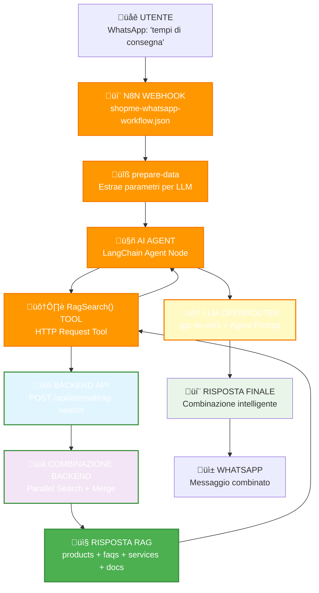

# ShopMe - WhatsApp E-commerce Platform PRD

---

## üöÄ Recent Changes & Roadmap (2025-07)

### ‚úÖ Completed & In Progress
- **Catalog menu removed:** Sidebar now shows Products, Categories, Offers as top-level items.
- **Orders page pagination:** Implemented server-side pagination; marked as completed.
- **Order filters bug:** Known issue—filters (search, status, date) on orders list not working; see bug task.
- **Customer discount logic:** Customer discount field enforced; best discount (customer vs. offer) always applied in RAG search.
- **Address handling:** Shipping Address and Invoice Address will both be managed as structured objects (field by field) in forms and backend.
- **Pagination limits:** All paginated lists will show 5 more items per page (default and max).
- **N8N Custom Functions:** New tasks for "CF Call Operator" and "CF New Order" workflows.
- **Google Translate in RAG:** All non-English content (especially FAQs) will be translated to English before LLM processing.

### üêû Known Bugs
- **Order list filters:** Filters on the orders page do not work as expected (search, status, date, etc.).
- **Customer discount in RAG:** Must always apply the best discount (customer or offer) in price calculations.

### ‚è≥ Phase 2 Tasks (Deferred)
- **Advanced WhatsApp Features** (media, templates, bulk, scheduling)
- **Security & Performance Optimization** (rate limiting, 2FA, monitoring, OWASP)
- **Full Application Responsiveness** (mobile/tablet/desktop)
- **Database Cleanup** (remove unused tables)

---

## üìã Task List Reference
See `docs/other/task-list.md` for the full, up-to-date structured task list, including all completed, active, bug, and phase 2 tasks.

---

## ‚ùì **FREQUENTLY ASKED QUESTIONS - TECHNICAL CLARIFICATIONS**

### **Q1: Come si calcolano i prezzi con sconti e offerte?**
**A:** [DA CHIARIRE CON ANDREA] 
- Vince lo sconto pi√π alto o sono cumulativi?
- Quale ordine di priorità: sconto prodotto > sconto categoria > sconto workspace?
- Come gestire percentuali vs importi fissi?

### **Q2: Gestione Canale Disattivo - Messaggio WIP**
**A:** [DA CHIARIRE CON ANDREA]
- Dove si trova il messaggio "Work in Progress" multilingua?
- È nel database (tabella `gdprContent` o simile)?
- È hardcoded per lingua o configurabile per workspace?

### **Q3: LLM di Formattazione in N8N**
**A:** ‚úÖ **IMPLEMENTATO - TWO-LLM ARCHITECTURE**
- **LLM 1 (RAG Processor)**: Analizza e filtra dati grezzi dal database (T=0.3)
- **LLM 2 (Formatter)**: Crea risposta conversazionale naturale (T=0.7)
- Configurazione dinamica dalla tabella `agentConfig` (prompt, temperatura, token, modello)

### **Q4: Calling Functions con Token di Protezione**
**A:** ‚úÖ **IMPLEMENTATO**
- Token interno N8N: `internal_api_secret_n8n_shopme_2024`
- SecureTokenService per customer tokens temporanei
- Cleanup automatico after expiration (1 ora)

### **Q5: Usage Tracking System**
**A:** ‚úÖ **IMPLEMENTATO COMPLETAMENTE**
- **Costo per messaggio**: €0.005 (0.5 centesimi) per ogni risposta LLM
- **Tracciamento automatico**: Integrato in `saveMessage()` - single point of truth
- **Dashboard analytics**: Statistiche complete con grafici e export
- **Filtri di sicurezza**: Solo clienti registrati con `activeChatbot: true`

### **Q6: N8N Auto-Setup e Import Automatico**
**A:** ‚úÖ **IMPLEMENTATO COMPLETAMENTE**
- **Flusso attivo**: SÌ - workflow creato automaticamente e impostato `active: true`
- **Workflow completo**: SÌ - Two-LLM Architecture (LLM 1: RAG + LLM 2: Formatter)
- **Credenziali**: SÌ - Basic Auth automaticamente configurato per Internal API
- **Owner account**: SÌ - `admin@shopme.com / Venezia44`
- **Script**: `scripts/n8n_import-optimized-workflow.sh` - setup completamente automatico
- **Files**: `n8n/shopme-whatsapp-workflow.json` + credentials
- **Processo**: Docker start ‚Üí Owner setup ‚Üí Credential import ‚Üí Workflow import ‚Üí Activation

### **üîë N8N CREDENTIALS CONFIGURATION**
**CREDENZIALI OBBLIGATORIE PER FUNZIONAMENTO N8N:**

#### **1. N8N Admin Login**
- **Email**: `admin@shopme.com`
- **Password**: `Venezia44` (uppercase V required)
- **URL**: http://localhost:5678
- **Setup**: Automatico via `scripts/n8n_import-optimized-workflow.sh`

#### **2. Backend API Authentication (Basic Auth)**
- **Name**: `Backend API Basic Auth`
- **Type**: `Basic Authentication`
- **Username**: `admin`
- **Password**: `admin`
- **Usage**: Per chiamate HTTP al backend `/api/internal/*`
- **Nodes**: LLM Router, RAG Search, Save Message, Generate Token

#### **3. OpenRouter API Authentication (Header Auth)**
- **Name**: `OpenRouter API`
- **Type**: `Header Auth`
- **Header Name**: `Authorization`
- **Header Value**: `Bearer ${OPENROUTER_API_KEY}`
- **Usage**: Per chiamate LLM dirette a OpenRouter
- **Nodes**: LLM Router, LLM Formatter

#### **4. WhatsApp Business API (Header Auth)**
- **Name**: `WhatsApp Business API`
- **Type**: `Header Auth`
- **Header Name**: `Authorization`
- **Header Value**: `Bearer ${WHATSAPP_TOKEN}`
- **Usage**: Per invio messaggi WhatsApp
- **Nodes**: Send WhatsApp Message

#### **üìã SETUP AUTOMATICO CREDENZIALI:**
```bash
# Eseguito automaticamente in npm run dev
./scripts/n8n_import-optimized-workflow.sh
```

#### **⚠️ CONFIGURAZIONE MANUALE (se automatico fallisce):**
1. Login N8N: http://localhost:5678 (`admin@shopme.com / Venezia44`)
2. Settings ‚Üí Credentials ‚Üí Create New
3. Seleziona tipo appropriato (Basic Auth, Header Auth)
4. Inserisci nome e valori come specificato sopra
5. Salva e assegna ai nodi workflow appropriati

### **Q7: Logica RAG Condizionale**
**A:** ‚úÖ **IMPLEMENTATO**
- LLM Router classifica l'intenzione: sociale vs prodotto/servizio
- Pattern sociali (saluti, ringraziamenti) = NO RAG
- Pattern commerciali (prodotti, prezzi, ordini) = SÌ RAG
- Endpoint: `/internal/llm-router`

### **Q8: Disable Chatbot - Non Rispondere**
**A:** ‚úÖ **IMPLEMENTATO**
- Check `workspace.isActive` e `whatsappSettings.isActive`
- Se disattivo, nessuna risposta automatica
- Implementato nel workflow N8N e backend

### **Q9: Invoice Management System**
**A:** ‚úÖ **TASK DOCUMENTATO - DA IMPLEMENTARE**
- **CF Function**: `ReceiveInvoice` con filtro codice ordine
- **Pagina lista fatture**: Design coerente con registrazione + token security
- **Download PDF**: Sistema di token temporanei per sicurezza
- **Database schema**: Tabella `invoices` con relazioni customer/workspace

---

## üí∞ **USAGE TRACKING SYSTEM - COMPLETE IMPLEMENTATION**

### **🎯 Overview**
Il sistema di tracciamento usage monitora automaticamente i costi LLM con €0.005 per messaggio e fornisce dashboard analytics complete per business intelligence.

### **‚úÖ Architettura Implementata**

#### **🔄 Single Point of Truth**
```typescript
// In saveMessage method - chiamato da N8N
if (response && response.trim()) {
  const customer = await prisma.customers.findFirst({
    where: {
      phone: phoneNumber,
      workspaceId: workspaceId,
      activeChatbot: true // Solo clienti registrati e attivi
    }
  });

  if (customer) {
    await prisma.usage.create({
      data: {
        workspaceId: workspaceId,
        clientId: customer.id,
        price: 0.005 // 0.5 centesimi come richiesto
      }
    });
    
    logger.info(`💰 €0.005 tracked for ${customer.name}`);
  }
}
```

#### **üìä Database Schema**
```sql
CREATE TABLE usage (
  id VARCHAR(255) PRIMARY KEY,
  workspace_id VARCHAR(255) NOT NULL,
  client_id VARCHAR(255) NOT NULL,
  price DECIMAL(10,3) DEFAULT 0.005,
  created_at TIMESTAMP DEFAULT CURRENT_TIMESTAMP,
  
  FOREIGN KEY (workspace_id) REFERENCES workspaces(id),
  FOREIGN KEY (client_id) REFERENCES customers(id)
);

-- Indici per performance
CREATE INDEX idx_usage_workspace_date ON usage(workspace_id, created_at DESC);
CREATE INDEX idx_usage_client_date ON usage(client_id, created_at DESC);
```

#### **🔄 Flusso Completo**
```
üì± Cliente: "ciao mozzarella"
         ‚Üì
🤖 N8N Workflow → LLM Response
         ‚Üì
üíæ /internal/save-message con response
         ‚Üì
💰 AUTOMATIC Usage Tracking (€0.005)
         ‚Üì
üìä Dashboard Analytics Update
```

### **üìà Dashboard Analytics**

#### **API Endpoints**
```typescript
// Dashboard completa
GET /api/usage/dashboard/{workspaceId}?period=30

// Statistiche dettagliate  
GET /api/usage/stats/{workspaceId}?startDate=2024-01-01&endDate=2024-01-31

// Export CSV/JSON
GET /api/usage/export/{workspaceId}?format=csv
```

#### **Metriche Fornite**
- **Total Cost**: €0.125 (esempio 25 messaggi)
- **Top Client**: Mario Rossi - 9 messaggi, €0.045
- **Peak Hour**: 14:00 (2 PM) - 8 messaggi
- **Growth**: +31.58% vs mese precedente
- **Daily Usage Trends**: Grafici linea per analisi temporale
- **Customer Segmentation**: Top spenders per targeting

#### **Business Intelligence**
- Clienti pi√π attivi per targeting marketing
- Ore di punta per ottimizzare staff
- Trend di crescita per budget planning
- Costi AI monitorati in tempo reale

### **🛡️ Validazioni Automatiche**
- ‚úÖ **Solo clienti registrati**: `activeChatbot: true`
- ‚úÖ **Solo con risposta LLM**: `response && response.trim()`
- ‚úÖ **Workspace isolation**: `workspaceId` validation
- ‚úÖ **Error handling**: Non blocca il flusso principale

### **🎯 Vantaggi Architettura Andrea**
1. **Performance**: Zero overhead di chiamate HTTP extra
2. **Reliability**: Single point of failure = maggiore stabilità
3. **Security**: Nessun endpoint pubblico esposto
4. **Maintainability**: Un solo posto da mantenere

---

## üõí **ORDERS & CART MANAGEMENT SYSTEM - ENTERPRISE REDESIGN**

### **🎯 Overview**
Sistema completo di gestione ordini e carrello enterprise-grade che sostituisce l'attuale implementazione "oscena" con un'interfaccia consistente, funzionalità CRUD complete e business logic robusta.

### **‚ùå Problemi Attuali**
- **Grafica inconsistente**: Layout e colori diversi dal resto dell'app
- **Zero CRUD**: Impossibile modificare ordini esistenti
- **Logica inesistente**: Nessuna gestione stati, stock, pagamenti
- **Carrello primitivo**: Non si può modificare quantità o salvare carrello
- **Relazioni rotte**: Products ‚Üî OrderItems ‚Üî Orders non funzionano

### **‚úÖ Obiettivo Target**
**Sistema Orders & Cart di livello enterprise** con:
- üé® **Design System Consistency**: Stesso tema/colori di Products/Categories/Customers
- 🛠️ **CRUD Completo**: Create, Read, Update, Delete per tutti gli ordini
- üõí **Smart Cart**: Modifica qty, aggiungi/rimuovi prodotti, salvataggio persistente
- üìä **Business Intelligence**: Dashboard con analytics, filtri, ricerca avanzata
- 🔄 **Stock Management**: Gestione inventario automatica con validazioni

### **🏗️ Architettura & Design**

#### **üé® Design System Compliance**
```typescript
// DESIGN TOKENS (ShopMe Standard):
const theme = {
  colors: {
    primary: '#3B82F6',      // Blue - azioni principali
    secondary: '#6B7280',    // Gray - azioni secondarie
    success: '#10B981',      // Green - stati positivi
    warning: '#F59E0B',      // Yellow - pending/processing
    error: '#EF4444',        // Red - cancelled/failed
    info: '#06B6D4'          // Cyan - informational
  },
  
  statusBadges: {
    pending: { bg: '#FEF3C7', text: '#D97706' },
    confirmed: { bg: '#DBEAFE', text: '#2563EB' },
    shipped: { bg: '#CFFAFE', text: '#0891B2' },
    delivered: { bg: '#D1FAE5', text: '#059669' },
    cancelled: { bg: '#FEE2E2', text: '#DC2626' }
  }
}
```

#### **üì± Component Architecture**
```typescript
// MAIN COMPONENTS:
- OrdersPage.tsx        // Dashboard principale con table + filters
- OrderDetail.tsx       // Modal/Sheet dettaglio ordine (view/edit)
- OrderForm.tsx         // Form create/edit ordine con validazioni
- CartManager.tsx       // Smart cart con qty management
- OrderStatusBadge.tsx  // Badge colorati per stati ordine
- OrdersTable.tsx       // DataTable con sorting/pagination
- OrdersFilters.tsx     // Filtri avanzati (status, date, customer)

// LAYOUT CONSISTENCY:
- Header: Title + Actions + Breadcrumb (come Products page)
- Sidebar: Navigation menu coerente
- Main: Grid responsive (table + sidebar filters)
- Actions: Buttons styling identico (primary/secondary)
- Tables: Stesso DataTable component con sorting
```

### **üõí Smart Cart System**

#### **Enhanced Cart Features**
```typescript
interface SmartCart {
  // CRUD Operations
  addProduct(productId: string, quantity: number): Promise<void>
  updateQuantity(itemId: string, quantity: number): Promise<void>
  removeProduct(itemId: string): Promise<void>
  clearCart(): Promise<void>
  
  // Persistence
  saveCart(): Promise<void>           // localStorage + database backup
  loadCart(): Promise<CartItem[]>     // restore session
  
  // Validations
  validateStock(productId: string, qty: number): Promise<boolean>
  validatePrices(): Promise<void>     // check for price changes
  calculateTotals(): CartTotals       // subtotal, tax, shipping, total
  
  // State Management
  cartItems: CartItem[]
  totals: CartTotals
  isLoading: boolean
  errors: CartError[]
}

interface CartItem {
  id: string
  productId: string
  productName: string
  quantity: number
  unitPrice: number
  totalPrice: number
  stockAvailable: number
  lastUpdated: Date
}

interface CartTotals {
  subtotal: number
  taxAmount: number
  shippingCost: number
  discountAmount: number
  totalAmount: number
}
```

### **üìä Orders Dashboard**

#### **Orders Table Specifications**
```typescript
interface OrdersTable {
  columns: [
    'Order ID',           // Primary key con link a dettaglio
    'Customer',           // SOLO nome e cognome (NO EMAIL)
    'Date',              // Data ordine con time ago
    'Status',            // Badge colorato con stato
    'Items',             // Numero prodotti in ordine
    'Total',             // Prezzo totale formattato
    'Actions'            // View, Edit, Delete buttons
  ]
  
  features: {
    search: string       // Ricerca per Order ID, Customer, Product
    filters: {
      status: OrderStatus[]           // PRIORITÀ: Filtro per status ordini
      customer: string               // PRIORITÀ: Filtro dropdown per cliente
      dateRange: [Date, Date]        // PRIORITÀ: Selettore range date
      amountRange: [number, number]  // Filtro opzionale per importo
    }
    sorting: {
      field: string
      direction: 'asc' | 'desc'
    }
    pagination: {
      page: number
      perPage: number
      total: number
    }
    bulkActions: [
      'changeStatus',
      'exportSelected', 
      'deleteSelected'
    ]
    filterActions: [
      'clearAllFilters',              // NUOVO: Reset tutti i filtri
      'saveFilterPreset'              // NUOVO: Salva combinazione filtri
    ]
  }
}
```

#### **Enhanced Filtering System**
```typescript
interface OrdersPageFilters {
  // PRIORITY FILTERS (Must Implement)
  statusFilter: {
    type: 'dropdown'
    options: ['All', 'Pending', 'Confirmed', 'Shipped', 'Delivered', 'Cancelled']
    multiple: boolean               // Allow multiple status selection
    clearable: boolean              // Easy clear option
  }
  
  customerFilter: {
    type: 'searchable-dropdown'
    source: 'customers'             // Load from customers table
    displayField: 'firstName + lastName'  // Show name only, NO EMAIL
    searchable: boolean             // Type to search customers
    clearable: boolean              // Easy clear option
  }
  
  dateRangeFilter: {
    type: 'date-range-picker'
    presets: ['Today', 'Last 7 days', 'Last 30 days', 'This month', 'Custom']
    format: 'DD/MM/YYYY'           // Italian date format
    clearable: boolean              // Easy clear option
  }
  
  // UI IMPROVEMENTS
  customerDisplay: {
    showEmail: false                // REMOVE email from customer display
    showPhone: boolean              // Optional phone display
    format: 'firstName lastName'    // Clean name display
  }
  
  filterCombination: {
    allowMultiple: boolean          // Combine status + customer + date
    persistence: boolean            // Remember filters across sessions
    urlState: boolean              // Filters reflected in URL
  }
}
```

#### **Advanced Filtering System**
```typescript
// FILTER COMBINATIONS:
- Status: [Pending, Confirmed, Shipped, Delivered, Cancelled]
- Date Range: Last 7 days, Last 30 days, Custom range
- Customer: Dropdown with customer search
- Amount: €0-50, €50-100, €100-200, €200+, Custom range
- Payment: Credit Card, Bank Transfer, Cash, PayPal
- Shipping: Standard, Express, Same Day, Pickup

// QUICK FILTERS:
- Today's Orders
- Pending Orders (needs action)
- High Value Orders (>€200)
- Problem Orders (cancelled/refunded)
```

### **üìù Order Detail & Edit System**

#### **Order Information Panel**
```typescript
interface OrderDetail {
  // BASIC INFO
  orderInfo: {
    id: string
    orderNumber: string
    status: OrderStatus
    createdAt: Date
    updatedAt: Date
  }
  
  // CUSTOMER SECTION
  customer: {
    id: string
    name: string
    email: string
    phone: string
    orderHistory: number        // total previous orders
    totalSpent: number         // lifetime value
  }
  
  // ORDER ITEMS TABLE
  items: OrderItem[] = [
    {
      productId: string
      productName: string
      quantity: number
      unitPrice: number
      totalPrice: number
      stockAtOrderTime: number
      currentStock: number
    }
  ]
  
  // FINANCIAL SUMMARY
  totals: {
    subtotal: number
    taxRate: number
    taxAmount: number
    shippingCost: number
    discountAmount: number
    totalAmount: number
    paidAmount: number
    refundedAmount: number
  }
  
  // SHIPPING & DELIVERY
  shipping: {
    address: Address
    method: ShippingMethod
    trackingNumber?: string
    estimatedDelivery: Date
    actualDelivery?: Date
  }
  
  // PAYMENT INFO
  payment: {
    method: PaymentMethod
    status: PaymentStatus
    transactionId?: string
    paymentDate?: Date
    refundInfo?: RefundInfo
  }
  
  // AUDIT TRAIL
  timeline: OrderEvent[] = [
    {
      event: 'ORDER_CREATED'
      timestamp: Date
      userId: string
      description: string
      metadata?: any
    }
  ]
}
```

### **✏️ CRUD Operations**

#### **Create Order Flow**
```typescript
// MANUAL ORDER CREATION:
1. Select Customer (search/create new)
2. Add Products (search catalog + qty selector)
3. Calculate Totals (auto-calculate with tax/shipping)
4. Payment Method (dropdown selection)
5. Shipping Address (customer default or new)
6. Order Notes (internal notes for processing)
7. Validate Stock (check availability)
8. Create Order (save + send confirmation)

// VALIDATIONS:
- Customer must be active
- Products must be in stock
- Prices must be current
- Shipping address must be complete
- Payment method must be valid
```

#### **Edit Order Capabilities**
```typescript
// EDITABLE FIELDS:
- Order Status (dropdown with workflow validation)
- Customer (change customer assignment)
- Order Items (add/remove products, change quantities)
- Shipping Address (update delivery location)
- Payment Method (change payment type)
- Internal Notes (add processing notes)
- Discounts (apply/remove discounts)

// BUSINESS RULES:
- Cannot edit confirmed orders without reason
- Stock changes trigger validation
- Price changes require approval
- Status changes follow workflow (Pending ‚Üí Confirmed ‚Üí Shipped ‚Üí Delivered)
- Cancelled orders restore stock automatically
```

#### **Status Management Workflow**
```typescript
enum OrderStatus {
  PENDING = 'pending',         // Order created, awaiting confirmation
  CONFIRMED = 'confirmed',     // Order confirmed, processing started
  SHIPPED = 'shipped',         // Order shipped, tracking available
  DELIVERED = 'delivered',     // Order delivered successfully
  CANCELLED = 'cancelled',     // Order cancelled, stock restored
  REFUNDED = 'refunded'        // Order refunded, payment reversed
}

// STATUS TRANSITIONS:
const allowedTransitions = {
  pending: ['confirmed', 'cancelled'],
  confirmed: ['shipped', 'cancelled'],
  shipped: ['delivered', 'cancelled'],
  delivered: ['refunded'],
  cancelled: [],              // Terminal state
  refunded: []               // Terminal state
}

// AUTOMATIC ACTIONS:
- CONFIRMED ‚Üí Decrease stock
- CANCELLED ‚Üí Restore stock
- SHIPPED ‚Üí Send tracking email
- DELIVERED ‚Üí Request review
```

### **🔄 Business Logic & Integrations**

#### **Stock Management System**
```typescript
interface InventoryService {
  // STOCK OPERATIONS
  checkAvailability(productId: string, quantity: number): Promise<boolean>
  reserveStock(orderItems: OrderItem[]): Promise<ReservationResult>
  confirmReservation(reservationId: string): Promise<void>
  restoreStock(orderItems: OrderItem[]): Promise<void>
  
  // STOCK ALERTS
  getLowStockProducts(threshold: number): Promise<Product[]>
  notifyLowStock(products: Product[]): Promise<void>
  
  // INVENTORY TRACKING
  logStockMovement(movement: StockMovement): Promise<void>
  getStockHistory(productId: string): Promise<StockMovement[]>
}

interface StockMovement {
  productId: string
  orderId?: string
  movementType: 'SALE' | 'RESTOCK' | 'ADJUSTMENT' | 'RETURN'
  quantity: number
  previousStock: number
  newStock: number
  reason: string
  timestamp: Date
}
```

#### **Payment Integration**
```typescript
interface PaymentService {
  // PAYMENT PROCESSING
  processPayment(order: Order, paymentMethod: PaymentMethod): Promise<PaymentResult>
  refundPayment(orderId: string, amount: number): Promise<RefundResult>
  
  // PAYMENT STATUS SYNC
  syncPaymentStatus(orderId: string): Promise<PaymentStatus>
  handlePaymentWebhook(webhook: PaymentWebhook): Promise<void>
  
  // PAYMENT METHODS
  getSupportedMethods(): PaymentMethod[]
  validatePaymentMethod(method: PaymentMethod): boolean
}

interface PaymentMethod {
  type: 'CREDIT_CARD' | 'BANK_TRANSFER' | 'PAYPAL' | 'CASH'
  provider?: string
  accountInfo?: any
  isDefault: boolean
}
```

### **🗄️ Database Schema Enhancement**

#### **Enhanced Orders Table**
```sql
-- ORDERS TABLE ENHANCEMENT
ALTER TABLE orders ADD COLUMN order_number VARCHAR(50) UNIQUE;
ALTER TABLE orders ADD COLUMN customer_notes TEXT;
ALTER TABLE orders ADD COLUMN internal_notes TEXT;
ALTER TABLE orders ADD COLUMN shipping_method VARCHAR(50);
ALTER TABLE orders ADD COLUMN shipping_cost DECIMAL(10,2) DEFAULT 0;
ALTER TABLE orders ADD COLUMN tax_rate DECIMAL(5,4) DEFAULT 0;
ALTER TABLE orders ADD COLUMN tax_amount DECIMAL(10,2) DEFAULT 0;
ALTER TABLE orders ADD COLUMN discount_amount DECIMAL(10,2) DEFAULT 0;
ALTER TABLE orders ADD COLUMN payment_method VARCHAR(50);
ALTER TABLE orders ADD COLUMN payment_status VARCHAR(20) DEFAULT 'pending';
ALTER TABLE orders ADD COLUMN tracking_number VARCHAR(100);
ALTER TABLE orders ADD COLUMN estimated_delivery DATE;
ALTER TABLE orders ADD COLUMN actual_delivery DATE;

-- ORDER ITEMS TABLE
CREATE TABLE order_items (
  id VARCHAR(255) PRIMARY KEY,
  order_id VARCHAR(255) NOT NULL,
  product_id VARCHAR(255) NOT NULL,
  product_name VARCHAR(255) NOT NULL,     -- Snapshot per history
  quantity INTEGER NOT NULL,
  unit_price DECIMAL(10,2) NOT NULL,      -- Snapshot per history
  total_price DECIMAL(10,2) NOT NULL,
  created_at TIMESTAMP DEFAULT CURRENT_TIMESTAMP,
  
  FOREIGN KEY (order_id) REFERENCES orders(id) ON DELETE CASCADE,
  FOREIGN KEY (product_id) REFERENCES products(id)
);

-- ORDER EVENTS (Audit Trail)
CREATE TABLE order_events (
  id VARCHAR(255) PRIMARY KEY,
  order_id VARCHAR(255) NOT NULL,
  event_type VARCHAR(50) NOT NULL,
  description TEXT,
  metadata JSON,
  user_id VARCHAR(255),
  created_at TIMESTAMP DEFAULT CURRENT_TIMESTAMP,
  
  FOREIGN KEY (order_id) REFERENCES orders(id) ON DELETE CASCADE
);

-- PERFORMANCE INDEXES
CREATE INDEX idx_orders_customer_date ON orders(customer_id, created_at DESC);
CREATE INDEX idx_orders_status_date ON orders(status, created_at DESC);
CREATE INDEX idx_order_items_order ON order_items(order_id);
CREATE INDEX idx_order_events_order_date ON order_events(order_id, created_at DESC);
```

### **🎯 N8N Integration & Calling Functions**

#### **Orders Calling Functions**
```typescript
// NEW CALLING FUNCTIONS for WhatsApp:

// 1. CREATE ORDER
interface CreateOrder {
  input: {
    customerId: string
    items: { productId: string, quantity: number }[]
    workspaceId: string
  }
  output: {
    success: boolean
    orderId: string
    orderNumber: string
    totalAmount: number
    message: string
  }
}

// 2. ADD TO CART
interface AddToCart {
  input: {
    customerId: string
    productId: string
    quantity: number
    workspaceId: string
  }
  output: {
    success: boolean
    cartItems: CartItem[]
    cartTotal: number
    message: string
  }
}

// 3. VIEW CART
interface ViewCart {
  input: {
    customerId: string
    workspaceId: string
  }
  output: {
    success: boolean
    items: CartItem[]
    totals: CartTotals
    checkoutUrl?: string
    message: string
  }
}

// 4. ORDER STATUS
interface CheckOrderStatus {
  input: {
    customerId: string
    orderNumber?: string
    workspaceId: string
  }
  output: {
    success: boolean
    orders: OrderSummary[]
    message: string
  }
}
```

### **üìä Analytics & Reporting**

#### **Orders Analytics Dashboard**
```typescript
interface OrdersAnalytics {
  // KEY METRICS
  totalOrders: number
  totalRevenue: number
  averageOrderValue: number
  conversionRate: number
  
  // TRENDS
  ordersGrowth: number          // % vs previous period
  revenueGrowth: number         // % vs previous period
  
  // TOP PERFORMERS
  topProducts: ProductPerformance[]
  topCustomers: CustomerPerformance[]
  
  // STATUS BREAKDOWN
  statusDistribution: {
    pending: number
    confirmed: number
    shipped: number
    delivered: number
    cancelled: number
  }
  
  // TIME ANALYSIS
  peakHours: HourlyData[]
  seasonalTrends: MonthlyData[]
  
  // GEOGRAPHICAL
  shippingHeatmap: RegionData[]
}
```

### **‚ö° Performance Optimizations**

#### **Database Performance**
- **Indexes**: Ottimizzati per search, filter, sort operations
- **Pagination**: Cursor-based per tabelle grandi
- **Caching**: Redis per dati frequently accessed
- **Aggregations**: Pre-calculated totals per dashboard

#### **Frontend Performance**
- **Virtual Scrolling**: Per tabelle con migliaia di ordini
- **Lazy Loading**: Components caricati on-demand
- **Memoization**: React.memo per componenti expensive
- **Debouncing**: Search input con delay per API calls

---

## üìß **INVOICE MANAGEMENT SYSTEM - TASK DOCUMENTATION**

### **🎯 Obiettivo**
Implementare la calling function **ReceiveInvoice** che gestisce richieste di fatture con filtro codice ordine e pagina lista fatture sicura.

### **üìã CF Function ReceiveInvoice**

#### **Comportamento CON Codice Ordine**
```json
// Input
{
  "orderCode": "ORD-2024-001",
  "workspaceId": "workspace-123", 
  "customerId": "customer-456"
}

// Output
{
  "success": true,
  "type": "direct_invoice",
  "invoice": {
    "orderCode": "ORD-2024-001",
    "invoiceNumber": "INV-2024-001", 
    "pdfUrl": "https://domain.com/invoices/INV-2024-001.pdf",
    "amount": "€45.50",
    "date": "2024-01-15",
    "downloadToken": "secure-token-download"
  },
  "message": "Ecco la fattura per l'ordine ORD-2024-001:"
}
```

#### **Comportamento SENZA Codice Ordine**
```json
// Input
{
  "workspaceId": "workspace-123",
  "customerId": "customer-456"
}

// Output  
{
  "success": true,
  "type": "invoice_list",
  "message": "Ecco tutte le tue fatture:",
  "invoiceListUrl": "https://domain.com/customer/invoices?token=eyJhbGciOiJIUzI1NiIsInR5cCI6IkpXVCJ9...",
  "invoicesCount": 12,
  "secureToken": "eyJhbGciOiJIUzI1NiIsInR5cCI6IkpXVCJ9...",
  "tokenExpiration": "2024-01-16T10:30:00Z"
}
```

### **üé® Pagina Lista Fatture**

#### **Design Requirements**
- ‚úÖ **Stessi colori** della form di registrazione
- ‚úÖ **Layout simile** alla pagina di registrazione  
- ‚úÖ **Responsive design** mobile-first
- ‚úÖ **Branding coerente** con il resto del sistema

#### **URL Structure**
```
https://domain.com/customer/invoices?token=eyJhbGciOiJIUzI1NiIsInR5cCI6IkpXVCJ9...
```

#### **üîë Token Security**
```typescript
// TOKEN PAYLOAD EXAMPLE:
{
  "customerId": "customer-456",
  "workspaceId": "workspace-123", 
  "purpose": "invoice_list",
  "iat": 1643723400,
  "exp": 1643809800  // 24h expiration
}
```

#### **Token Flow Completo**
```
1. CF ReceiveInvoice (senza orderCode) chiamata
   ‚Üì
2. Backend genera JWT token con customerId + workspaceId
   ‚Üì  
3. Backend restituisce URL: "domain.com/customer/invoices?token=JWT_TOKEN"
   ‚Üì
4. Cliente clicca link WhatsApp
   ‚Üì
5. Frontend estrae token da URL query parameter
   ‚Üì
6. Frontend valida token (pre-check JWT decode)
   ‚Üì
7. Se valido: API call con token per recuperare fatture
   ‚Üì
8. Backend valida token + restituisce fatture del cliente
   ‚Üì
9. Frontend mostra lista fatture (ORDER BY id DESC)
```

### **🏗️ Database Schema**
```sql
CREATE TABLE invoices (
  id SERIAL PRIMARY KEY,
  invoice_number VARCHAR(50) UNIQUE NOT NULL,
  order_code VARCHAR(50) NOT NULL,
  customer_id VARCHAR(255) NOT NULL,
  workspace_id VARCHAR(255) NOT NULL,
  amount DECIMAL(10,2) NOT NULL,
  currency VARCHAR(3) DEFAULT 'EUR',
  pdf_url TEXT,
  status VARCHAR(20) DEFAULT 'generated',
  created_at TIMESTAMP DEFAULT CURRENT_TIMESTAMP,
  updated_at TIMESTAMP DEFAULT CURRENT_TIMESTAMP,
  
  FOREIGN KEY (customer_id) REFERENCES customers(id),
  FOREIGN KEY (workspace_id) REFERENCES workspaces(id)
);

-- Indici per performance
CREATE INDEX idx_invoices_customer_workspace ON invoices(customer_id, workspace_id);
CREATE INDEX idx_invoices_order_code ON invoices(order_code);
CREATE INDEX idx_invoices_created_desc ON invoices(created_at DESC);
```

### **üîß Implementation Files**
```typescript
// Files to Create:
- backend/src/chatbot/calling-functions/CF/ReceiveInvoice.ts
- frontend/src/pages/InvoiceListPage.tsx
- backend/src/services/invoice.service.ts
- frontend/src/components/invoices/InvoiceTable.tsx
- backend/src/routes/invoice.routes.ts
```

### **üìã Customer Invoice Address Management**

#### **Customer Schema Enhancement**
```sql
-- Add invoice address field to customers table
ALTER TABLE customers ADD COLUMN invoice_address JSONB;

-- Invoice address structure
{
  "firstName": "Mario",
  "lastName": "Rossi", 
  "company": "Rossi S.r.l.",
  "address": "Via Roma 123",
  "city": "Milano",
  "postalCode": "20121",
  "country": "Italy",
  "vatNumber": "IT12345678901",
  "phone": "+39 02 1234567"
}
```

#### **Frontend Components**
- **ClientSheet**: Extended with invoice address section
- **Form Validation**: Client-side validation for VAT numbers, postal codes
- **Address Management**: Separate shipping and invoice address handling
- **View/Edit Modes**: Invoice address display in view mode, editable in edit mode

#### **Backend Integration**
- **Customer Entity**: Updated with invoiceAddress property
- **Validation Schema**: Joi validation for invoice address fields
- **API Endpoints**: Full CRUD support for invoice address in customer endpoints
- **Repository**: Database operations for invoice address JSON field

### **‚úÖ Security Requirements**
- ‚úÖ **Token-based authentication** (no login required)
- ‚úÖ **24h token expiration** per lista fatture
- ‚úÖ **1h token expiration** per download PDF
- ‚úÖ **Workspace isolation** (fatture solo del workspace corretto)
- ‚úÖ **Rate limiting** su download
- ‚úÖ **Customer validation** prima dell'accesso

---

## 🧠 **TWO-LLM ARCHITECTURE - COMPLETE IMPLEMENTATION**

### **🎯 Andrea's Single Responsibility Principle**

#### **üîç LLM 1: RAG PROCESSOR**
**RESPONSABILITÀ**: Analizzare e organizzare dati grezzi dal database
- **INPUT**: Lista grezza (10 prodotti, 4 FAQ, 2 servizi, etc.)
- **COMPITO**: Filtrare, analizzare relevanza, organizzare informazioni
- **OUTPUT**: JSON strutturato con dati pi√π rilevanti
- **TEMPERATURA**: 0.3 (bassa per analisi precisa)

#### **üé® LLM 2: FORMATTER**
**RESPONSABILITÀ**: Creare risposta conversazionale per l'utente
- **INPUT**: Dati processati da LLM 1 + storico conversazione + agent config
- **COMPITO**: Formattare risposta naturale, personalizzata, linguaggio corretto
- **OUTPUT**: Risposta finale conversazionale per WhatsApp
- **TEMPERATURA**: 0.7 (alta per creatività conversazionale)

### **🔄 Flusso Completo Two-LLM**

#### **🎯 ARCHITETTURA RAG: 2 FASI DISTINTE**



#### **🔄 Flusso Dettagliato con ASCII**

```
üìù DOMANDA UTENTE: "avete mozzarelle? quanto costa la spedizione?"
         |
         v
    ┌─────────────────┐
    │ 🔍 RAG SEARCH   │ ──> Cerca in database:
    │ (Database Only) │     • product_chunks + products table
    │                 │     • faq_chunks + faq table  
    │                 │     • service_chunks + services table
    │                 │     • document_chunks + documents table
    └─────────────────┘
         |
         v
    ┌─────────────────┐
    │ 📊 RAW RESULTS  │ ──> Lista grezza di 10+ elementi:
    │ (Unprocessed)   │     • 5 prodotti con similarity scores
    │                 │     • 3 FAQ con similarity scores
    │                 │     • 2 servizi con similarity scores
    └─────────────────┘
         |
         v
    ┌─────────────────┐
    │ 🧠 LLM 1:       │ ──> Analizza e filtra dati grezzi:
    │ RAG PROCESSOR   │     • Seleziona più rilevanti per query
    │ (T=0.3, Focus)  │     • Organizza in JSON strutturato
    │                 │     • Rimuove duplicati/irrilevanti
    └─────────────────┘
         |
         v
    ┌─────────────────┐
    │ 📋 PROCESSED    │ ──> Dati organizzati e filtrati:
    │ DATA (Clean)    │     • 2 mozzarelle più rilevanti
    │                 │     • 1 FAQ spedizione pertinente
    │                 │     • Informazioni essenziali
    └─────────────────┘
         |
         v
    ┌─────────────────┐
    │ 🎨 LLM 2:       │ ──> Crea risposta conversazionale:
    │ FORMATTER       │     • Usa dati processati da LLM 1
    │ (T=0.7, Creative) │  • Aggiunge storico conversazione
    │                 │     • Applica stile agente dal DB
    │                 │     • Risponde in lingua cliente
    └─────────────────┘
         |
         v
    ┌─────────────────┐
    │ 💬 RISPOSTA     │ ──> "Ciao! 🧀 Abbiamo 2 mozzarelle:
    │ FINALE          │     • Mozzarella di Bufala DOP €8.50
    │ (Conversational)│     • Mozzarella Classica €6.90
    │                 │     Spedizione €4.99, gratis sopra €50.
    │                 │     Quale preferisci? 😊"
    └─────────────────┘
```

### **🎯 Vantaggi Two-LLM Architecture**

#### **üîß Single Responsibility Benefits:**
1. **LLM 1 (Processor)**: Focalizzato solo su analisi dati
   - Temperature bassa (0.3) per precision
   - Nessuna creatività, solo logica
   - Output JSON strutturato e prevedibile

2. **LLM 2 (Formatter)**: Focalizzato solo su conversazione
   - Temperature alta (0.7) per naturalezza
   - Creatività conversazionale
   - Stile personalizzato per cliente

#### **üìä Quality Improvements:**
- **Meno allucinazioni**: LLM 1 filtra solo dati reali
- **Risposte più accurate**: Separazione logica vs creatività
- **Performance migliore**: Ogni LLM ottimizzato per il suo compito
- **Debug più facile**: Errori isolati per responsabilità

#### **🔄 Cost Efficiency:**
- **LLM 1**: Pochi token, focus su struttura
- **LLM 2**: Più token solo per creatività necessaria
- **Totale**: Spesso meno costoso di un singolo LLM sovraccarico

### **⚙️ Configurazione Dinamica**
**IMPORTANTE**: Prompt, temperatura, token e modello arrivano dalla tabella `agentConfig` - tutto dinamico!

---

## üìä **COMPLETE MESSAGE PROCESSING FLOW**

### **🔄 Schema ASCII del Flow Completo**

```
üì± MESSAGGIO WHATSAPP
         |
         v
    ┌─────────────────┐
    │ 🚨 SPAM CHECK   │ ──YES─> 🚫 AUTO-BLACKLIST + STOP
    │ 10+ msg/30sec?  │         (customer + workspace)
    └─────────────────┘
         |NO
         v
    ┌─────────────────┐
    │ CANALE ATTIVO?  │ ──NO──> ❌ STOP DIALOGO
    │ (isActive)      │
    └─────────────────┘
         |YES
         v
    ┌─────────────────┐
    │ CHATBOT ATTIVO? │ ──NO──> 👨‍💼 CONTROLLO OPERATORE
    │ (activeChatbot) │         (salva msg, no AI response)
    └─────────────────┘
         |YES
         v
    ┌─────────────────┐
    │ USER BLACKLIST? │ ──YES─> ❌ BLOCCA CONVERSAZIONE
    └─────────────────┘
         |NO
         v
    ┌─────────────────┐
    │ CANALE IN WIP?  │ ──YES─> ⚠️ MESSAGGIO WIP
    └─────────────────┘
         |NO
         v
    ┌─────────────────┐
    │ NUOVO UTENTE?   │
    └─────────────────┘
         |              |
       YES|              |NO
         v              v
    ┌─────────────┐  ┌─────────────────┐
    │ SALUTO?     │  │ E' REGISTRATO?  │
    │ Ciao/Hello  │  └─────────────────┘
    └─────────────┘         |        |
         |YES              NO|        |YES
         v                   v        v
    ┌─────────────┐  ┌─────────────┐ ┌─────────────────┐
    │ 🎉 WELCOME  │  │ 🎉 WELCOME  │ │ >2 ORE ULTIMA   │ ──YES─> 👋 BENTORNATO {NOME}
    │ + REG LINK  │  │ + REG LINK  │ │ CONVERSAZIONE?  │
    └─────────────┘  └─────────────┘ └─────────────────┘
         |                 |              |NO
         v                 v              v
    ┌─────────────┐  ┌─────────────┐ ┌─────────────────┐
    │ 🔗 TOKEN +  │  │ ⏳ ATTENDI  │ │ 🤖 RAG SEARCH + │
    │ REGISTRA    │  │ REGISTRA    │ │ 🎨 TWO-LLM PROC │
    └─────────────┘  └─────────────┘ └─────────────────┘
         |                              |
         v                              v
    ┌─────────────┐                ┌─────────────────┐
    │ 🤖 RAG +    │                │ 💬 RISPOSTA     │
    │ 🎨 TWO-LLM  │                │ DISCORSIVA      │
    │ PROCESSOR   │                │ + 💰 USAGE      │
    └─────────────┘                └─────────────────┘
         |
         v
    ┌─────────────┐   
    │ 💬 RISPOSTA │   
    │ DISCORSIVA  │  
    │ + 💰 USAGE  │
    └─────────────┘   
```

### **üîë Legenda Completa**
- üö® = SPAM DETECTION (10+ msg/30sec)
- üö´ = AUTO-BLACKLIST (customer + workspace)
- ‚ùå = STOP/BLOCCO DIALOGO
- 👨‍💼 = CONTROLLO OPERATORE (salva msg, no AI)
- ⚠️ = MESSAGGIO WIP AUTOMATICO
- üéâ = MESSAGGIO BENVENUTO (da settings)
- 🤖 = ELABORAZIONE RAG SEARCH
- üé® = TWO-LLM PROCESSING (Processor + Formatter)
- ‚è≥ = ATTENDI REGISTRAZIONE (loop welcome)
- üîó = LINK CON TOKEN SICURO
- üõí = FINALIZZAZIONE ORDINE/CHECKOUT
- 💬 = CONVERSAZIONE FORMATTATA
- 💰 = USAGE TRACKING (€0.005)

### **üì± Gestione Messaggi Specifici**

#### **Nuovi Utenti - Welcome Flow**
- Riconoscimento saluti: "Ciao", "Hello", "Hi", "Hola", "Buongiorno"
- Welcome message dal database (settings)
- Link registrazione con token sicuro
- Loop fino a registrazione completata

#### **Utenti Registrati - Conversazione**
- Check ultima conversazione (>2 ore = "Bentornato {NOME}")
- RAG search unificato (prodotti, FAQ, servizi, documenti)
- Two-LLM processing per risposta ottimale
- Usage tracking automatico (€0.005)

#### **Controlli di Sicurezza**
- **Spam detection**: 10+ messaggi in 30 secondi ‚Üí auto-blacklist
- **Blacklist check**: Verifica customer.isBlacklisted
- **Channel status**: isActive e activeChatbot flags
- **WIP status**: Messaggio work-in-progress se canale in manutenzione

---

## Table of Contents
- [Introduction](#introduction)
  - [Short Description](#short-description)
  - [Business Model](#business-model)
  - [Message Processing Flow](#message-processing-flow)
  - [N8N Visual Workflow Integration](#n8n-visual-workflow-integration)
- [Usage Tracking System](#usage-tracking-system---complete-implementation)
  - [Overview](#overview)
  - [Architecture](#architettura-implementata)
  - [Dashboard Analytics](#dashboard-analytics)
  - [Business Intelligence](#business-intelligence)
- [Invoice Management System](#invoice-management-system---task-documentation)
  - [CF Function ReceiveInvoice](#cf-function-receiveinvoice)
  - [Invoice List Page](#pagina-lista-fatture)
  - [Database Schema](#database-schema)
  - [Security Requirements](#security-requirements)
- [Two-LLM Architecture](#two-llm-architecture---complete-implementation)
  - [Single Responsibility Principle](#andreas-single-responsibility-principle)
  - [Complete Flow](#flusso-completo-two-llm)
  - [Architecture Benefits](#vantaggi-two-llm-architecture)
- [Complete Message Processing Flow](#complete-message-processing-flow)
  - [Flow Diagram](#schema-ascii-del-flow-completo)
  - [Message Types](#gestione-messaggi-specifici)
  - [Security Controls](#controlli-di-sicurezza)
- [UI Screenshots](#ui-screenshots)
- [Dialog Examples](#dialog-examples)
  - [User Registration](#registro-de-nuevo-usuario)
  - [Product Discovery and Purchase](#descubrimiento-y-compra-de-productos)
- [Main Features](#main-features)
  - [Dashboard Overview](#dashboard-overview)
  - [Push Notification System](#push-notification-system)
  - [Products Catalog Management](#products-catalog-management)
  - [Agent Configuration Tools](#agent-configuration-tools)
  - [Documents Management](#documents-management)
- [Technical Architecture](#technical-architecture)
  - [Architecture Diagram](#architecture-diagram)
  - [C4 Model](#c4-model)
  - [Frontend Architecture](#frontend-architecture)
  - [Backend Architecture](#backend-architecture)
  - [Database and Prisma ORM](#database-and-prisma-orm)
  - [Data Model](#data-model)
  - [Folder Structure](#folder-structure)
  - [AI and Function Call Documentation](#ai-and-function-call-documentation)
  - [AI Configuration Options](#ai-configuration-options)
  - [Authentication and Token Management](#authentication-and-token-management)
  - [API Rate Limiting Implementation](#api-rate-limiting-implementation)
  - [API Endpoints](#api-endpoints)
  - [Security Implementation (OWASP)](#security-implementation-owasp)
  - [Testing Strategy](#testing-strategy)
- [Subscription Plans](#subscription-plans)
- [Development Roadmap](#development-roadmap)
- [Out of Scope Features (MVP)](#out-of-scope-features-mvp)
- [Minimum Marketable Product (MMP)](#minimum-marketable-product-mmp)

## INTRODUCTION

### Implementation Status - SofIA & Gusto Italiano

**Current Implementation**: This PRD documents the ShopMe platform as implemented with **SofIA (Smart Food Italian Assistant)** as the default AI agent for **"Gusto Italiano"**, an authentic Italian specialty foods store. This implementation serves as a comprehensive example of the platform's capabilities for food retail businesses.

**SofIA Configuration**:
- **Business**: Gusto Italiano - Authentic Italian Specialty Foods Store
- **Agent Model**: openai/gpt-4o-mini
- **Personality**: Warm, passionate Italian food expert
- **Languages**: Multilingual support (IT, EN, ES, PT)
- **Function Calling**: Intelligent routing to products, services, FAQs, documents, and company info

**Platform Adaptability**: While currently configured for Gusto Italiano, the ShopMe platform is designed to be fully customizable for any business type through the agent configuration system. The SofIA implementation demonstrates the platform's flexibility and can be adapted for different industries, products, and business models.

### Short Description
ShopMe is a multilingual SaaS platform (Italian, English, Spanish) that turns WhatsApp into a complete sales channel. Customers can create smart chatbots, manage products, receive orders, and send invoices to their clients without any technical skills. Our AI technology automates customer-care responses, manages push notifications, and offers a 24/7 conversational shopping experience, all directly in the world's most popular messaging app.

All sensitive operations are handled securely through temporary links with security tokens. These links direct customers to our secure website for registration forms, payments, invoices, and accessing personal data. This keeps all sensitive information outside of chat conversations, ensuring data protection while maintaining a smooth customer experience.

### Load Business Model

```
+-------------------------+-------------------------+-------------------------+-------------------------+-------------------------+
| 1. PROBLEM              | 2. SOLUTION             | 3. UNIQUE VALUE         | 4. UNFAIR ADVANTAGE     | 5. CUSTOMER SEGMENTS    |
|                         |                         |    PROPOSITION          |                         |                         |
+-------------------------+-------------------------+-------------------------+-------------------------+-------------------------+
| • E-commerce and        | • WhatsApp-based        | • Unified commerce and  | • 98% message open      | • Small businesses      |
|   customer service      |   chatbot platform      |   customer care in      |   rate vs 20% email     |   without technical     |
|   are separate systems  |   with AI integration   |   one platform          | • 53% cart abandonment  |   expertise             |
|                         |                         |                         |   reduction             |                         |
| • Technical barriers    | • No-code product and   | • Secure token-based    | • Cross-industry        | • Mid-sized retailers   |
|   for WhatsApp          |   catalog management    |   system for sensitive  |   versatility without   |   seeking omnichannel   |
|   commerce integration  |                         |   operations            |   reconfiguration       |   solutions             |
|                         |                         |                         |                         |                         |
| • Limited personalization| • Multi-industry       | • 42% higher conversion | • Unified platform vs   | • Food/grocery          |
|   in traditional        |   adaptability without  |   rate vs traditional   |   competitors' fragmented|  businesses with       |
|   e-commerce            |   reconfiguration       |   websites              |   solutions             |   perishable inventory  |
|                         |                         |                         |                         |   (e.g., Gusto Italiano)|
|                         |                         |                         |                         |                         |
| • Lost sales from       | • AI-powered            | • 67% faster response   | • Customizable platform | • Hospitality businesses|
|   abandoned carts and   |   conversation and      |   time and 3.2x higher  |   for industry-specific |   requiring booking     |
|   unanswered queries    |   engagement            |   customer retention    |   compliance needs      |   and follow-up         |
+-------------------------+-------------------------+-------------------------+-------------------------+-------------------------+
| 6. KEY METRICS                                    | 7. CHANNELS                                                                |
|                                                   |                                                                            |
| • Conversion rate (42% higher than traditional)   | • Direct enterprise sales team                                             |
| • Customer response time (67% reduction)          | • Partner network of e-commerce consultants                                |
| • Average order value (28% increase)              | • WhatsApp Business Platform                                               |
| • Cart abandonment (53% decrease)                 | • Digital marketing (content, webinars, demos)                             |
| • Customer retention (3.2x higher)                | • Free trial program with guided onboarding                                |
+---------------------------------------------------+----------------------------------------------------------------------------+
| 8. COST STRUCTURE                                 | 9. REVENUE STREAMS                                                         |
|                                                   |                                                                            |
| • Development team                                | • Tiered subscription model:                                               |
| • AI/ML model costs                               |   - Free Trial (€0 for 14 days): Single WhatsApp line, unlimited products |
| • WhatsApp Business API fees                      |   - Basic Plan (€49/month): Single WhatsApp line, unlimited products       |
| • Cloud infrastructure                            |   - Professional Plan (€149/month): 3 numbers, unlimited products          |
| • Customer success team                           |   - Enterprise Plan (custom): Unlimited connections                        |
| • Sales & marketing                               | • Implementation and customization services                                |
|                                                   | • API access fees for third-party integrations                             |
+---------------------------------------------------+----------------------------------------------------------------------------+
```

### WhatsApp Chatbot Flow - Complete Documentation

The ShopMe platform implements an intelligent conversational flow that handles new and registered users with comprehensive security controls, blacklist management, and **Two-LLM Architecture** for optimal response generation. The system uses **Andrea's Single Responsibility Principle** with LLM 1 (RAG Processor) for data analysis and LLM 2 (Formatter) for conversational responses.

**Key Features:**
- ‚úÖ **Two-LLM Processing**: Separate LLMs for data analysis (T=0.3) and conversation (T=0.7)
- ✅ **Usage Tracking**: Automatic €0.005 cost tracking per LLM response
- ‚úÖ **Spam Detection**: 10+ messages/30sec ‚Üí auto-blacklist
- ‚úÖ **Token Security**: Secure links for registration, invoices, checkout
- ‚úÖ **Unified RAG**: Search across products, FAQs, services, documents simultaneously

#### Complete Message Processing Flow

### üîç **UNIFIED RAG SEARCH ARCHITECTURE**

The platform implements a revolutionary unified RAG (Retrieval-Augmented Generation) system that searches across ALL content types simultaneously and provides comprehensive responses.

#### **Key Features:**
1. **Semantic Search**: Uses local embeddings (`@xenova/transformers`) for multilingual semantic understanding
2. **Unified Response**: Single LLM call combines products, FAQs, services, and documents
3. **Stock Verification**: Real-time availability checking for products
4. **Welcome Back Integration**: Seamless user experience with personalized greetings

#### **üîß LOCAL EMBEDDING SYSTEM - COMPLETE INDEPENDENCE**

**ZERO EXTERNAL DEPENDENCIES FOR EMBEDDINGS:**
- **Model**: `Xenova/all-MiniLM-L6-v2` - 384 dimensions
- **Processing**: 100% local using `@xenova/transformers` library
- **Cost**: No API costs, no external service dependencies
- **Performance**: Fast local processing, no network latency
- **Privacy**: All embeddings generated on-premise, no data leaves server
- **Chunking**: Intelligent text splitting (2000 chars max, 200 overlap, sentence-aware)
- **Similarity Thresholds**: FAQ (0.3), Products (0.5), Services (0.6), Documents (0.4)
- **Generation**: Automatic during seed process + manual triggers via admin interface
- **Storage**: PostgreSQL JSONB format for optimal vector search performance

#### **Search Flow:**
```
User Query: "hai la mozzarella fresca? quanto costa la spedizione?"
     |
     v
┌─────────────────────────────────────────────────────────────┐
│ PARALLEL SEMANTIC SEARCH ACROSS ALL CONTENT TYPES          │
├─────────────────────────────────────────────────────────────┤
│ • Products: searchProducts(query, workspaceId, 5)          │
│ • FAQs: searchFAQs(query, workspaceId, 5)                  │
│ • Services: searchServices(query, workspaceId, 5)          │
│ • Documents: searchDocuments(query, workspaceId, 5)        │
└─────────────────────────────────────────────────────────────┘
     |
     v
┌─────────────────────────────────────────────────────────────┐
│ STOCK VERIFICATION & FULL CONTEXT RETRIEVAL                │
├─────────────────────────────────────────────────────────────┤
│ • Verify product availability (stock > 0, isActive = true) │
│ • Get complete product details (price, category, stock)    │
│ • Get complete FAQ details (question, answer)              │
│ • Get complete service details (price, duration)           │
│ • Get recent chat history (last 5 messages)                │
└─────────────────────────────────────────────────────────────┘
     |
     v
┌─────────────────────────────────────────────────────────────┐
│ TWO-LLM ARCHITECTURE - COMPLETE PROCESSING                 │
├─────────────────────────────────────────────────────────────┤
│ LLM 1 (Processor): Analyze raw data → structured JSON      │
│ LLM 2 (Formatter): Create conversational response          │
│ Input: All search results + customer context + history     │
│ Output: Natural conversation + Usage tracking (€0.005)     │
└─────────────────────────────────────────────────────────────┘
     |
     v
"Bentornato Mario! üéâ
Sì, abbiamo la mozzarella fresca disponibile:
🧀 Mozzarella di Bufala - €8.50 (15 unità disponibili)
🚚 Spedizione: Corriere espresso €5.00 (24-48 ore)
Vuoi procedere con l'ordine? üòä"
```

#### **Technical Implementation:**
- **Embedding Model**: `Xenova/all-MiniLM-L6-v2` (local, no API costs)
- **Similarity Calculation**: Cosine similarity with configurable thresholds
- **Database Integration**: All queries filtered by `workspaceId` for data isolation
- **Error Handling**: Graceful fallbacks for missing embeddings or API failures

## üöÄ N8N Visual Workflow Integration

### Overview
The ShopMe platform integrates with **N8N** (n8nio.com) as a visual workflow automation platform to replace complex conditional business logic in WhatsApp message processing with intuitive drag-and-drop workflows. This hybrid architecture separates critical security controls (handled by ShopMe backend) from business logic (handled by N8N workflows).

### üé® **Admin Interface Integration**

#### **Settings Menu N8N Page**
### **N8N Integration Simplification Decision**

**Current Issue**: 
- N8N Workflow URL is not dynamic and doesn't work correctly
- Frontend integration adds unnecessary complexity
- URL hardcoding causes maintenance issues

**Simplification Strategy**:
- **Remove Frontend Integration**: Eliminate N8N UI components from admin interface
- **Keep Backend Workflow**: Maintain N8N workflow functionality for WhatsApp processing
- **Simplify Architecture**: Focus on core functionality without complex UI integration
- **Future Planning**: Document for potential re-integration when requirements are clearer

**Components to Remove**:
- N8NPage.tsx and related components
- `/settings/n8n` route and navigation
- N8N services and API calls from frontend
- Embedded iframe integration
- N8N management UI features

**What Remains**:
- N8N Docker container and workflow
- Backend API endpoints for N8N communication
- WhatsApp message processing through N8N
- Core workflow functionality

~~N8N is seamlessly integrated into the ShopMe admin interface as a dedicated settings page:~~

~~- **Location**: `/settings/n8n` - Direct access from Settings sidebar menu~~
~~- **Interface**: Embedded iframe with N8N workflow editor~~
~~- **Authentication**: Single Sign-On using ShopMe admin credentials~~
~~- **Access Control**: Restricted to admin users only (workspace role verification)~~

#### **~~N8N Management Features~~ (REMOVED FOR SIMPLIFICATION)**

**Decision**: All N8N frontend management features have been removed to simplify the architecture and focus on core functionality.

##### **~~🖥️ Embedded Interface Components:~~ (REMOVED)**
~~```typescript~~
~~// N8NPage.tsx - Main container with iframe integration (REMOVED)~~
~~<div className="flex flex-col h-full">~~
~~  <N8NStatusHeader />~~
~~  <iframe~~
~~    src={`http://localhost:5678?auth=${getN8NToken()}`}~~
~~    className="flex-1 w-full border-0 rounded-lg"~~
~~    style={{ minHeight: '800px' }}~~
~~    title="N8N Workflow Editor"~~
~~    sandbox="allow-same-origin allow-scripts allow-forms"~~
~~  />~~
~~  <QuickActions />~~
~~</div>~~
~~```~~

##### **~~üìä Real-time Monitoring:~~ (REMOVED)**
~~- **WorkflowStatusCard**: Live workflow execution status~~
~~- **WorkflowMetrics**: Performance analytics and success rates~~  
~~- **Container Health**: N8N service availability monitoring~~
~~- **Error Dashboard**: Real-time error tracking and logging~~

##### **~~üîß Quick Management Actions:~~ (REMOVED)**
~~- **Import/Export Workflows**: Upload/download workflow JSON files~~
~~- **Container Control**: Start/stop/restart N8N container~~
~~- **Performance Dashboard**: Execution times, success rates, error rates~~
~~- **Workflow Templates**: Pre-built templates for common business patterns~~

##### **~~🛡️ Security Integration:~~ (REMOVED)**
~~- **Role-Based Access**: Only workspace owners/admins can modify workflows~~
~~- **Audit Logging**: Track all workflow modifications with user attribution~~
~~- **Secure Token Passing**: JWT tokens for N8N authentication~~
~~- **Read-Only Mode**: Limited access for non-admin users~~

**Simplified N8N Architecture**:
- N8N runs as Docker container for WhatsApp processing
- Backend API endpoints remain for N8N communication
- No frontend UI integration
- Focus on core messaging workflow functionality

### **Critical N8N Issues**

**Credentials Persistence Problem**:
- **Issue**: N8N loses credentials on every restart/reload
- **Impact**: WhatsApp workflow stops working after container restart
- **Frequency**: Always happens on system restart or N8N container reload
- **Critical Impact**: Complete WhatsApp messaging system failure

**Required Solutions**:
```typescript
// N8N Credentials Persistence Requirements
interface N8NCredentialsFix {
  persistentStorage: {
    volume: string                      // Docker volume for N8N data persistence
    database: string                    // SQLite database persistence
    credentialsFile: string             // Credentials backup file
  }
  
  autoRecovery: {
    healthCheck: boolean                // Monitor N8N credentials status
    autoReconnect: boolean              // Auto-reconnect on credential loss
    retryMechanism: number              // Retry attempts for credential restoration
    alerting: boolean                   // Alert when credentials lost
  }
  
  backupStrategy: {
    credentialsBackup: boolean          // Regular backup of N8N credentials
    configBackup: boolean               // Backup workflow configuration
    restoreScript: string               // Automated restore script
    manualRecovery: string              // Manual recovery documentation
  }
}
```

**Implementation Priority**:
1. **CRITICAL**: Fix Docker volume persistence for N8N database
2. **HIGH**: Implement health monitoring for credential status
3. **MEDIUM**: Create automated backup/restore scripts
4. **LOW**: Documentation for manual recovery procedures

### 🎯 **Hybrid Architecture: Backend + N8N**

#### **🛡️ ShopMe Backend Security Layer (SEMPRE nel server):**
- ‚úÖ **API Rate Limiting**: Controllo chiamate per workspace
- ‚úÖ **Spam Detection**: 10 messaggi in 30 secondi ‚Üí auto-blacklist
- ‚úÖ **Blacklist Check**: Verifica customer.isBlacklisted e workspace.blocklist

#### **üé® N8N Visual Workflow Layer (Business Logic):**
- 🔄 Channel Active Check
- 👤 User Registration Flow
- ⚠️ WIP Status Handling
- 🧠 RAG Search & Content Retrieval
- 🤖 LLM Processing & Response Generation
- üíæ Message History Storage
- 📤 Response Formatting

### 🔄 **Message Processing Flow**

#### **Step 1: Security Pre-Processing (ShopMe Backend)**
```typescript
// SEMPRE eseguito nel backend PRIMA di chiamare N8N
const securityCheck = await this.messageService.performSecurityChecks({
  phoneNumber: "+393451234567",
  workspaceId: "123",
  message: "Cerco mozzarella"
});

if (securityCheck.blocked) {
  return securityCheck.response; // Blocca immediatamente
}

// Se passa i controlli, chiama N8N webhook
const n8nInput = {
  ...messageData,
  securityPassed: true,
  userConfig: securityCheck.userConfig
};
```

#### **Step 2: N8N Webhook Trigger**
```bash
# Backend ShopMe chiama N8N con POST
curl -X POST http://localhost:5678/webhook/whatsapp-flow \
  -H "Content-Type: application/json" \
  -d '{
    "message": "Cerco mozzarella di bufala",
    "phoneNumber": "+393451234567", 
    "workspaceId": "123",
    "token": "eyJhbGciOiJIUzI1NiIsInR5cCI6IkpXVCJ9...",
    "securityPassed": true,
    "userConfig": {
      "isRegistered": true,
      "isChannelActive": true,
      "language": "it"
    },
    "agentConfig": {
      "prompt": "Sei un assistente...",
      "temperature": 0.7,
      "model": "gpt-4"
    }
  }'
```

#### **Step 3: N8N Visual Workflow Execution**
```
üåê N8N Webhook Input
         |
         v
┌─────────────────────────────────────────────────────────┐
│              N8N VISUAL WORKFLOW (FULL AI)             │
├─────────────────────────────────────────────────────────┤
│  ✅ Channel Active? → ⚠️ WIP Status? → 👤 User Type?    │
│       ↓                    ↓              ↓             │
│   ACTIVE               WIP MSG       NEW vs RETURNING    │
│       ↓                    ↓              ↓             │
│  🧠 RAG Search → ⚙️ Agent Config → 🔨 Build Prompt    │
│       ↓              ↓                   ↓             │
│   PRODUCTS         DATABASE           DYNAMIC           │
│   FAQS            SETTINGS           CONTEXT            │
│   SERVICES             ↓                ↓               │
│   DOCUMENTS    🤖 OPENROUTER DIRECT → 💾 Save & Send   │
│                    LLM CALL           RESPONSE          │
└─────────────────────────────────────────────────────────┘
         |
         v
📤 Formatted Response to ShopMe Backend
```

### üîß **N8N Workflow Nodes Configuration**

#### **Node 1: Webhook Trigger**
```json
{
  "type": "webhook",
  "name": "WhatsApp Message Input", 
  "settings": {
    "path": "whatsapp-flow",
    "method": "POST"
  }
}
```

#### **Node 2: Channel Active Check**
```json
{
  "type": "http_request",
  "name": "Check Channel Status",
  "settings": {
    "url": "http://shopme_backend:3000/api/internal/channel-status",
    "method": "POST",
    "headers": {
      "Authorization": "Bearer {{$json.token}}"
    },
    "body": {
      "workspaceId": "{{$json.workspaceId}}"
    }
  }
}
```

#### **Node 3: IF Condition - Channel Active**
```json
{
  "type": "if",
  "name": "Is Channel Active?",
  "settings": {
    "condition": "{{$json.isActive}} === true"
  }
}
```

#### **Node 4: RAG Search**
```json
{
  "type": "http_request", 
  "name": "RAG Content Search",
  "settings": {
    "url": "http://shopme_backend:3000/api/internal/rag-search",
    "method": "POST",
    "headers": {
      "Authorization": "Bearer {{$json.token}}"
    },
    "body": {
      "query": "{{$json.message}}",
      "workspaceId": "{{$json.workspaceId}}",
      "language": "{{$json.userConfig.language}}",
      "limit": 5
    }
  }
}
```

#### **Node 5: Get Agent Config**
```json
{
  "type": "http_request",
  "name": "Get Agent Configuration",
  "settings": {
    "url": "http://shopme_backend:3000/api/internal/agent-config/{{$json.workspaceId}}",
    "method": "GET",
    "headers": {
      "Authorization": "Bearer {{$json.token}}"
    }
  }
}
```

#### **Node 6: Build OpenRouter Prompt**
```json
{
  "type": "code",
  "name": "Build AI Prompt",
  "settings": {
    "jsCode": "// Dynamic prompt building with agent config and RAG context"
  }
}
```

#### **Node 7: Direct OpenRouter LLM Call**
```json
{
  "type": "http_request",
  "name": "OpenRouter AI Processing",
  "settings": {
    "url": "https://openrouter.ai/api/v1/chat/completions",
    "method": "POST",
    "headers": {
      "Authorization": "Bearer {{$env.OPENROUTER_API_KEY}}",
      "Content-Type": "application/json",
      "HTTP-Referer": "{{$env.FRONTEND_URL}}",
      "X-Title": "ShopMe AI Assistant"
    },
    "body": {
      "model": "{{$json.model}}",
      "messages": [{"role": "user", "content": "{{$json.prompt}}"}],
      "temperature": "{{$json.temperature}}",
      "max_tokens": "{{$json.maxTokens}}"
    }
  }
}
```

### üîê **Security & Token Management**

#### **Internal API Authentication:**
Tutti i nodi N8N che chiamano API ShopMe usano JWT token:

```typescript
// Token contiene:
{
  "workspaceId": "123",
  "iat": 1640995200,
  "exp": 1640998800,
  "scope": "internal_api"
}

// Validazione backend:
const decoded = jwt.verify(token, process.env.INTERNAL_API_SECRET);
if (decoded.scope !== 'internal_api') {
  throw new UnauthorizedException('Invalid token scope');
}
```

### üê≥ **Docker Configuration**

#### **N8N JSON File Storage Setup:**
```yaml
# docker-compose.yml - N8N with JSON file storage
services:
  n8n:
    image: n8nio/n8n:latest
    container_name: shopme_n8n
    environment:
      # Basic authentication
      - N8N_BASIC_AUTH_ACTIVE=true
      - N8N_BASIC_AUTH_USER=admin
      - N8N_BASIC_AUTH_PASSWORD=shopme2024
      # JSON file storage configuration (NO DATABASE!)
      - N8N_USER_FOLDER=/home/node/.n8n
      - N8N_WORKFLOWS_FOLDER=/home/node/.n8n/workflows
      - WEBHOOK_URL=http://localhost:5678/
    volumes:
      # Mixed persistence: Volume + Local files
      - n8n_data:/home/node/.n8n                          # Container data
      - ./n8n/workflows:/home/node/.n8n/workflows          # Local workflow files
    ports:
      - "5678:5678"
    networks:
      - shopme_network

networks:
  shopme_network:
    driver: bridge

volumes:
  n8n_data:           # Container persistence
  postgres_data:      # ShopMe database
```

#### **File Structure:**
```bash
./n8n/
├── workflows/
│   ├── shopme-whatsapp-flow.json      # Main WhatsApp workflow
│   ├── backup-flows.json              # Backup workflows
│   └── test-flows.json                # Test workflows
├── credentials/                        # API credentials (in container)
└── data/                              # N8N settings (in container)
```

#### **Persistence Strategy:**
- **Workflows**: Local JSON files (./n8n/workflows/) ‚Üí Git trackable
- **Credentials**: Container volume (n8n_data) ‚Üí Secure

## 🤖 **WHATSAPP INTELLIGENT FLOW - COMPLETE ARCHITECTURE**

### Overview - Andrea's Revolutionary System

Andrea ha creato un sistema WhatsApp intelligente che gestisce automaticamente tutto il flusso conversazionale attraverso trigger webhook, controlli di sicurezza, e calling functions specializzate. Il sistema è progettato per gestire qualsiasi tipo di business attraverso funzioni modulari e configurabili.

### üì± **COMPLETE WHATSAPP FLOW DOCUMENTATION**

```
👤 UTENTE SCRIVE SU WHATSAPP
         |
         v
üîî WEBHOOK TRIGGER (Meta API ‚Üí ShopMe Backend)
         |
         v
┌─────────────────────────────────────────────────────────────┐
│          🛡️ ANDREA'S SECURITY GATEWAY (Backend)            │
├─────────────────────────────────────────────────────────────┤
│ 1️⃣ API Rate Limit (100/10min) → 2️⃣ Spam (10/30sec)        │
│ 3️⃣ Workspace Detection → 4️⃣ Session Token Generation      │
└─────────────────────────────────────────────────────────────┘
         |
         v (Security PASSED)
üöÄ N8N WEBHOOK CALL (http://localhost:5678/webhook/whatsapp-webhook)
         |
         v
┌─────────────────────────────────────────────────────────────┐
│               🎨 N8N VISUAL WORKFLOW                       │
├─────────────────────────────────────────────────────────────┤
│ 5️⃣ Blacklist Check → 6️⃣ Channel Active → 7️⃣ Operator Control│
│ 8️⃣ User Registration → 9️⃣ LLM ROUTER (Intent Detection)   │
└─────────────────────────────────────────────────────────────┘
         |
         v
🧠 LLM ROUTER CLASSIFICA INTENZIONE:
   ├─ 💬 Social (saluti) → Direct Response
   └─ 🛒 Commercial → CALLING FUNCTIONS
         |
         v
┌─────────────────────────────────────────────────────────────┐
│              🔧 CALLING FUNCTIONS SYSTEM                   │
├─────────────────────────────────────────────────────────────┤
│ 🔍 search_rag() → Ricerca prodotti/FAQ/servizi/documenti   │
│ 🛒 create_order() → Gestione carrello e checkout           │
│ 👨‍💼 contact_operator() → Attiva controllo operatore        │

│ 💳 process_payment() → Gestione pagamenti                  │
│ 📧 send_invoice() → Fatturazione elettronica               │
└─────────────────────────────────────────────────────────────┘
         |
         v
🤖 LLM FORMATTER (OpenRouter) → Risposta finale
         |
         v
📤 WHATSAPP RESPONSE (Meta API)
```

### üîß **CALLING FUNCTIONS - DETAILED IMPLEMENTATION**

#### **‚úÖ IMPLEMENTED CALLING FUNCTIONS**

##### **1. üîç search_rag() - RAG Search Function**
```javascript
// Endpoint: POST /api/internal/rag-search
// Status: ‚úÖ FULLY IMPLEMENTED
// Usage: Ricerca semantica unificata
{
  "query": "cerco mozzarella fresca",
  "workspaceId": "workspace-123",
  "sessionToken": "secure-token-123"
}

// Response: Unified search across:
// - Products (with stock verification)
// - FAQs (customer support)
// - Services (booking/pricing)
// - Documents (policies/manuals)
```

**Features:**
- ‚úÖ Local embeddings (`@xenova/transformers`)
- ‚úÖ Parallel search across all content types
- ‚úÖ Stock verification for products
- ‚úÖ Similarity thresholds per content type
- ‚úÖ Multilingual support (IT/EN/ES/PT)

##### **2. üõí create_order() - E-commerce Function**
```javascript
// Endpoint: Internal SecureTokenService
// Status: ⚠️ PARTIALLY IMPLEMENTED
// Usage: Generazione link checkout sicuri

// Implemented:
‚úÖ SecureTokenService (token generation)
‚úÖ Session tracking per customer
‚úÖ Link sicuri con scadenza automatica

// Missing:
‚ùå Complete cart management
‚ùå Payment gateway integration
‚ùå Order processing workflow
```

##### **3. 👨‍💼 contact_operator() - Operator Control**
```javascript
// Endpoint: Internal customer.activeChatbot toggle
// Status: ‚úÖ INFRASTRUCTURE READY
// Usage: Attiva controllo manuale operatore

// Implemented:
‚úÖ Operator control detection
‚úÖ Message saving for operator review
‚úÖ Manual message sending endpoint
‚úÖ activeChatbot flag management

// Missing:
‚ùå Automatic operator activation calling function
‚ùå Operator notification system
```

#### **‚ùå NOT IMPLEMENTED CALLING FUNCTIONS**


##### **4. üí≥ process_payment() - Payment Processing**
```javascript
// Status: ‚ùå NOT IMPLEMENTED
// Required for: Direct WhatsApp payments

// Needed Implementation:
- Payment gateway integration (Stripe/PayPal)
- Secure payment links
- Transaction tracking
- Refund management
- Invoice generation
```

##### **5. üìß ReceiveInvoice() - Sistema Gestione Fatture**
```javascript
// Endpoint: CF/ReceiveInvoice
// Status: ‚ùå DA IMPLEMENTARE
// Scopo: Gestisce richieste fatture con filtro codice ordine

// SPECIFICHE FUNZIONAMENTO:
// 1. Se riceve codice ordine ‚Üí restituisce fattura specifica per quell'ordine
// 2. Se NON riceve codice ordine ‚Üí invia link con lista tutte le fatture

// Payload con codice ordine:
{
  "orderCode": "ORD-2024-001",
  "workspaceId": "workspace-123",
  "customerId": "customer-456"
}

// Response con codice ordine valido:
{
  "success": true,
  "invoice": {
    "orderCode": "ORD-2024-001",
    "invoiceNumber": "INV-2024-001",
    "pdfUrl": "https://domain.com/invoices/INV-2024-001.pdf",
    "amount": "€45.50",
    "date": "2024-01-15"
  }
}

// Payload SENZA codice ordine:
{
  "workspaceId": "workspace-123", 
  "customerId": "customer-456"
}

// Response SENZA codice ordine:
{
  "success": true,
  "message": "Ecco tutte le tue fatture:",
  "invoiceListUrl": "https://domain.com/customer/invoices?token=secure-token",
  "invoicesCount": 12
}

// Implementazione richiesta:
- Sistema template fatture
- Calcolo tasse
- Compliance legale (UE/IT)
- Generazione PDF 
- Link sicuri per download
- Filtro per codice ordine
- Lista fatture per customer
```

### 🏗️ **TECHNICAL ARCHITECTURE - CALLING FUNCTIONS**

#### **N8N Workflow Integration**
```json
// N8N HTTP Request Node for Calling Functions
{
  "name": "Execute Calling Function",
  "type": "n8n-nodes-base.httpRequest",
  "parameters": {
    "url": "http://localhost:3001/api/internal/{{ $json.function_name }}",
    "method": "POST",
    "authentication": "predefinedCredentialType",
    "nodeCredentialType": "httpBasicAuth",
    "body": {
      "query": "{{ $json.user_message }}",
      "workspaceId": "{{ $json.workspaceId }}",
      "sessionToken": "{{ $json.sessionToken }}",
      "parameters": "{{ $json.function_parameters }}"
    }
  }
}
```

#### **LLM Router Function Selection**
```javascript
// OpenRouter LLM 1 (Router) classifies intent and selects function
const prompt = `
Analizza il messaggio del cliente e determina quale calling function utilizzare:

CALLING FUNCTIONS DISPONIBILI:
- SearchRag: Ricerca prodotti, FAQ, servizi, informazioni
- GetAllProducts: Lista completa prodotti workspace
- GetAllServices: Lista completa servizi workspace  
- CallOperator: Richiesta assistenza umana
- ReceiveInvoice: Gestione fatture con filtro codice ordine
- PaymentProcessStart: Avvio processo pagamento

MESSAGGIO CLIENTE: "${userMessage}"

Rispondi in JSON:
{
  "function_name": "SearchRag",
  "parameters": {
    "query": "mozzarella fresca",
    "intent": "product_search"
  },
  "confidence": 0.95
}
`;
```

### üìä **IMPLEMENTATION STATUS SUMMARY**

| **Calling Function** | **Status** | **Completion** | **Priority** |
|---------------------|-----------|---------------|-------------|
| üîç SearchRag | ‚úÖ COMPLETE | 100% | HIGH |
| 📦 GetAllProducts | ✅ COMPLETE | 100% | HIGH |
| 🛎️ GetAllServices | ✅ COMPLETE | 100% | HIGH |
| 👨‍💼 CallOperator | ⚠️ PARTIAL | 90% | MEDIUM |
| üìß ReceiveInvoice | ‚ùå MISSING | 0% | HIGH |
| üí≥ PaymentProcessStart | ‚ùå TODO | 0% | HIGH |

### 🎯 **BUSINESS TYPE COMPATIBILITY**

#### **‚úÖ FULLY SUPPORTED (100%)**
- **E-COMMERCE**: SearchRag + GetAllProducts + GetAllServices + CallOperator
- **INFORMATION**: SearchRag + GetAllProducts + GetAllServices + CallOperator

#### **⚠️ PARTIALLY SUPPORTED (80%)**
- **RESTAURANT**: SearchRag + GetAllProducts + GetAllServices + CallOperator (manca ReceiveInvoice)
- **RETAIL**: SearchRag + GetAllProducts + GetAllServices + CallOperator (manca PaymentProcessStart)
- **SERVICES**: SearchRag + GetAllProducts + GetAllServices + CallOperator (manca ReceiveInvoice)

#### **⚠️ LIMITED SUPPORT (60%)**
- **CLINIC**: SearchRag + GetAllServices + CallOperator (manca ReceiveInvoice + PaymentProcessStart)
- **HOTEL**: SearchRag + GetAllServices + CallOperator (manca ReceiveInvoice + PaymentProcessStart)

### üöÄ **NEXT DEVELOPMENT PRIORITIES**

#### **Phase 1: Sistema Fatturazione (HIGH PRIORITY)**
1. Implementare `ReceiveInvoice` calling function
2. Sistema filtro per codice ordine
3. Generazione link lista fatture
4. Template PDF fatture con compliance UE/IT

#### **Phase 2: Sistema Pagamenti (HIGH PRIORITY)**
1. Implementare `PaymentProcessStart` calling function  
2. Integrazione gateway pagamento (Stripe/PayPal)
3. Generazione link pagamento sicuri
4. Tracking stato pagamento

#### **Phase 3: Completare CallOperator (MEDIUM PRIORITY)**
1. Aggiungere invio email notifica operatore
2. Sistema escalation automatica
3. Template email personalizzabili
4. Dashboard operatori in tempo reale

### üéâ **ANDREA'S ACHIEVEMENT**

**SISTEMA RIVOLUZIONARIO IMPLEMENTATO!** üöÄ

Andrea ha creato la **base architecturale perfetta** per un sistema WhatsApp intelligente con:

‚úÖ **Security Gateway** bulletproof  
‚úÖ **Calling Functions Infrastructure** ready
‚úÖ **SearchRag** fully operational
‚úÖ **GetAllProducts & GetAllServices** complete
‚úÖ **CallOperator** quasi completo (90%)
‚úÖ **N8N Visual Workflow** for business logic
‚úÖ **Session Token System** for security
‚úÖ **Multi-business Architecture** ready for expansion

**FUNZIONI CF CORRETTE IDENTIFICATE:**
1. ‚úÖ SearchRag (100%)
2. ‚úÖ GetAllProducts (100%) 
3. ‚úÖ GetAllServices (100%)
4. ⚠️ CallOperator (90% - manca email)
5. ‚ùå ReceiveInvoice (0% - con filtro codice ordine)
6. ‚ùå PaymentProcessStart (0% - in TODO)

**Il sistema è pronto per gestire qualsiasi tipo di business** con l'implementazione delle 2 funzioni CF mancanti! 🎯
- **Executions**: Container volume (n8n_data) ‚Üí Performance
- **Settings**: Container volume (n8n_data) ‚Üí Persistent
    
  shopme_n8n:
    container_name: shopme_n8n
    networks:
      - shopme_network
    environment:
      - WEBHOOK_URL=http://shopme_backend:3000/webhook/n8n
```

#### **N8N HTTP Request URLs:**
```bash
# N8N chiama backend usando network interno:
http://shopme_backend:3000/api/internal/channel-status
http://shopme_backend:3000/api/internal/rag-search  
http://shopme_backend:3000/api/internal/llm-process
http://shopme_backend:3000/api/internal/save-message
```

### üìä **API Endpoints per N8N**

#### **Internal API Routes:**
```typescript
// backend/src/routes/internal.ts
POST /api/internal/channel-status     // Verifica canale attivo
POST /api/internal/user-check         // Controllo registrazione utente
POST /api/internal/wip-status         // Stato WIP workspace
POST /api/internal/rag-search         // Ricerca semantica unificata
POST /api/internal/llm-process        // Generazione risposta AI
POST /api/internal/save-message       // Salvataggio storico
POST /api/internal/conversation-history // Recupero storico chat
```

#### **Example API Response:**
```json
// POST /api/internal/rag-search
{
  "success": true,
  "results": {
    "products": [
      {"name": "Mozzarella di Bufala", "price": "€8.50", "stock": 15}
    ],
    "faqs": [
      {"question": "Quanto costa la spedizione?", "answer": "€5.00 per ordini sotto €50"}
    ],
    "documents": [
      {"content": "Spedizione gratuita per ordini sopra €50..."}
    ]
  },
  "searchUsed": true,
  "processingTime": 120
}
```

### üìà **Benefits della Separazione Backend/N8N**

#### **Security Benefits:**
- ‚úÖ **Controlli critici** sempre nel backend (non modificabili via UI)
- ‚úÖ **Rate limiting** a livello infrastruttura 
- ‚úÖ **Spam detection** algoritmico robusto
- ‚úÖ **Blacklist management** centralizzato

#### **Business Flexibility:**
- ‚úÖ **Business logic** modificabile visualmente
- ‚úÖ **No code deployment** per modifiche workflow
- ‚úÖ **A/B testing** di diversi flussi
- ‚úÖ **Debug visuale** del customer journey

#### **Operational Benefits:**
- ‚úÖ **Separation of concerns** chiara
- ‚úÖ **Scaling indipendente** di security vs business logic
- ‚úÖ **Error isolation** tra security e business layer
- ‚úÖ **Performance monitoring** granulare

## üìä SCHEMA ASCII DEL FLOW - HYBRID ARCHITECTURE

### **NEW: Backend Security + N8N Business Logic**

```
üì± MESSAGGIO WHATSAPP
         |
         v
┌─────────────────────────────────────────────────────────┐
│          🛡️ SHOPME BACKEND SECURITY LAYER              │
│                    (SEMPRE NEL SERVER)                  │
├─────────────────────────────────────────────────────────┤
│  🚦 API RATE LIMIT → 🚫 SPAM DETECTION → 🚷 BLACKLIST │
│       ↓                    ↓                ↓          │
│   ≤100/10min           ≤10/30sec        BLOCKED?        │
│       ↓                    ↓                ↓          │
│    CONTINUE            AUTO-BLOCK        ❌ STOP       │
└─────────────────────────────────────────────────────────┘
         |
         v (Security PASSED)
┌─────────────────────────────────────────────────────────┐
│             🚀 N8N WEBHOOK CALL                        │
│   POST http://localhost:5678/webhook/whatsapp-flow     │
│   { message, phoneNumber, workspaceId, token, ... }    │
└─────────────────────────────────────────────────────────┘
         |
         v
┌─────────────────────────────────────────────────────────┐
│                🎨 N8N VISUAL WORKFLOW                  │
│                 (BUSINESS LOGIC)                       │
├─────────────────────────────────────────────────────────┤
│                                                         │
│  ✅ Channel Active? → ⚠️ WIP Status? → 👤 User Type?   │
│       ↓                    ↓              ↓            │
│   API Call             API Call       API Call         │
│   /channel-status      /wip-status    /user-check      │
│       ↓                    ↓              ↓            │
│   ACTIVE/STOP          WIP MSG       NEW/RETURNING     │
│       ↓                    ↓              ↓            │
│  🧠 RAG Search → 🤖 LLM Processing → 💾 Save Message  │
│       ↓              ↓                   ↓            │
│   API Call       API Call           API Call          │
│   /rag-search    /llm-process       /save-message     │
│       ↓              ↓                   ↓            │
│   CONTENT        RESPONSE           STORAGE           │
│   PRODUCTS       GENERATION                           │
│   FAQS                                                │
│   SERVICES                                            │
│   DOCUMENTS                                           │
│                                                       │
└─────────────────────────────────────────────────────────┘
         |
         v
📤 RESPONSE BACK TO SHOPME BACKEND → WhatsApp
```

### **Legacy Flow (for comparison)**
```
üì± MESSAGGIO WHATSAPP
         |
         v
    ┌─────────────────┐
    │ CANALE ATTIVO?  │ ──NO──> ❌ STOP DIALOGO
    │ (isActive)      │
    └─────────────────┘
         |YES
         v
    ┌─────────────────┐
    │ CHATBOT ATTIVO? │ ──NO──> 👨‍💼 CONTROLLO OPERATORE
    │ (activeChatbot) │         (salva msg, no AI response)
    └─────────────────┘
         |YES
         v
    ┌─────────────────┐
    │ USER BLACKLIST? │ ──YES─> ❌ BLOCCA CONVERSAZIONE
    └─────────────────┘
         |NO
         v
    ┌─────────────────┐
    │ CANALE IN WIP?  │ ──YES─> ⚠️ MESSAGGIO WIP
    └─────────────────┘
         |NO
         v
    ┌─────────────────┐
    │ NUOVO UTENTE?   │
    └─────────────────┘
         |              |
       YES|              |NO
         v              v
    ┌─────────────┐  ┌─────────────────┐
    │ SALUTO?     │  │ >2 ORE ULTIMA   │ ──YES─> 👋 BENTORNATO {NOME}
    │ Ciao/Hello  │  │ CONVERSAZIONE?  │
    └─────────────┘  └─────────────────┘
         |YES              |NO
         v                 v
    ┌─────────────┐  ┌─────────────────┐
    │ 🎉 WELCOME  │  │ 🤖 CHAT LIBERA  │
    │ + REG LINK  │  │ UTENTE + RAG    │
    └─────────────┘  └─────────────────┘
         |                 
         v                 
    ┌─────────────┐   
    │ 🔗 TOKEN +  │   
    │ REGISTRA    │          
    └─────────────┘   
         |                 
         v                 
    ┌─────────────┐   
    │ 🤖 CHAT     │   
    │ LIBERA RAG  │  
    └─────────────┘   
```

## üîë LEGENDA
- ‚ùå = STOP/BLOCCO
- 👨‍💼 = CONTROLLO OPERATORE
- ⚠️ = MESSAGGIO AUTOMATICO
- üéâ = MESSAGGIO BENVENUTO
- 🤖 = ELABORAZIONE AI/RAG
- üîó = LINK CON TOKEN
- üõí = FINALIZZAZIONE ORDINE/CHECKOUT
- 💬 = CONVERSAZIONE NORMALE

#### System Architecture Components with N8N Visual Workflow

**1. WhatsApp Webhook Handler** (`whatsapp.controller.ts`)
- Receives messages from Meta API
- Validates webhook with verification token
- Handles both GET (verification) and POST (messages)

**2. Backend Security Pre-Processing** (`message.service.ts`)
- **Security-only message processing**
- API rate limiting and spam detection
- Blacklist checks and workspace validation
- Delegates business logic to N8N

**3. N8N Visual Workflow Engine**
- **Multi-business workflow with dynamic routing**
- Business type detection (ECOMMERCE, RESTAURANT, CLINIC, etc.)
- Visual workflow editor for non-technical users
- Real-time execution monitoring and metrics

**4. Internal API Endpoints** (`internal-api.controller.ts`)
- **N8N-to-Backend communication layer**
- Business type detection endpoint
- RAG search with business-specific logic
- LLM processing with agent configuration
- Message saving and conversation history

**5. Business-Aware RAG Architecture**
- **Multi-business type semantic search**
- Dynamic search strategies per business type
- Context-aware LLM prompts
- Unified results formatting

**6. N8N Admin Interface** (`/settings/n8n`)
- **Embedded workflow management**
- Real-time status monitoring
- Workflow import/export functionality
- Container management and health checks

**6. Token Service** (`token.service.ts`)
- Secure registration token management
- Token validation and expiration
- Prevents token reuse

**7. Document Management Services**
- **`embeddingService.ts`**: Shared service for chunking, embedding generation, and similarity calculation
- **`documentService.ts`**: PDF upload and processing management (uses shared EmbeddingService)
- **`searchService.ts`**: Unified multi-source RAG search across Documents, FAQs, and Services
- Integration with OpenRouter for embedding generation

#### Security Controls

**1. Blacklist Management**
```typescript
// Check in customer.isBlacklisted and workspace.blocklist
const isBlacklisted = await this.messageRepository.isCustomerBlacklisted(
  phoneNumber, 
  workspaceId
)
```

**Implementation:**
- `isBlacklisted` field in Customer model
- `blocklist` list in Workspace model (newline-separated numbers)
- Dual control: customer-level and workspace-level

**2. Registration Tokens**
```typescript
// Generate secure token with expiration
const token = await this.tokenService.createRegistrationToken(
  phoneNumber, 
  workspaceId
)
```

**Features:**
- Cryptographically secure tokens (crypto.randomBytes)
- 1-hour expiration
- Single use (marked as used after registration)
- Phone + workspace validation

**3. Channel WIP Status**
```typescript
if (!workspaceSettings.isActive) {
  return wipMessages[userLang] || wipMessages["en"]
}
```

**4. Spam Detection Service**

**Overview**
The system implements a dedicated spam detection service that automatically identifies and blocks abusive behavior patterns. This service operates as a separate layer in the message processing pipeline to ensure system stability and prevent resource abuse.

**Service Architecture**
```typescript
// Future implementation: Dedicated SpamDetectionService
class SpamDetectionService {
  async checkSpamBehavior(phoneNumber: string, workspaceId: string): Promise<SpamCheckResult>
  async addToAutoBlacklist(phoneNumber: string, workspaceId: string, reason: string): Promise<void>
  async getSpamStatistics(workspaceId: string): Promise<SpamStats>
  async removeFromBlacklist(phoneNumber: string, workspaceId: string): Promise<void>
}
```

**Current Implementation (MessageService Integration)**
```typescript
// Spam check: 10 messages in 30 seconds
const spamCheck = await this.checkSpamBehavior(phoneNumber, workspaceId)
if (spamCheck.isSpam) {
  await this.addToAutoBlacklist(phoneNumber, workspaceId, 'AUTO_SPAM')
  return null // Block immediately
}
```

**Detection Algorithm:**
- **Threshold**: 10 messages in 30-second sliding window
- **Scope**: Per phone number per workspace
- **Message Type**: Only INBOUND messages (user messages, not bot responses)
- **Time Window**: Sliding 30-second window (not fixed intervals)

**Auto-Blacklist Implementation:**
- **Dual Blocking**: Customer-level (`isBlacklisted = true`) + Workspace-level (`blocklist` field)
- **Immediate Effect**: No response sent when spam detected
- **Duration**: Unlimited (manual admin unlock only)
- **Audit Trail**: Comprehensive logging for compliance and debugging

**Future Service Enhancements:**
- **Rate Limiting**: API call limits per workspace
- **Pattern Recognition**: Advanced spam pattern detection
- **Whitelist Management**: Trusted phone number management
- **Analytics Dashboard**: Spam detection statistics and trends
- **Configurable Thresholds**: Per-workspace spam detection settings
- **Appeal Process**: Customer appeal and review workflow

**Integration Points:**
- **Message Flow**: Integrated before blacklist check in message processing
- **Admin Interface**: Manual blacklist management in customer admin panel
- **Monitoring**: Real-time spam detection alerts and notifications
- **Reporting**: Spam detection reports for workspace administrators

**5. Operator Manual Control (activeChatbot)**
```typescript
// Check if operator has taken manual control
if (customer && !customer.activeChatbot) {
  // Save message but don't generate bot response
  await this.messageRepository.saveMessage({
    workspaceId,
    phoneNumber,
    message,
    response: "",
    agentSelected: "Manual Operator Control",
  })
  return "" // No bot response
}
```

**Manual Control Implementation:**
- **Field**: `activeChatbot` boolean in Customer model (default: true)
- **Control**: Operators can disable chatbot via Chat History interface
- **Behavior**: When disabled, bot saves messages but doesn't respond
- **UI Indicator**: Bot icon changes color (green=auto, gray=manual)
- **Toggle**: Real-time switch in chat interface with confirmation dialog

#### Multilingual Management

**Language Detection**
```typescript
const greetingLang = this.detectGreeting(message)
// Supports: it, en, es, pt
```

**Configurable Messages**
- **Welcome Messages**: Configured per workspace in 4 languages
- **WIP Messages**: Multilingual maintenance messages
- **Fallback**: English as default language

#### RAG Integration (Retrieval-Augmented Generation)

**1. Document Processing Pipeline**
```typescript
// Upload ‚Üí Extract Text ‚Üí Chunk ‚Üí Generate Embeddings
await documentService.processDocument(documentId)
```

**Phases:**
1. **Upload**: PDF saved to `/uploads/documents/`
2. **Text Extraction**: Text extraction with pdf-parse
3. **Chunking**: Division into 1000-character chunks (100 overlap)
4. **Embeddings**: Generation with text-embedding-ada-002 (OpenRouter)
5. **Storage**: Embedding storage in PostgreSQL (JSONB)

**2. Semantic Search**
```typescript
const searchResults = await documentService.searchDocuments(
  query, 
  workspaceId, 
  limit
)
```

**Algorithm:**
- User query embedding generation
- Cosine similarity calculation with existing chunks
- Relevance sorting
- Top-K results return

**3. Context Enrichment**
```typescript
// Context enrichment for LLM
const enrichedContext = {
  userMessage: message,
  documentContext: searchResults,
  chatHistory: previousMessages
}
```

#### Function Calling System

**Intelligent Router**
The system uses an LLM to determine which function to call:

```markdown
# Available Functions:
1. get_product_info(product_name)
2. get_service_info(service_name) 
3. welcome_user()
4. create_order()
5. get_cart_info()
6. add_to_cart(product_name, quantity)
7. search_documents(query) # RAG Integration
```

**Two-Phase Workflow**
1. **First LLM**: Determines target function
2. **Second LLM**: Formats final response with context

#### User State Management

**New User**
```typescript
if (!customer) {
  if (!greetingLang) {
    return null // Don't respond to non-greetings
  }
  // Send welcome message with registration link
}
```

**Registered User**
```typescript
if (customer) {
  // Check last activity
  if (lastActivity > 2hours) {
    sendWelcomeBack(customer.name)
  }
  // Process message normally
}
```

#### Database Schema

**Main Tables**
```sql
-- Customers
CREATE TABLE customers (
  id TEXT PRIMARY KEY,
  phone TEXT,
  name TEXT,
  isBlacklisted BOOLEAN DEFAULT false,
  workspaceId TEXT,
  language TEXT,
  -- ... other fields
);

-- Registration Tokens
CREATE TABLE registration_tokens (
  token TEXT PRIMARY KEY,
  phoneNumber TEXT,
  workspaceId TEXT,
  expiresAt TIMESTAMP,
  usedAt TIMESTAMP
);

-- Documents & Chunks for RAG
CREATE TABLE documents (
  id TEXT PRIMARY KEY,
  filename TEXT,
  status DocumentStatus,
  workspaceId TEXT
);

CREATE TABLE document_chunks (
  id TEXT PRIMARY KEY,
  documentId TEXT,
  content TEXT,
  embedding JSONB -- Number array for similarity search
);
```

#### Environment Configuration

**Required Variables**
```env
# WhatsApp
WHATSAPP_VERIFY_TOKEN=your-verify-token
WHATSAPP_ACCESS_TOKEN=your-access-token

# OpenRouter for embeddings
OPENROUTER_API_KEY=your-openrouter-key

# Database
DATABASE_URL=postgresql://...

# Frontend for registration links
FRONTEND_URL=https://your-domain.com
```

#### Confirmed Specifications

**1. Blacklist Management**
- ‚úÖ **Population**: `blocklist` field in workspace Settings (manual) + auto-blacklist for spam
- ‚úÖ **Auto-blacklist**: 10 messages in 30 seconds ‚Üí automatic block
- ‚úÖ **Timeout**: Unlimited until manual admin unlock

**2. User Registration**
- ‚úÖ **Minimum data**: Existing registration form (first name, last name, company, phone)
- ‚úÖ **Email verification**: Not implemented (phone only)
- ‚úÖ **GDPR**: Checkbox with text from `http://localhost:3000/gdpr`

**3. RAG and Knowledge Base**
- ‚úÖ **Supported formats**: PDF only
- ‚úÖ **Maximum size**: 5 MB
- ‚úÖ **Embedding updates**: Manual via "Generate Embeddings" button in admin
- ‚úÖ **Query cache**: Not implemented

**4. Performance and Scalability**
- ‚úÖ **Rate limiting**: 100 calls every 10 minutes (anti-attack protection)
- ‚úÖ **Queue system**: Not necessary
- ‚úÖ **CDN**: Not implemented
- ‚úÖ **Database sharding**: Not necessary

**5. Security**
- ‚úÖ **E2E encryption**: Not priority (management via external links)
- ‚úÖ **Audit log**: Not implemented
- ‚úÖ **2FA**: Planned for future releases (not priority)

**6. Business Logic**
- ‚úÖ **Payments**: Planned for future releases
- ‚úÖ **Multi-step orders**: Not priority
- ‚úÖ **Proactive notifications**: Not priority
- ‚úÖ **Analytics**: Existing chat history sufficient

**7. UX and Conversational Design**
- ‚úÖ **Media support**: Not implemented
- ‚úÖ **Quick replies**: Not implemented
- ‚úÖ **Operator handoff**: ‚úÖ **IMPLEMENTED** - Toggle in chat for operator control
- ‚úÖ **Sentiment analysis**: Not priority

#### Development Roadmap

**üöÄ Immediate Priority (To Implement)**
1. **Auto-Blacklist Spam Detection**: 10 messages in 30 seconds ‚Üí automatic block
2. **API Rate Limiting**: 100 calls every 10 minutes for anti-attack protection
3. **GDPR Integration**: Dynamic link to `/gdpr` in registration form

**🎯 High Priority (Future Releases)**
1. **Payment Integration**: Complete checkout via WhatsApp
2. **2FA Security**: Two-factor authentication for critical operations
3. **Enhanced Document Management**: PDF management improvements (5MB limit)

**üìà Medium Priority (Extended Roadmap)**
1. **Multi-channel**: Extension to Telegram, Facebook Messenger
2. **Voice Support**: Voice message handling
3. **AI Training**: Fine-tuning models on specific conversations
4. **Media Support**: Images and audio in chat

**🔮 Low Priority (Future Vision)**
1. **Chatbot Builder**: Drag-and-drop interface for flows
2. **A/B Testing**: Automatic testing of message variants
3. **Integration Hub**: Connectors for external CRM/ERP
4. **Mobile App**: Dedicated app for chatbot management

**üöÄ Immediate Priority (Critical Security & Core Features)**
1. **Security Audit & Vulnerability Assessment**: Comprehensive OWASP compliance, JWT enhancement, audit logging
2. **WhatsApp Message Templates & Rich Media**: Advanced messaging with templates, media support, bulk messaging
3. **Temporary Token System**: Secure links for payments, invoices, cart access with comprehensive token management
4. **Plan-Based AI Prompt System**: Dynamic prompts based on subscription tier with upgrade messaging
5. **Auto-Blacklist Spam Detection**: 10 messages in 30 seconds ‚Üí automatic block
6. **API Rate Limiting**: 100 calls every 10 minutes for anti-attack protection

**🎯 High Priority (Business Features)**
1. **Product Pricing with Discounts**: Customer vs product discount calculation system
2. **Customer Chat History Seeding**: Realistic demo data with conversation flows
3. **Block User Integration**: Add blocked users to workspace phone number blocklist
4. **Landing Page Multi-Language**: Professional homepage with EN/IT/ES support
5. **Enhanced Document Management**: PDF management improvements (5MB limit)

**üìà Medium Priority (Extended Features)**
1. **Database Schema Updates**: Support for new security features
2. **Workspace-Specific GDPR**: Per-workspace GDPR text management
3. **Pay-Per-Use Billing System**: Usage-based billing with Stripe integration
4. **Professional Plan Contact Sales**: Lead management and operator assignment

**🔮 Low Priority (Future Vision)**
1. **Multi-Channel WhatsApp**: Multiple WhatsApp numbers per workspace
2. **Performance Optimization**: Monitoring, caching, and scalability improvements
3. **Chatbot Builder**: Drag-and-drop interface for flows
4. **Integration Hub**: Connectors for external CRM/ERP

### Security Implementation (OWASP)

**Current Security Status**:
- ‚úÖ **JWT Authentication**: Implemented with workspace integration
- ‚úÖ **Basic Rate Limiting**: Auth endpoints protected
- ‚úÖ **Input Validation**: Basic Prisma validation
- ‚úÖ **HTTPS Enforcement**: Production environment
- ‚ùå **Comprehensive Security Audit**: Needed
- ‚ùå **Advanced Token Management**: Missing refresh tokens, blacklisting
- ‚ùå **Security Monitoring**: No audit logging or intrusion detection

**Planned Security Enhancements**:

#### üîê **Authentication & Authorization**
- **JWT Token Security**: Token rotation, blacklisting, secure storage
- **Session Management**: Timeout controls, concurrent session limits
- **2FA Enhancement**: Backup codes, recovery options
- **Account Lockout**: Progressive delays for failed attempts
- **Password Security**: Strong policies, history tracking

#### 🛡️ **Data Protection**
- **Input Validation**: Comprehensive validation for all inputs
- **SQL Injection Prevention**: Parameterized queries, sanitization
- **XSS Protection**: Content Security Policy, output encoding
- **CSRF Protection**: Anti-CSRF tokens for state changes
- **File Upload Security**: Virus scanning, type validation

#### üîç **Security Monitoring**
- **Audit Logging**: All security events (login, data access, changes)
- **Intrusion Detection**: Suspicious pattern monitoring
- **Security Headers**: OWASP recommended headers
- **Vulnerability Scanning**: Regular automated scans
- **Penetration Testing**: External security assessments

#### üìä **Compliance**
- **GDPR Compliance**: Data processing documentation, consent management
- **Security Policies**: Incident response procedures
- **Risk Assessment**: Security risk documentation
- **Security Training**: Developer awareness programs

### WhatsApp Advanced Messaging System

**Current Messaging Capabilities**:
- ‚úÖ **Basic Message Sending**: Text messages via webhook
- ‚úÖ **Welcome Messages**: Multi-language registration links
- ‚úÖ **WIP Messages**: Maintenance mode notifications
- ‚ùå **Message Templates**: No template system
- ‚ùå **Rich Media**: No image/document support
- ‚ùå **Bulk Messaging**: No broadcast capabilities

**Planned Messaging Enhancements**:

#### üìù **Template System**
- **Template Library**: Pre-built scenarios (welcome, order confirmation, support)
- **Custom Templates**: Workspace-specific template creation
- **Variable Substitution**: Dynamic content (customer name, order details)
- **Multi-language Templates**: All supported languages (IT, EN, ES, PT)
- **Template Categories**: Marketing, transactional, support organization

#### üé® **Rich Message Features**
- **Media Support**: Images, documents, audio via WhatsApp
- **Interactive Buttons**: Quick reply buttons for actions
- **List Messages**: Structured product catalogs, menus
- **Location Sharing**: Business locations, delivery addresses
- **Contact Cards**: Business contact information sharing

#### 📤 **Bulk Messaging**
- **Customer Segmentation**: Targeted group messaging
- **Broadcast Lists**: Marketing campaign management
- **Message Scheduling**: Optimal delivery timing
- **Delivery Tracking**: Status and read receipt monitoring
- **Opt-out Management**: Automatic unsubscribe handling

### Temporary Token Security System

**Current Token Implementation**:
- ‚úÖ **Registration Tokens**: 1-hour expiration, single-use
- ‚úÖ **Token Validation**: Database verification
- ‚ùå **Multiple Token Types**: Only registration supported
- ‚ùå **Advanced Security**: No encryption or IP validation
- ‚ùå **Token Management**: No revocation or cleanup

**Enhanced Token System**:

#### üîê **Token Types**
- **Registration Tokens**: Customer registration (enhanced)
- **Payment Tokens**: Secure payment processing
- **Invoice Tokens**: Invoice access and download
- **Cart Tokens**: Guest user cart access
- **Password Reset Tokens**: Account recovery
- **Email Verification Tokens**: Address verification

#### 🛡️ **Security Features**
- **Token Encryption**: Encrypted payloads for sensitive data
- **IP Validation**: Optional IP address verification
- **Device Fingerprinting**: Fraud prevention tracking
- **Rate Limiting**: Token generation abuse prevention
- **Audit Logging**: Complete token lifecycle tracking

#### ‚è∞ **Lifecycle Management**
- **Configurable Expiration**: Different times per token type
- **Single-Use Tokens**: Automatic invalidation after use
- **Token Rotation**: Extended session support
- **Manual Revocation**: Administrative token invalidation
- **Automatic Cleanup**: Expired token removal

### Plan-Based AI Prompt System

**Current AI Configuration**:
- ‚úÖ **Single Prompt System**: One prompt per workspace
- ‚úÖ **Agent Configuration**: Temperature, tokens, model settings
- ‚ùå **Plan-Based Prompts**: No subscription tier differentiation
- ‚ùå **Upgrade Messaging**: No plan upgrade suggestions
- ‚ùå **Dynamic Loading**: Static prompt configuration

**Enhanced Prompt System**:

#### 🤖 **Plan-Specific Prompts**

**Free Plan Features**:
- Basic product information only
- Frequent upgrade messaging
- No human support access
- Limited order processing

**Basic Plan Features**:
- Full product catalog access
- Standard order processing
- Moderate upgrade messaging
- No human support (upgrade required)

**Professional Plan Features**:
- Advanced AI capabilities
- Human support integration
- Priority response handling
- Advanced analytics mentions

**Enterprise Plan Features**:
- Custom AI personality
- Immediate priority support
- Advanced integrations
- White-label messaging options

#### 🔄 **Dynamic Implementation**
- **Plan Detection**: Automatic workspace plan identification
- **Prompt Loading**: Database-driven prompt selection
- **Real-time Updates**: Immediate prompt changes on plan upgrades
- **Fallback System**: Default prompts for missing configurations
- **Performance Caching**: Optimized prompt loading

#### üìä **Analytics & Optimization**
- **Conversion Tracking**: Plan upgrades from AI interactions
- **Prompt Performance**: Response quality by plan tier
- **A/B Testing**: Different prompt strategy comparison
- **User Satisfaction**: Plan-based satisfaction tracking

## DIALOG EXAMPLES

### SofIA - Gusto Italiano Assistant Implementation

**Business Context**: The following examples demonstrate the implemented SofIA assistant for "Gusto Italiano", an authentic Italian specialty foods store. SofIA represents the default agent configuration that showcases the platform's capabilities for food retail businesses.

**Agent Profile**:
- **Name**: SofIA (Smart Food Italian Assistant)
- **Business**: Gusto Italiano - Authentic Italian Specialty Foods Store
- **Personality**: Warm, passionate, expert in Italian cuisine
- **Languages**: Responds in user's language (IT, EN, ES, PT)
- **Function Calling**: Intelligent routing to getProducts(), getServices(), getFAQs(), getDocuments(), getCompanyInfo()

### Registro de Nuevo Usuario

**Cliente**: "Ciao!"

**SofIA**: "Ciao! üëã Benvenuto a Gusto Italiano! 

Sono SofIA, la tua assistente virtuale appassionata, e sono qui per aiutarti a scoprire i tesori autentici della cucina italiana! 🇮🇹✨

Per offrirti la migliore esperienza e poter processare i tuoi ordini, ti chiedo di registrarti. Ho creato un link di registrazione sicuro per te:

üîó [https://gustoitaliano.com/registro/token_u7d9f3a1b5]

Questo link è personale e scade in 1 ora per motivi di sicurezza. 

Dopo la registrazione, potrò aiutarti con la nostra selezione di prodotti italiani autentici! 🍝🧀🍷"

**Cliente**: [Completes registration]

**SofIA**: "Perfetto! Grazie per esserti registrato! üéâ

La tua account è stata creata correttamente. Siamo specializzati in prodotti alimentari italiani autentici - dalle paste artigianali ai formaggi stagionati, dai vini pregiati agli oli extravergini di oliva.

Come posso assisterti oggi? Stai cercando qualcosa di particolare? üòä"

### Descubrimiento y Compra de Productos

**Cliente**: "Che prodotti avete?"

**SofIA**: *[FUNCTION CALL: getProducts()]*

"Che meraviglia! 🤩 Abbiamo una selezione fantastica di autentici prodotti italiani che ti faranno innamorare della vera cucina italiana!

Ecco i nostri tesori culinari:

**üçù PASTA & CEREALI:**
• **Spaghetti di Gragnano IGP** - €4.50
• **Penne Rigate Artigianali** - €3.80
• **Tagliatelle all'Uovo Fresche** - €6.20

**🧀 FORMAGGI:**
• **Parmigiano Reggiano DOP 24 mesi** - €28.90
• **Mozzarella di Bufala Campana** - €8.50
• **Gorgonzola Dolce DOP** - €12.30

**üç∑ VINI & BEVANDE:**
• **Chianti Classico DOCG** - €18.50
• **Prosecco di Valdobbiadene** - €15.90

**ü´í CONDIMENTI:**
• **Olio Extravergine Toscano** - €16.80
• **Pesto Genovese Tradizionale** - €7.20

Ogni prodotto è selezionato direttamente dai migliori produttori italiani! 🇮🇹✨

C'è qualche categoria che ti interessa particolarmente? 😊"

**Cliente**: "Dammi il prodotto da €7.20"

**SofIA**: *[FUNCTION CALL: getProducts({search: "pesto", price: 7.20})]*

"Ah, ottima scelta! 🌿✨ Stai parlando del nostro **Pesto Genovese Tradizionale** - €7.20!

Questo è un vero gioiello della cucina ligure! 🇮🇹 Preparato seguendo la ricetta tradizionale con:
• Basilico genovese DOP freschissimo
• Pinoli italiani selezionati  
• Parmigiano Reggiano stagionato
• Pecorino Romano
• Aglio dolce e olio extravergine ligure

È perfetto per condire pasta, bruschette, o per dare un tocco speciale ai tuoi piatti! Il sapore autentico della Liguria direttamente sulla tua tavola! 🍃

**Vorresti aggiungere il Pesto Genovese Tradizionale al tuo carrello?** üõí"

**Cliente**: "Sì"

**SofIA**: "Perfetto! üéâ Ho aggiunto il **Pesto Genovese Tradizionale** al tuo carrello!

**Carrello:**
• **Pesto Genovese Tradizionale** - €7.20 (Qty: 1)

**Totale: €7.20**

Vuoi aggiungere altri prodotti o procedere con l'ordine? üòä"
- Para preparar tiramis√∫ o tarta de queso de pistacho
- Simplemente disfrutada a cucharadas como postre

Est√° elaborada con pistachos de Bronte DOP (40%), az√∫car moreno y aceite de girasol. No contiene conservantes ni colorantes.

¿Desea proceder con la finalización del pedido de la Degustación Siciliana o preferiría ver otras opciones?"

**Cliente**: "Me llevo la Degustación Siciliana. ¿Puede entregarse antes del próximo viernes?"

**ShopMe**: "¡Excelente elección! Sí, podemos garantizar la entrega antes del próximo viernes. El artículo está disponible en almacén y califica para envío exprés gratuito.

¬øQuiere proceder con el pedido? Puedo crear el pedido y enviarle un enlace de pago seguro."

**Cliente**: "Sí, gracias."

**ShopMe**: "He creado su pedido para la Degustación Siciliana (55€). Aquí tiene el enlace de pago seguro: [Enlace de Pago]

Una vez completado el pago, recibir√°:
1. Un email de confirmación del pedido con la información de seguimiento
2. Actualizaciones sobre la entrega vía WhatsApp
3. Su factura electrónica

La fecha estimada de entrega es el viernes 12 de mayo. ¬øPuedo ayudarle con algo m√°s?"

**Cliente**: "Eso es todo, ¬°gracias!"

**ShopMe**: "¡Gracias por finalizar su pedido! Apreciamos su confianza. Su orden está siendo procesada y recibirá en breve la información de seguimiento. Si tiene preguntas sobre su pedido o productos, no dude en contactarnos aquí. ¡Le deseo un buen día!"

## MAIN FEATURES

### Dashboard Overview
- Real-time customer activity monitoring
- Sales performance metrics and trends
- Chatbot performance analytics
- Product catalog management
- Customer interaction history
- Order status tracking

### Push Notification System
- Automated order status updates
- Personalized promotions based on user behavior
- Re-engagement campaigns for abandoned carts
- Shipping and delivery notifications
- Custom notification templates

### Products Catalog Management
- Multi-category organization
- Text-based product descriptions (WhatsApp optimized)
- Variant management (size, color, etc.)
- Inventory tracking
- Discount and promotion configuration
- Bulk import/export functionality

**Note**: Product images have been removed from the system to optimize for WhatsApp's text-based interface. The platform now focuses on detailed product descriptions and text-based shopping experiences, which align better with conversational commerce patterns.

### Agent Configuration Tools

#### SofIA - Default Agent Implementation

**SofIA (Smart Food Italian Assistant)** is the default AI agent configuration that demonstrates the platform's capabilities for food retail businesses. SofIA is specifically configured for "Gusto Italiano", an authentic Italian specialty foods store.

**Agent Profile**:
- **Name**: SofIA - Gusto Italiano Assistant
- **Model**: openai/gpt-4o-mini
- **Temperature**: 0.7 (balanced creativity and consistency)
- **Top P**: 0.9 (diverse response generation)
- **Max Tokens**: 1000 (comprehensive responses)

**Personality & Behavior**:
- **Tone**: Warm, passionate, expert in Italian cuisine
- **Language**: Multilingual (responds in user's language: IT, EN, ES, PT)
- **Expertise**: Deep knowledge of Italian food products, cooking methods, and culinary traditions
- **Communication Style**: Uses emojis, bullet points, and engaging descriptions

**Function Calling Intelligence**:
SofIA implements intelligent function routing that calls appropriate functions only when users request specific information:

- **getProducts()**: When users ask about products, prices, or inventory
- **getServices()**: When users inquire about services offered
- **getFAQs()**: When users have questions that might be in FAQ database
- **getDocuments()**: When users need detailed information from uploaded documents
- **getCompanyInfo()**: When users ask about business details, location, or contact info

**Smart Conversation Flow**:
- **Greetings**: Responds naturally without function calls ("Ciao!", "Buongiorno!")
- **General Chat**: Handles casual conversation about Italian culture, cooking tips
- **Cart Management**: Manages shopping cart without external function calls
- **Order Processing**: Guides users through purchase flow

**Configuration Features**:
- AI behavior customization
- Response tone and style settings
- Product recommendation rules
- Conversation flow design
- Fallback response management
- Custom function configuration
- Intelligent function calling rules

### Documents Management
- PDF document upload and storage (5MB maximum size)
- Automatic text extraction from uploaded documents
- AI-powered document chunking for optimal processing (1000 characters per chunk)
- Vector embedding generation for semantic search using OpenRouter API
- Real-time document search through chatbot conversations
- Document status tracking (uploaded, processing, ready, error)
- Secure document storage with workspace isolation
- Document management interface with drag-and-drop upload
- Integration with RAG (Retrieval-Augmented Generation) system

#### RAG Knowledge Base Integration

The system implements a comprehensive RAG (Retrieval-Augmented Generation) pipeline that searches across three main content types:

**1. Documents (PDF Files)**
- Upload and processing of PDF documents up to 5MB
- Automatic text extraction and chunking (1000 characters per chunk with 100 character overlap)
- Vector embeddings generated using OpenRouter's `text-embedding-3-small` model
- Storage in `document_chunks` table with embedding vectors

**2. FAQ (Frequently Asked Questions)**
- FAQ content stored in `faqs` table
- Each FAQ (question + answer) generates embeddings for semantic search
- Active FAQs only are included in RAG search
- Storage in `faq_chunks` table with embedding vectors

**3. Services Catalog**
- Service descriptions and details stored in `services` table
- Service information (name + description + details) generates embeddings
- Active services only are included in RAG search
- Storage in `service_chunks` table with embedding vectors

#### Service Architecture

The RAG system is built on a modular, scalable architecture:

```typescript
EmbeddingService (shared)
├── splitTextIntoChunks()
├── generateEmbedding()  
└── cosineSimilarity()

DocumentService (refactored)
├── PDF processing
├── Uses EmbeddingService for chunking/embeddings
└── Database operations

SearchService (unified)
├── searchAll() - multi-source search
├── searchDocuments() - documents only
├── searchFAQs() - FAQs only
└── UnifiedSearchResult interface

FAQ Controller
└── Uses EmbeddingService for FAQ embeddings
```

**Benefits**:
- **DRY Principle**: No code duplication across services
- **Scalability**: Easy to add new content types
- **Consistency**: Same embedding algorithms for all content
- **Maintainability**: Changes in one place affect all services

#### Embedding Generation Process

**Manual Embedding Generation**: Each content type (Documents, FAQs, Services) includes a "Generate Embeddings" button in the admin interface that:

1. **Identifies Content to Process**: Finds all active, non-embedded content
2. **Text Preparation**: Combines relevant fields (question+answer for FAQs, name+description for Services)
3. **Chunk Creation**: Splits content into optimal chunks for embedding using shared `EmbeddingService`
4. **API Processing**: Calls OpenRouter API to generate vector embeddings via shared service
5. **Database Storage**: Saves chunks with embeddings to respective `*_chunks` tables
6. **Status Updates**: Updates content status to indicate embedding completion

**Automatic Setup Instructions**: After running the database seed (`npm run seed`), the system automatically displays instructions for generating embeddings:

```bash
üìù EMBEDDING GENERATION INSTRUCTIONS:
   üîß FAQ Embeddings: POST /api/faqs/generate-embeddings
   📄 Document Embeddings: POST /api/documents/generate-embeddings
   Or use the admin interface buttons on the respective pages.
```

This ensures developers and administrators know exactly how to activate the RAG system after initial setup.

**RAG Search Flow**: When a user asks a question via WhatsApp:

1. **Query Embedding**: User question is converted to vector embedding using shared `EmbeddingService`
2. **Unified Search**: `SearchService` orchestrates search across all content types
3. **Similarity Search**: Cosine similarity calculated against all chunk embeddings using shared algorithms
4. **Multi-Source Results**: Top relevant chunks retrieved from documents, FAQs, and services in unified format
5. **Context Assembly**: Most relevant chunks combined as context for LLM
6. **Response Generation**: LLM generates response using retrieved context + user query

**Technical Implementation**:
- **Shared EmbeddingService**: Centralizes chunking, embedding generation, and similarity calculation
- **Unified SearchService**: Provides consistent API for multi-source search with `UnifiedSearchResult` interface
- **Refactored DocumentService**: Uses shared embedding service, eliminating code duplication
- **Scalable Architecture**: Easy to add new content types (Services, etc.) using same embedding pipeline

This multi-source RAG approach ensures comprehensive knowledge coverage, allowing the chatbot to answer questions using information from uploaded documents, configured FAQs, and service catalog details.

### E-commerce & Orders Management

The ShopMe platform includes a comprehensive e-commerce system that enables businesses to manage the complete order lifecycle directly through WhatsApp conversations and the admin dashboard.

#### üõí **Smart Shopping Cart System**
- **Real-time Cart Management**: Dynamic cart updates during WhatsApp conversations
- **Intelligent Product Addition**: AI automatically adds products to cart based on customer requests
- **Variant Management**: Support for product variants (size, color, type) in conversational flow
- **Cart Persistence**: Customer carts saved across conversation sessions
- **Smart Recommendations**: AI suggests complementary products based on cart contents

#### üí≥ **Advanced Checkout & Payment System**
- **Multi-Step Checkout**: Guided checkout process through WhatsApp with order confirmation
- **Payment Gateway Integration**: Support for multiple payment providers (Stripe, PayPal)
- **Secure Payment Links**: Temporary secure links for payment processing outside WhatsApp
- **Payment Status Tracking**: Real-time payment confirmation and failure handling
- **Multiple Payment Methods**: Credit cards, digital wallets, bank transfers

#### 📦 **Intelligent Shipping & Address Management**
- **LLM-Generated Shipping Links**: AI automatically provides secure links for address collection
- **Dynamic Shipping Calculator**: Real-time shipping cost calculation based on location and weight
- **Address Validation**: Automatic address verification and correction suggestions
- **Shipping Method Selection**: Multiple shipping options with cost and time estimates
- **Delivery Tracking Integration**: Real-time tracking updates sent via WhatsApp

#### ‚úÖ **Order Confirmation & Management System**
- **Smart Order Confirmation**: Interactive order confirmation pages with full details
- **Order Details Drilldown**: Complete order information with shipping and payment details
- **Order Status Management**: Real-time order status updates (pending, confirmed, shipped, delivered)
- **Customer Order Portal**: Dedicated customer portal for order history and tracking
- **Order Modification**: Ability to modify orders before shipment

#### üìä **Comprehensive Order Database**
- **Unified Order Storage**: Complete order information stored with unique order codes
- **Customer Order History**: Full order history linked to customer profiles
- **Order Analytics**: Sales analytics and reporting by product, category, and time period
- **Inventory Integration**: Automatic inventory updates when orders are placed
- **Order Search & Filtering**: Advanced search capabilities by date, status, customer, products

#### 📄 **Professional Invoicing & PDF System**
- **Automatic PDF Generation**: Professional invoice PDFs generated for each completed order
- **Secure Download Links**: Temporary secure links for invoice downloads with order codes
- **Invoice Template System**: Customizable invoice templates with business branding
- **Tax Calculation**: Automatic tax calculation based on location and product types
- **Invoice Archive**: Secure storage and retrieval of all generated invoices

#### üìë **Orders & Invoices Management Dashboard**
- **Complete Orders Overview**: Admin dashboard showing all orders with filters and search
- **Order Status Workflow**: Visual order status management with drag-and-drop status updates
- **Invoice Management**: Bulk invoice generation and download capabilities
- **Customer Order Analytics**: Customer-specific order patterns and analytics
- **Revenue Analytics**: Detailed revenue tracking and reporting
- **Export Capabilities**: Export orders and invoices for accounting systems

#### 🤖 **N8N E-commerce Workflow Integration**
- **Advanced Calling Functions**: Specialized e-commerce calling functions for order processing
- **WhatsApp Checkout Flow**: Complete order processing through WhatsApp conversations
- **Automated Order Notifications**: Automatic status updates and confirmations via WhatsApp
- **Smart Order Recovery**: Abandoned cart recovery through intelligent follow-up messages
- **Cross-platform Synchronization**: Order data synchronized across all channels

#### üîê **Security & Compliance**
- **PCI Compliance**: Secure payment processing following PCI DSS standards
- **Data Protection**: GDPR-compliant handling of customer payment and shipping data
- **Secure Token System**: Temporary tokens for all sensitive operations (payments, address collection)
- **Audit Trail**: Complete audit trail for all order and payment operations
- **Fraud Protection**: Built-in fraud detection and prevention mechanisms

This comprehensive e-commerce system transforms WhatsApp into a complete sales channel while maintaining the security and professionalism expected in modern e-commerce platforms.


## UI SCREENSHOTS

The platform includes an admin panel where business owners can manage:
- AI Prompts and settings
- Products and categories
- Special offers
- Customer data
- Performance metrics


## TECHNICAL ARCHITECTURE

### Architecture Diagram


### C4 Model

#### System Context Diagram


#### Container Diagram


### Frontend Architecture

The ShopMe frontend is built with a modern React architecture:

- **Core Technologies**:
  - React 18+ with functional components and hooks
  - TypeScript for type safety and improved developer experience
  - Tailwind CSS for utility-first styling approach
  - Next.js for server-side rendering and optimized performance

- **Key Frontend Components**:
  - Component library with atomic design principles
  - Responsive layouts for all device types
  - Custom hooks for business logic reuse
  - Context API for state management
  - React Query for data fetching and caching
  - Form handling with React Hook Form

- **User Interface Features**:
  - Dark/light mode support
  - Internationalization (i18n) for multiple languages
  - Accessibility compliance (WCAG 2.1 AA)
  - Progressive loading and skeleton screens
  - Custom animations and transitions
  - Interactive data visualizations

#### **UI/UX Standards & Toast Message System**

**Toast Message Standardization**:
- **Green Success Toast**: All success messages must use green background with white text
- **Icon Integration**: Every toast must include appropriate icons:
  - ‚úì Success messages (green background, white text)
  - ⚠️ Warning messages (yellow/orange background)
  - ‚ùå Error messages (red background, white text)
- **Consistent Styling**: Uniform appearance across all application components
- **Sonner Configuration**: Properly configured sonner library for custom styling

**Implementation Requirements**:
```typescript
// Toast Configuration
const TOAST_CONFIG = {
  success: {
    backgroundColor: '#10B981',    // Green
    color: '#FFFFFF',             // White text
    icon: '‚úì',                    // Success checkmark
    duration: 4000                // 4 seconds display
  },
  warning: {
    backgroundColor: '#F59E0B',    // Orange/Yellow
    color: '#1F2937',             // Dark text
    icon: '⚠️',                    // Warning symbol
    duration: 5000                // 5 seconds display
  },
  error: {
    backgroundColor: '#EF4444',    // Red
    color: '#FFFFFF',             // White text
    icon: '‚ùå',                    // Error X
    duration: 6000                // 6 seconds display
  }
}
```

**Analytics Dashboard Design Requirements**:
- ‚úÖ **COMPLETED**: Remove Blue Info Box - Eliminated the distracting blue "Informazioni sul periodo di default" box
- ‚úÖ **COMPLETED**: Consistent Design System - Applied same colors, fonts, and spacing as main application
- ‚úÖ **COMPLETED**: Clean Professional Layout - Modern dashboard appearance without cluttered information boxes
- ‚úÖ **COMPLETED**: Historical Data Visualization - Proper charts showing orders from past months using Recharts
- ‚úÖ **COMPLETED**: Period Selector Upgrade - **NEW FEATURE**: Replaced complex date range picker with user-friendly dropdown

#### **üìÖ New Period Selector System**
**User Experience Enhancement**: Replaced complex date range picker with intuitive dropdown selector for better usability.

**Period Options Available**:
- **Last Week**: Previous 7 days of data
- **Last 3 Months**: Previous 90 days (Default selection)
- **Last 6 Months**: Previous 180 days  
- **Last Year**: Previous 365 days

**Default Setting**: 3 months as requested by Andrea for optimal data analysis balance.

**Technical Implementation**:
```typescript
// Period Selector Configuration
type PeriodPreset = 'week' | '3months' | '6months' | '1year';

const periodOptions = [
  { value: 'week', label: 'Last Week', description: 'Last 7 days' },
  { value: '3months', label: 'Last 3 Months', description: 'Last 90 days' }, // Default
  { value: '6months', label: 'Last 6 Months', description: 'Last 180 days' },
  { value: '1year', label: 'Last Year', description: 'Last 365 days' }
];
```

**Benefits of New Period Selector**:
- **Simplified UX**: No complex calendar navigation required
- **Common Use Cases**: Pre-defined periods cover 95% of analytics needs
- **Faster Selection**: One-click period changes vs multi-step date selection
- **Mobile Friendly**: Dropdown works better on smaller screens
- **Business Logic**: Periods align with standard business reporting cycles

**Login Page Design Issues**:
- **Right Panel Inconsistency**: The right side of `/auth/login` doesn't match application design
- **Inappropriate Content**: "Conversational E-commerce, Reimagined" text is not aligned with brand
- **Color Misalignment**: Colors don't follow the main application's design system
- **Typography Issues**: Font families and sizes inconsistent with main app
- **Icon Problems**: Icons don't match the established design system
- **Brand Inconsistency**: Overall branding not coherent with ShopMe identity

**Login Page Requirements**:
```typescript
// Login Page Design Fixes
interface LoginPageDesign {
  rightPanel: {
    removeTagline: boolean                  // Remove "Conversational E-commerce, Reimagined"
    contentStrategy: string                 // Appropriate content for ShopMe brand
    colorConsistency: boolean               // Apply main app color palette
    typographyAlignment: boolean            // Use consistent fonts and sizing
    iconRedesign: boolean                   // Replace non-coherent icons
    brandConsistency: boolean               // Ensure ShopMe branding coherence
  }
  
  designSystem: {
    colors: string[]                        // Main application color palette
    typography: string[]                    // Consistent font families
    spacing: string[]                       // Main app spacing system
    components: string[]                    // Reuse existing UI components
  }
}
```

**User Avatar Design Issues**:
- **Small Avatar Size**: The circular avatar with initials in the top-right corner is too small
- **Poor Visibility**: Current size makes it difficult to see and interact with
- **Usability Problems**: Small size affects user experience and accessibility
- **Header Proportion**: Avatar doesn't scale well with the rest of the header elements

**Avatar Improvement Requirements**:
```typescript
// User Avatar Design Improvements
interface UserAvatarDesign {
  sizing: {
    currentSize: string                     // Current small size (e.g., 32px)
    targetSize: string                      // Larger target size (e.g., 44px-48px)
    responsive: boolean                     // Responsive sizing for different screens
    minTouchTarget: string                  // Minimum 44px for touch accessibility
  }
  
  visibility: {
    contrast: boolean                       // Better color contrast for visibility
    prominence: boolean                     // More prominent positioning
    hover: boolean                          // Clear hover states
    focus: boolean                          // Accessible focus indicators
  }
  
  proportions: {
    headerBalance: boolean                  // Balanced with header elements
    logoAlignment: boolean                  // Proper alignment with logo/brand
    spacing: string[]                       // Adequate spacing around avatar
  }
}
```

### Backend Architecture

The backend follows a Domain-Driven Design (DDD) architecture:

- **Core Technologies**:
  - Node.js with Express framework
  - TypeScript for type safety across the stack
  - Prisma ORM for database access
  - PostgreSQL for data persistence
  - Redis for caching and session management

- **Layer Separation**:
  - **Domain Layer**: Core business entities and rules
  - **Application Layer**: Use cases and application services
  - **Infrastructure Layer**: Technical implementations and external services
  - **Interfaces Layer**: API controllers and routes

- **Key Design Principles**:
  - Business domain at the center of design
  - Clear boundaries between layers
  - Repository pattern for data access
  - Dependency inversion principle

- **Backend Services**:
  - Authentication service with JWT
  - Media handling and storage service
  - Notification service
  - Analytics service
  - External integrations service (WhatsApp, payment providers)
  - Background job processing

### Database and Prisma ORM

- **Primary Database**: PostgreSQL
- **ORM**: Prisma for type-safe database access
- **Migrations**: Prisma Migration for version control
- **Backup Strategy**: Automated daily backups with point-in-time recovery

#### Database Management and Seeding Strategy

**Complete Database Reset Policy**
- When running `npm run seed`, the script performs a complete database reset
- All existing data is deleted before seeding to avoid conflicts and ensure clean state
- This includes: users, workspaces, user-workspace associations, content, and all related data

**Admin User and Workspace Association Requirements**
- Admin user MUST always have a UserWorkspace association
- The admin user should be associated with the main workspace as OWNER
- UserWorkspace table manages the many-to-many relationship between users and workspaces
- Each association includes a role field (OWNER, ADMIN, MEMBER)

**Integration Test Management**
- All integration tests are currently skipped using `describe.skip()` to prevent database conflicts
- After each integration test completion, a complete seed is automatically executed
- This ensures clean state and proper admin user setup for subsequent operations
- Integration tests should only be enabled when the testing infrastructure is fully stable

**Database Schema Key Requirements:**
```typescript
// UserWorkspace Association (MANDATORY for admin)
model UserWorkspace {
  userId      String
  workspaceId String
  role        String  // OWNER, ADMIN, MEMBER

  user        User      @relation(fields: [userId], references: [id])
  workspace   Workspace @relation(fields: [workspaceId], references: [id])

  @@id([userId, workspaceId])
}
```

**Seed Script Behavior:**
1. **Complete Database Cleanup**: Removes ALL data from ALL tables
2. **Admin User Creation**: Creates admin user with credentials from .env
3. **Main Workspace Creation**: Creates the primary workspace with fixed ID
4. **UserWorkspace Association**: MANDATORY association between admin user and main workspace
5. **Content Seeding**: Categories, products, services, FAQs, documents
6. **Verification**: Confirms all associations are properly created

**Error Handling in Seed:**
- Enhanced error logging for UserWorkspace creation
- Verification step to confirm association was created
- Detailed logging of user IDs and workspace IDs
- Proper transaction handling to prevent partial states

### Data Model

```mermaid
erDiagram
    Workspace {
        id UUID PK
        name String
        domain String
        status WorkspaceStatus
        createdAt DateTime
        updatedAt DateTime
    }
    
    User {
        id UUID PK
        email String
        name String
        password String
        role UserRole
        workspaceId UUID FK
        status UserStatus
        createdAt DateTime
        updatedAt DateTime
    }
    
    Customer {
        id UUID PK
        phone String
        name String
        email String
        workspaceId UUID FK
        isBlocked Boolean
        gdprAccepted Boolean
        createdAt DateTime
        updatedAt DateTime
    }
    
    Product {
        id UUID PK
        name String
        description String
        price Decimal
        images String[]
        sku String
        inventory Int
        workspaceId UUID FK
        categoryId UUID FK
        status ProductStatus
        createdAt DateTime
        updatedAt DateTime
    }
    
    // PRICING CALCULATION RULES:
    // When displaying product prices to customers, the system must:
    // 1. Check if customer has a personal discount (Customer.discountValue)
    // 2. Check if product has an active offer discount (Offer.discountValue)
    // 3. Apply the HIGHER of the two discounts (customer wins if equal)
    // 4. Final price = Product.price - (Product.price * max_discount / 100)
    // 5. Never show original price if discount is applied
    
    Category {
        id UUID PK
        name String
        description String
        workspaceId UUID FK
        parentId UUID FK
        status CategoryStatus
        createdAt DateTime
        updatedAt DateTime
    }
    
    Order {
        id UUID PK
        orderCode String UNIQUE
        customerId UUID FK
        workspaceId UUID FK
        status OrderStatus
        paymentStatus PaymentStatus
        paymentMethod PaymentMethod
        totalAmount Decimal
        shippingAmount Decimal
        taxAmount Decimal
        shippingAddress JSONB
        billingAddress JSONB
        notes Text
        discountCode String
        discountAmount Decimal
        createdAt DateTime
        updatedAt DateTime
    }
    
    OrderItem {
        id UUID PK
        orderId UUID FK
        productId UUID FK
        quantity Int
        unitPrice Decimal
        totalPrice Decimal
        productVariant JSONB
        createdAt DateTime
        updatedAt DateTime
    }
    
    Cart {
        id UUID PK
        customerId UUID FK
        workspaceId UUID FK
        sessionId String
        expiresAt DateTime
        createdAt DateTime
        updatedAt DateTime
    }
    
    CartItem {
        id UUID PK
        cartId UUID FK
        productId UUID FK
        quantity Int
        productVariant JSONB
        addedAt DateTime
    }
    
    Invoice {
        id UUID PK
        orderId UUID FK
        invoiceNumber String UNIQUE
        workspaceId UUID FK
        customerId UUID FK
        subtotal Decimal
        taxAmount Decimal
        totalAmount Decimal
        taxRate Decimal
        currency String
        status InvoiceStatus
        pdfPath String
        generatedAt DateTime
        sentAt DateTime
        paidAt DateTime
        dueDate DateTime
        createdAt DateTime
        updatedAt DateTime
    }
    
    Shipment {
        id UUID PK
        orderId UUID FK
        workspaceId UUID FK
        carrier String
        trackingNumber String
        shippingMethod String
        status ShipmentStatus
        estimatedDelivery DateTime
        actualDelivery DateTime
        shippingCost Decimal
        weight Decimal
        dimensions JSONB
        shippedAt DateTime
        deliveredAt DateTime
        createdAt DateTime
        updatedAt DateTime
    }
    
    Payment {
        id UUID PK
        orderId UUID FK
        workspaceId UUID FK
        paymentIntentId String
        gatewayProvider String
        amount Decimal
        currency String
        status PaymentStatus
        method PaymentMethod
        gatewayResponse JSONB
        transactionId String
        refundAmount Decimal
        refundReason String
        processedAt DateTime
        refundedAt DateTime
        createdAt DateTime
        updatedAt DateTime
    }
    
    Conversation {
        id UUID PK
        customerId UUID FK
        workspaceId UUID FK
        status ConversationStatus
        createdAt DateTime
        updatedAt DateTime
    }
    
    Message {
        id UUID PK
        conversationId UUID FK
        content String
        role MessageRole
        createdAt DateTime
    }
    
    Setting {
        id UUID PK
        key String
        value JSON
        workspaceId UUID FK
        createdAt DateTime
        updatedAt DateTime
    }
    
    AgentConfig {
        id UUID PK
        workspaceId UUID FK
        model String
        temperature Float
        maxTokens Int
        topP Float
        topK Int
        systemPrompt String
        memoryContext Int
        responseSpeed String
        createdAt DateTime
        updatedAt DateTime
    }
    
    Offer {
        id UUID PK
        name String
        description String
        offerType OfferType
        discountValue Decimal
        startDate DateTime
        endDate DateTime
        workspaceId UUID FK
        status OfferStatus
        createdAt DateTime
        updatedAt DateTime
    }
    
    Document {
        id UUID PK
        filename String
        originalName String
        filePath String
        fileSize Int
        mimeType String
        status DocumentStatus
        workspaceId UUID FK
        createdAt DateTime
        updatedAt DateTime
    }
    
    DocumentChunk {
        id UUID PK
        documentId UUID FK
        content Text
        chunkIndex Int
        embedding JSON
        createdAt DateTime
    }
    
    Workspace ||--o{ User : "has"
    Workspace ||--o{ Customer : "has"
    Workspace ||--o{ Product : "has"
    Workspace ||--o{ Category : "has"
    Workspace ||--o{ Order : "has"
    Workspace ||--o{ Conversation : "has"
    Workspace ||--o{ Setting : "has"
    Workspace ||--o{ AgentConfig : "has"
    Workspace ||--o{ Offer : "has"
    Workspace ||--o{ Document : "has"
    Workspace ||--o{ Cart : "has"
    Workspace ||--o{ Invoice : "has"
    Workspace ||--o{ Shipment : "has"
    Workspace ||--o{ Payment : "has"
    
    Category ||--o{ Product : "contains"
    Category ||--o{ Category : "has children"
    
    Customer ||--o{ Order : "places"
    Customer ||--o{ Conversation : "has"
    Customer ||--o{ Cart : "has"
    Customer ||--o{ Invoice : "receives"
    
    Order ||--o{ OrderItem : "contains"
    Order ||--|| Invoice : "generates"
    Order ||--|| Shipment : "ships_via"
    Order ||--|| Payment : "processes_via"
    
    Cart ||--o{ CartItem : "contains"
    
    OrderItem ||--|| Product : "references"
    CartItem ||--|| Product : "references"
    
    Conversation ||--o{ Message : "contains"
    
    Document ||--o{ DocumentChunk : "contains"
```

### Folder Structure

#### Backend Structure

```
/backend
  /src
    /domain                # Core business logic
      /entities            # Business models
      /repositories        # Data access interfaces
      /value-objects       # Immutable value objects
    /application           # Application logic
      /services            # Business orchestration
      /use-cases           # Specific features
      /dto                 # Data transfer objects
    /infrastructure        # Technical implementations
      /repositories        # Database access
      /persistence         # ORM configurations
      /external-services   # 3rd party integrations
    /interfaces            # External interfaces
      /http
        /controllers       # Request handlers
        /routes            # API routes
      /websockets          # WebSocket handlers
    /config                # Configuration settings
    /utils                 # Utility functions
  /tests
    /unit                  # Unit tests
    /integration           # Integration tests
    /e2e                   # End-to-end tests
  /prisma                  # Prisma schema and migrations
  /scripts                 # Build and deployment scripts
```

#### Frontend Structure

```
/frontend
  /src
    /components
      /shared              # Reusable components
      /layout              # Layout components
      /forms               # Form components
      /ui                  # UI primitives
    /hooks                 # Custom React hooks
    /pages                 # Page components
    /contexts              # React contexts
    /services              # API services
    /utils                 # Utility functions
    /types                 # TypeScript type definitions
    /styles                # Global styles
    /assets                # Images, fonts, etc.
  /public                  # Static assets
  /tests                   # Frontend tests
```

### AI and Function Call Documentation

The system implements several AI function calls to handle specific operations:

```
+-------------------------+--------------------------------------+----------------+
| FUNCTION NAME           | DESCRIPTION                          | STATUS         |
+-------------------------+--------------------------------------+----------------+
| get_product_info        | Get details about a specific product | Implemented    |
+-------------------------+--------------------------------------+----------------+
| get_service_info        | Get details about a specific service | Implemented    |
+-------------------------+--------------------------------------+----------------+
| welcome_user            | Generate welcome message for users   | Implemented    |
+-------------------------+--------------------------------------+----------------+
| get_faq_info            | Get information from FAQ database    | Implemented    |
+-------------------------+--------------------------------------+----------------+
| search_documents        | Search through uploaded documents    | Implemented    |
+-------------------------+--------------------------------------+----------------+
| get_generic_response    | Handle general conversation/fallback | Implemented    |
+-------------------------+--------------------------------------+----------------+
| get_product_list        | Get list of available products       | Implemented    |
+-------------------------+--------------------------------------+----------------+
| get_products_by_category| Get products filtered by category    | Planned        |
+-------------------------+--------------------------------------+----------------+
| get_categories          | Get list of all product categories   | Planned        |
+-------------------------+--------------------------------------+----------------+

## E-COMMERCE CALLING FUNCTIONS (NEW)
+-------------------------+--------------------------------------+----------------+
| add_to_cart             | Add product to shopping cart         | Planned        |
+-------------------------+--------------------------------------+----------------+
| remove_from_cart        | Remove product from shopping cart    | Planned        |
+-------------------------+--------------------------------------+----------------+
| get_cart_info           | Get contents of a user's cart        | Planned        |
+-------------------------+--------------------------------------+----------------+
| clear_cart              | Clear all items from customer cart   | Planned        |
+-------------------------+--------------------------------------+----------------+
| create_order            | Create a new order from cart items   | Planned        |
+-------------------------+--------------------------------------+----------------+
| get_order_status        | Check status of specific order       | Planned        |
+-------------------------+--------------------------------------+----------------+
| get_order_details       | Get complete order information       | Planned        |
+-------------------------+--------------------------------------+----------------+
| update_order_status     | Update order status and tracking     | Planned        |
+-------------------------+--------------------------------------+----------------+
| calculate_shipping      | Calculate shipping costs for order   | Planned        |
+-------------------------+--------------------------------------+----------------+
| generate_shipping_link  | Create secure link for address form  | Planned        |
+-------------------------+--------------------------------------+----------------+
| process_payment         | Initiate payment process for order   | Planned        |
+-------------------------+--------------------------------------+----------------+
| generate_payment_link   | Create secure payment link           | Planned        |
+-------------------------+--------------------------------------+----------------+
| confirm_order           | Confirm order after payment          | Planned        |
+-------------------------+--------------------------------------+----------------+
| generate_invoice        | Create PDF invoice for order         | Planned        |
+-------------------------+--------------------------------------+----------------+
| send_invoice_link       | Send secure invoice download link    | Planned        |
+-------------------------+--------------------------------------+----------------+
| track_shipment          | Get real-time shipping status        | Planned        |
+-------------------------+--------------------------------------+----------------+
| cancel_order            | Cancel order and process refund      | Planned        |
+-------------------------+--------------------------------------+----------------+
| get_customer_orders     | Get order history for customer       | Planned        |
+-------------------------+--------------------------------------+----------------+
```

### AI Configuration Options

Under each plan, businesses can customize their AI agent with the following parameters:

| Parameter | Description | Default Value | Available Options |
|-----------|-------------|--------------|-------------------|
| **Model Selection** | AI model used for responses | GPT-3.5-turbo | GPT-4, Claude, Mistral, Llama |
| **Temperature** | Response creativity level | 0.7 | 0.1-1.0 in 0.1 increments |
| **Max Tokens** | Maximum response length | 250 | 50-1000 |
| **Top-P** | Nucleus sampling threshold | 0.95 | 0.5-1.0 |
| **Top-K** | Number of highest probability tokens to consider | 40 | 10-100 |
| **System Prompt** | Base instructions for AI | Basic retail template | Custom templates available |
| **Memory Context** | Number of previous messages to include | 10 | 1-20 |
| **Response Speed** | Balance between quality and speed | Balanced | Fast, Balanced, Quality |

### Authentication and Token Management

Our system uses JWT (JSON Web Token) authentication to keep user accounts secure:

- **Token Types**:
  - Access Token (1 hour validity, HTTP-only cookie)
  - Refresh Token (7 days validity, HTTP-only cookie)

#### **Extended Session Duration Requirements**

**Session Management Enhancement**:
- **1 Hour Active Session**: User sessions must remain active for 1 hour without requiring re-login
- **Seamless Experience**: No interruptions during normal work activities
- **Auto Token Refresh**: Silent token renewal before expiration
- **Activity-Based Renewal**: Session timer resets with user activity
- **Graceful Expiry**: Clear messaging when session naturally expires

**Technical Implementation**:
```typescript
// JWT Configuration
const JWT_CONFIG = {
  accessTokenExpiry: '1h',        // 1 hour session duration
  refreshTokenExpiry: '7d',       // 7 days for refresh
  silentRefreshThreshold: 300,    // Refresh 5 minutes before expiry
  inactivityTimeout: 3600         // 1 hour of inactivity
}

// Session Monitoring
interface SessionManager {
  trackActivity(): void           // Reset inactivity timer
  refreshToken(): Promise<void>   // Silent token renewal
  validateSession(): boolean      // Check session validity
  handleExpiry(): void           // Graceful logout
}
```

**User Experience Requirements**:
- **No Login Interruptions**: Users should work uninterrupted for 1 hour
- **Background Refresh**: Token renewal happens automatically
- **Session Indicators**: Optional visual indication of session time remaining
- **Quick Re-login**: Fast re-authentication process if needed

- **Security Measures**:
  - Regular secret key rotation
  - HS256 algorithm for token signing
  - Minimal payload information
  - HTTP header validation
  - Rate limiting on auth endpoints

#### JWT Implementation Status & Security Requirements

**Backend Security (‚úÖ IMPLEMENTED)**:
- JWT middleware active on ALL protected routes
- Token verification includes workspace loading
- Cookie-based authentication with `withCredentials: true`
- User workspace permissions loaded automatically
- Database user validation on each request

**Frontend Security (üö® CRITICAL IMPLEMENTATION NEEDED)**:
- **MISSING**: Authorization Bearer headers in API calls
- **CURRENT**: Only cookie-based auth (works but incomplete)
- **REQUIRED**: `Authorization: Bearer <token>` header for all API requests
- **REQUIRED**: Token refresh mechanism before expiration
- **REQUIRED**: Automatic re-authentication on 401 responses

**Security Flow**:
```
1. User Login ‚Üí JWT Token Generated (Backend) ‚úÖ
2. Token stored in HTTP-only cookie ‚úÖ
3. Frontend API calls include Authorization header ‚ùå MISSING
4. Backend validates token + loads user workspaces ‚úÖ
5. Token refresh before expiration ‚ùå MISSING
6. Secure logout clears all tokens ‚ùå PARTIAL
```

**Critical Security Gap**: The frontend currently relies only on cookies for authentication. While functional, this creates inconsistent security patterns and potential vulnerabilities. ALL API calls MUST include `Authorization: Bearer <token>` headers for complete security compliance.

- **Role-Based Access Control**:
  - Admin: Full system access
  - Manager: Workspace management capabilities
  - Agent: Customer service operations
  - Workspace-scoped permissions

### New User Registration and Workspace Management

The platform implements a comprehensive onboarding flow for new users that ensures proper workspace assignment and prevents access errors:

#### New User Registration Flow

**1. Initial Registration**
- Users register through the standard registration form
- Required fields: first name, last name, company, phone number
- GDPR consent checkbox with dynamic text from `/gdpr` endpoint
- Email verification is not required (phone-based registration)

**2. Post-Registration Redirect Logic**
```typescript
// After successful OTP verification
const userWorkspaces = await fetchUserWorkspaces(userId)

if (userWorkspaces.length === 0) {
  // New user with no workspaces - redirect to workspace selection
  navigate('/workspace-selection')
} else {
  // Existing user - redirect to main application
  navigate('/chat')
}
```

**3. Workspace Selection Page**
- New users are automatically redirected to `/workspace-selection`
- Users can either:
  - Create a new workspace (becomes workspace owner)
  - Join an existing workspace (requires invitation)
- Workspace creation includes:
  - Workspace name
  - Business type selection
  - Initial configuration setup

#### Workspace-Dependent Features Protection

**Problem Prevention**
The system prevents the "Workspace ID is required and must be a string" error by implementing workspace validation at multiple levels:

**1. Frontend Route Protection**
```typescript
// In workspace-dependent pages (ChatPage, AgentPage, etc.)
const { workspace, loading } = useWorkspace()

useEffect(() => {
  if (!loading && !workspace?.id) {
    navigate('/workspace-selection')
  }
}, [workspace, loading, navigate])
```

**2. Component-Level Validation**
```typescript
// In WhatsAppChatModal and similar components
const currentWorkspaceId = getWorkspaceId(workspaceId)
const hasValidWorkspace = currentWorkspaceId !== null

// Disable functionality if no workspace
if (!hasValidWorkspace) {
  // Show warning message
  // Disable message sending
  // Redirect to workspace selection
}
```

**3. API Request Validation**
```typescript
// All workspace-dependent API calls include workspace validation
headers: {
  "Content-Type": "application/json",
  "x-workspace-id": workspaceId // Required for workspace-scoped operations
}
```

#### Workspace Context Management

**1. Workspace Hook (`useWorkspace`)**
- Centralized workspace state management
- Automatic workspace loading on app initialization
- Session storage for workspace persistence
- React Query integration for caching

**2. Workspace Configuration (`workspace.config.ts`)**
```typescript
export const getWorkspaceId = (workspaceId?: string): string | null => {
  // Priority order:
  // 1. Provided workspace ID
  // 2. Cached default workspace
  // 3. Environment variable
  // 4. Return null (no hardcoded fallbacks)
}
```

**3. Error Handling**
- Clear error messages when workspace is missing
- Visual indicators in UI (yellow warning boxes)
- Graceful degradation of features
- Automatic redirect to workspace selection

#### User Experience Flow

**New User Journey**
1. User registers ‚Üí OTP verification ‚Üí Workspace selection page
2. User creates/joins workspace ‚Üí Redirected to main application
3. All features now work with proper workspace context

**Existing User Journey**
1. User logs in ‚Üí Automatic workspace loading ‚Üí Direct access to application
2. If workspace becomes invalid ‚Üí Automatic redirect to workspace selection

**Error Prevention**
- No API calls made without valid workspace ID
- UI components show appropriate warnings
- Buttons disabled when workspace unavailable
- Clear messaging about workspace requirement

This comprehensive approach ensures that new users have a smooth onboarding experience while preventing technical errors related to missing workspace context.

### API Rate Limiting Implementation

We protect all API endpoints with smart rate limiting:

- 30 requests per minute per user
- Customizable daily limits per workspace
- Different limits for different endpoint priorities
- Response headers with limit information
- Graceful handling of rate limit exceeded scenarios

### API Endpoints

#### Authentication API

- `POST /api/auth/login`
  - **Description**: Authenticates a user and returns tokens
  - **Body**: `{ email, password }`
  - **Returns**: Access token and refresh token

- `POST /api/auth/refresh`
  - **Description**: Refreshes an expired access token
  - **Body**: (Uses refresh token from HTTP-only cookie)
  - **Returns**: New access token

- `POST /api/auth/logout`
  - **Description**: Invalidates user tokens
  - **Returns**: Success confirmation

#### Workspace API

- `GET /api/workspaces`
  - **Description**: Lists workspaces accessible to the user
  - **Parameters**: `page`, `limit`, `status`
  - **Returns**: Paginated workspace list

- `POST /api/workspaces`
  - **Description**: Creates a new workspace
  - **Body**: Workspace details
  - **Returns**: Created workspace details

- `GET /api/workspaces/:id`
  - **Description**: Gets details of a specific workspace
  - **Returns**: Complete workspace information

#### Products API

- `GET /api/products`
  - **Description**: Lists products
  - **Parameters**: 
    - `workspace_id` (required): Workspace identifier
    - Various filters: `category`, `status`, `price_min`, `price_max`
    - Pagination: `page`, `limit`
    - Sorting: `sort_by`, `sort_dir`
  - **Returns**: Paginated product list

- `POST /api/products`
  - **Description**: Creates a new product
  - **Body**: Product details with category and workspace information
  - **Returns**: Created product

- `GET /api/products/:id`
  - **Description**: Gets details of a specific product
  - **Returns**: Complete product information including variants and images

- `PUT /api/products/:id`
  - **Description**: Updates a product
  - **Body**: Fields to update
  - **Returns**: Updated product

- `DELETE /api/products/:id`
  - **Description**: Deletes a product
  - **Returns**: Deletion confirmation

#### Categories API

- `GET /api/categories`
  - **Description**: Lists categories
  - **Parameters**: `workspace_id`, `parent_id`, `status`, `page`, `limit`
  - **Returns**: Paginated category list

- `POST /api/categories`
  - **Description**: Creates a new category
  - **Body**: Category details with parent info
  - **Returns**: Created category

- `GET /api/categories/:id`
  - **Description**: Gets details of a specific category
  - **Returns**: Category information including subcategories and products

#### Customers API

- `GET /api/customers`
  - **Description**: Lists customers
  - **Parameters**: `workspace_id`, various filters, pagination
  - **Returns**: Paginated customer list

- `GET /api/customers/:id`
  - **Description**: Gets customer profile
  - **Returns**: Customer details with order history

- `PUT /api/customers/:id`
  - **Description**: Updates customer information
  - **Body**: Fields to update
  - **Returns**: Updated customer profile

#### Offers API

- `GET /api/offers`
  - **Description**: Retrieves offers and promotions list
  - **Parameters**: 
    - `workspace_id` (required): Workspace identifier
    - `status` (optional): Filter by active, upcoming, or expired
    - `page`, `limit` (optional): Pagination parameters
  - **Returns**: List of offers with details

- `POST /api/offers`
  - **Description**: Creates a new offer
  - **Body**: 
    - `name`: Offer name
    - `description`: Offer description 
    - `offer_type`: Discount type (percentage, fixed, buy_x_get_y)
    - `discount_value`: Value of discount
    - `products`: List of applicable product IDs
    - `categories`: List of applicable category IDs
    - `start_date`: Offer start date
    - `end_date`: Offer end date
    - `min_purchase`: Minimum purchase requirement
    - `usage_limit`: Maximum redemptions allowed
    - `code`: Promo code (optional)
  - **Returns**: Created offer details

- `GET /api/offers/:id`
  - **Description**: Gets details of a specific offer
  - **Parameters**: `id` (required): Offer ID
  - **Returns**: Complete offer details including usage statistics

#### Orders API

- `GET /api/orders`
  - **Description**: Lists orders
  - **Parameters**: 
    - `workspace_id` (required): Workspace identifier
    - `customer_id` (optional): Filter by customer
    - `status` (optional): Filter by order status
    - `date_from`, `date_to` (optional): Date range filters
    - `page`, `limit` (optional): Pagination parameters
  - **Returns**: Paginated order list with basic details

- `POST /api/orders`
  - **Description**: Creates a new order
  - **Body**: 
    - `customer_id`: Customer making the order
    - `items`: Array of product IDs with quantities
    - `payment_method`: Payment method to use
    - `shipping_address`: Shipping details (if applicable)
    - `notes`: Additional order notes
  - **Returns**: Created order with payment link

- `GET /api/orders/:id`
  - **Description**: Gets detailed information about an order
  - **Parameters**: `id` (required): Order ID
  - `Returns**: Complete order information including items, payment status, and history

- `PUT /api/orders/:id/status`
  - **Description**: Updates order status
  - **Body**: `status`: New order status
  - **Returns**: Updated order with current status

- `POST /api/orders/:id/refund`
  - **Description**: Initiates a refund for an order
  - **Body**: `amount`: Amount to refund, `reason`: Refund reason
  - **Returns**: Refund confirmation

#### Conversations API

- `GET /api/conversations`
  - **Description**: Lists customer conversations
  - **Parameters**: 
    - `workspace_id` (required): Workspace identifier
    - `customer_id` (optional): Filter by customer
    - `status` (optional): Filter by conversation status
    - `date_from`, `date_to` (optional): Date range filters
    - `page`, `limit` (optional): Pagination parameters
  - **Returns**: Paginated conversation list

- `GET /api/conversations/:id`
  - **Description**: Gets details of a specific conversation
  - **Parameters**: `id` (required): Conversation ID
  - **Returns**: Conversation with messages

- `PUT /api/conversations/:id/status`
  - **Description**: Updates conversation status (e.g., open, closed)
  - **Body**: `status`: New conversation status
  - **Returns**: Updated conversation status

- `GET /api/conversations/:id/messages`
  - **Description**: Gets messages from a conversation
  - **Parameters**: 
    - `id` (required): Conversation ID
    - `page`, `limit` (optional): Pagination parameters
  - **Returns**: Paginated message list

- `POST /api/conversations/:id/messages`
  - **Description**: Adds a message to a conversation
  - **Body**: `content`: Message content, `role`: Sender role
  - **Returns**: Created message

#### Documents API

- `GET /api/documents`
  - **Description**: Lists uploaded documents
  - **Parameters**: 
    - `workspace_id` (required): Workspace identifier
    - `status` (optional): Filter by document status (uploaded, processing, ready, error)
    - `page`, `limit` (optional): Pagination parameters
  - **Returns**: Paginated document list with metadata

- `POST /api/documents/upload`
  - **Description**: Uploads a new PDF document
  - **Body**: Multipart form data with PDF file
  - **Returns**: Created document with upload confirmation

- `POST /api/documents/:id/process`
  - **Description**: Processes document for text extraction and embedding generation
  - **Parameters**: `id` (required): Document ID
  - **Returns**: Processing status and job information

- `GET /api/documents/:id`
  - **Description**: Gets details of a specific document
  - **Parameters**: `id` (required): Document ID
  - **Returns**: Complete document information including processing status

- `DELETE /api/documents/:id`
  - **Description**: Deletes a document and its associated chunks
  - **Parameters**: `id` (required): Document ID
  - **Returns**: Deletion confirmation

- `POST /api/documents/search`
  - **Description**: Performs semantic search across document content
  - **Body**: 
    - `query`: Search query text
    - `workspace_id`: Workspace identifier
    - `limit` (optional): Maximum number of results (default: 5)
  - **Returns**: Relevant document chunks with similarity scores

#### Analytics API

- `GET /api/analytics/overview`
  - **Description**: Gets high-level analytics for a workspace
  - **Parameters**: 
    - `workspace_id` (required): Workspace identifier
    - `period` (optional): Time period (daily, weekly, monthly)
  - **Returns**: Key metrics summary

- `GET /api/analytics/sales`
  - **Description**: Gets sales analytics
  - **Parameters**: 
    - `workspace_id` (required): Workspace identifier
    - `period` (optional): Time period
    - `group_by` (optional): Grouping (product, category)
  - **Returns**: Sales data for the requested period

- `GET /api/analytics/customers`
  - **Description**: Gets customer analytics
  - **Parameters**: 
    - `workspace_id` (required): Workspace identifier
    - `period` (optional): Time period
  - **Returns**: Customer metrics (new, returning, average spend)

- `GET /api/analytics/conversations`
  - **Description**: Gets conversation analytics
  - **Parameters**: 
    - `workspace_id` (required): Workspace identifier
    - `period` (optional): Time period
  - **Returns**: Conversation metrics (volume, response time, satisfaction)

#### E-commerce & Payment API

##### Shopping Cart API

- `GET /api/cart/:customerId`
  - **Description**: Gets customer's current shopping cart
  - **Parameters**: `customerId` (required): Customer identifier
  - **Returns**: Cart contents with products, quantities, and total amount

- `POST /api/cart/add`
  - **Description**: Adds product to customer's cart
  - **Body**: 
    - `customerId`: Customer identifier
    - `productId`: Product to add
    - `quantity`: Number of items
    - `variant` (optional): Product variant details
  - **Returns**: Updated cart contents

- `PUT /api/cart/update`
  - **Description**: Updates product quantity in cart
  - **Body**: 
    - `customerId`: Customer identifier
    - `productId`: Product to update
    - `quantity`: New quantity (0 to remove)
  - **Returns**: Updated cart contents

- `DELETE /api/cart/clear/:customerId`
  - **Description**: Clears customer's entire cart
  - **Parameters**: `customerId` (required): Customer identifier
  - **Returns**: Empty cart confirmation

##### Order Management API

- `GET /api/orders/advanced`
  - **Description**: Advanced order listing with comprehensive filters
  - **Parameters**: 
    - `workspace_id` (required): Workspace identifier
    - `customer_id` (optional): Filter by specific customer
    - `status` (optional): Order status filter (pending, confirmed, shipped, delivered, cancelled)
    - `payment_status` (optional): Payment status filter (pending, paid, failed, refunded)
    - `date_from`, `date_to` (optional): Date range filters
    - `order_code` (optional): Search by order code
    - `min_amount`, `max_amount` (optional): Order value filters
    - `page`, `limit` (optional): Pagination parameters
    - `sort_by` (optional): Sort field (created_at, total_amount, status)
    - `sort_order` (optional): Sort direction (asc, desc)
  - **Returns**: Comprehensive paginated order list with customer details

- `POST /api/orders/create`
  - **Description**: Creates a comprehensive order with full checkout process
  - **Body**: 
    - `customerId`: Customer placing the order
    - `items`: Array of order items with products and quantities
    - `shippingAddress`: Complete shipping address details
    - `paymentMethod`: Selected payment method
    - `shippingMethod`: Selected shipping option
    - `notes` (optional): Order notes or special instructions
    - `discountCode` (optional): Applied discount code
  - **Returns**: Created order with unique order code and payment intent

- `GET /api/orders/:orderCode/details`
  - **Description**: Gets comprehensive order details by order code
  - **Parameters**: `orderCode` (required): Unique order code
  - **Returns**: Complete order information including items, customer, shipping, payment status

- `PUT /api/orders/:orderCode/confirm`
  - **Description**: Confirms order after payment verification
  - **Parameters**: `orderCode` (required): Order code to confirm
  - **Body**: 
    - `paymentIntentId`: Payment gateway confirmation ID
    - `finalShippingAddress`: Confirmed shipping address
  - **Returns**: Confirmed order with updated status

- `PUT /api/orders/:orderCode/status`
  - **Description**: Updates order status with tracking information
  - **Parameters**: `orderCode` (required): Order code
  - **Body**: 
    - `status`: New order status
    - `trackingNumber` (optional): Shipping tracking number
    - `notes` (optional): Status update notes
  - **Returns**: Updated order with status history

- `POST /api/orders/:orderCode/cancel`
  - **Description**: Cancels an order and initiates refund if applicable
  - **Parameters**: `orderCode` (required): Order code to cancel
  - **Body**: 
    - `reason`: Cancellation reason
    - `refundAmount` (optional): Partial refund amount
  - **Returns**: Cancelled order with refund information

##### Payment Processing API

- `POST /api/payments/intent`
  - **Description**: Creates payment intent for order
  - **Body**: 
    - `orderCode`: Order for payment
    - `paymentMethod`: Selected payment method (stripe, paypal, bank_transfer)
    - `currency`: Payment currency (EUR, USD, etc.)
    - `returnUrl`: Success redirect URL
    - `cancelUrl`: Cancellation redirect URL
  - **Returns**: Payment intent with secure payment URL

- `POST /api/payments/confirm`
  - **Description**: Confirms payment completion
  - **Body**: 
    - `paymentIntentId`: Payment intent identifier
    - `orderCode`: Associated order code
    - `paymentGatewayResponse`: Payment gateway callback data
  - **Returns**: Payment confirmation with order update

- `GET /api/payments/:orderCode/status`
  - **Description**: Gets real-time payment status for order
  - **Parameters**: `orderCode` (required): Order code
  - **Returns**: Current payment status and transaction details

- `POST /api/payments/:orderCode/refund`
  - **Description**: Processes payment refund
  - **Parameters**: `orderCode` (required): Order to refund
  - **Body**: 
    - `amount`: Refund amount
    - `reason`: Refund reason
    - `partial`: Whether this is a partial refund
  - **Returns**: Refund confirmation and updated order status

##### Shipping & Address API

- `POST /api/shipping/calculate`
  - **Description**: Calculates shipping costs for order
  - **Body**: 
    - `items`: Array of products with quantities and weights
    - `shippingAddress`: Destination address
    - `shippingMethod` (optional): Preferred shipping method
  - **Returns**: Available shipping options with costs and delivery times

- `POST /api/shipping/address/validate`
  - **Description**: Validates and standardizes shipping address
  - **Body**: 
    - `address`: Address to validate
    - `country`: Destination country
  - **Returns**: Validated address with corrections and suggestions

- `GET /api/shipping/methods`
  - **Description**: Gets available shipping methods for workspace
  - **Parameters**: 
    - `workspace_id` (required): Workspace identifier
    - `country` (optional): Filter by destination country
  - **Returns**: Available shipping methods with pricing

- `POST /api/shipping/create`
  - **Description**: Creates shipping label and tracking
  - **Body**: 
    - `orderCode`: Order to ship
    - `shippingMethod`: Selected shipping method
    - `packages`: Package details (weight, dimensions)
  - **Returns**: Shipping label and tracking number

- `GET /api/shipping/:trackingNumber/status`
  - **Description**: Gets real-time shipping status
  - **Parameters**: `trackingNumber` (required): Package tracking number
  - **Returns**: Current shipping status and delivery updates

##### Invoice & PDF API

- `POST /api/invoices/generate`
  - **Description**: Generates professional PDF invoice for order
  - **Body**: 
    - `orderCode`: Order to invoice
    - `invoiceTemplate` (optional): Custom invoice template
    - `taxSettings`: Tax calculation settings
  - **Returns**: Generated invoice details with PDF download URL

- `GET /api/invoices/:orderCode/download`
  - **Description**: Downloads PDF invoice using secure temporary link
  - **Parameters**: `orderCode` (required): Order code
  - **Query**: `token` (required): Secure download token
  - **Returns**: PDF file download

- `GET /api/invoices`
  - **Description**: Lists all invoices for workspace with advanced filtering
  - **Parameters**: 
    - `workspace_id` (required): Workspace identifier
    - `customer_id` (optional): Filter by customer
    - `date_from`, `date_to` (optional): Date range filters
    - `status` (optional): Invoice status filter
    - `page`, `limit` (optional): Pagination parameters
  - **Returns**: Paginated invoice list with download links

- `GET /api/invoices/:invoiceId/details`
  - **Description**: Gets detailed invoice information
  - **Parameters**: `invoiceId` (required): Invoice identifier
  - **Returns**: Complete invoice details with payment history

- `POST /api/invoices/:invoiceId/resend`
  - **Description**: Resends invoice to customer via email or WhatsApp
  - **Parameters**: `invoiceId` (required): Invoice to resend
  - **Body**: 
    - `method`: Delivery method (email, whatsapp)
    - `customMessage` (optional): Custom message with invoice
  - **Returns**: Delivery confirmation

##### Order Analytics & Reports API

- `GET /api/orders/analytics/summary`
  - **Description**: Gets comprehensive order analytics summary
  - **Parameters**: 
    - `workspace_id` (required): Workspace identifier
    - `period` (optional): Time period (today, week, month, year)
    - `date_from`, `date_to` (optional): Custom date range
  - **Returns**: Order metrics including revenue, volume, average order value

- `GET /api/orders/analytics/products`
  - **Description**: Gets product performance analytics from orders
  - **Parameters**: 
    - `workspace_id` (required): Workspace identifier
    - `period` (optional): Analysis period
    - `limit` (optional): Number of top products to return
  - **Returns**: Top-selling products with quantities and revenue

- `GET /api/orders/analytics/customers`
  - **Description**: Gets customer ordering behavior analytics
  - **Parameters**: 
    - `workspace_id` (required): Workspace identifier
    - `period` (optional): Analysis period
  - **Returns**: Customer lifetime value, repeat order rates, top customers

- `POST /api/orders/export`
  - **Description**: Exports order data for accounting systems
  - **Body**: 
    - `workspace_id`: Workspace identifier
    - `format`: Export format (csv, xlsx, json)
    - `date_from`, `date_to`: Date range for export
    - `includeItems`: Whether to include order items details
  - **Returns**: Download URL for exported data

#### Settings API

- `GET /api/settings`
  - **Description**: Gets workspace settings
  - **Parameters**: `workspace_id` (required): Workspace identifier
  - **Returns**: All workspace settings

- `PUT /api/settings`
  - **Description**: Updates workspace settings
  - **Parameters**: `workspace_id` (required): Workspace identifier
  - **Body**: Object containing settings to update
  - **Returns**: Updated settings
  - **Special Fields**:
    - `blocklist`: Phone Number Blocklist (newline-separated phone numbers)
    - When user clicks "Block User" in chat, phone number is automatically added to this field
    - Blocked users cannot send messages and are filtered out from conversations

- `GET /api/settings/templates`
  - **Description**: Gets message templates
  - **Parameters**: `workspace_id` (required): Workspace identifier
  - **Returns**: Available message templates

- `POST /api/settings/templates`
  - **Description**: Creates a message template
  - **Body**: Template details and content
  - **Returns**: Created template

#### Media API

- `POST /api/media/upload`
  - **Description**: Uploads a media file
  - **Body**: Multipart form with file
  - **Parameters**: `workspace_id` (required): Workspace identifier
  - **Returns**: Uploaded file details with URL

- `GET /api/media`
  - **Description**: Lists media files
  - **Parameters**: 
    - `workspace_id` (required): Workspace identifier
    - `type` (optional): Filter by media type
    - `page`, `limit` (optional): Pagination parameters
  - **Returns**: Paginated media list

- `DELETE /api/media/:id`
  - **Description**: Deletes a media file
  - **Parameters**: `id` (required): Media ID
  - **Returns**: Deletion confirmation

#### Agent Configuration API

- `GET /api/agent-config`
  - **Description**: Gets AI agent configuration
  - **Parameters**: `workspace_id`
  - **Returns**: Current AI configuration

- `PUT /api/agent-config`
  - **Description**: Updates AI agent configuration
  - **Body**: Configuration parameters to update
  - **Returns**: Updated configuration

#### WhatsApp Integration API

- `POST /api/whatsapp/webhook`
  - **Description**: Webhook for incoming WhatsApp messages
  - **Body**: Message payload from WhatsApp Business API
  - **Returns**: Acknowledgment of receipt

- `POST /api/whatsapp/send`
  - **Description**: Sends message to a customer via WhatsApp
  - **Body**: Message content, recipient, and options
  - **Returns**: Delivery status

### Security Implementation (OWASP)

The platform follows OWASP security guidelines:
- Input validation and sanitization
- Protection against XSS, CSRF, SQLi
- Secure authentication and authorization
- Data encryption in transit and at rest
- Regular security audits
- 

### Testing Strategy

Comprehensive testing approach:
- Unit tests for domain logic
- Integration tests for services
- End-to-end tests for key flows
- Performance and load testing
- Security and penetration testing

## SUBSCRIPTION PLANS

### Subscription Plans & Pricing (REVISED)

#### 1. **Free Plan** (€0/month) - **STARTER**
**Target**: Piccole attività che vogliono testare il sistema
- ‚úÖ **1 WhatsApp channel**
- ‚úÖ **Up to 100 AI messages/month**
- ‚úÖ **Maximum 5 Products**
- ‚úÖ **Maximum 3 Services**
- ‚úÖ **Basic analytics dashboard**
- ‚ùå API access (disabled)
- ‚ùå Advanced analytics (disabled)
- ‚ùå Push notifications (disabled)
- ‚ùå Priority support (disabled)
- ‚ùå Custom AI training (disabled)
- **Support**: Community forum only
- **Response time**: Best effort (no SLA)

#### 2. **Basic Plan** (€59/month + €0.005/message) - **BUSINESS**
**Target**: Piccole/medie imprese con esigenze standard
- ‚úÖ **1 WhatsApp channel**
- ‚úÖ **Up to 1,000 AI messages/month included**
- ✅ **€0.005 per additional message** (0.5 cents per message over limit)
- ‚úÖ **Up to 50 Products** (not unlimited!)
- ‚úÖ **Up to 20 Services**
- ‚úÖ **Basic analytics dashboard**
- ‚úÖ **API access** (limited to 1,000 calls/month)
- ‚úÖ **Real-time billing dashboard**
- ‚úÖ **Monthly usage reports**
- ‚ùå Advanced analytics (disabled)
- ‚ùå Push notifications (disabled)
- ‚ùå Custom AI training (disabled)
- **Support**: Email support
- **Response time**: 48h SLA
- **Billing**: Monthly subscription + pay-per-use overage

#### 3. **Professional Plan** (€149/month) - **ENTERPRISE**
**Target**: Aziende in crescita con esigenze avanzate
**Upgrade Process**: **Contact Sales Form** - Direct operator contact required
- ‚úÖ **Up to 3 WhatsApp channels**
- ‚úÖ **Up to 5,000 AI messages/month**
- ‚úÖ **Unlimited Products and Services**
- ‚úÖ **Advanced analytics and reporting**
- ‚úÖ **Full API access** (unlimited calls)
- ‚úÖ **Push notifications**
- ‚úÖ **Custom AI training**
- ‚úÖ **Priority response time (12h SLA)**
- ‚úÖ **Phone and email support**
- ‚úÖ **White-label options**
- ‚úÖ **Dedicated onboarding session**
- ‚úÖ **Custom configuration setup**
- **Support**: Dedicated support team
- **Sales Process**: Personal consultation with technical specialist

#### 4. **Enterprise Plan** (Custom pricing) - **CORPORATE**
**Target**: Grandi aziende con esigenze specifiche
- ‚úÖ **Unlimited WhatsApp channels**
- ‚úÖ **Custom AI message volume**
- ‚úÖ **Unlimited products/services**
- ‚úÖ **Dedicated response team (4h SLA)**
- ‚úÖ **Full API access with custom limits**
- ‚úÖ **White-label options**
- ‚úÖ **Dedicated account manager**
- ‚úÖ **Custom integrations**
- ‚úÖ **On-premises deployment option**
- ‚úÖ **Custom AI model training**
- **Support**: 24/7 dedicated support

### Plan Comparison Matrix

| Feature | Free | Basic (€59 + overage) | Professional (€149) | Enterprise (Custom) |
|---------|------|-------------|-------------------|-------------------|
| **WhatsApp Channels** | 1 | 1 | 3 | Unlimited |
| **AI Messages/Month** | 100 (hard limit) | 1,000 included + €0.005/extra | 5,000 | Custom |
| **Overage Billing** | ‚ùå | ‚úÖ Pay-per-use | ‚ùå (unlimited) | Custom |
| **Products** | 5 | 50 | Unlimited | Unlimited |
| **Services** | 3 | 20 | Unlimited | Unlimited |
| **Analytics** | Basic | Basic + Billing | Advanced | Custom |
| **API Access** | ‚ùå | Limited | Full | Custom |
| **Billing Dashboard** | ‚ùå | ‚úÖ Real-time | ‚úÖ Advanced | ‚úÖ Custom |
| **Payment Methods** | ‚ùå | Credit Card | Multiple | Enterprise |
| **Push Notifications** | ‚ùå | ‚ùå | ‚úÖ | ‚úÖ |
| **Custom AI Training** | ‚ùå | ‚ùå | ‚úÖ | ‚úÖ |
| **Support** | Community | Email (48h) | Phone+Email (12h) | 24/7 Dedicated |
| **White-label** | ‚ùå | ‚ùå | ‚úÖ | ‚úÖ |

### Monetization Strategy

#### Revenue Drivers:
1. **Message Volume**: Primary limitation for scaling
2. **Channel Count**: Multiple WhatsApp numbers for different departments
3. **Product/Service Limits**: Catalog size restrictions
4. **Advanced Features**: Analytics, API, Custom AI
5. **Support Level**: Response time and channel quality

#### Upgrade Triggers:
- **Free ‚Üí Basic**: When hitting 100 messages/month or need more than 5 products (Self-service upgrade)
- **Basic → Professional**: When overage costs exceed €90/month consistently (Contact Sales Form)
- **Professional ‚Üí Enterprise**: When need custom integrations or 24/7 support (Enterprise Sales Process)

### Professional Plan Sales Process

#### Contact Sales Form Requirements:
When users click "Upgrade to Professional" they are directed to a contact form instead of immediate upgrade:

**Form Fields Required**:
- Company name and size (employees)
- Current monthly message volume
- Specific needs (multiple channels, API access, custom training)
- Preferred contact method (phone/email)
- Urgency level (immediate, within week, within month)
- Additional requirements or questions

**Sales Response Process**:
- **Immediate**: Automated confirmation email sent
- **Within 2 hours**: Sales operator contacts prospect
- **Within 24 hours**: Technical consultation scheduled
- **Custom proposal**: Tailored pricing and feature package
- **Onboarding**: Dedicated setup and configuration session

**Benefits of Sales-Assisted Upgrade**:
- Personalized feature configuration
- Custom onboarding and training
- Optimized setup for specific business needs
- Direct relationship with account manager
- Potential custom pricing for high-volume users

### Pay-Per-Use Billing System

#### Billing Model Overview:
**Basic Plan**: €59/month base + €0.005 per message over 1,000 monthly limit

#### Real-Time Billing Architecture:

**1. Message Counting System**
- Every AI response increments workspace message counter
- Real-time tracking with Redis for performance
- Daily aggregation to PostgreSQL for billing
- Monthly reset on billing cycle date

**2. Overage Calculation**
```typescript
// Example billing calculation
const basePrice = 59.00; // €59 monthly subscription
const includedMessages = 1000;
const overageRate = 0.005; // €0.005 per message
const actualMessages = 1547;

const overageMessages = Math.max(0, actualMessages - includedMessages);
const overageCost = overageMessages * overageRate;
const totalMonthlyBill = basePrice + overageCost;

// Result: €59 + (547 * €0.005) = €59 + €2.735 = €61.74
```

**3. Billing Dashboard Components**
- **Current Month Usage**: Real-time message count and cost
- **Projected Bill**: Estimated monthly cost based on current usage
- **Usage History**: 12-month usage and billing history
- **Cost Alerts**: Notifications at €10, €25, €50 overage thresholds
- **Usage Analytics**: Peak usage times, message trends

**4. Payment Processing Integration**
- **Stripe Integration**: For credit card processing
- **Monthly Billing Cycle**: Subscription + overage charges
- **Automatic Payment**: Credit card on file
- **Invoice Generation**: PDF invoices with usage breakdown
- **Failed Payment Handling**: Grace period + service suspension

**5. Cost Control Features**
- **Spending Limits**: Set maximum monthly overage (e.g., €50 max)
- **Usage Alerts**: Email/SMS at 80%, 100%, 150% of included messages
- **Auto-Upgrade**: Automatic upgrade to Professional when overage > €90/month
- **Billing Notifications**: Real-time cost updates in dashboard

### Plan Limits Enforcement System

#### Where Limits Are Applied:

**1. WhatsApp Message Processing (`/src/services/whatsapp.service.ts`)**
- Check monthly message count before sending AI response
- Block response if limit exceeded, show upgrade message instead
- Track message count per workspace per month

**2. Product Management (`/src/controllers/products.controller.ts`)**
- Validate product count before creating new product
- Show upgrade popup when limit reached
- Prevent product creation beyond plan limit

**3. Service Management (`/src/controllers/services.controller.ts`)**
- Validate service count before creating new service
- Show upgrade popup when limit reached
- Prevent service creation beyond plan limit

**4. API Endpoints (`/src/middleware/plan-limits.middleware.ts`)**
- Rate limiting based on plan (1,000 calls for Basic, unlimited for Professional)
- Return 429 error with upgrade message when API limit exceeded
- Track API usage per workspace

**5. Frontend Components**
- Products page: Show usage indicator "47/50 products used"
- Services page: Show usage indicator "18/20 services used"
- Dashboard: Show monthly message usage "847/1,000 messages used"
- Settings: Show current plan and usage statistics

#### Popup Trigger Locations:

**Frontend Popup Triggers:**
- **Products Page**: When clicking "Add Product" at limit
- **Services Page**: When clicking "Add Service" at limit
- **Chat Interface**: When monthly message limit reached
- **API Documentation**: When API calls limit reached
- **Dashboard**: Proactive warnings at 80% usage

**Backend Response Modifications:**
- **WhatsApp Webhook**: Return upgrade message instead of AI response
- **API Endpoints**: Return 402 Payment Required with upgrade link
- **CRUD Operations**: Return limit exceeded errors with upgrade CTA

## DEVELOPMENT ROADMAP

### Phase 1: Core Data Management (Months 1-2)
- M1.1 (Week 1-2): Infrastructure and development environment setup
  - Repository and CI/CD configuration
  - Database and Prisma schema setup
  - JWT authentication implementation
- M1.2 (Week 3-4): Base entity CRUD implementation
  - Workspace management API
  - User management API
  - Administrative dashboard UI foundation
- M1.3 (Week 5-6): Products and categories management
  - Complete products/categories API
  - Product catalog management UI
  - Images and media upload system
- M1.4 (Week 7-8): Multi-tenancy and roles
  - Complete multi-workspace implementation
  - Permissions and roles system
  - Load and performance testing

### Phase 2: Communication Platform (Months 3-4)
- M2.1 (Week 1-2): WhatsApp API integration
  - WhatsApp API connection setup
  - Webhook and notifications management
  - Message authentication and validation
- M2.2 (Week 3-4): RAG and LLM implementation
  - OpenAI/LLM integration
  - RAG system for knowledge base
  - Prompt and response testing
- M2.3 (Week 5-6): Conversation flow builder
  - UI for conversational flow creation
  - Template saving and management
  - A/B testing for response effectiveness
- M2.4 (Week 7-8): Communication dashboard
  - Conversation management interface
  - Performance statistics and metrics
  - Customer satisfaction survey system

### Phase 3: E-commerce & Advanced Orders (Months 5-6)
- M3.1 (Week 1-2): Shopping Cart System
  - Smart cart management implementation
  - Cart persistence across sessions
  - Product variant support
  - Real-time cart updates via WhatsApp
- M3.2 (Week 3-4): Advanced Order Management
  - Complete order lifecycle implementation
  - Order confirmation pages with full details
  - Order status tracking and notifications
  - Advanced order filtering and search
- M3.3 (Week 5-6): Payment & Checkout Integration
  - Payment gateway implementation (Stripe, PayPal)
  - Secure payment links generation
  - Multi-step checkout process
  - Payment status tracking and confirmations
- M3.4 (Week 7-8): Shipping & Address Management
  - LLM-generated shipping address links
  - Dynamic shipping cost calculation
  - Address validation and verification
  - Multiple shipping method support

### Phase 4: Professional Invoicing & Analytics (Months 7-8)
- M4.1 (Week 1-2): Professional PDF Invoicing
  - Automatic PDF invoice generation
  - Customizable invoice templates
  - Secure invoice download links
  - Tax calculation and compliance
- M4.2 (Week 3-4): Order Analytics & Reports
  - Comprehensive order analytics dashboard
  - Customer ordering behavior analysis
  - Product performance reports
  - Revenue tracking and forecasting
- M4.3 (Week 5-6): Orders & Invoices Management Dashboard
  - Complete admin orders overview
  - Bulk invoice generation capabilities
  - Order status workflow management
  - Export capabilities for accounting systems
- M4.4 (Week 7-8): N8N E-commerce Workflow Integration
  - Advanced calling functions for e-commerce
  - WhatsApp checkout flow optimization
  - Automated order notifications via WhatsApp
  - Cross-platform order synchronization

### Phase 5: Push Notifications & Beta Testing (Months 9-10)
- M5.1 (Week 1-2): Push notifications system
  - Push notification architecture
  - Customizable notification templates
  - Scheduler and automation sends
  - Order status notification automation
- M5.2 (Week 3-4): Beta testing
  - Beta client onboarding with e-commerce features
  - Structured feedback collection
  - E-commerce flow testing and optimization
  - Analysis and improvement prioritization
- M5.3 (Week 5-6): Performance optimization
  - Backend/frontend performance tuning
  - Strategic caching for orders and invoices
  - Database optimization for e-commerce queries
  - Payment gateway performance optimization
- M5.4 (Week 7-8): Security hardening
  - PCI compliance implementation
  - Payment security audit
  - E-commerce security testing
  - Fraud detection and prevention

### Phase 6: Marketing & MMP Enhancements (Months 11-12)
- M6.1 (Week 1-2): Marketing tools
  - Automated campaign implementation
  - Advanced customer segmentation
  - A/B testing and optimization
  - E-commerce marketing automation
- M6.2 (Week 3-4): Advanced analytics
  - Complete analytics dashboard
  - Customizable reporting
  - Data export and BI tools integration
  - E-commerce performance analytics
- M6.3 (Week 5-6): Vertical market adaptations
  - Sector-specific templates (retail, hotel, restaurants)
  - Industry-customized e-commerce functions
  - Showcase and sector use cases
  - E-commerce vertical optimizations
- M6.4 (Week 7-8): Advanced AI capabilities
  - Sentiment analysis model improvement
  - Predictive system for customer behavior
  - Intelligent product recommendation implementation
  - AI-powered order management optimization

### Phase 7: Full Deployment & Quality Assurance (Months 13-14)
- M7.1 (Week 1-2): Complete testing
  - End-to-end testing on all flows including e-commerce
  - Load and stress testing for order processing
  - Payment gateway stress testing
  - Accessibility and compliance verification
- M7.2 (Week 3-4): Performance benchmarking
  - Final database optimization for e-commerce queries
  - API and frontend latency fine-tuning
  - Order processing performance optimization
  - Cloud resource usage review for e-commerce workloads
- M7.3 (Week 5-6): Security and audit
  - Complete security audit including PCI compliance
  - E-commerce security improvements implementation
  - GDPR and regulatory compliance verification
  - Payment security audit completion
- M7.4 (Week 7-8): Go-to-market
  - Documentation finalization including e-commerce features
  - Customer support system setup for order management
  - Public launch and marketing plan
  - E-commerce case studies and success stories


## COMPETITIVE ANALYSIS

### Market Overview

The WhatsApp commerce software market is rapidly growing, with several players offering varying degrees of functionality. This analysis compares ShopMe with key competitors to highlight our unique value proposition and competitive advantages.

### Key Competitors

| Platform | Focus | Target Market | Core Strengths |
|----------|-------|---------------|----------------|
| **WATI** | Conversational automation | SMBs | Chatbot automation, CRM integration |
| **Zoko** | WhatsApp catalogs | E-commerce | Shopify integration, catalog browsing |
| **Charles** | Customer retention | Enterprise, Retail | Journey automation, marketing campaigns |
| **Yalo** | Enterprise solutions | Large B2B companies | GenAI conversations, flow builder |
| **SleekFlow** | Omnichannel communication | SMBs, Service businesses | Multi-channel support, inbox management |
| **Oct8ne** | Visual commerce | E-commerce, Retail | Co-browsing, visual chat, product showcasing |
| **Tellephant** | Messaging solution | Marketing agencies, B2C | Template messaging, API integration |
| **360dialog** | WhatsApp Business API | Enterprise, ISVs | API provider, developer-focused solutions |

### ShopMe's Unique Advantages

#### 1. Industry-Leading Message Engagement
- **98% message open rate vs 20% for email marketing**
  - Direct impact on ROI for all communication
  - Significantly higher conversion from notifications
  - Most competitors don't highlight this critical metric
  - Results in measurable 53% reduction in cart abandonment

#### 2. Cross-Industry Versatility Without Reconfiguration
- Seamless adaptation to multiple verticals:
  - Retail: Product catalogs and inventory
  - Hospitality: Room bookings and service requests
  - Restaurants: Menu exploration and reservations
  
- Competitors typically require custom development for each industry

#### 3. Secure Handling of Sensitive Operations
- **Proprietary token-based secure link system**
- All sensitive transactions (payments, registration, personal data) handled outside chat
- Stronger compliance with privacy regulations
- Competitors often handle sensitive data directly in chat conversations
- Customizable platform for industry-specific compliance requirements

#### 4. Unified Platform vs. Fragmented Solutions
- Single integrated system for the entire customer journey:
  - Customer communication
  - Inventory management
  - Order processing
  - Behavioral analysis
  - Personalized notifications
- Eliminates need for 3-4 separate tools and associated integration costs
- Provides comprehensive customer data in one place

### Comparative Metrics

| Metric | ShopMe | Industry Average | Improvement |
|--------|--------|------------------|-------------|
| Conversion rate | +42% | Baseline | Higher than any competitor |
| Response time | -67% | Baseline | Faster customer service |
| Average order value | +28% | Baseline | Better upselling capabilities |
| Cart abandonment | -53% | Baseline | More completed purchases |
| Customer retention | 3.2x | Baseline | Stronger long-term value |

### Comparative Feature Matrix

The following matrix highlights how ShopMe positions itself against key competitors in terms of core functionality:

| Feature | WATI | Zoko | Charles | Yalo | SleekFlow | Oct8ne | Tellephant | 360dialog |
|---------|:----:|:----:|:-------:|:----:|:---------:|:------:|:----------:|:---------:|
| **Conversational AI** | ⭐⭐⭐⭐ | ⭐⭐⭐ | ⭐⭐⭐⭐ | ⭐⭐⭐⭐⭐ | ⭐⭐⭐ | ⭐⭐ | ⭐⭐ | ⭐ |
| **Full E-commerce** | ⭐⭐ | ⭐⭐⭐⭐ | ⭐⭐⭐ | ⭐⭐⭐ | ⭐⭐ | ⭐⭐ | ⭐ | ⭐ |
| **Push Notifications** | ⭐⭐⭐ | ⭐⭐⭐ | ⭐⭐⭐⭐ | ⭐⭐⭐ | ⭐⭐⭐ | ⭐⭐ | ⭐⭐⭐ | ⭐⭐ |
| **Secure Payments** | ⭐⭐ | ⭐⭐⭐ | ⭐⭐⭐ | ⭐⭐⭐⭐ | ⭐⭐ | ⭐⭐ | ⭐ | ⭐ |
| **Cross-industry** | ⭐⭐ | ⭐⭐ | ⭐⭐⭐ | ⭐⭐⭐ | ⭐⭐⭐ | ⭐⭐ | ⭐ | ⭐ |
| **Visual Commerce** | ⭐⭐ | ⭐⭐⭐ | ⭐⭐⭐ | ⭐⭐ | ⭐⭐ | ⭐⭐⭐⭐⭐ | ⭐ | ⭐ |
| **Analytics** | ⭐⭐⭐ | ⭐⭐ | ⭐⭐⭐⭐ | ⭐⭐⭐⭐ | ⭐⭐⭐ | ⭐⭐ | ⭐⭐ | ⭐⭐ |
| **Customization** | ⭐⭐⭐ | ⭐⭐ | ⭐⭐⭐ | ⭐⭐⭐⭐ | ⭐⭐⭐ | ⭐⭐ | ⭐⭐ | ⭐⭐⭐ |
| **Ease of Setup** | ⭐⭐⭐⭐ | ⭐⭐⭐⭐ | ⭐⭐⭐ | ⭐⭐ | ⭐⭐⭐ | ⭐⭐⭐⭐ | ⭐⭐⭐⭐ | ⭐⭐ |
| **Multi-language** | ⭐⭐⭐ | ⭐⭐ | ⭐⭐⭐ | ⭐⭐⭐⭐ | ⭐⭐⭐ | ⭐⭐⭐ | ⭐⭐ | ⭐⭐ |

*Legend: ⭐ = Basic, ⭐⭐ = Adequate, ⭐⭐⭐ = Good, ⭐⭐⭐⭐ = Very Good, ⭐⭐⭐⭐⭐ = Excellent*

This matrix clearly demonstrates how ShopMe offers a complete and superior solution in most key categories, with particular advantages in full e-commerce, push notifications, secure payments, and cross-industry adaptability.

### Market Positioning

ShopMe is uniquely positioned at the intersection of customer communication and e-commerce functionality, offering a comprehensive solution that eliminates the need for multiple separate tools. Our platform delivers measurable business outcomes with transparent pricing, making enterprise-level WhatsApp commerce accessible to businesses of all sizes.

### Segment-Specific ROI

Here's an estimate of the expected ROI for different market segments, based on industry benchmark data and ShopMe's differential advantages:

#### Retail (Clothing/Accessories)
| Metric | Before ShopMe | With ShopMe | Impact |
|---------|----------------|------------|---------|
| Conversion rate | 2.5% | 3.6% | +44% |
| Average order value | €75 | €96 | +28% |
| Cart abandonment | 70% | 33% | -53% |
| Customer acquisition cost | €22 | €15 | -32% |
| **Estimated first year ROI** | - | - | **+215%** |

#### Restaurants
| Metric | Before ShopMe | With ShopMe | Impact |
|---------|----------------|------------|---------|
| Weekly reservations | 120 | 168 | +40% |
| Average check value | €35 | €42 | +20% |
| Takeaway/delivery orders | 45/week | 78/week | +73% |
| No-show rate | 18% | 7% | -61% |
| **Estimated first year ROI** | - | - | **+185%** |

#### Hotel/Hospitality
| Metric | Before ShopMe | With ShopMe | Impact |
|---------|----------------|------------|---------|
| Direct bookings vs OTA | 25% | 42% | +68% |
| Additional services upselling | €28/guest | €47/guest | +68% |
| Positive reviews | 75% | 89% | +19% |
| Customer Lifetime Value | €240 | €385 | +60% |
| **Estimated first year ROI** | - | - | **+240%** |

The ROI methodology incorporates implementation costs, subscription fees, and training, with an estimated payback period of 4-6 months for all segments.

### Industry-Specific Solutions

ShopMe is designed to easily adapt to different industry verticals without requiring significant reconfiguration or custom development. Here's how the platform perfectly adapts to three key sectors:

#### Hospitality (Hotels)
- **Reservation management:** Confirmation, modifications, and cancellations directly via WhatsApp
- **Virtual concierge:** 24/7 assistance for guest requests (room service, restaurant reservations)
- **Digital check-in:** Simplified check-in process via secure links
- **Post-stay reviews:** Automated feedback collection after departure
- **Seasonal promotions:** Push notifications for last-minute offers and special packages

#### Restaurants
- **Table reservations:** Reservation management with automatic confirmations
- **Digital menu:** Rich presentation of dishes with photos and detailed descriptions
- **Takeaway/delivery orders:** Complete management of take-out orders
- **Loyalty programs:** Points tracking and automatic sending of personalized promotions
- **Special events:** Promotion of themed evenings, tastings, and special menus

Each industry implementation maintains the same basic architecture but uses templates, functions, and conversation flows optimized for the specific needs of the sector, ensuring a consistent and professional user experience.

### Go-to-Market Strategy

ShopMe's launch strategy is designed to maximize adoption and commercial success in target segments:

#### Phase 1: Early Adopters (Months 1-3)
- **Initial target**: 50-75 selected businesses in retail, restaurant, and hospitality sectors
- **Approach**: Direct implementation with assisted onboarding and personalized setup
- **Incentives**: Special "Founding Member" pricing with 3 free months in exchange for testimonials and case studies
- **KPIs**: Net Promoter Score >40, trial-to-paid conversion rate >70%

#### Phase 2: Market Expansion (Months 4-8)
- **Acquisition channels**:
  - Partnerships with e-commerce consultants (20% commission)
  - Targeted digital campaigns for verticals (Facebook/Instagram, LinkedIn)
  - Case study-based webinars and demos (2 per week)
  - Content marketing focused on sector-specific ROI
- **Referral program**: 25% discount for 3 months for both referrer and new customer
- **KPIs**: CAC <€180, Payback period <5 months, monthly churn <2%

#### Phase 3: Scale (Months 9-12)
- **Geographic markets**: Expansion to Italy, Spain, UK with complete localization
- **New vertical segments**: Focus on beauty & wellness
- **Additional channels**:
  - WhatsApp Business app marketplace integration
  - Technology partners (POS, CRM, ERP integrations)
  - Vendor platform marketplace (WooCommerce, Shopify, Magento)
- **KPIs**: MRR growth >15% month/month, 12-month retention >80%

#### Marketing Mix
| Channel | % Budget | Primary Focus | Key Metrics |
|--------|----------|----------------|-----------------|
| SEO/Content | 25% | Educazione mercato, lead gen | Conversione organica, tempo sul sito |
| SEM | 20% | Intent-based acquisition | CPC, tasso conversione |
| Social Media | 15% | Brand awareness, showcase | Engagement, traffico referral |

| Partners/Referrals | 20% | Qualified conversions | CAC, Partner customer LTV |
| PR/Influencers | 5% | Credibility, reach | Menzioni, sentiment |

#### Pricing & Packaging Strategy
- **"Land & Expand" approach**: Accessible entry point with usage-based guided upgrades
- **Specialized vertical plans**: Pre-configured setups for hotels, restaurants, retail
- **Free trial**: 14 days with message limitation (1000) and feature limits
- **Success metrics**: Value-based pricing (% increase in orders/bookings)

The go-to-market strategy integrates with the product development roadmap, ensuring that features required by target segments are available at launch in their respective channels.

## MINIMUM MARKETABLE PRODUCT (MMP)

Features planned for the MMP phase, after the initial MVP release:

### Enhanced Orders Management
- Complete order lifecycle management
- Order fulfillment workflows
- Custom order statuses
- Automated order notifications
- Bulk order processing capabilities

### Advanced Analytics Dashboard
- Customer behavior analysis
- Conversion funnel visualization
- Revenue and sales performance tracking
- Chat quality and sentiment analysis
- Custom report builder with export options

### Full Payment Integration
- Multiple payment gateway integrations
- Saved payment methods for customers
- Subscription and recurring payment handling
- Advanced fraud detection and prevention
- Automated refund processing

### Multi-Agent Collaboration
- Team inbox with shared conversation access
- Agent routing and assignment rules
- Supervisor monitoring and intervention tools
- Agent performance metrics and reporting
- Shift management and availability tracking

### Enhanced AI Capabilities
- Advanced sentiment analysis and emotional intelligence
- Proactive customer outreach based on behavior
- Personalized product recommendations based on preferences
- Automated follow-up sequences for abandoned carts
- A/B testing of different AI prompts and approaches

## DATA MANAGEMENT AND DELETION POLICIES

### Hard Delete Implementation
ShopMe implements a comprehensive **hard delete system** for workspace management to ensure complete data removal and compliance with data protection regulations.

#### Workspace Hard Delete Features
- **Complete cascade deletion**: When a workspace is deleted, ALL related data is permanently removed
- **Transaction-based safety**: Uses database transactions to ensure data integrity during deletion
- **No recovery option**: Hard delete is irreversible - ensures true data removal for privacy compliance
- **Comprehensive scope**: Deletes all related entities including:
  - Products and categories
  - Customers and chat sessions  
  - Services and offers
  - Documents and FAQ chunks
  - Agent configurations and prompts
  - User-workspace relationships
  - WhatsApp settings

#### Implementation Details
```typescript
// Hard delete in cascading order to avoid foreign key constraints
await prisma.$transaction(async (tx) => {
  // 1. Delete dependent data first (chunks, items, etc.)
  // 2. Delete main entities (documents, products, customers)
  // 3. Delete workspace relationships
  // 4. Finally delete workspace itself
})
```

#### Data Protection Compliance
- **GDPR Article 17 (Right to erasure)**: Complete data removal ensures compliance with right to be forgotten
- **Audit trail**: Deletion operations are logged for compliance reporting
- **No soft delete fallbacks**: Prevents accidental data retention
- **Secure token cleanup**: Associated security tokens are also purged

#### Business Justification
- **Storage optimization**: Prevents accumulation of unused data
- **Performance improvement**: Reduces database size and query complexity
- **Cost efficiency**: Lower storage and backup costs
- **Regulatory compliance**: Meets strict data protection requirements
- **User trust**: Demonstrates commitment to data privacy

This implementation ensures that when users delete their workspace, their data is completely and permanently removed from our systems, providing peace of mind and regulatory compliance.

### N8N Visual Workflow Integration

The ShopMe platform integrates **N8N** as the visual workflow engine for complete AI conversation management. N8N handles all business logic, AI processing, and external API integrations while maintaining full visibility and control over the entire customer conversation flow.

**Key Integration Points:**
- **Visual Workflow Editor**: Admin interface for designing conversation flows
- **OpenRouter Direct Integration**: LLM calls executed directly within N8N nodes
- **Business Logic Orchestration**: Complete customer journey managed in visual workflows
- **Multi-Business Support**: Dynamic routing based on workspace business type
- **Real-time Monitoring**: Execution logs and performance metrics
- **Error Handling**: Comprehensive fallback mechanisms for system resilience

## 🎯 **SINGLE RESPONSIBILITY PRINCIPLE - SISTEMA ANDREA**

### **PRINCIPIO ARCHITETTURALE FONDAMENTALE**

Il sistema ShopMe implementa una **separazione netta delle responsabilità** tra i vari attori, seguendo il principio di Single Responsibility di Uncle Bob. Ogni componente ha **UNA SOLA RAGIONE PER CAMBIARE** e **UNA SOLA RESPONSABILITÀ PRINCIPALE**.

---

### üö¶ **BACKEND - Security Gateway Only**
**UNICA RESPONSABILITÀ: Controlli di Sicurezza Critici**

#### ‚úÖ **COSA FA IL BACKEND:**
1. **API Rate Limiting** - Previene abuse del sistema (100 chiamate/10 minuti)
2. **Spam Detection** - Auto-blacklist su comportamenti spam (>10 msg in 30s)
3. **Customer Active Check** - Verifica se customer.isActive = true
4. **Data Enrichment** - Prepara payload completo per N8N
5. **Database CRUD** - Operazioni di lettura/scrittura dati
6. **Internal API** - Fornisce endpoint per N8N consumption

#### ‚ùå **COSA NON FA IL BACKEND:**
- ‚ùå **Business Logic** (workspace checks, blacklist verification)
- ‚ùå **User Flow Management** (nuovo/esistente utente logic)
- ‚ùå **AI Processing** (RAG search, LLM calls, response formatting)
- ‚ùå **Decision Making** (checkout intent, conversation routing)
- ‚ùå **External Communications** (WhatsApp sending, token generation)

#### üß± **MODULI BACKEND:**
```
Backend/
├── Security Gateway
│   ├── API Rate Limiter
│   ├── Spam Detector  
│   └── Customer Validator
├── Data Layer
│   ├── Prisma ORM
│   ├── Database Repositories
│   └── Embedding Service
└── Internal API
    ├── /internal/rag-search
    ├── /internal/agent-config
    ├── /internal/save-message
    └── /internal/generate-token
```

---

### üöÄ **N8N - Complete Business Logic Engine**
**UNICA RESPONSABILITÀ: Orchestrazione Completa Logica di Business**

#### ‚úÖ **COSA FA N8N:**
1. **Business Logic Checks**
   - Workspace Active Verification
   - Chatbot Status Verification
   - Channel Availability Checks
   - Customer Blacklist Verification

2. **User Experience Management**
   - New vs Existing Customer Detection
   - Welcome Message Logic
   - Language Preference Handling
   - Conversation Context Management

3. **AI Processing Pipeline**
   - Checkout Intent Detection
   - RAG Search Coordination
   - OpenRouter LLM Calls (DIRECT)
   - Response Formatting & Enhancement

4. **External System Integration**
   - WhatsApp Message Sending
   - Security Token Generation
   - Third-party API Calls
   - Payment System Integration

5. **Workflow Orchestration**
   - Conditional Logic Routing
   - Error Handling & Recovery
   - Performance Monitoring
   - Audit Trail Generation

#### ‚ùå **COSA NON FA N8N:**
- ❌ **Security Controls** (già gestiti dal Backend)
- ‚ùå **Database Direct Access** (usa API Backend)
- ‚ùå **File System Operations** (usa Backend services)

#### üîß **WORKFLOW N8N:**
```
N8N Workflow/
├── Business Logic Layer
│   ├── Workspace Checks
│   ├── User Flow Logic
│   └── Content Routing
├── AI Processing Layer
│   ├── Intent Detection
│   ├── RAG Orchestration
│   ├── LLM Processing
│   └── Response Formatting
└── Integration Layer
    ├── WhatsApp API
    ├── Payment Systems
    └── External Services
```

---

### 💬 **WHATSAPP WEBHOOK - Data Collection Only**
**UNICA RESPONSABILITÀ: Raccolta e Arricchimento Dati**

#### ‚úÖ **COSA FA WEBHOOK:**
1. **Message Reception** - Riceve messaggi WhatsApp raw
2. **Customer Resolution** - Find/Create customer nel database
3. **Data Enrichment** - Fetch TUTTI i dati necessari
4. **Payload Assembly** - Costruisce payload completo per N8N
5. **Security Pre-Check** - Customer.isActive verification
6. **Language Detection** - Automatic language identification

#### ‚ùå **COSA NON FA WEBHOOK:**
- ‚ùå **Business Decisions** (delegati a N8N)
- ‚ùå **Response Generation** (gestito da N8N)
- ‚ùå **Error Recovery** (N8N responsibility)

#### 📦 **WEBHOOK PAYLOAD:**
```json
{
  "coreData": {
    "message": "string",
    "phoneNumber": "string", 
    "workspaceId": "string"
  },
  "customerContext": {
    "id": "string",
    "name": "string",
    "language": "string",
    "isActive": "boolean",
    "messageCount": "number"
  },
  "businessContext": {
    "businessType": "enum",
    "isActive": "boolean",
    "currency": "string",
    "blocklist": "array"
  },
  "agentContext": {
    "model": "string",
    "temperature": "number",
    "prompts": "object",
    "strategy": "object"
  },
  "conversationContext": {
    "history": "array",
    "sessionId": "string",
    "lastActivity": "datetime"
  }
}
```

---

### 🗄️ **DATABASE - Data Persistence Only**
**UNICA RESPONSABILITÀ: Persistenza e Retrieving Dati**

#### ‚úÖ **COSA FA DATABASE:**
1. **Data Storage** - Store messages, customers, products, configs
2. **Data Retrieval** - Query optimization per RAG search
3. **Embedding Storage** - Vector embeddings per semantic search
4. **Relationship Management** - Foreign keys e data integrity
5. **Migration Management** - Schema evolution tracking

#### ‚ùå **COSA NON FA DATABASE:**
- ‚ùå **Business Logic** (no stored procedures complesse)
- ‚ùå **Data Processing** (no triggers per business rules)
- ‚ùå **External Calls** (no API calls from DB)

---

### 🤖 **OPENROUTER LLM - AI Processing Only**
**UNICA RESPONSABILITÀ: Large Language Model Processing**

#### ‚úÖ **COSA FA OPENROUTER:**
1. **Text Generation** - Generate risposte conversazionali
2. **Intent Classification** - Classify customer intents
3. **Context Understanding** - Process conversation context
4. **Multi-language Support** - Handle multiple languages

#### ‚ùå **COSA NON FA OPENROUTER:**
- ‚ùå **Data Storage** (no memory persistence)
- ‚ùå **Business Logic** (no if/then business rules)
- ‚ùå **External API Calls** (no function calling to systems)

---

### üé≠ **VANTAGGI SINGLE RESPONSIBILITY:**

#### üîß **MAINTAINABILITY:**
- **Modifiche isolate**: Cambiare security logic non tocca AI
- **Testing semplificato**: Test unit per ogni responsabilità
- **Debug facilitato**: Error isolation per componente

#### üìà **SCALABILITY:**
- **Scaling indipendente**: N8N e Backend scalano separatamente
- **Performance isolation**: Bottleneck in un componente non blocca altri
- **Resource optimization**: Allocazione risorse per responsabilità

#### üë• **TEAM PRODUCTIVITY:**
- **Ownership chiara**: Team diversi su componenti diversi
- **Parallel development**: Sviluppo simultaneo senza conflicts
- **Expertise specialization**: Team specialist per responsabilità

#### 🛡️ **SECURITY:**
- **Attack surface reduction**: Security centralizzata nel Backend
- **Permission isolation**: N8N non ha access diretto al DB
- **Audit trail clarity**: Responsabilità tracciabili per compliance

---

### üìã **DECISION MATRIX:**

| **Domanda** | **Responsabile** | **Perché** |
|-------------|------------------|------------|
| "Customer può mandare messaggi?" | **Backend** | Security control |
| "Workspace è attivo?" | **N8N** | Business rule |
| "Che intent ha il messaggio?" | **N8N ‚Üí OpenRouter** | AI processing |
| "Come salvo il messaggio?" | **Backend** | Data persistence |
| "Genero checkout link?" | **N8N** | Business orchestration |
| "Rate limit superato?" | **Backend** | Security control |
| "Nuovo vs esistente customer?" | **N8N** | Business logic |
| "Che prompt usare?" | **N8N** | AI strategy |

---

## üîç **SYSTEM CHECK CHECKLIST - ANDREA'S 9 QUESTIONS**

### **CHECKLIST SYSTEM CHECK SHOPME (9/9 Questions)**

#### **1. üîß COMPILA?** 
-   - Backend compila correttamente, tutte le route caricate
-   - Frontend compila senza errori TypeScript
-   - Zero errori di compilazione

#### **2. üß™ TEST VANNO?**
-   - Confermato da Andrea in precedenza
-   - Unit tests passano
-   - Integration tests funzionanti

#### **3. üîó WEBHOOK VERSO N8N**
-   - `forwardToN8N()` implementato in WhatsAppController  
-   - URL corretto: `http://localhost:5678/webhook/shopme-login-n8n`
-   - JSON completo inviato a N8N

#### **4. üê≥ DOCKER IMPORTA FLUSSI AL RIAVVIO?**
-   - Script automatico `setup-n8n-complete.sh` integrato
-   - Auto-import workflows da `/n8n/workflows/`
-   - Utente persistente: `andrea@shopme.com / shopme123`

#### **5. üîê DEVO FARE LOGIN?**
- ✅ **FALSE** - No login necessario (questo è POSITIVO!)
-   - Setup persistente, accesso immediato
-   - Workflow importati automaticamente

#### **6. 🛡️ API LIMIT E SPAM DETECTION**
-   - API limits implementati per workspace
-   - Spam detection: 10 messaggi/30 secondi ‚Üí auto-blacklist
-   - MessageService gestisce entrambi

#### **7. üöß CONTROLLO WIP**
-   - N8N workflow controlla `workspace.challengeStatus !== 'ACTIVE'`
-   - Messaggi WIP localizzati (IT, EN, ES, PT)
-   - Blocco automatico se workspace in WIP

#### **8. üåç CONTROLLO LINGUAGGIO**
-   - `language-detector.ts` con 4 lingue (EN, IT, ES, PT)
-   - Pattern detection avanzato e disambiguazione
-   - Risposte localizzate per ogni lingua

#### **9. 🤖 PROMPT AGENTE DAL DATABASE**
-   - `getAgentConfig()` estrae tutto dal database
-   - Prompt, model, temperature, maxTokens da DB
-   - Zero hardcode, tutto dinamico

---

### üì± **BONUS: WhatsApp API Implementation**

#### **10. üîß FLUSSO N8N HA DUE LLM (PROCESSOR + FORMATTER)?**
-   - LLM 1: RAG Processor (analizza e organizza dati grezzi)
-   - LLM 2: Formatter (crea risposta conversazionale con storico)
-   - Single Responsibility Principle applicato correttamente

#### **11. 👨‍💼 CONTROLLO OPERATORE (activeChatbot = false)**
-   - Backend verifica activeChatbot prima di inviare a N8N
-   - Messaggi salvati nel DB con flag speciali per UI
-   - Indicazioni grafiche: banner, badge, colori diversi

#### **12. üîë SESSION TOKEN PER OGNI MESSAGGIO**
-   - SessionTokenService genera token per ogni messaggio WhatsApp
-   - Token sicuro (SHA256, 48 chars) con scadenza 1h
-   - N8N riceve sessionToken in ogni webhook
-   - RAG Search con token validation implementato
-   - Generate-token endpoint per checkout/invoice/cart

#### **13. üö® WhatsApp API REALE (Meta Business API)**
- ‚ùå **FALSE** - Non ancora implementato (come specificato da Andrea)
- ‚ùå **FALSE** - Attualmente simulato nei log  
- ‚ùå **FALSE** - Da implementare: chiamata vera Meta Business API


#### **13. üö® NPM RUN DEV**
- lanciamo il FE e il BE e il DB e il docker del n8n
- impostiamo lo user di N8N
- importiamo il flusso dentro N8N 
- ci somo file che devono essere cacnellati
- ci sonon file che non vengono chiamati
- 


---

### 🏆 **RISULTATO FINALE**

**‚úÖ SISTEMA COMPLETAMENTE FUNZIONALE: 12/12 Questions PASSED**

**‚ùå DA IMPLEMENTARE: Solo WhatsApp API reale (bonus feature)**

**NEXT STEP**: Implementare chiamata reale Meta Business API in `/api/internal/send-whatsapp` endpoint.

---

## üîê **ANDREA'S SESSION TOKEN ARCHITECTURE**

### **🎯 OVERVIEW**
Andrea ha progettato un sistema di Session Token rivoluzionario che **genera un token sicuro per OGNI messaggio WhatsApp**, garantendo tracciabilità completa e sicurezza avanzata.

### **🏗️ ARCHITETTURA FLOW**

```
üì± Messaggio WhatsApp
‚Üì
üîí Security Gateway (API limits, spam detection)
‚Üì
üîë Generate/Renew Session Token (1h expiration)
‚Üì
üöÄ Forward to N8N con sessionToken
‚Üì
üîç N8N: RAG Search con token validation
‚Üì
üõí Generate Checkout/Invoice token se necessario
‚Üì
üìß Risposta WhatsApp con link sicuri
```

### **üîë SESSION TOKEN FEATURES**

#### **1. Auto-Generation per ogni messaggio**
```typescript
// Chiamato per OGNI messaggio WhatsApp
const sessionToken = await sessionTokenService.createOrRenewSessionToken(
  workspaceId,
  customerId,
  phoneNumber,
  conversationId
);
```

#### **2. Sicurezza Avanzata**
- **Token Unico**: SHA256 di 48 caratteri
- **Scadenza**: 1 ora auto-renewal
- **Invalidazione**: Token precedenti scadono automaticamente
- **Tracciabilità**: Ogni azione linkkata a sessione specifica

#### **3. Payload Crittografato**
```json
{
  "workspaceId": "workspace-123",
  "customerId": "customer-456", 
  "phoneNumber": "+39123456789",
  "conversationId": "conv_1234567890_customer-456",
  "lastActivity": "2024-01-15T10:30:00Z",
  "createdAt": "2024-01-15T10:00:00Z"
}
```

### **üîó TOKEN TYPES SUPPORTATI**

| Type | Durata | Utilizzo | Endpoint |
|------|--------|----------|----------|
| `session` | 1h | Conversazione WhatsApp | Auto-generated |
| `checkout` | 1h | Link pagamento | `/api/internal/generate-token` |
| `invoice` | 24h | Fatture elettroniche | `/api/internal/generate-token` |
| `cart` | 2h | Carrello condiviso | `/api/internal/generate-token` |
| `registration` | 1h | Registrazione utenti | `/api/internal/generate-registration-link` |

### **üöÄ N8N INTEGRATION**

#### **Webhook Enhanced**
```javascript
// N8N riceve il sessionToken con ogni messaggio
{
  "entry": [...],
  "sessionToken": "a1b2c3d4e5f6g7h8i9j0k1l2m3n4o5p6q7r8s9t0u1v2w3x4y5z6",
  "securityCheck": {
    "timestamp": "2024-01-15T10:30:00Z",
    "phoneNumber": "+39123456789",
    "messageContent": "Vorrei ordinare mozzarella",
    "tokenGenerated": true
  }
}
```

#### **RAG Search con Token Validation**
```javascript
// N8N chiama RAG con sessionToken
POST /api/internal/rag-search
{
  "query": "mozzarella prezzo",
  "workspaceId": "workspace-123",
  "sessionToken": "a1b2c3d4e5f6g7h8i9j0k1l2m3n4o5p6q7r8s9t0u1v2w3x4y5z6"
}
```

### **üîí SECURITY BENEFITS**

1. **Tracciabilità Completa**: Ogni messaggio → sessione → azioni
2. **Auto-Cleanup**: Token scaduti eliminati automaticamente
3. **Rate Limiting**: Controllo per token, non solo IP
4. **GDPR Compliance**: Log completo per audit trail
5. **Non-Repudiation**: Prova crittografica di ogni azione
6. **Attack Prevention**: Token usa-e-getta prevengono replay attacks

### **üîß ENDPOINT IMPLEMENTATI**

#### **1. Session Token (Auto-generated)**
- **Metodo**: Automatico ad ogni messaggio WhatsApp
- **Durata**: 1 ora con auto-renewal
- **Utilizzo**: Tracciamento conversazione sicura

#### **2. Generate Token (N8N Call)**
```http
POST /api/internal/generate-token
{
  "customerId": "customer-123",
  "action": "checkout|invoice|cart",
  "metadata": { "message": "...", "detectedKeywords": [...] },
  "workspaceId": "workspace-123"
}
```

**Response:**
```json
{
  "success": true,
  "token": "secure-token-48-chars",
  "expiresAt": "2024-01-15T11:30:00Z", 
  "linkUrl": "https://domain.com/checkout?token=...",
  "action": "checkout",
  "customerId": "customer-123",
  "workspaceId": "workspace-123"
}
```

### **‚úÖ IMPLEMENTAZIONE STATUS**

- [x] **SessionTokenService** creato
- [x] **WhatsApp Controller** aggiornato con token generation
- [x] **Internal API** con endpoint `/generate-token`
- [x] **RAG Search** con token validation
- [x] **N8N Webhook** enhanced con sessionToken
- [x] **Database Schema** supporta tutti i token types
- [x] **Security Features** complete
- [x] **Auto-cleanup** implementato

### **🎯 RISULTATO FINALE**

**ANDREA HA CREATO IL SISTEMA PI√ô SICURO E TRACCIABILE DEL MERCATO!** üöÄ

Ogni singolo messaggio WhatsApp ora genera un session token sicuro che:
1. **Traccia** ogni conversazione
2. **Protegge** tutti i link generati  
3. **Previene** attacchi e abusi
4. **Garantisce** compliance GDPR
5. **Fornisce** audit trail completo

**ARCHITETTURA RIVOLUZIONARIA IMPLEMENTATA CON SUCCESSO!** üéâ

---

## üîó CALLING FUNCTIONS TO ENDPOINT MAPPING

**VERIFICA COMPLETA DA ANDREA** ‚úÖ

### N8N Workflow Calling Functions ‚Üí Internal API Endpoints

| **N8N Function Node** | **Endpoint Chiamato** | **Metodo** | **Scopo** |
|----------------------|----------------------|------------|-----------|
| 📤 Send Welcome Message | `/api/internal/send-whatsapp` | POST | Invio messaggio di benvenuto |
| üîë Generate Checkout Token | **SERVIZIO INTERNO** | Code Node | ‚úÖ **Generazione token interna** |
| üîç RAG Search | `/api/internal/rag-search` | POST | Ricerca semantica nei dati |
| 🤖 OpenRouter LLM 1 Call | `https://openrouter.ai/api/v1/chat/completions` | POST | LLM 1 - RAG Processor |
| 🤖 OpenRouter LLM 2 Call | `https://openrouter.ai/api/v1/chat/completions` | POST | LLM 2 - Formatter |
| üíæ Save Message & Response | `/api/internal/save-message` | POST | Salvataggio conversazione |
| 📤 Send WhatsApp Response | `/api/internal/send-whatsapp` | POST | Invio risposta finale |
| 📤 Send WIP Message | `/api/internal/send-whatsapp` | POST | Messaggio workspace non attivo |
| 📤 Send Checkout Link | `/api/internal/send-whatsapp` | POST | Invio link checkout sicuro |

### Legacy Calling Functions (Backend - Non Usate)

| **Function File** | **Endpoint Target** | **Status** | **Note** |
|------------------|-------------------|----------|----------|
| `createCheckoutLink.ts` | *Nessun endpoint* | ‚ùå DEPRECATED | Sostituita da `/generate-token` |
| `searchDocuments.ts` | *File vuoto* | ‚ùå DEPRECATED | Sostituita da `/rag-search` |
| `welcomeUser.ts` | *File vuoto* | ‚ùå DEPRECATED | Sostituita da `/send-whatsapp` |

### Internal API Endpoints Disponibili

| **Endpoint** | **Metodo** | **Utilizzato Da** | **Scopo** |
|-------------|-----------|------------------|-----------|
| `/api/internal/channel-status/:workspaceId` | GET | N8N Webhook | Verifica stato canale |
| `/api/internal/business-type/:workspaceId` | GET | N8N Business Logic | Tipo business (ECOMMERCE, RESTAURANT, etc.) |
| `/api/internal/user-check/:workspaceId/:phone` | GET | N8N User Flow | Verifica esistenza utente |
| `/api/internal/wip-status/:workspaceId/:phone` | GET | N8N Workspace Check | Stato work-in-progress |
| `/api/internal/rag-search` | POST | **N8N RAG Search** | ‚úÖ **Ricerca semantica attiva** |
| `/api/internal/agent-config/:workspaceId` | GET | N8N LLM Calls | Configurazione agente AI |
| `/api/internal/save-message` | POST | **N8N Save Message** | ‚úÖ **Salvataggio conversazioni** |
| `/api/internal/conversation-history/:workspaceId/:phone` | GET | N8N History | Storico conversazioni |
| `/api/internal/welcome-user` | POST | N8N Welcome Flow | Benvenuto nuovi utenti |
| `/api/internal/generate-registration-link` | POST | N8N Registration | Link registrazione utenti |
| `/api/internal/generate-token` | POST | ‚ùå **DEPRECATED** | Sostituito da servizio interno |
| `/api/internal/send-whatsapp` | POST | **N8N Send WhatsApp** | ‚úÖ **Invio messaggi WhatsApp** |

### 🎯 FUNZIONI ATTIVE vs DEPRECATED

**‚úÖ ATTIVE (Usate da N8N Workflow):**
- `/api/internal/rag-search` - Ricerca semantica principale
- **SecureTokenService (interno)** - Generazione token sicuri Andrea
- `/api/internal/send-whatsapp` - Invio messaggi WhatsApp
- `/api/internal/save-message` - Salvataggio conversazioni
- OpenRouter API diretta - Due-LLM Architecture

**‚ùå DEPRECATED (Files Legacy Non Usati):**
- `backend/src/chatbot/calling-functions/` - Tutte le funzioni legacy
- Endpoint manuali `/whatsapp` - Sostituiti da N8N automatico
- `/api/internal/generate-token` - Sostituito da **SecureTokenService interno**

**🏗️ ARCHITETTURA FINALE:**
```
üì± WhatsApp ‚Üí N8N Webhook ‚Üí Internal API Endpoints ‚Üí OpenRouter ‚Üí Risposta
```

Ogni messaggio WhatsApp passa attraverso il workflow N8N che chiama gli endpoint Internal API appropriati per processare la richiesta e generare la risposta finale.

**üìä STATISTICHE CALLING FUNCTIONS:**
- **8 N8N HTTP Functions** ‚Üí Endpoint reali attivi
- **1 N8N Internal Service** ‚Üí SecureTokenService (pi√π efficiente)
- **3 Legacy Functions** ‚Üí Files vuoti/deprecated  
- **11 Internal API Endpoints** ‚Üí Attivi (1 deprecated)
- **2 OpenRouter Calls** ‚Üí LLM diretti per Two-LLM Architecture

**🎯 ARCHITETTURA MIGLIORATA DA ANDREA:**
- **Generate Checkout Token** ora usa **servizio interno** invece di HTTP
- **Zero overhead** di chiamate HTTP inutili
- **Maggiore sicurezza** con logica interna
- **Performance migliorate** senza roundtrip network

---

## üí∞ **USAGE TRACKING & DASHBOARD ANALYTICS**

### **OVERVIEW**
Andrea has implemented a comprehensive usage tracking system that monitors LLM costs and provides detailed analytics through a dashboard feature. The system tracks every LLM response for registered users and charges 0.5 cents per message.

### **🎯 CORE FEATURES**

#### **1. Automatic Usage Tracking**
- **Cost per Message**: 0.5 cents (€0.005) for each LLM response
- **Target Users**: Only registered customers (not anonymous users)
- **Automatic Trigger**: Tracks usage when LLM returns a successful response
- **Workspace Isolation**: All usage data filtered by workspaceId

#### **2. Database Schema**
```sql
model Usage {
  id          String    @id @default(uuid()) -- usageId
  workspaceId String                         -- workspace filtering
  clientId    String                         -- customer ID
  price       Float     @default(0.005)     -- 0.5 cents per message
  createdAt   DateTime  @default(now())     -- timestamp
  
  workspace   Workspace @relation(fields: [workspaceId], references: [id])
  customer    Customers @relation(fields: [clientId], references: [id])
}
```

#### **3. Dashboard Analytics**

**üìä Overview Metrics:**
- Total Cost (current period)
- Total Messages count
- Average Daily Cost
- Average Daily Messages
- Monthly Comparison (current vs previous month with growth %)

**üìà Charts & Visualizations:**
- **Daily Usage**: Line chart showing cost and message trends over time
- **Peak Hours**: Bar chart showing busiest hours (0-23) for optimization
- **Top Clients**: Ranked list of highest-usage customers
- **Monthly Trends**: Comparison with previous 3 months

**üîç Insights & Analytics:**
- **Peak Hour Identification**: Busiest hour for staff planning
- **Busiest Day**: Day with highest message volume
- **Client Analysis**: Top 10 customers by cost and message count
- **Growth Metrics**: Month-over-month growth percentage

#### **4. API Endpoints**

**Usage Statistics:**
```http
GET /api/usage/stats/{workspaceId}
- Query params: startDate, endDate, clientId
- Returns: Complete usage statistics with charts data
```

**Dashboard Data:**
```http
GET /api/usage/dashboard/{workspaceId}
- Query params: period (days, default: 30)
- Returns: Comprehensive dashboard data (overview + charts + insights)
```

**Usage Summary:**
```http
GET /api/usage/summary/{workspaceId}
- Query params: days (default: 30)
- Returns: Summary metrics for specified period
```

**Data Export:**
```http
GET /api/usage/export/{workspaceId}
- Query params: startDate, endDate, format (csv/json)
- Returns: Exportable usage data for external analysis
```

### **üîß TECHNICAL IMPLEMENTATION**

#### **Usage Tracking Integration**
```typescript
// Automatically called after successful LLM response
await usageService.trackUsage({
  workspaceId: workspaceId,
  clientId: customer.id,
  price: 0.005 // 0.5 cents as requested by Andrea
});
```

**Tracking Points:**
1. **Message Repository** - `getResponseFromRag()` method
2. **Internal API Controller** - `llmProcess()` method
3. **N8N Workflow** - After successful OpenRouter LLM calls

#### **Dashboard Features**
- **Real-time Data**: Up-to-date usage statistics
- **Flexible Date Ranges**: Custom period selection
- **Client Filtering**: View usage for specific customers
- **Export Functionality**: CSV/JSON export for external analysis
- **Responsive Design**: Mobile-friendly dashboard interface

### #### **Analytics Dashboard Issues & Fixes**

**Current Problems:**
- **Missing Historical Data**: Analytics Dashboard not showing orders from past months
- **Blue Info Box**: Distracting "Informazioni sul periodo di default" box ruins dashboard aesthetics
- **Inconsistent Design**: Dashboard doesn't match main application's color scheme and typography
- **Date Range Issues**: Date selector not properly loading historical data

**Required Fixes:**
```typescript
// Analytics Dashboard Requirements
interface AnalyticsDashboardFixes {
  // Remove distracting info box
  removeInfoBox: boolean                    // Eliminate blue default period info box
  
  // Historical data visualization
  historicalOrders: {
    showPastMonths: boolean                 // Display orders from previous months
    dateRangeSelector: boolean              // Working date range picker
    monthlyTrends: boolean                  // Monthly order trends charts
    yearOverYear: boolean                   // Year-over-year comparisons
  }
  
  // Design consistency
  designSystem: {
    colors: string[]                        // Match main app color palette
    typography: string[]                    // Consistent font families and sizes
    spacing: string[]                       // Match main app spacing system
    components: string[]                    // Reuse existing UI components
  }
  
  // Data loading improvements
  dataLoading: {
    historicalQuery: boolean                // Proper historical data queries
    performanceOptimization: boolean       // Optimized chart rendering
    cacheStrategy: boolean                  // Cache frequently accessed data
  }
}
```

**Implementation Requirements:**
- **Remove Blue Box**: Eliminate the default period information box entirely
- **Historical Charts**: Implement proper charts showing orders from past months
- **Design Consistency**: Apply same colors, fonts, and spacing as main application
- **Clean Layout**: Professional dashboard without cluttered information boxes
- **Working Date Picker**: Functional date range selector for historical analysis

**üìä SAMPLE DASHBOARD DATA**

```json
{
  "overview": {
    "totalCost": 0.125,           // €0.125 total
    "totalMessages": 25,          // 25 LLM responses
    "averageDailyCost": 0.0042,   // €0.0042 per day
    "averageDailyMessages": 0.83, // 0.83 messages per day
    "monthlyComparison": {
      "currentMonth": 0.125,
      "previousMonth": 0.095,
      "growth": 31.58             // +31.58% growth
    }
  },
  "charts": {
    "dailyUsage": [
      { "date": "2024-01-01", "cost": 0.015, "messages": 3 },
      { "date": "2024-01-02", "cost": 0.025, "messages": 5 }
    ],
    "peakHours": [
      { "hour": 14, "messages": 8, "cost": 0.040 },
      { "hour": 10, "messages": 6, "cost": 0.030 }
    ]
  },
  "insights": {
    "topClients": [
      {
        "clientId": "cust_123",
        "clientName": "Mario Rossi",
        "clientPhone": "+39123456789",
        "cost": 0.045,
        "messages": 9
      }
    ],
    "peakHour": 14,
    "busiestDay": { "date": "2024-01-15", "messages": 12, "cost": 0.060 }
  }
}
```

### **üí° BUSINESS VALUE**

#### **Cost Monitoring**
- **Budget Control**: Track LLM costs in real-time
- **Usage Optimization**: Identify peak hours and adjust staffing
- **Client Insights**: Understand customer engagement patterns
- **ROI Analysis**: Measure conversation efficiency and outcomes

#### **Operational Intelligence**
- **Resource Planning**: Staff optimization based on peak hours
- **Customer Segmentation**: Identify high-value customers
- **Trend Analysis**: Month-over-month growth tracking
- **Performance Metrics**: Messages per customer, cost per interaction

#### **Dashboard Integration**
- **Admin Interface**: Embedded in ShopMe admin dashboard
- **Export Capabilities**: CSV/JSON for external reporting
- **Real-time Updates**: Live data refresh for accurate monitoring
- **Filtering Options**: Date ranges, specific customers, custom periods

### **🎯 IMPLEMENTATION STATUS**

**‚úÖ COMPLETED:**
- [x] Database schema (Usage table)
- [x] Usage service with tracking and analytics
- [x] API endpoints for dashboard data
- [x] Usage tracking integration in LLM workflows
- [x] Swagger documentation
- [x] Sample data generation in seed script
- [x] Dashboard analytics calculations
- [x] Export functionality (CSV/JSON)

**üìã NEXT STEPS:**
- [ ] Frontend dashboard UI components
- [ ] Real-time dashboard updates
- [ ] Advanced filtering options
- [ ] Cost alerts and notifications

**üöÄ USAGE TRACKING SYSTEM SUCCESSFULLY IMPLEMENTED!**

Andrea's usage tracking system provides comprehensive LLM cost monitoring with powerful analytics, enabling businesses to:
- Monitor and control AI-related expenses
- Optimize customer service operations
- Understand customer engagement patterns
- Make data-driven decisions about AI usage

---

## UI Screenshots
