# 🤖 Flowise Integration Guide - ShopMe Platform

## 📋 Panoramica

Ciao Andrea! Abbiamo integrato **Flowise 3.0** nel sistema ShopMe per sostituire la logica complessa del flusso WhatsApp con **visual flows**. Questa è una rivoluzione che ti permetterà di gestire tutta la logica business senza toccare codice!

## 🎯 Vantaggi dell'Integrazione

### ✅ **Prima (Codice Complesso)**
```typescript
if (apiLimitExceeded) {
  if (spamDetected) {
    if (channelActive) {
      if (chatbotActive) {
        if (!blacklisted) {
          // ... 50+ righe di logica
        }
      }
    }
  }
}
```

### ✅ **Dopo (Visual Flow)**
```
📱 Input → 🚨 Checks → 👤 User Flow → 🔍 RAG → 💬 Response
```

## 🚀 Setup Rapido

### 1. **Avvio Automatico**
```bash
./scripts/setup-flowise.sh
```

### 2. **Accesso Flowise UI**
- URL: http://localhost:3003
- Username: `admin`
- Password: `shopme2024`

### 3. **Verifica Integrazione**
```bash
curl http://localhost:3001/api/flowise/health
```

## 🎨 Come Funziona

### **Architettura del Flow**

```mermaid
graph TD
    A[📱 WhatsApp Message] --> B[🚨 API Limit Check]
    B --> C[🚨 Spam Detection]
    C --> D[✅ Channel Active]
    D --> E[🤖 Chatbot Active]
    E --> F[🚫 Blacklist Check]
    F --> G[👤 User Flow Detection]
    G --> H[🔍 RAG Search]
    H --> I[🎨 LLM Formatter]
    I --> J[💬 Final Response]
```


### **Nodi Disponibili**

| Nodo | Funzione | Input | Output |
|------|----------|-------|--------|
| 📱 **WhatsApp Input** | Riceve messaggio | message, phoneNumber, workspaceId | Dati contestuali |
| 🚨 **API Limit Check** | Verifica limiti API | workspaceId | CONTINUE/BLOCKED |
| 🚨 **Spam Detection** | Rileva spam (10+ msg/30s) | phoneNumber, timestamp | CONTINUE/BLOCKED |
| ✅ **Channel Active** | Verifica workspace attivo | workspace.isActive | true/false |
| 🤖 **Chatbot Active** | Verifica chatbot attivo | workspace.activeChatbot | true/false |
| 🚫 **Blacklist Check** | Verifica blacklist | phoneNumber, workspace | CONTINUE/BLOCKED |
| 👤 **User Flow** | Nuovo vs esistente | customer data | WELCOME_NEW/WELCOME_BACK/CONTINUE |
| 🔍 **RAG Search** | Ricerca semantica | message, embeddings | Risultati rilevanti |
| 🎨 **LLM Formatter** | Formatta risposta | RAG results, history | Risposta finale |

## 🔧 Configurazione Avanzata

### **Environment Variables**
```bash
# Backend .env
FLOWISE_URL=http://localhost:3003
FLOWISE_API_KEY=shopme-api-key-1234567890
FLOWISE_FLOW_ID=whatsapp-main-flow
```

### **Database Integration**
Flowise usa lo stesso PostgreSQL di ShopMe:
- Host: `postgres` (container)
- Database: `shop_db`
- User: `postgres`
- Password: `postgres`

## 🧪 Testing e Debug

### **API Endpoints Disponibili**

#### 1. **Health Check**
```bash
GET /api/flowise/health
```
**Response:**
```json
{
  "success": true,
  "data": {
    "flowise": {
      "status": "healthy",
      "url": "http://localhost:3003",
      "timestamp": "2024-01-15T10:30:00Z"
    }
  }
}
```

#### 2. **Test Messaggio**
```bash
POST /api/flowise/test
Content-Type: application/json

{
  "message": "Ciao, avete mozzarella?",
  "phoneNumber": "+393331234567",
  "workspaceId": "cm9hjgq9v00014qk8fsdy4ujv"
}
```

#### 3. **Confronto Performance**
```bash
POST /api/flowise/compare
Content-Type: application/json

{
  "message": "Che prodotti avete?",
  "phoneNumber": "+393331234567",
  "workspaceId": "cm9hjgq9v00014qk8fsdy4ujv"
}
```

**Response:**
```json
{
  "success": true,
  "data": {
    "comparison": {
      "traditional": {
        "response": "Abbiamo diversi prodotti...",
        "processingTime": "1250ms"
      },
      "flowise": {
        "response": "Abbiamo diversi prodotti...",
        "processingTime": "890ms"
      },
      "performance": {
        "winner": "flowise",
        "improvement": "28.8% faster"
      }
    }
  }
}
```

## 🎛️ Gestione Visual Flow

### **Accesso alla UI**
1. Vai su http://localhost:3003
2. Login con `admin` / `shopme2024`
3. Importa il flow: `flowise-whatsapp-flow.json`

### **Modifica del Flow**
1. **Drag & Drop**: Trascina nodi per riorganizzare
2. **Connessioni**: Collega nodi con frecce logiche
3. **Condizioni**: Imposta condizioni IF/ELSE visualmente
4. **Test**: Prova il flow direttamente nell'UI

### **Esempio: Aggiungere Nuovo Check**
```
Scenario: Vuoi aggiungere un controllo "Orario Lavorativo"

1. Trascina un nuovo nodo "JavaScript Function"
2. Inserisci il codice:
   ```javascript
   const now = new Date();
   const hour = now.getHours();
   const isWorkingHours = hour >= 9 && hour <= 18;
   
   if (!isWorkingHours) {
     return { 
       action: 'WIP', 
       message: 'Siamo chiusi. Orari: 9:00-18:00' 
     };
   }
   return { action: 'CONTINUE' };
   ```
3. Collega il nodo nel flow
4. Salva e testa
```

## 🔄 Fallback System

Il sistema ha un **fallback automatico**:

```typescript
// Se Flowise non è disponibile
if (!flowiseHealthy) {
  logger.warn('Flowise unavailable, using traditional flow');
  return this.processMessage(message, phoneNumber, workspaceId);
}
```

Questo garantisce che il sistema funzioni sempre, anche se Flowise è offline.

## 📊 Monitoring e Metriche

### **Logs Strutturati**
```
[FLOWISE] Starting visual flow processing: "Ciao" from +393331234567
[FLOWISE] Detected language: it
[FLOWISE] Flow completed with result: {"action":"WELCOME_NEW","response":"Benvenuto!"}
[FLOWISE] Returning welcome message
```

### **Performance Metrics**
- Tempo di elaborazione Flowise vs Traditional
- Tasso di successo/errore
- Utilizzo memoria e CPU
- Throughput messaggi/secondo

## 🚨 Troubleshooting

### **Problemi Comuni**

#### 1. **Flowise non si avvia**
```bash
# Controlla i container
docker ps | grep flowise

# Controlla i logs
docker logs shopme_flowise

# Riavvia
docker compose restart flowise
```

#### 2. **Flow non funziona**
```bash
# Test health
curl http://localhost:3003/api/v1/ping

# Test API
curl -X POST http://localhost:3001/api/flowise/test \
  -H "Content-Type: application/json" \
  -d '{"message":"test","phoneNumber":"+1234567890","workspaceId":"test"}'
```

#### 3. **Performance lenta**
- Controlla la configurazione database in Flowise
- Verifica che gli embeddings siano generati
- Ottimizza i nodi JavaScript nel flow

## 🎯 Best Practices

### **1. Flow Design**
- **Mantieni Semplice**: Non più di 10-12 nodi per flow
- **Nomi Chiari**: Usa nomi descrittivi per i nodi
- **Commenti**: Documenta la logica complessa
- **Test Frequenti**: Testa ogni modifica

### **2. Performance**
- **Cache Results**: Usa caching per dati frequenti
- **Async Operations**: Mantieni operazioni asincrone
- **Error Handling**: Gestisci sempre gli errori
- **Timeout**: Imposta timeout appropriati

### **3. Manutenzione**
- **Backup Flow**: Esporta regolarmente i flow
- **Version Control**: Mantieni versioni dei flow
- **Documentation**: Documenta le modifiche
- **Testing**: Test automatizzati per ogni flow

## 🔮 Prossimi Passi

### **Funzionalità Future**
1. **Multi-Flow**: Diversi flow per diversi scenari
2. **A/B Testing**: Test di flow alternativi
3. **Analytics**: Dashboard metriche avanzate
4. **Auto-Optimization**: Ottimizzazione automatica performance

### **Integrazioni Avanzate**
1. **Webhook Integration**: Trigger esterni
2. **Custom Nodes**: Nodi personalizzati ShopMe
3. **API Gateway**: Routing intelligente
4. **ML Pipeline**: Machine learning integrato

## 📞 Supporto

Per qualsiasi problema o domanda:

1. **Logs**: Controlla sempre i logs prima
2. **Health Check**: Verifica status con `/api/flowise/health`
3. **Fallback**: Il sistema tradizionale è sempre disponibile
4. **Documentation**: Questa guida e la documentazione Flowise

---

**🎉 Congratulazioni Andrea!** Ora hai un sistema di visual flow management all'avanguardia che ti permetterà di gestire la logica WhatsApp senza mai più toccare codice complesso!

**Happy Flowing! 🚀** 