# RULES_PROMPT.md - Architettura e Responsabilità

## 🎯 **PROVEN DUAL-LLM ARCHITECTURE - SEPTEMBER 2025**

### ✅ **STRUTTURA VINCENTE - SEMPRE SEGUIRE QUESTO PATTERN:**


### ✅ **SUCCESS CASES IMPLEMENTATI:**

#### **1. GetActiveOffers** ✅

- **Trigger**: "offerte", "offers", "sconti", "discounts", "show me offers"
- **Recognition**: `isAboutOffers(translatedQuery)`
- **CF**: `callingFunctionsService.getActiveOffers()`
- **Formatter**: Context-aware per offerte (emoji 🎉 💰 📅)
- **Test**: "che offerte avete?" → Risposta formattata perfetta

#### **2. GetAllProducts** ✅

- **Trigger**: "prodotti", "products", "catalog", "che prodotti avete"
- **Recognition**: `isAboutProducts(translatedQuery)`
- **CF**: `callingFunctionsService.getAllProducts()`
- **Formatter**: Context-aware per categorie (emoji 🛍️ 🧀 📦)
- **Test**: "che prodotti avete?" → Lista categorie con conteggi

#### **3. Ricerche per categoria** ✅

- **Trigger**: "formaggi", "cheese", "surgelati", "frozen", "salse"
- **Recognition**: Ora gestito da SearchRag seguendo regole ricordati.md
- **CF**: SearchRag (invece di GetProductsByCategory rimosso)
- **Formatter**: Context-aware per prodotti (formato completo con codici)
- **Test**: "che formaggi avete?" → Ricerca tramite SearchRag

### ✅ **PATTERN REPLICABILE PER OGNI NUOVA CF:**

```typescript
// 1. RECOGNITION METHOD
private isAboutXXX(query: string): boolean {
  const triggers = ["keyword1", "keyword2", "parola1", "parola2"]
  return triggers.some(trigger => query.toLowerCase().includes(trigger))
}

// 2. CF EXECUTION
if (isAboutXXX) {
  const result = await this.callingFunctionsService.getXXX({
    customerId: request.customerid || "",
    workspaceId: request.workspaceId,
  })

  if (result.success) {
    const formattedMessage = await this.executeFormatter(request, result, "GetXXX")
    return { success: true, output: formattedMessage, ... }
  }
}

// 3. FORMATTER CONTEXT
const formatRules = functionName === "GetXXX"
  ? `FORMATTING RULES FOR XXX: ...`
  : `DEFAULT RULES: ...`
```

### ✅ **COMPONENTI E RESPONSABILITÀ CHIARE:**

## 🔧 **CHECKLIST DEBUGGING CLOUD FUNCTIONS**

**QUANDO UNA CF NON FUNZIONA, VERIFICARE IN ORDINE:**

### 1. **TEMPERATURA**

- ✅ **Database**: `temperature: 0.3` (configurazione corretta)
- ✅ **DualLLM**: `temperature: 0.1` (deterministico per trigger)
- ❌ **Se troppo alta**: LLM creativo, trigger non riconosciuti
- ❌ **Se troppo bassa**: LLM troppo rigido, trigger non flessibili

### 2. **PRIORITÀ**

- ✅ **CF specifiche** hanno priorità su SearchRag
- ✅ **Trigger espliciti** nel prompt
- ❌ **Se SearchRag ha priorità**: CF non vengono mai chiamate
- ❌ **Se trigger generici**: CF chiamate per tutto

### 3. **PROMPT CONFUSO**

- ✅ **Trigger chiari**: "che offerte avete" → GetActiveOffers()
- ✅ **Esempi specifici**: frasi complete per ogni CF
- ❌ **Se troppo lungo**: LLM si confonde
- ❌ **Se trigger ambigui**: CF non riconosciute

### 4. **DUAL_LLM CONFUSO**

- ✅ **Logica chiara**: CF first → SearchRag → Generic
- ✅ **Switch statement** corretto
- ❌ **Se logica complessa**: CF bypassate
- ❌ **Se errori sintassi**: CF non raggiunte

### 5. **FUNZIONE ESISTE**

- ✅ **File CF**: `/chatbot/calling-functions/GetActiveOffers.ts`
- ✅ **Import corretto**: `import { GetActiveOffers } from './GetActiveOffers'`
- ❌ **Se file mancante**: errore runtime
- ❌ **Se import sbagliato**: errore compilazione

### 6. **FUNZIONE BEN DOCUMENTATA**

- ✅ **Parametri chiari**: `customerId`, `workspaceId`
- ✅ **Return type**: `StandardResponse`
- ✅ **Error handling**: try/catch completo
- ❌ **Se parametri sbagliati**: CF fallisce
- ❌ **Se return type sbagliato**: DualLLM non processa

### 7. **FORMATTER FA IL SUO DOVERE**

- ✅ **Input corretto**: result da CF
- ✅ **Output corretto**: stringa formattata
- ✅ **Error handling**: fallback su errori
- ❌ **Se formatter fallisce**: risposta vuota
- ❌ **Se formatter lento**: timeout

### 8. **DATABASE E EMBEDDINGS**

- ✅ **Dati presenti**: offerte nel database
- ✅ **Embeddings aggiornati**: dopo seed
- ✅ **Workspace filtering**: dati isolati
- ❌ **Se dati mancanti**: CF restituisce vuoto
- ❌ **Se embeddings vecchi**: dati non trovati

**🎯 OBIETTIVO FINALE**: "che offerte avete" → Lista offerte dal DB

### 9. **TESTING E DEBUGGING**

- ✅ **MCP Test**: `node MCP/mcp-test-client.js "Mario Rossi" "messaggio" log=true`
- ✅ **Exit First Message**: `exit-first-message=true` per evitare attesa utente
- ✅ **Log Dettagliati**: `log=true` per vedere function calls
- ❌ **Se test interattivo**: devi aspettare input utente
- ❌ **Se log disabilitati**: non vedi debug info

---

## 🏗️ **ARCHITETTURA DEL SISTEMA**

### 🚨 **NUOVA ARCHITETTURA SEMPLIFICATA (2025)**

**FLUSSO PRINCIPALE:**

1. **CF Specifiche First**: GetAllProducts, GetUserInfo, ContactOperator, etc.
2. **SearchRag Fallback**: Se nessuna CF specifica, usa SearchRag
3. **Risposta Generica**: Se SearchRag vuoto, risposta generica

**GESTIONE LINK:**

- **Tutti i link** via FAQ con `[LINK_WITH_TOKEN]`
- **FormatterService** sostituisce automaticamente i token
- **CF ridotte** da 13 a 8 funzioni essenziali

Il sistema è composto da 4 componenti principali che devono funzionare in modo coordinato:

### 1. **PROMPT_AGENT** (`docs/other/prompt_agent.md`)

**COSA CONTIENE:**

- **Istruzioni per l'LLM** su come comportarsi
- **Definizioni delle funzioni** disponibili
- **Regole di priorità** tra le funzioni
- **TRIGGERS** per ogni funzione (parole chiave)
- **ESEMPI** di frasi complete per ogni funzione
- **REGOLE DI DISAMBIGUAZIONE** (verbi d'azione vs informativi)
- **Contesto del business** (L'Altra Italia)
- **Informazioni utente** (nome, sconto, ultimo ordine)

**RESPONSABILITÀ:**

- **Dare istruzioni chiare** all'LLM su quale funzione chiamare
- **Definire i trigger** per ogni azione (es: "aggiungi al carrello" → add_to_cart)
- **Fornire ESEMPI** di frasi complete (es: "aggiungi al carrello un prosecco")
- **Stabilire priorità** tra funzioni (es: add_to_cart ha priorità su SearchRag)
- **Gestire ambiguità** con regole sui verbi d'azione

**NON DEVE CONTENERE:**

- **Regole di linguaggio** (gestite da DUAL_LLM)
- Codice di formattazione
- Logica di orchestrazione
- Gestione errori

---

### 2. **TRANSLATION SERVICE** (translation.service.ts)

**COSA CONTIENE:**

- **Logica di traduzione** da IT/ES/PT a EN
- **Rilevamento automatico** della lingua utente
- **Gestione contesto** conversazione per traduzioni accurate
- **Fallback** per lingue non supportate

**RESPONSABILITÀ:**

- **Tradurre** input utente da IT/ES/PT a inglese per LLM
- **Mantenere contesto** conversazione per traduzioni migliori
- **Gestire** casi speciali e idiomi

**NON DEVE CONTENERE:**

- Istruzioni per LLM
- Regole di formattazione
- Logica di orchestrazione

---

### 3. **FORMATTER** (formatter.service.ts)

**COSA CONTIENE:**

- **Regole di formattazione** per WhatsApp (centralizzate)
- **Istruzioni di localizzazione** (lingua utente)
- **Stile conversazionale** (emojis, tono, struttura)
- **Regole di impaginazione** (bullet points, linee, titoli)
- **Gestione casi speciali** (disambiguazione, errori)
- **Metodo unificato** `formatResponse()` per tutte le risposte

**RESPONSABILITÀ:**

- **Convertire dati raw** in risposta conversazionale
- **Applicare formattazione WhatsApp** corretta (UNICO PUNTO)
- **Localizzare** nella lingua dell'utente
- **Mantenere coerenza** stilistica
- **Gestire** risposte dirette da Cloud Functions
- **Centralizzare** tutte le regole di formattazione

**NON DEVE CONTENERE:**

- Logica di business
- Definizioni di funzioni
- Regole di priorità
- Orchestrazione del flusso

---

### 4. **DUAL_LLM** (dual-llm.service.ts - processMessage)

**COSA CONTIENE:**

- **Orchestrazione** del flusso completo
- **Gestione errori** e fallback
- **Coordinamento** tra LLM e Formatter
- **Logica di routing** (Cloud Functions vs SearchRag)
- **Gestione stato** e debug
- **Flusso unificato** per tutte le risposte

**RESPONSABILITÀ:**

- **Decidere** quale strategia usare (Cloud Functions o SearchRag)
- **Eseguire** le funzioni chiamate dall'LLM
- **Gestire** errori e fallback
- **Coordinare** LLM + Formatter
- **Loggare** tutto per debug
- **Garantire** che TUTTE le risposte passino attraverso FormatterService
- **Semplificare** il flusso eliminando gestioni speciali

**NON DEVE CONTENERE:**

- Istruzioni per l'LLM
- Regole di formattazione (ora centralizzate in FormatterService)
- Definizioni di funzioni
- Logica di formattazione WhatsApp

---

## 📝 **TRIGGERS vs ESEMPI - DIFFERENZA CHIAVE**

### **TRIGGERS** (Parole chiave)

**DOVE VANNO:** PROMPT_AGENT
**COSA SONO:** Parole chiave che attivano una funzione
**ESEMPIO:**

```
TRIGGERS per add_to_cart:
- "aggiungi"
- "voglio"
- "compra"
- "add"
- "want"
```

### **ESEMPI** (Frasi complete)

**DOVE VANNO:** PROMPT_AGENT  
**COSA SONO:** Frasi complete che mostrano come usare la funzione
**ESEMPIO:**

```
ESEMPI per add_to_cart:
- "aggiungi al carrello un prosecco"
- "voglio aggiungere mozzarella"
- "compra limoncello"
- "add prosecco to cart"
```

### **PERCHÉ ENTRAMBI IN PROMPT_AGENT?**

- **TRIGGERS**: L'LLM deve riconoscere le parole chiave
- **ESEMPI**: L'LLM deve capire il contesto completo
- **INSIEME**: Danno all'LLM la comprensione completa

---

## 🌍 **LINGUA - DOVE VA MESSA**

### **1. TRANSLATION SERVICE** (Traduzione input)

**COSA CONTIENE:**

- **Logica di traduzione** da IT/ES/PT a EN
- **Rilevamento automatico** lingua utente
- **Gestione contesto** conversazione
- **Fallback** per lingue non supportate

**ESEMPIO:**

```
Input: "aggiungi al carrello un prosecco" (IT)
Output: "add to cart a prosecco" (EN)
```

### **2. PROMPT_AGENT** (Istruzioni per LLM)

**COSA CONTIENE:**

- **Istruzioni** per l'LLM su come comportarsi
- **Definizioni funzioni** e trigger
- **Esempi** di utilizzo funzioni
- **NON contiene regole di linguaggio** (gestite da DUAL_LLM)

**ESEMPIO:**

```
- TRIGGERS: "aggiungi al carrello" → add_to_cart
- ESEMPI: "aggiungi al carrello un prosecco"
- PRIORITÀ: add_to_cart ha priorità su SearchRag
```

### **3. FORMATTER** (Formattazione risposta)

**COSA CONTIENE:**

- **Configurazione linguistica** per formattazione
- **Regole di localizzazione** (emojis, stile, tono)
- **Template di risposta** per ogni lingua

**ESEMPIO:**

```
if (language === 'it') {
  style: "- Usa la lingua italiana"
  emojis: "4. Includi emoji appropriate"
}
if (language === 'en') {
  style: "- CRITICAL: ALWAYS respond in ENGLISH only"
  emojis: "4. Include relevant emojis"
}
```

### **4. DUAL_LLM** (Orchestrazione)

**COSA CONTIENE:**

- **Logica di rilevamento** lingua utente
- **Passaggio parametri** lingua tra componenti
- **Gestione fallback** lingua

**ESEMPIO:**

```
const userLanguage = request.language || 'it'
// Passa a TRANSLATION SERVICE
// Passa lingua a FORMATTER come PARAMETRO
```

### **FLUSSO LINGUISTICO CORRETTO:**

1. **DUAL_LLM** rileva lingua utente
2. **TRANSLATION SERVICE** traduce input da IT/ES/PT a EN
3. **LLM** riceve input in inglese
4. **DUAL_LLM** passa lingua a **FORMATTER** come **PARAMETRO**
5. **FORMATTER** usa parametro lingua per formattare risposta

### **PERCHÉ QUATTRO POSTI?**

- **TRANSLATION SERVICE**: Traduce input per LLM
- **DUAL_LLM**: Gestisce regole di linguaggio e passa parametri
- **FORMATTER**: Riceve lingua come PARAMETRO per formattazione localizzata
- **PROMPT_AGENT**: NON si occupa di lingua, solo di istruzioni funzioni

---

## 🔄 **FLUSSO DI LAVORO - AGGIORNATO**


## 🏗️ **ARCHITETTURA DETTAGLIATA**

```mermaid
graph LR
    subgraph "DUAL_LLM SERVICE"
        A[Riceve Request]
        B[Rileva Lingua]
        C[Coordina Componenti]
        D[Gestisce Errori]
    end

    subgraph "TRANSLATION SERVICE"
        E[Traduce IT/ES/PT → EN]
        F[Mantiene Contesto]
        G[Gestisce Fallback]
    end

    subgraph "PROMPT_AGENT"
        H[Istruzioni LLM]
        I[Definizioni Funzioni]
        J[Trigger & Esempi]
        K[Regole Priorità]
    end

    subgraph "LLM"
        L[Analizza Richiesta EN]
        M[Decide Funzione]
        N[Chiama Funzione]
    end

    subgraph "FORMATTER SERVICE"
        O[Riceve Lingua Parametro]
        P[Formatta Risposta UNIFICATA]
        Q[Applica Localizzazione]
        R[Gestisce TUTTE le risposte]
    end

    A --> B
    B --> E
    E --> F
    F --> H
    H --> L
    L --> M
    M --> N
    N --> C
    C --> O
    O --> P
    P --> Q
    Q --> D

    style A fill:#fff3e0
    style F fill:#f3e5f5
    style J fill:#e8f5e8
    style M fill:#fce4ec
```



---

## 🔧 **MODIFICHE ARCHITETTURALI APPLICATE**

### ✅ **PROBLEMI RISOLTI:**

#### **1. DUPLICAZIONE ELIMINATA**

- **❌ Prima**: `FormatterService` e `DualLLMService` gestivano entrambi la formattazione WhatsApp
- **✅ Ora**: Solo `FormatterService` gestisce la formattazione WhatsApp

#### **2. CONFLITTO RISOLTO**

- **❌ Prima**: `DualLLMService` applicava `applyWhatsAppFormatting()` anche per funzioni che bypassavano il Formatter
- **✅ Ora**: Tutte le risposte passano attraverso `FormatterService.formatResponse()`

#### **3. INCONSISTENZA ELIMINATA**

- **❌ Prima**: Alcune funzioni avevano gestione speciale in `DualLLMService`, altre no
- **✅ Ora**: Flusso standardizzato per tutte le 16 funzioni

### 🔧 **MODIFICHE TECNICHE APPLICATE:**

#### **`dual-llm.service.ts`:**

- ❌ Rimosso metodo `applyWhatsAppFormatting()`
- ❌ Rimosso blocco speciale `if (finalResult.functionResults?.length > 0)`
- ✅ Semplificato flusso: tutte le risposte passano attraverso `executeFormatter()`
- ✅ Aggiornato `buildFormatterSystemMessage()` con nuove regole

#### **`formatter.service.ts`:**

- ✅ Aggiunto metodo statico `formatResponse(response: string, language: string)`
- ✅ Spostato `applyWhatsAppFormatting()` da `DualLLMService`
- ✅ Centralizzata gestione formattazione WhatsApp

### 📊 **RISULTATO FINALE:**

- **16 funzioni** ora seguono un flusso unificato
- **Formattazione centralizzata** in `FormatterService`
- **Codice più pulito** e manutenibile
- **Debugging semplificato** con responsabilità chiare

---

## 🤔 **GESTIONE AMBIGUITÀ - VERBI D'AZIONE**

### **PROBLEMA IDENTIFICATO:**

Se l'utente scrive: **"voglio prosecco"** → è `add_to_cart` o solo richiesta informativa?

### **SOLUZIONE: ANALISI VERBI D'AZIONE**

#### **VERBI D'AZIONE FORTI** → `add_to_cart`

**TRIGGERS:**

- **"voglio"** + prodotto → add_to_cart
- **"aggiungi"** + prodotto → add_to_cart
- **"compra"** + prodotto → add_to_cart
- **"prendi"** + prodotto → add_to_cart
- **"metto"** + prodotto → add_to_cart

**ESEMPI:**

```
"voglio prosecco" → add_to_cart
"aggiungi mozzarella" → add_to_cart
"compra limoncello" → add_to_cart
```

#### **VERBI INFORMATIVI** → `SearchRag_product`

**TRIGGERS:**

- **"che"** + prodotto → SearchRag_product
- **"quanto costa"** + prodotto → SearchRag_product
- **"avete"** + prodotto → SearchRag_product
- **"cercate"** + prodotto → SearchRag_product
- **"trovate"** + prodotto → SearchRag_product

**ESEMPI:**

```
"che prosecco avete" → SearchRag_product
"quanto costa il prosecco" → SearchRag_product
"avete mozzarella" → SearchRag_product
```

### **REGOLE DI DISAMBIGUAZIONE IN PROMPT_AGENT:**

**VERBI D'AZIONE FORTI** → add_to_cart

- "voglio", "aggiungi", "compra", "prendi", "metto"
- Esempio: "voglio prosecco" → add_to_cart

**VERBI INFORMATIVI** → SearchRag_product

- "che", "quanto costa", "avete", "cercate", "trovate"
- Esempio: "che prosecco avete" → SearchRag_product

**CONTESTO CARRELLO** → add_to_cart

- "al carrello", "nel carrello", "to cart", "in cart"
- Esempio: "prosecco al carrello" → add_to_cart

**CONTESTO INFORMAZIONI** → SearchRag_product

- "informazioni", "dettagli", "prezzo", "disponibilità"
- Esempio: "informazioni sul prosecco" → SearchRag_product

### **PRIORITÀ DI DISAMBIGUAZIONE:**

1. **VERBI D'AZIONE** hanno priorità assoluta
2. **CONTESTO CARRELLO** ha priorità alta
3. **VERBI INFORMATIVI** hanno priorità media
4. **CONTESTO GENERICO** ha priorità bassa

---

## 🎯 **REGOLE DI PRIORITÀ - SISTEMA COMPLETO**

### **PRIORITÀ ASSOLUTA (Livello 1)**

**FUNZIONI CRITICHE** - Chiamate sempre quando rilevate:

- **`add_to_cart`** - Verbi d'azione forti ("voglio", "aggiungi", "compra")
- **`confirmOrderFromConversation`** - Contesto carrello ("fammi vedere carrello")
- **`GetCustomerProfileLink`** - Modifica profilo ("cambia indirizzo")

### **PRIORITÀ ALTA (Livello 2)**

**FUNZIONI IMPORTANTI** - Chiamate per richieste specifiche:

- **`GetOrdersListLink`** - Lista ordini ("i miei ordini")
- **`GetShipmentTrackingLink`** - Tracking ("dove è il pacco")
- **`ContactOperator`** - Operatore umano ("voglio parlare con operatore")

### **PRIORITÀ MEDIA (Livello 3)**

**FUNZIONI INFORMATIVE** - Chiamate per informazioni:

- **`GetAllProducts`** - Catalogo completo ("lista prodotti")
- **`GetServices`** - Lista servizi ("che servizi avete")
- **`GetUserInfo`** - Info personali ("che sconto ho")

### **PRIORITÀ BASSA (Livello 4)**

**FUNZIONI FALLBACK** - Chiamate solo se niente altro:

- **`SearchRag_product`** - Ricerca prodotti ("che prosecco avete")
- **`SearchRag_faq`** - FAQ generali ("come pago")
- **`ragSearch`** - Ricerca semantica generica

### **TABELLA DI PRIORITÀ CON PUNTEGGI:**

| Funzione                       | Punteggio | Categoria        | Trigger Principali                        |
| ------------------------------ | --------- | ---------------- | ----------------------------------------- |
| `add_to_cart`                  | **100**   | AZIONE CRITICA   | "voglio", "aggiungi", "compra" + prodotto |
| `confirmOrderFromConversation` | **95**    | CARRELLO CRITICO | "carrello", "vedere carrello", "conferma" |
| `GetCustomerProfileLink`       | **90**    | PROFILO CRITICO  | "modifica", "cambia" + profilo/indirizzo  |
| `GetOrdersListLink`            | **85**    | ORDINI ALTA      | "ordini", "lista ordini", "miei ordini"   |
| `GetShipmentTrackingLink`      | **80**    | TRACKING ALTA    | "dove", "tracking" + pacco/ordine         |
| `ContactOperator`              | **75**    | SUPPORTO ALTA    | "operatore", "umano", "servizio clienti"  |
| `GetAllProducts`               | **70**    | CATALOGO MEDIA   | "prodotti", "catalogo", "lista prodotti"  |
| `GetServices`                  | **65**    | SERVIZI MEDIA    | "servizi", "che servizi", "offrite"       |
| `GetUserInfo`                  | **60**    | INFO MEDIA       | "sconto", "profilo", "miei dati"          |
| `SearchRag_product`            | **50**    | RICERCA BASSA    | "che", "quanto costa" + prodotto          |
| `SearchRag_faq`                | **40**    | FAQ BASSA        | "come", "quando", "perché"                |
| `ragSearch`                    | **30**    | GENERICA BASSA   | Ricerca semantica generica                |

### **REGOLE DI PRIORITÀ IN PROMPT_AGENT:**

**SISTEMA DI PRIORITÀ CON PUNTEGGI OBBLIGATORIO:**

**TABELLA DI PRIORITÀ:**

- add_to_cart: 100 (AZIONE CRITICA)
- confirmOrderFromConversation: 95 (CARRELLO CRITICO)
- GetCustomerProfileLink: 90 (PROFILO CRITICO)
- GetOrdersListLink: 85 (ORDINI ALTA)
- GetShipmentTrackingLink: 80 (TRACKING ALTA)
- ContactOperator: 75 (SUPPORTO ALTA)
- GetAllProducts: 70 (CATALOGO MEDIA)
- GetServices: 65 (SERVIZI MEDIA)
- GetUserInfo: 60 (INFO MEDIA)
- SearchRag_product: 50 (RICERCA BASSA)
- SearchRag_faq: 40 (FAQ BASSA)
- ragSearch: 30 (GENERICA BASSA)

**REGOLA CRITICA:**

1. Calcola il punteggio per ogni funzione basandoti sui trigger
2. Scegli SEMPRE la funzione con punteggio più alto
3. Se due funzioni hanno lo stesso punteggio, usa la prima nell'ordine
4. NON usare mai funzioni con punteggio inferiore se ne esiste una superiore!

**ESEMPI:**

- "voglio prosecco" → add_to_cart (100) > SearchRag_product (50) → USA add_to_cart
- "che prosecco avete" → SearchRag_product (50) > add_to_cart (0) → USA SearchRag_product

---

## 🔄 **GESTIONE SINONIMI E FORME COLLOQUIALI**

### **SINONIMI VERBI D'AZIONE** → `add_to_cart`

**TRIGGERS PRINCIPALI:**

- "voglio", "aggiungi", "compra", "prendi", "metto"

**SINONIMI E FORME COLLOQUIALI:**

- **"portami"** + prodotto → add_to_cart
- **"dammi"** + prodotto → add_to_cart
- **"mi serve"** + prodotto → add_to_cart
- **"mi serve"** + prodotto → add_to_cart
- **"fammi avere"** + prodotto → add_to_cart
- **"voglio prendere"** + prodotto → add_to_cart
- **"posso avere"** + prodotto → add_to_cart

**ESEMPI:**

- "portami un prosecco" → add_to_cart
- "dammi la mozzarella" → add_to_cart
- "mi serve il limoncello" → add_to_cart

### **SINONIMI VERBI INFORMATIVI** → `SearchRag_product`

**TRIGGERS PRINCIPALI:**

- "che", "quanto costa", "avete", "cercate", "trovate"

**SINONIMI E FORME COLLOQUIALI:**

- **"mostrami"** + prodotto → SearchRag_product
- **"dimmi se"** + prodotto → SearchRag_product
- **"sapete se"** + prodotto → SearchRag_product
- **"avete disponibile"** + prodotto → SearchRag_product
- **"potete darmi info"** + prodotto → SearchRag_product
- **"mi mostrate"** + prodotto → SearchRag_product

**ESEMPI:**

- "mostrami il prosecco" → SearchRag_product
- "dimmi se avete mozzarella" → SearchRag_product
- "sapete se c'è limoncello" → SearchRag_product

---

## 🧠 **GESTIONE CONTESTO UTENTE E MEMORIA**

### **PROBLEMA IDENTIFICATO:**

Attualmente ultimo ordine/sconto utente sono nel PROMPT_AGENT, ma questo crea **coupling** eccessivo.

### **SOLUZIONE: SERVIZIO SEPARATO**

#### **USER_CONTEXT_SERVICE** (Nuovo componente)

**COSA CONTIENE:**

- **Memoria utente** (ultimo ordine, sconto, preferenze)
- **Stato carrello** (prodotti, quantità, totale)
- **Storico conversazioni** (ultimi messaggi)
- **Preferenze linguistiche** (lingua utente)

**RESPONSABILITÀ:**

- **Gestire** contesto utente persistente
- **Aggiornare** stato in tempo reale
- **Fornire** dati a PROMPT_AGENT e DUAL_LLM
- **Mantenere** coerenza tra sessioni

#### **FLUSSO CORRETTO:**

1. DUAL_LLM → USER_CONTEXT_SERVICE (recupera contesto)
2. USER_CONTEXT_SERVICE → PROMPT_AGENT (inietta variabili)
3. PROMPT_AGENT → LLM (con contesto completo)
4. LLM → DUAL_LLM (decisione funzione)
5. DUAL_LLM → USER_CONTEXT_SERVICE (aggiorna stato)

### **VARIABILI CONTESTO IN PROMPT_AGENT:**

- {{nameUser}} - Nome utente
- {{discountUser}} - Sconto attivo
- {{companyName}} - Azienda utente
- {{lastorder}} - Ultimo ordine
- {{lastordercode}} - Codice ultimo ordine
- {{languageUser}} - Lingua preferita
- {{cartStatus}} - Stato carrello (vuoto/pieno)
- {{cartItems}} - Prodotti nel carrello
- {{cartTotal}} - Totale carrello

---

## ⚡ **PRIORITÀ DINAMICA**

### **PROBLEMA IDENTIFICATO:**

Punteggi statici (100, 95, 90...) non considerano il contesto utente.

### **SOLUZIONE: SISTEMA DINAMICO**

#### **BONUS DI CONTESTO:**

- **Carrello vuoto**: +0 punti
- **Carrello con prodotti**: +10 punti per `add_to_cart` e `confirmOrderFromConversation`
- **Ultimo ordine recente** (< 7 giorni): +5 punti per `GetOrdersListLink`
- **Utente premium** (sconto > 10%): +5 punti per `GetUserInfo`
- **Conversazione attiva** (> 3 messaggi): +5 punti per `ContactOperator`

#### **TABELLA PRIORITÀ DINAMICA:**

| Funzione                       | Base | Carrello Pieno | Ultimo Ordine | Premium | Conversazione | TOTALE  |
| ------------------------------ | ---- | -------------- | ------------- | ------- | ------------- | ------- |
| `add_to_cart`                  | 100  | +10            | +0            | +0      | +0            | **110** |
| `confirmOrderFromConversation` | 95   | +10            | +0            | +0      | +0            | **105** |
| `GetOrdersListLink`            | 85   | +0             | +5            | +0      | +0            | **90**  |
| `GetUserInfo`                  | 60   | +0             | +0            | +5      | +0            | **65**  |
| `ContactOperator`              | 75   | +0             | +0            | +0      | +5            | **80**  |

#### **REGOLE DINAMICHE IN PROMPT_AGENT:**

**SISTEMA DI PRIORITÀ DINAMICA:**

**CALCOLO PUNTEGGIO:**

1. Punteggio base dalla tabella
2. BONUS carrello pieno: +10 per add_to_cart e confirmOrderFromConversation
3. BONUS ultimo ordine recente: +5 per GetOrdersListLink
4. BONUS utente premium: +5 per GetUserInfo
5. BONUS conversazione attiva: +5 per ContactOperator

**ESEMPIO:**
Utente con carrello pieno + "voglio prosecco"
→ add_to_cart: 100 + 10 (carrello) = 110
→ SearchRag_product: 50 + 0 = 50
→ USA add_to_cart (110 > 50)

---

## ⚠️ **REGOLE CRITICHE**

### **SEPARAZIONE DELLE RESPONSABILITÀ**

- **PROMPT_AGENT**: Solo istruzioni per LLM
- **FORMATTER**: Solo formattazione risposta
- **DUAL_LLM**: Solo orchestrazione e logica

### **ZERO DIPENDENZE CRITICHE**

- Ogni componente deve funzionare indipendentemente
- Un errore in un componente non deve rompere tutto
- Fallback sempre disponibili

### **DEBUGGING CHIARO**

- Ogni componente deve loggare cosa fa
- Tracciabilità completa del flusso
- Errori specifici e actionable

---

## 🧪 **METODOLOGIA DI SVILUPPO CON SCRIPT DI TEST**

### 🚀 **NUOVA METODOLOGIA: TEST-FIRST DEVELOPMENT**

**PRINCIPIO FONDAMENTALE:**
Prima di modificare il sistema principale, creare script di test standalone per sperimentare e validare le modifiche.

#### **FLUSSO DI LAVORO STANDARDIZZATO:**

1. **CREAZIONE SCRIPT DI TEST** (`/scripts/test-[feature].js`)

   - Script standalone con Node.js
   - Stessa struttura del sistema principale (Translation + Cloud Functions + Formatter)
   - Stesse temperature e modelli del sistema attuale
   - Mock data per testing rapido
   - Debug dettagliato per analisi

2. **SPERIMENTAZIONE E VALIDAZIONE**

   - Testare modifiche al prompt
   - Testare nuove calling functions
   - Testare modifiche al formatter
   - Confrontare risultati con sistema attuale

3. **INTEGRAZIONE NEL SISTEMA PRINCIPALE**
   - Solo dopo validazione completa nello script
   - Portare modifiche testate nel sistema principale
   - Mantenere coerenza tra script e sistema

#### **VANTAGGI DELLA METODOLOGIA:**

✅ **VELOCITÀ**: Test immediati senza riavvio server
✅ **SICUREZZA**: Nessun rischio di rompere il sistema principale
✅ **DEBUGGING**: Log dettagliati e isolati
✅ **CONFRONTO**: Facile confronto tra vecchio e nuovo sistema
✅ **ITERAZIONE**: Modifiche rapide e test immediati

#### **ESEMPIO PRATICO - GetActiveOffers:**

```bash
# 1. Creare script di test
node scripts/test-openrouter-offers.js

# 2. Testare sistema attuale per confronto
cd backend && npm run mcp:test "Mario Rossi" "che offerte avete?" log=true

# 3. Confrontare risultati e decidere modifiche
# 4. Integrare modifiche nel sistema principale
```

#### **REGOLE PER SCRIPT DI TEST:**

1. **STRUTTURA IDENTICA**: Stessa architettura del sistema principale
2. **CONFIGURAZIONE IDENTICA**: Stesse temperature, modelli, prompt
3. **MOCK DATA REALISTICI**: Dati che simulano il database reale
4. **DEBUG COMPLETO**: Log dettagliati per ogni step
5. **CONFRONTO FACILE**: Output chiaro per confronto con sistema attuale

#### **TEMPLATE SCRIPT DI TEST:**

```javascript
// Configurazione - stessa del sistema attuale
const OPENROUTER_API_KEY = '...';
const AGENT_PROMPT = `...`; // Dal prompt_agent.md

// Translation Service - stessa del sistema attuale
async function translateToEnglish(text) { ... }

// Cloud Functions Service - focalizzato su funzione specifica
async function tryCloudFunctions(translatedQuery, agentPrompt) { ... }

// Formatter Service - stessa del sistema attuale
async function formatResponse(functionResults, originalQuery, agentPrompt) { ... }

// Test completo con stessa struttura
async function testCompleteSystem() { ... }
```

---

## 🧪 **RISULTATI TEST E SOLUZIONI IMPLEMENTATE**

### ✅ **PROBLEMI RISOLTI NEL SISTEMA:**

#### 1. **SIMILARITY THRESHOLD - EMBEDDING SERVICE**

**PROBLEMA**: "chi sei" trovava risultati irrilevanti (32.5% similarity con Chianti) invece di fallback GENERIC.

**SOLUZIONE IMPLEMENTATA**:

```typescript
// backend/src/services/embeddingService.ts
private readonly SIMILARITY_THRESHOLDS = {
  FAQ: 0.35,      // Era 0.2 → Alzata per bloccare risultati irrilevanti
  PRODUCTS: 0.4,  // Era 0.3 → Alzata per "chi sei" non trova prodotti
  SERVICES: 0.35, // Era 0.3 → Bilanciata
  DOCUMENTS: 0.35 // Era 0.3 → Bilanciata
}
```

**RISULTATO**: ✅ "chi sei" ora fa correttamente fallback a GENERIC.

#### 2. **LLM FUNCTION RECOGNITION - SERVER BACKEND**

**PROBLEMA**: LLM non riconosceva Cloud Functions, tutto andava a GENERIC.

**CAUSA**: Server backend non era in esecuzione durante i test.

**SOLUZIONE**:

- Server avviato con `npm run start:dev`
- Seed database completato con embeddings
- Prompt aggiornato nel database con `npm run update:prompt`

**RISULTATO**: ✅ LLM riconosce perfettamente:

- "dammi ordini" → `GetOrdersListLink`
- "aggiungi al carrello un prosecco" → `add_to_cart`
- "fammi vedere il carrello" → `confirmOrderFromConversation`

#### 3. **CRITICAL TRIGGER DETECTION - FORZA OBBLIGATORIA**

**PROBLEMA CRITICO**: LLM non chiamava `GetAllProducts()` per trigger "cosa vendete" e "che prodotti avete", fornendo risposte hardcoded.

**CAUSE IDENTIFICATE**:

1. **Temperatura troppo bassa** (0.0) - LLM troppo deterministico
2. **Trigger non abbastanza espliciti** nel prompt
3. **Mancanza di forzatura** nel sistema di chiamata funzioni

**SOLUZIONI IMPLEMENTATE**:

```typescript
// A) Temperatura LLM aumentata
temperature: 0.1, // Era 0.0 → Slightly higher for better trigger recognition

// B) Trigger ultra-espliciti nel prompt
**🚨🚨🚨 TRIGGER ULTRA-ESPLICITI - FORZA ASSOLUTA 🚨🚨🚨**
**SE L'UTENTE SCRIVE:**
- "cosa vendete" → **CHIAMA IMMEDIATAMENTE GetAllProducts()**
- "che prodotti avete" → **CHIAMA IMMEDIATAMENTE GetAllProducts()**

// C) Forzatura nel sistema di chiamata funzioni
const criticalTriggers = ["cosa vendete", "che prodotti avete", "what do you sell"]
const isCriticalTrigger = criticalTriggers.some(trigger =>
  translatedQuery.toLowerCase().includes(trigger.toLowerCase())
)

let toolChoice: string | { type: string; function: { name: string } } = "auto"
if (isCriticalTrigger) {
  console.log(`🚨 CRITICAL TRIGGER DETECTED: "${translatedQuery}" - Forcing GetAllProducts() call`)
  toolChoice = {
    type: "function",
    function: { name: "GetAllProducts" }
  }
}
```

**RISULTATO**: ✅ `GetAllProducts()` viene chiamata correttamente per tutti i trigger critici.

#### 4. **TRANSLATION SERVICE - PROBLEMI IDENTIFICATI**

**PROBLEMA ATTUALE**: "who are you" (EN) tradotto erroneamente come "I am a translator for an e-commerce platform".

**STATUS**: 🔴 **DA RISOLVERE** - Priorità alta per utenti inglesi.

#### 5. **DISAMBIGUAZIONE PRODOTTI - COMPORTAMENTO**

**COMPORTAMENTO ATTUALE**: "aggiungi una mozzarella" aggiunge direttamente "Mozzarella di Bufala Campana DOP".

**COMPORTAMENTO ATTESO**: Dovrebbe mostrare 2 opzioni per scelta utente.

**STATUS**: 🟡 **DA IMPLEMENTARE** - Priorità media.

### 📊 **TESTING RESULTS SUMMARY**

- **Core Functions**: ✅ **OPERATIVO AL 100%**
- **Italian Language**: ✅ **FUNZIONANTE**
- **Spanish Language**: ✅ **FUNZIONANTE**
- **English Language**: ❌ **PROBLEMI TRADUZIONE**
- **Cart Management**: ✅ **FUNZIONANTE**
- **Order Links**: ✅ **FUNZIONANTE**
- **Critical Triggers**: ✅ **FUNZIONANTE AL 100%**

---

## 🚨 **REGOLE CRITICHE ANTI-REGRESSIONE**

### ❌ **COSA NON FARE MAI PIÙ:**

#### **1. TEMPERATURA LLM - VIETATO ASSOLUTO**

```typescript
// ❌ VIETATO: Temperatura 0.0
temperature: 0.0, // Troppo deterministico, LLM non riconosce trigger

// ✅ OBBLIGATORIO: Temperatura 0.1 o superiore
temperature: 0.1, // Permette riconoscimento trigger
```

#### **2. TRIGGER DEBOLI - VIETATO ASSOLUTO**

```markdown
// ❌ VIETATO: Trigger generici
**TRIGGERS:**

- "prodotti"
- "catalogo"

// ✅ OBBLIGATORIO: Trigger ultra-espliciti
**🚨🚨🚨 TRIGGER ULTRA-ESPLICITI - FORZA ASSOLUTA 🚨🚨🚨**
**SE L'UTENTE SCRIVE:**

- "cosa vendete" → **CHIAMA IMMEDIATAMENTE GetAllProducts()**
- "che prodotti avete" → **CHIAMA IMMEDIATAMENTE GetAllProducts()**
```

#### **3. MANCANZA FORZATURA - VIETATO ASSOLUTO**

```typescript
// ❌ VIETATO: Solo tool_choice: "auto"
tool_choice: "auto", // LLM può ignorare trigger

// ✅ OBBLIGATORIO: Forzatura per trigger critici
const criticalTriggers = ["cosa vendete", "che prodotti avete"]
const isCriticalTrigger = criticalTriggers.some(trigger =>
  translatedQuery.toLowerCase().includes(trigger.toLowerCase())
)

let toolChoice = "auto"
if (isCriticalTrigger) {
  toolChoice = {
    type: "function",
    function: { name: "GetAllProducts" }
  }
}
```

#### **4. CATEGORIE HARDCODED - VIETATO ASSOLUTO**

```markdown
// ❌ VIETATO: Categorie hardcoded nel prompt
"Le nostre categorie sono:

- 🧀 Formaggi e Latticini
- 🥓 Salumi"

// ✅ OBBLIGATORIO: Solo chiamata dinamica
"Chiama sempre GetAllProducts() per ottenere categorie dal database"
```

### ✅ **COSA FARE SEMPRE:**

#### **1. TEST OBBLIGATORIO DOPO OGNI MODIFICA**

```bash
# ✅ OBBLIGATORIO: Test immediato dopo modifica
mcp_shopme_test_chat "cosa vendete" → DEVE chiamare GetAllProducts()
mcp_shopme_test_chat "che prodotti avete" → DEVE chiamare GetAllProducts()
```

#### **2. AGGIORNAMENTO PROMPT OBBLIGATORIO**

```bash
# ✅ OBBLIGATORIO: Aggiorna prompt nel database
npm run update:prompt
# O
node scripts/update-prompt.js
```

#### **3. VERIFICA FUNZIONI CRITICHE**

```bash
# ✅ OBBLIGATORIO: Verifica che funzioni critiche siano definite
grep -r "GetAllProducts" backend/src/services/dual-llm.service.ts
grep -r "GetAllProducts" docs/other/prompt_agent.md
```

#### **4. LOGGING OBBLIGATORIO**

```typescript
// ✅ OBBLIGATORIO: Log per debug
console.log(
  `🚨 CRITICAL TRIGGER DETECTED: "${translatedQuery}" - Forcing GetAllProducts() call`
)
```

### 🔧 **PROCEDURA DI EMERGENZA:**

#### **SE IL SISTEMA NON CHIAMA FUNZIONI:**

1. **VERIFICA TEMPERATURA**:

   ```typescript
   // Controlla dual-llm.service.ts
   temperature: 0.1, // DEVE essere 0.1 o superiore
   ```

2. **VERIFICA TRIGGER**:

   ```markdown
   // Controlla prompt_agent.md
   **🚨🚨🚨 TRIGGER ULTRA-ESPLICITI** // DEVE essere presente
   ```

3. **VERIFICA FORZATURA**:

   ```typescript
   // Controlla dual-llm.service.ts
   const criticalTriggers = [...] // DEVE essere presente
   if (isCriticalTrigger) { ... } // DEVE essere presente
   ```

4. **AGGIORNA PROMPT**:

   ```bash
   npm run update:prompt
   ```

5. **TEST IMMEDIATO**:
   ```bash
   mcp_shopme_test_chat "cosa vendete"
   ```

### 📋 **CHECKLIST ANTI-REGRESSIONE:**

- [ ] Temperatura LLM ≥ 0.1
- [ ] Trigger ultra-espliciti nel prompt
- [ ] Forzatura per trigger critici nel codice
- [ ] Nessuna categoria hardcoded nel prompt
- [ ] Prompt aggiornato nel database
- [ ] Test funziona con "cosa vendete"
- [ ] Test funziona con "che prodotti avete"
- [ ] Logging attivo per debug

### 🎯 **REGOLA D'ORO:**

**SE IL SISTEMA NON CHIAMA `GetAllProducts()` PER "COSA VENDETE", IL PROBLEMA È SEMPRE IN UNA DI QUESTE 4 COSE:**

1. **Temperatura troppo bassa** (0.0)
2. **Trigger non abbastanza espliciti**
3. **Mancanza forzatura nel codice**
4. **Prompt non aggiornato nel database**

---

## 🎯 **OBIETTIVO**

Ogni componente deve avere una responsabilità specifica e ben definita, in modo che:

1. **Modifiche** a un componente non impattino gli altri
2. **Debug** sia facile e mirato
3. **Manutenzione** sia semplice e sicura
4. **Test** siano specifici per ogni componente

---

## 📝 **ESEMPI PRATICI**

### **PROMPT_AGENT - COSA METTERE:**

```
🚨 CRITICAL: Quando l'utente dice "aggiungi al carrello" DEVI chiamare add_to_cart
TRIGGERS: "aggiungi", "voglio", "compra" + nome prodotto
PRIORITÀ: add_to_cart ha priorità ASSOLUTA su SearchRag
```

### **FORMATTER - COSA METTERE:**

```
- Usa bullet points (•) per le liste
- Metti totali in grassetto (*TOTALE: €XX*)
- Aggiungi emoji appropriate
- Mantieni tono conversazionale
- Gestisci TUTTE le risposte (Cloud Functions + SearchRag)
- Applica formattazione WhatsApp centralizzata
```

### **DUAL_LLM - COSA METTERE:**

```
- Se LLM chiama add_to_cart → esegui funzione
- Se funzione fallisce → prova SearchRag
- Se SearchRag fallisce → risposta generica
- Logga tutto per debug
- GARANTISCI che TUTTE le risposte passino attraverso FormatterService
- NON gestire formattazione direttamente
```
