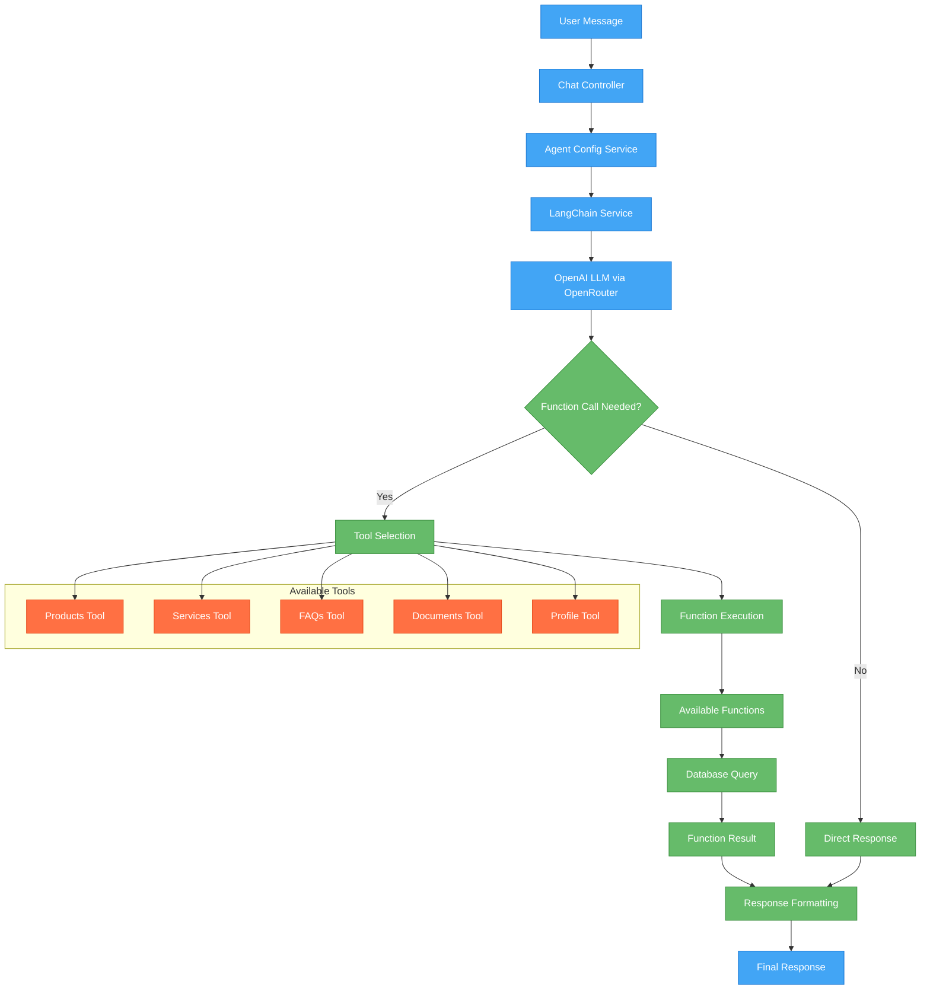

# LangChain Workflow Documentation

## Overview

This document explains how LangChain is implemented in the AI4Devs Final Project to power the Sofia AI assistant. The system uses LangChain's agent framework with function calling capabilities to provide intelligent responses to customer inquiries.

## Key LangChain Implementation Highlights

### 🎯 Prompt-Driven Function Execution
The system uses a sophisticated prompt that intelligently routes user queries to appropriate functions based on context and intent. The AI agent analyzes the user's message and automatically selects the most relevant function to execute:

- **Products**: Uses traditional RAG (Retrieval-Augmented Generation) with database queries and filtering
- **Services, FAQs, Documents**: Use semantic embedding search for contextual understanding
- **Profile**: Direct database retrieval for company information

### 🔍 RAG vs Embedding Approaches

**Products Function (RAG Approach):**
- Direct database queries with SQL-like filtering
- Keyword matching and category-based search
- Structured data retrieval with price ranges, categories, and tags
- Fast and precise for structured product catalogs

**Services/FAQs/Documents Functions (Embedding Approach):**
- Vector embeddings for semantic similarity search
- Natural language understanding beyond keyword matching
- Contextual relevance scoring
- Better for unstructured content and conversational queries

### 🚀 Three Key Advantages of LangChain Implementation

#### 1. **Intelligent Function Orchestration**
LangChain automatically determines which function to call based on user intent, eliminating the need for hardcoded routing logic. The agent understands context and can chain multiple function calls when needed.

#### 2. **Seamless Conversation Flow**
The two-stage LLM workflow ensures natural conversation continuity. The first stage handles function execution, while the second stage formats responses in a conversational manner, maintaining context and personality.

#### 3. **Dynamic Tool Management**
Tools can be added, modified, or removed without changing core logic. The system dynamically loads available functions and their descriptions, making it highly extensible and maintainable.

## 🧠 Memory and Conversation History Management

### How LangChain Handles Memory

LangChain manages conversation memory through **MessagesPlaceholder** system:

```typescript
const prompt = ChatPromptTemplate.fromMessages([
  ['system', this.config.prompt],           // System instructions
  new MessagesPlaceholder('chat_history'),  // Previous conversation
  ['human', '{input}'],                     // Current user input
  new MessagesPlaceholder('agent_scratchpad') // Agent's working memory
]);
```

### Key Memory Features

#### ✅ **Contextual Understanding**
- Sofia remembers previous questions and answers
- Maintains topic continuity across exchanges
- References user preferences mentioned earlier

#### ✅ **Function Call Context**
- Remembers what functions were called previously
- Avoids redundant database queries
- Can build upon previous search results

#### ✅ **Smart Memory Management**
- **Short-term Memory (LangChain)**: Current conversation context
- **Long-term Memory (Database)**: Product catalog, customer profiles, FAQ knowledge
- **Token Control**: Automatic conversation length management

### Example: Memory in Action

```
User: "Do you have Italian wine?"
Sofia: [Calls getProducts] "Yes! We have Chianti Classico €18.50, Barolo..."

User: "What about shipping for the Chianti?"
Sofia: [Remembers Chianti price] "Since Chianti is €18.50, shipping costs apply. Free shipping starts at €50..."
```

## Architecture Overview



## Core Components

### 1. LangChain Service (`langchainService.ts`)

The main orchestrator that manages the AI agent and tools.

**Key Features:**
- Initializes OpenAI LLM with OpenRouter configuration
- Creates and manages function calling tools
- Processes chat messages with conversation history
- Handles agent execution with retry logic

**Configuration:**
```typescript
interface LangChainConfig {
  model: string;           // e.g., "openai/gpt-3.5-turbo"
  temperature: number;     // 0.0 - 1.0
  maxTokens: number;       // Response length limit
  topP: number;           // Nucleus sampling parameter
  prompt: string;         // System prompt from database
}
```

### 2. Chat Controller (`chat.controller.ts`)

Handles HTTP requests and orchestrates the two-stage LLM workflow.

**Two-Stage Workflow:**
1. **First LLM Call**: Determines if function calling is needed and which function to call
2. **Second LLM Call**: Formats the final response with function results and conversation context

**Process Flow:**
```typescript
// Stage 1: Function Detection & Execution
const response = await aiService.generateChatCompletion(messages, model, {
  tools: functionDefinitions,
  toolChoice: 'auto'
});

// Stage 2: Response Formatting (if function was called)
if (response.tool_calls) {
  const functionResult = await executeFunction(functionCall);
  const formattedResponse = await aiService.generateChatCompletion(
    [...messages, functionResult], 
    model
  );
}
```

### 3. Available Functions (`availableFunctions.ts`)

Core business logic functions that tools can execute.

**Functions:**
- `getProducts(filters)` - Product search and filtering
- `getServices(filters)` - Service information retrieval
- `getFAQs(filters)` - FAQ search with semantic embeddings
- `getDocuments(params)` - Document search and retrieval
- `getCompanyInfo()` - Company profile information

## Message Flow

### 1. Request Processing
```typescript
// Validate incoming request
const { messages } = chatRequestSchema.parse(req.body);
const lastUserMessage = messages.find(msg => msg.role === 'user');
```

### 2. Configuration Loading
```typescript
// Load agent configuration from database
const agentConfig = await this.agentConfigService.getLatestConfig();
```

### 3. System Prompt Injection
```typescript
// Add system prompt with function calling guidelines
const systemPrompt = `${agentConfig.systemPrompt}

🎯 FUNCTION CALLING GUIDELINES:
- For product questions → use getProducts
- For service questions → use getServices  
- For policy/shipping/FAQ questions → use getFAQs
- For document/regulation questions → use getDocuments
- For company information → use getCompanyInfo`;
```

### 4. AI Processing
```typescript
// First LLM call with function calling
const response = await aiService.generateChatCompletion(messages, model, {
  tools: functionDefinitions,
  toolChoice: 'auto'
});
```

### 5. Function Execution (if needed)
```typescript
if (response.tool_calls) {
  for (const toolCall of response.tool_calls) {
    const functionName = toolCall.function.name;
    const functionArgs = JSON.parse(toolCall.function.arguments);
    const functionResult = await availableFunctions[functionName](functionArgs);
  }
}
```

## Function Calling Examples

### Product Search
**User Input:** "Do you have wine under 20 euros?"

**Function Call:**
```json
{
  "name": "getProducts",
  "arguments": {
    "search": "wine",
    "priceMax": 20
  }
}
```

**Function Result:**
```json
{
  "total": 5,
  "products": [
    {
      "id": 1,
      "name": "Chianti Classico",
      "price": "18.50",
      "category": "Wine",
      "description": "Traditional Tuscan red wine..."
    }
  ]
}
```

### FAQ Search
**User Input:** "What's your shipping policy?"

**Function Call:**
```json
{
  "name": "getFAQs",
  "arguments": {
    "search": "shipping policy"
  }
}
```

**Function Result:**
```json
{
  "faqs": [
    {
      "question": "What is your shipping policy?",
      "answer": "We offer free shipping on orders over €50...",
      "category": "Shipping"
    }
  ]
}
```

## 🎯 Main Orchestrator Flow - ASCII Diagram

```
┌─────────────────────────────────────────────────────────────────────────────────┐
│                    🎯 MAIN ORCHESTRATOR (Chat Controller)                      │
│                         Complete Flow Control                                  │
└─────────────────────────────────────────────────────────────────────────────────┘
                                    │
                                    ▼
┌─────────────────────────────────────────────────────────────────────────────────┐
│  📥 INPUT: "Avete vino sotto i 20 euro?"                                      │
└─────────────────────────────────────────────────────────────────────────────────┘
                                    │
                                    ▼
┌─────────────────────────────────────────────────────────────────────────────────┐
│                        🧠 ORCHESTRATOR CALLS AI MODEL                         │
│  const response = await aiService.generateChatCompletion(...)                  │
│  → AI analyzes intent and decides: getProducts({search:"wine", maxPrice:20})   │
└─────────────────────────────────────────────────────────────────────────────────┘
                                    │
                                    ▼
┌─────────────────────────────────────────────────────────────────────────────────┐
│                          ⚡ ORCHESTRATOR EXECUTES FUNCTION                     │
│  const functionResult = await availableFunctions.getProducts(functionArgs)     │
│  → Database query executed, products retrieved                                 │
└─────────────────────────────────────────────────────────────────────────────────┘
                                    │
                                    ▼
┌─────────────────────────────────────────────────────────────────────────────────┐
│                    🎯 ORCHESTRATOR RECEIVES FUNCTION RESULT                    │
│  {                                                                             │
│    "total": 5,                                                                │
│    "products": [                                                              │
│      {"name": "Chianti Classico", "price": "18.50", ...},                    │
│      {"name": "Pinot Grigio", "price": "16.90", ...}                         │
│    ]                                                                          │
│  }                                                                             │
└─────────────────────────────────────────────────────────────────────────────────┘
                                    │
                                    ▼
┌─────────────────────────────────────────────────────────────────────────────────┐
│                    🎯 ORCHESTRATOR CALLS FORMATTER MODEL                      │
│  // Updates messages array with function result                               │
│  messages.push({role: "tool", content: JSON.stringify(functionResult)})       │
│  messages.push({role: "system", content: "Format as Sofia..."})               │
│                                                                                │
│  const formattedResponse = await aiService.generateChatCompletion(...)        │
│  → AI formats response with Sofia personality and Italian warmth              │
└─────────────────────────────────────────────────────────────────────────────────┘
                                    │
                                    ▼
┌─────────────────────────────────────────────────────────────────────────────────┐
│                    🎯 ORCHESTRATOR RECEIVES FORMATTED RESPONSE                 │
│  const finalMessage = formattedResponse.choices[0].message;                    │
│                                                                                │
│  "Certo! Abbiamo questi ottimi vini sotto €20:                               │
│   • **Chianti Classico** - €18.50 🍷                                         │
│   • **Pinot Grigio** - €16.90 🍷                                             │
│   Which one interests you most? I can help you with more information!"         │
└─────────────────────────────────────────────────────────────────────────────────┘
                                    │
                                    ▼
┌─────────────────────────────────────────────────────────────────────────────────┐
│                    🎯 ORCHESTRATOR RETURNS FINAL RESPONSE                     │
│  return res.json({                                                            │
│    message: finalMessage,                                                     │
│    debug: debugInfo                                                           │
│  });                                                                          │
└─────────────────────────────────────────────────────────────────────────────────┘
                                    │
                                    ▼
┌─────────────────────────────────────────────────────────────────────────────────┐
│  📱 FINAL RESPONSE TO USER                                                     │
│  Via WhatsApp/Frontend                                                         │
└─────────────────────────────────────────────────────────────────────────────────┘

┌─────────────────────────────────────────────────────────────────────────────────┐
│                            🔄 ORCHESTRATOR CONTROL FLOW                        │
├─────────────────────────────────────────────────────────────────────────────────┤
│                                                                                 │
│  1. 🎯 ORCHESTRATOR → Calls AI model for function decision                    │
│  2. ⚡ ORCHESTRATOR → Executes selected function                              │
│  3. 🎯 ORCHESTRATOR → Receives function result                               │
│  4. 🎯 ORCHESTRATOR → Calls AI model for response formatting                 │
│  5. 🎯 ORCHESTRATOR → Receives formatted response                            │
│  6. 🎯 ORCHESTRATOR → Returns final response to user                         │
│                                                                                 │
│  KEY INSIGHT: The orchestrator maintains complete control throughout the      │
│               entire flow. It calls both AI models and receives all results. │
│               The formatted response ALWAYS returns to the orchestrator       │
│               before being sent to the user.                                  │
│                                                                                 │
└─────────────────────────────────────────────────────────────────────────────────┘

