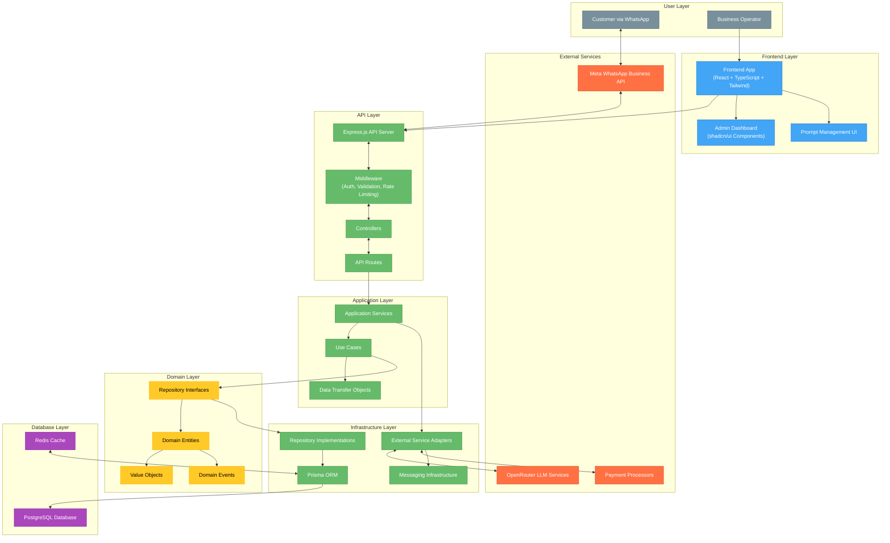
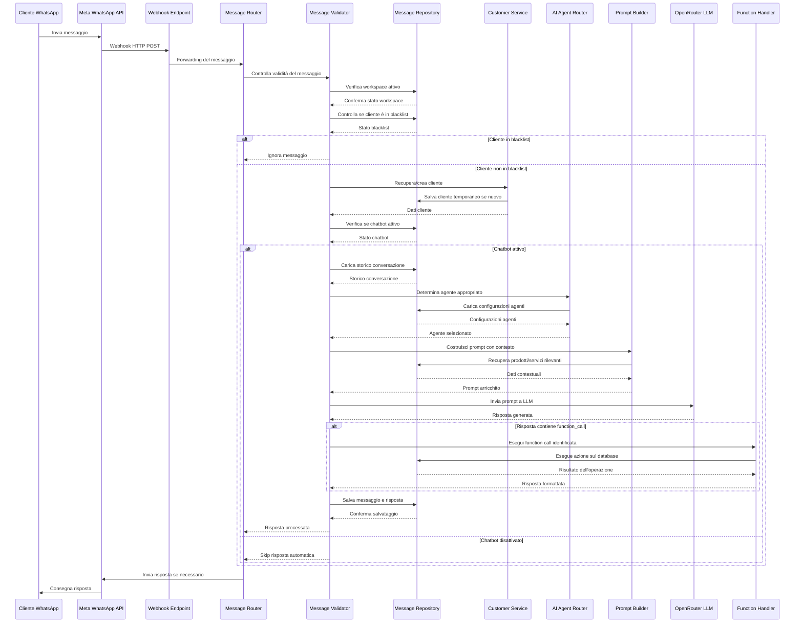
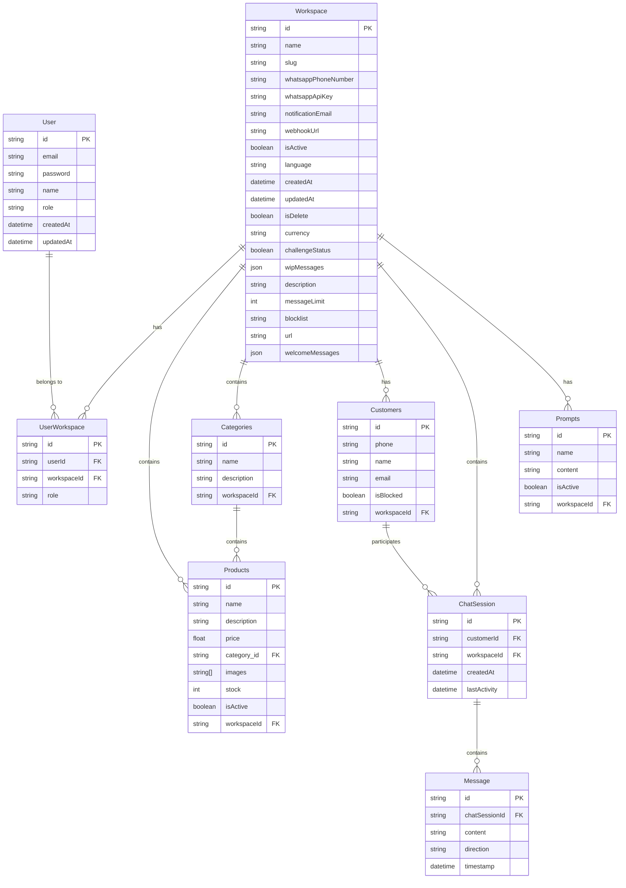

# ShopMe - WhatsApp E-commerce Platform PRD

## Table of Contents
- [Introduction](#introduction)
  - [Short Description](#short-description)
  - [Key Advantages](#key-advantages)
  - [Push Notifications](#push-notifications)
- [Key Differentiators and Unique Selling Points](#key-differentiators-and-unique-selling-points)
  - [Unified Commerce and Customer Care Platform](#unified-commerce-and-customer-care-platform)
- [Core Functionality](#core-functionality)
  - [Multi-tenant Business Platform](#1-multi-tenant-business-platform-priority-must-have)
  - [Products Management](#2-products-management-priority-must-have)
  - [Categories Management](#3-categories-management-priority-must-have)
  - [Offers Management](#4-offers-management-priority-should-have)
  - [Settings Management](#5-settings-management-priority-must-have)
  - [WhatsApp AI Integration](#6-whatsapp-ai-integration-priority-must-have)
  - [GDPR Compliance](#7-gdpr-compliance-priority-must-have)
- [AI and LLM Implementation](#ai-and-llm-implementation)
  - [LLM Integration](#llm-integration)
  - [OpenRouter Integration and Data Protection](#openrouter-integration-and-data-protection)
  - [WhatsApp Challenge Settings](#whatsapp-challenge-settings)
  - [Custom Challenge Creation](#custom-challenge-creation)
- [Out of Scope Features (WIP)](#out-of-scope-features-wip)
- [Minimum Marketable Product (MMP)](#minimum-marketable-product-mmp)
  - [Function Call Documentation](#function-call-documentation)
- [Monitoring Plans](#monitoring-plans)
- [Technical Architecture](#technical-architecture)
  - [Meta WhatsApp Business API Integration](#meta-whatsapp-business-api-integration)
  - [Operator Dashboard Interface](#operator-dashboard-interface)
  - [Architecture Diagram](#architecture-diagram)
  - [Frontend](#frontend)
  - [Backend](#backend)
  - [Database](#database)
  - [Authentication and Token Management](#authentication-and-token-management)
  - [Domain-Driven Design Architecture](#domain-driven-design-architecture)
  - [Project Structure](#project-structure)
  - [Database Seeding and Migrations](#database-seeding-and-migrations)
  - [Additional Technical Considerations](#additional-technical-considerations)
  - [WhatsApp Messaging Flow](#whatsapp-messaging-flow)
  - [Message Sequence Diagram](#message-sequence-diagram)
- [Conversation Examples](#conversation-examples)
  - [Product Discovery and Purchase](#product-discovery-and-purchase)
  - [Order Status and Invoice Request](#order-status-and-invoice-request)
  - [Multi-language Support Example](#multi-language-support-example)
  - [Restaurant Use Case](#restaurant-use-case-table-reservation)
  - [Hotel Use Case](#hotel-use-case-room-booking-and-information)
  - [Event Booking Use Case](#event-booking-use-case-fitness-class-registration)
- [Vertical Market Adaptability](#vertical-market-adaptability)
- [API Endpoints](#api-endpoints)
  - [API Rate Limiting Implementation](#api-rate-limiting-implementation)
  - [Authentication](#authentication)
  - [Workspace Management](#workspace-management)
  - [Product Management](#product-management)
  - [Category Management](#category-management)
  - [Prompt Management](#prompt-management)
  - [WhatsApp Integration](#whatsapp-integration)
  - [Chat Management](#chat-management)
  - [Customer Management](#customer-management)
  - [Service Management](#service-management)
- [Data Model](#data-model)
- [Security](#security)
  - [Anti-Abuse System](#anti-abuse-system)
  - [Rate Limiting Controls](#rate-limiting-controls)
  - [Data Encryption](#data-encryption)
  - [Secure Data Handling with Tokenization](#secure-data-handling-with-tokenization)
- [Compliance and Privacy](#compliance-and-privacy)
  - [GDPR Compliance](#gdpr-compliance)
  - [User Preference and Account Deletion](#user-preference-and-account-deletion)
- [Competitive Analysis](#competitive-analysis)
  - [Market Overview](#market-overview)
  - [Direct Competitor Comparison](#direct-competitor-comparison)
  - [Key Differentiators](#key-differentiators)
  - [Market Gap Addressed](#market-gap-addressed)
  - [Supporting Industry Trends](#supporting-industry-trends)

## INTRODUCTION

### Short Description
ShopMe transforms e-commerce by integrating shopping experiences directly into WhatsApp. Customers can browse products, receive personalized recommendations, and complete purchases through natural conversations, without needing to navigate websites or download apps. Our AI-powered platform delivers 24/7 customer service with remarkably human-like interactions.

### Key Advantages
- **24/7 Customer Service**: AI-powered chatbots provide immediate responses anytime, ensuring customer inquiries never go unanswered and sales opportunities are never missed
- **Increased Conversion Rates**: Reducing friction in the purchase journey and providing personalized assistance helps businesses convert more inquiries into sales
- **Enhanced Customer Engagement**: Natural language conversations create more engaging and human-like interactions compared to traditional e-commerce interfaces
- **Operational Efficiency**: Automating routine requests and processes reduces staff workload and operational costs while improving response times
- **Valuable Customer Insights**: Each conversation generates valuable data that helps businesses understand customer preferences and improve their offerings over time
- **Scalability Without Complexity**: The SaaS model enables businesses of any size to implement sophisticated e-commerce capabilities without technical expertise or significant investment

### Push Notifications
The platform includes a comprehensive push notification system that enables businesses to:
- Send targeted messages based on customer history
- Automatically remind customers about upcoming appointments/bookings
- Reach out to inactive customers through re-engagement campaigns
- Announce limited-time offers and discounts
- Update customers on loyalty points, rewards, and milestones
- Inform customers about upcoming events or new services

## KEY DIFFERENTIATORS AND UNIQUE SELLING POINTS

### Unified Commerce and Customer Care Platform
ShopMe stands apart by seamlessly integrating two traditionally separate systems—e-commerce and customer service—into a single, cohesive platform within WhatsApp. This unified approach delivers several powerful advantages:

#### The Converging Power of E-Commerce and Customer Care
- **Single Conversation Thread**: Customers navigate products, ask questions, and complete purchases within a single chat thread rather than switching between apps or websites
- **Contextual Memory**: The system remembers past interactions, enabling personalized recommendations and support based on purchase history and preferences
- **Full Journey Capabilities**: From discovery and consideration to purchase, support, and re-engagement—all managed through the same interface
- **Seamless Transition**: Handoffs between AI automation and human agents occur without disruption to the customer experience

#### Leveraging WhatsApp's Unique Advantages
- **2.7+ Billion Active Users**: Reach customers where they already spend time, eliminating the barrier of app downloads
- **98% Message Open Rate**: WhatsApp messages have dramatically higher engagement than email (20%) or app notifications (5-10%)
- **Rich Media Support**: Share product catalogs, videos, images, and interactive buttons within the familiar WhatsApp interface
- **Persistent Connection**: Unlike website visits that end when a user leaves, WhatsApp conversations create ongoing engagement opportunities
- **Global Accessibility**: Available in regions where smartphone penetration is high but app/website commerce adoption remains low

#### Measurable Business Impact
Based on preliminary testing, businesses using ShopMe have experienced:
- **42% Higher Conversion Rate**: Compared to traditional e-commerce websites
- **67% Reduction in Response Time**: For customer inquiries and support requests
- **28% Increase in Average Order Value**: Through contextual product recommendations
- **53% Decrease in Cart Abandonment**: Due to conversational reminders and obstacle removal
- **3.2x Higher Customer Retention**: From improved engagement and personalized follow-ups

#### AI Commerce Use Cases Beyond Traditional Retail
The ShopMe platform enables unique commerce scenarios impossible with traditional e-commerce:
- **Interactive Product Discovery**: "I'm looking for a gift for my mom who loves cooking Italian food"
- **Personalized Recommendations**: "Based on your past purchases, you might enjoy these new arrivals..."
- **Contextual Problem Solving**: "The shirt I bought is too small, can I exchange it?"
- **Anticipatory Service**: "I notice your order will arrive tomorrow. Would you like preparation instructions?"
- **Relationship Building**: "It's been a month since your purchase. How are you enjoying your new espresso machine?"

By blending commerce capabilities with conversational AI within the world's most popular messaging platform, ShopMe delivers a fundamentally different approach to digital commerce—one that's more natural, accessible, and effective than traditional e-commerce solutions.

## CORE FUNCTIONALITY

### 1. Multi-tenant Business Platform (Priority: Must-have)
- **Purpose**: Enable multiple businesses to operate independently on the platform
- **Capabilities**:
  - Workspace creation and management
  - Multi-language support (IT, EN, ES)
  - White-label customization
  - Role-based access control
  - Customizable business hours
- **Technical Requirements**:
  - Data isolation between tenants
  - Tenant-specific configuration storage
  - Resource usage monitoring per tenant

### 2. Products Management (Priority: Must-have)
- **Purpose**: Allow businesses to showcase and sell their products
- **Capabilities**:
  - Complete CRUD operations for product management
  - Detailed product information including images, descriptions, and pricing
  - Product categorization and tagging
  - Inventory management capabilities
  - Product visibility controls
  - Custom fields for industry-specific attributes
- **User Interaction**:
  - Intuitive web interface for product management
  - Bulk import/export functionality
  - Product preview in WhatsApp format
- **Integration Points**:
  - Categories system
  - Offers engine
  - WhatsApp conversation flow

### 3. Categories Management (Priority: Must-have)
- **Purpose**: Organize products in a logical structure for easy navigation
- **Capabilities**:
  - Hierarchical category structure (parent/child relationships)
  - Category-specific attributes and settings
  - Category-based navigation in chat interface
  - Featured categories for promotions
  - Automatic product suggestions based on category browsing
- **User Interaction**:
  - Drag-and-drop category reordering
  - Category visibility toggles
  - Category performance metrics
- **Integration Points**:
  - Products system
  - AI recommendation engine
  - Search functionality

### 4. Offers Management (Priority: Should-have)
- **Purpose**: Create promotional campaigns to drive sales
- **Capabilities**:
  - Time-limited promotional campaigns
  - Discount code generation and management
  - Bundle deals configuration
  - Seasonal or special event promotions
  - Targeted offers based on customer segments
  - Performance tracking for promotional activities
- **User Interaction**:
  - Campaign creation wizard
  - Visual campaign timeline
  - A/B testing interface (future)
- **Integration Points**:
  - Products and categories
  - Customer segmentation
  - WhatsApp messaging

### 5. Settings Management (Priority: Must-have)
- **Purpose**: Configure and customize the platform behavior
- **Capabilities**:
  - Workspace configuration (name, logo, description)
  - WhatsApp API connection settings
  - Language and currency preferences
  - Notification preferences
  - User role and permission management
  - System behavior customization
  - Rate limiting configuration and monitoring
  - Message volume controls and thresholds
- **User Interaction**:
  - Settings dashboard with categorical organization
  - Configuration validation
  - Changes audit log
  - Usage statistics and threshold visualization
- **Technical Requirements**:
  - Secure storage of API keys
  - Real-time configuration updates
  - Configuration version control
  - Rate limiting enforcement mechanisms

### 6. WhatsApp AI Integration (Priority: Must-have)
- **Purpose**: Enable natural conversations with customers through WhatsApp
- **Capabilities**:
  - AI-powered response generation
  - Product recommendations
  - FAQ handling
  - Conversational commerce
  - Context-aware interactions
  - Multi-language support
- **User Interaction**:
  - Prompt configuration interface
  - Conversation testing tools
  - Conversation monitoring dashboard
- **Technical Requirements**:
  - OpenRouter API integration
  - Conversation state management
  - High-availability messaging infrastructure

### 7. GDPR Compliance (Priority: Must-have)
- **Purpose**: Ensure regulatory compliance and protect user data
- **Capabilities**:
  - Consent management system
  - Data processing records
  - Right to access implementation
  - Right to be forgotten procedures
  - Data minimization practices
  - Privacy policy and terms generator
  - Data breach notification workflow
- **User Interaction**:
  - Consent collection interfaces
  - Data access request handling
  - Privacy settings management
- **Technical Requirements**:
  - Secure data storage
  - Data anonymization capabilities
  - Audit trail for compliance actions

## AI AND LLM IMPLEMENTATION

### LLM Integration
The platform leverages Large Language Models through OpenRouter with Retrieval Augmented Generation (RAG) capabilities:

- **Context-Aware Responses**: LLM understands conversation history and user preferences to provide relevant responses
- **Product Knowledge**: Automatically retrieves and references product information when answering customer queries
- **Personalization**: Tailors responses based on customer history and preferences
- **Multi-language Support**: Automatic translation capabilities for serving international customers
- **Intent Recognition**: Identifies customer needs even when expressed in different ways
- **Sentiment Analysis**: Detects customer satisfaction levels and escalates when necessary

### OpenRouter Integration and Data Protection
The platform uses OpenRouter for accessing powerful LLM capabilities while maintaining strict data protection:

- **Data Pseudonymization**: All personal identifiable information (PII) is replaced with tokens before being sent to OpenRouter
- **Tokenization Process**: A two-way mapping system replaces sensitive data with non-identifying tokens
- **Local Data Processing**: Personal data remains on ShopMe servers and is never exposed to external AI services
- **Token Mapping**: After receiving responses, the system replaces tokens with original data before delivery to customers
- **Audit Trails**: All tokenization and de-tokenization activities are logged for security monitoring
- **Compliance Validation**: Regular audits ensure no personal data is inadvertently transmitted to external services

### WhatsApp Challenge Settings
The WhatsApp Challenge feature provides customization options for businesses:

- **Active/Inactive Toggle**: Enable or disable the WhatsApp service as needed
- **Welcome Messages**: Configurable in multiple languages (IT, EN, ES)
- **Work-in-Progress Messages**: Customizable maintenance messages when service is temporarily unavailable
- **Message Limit**: Configurable limits for anti-abuse protection (default: 50)
- **Blocklist Management**: Interface for managing blocked phone numbers
- **Debug Mode**: Test functionality without affecting production environment
- **Custom Prompts**: Ability to customize AI behavior through prompt engineering

### Custom Challenge Creation
Each user can create and manage WhatsApp challenges with:

- **Multiple Agent Personas**: Configure different AI personalities for various business scenarios
- **Prompt Testing**: Test different prompts in isolated sessions without affecting production
- **Prompt Duplication**: Copy existing prompts to create variations or backups
- **Context Window Management**: Control how much conversation history the AI considers
- **Response Templates**: Create template responses for common scenarios
- **Custom Variables**: Insert dynamic content into prompts based on user data

## OUT OF SCOPE FEATURES (WIP)

The following features are currently marked as "Work in Progress" and are outside the scope of the initial release:

### Orders Management
- Order processing and tracking
- Order status management
- Invoice generation and management
- Shipping integration and tracking
- Returns and refund processing

### Analytics
- Real-time analytics dashboard
- Custom report generation
- Data visualization tools
- Export capabilities
- Performance metrics and KPIs

### Advanced Push Notifications
- A/B testing for notification content
- Advanced segmentation based on behavior
- Rich media notifications
- Location-based targeting
- Frequency optimization

### Payment Integration
- Integrated payment processing
- Payment plan implementation
- Subscription management
- Payment gateway integration
- Fraud prevention tools

## MINIMUM MARKETABLE PRODUCT (MMP)

The following features are planned for the MMP phase, after the initial MVP release:

### Enhanced Orders Management
- Complete order lifecycle management
- Order fulfillment workflows
- Custom order statuses
- Automated order notifications
- Bulk order processing capabilities

### Advanced Analytics Dashboard
- Customer behavior analysis
- Conversion funnel visualization
- Revenue and sales performance tracking
- Chat quality and sentiment analysis
- Custom report builder with export options

### Full Payment Integration
- Multiple payment gateway integrations
- Saved payment methods for customers
- Subscription and recurring payment handling
- Advanced fraud detection and prevention
- Automated refund processing

### Multi-Agent Collaboration
- Team inbox with shared conversation access
- Agent routing and assignment rules
- Supervisor monitoring and intervention tools
- Agent performance metrics and reporting
- Shift management and availability tracking

### Enhanced AI Capabilities
- Advanced sentiment analysis and emotional intelligence
- Proactive customer outreach based on behavior
- Personalized product recommendations based on preferences
- Automated follow-up sequences for abandoned carts
- A/B testing of different AI prompts and approaches

### Function Call Documentation

The system implements several AI function calls to handle specific operations:

```
+-------------------------+--------------------------------------+----------------+
| FUNCTION NAME           | DESCRIPTION                          | STATUS         |
+-------------------------+--------------------------------------+----------------+
| get_product_info        | Get details about a specific product | Implemented    |
+-------------------------+--------------------------------------+----------------+
| get_event_by_date       | Get events scheduled for a date      | Implemented    |
+-------------------------+--------------------------------------+----------------+
| get_service_info        | Get details about a specific service | Implemented    |
+-------------------------+--------------------------------------+----------------+
| welcome_user            | Generate welcome message for users   | Implemented    |
+-------------------------+--------------------------------------+----------------+
| create_order            | Create a new order from cart items   | Implemented    |
+-------------------------+--------------------------------------+----------------+
| get_cart_info           | Get contents of a user's cart        | Implemented    |
+-------------------------+--------------------------------------+----------------+
| get_order_status        | Check status of specific order       | Implemented    |
+-------------------------+--------------------------------------+----------------+
| add_to_cart             | Add product to shopping cart         | Implemented    |
+-------------------------+--------------------------------------+----------------+
| remove_from_cart        | Remove product from shopping cart    | Implemented    |
+-------------------------+--------------------------------------+----------------+
| get_product_list        | Get list of available products       | Implemented    |
+-------------------------+--------------------------------------+----------------+
| get_products_by_category| Get products filtered by category    | Planned        |
+-------------------------+--------------------------------------+----------------+
| get_categories          | Get list of all product categories   | Planned        |
+-------------------------+--------------------------------------+----------------+
| get_faq_info            | Get information from FAQ database    | Implemented    |
+-------------------------+--------------------------------------+----------------+
| get_generic_response    | Handle general conversation/fallback | Implemented    |
+-------------------------+--------------------------------------+----------------+
```

Additional function calls planned for the MMP phase:

```
+-------------------------+--------------------------------------+----------------+
| FUNCTION NAME           | DESCRIPTION                          | STATUS         |
+-------------------------+--------------------------------------+----------------+
| checkOrderStatus        | Get detailed order status info       | Planned for MMP|
+-------------------------+--------------------------------------+----------------+
| listRecentOrders        | List customer's most recent orders   | Planned for MMP|
+-------------------------+--------------------------------------+----------------+
| orderDetails            | Get complete order details           | Planned for MMP|
+-------------------------+--------------------------------------+----------------+
| trackShipment           | Get real-time shipping information   | Planned for MMP|
+-------------------------+--------------------------------------+----------------+
| requestInvoice          | Generate and send order invoice      | Planned for MMP|
+-------------------------+--------------------------------------+----------------+
| listInvoices            | List available customer invoices     | Planned for MMP|
+-------------------------+--------------------------------------+----------------+
| downloadInvoice         | Generate invoice download link       | Planned for MMP|
+-------------------------+--------------------------------------+----------------+
| changeInvoiceAddress    | Update invoice billing details       | Planned for MMP|
+-------------------------+--------------------------------------+----------------+
```

## MONITORING PLANS

The platform offers three monitoring plans to ensure optimal performance and security:

### 1. Basic Monitoring (Included)
- System uptime monitoring
- Error rate tracking
- Basic performance metrics
- Daily status reports
- Automated alerts for critical issues

### 2. Advanced Monitoring (Premium)
- Real-time performance dashboards
- User experience monitoring
- Resource utilization tracking
- Anomaly detection
- Custom alert configurations
- Weekly performance reports

### 3. Enterprise Monitoring (Enterprise)
- Comprehensive security monitoring
- Advanced threat detection
- Custom metrics and KPIs
- Business impact analysis
- 24/7 monitoring team
- Monthly executive reports
- Predictive analytics for resource planning

## TECHNICAL ARCHITECTURE

### Meta WhatsApp Business API Integration
For the MVP phase, the following approach will be implemented for WhatsApp integration:

- **WhatsApp Business API Playground**: Initial implementation will use Meta's WhatsApp Business API Playground for testing and demonstration
- **Webhook Implementation**: Backend will implement the required webhook endpoints to receive and process WhatsApp messages
- **Message Flow**: System will process incoming messages, generate responses through OpenRouter, and send replies via WhatsApp API
- **API Authentication**: Security credentials will be stored in encrypted format within each workspace configuration
- **Future Integration**: Full Meta WhatsApp Business API integration planned for post-MVP phase
- **Testing Numbers**: Limited set of WhatsApp numbers will be available during MVP for demonstration purposes
- **Sandbox Environment**: Messages sent to these numbers will be processed in a sandboxed environment

### Operator Dashboard Interface
The platform provides a comprehensive operator dashboard with the following capabilities:

- **Chat Management**:
  - View all active and past customer conversations
  - Real-time chat notifications
  - Chat history with full context
  - Message search functionality
  - Visual indicators for new/unread messages
  - Ability to take over conversations from AI

- **Chatbot Controls**:
  - Activate/deactivate the WhatsApp chatbot for the entire workspace
  - Individual customer-level chatbot toggle
  - Test chatbot responses before deploying
  - Monitor chatbot performance metrics
  - View and edit active prompts

- **Customer Management**:
  - Complete customer profile viewing
  - Edit customer information and preferences
  - View customer interaction history
  - Block/unblock problematic customers
  - Customer segmentation for targeted campaigns

- **Product and Offer Management**:
  - Add/edit/remove products from catalog
  - Create and manage product categories
  - Configure time-limited promotional offers
  - Upload and manage product images
  - Set pricing and inventory levels

- **Supplier Management**:
  - Add and manage product suppliers
  - Track supplier information and contacts
  - Associate products with suppliers
  - View supplier-specific product listings

- **Analytics Dashboard**:
  - Overview of key performance metrics
  - Conversation volume trends
  - Customer engagement statistics
  - Product interest analytics
  - AI performance monitoring

- **Multi-Agent Capabilities** (Out of Scope for MVP):
  - Multiple operators working simultaneously on the same workspace
  - Chat assignment and reassignment between agents
  - Agent presence indicators and activity tracking
  - Role-based access controls for different agent types
  - Agent performance analytics and workload distribution

### Frontend
- **Framework**: React with Vite for ultra-fast HMR
- **Styling**: Tailwind CSS with shadcn/ui components
- **Language**: TypeScript for type safety
- **State Management**: React Context API and hooks
- **Testing**: Jest and React Testing Library
- **Build Tool**: Vite
- **Package Manager**: NPM

### Backend
- **Runtime**: Node.js with Express.js
- **Architecture**: Domain Driven Design (DDD) pattern
- **Language**: TypeScript
- **API**: RESTful with OpenAPI specification
- **Authentication**: JWT with HTTP-only cookies
- **Monorepo Structure**: Managed with Turborepo
- **Validation**: Joi for schema validation
- **Testing**: Jest and Supertest

### Architecture Diagram



#### Architecture Pattern and Rationale

ShopMe uses a Domain-Driven Design (DDD) architecture with clean separation of concerns across multiple layers. This architecture was chosen for several reasons:

**Benefits:**

1. **Business Focus**: Places core business concepts at the center of the application, making it easier to align with stakeholder goals
2. **Scalability**: Clear layer separation allows independent scaling of different components
3. **Maintainability**: Well-defined boundaries between layers make the codebase easier to maintain
4. **Testability**: Each layer can be tested in isolation without dependencies on other layers
5. **Flexibility**: External services can be swapped without affecting the core domain logic
6. **Multi-tenant Design**: Supports clean isolation between different businesses on the platform
7. **Security**: Layered approach helps implement security controls at appropriate levels

**Trade-offs:**

1. **Initial Complexity**: More boilerplate and indirection compared to simpler architectures
2. **Learning Curve**: Team members need to understand DDD concepts
3. **Development Speed**: May slow initial development compared to more rapid approaches
4. **Performance Overhead**: Additional abstraction layers can introduce minor performance costs
5. **Decision Overhead**: Requires more architectural decisions during development

The architecture's strengths in maintainability, scalability, and business alignment outweigh these trade-offs for a complex, multi-tenant application like ShopMe that handles sensitive customer data and complex business processes.

### Database
- **Primary Database**: PostgreSQL
- **ORM**: Prisma for type-safe database access
- **Cache Layer**: Redis for performance optimization
- **Migrations**: Prisma Migration for version control
- **Backup Strategy**: Automated daily backups with point-in-time recovery

### Authentication and Token Management

The application implements a secure JWT (JSON Web Token) based authentication system:

- **Token Structure**:
  - Access tokens with 1-hour expiration
  - Refresh tokens with 7-day expiration
  - Tokens stored in HTTP-only cookies for XSS protection
  - CSRF protection implemented for security

- **Token Flow**:
  - Initial authentication generates both access and refresh tokens
  - Access token used for API authorization
  - Refresh token used to obtain new access tokens without re-authentication
  - Token revocation on logout

- **Security Measures**:
  - Secret keys rotated regularly
  - Token signing with HS256 algorithm
  - Token payload minimization (only essential claims)
  - Validation of token source through HTTP headers
  - Rate limiting on token endpoints

- **Permission Model**:
  - Role-based access control (Admin, Manager, Agent)
  - Resource-level permission checking
  - Workspace-scoped authorization
  - Audit logging of authentication events

- **Secure Link Generation**:
  - One-hour temporary security tokens for sensitive operations
  - Encrypted payload containing operation type, resource ID, and timestamp
  - URL-safe token format for easy sharing via messaging
  - Single-use tokens for critical operations (payments, document access)
  - IP-based validation for additional security layer
  - Automatic invalidation after use or expiration
  - Token verification prior to any sensitive data access

### Domain-Driven Design Architecture

The backend follows a Domain-Driven Design (DDD) architecture as specified in the project's ARCHITECTURE.md:

- **Layer Separation**:
  - **Domain Layer**: Core business entities and rules
  - **Application Layer**: Use cases and application services
  - **Infrastructure Layer**: Technical implementations and external services
  - **Interfaces Layer**: API controllers and routes

- **Key Design Principles**:
  - Business domain at the center of design
  - Clear boundaries between layers
  - Repository pattern for data access
  - Dependency inversion principle

- **Data Flows**:
  - External requests enter through Interfaces layer
  - Controllers delegate to Application services
  - Application services orchestrate Domain entities
  - Infrastructure layer handles persistence and external communications

- **Testing Approach**:
  - Unit tests for domain logic
  - Integration tests for application services
  - End-to-end tests for API endpoints

### Project Structure

The project is organized as a monorepo using Turborepo for efficient management of multiple packages:

#### Backend Structure

```
/backend
  /src
    /domain                # Core business logic
      /entities            # Business models
      /repositories        # Data access interfaces
      /value-objects       # Immutable value objects
    /application           # Application logic
      /services            # Business orchestration
      /use-cases           # Specific features
      /dto                 # Data transfer objects
    /infrastructure        # Technical implementations
      /repositories        # Database access
      /persistence         # ORM configurations
      /external-services   # 3rd party integrations
    /interfaces            # External interfaces
      /http
        /controllers       # Request handlers
        /routes            # API routes
        /middlewares       # HTTP middlewares
    /utils                 # Shared utilities
    /config                # Configuration
    /types                 # TypeScript type definitions
  /prisma
    /schema.prisma         # Database schema
    /migrations            # Database migrations
    /seed.ts               # Seeding script
  /dist                    # Compiled JavaScript
  /tests                   # Test files
```

#### Frontend Structure

```
/frontend
  /src
    /components            # React components
      /ui                  # UI elements
      /layout              # Layout components
      /forms               # Form components
      /modals              # Modal dialogs
    /pages                 # Page components
    /hooks                 # Custom React hooks
    /services              # API services
    /store                 # State management
    /utils                 # Utility functions
    /types                 # TypeScript types
    /contexts              # React contexts
    /assets                # Static assets
  /public                  # Public assets
  /dist                    # Build output
```

### Database Seeding and Migrations

The platform includes a robust database initialization and seeding strategy:

- **Prisma Migrations**:
  - Version-controlled database schema changes
  - Migration scripts for schema evolution
  - Automated application during deployment

- **Seeding Process**:
  - Initial data population script (`seed.ts`)
  - Development data for testing
  - Reference data for system operation
  - Workspace templates for quick setup

- **Seed Data Categories**:
  - Default admin user
  - Demo workspace with sample configuration
  - Sample products and categories
  - Example prompts and agents
  - Test customers for demonstration

- **Execution Process**:
  - Automatic execution during development setup
  - Optional execution in production environments
  - Idempotent operation (can be run multiple times safely)
  - Environment-specific seeding logic

This seeding approach ensures that new installations have necessary reference data and optional demonstration content for testing and evaluation purposes.

### Additional Technical Considerations

- **Error Handling**:
  - Centralized error handling middleware
  - Standardized API error responses
  - Custom error classes for domain-specific errors
  - Client-friendly error messages with internal logging

- **Logging**:
  - Structured logging with Winston
  - Log levels (debug, info, warn, error)
  - Request ID tracking across services
  - Redaction of sensitive information

- **Performance Optimization**:
  - Response caching strategies
  - Database query optimization
  - Connection pooling
  - Asset compression and delivery

- **Deployment Pipeline**:
  - CI/CD integration with GitHub Actions
  - Automated testing before deployment
  - Staged deployment (dev, staging, production)
  - Blue-green deployment strategy

### WhatsApp Messaging Flow

The platform implements a sophisticated messaging flow to handle customer interactions via WhatsApp. This flow ensures proper handling of messages based on context, customer status, and business rules.

#### Message Processing Flow

```mermaid
flowchart TD
    Start([Start]) --> CheckWorkspace{Workspace\nexists & active?}

    CheckWorkspace -->|No| ReturnError[Return workspace error]
    CheckWorkspace -->|Yes| CheckBlacklist{Customer in\nblacklist?}

    CheckBlacklist -->|Yes| IgnoreMessage[Ignore message\nSilently]
    CheckBlacklist -->|No| CheckCustomer{Customer\nexists?}

    CheckCustomer -->|No| CreateTempCustomer[Create temporary customer]
    CreateTempCustomer --> SendRegistrationLink[Send registration link]

    CheckCustomer -->|Yes| CheckActiveChatbot{activeChatbot\n== false?}

    CheckActiveChatbot -->|Yes| SkipResponse[Skip response\nManual operator mode]

    CheckActiveChatbot -->|No| CheckRegistration{Customer\nregistered?}

    CheckRegistration -->|No| SendRegistrationLink

    CheckRegistration -->|Yes| ProcessMessage[Process message]

    ProcessMessage --> GetData[Get data\n- Router Agent\n- Products\n- Services\n- Chat history]

    GetData --> SelectAgent[Select agent\nwith router]

    SelectAgent --> ReplaceVariables[Replace variables\n{customerLanguage}, etc.]

    ReplaceVariables --> GeneratePrompt[Generate prompt\nwith RAG]

    GeneratePrompt --> GetResponse[Get conversational\nresponse]

    GetResponse --> SaveMessage[Save message\nand response]

    SaveMessage --> ReturnResponse[Return response]

    SendRegistrationLink --> SaveMessage
    SkipResponse --> End([End])
    IgnoreMessage --> End
    ReturnError --> End
    ReturnResponse --> End
```

#### Message Sequence Diagram

Il seguente diagramma di sequenza mostra come viene gestito un messaggio dall'arrivo tramite WhatsApp fino alla risposta:



#### Flow Stages Description

The WhatsApp message processing flow consists of several key stages:

1. **Workspace Validation**
   - System checks if the target workspace exists and is active
   - If inactive, returns a customized Work-in-Progress message in the appropriate language
   - If workspace not found, returns an error message

2. **Blacklist Checking**
   - Verifies if the sender's phone number is in the workspace's blocklist
   - Blacklisted numbers' messages are logged but receive no response
   - Prevents abuse of the system from problematic users

3. **Customer Identification**
   - Matches the phone number to existing customer records
   - For new users, creates a temporary customer record
   - Determines if the chatbot is active for this specific customer (operator override)

4. **Registration Handling**
   - Unregistered users receive a secure registration link
   - Link contains encoded phone, workspace, and security token parameters
   - Registration form captures essential customer information
   - System identifies "Unknown Customer" status for incomplete registrations

5. **Language Detection**
   - Analyzes incoming messages to detect language
   - Supports language detection for greetings
   - Stores language preference in customer profile
   - Ensures responses match customer's preferred language

6. **Welcome Message Logic**
   - Sends customized welcome messages based on workspace configuration
   - Prevents duplicate welcome messages within a 24-hour period
   - Supports multi-language welcome messages from workspace settings
   - Includes registration link for first-time users

7. **Agent Selection**
   - Uses a router agent to determine the appropriate specialized agent for the query
   - Analyzes message content and context to select the best agent
   - Router agent maintains conversation continuity across topics

8. **Dynamic Prompt Generation**
   - Creates context-rich prompts with Retrieval Augmented Generation (RAG)
   - Includes relevant customer information, products, services, and chat history
   - Replaces template variables with customer-specific values
   - Ensures privacy through data tokenization

9. **Response Generation**
   - Obtains AI-generated response based on the enriched prompt
   - Formats response in conversational style
   - Processes any function calls (e.g., for order status checking)
   - De-tokenizes any protected information in the response

10. **Message Persistence**
    - Saves both incoming and outgoing messages to the database
    - Records metadata including agent selection and processing status
    - Maintains complete conversation history for context and analysis
    - Associates messages with customer and session IDs

11. **Operator Override**
    - Allows human operators to disable AI for specific customers
    - Messages still logged but not processed by AI when in manual mode
    - Enables seamless handover between AI and human operators
    - Provides complete conversation context to human operators

#### Multi-language Support

The messaging flow includes sophisticated language handling capabilities:

- **Automatic Detection**: Identifies message language using natural language processing
- **Greeting Recognition**: Specifically detects greetings in multiple languages ("hello", "ciao", "hola", etc.)
- **Language Preference**: Stores and respects customer language preferences
- **Fallback Hierarchy**:
  1. Explicitly set customer language preference
  2. Detected language from current message
  3. Language of detected greeting
  4. Workspace default language
  5. English as final fallback

#### Error Handling

The system implements robust error handling throughout the messaging flow:

- **Graceful Failure**: Even if one component fails, the system attempts to continue processing
- **Error Logging**: All errors are logged with context information for troubleshooting
- **Fallback Responses**: Generic responses provided when specific processing fails
- **Rate Limiting**: Protection against message flooding and API abuse
- **Transaction Management**: Database operations use transactions to prevent partial updates

This sophisticated flow ensures reliable, context-aware processing of all WhatsApp messages while maintaining excellent customer experience and operational efficiency.

#### Registration Process

The platform implements a secure and user-friendly registration process:

- **Registration Trigger**: Unregistered users interacting with the WhatsApp bot receive a registration link
- **Secure Link Generation**: 
  - System creates a time-limited token associated with the user's phone number
  - Registration link includes workspace ID, phone number, and secure token
  - Token expires after 24 hours for security

- **Registration Web Page**:
  - Mobile-optimized responsive design
  - Fields include: Name, Email, Company (optional), Language preference, Currency preference
  - Clear GDPR consent checkbox with accessible privacy policy
  - Optional subscription to push notifications

- **Registration Completion**:
  - Submission creates customer profile in database
  - Customer receives confirmation message via WhatsApp
  - System immediately begins personalized interaction
  - All future interactions retain user preferences

- **Security Measures**:
  - HTTPS-only connection for registration page
  - Token verification prevents unauthorized registrations
  - Phone verification through WhatsApp channel
  - Data validation on both client and server side


#### Function Calls for Enhanced Capabilities

The WhatsApp messaging system implements specialized function calls to handle complex operations:

- **Order Management Functions**:
  - `checkOrderStatus(orderId)`: Retrieves and formats current order status
  - `listRecentOrders(limit)`: Returns customer's most recent orders
  - `orderDetails(orderId)`: Provides complete details for a specific order
  - `trackShipment(orderId)`: Gets real-time shipping information when available

- **Invoice Management Functions**:
  - `requestInvoice(orderId)`: Generates and sends invoice for specific order
  - `listInvoices(dateRange)`: Lists available invoices in a date range
  - `downloadInvoice(invoiceId)`: Generates download link for specific invoice
  - `changeInvoiceAddress(orderId, address)`: Updates billing details for an invoice

- **Function Call Flow**:
  1. AI identifies function call intent in customer message
  2. System extracts necessary parameters from conversation context
  3. Function is executed with appropriate permissions
  4. Result is formatted conversationally and returned to customer
  5. Transaction is logged in system for auditing

- **Sample Function Call Implementation**:
```javascript
// Example of order status function call
function checkOrderStatus(orderId, customerId) {
  // Verify customer owns this order
  validateOrderOwnership(orderId, customerId);
  
  // Get order details
  const order = getOrderDetails(orderId);
  
  // Format response based on status
  return formatOrderStatusResponse(order);
}
```

#### Operator Spam Management

Operators have robust tools to manage spam and problematic interactions:

- **Real-time Spam Detection**:
  - Automatic flagging of potential spam messages
  - Visual indicators for suspicious patterns
  - Rate limiting alerts for high-volume senders

- **Manual Blocking Controls**:
  - One-click blocking directly from chat interface
  - Bulk blocking options for coordinated spam campaigns
  - Optional reason selection for blocking audit trail
  - Confirmation dialog to prevent accidental blocks

- **Block Management**:
  - Centralized view of all blocked users
  - Filter and search capabilities
  - Temporary blocking with auto-expiration option
  - Manual unblocking with appropriate permissions
  - Block event logging for security analysis

- **Proactive Protection**:
  - IP-based blocking for persistent offenders
  - Pattern recognition for similar spam content
  - Sharing of spam signatures across workspaces (opt-in)
  - Automatic suggestion of blocking rules

This multi-layered approach gives operators complete control over unwanted communications while maintaining detailed records for compliance and security purposes.

## CONVERSATION EXAMPLES

### Product Discovery and Purchase

**Customer**: "Do you have any Italian olive oil?"

**ShopMe**: "Yes, we have several premium Italian olive oils in our collection! Here are some options:

1. **Tuscan Extra Virgin Olive Oil** - €24.90
   From a family estate in Tuscany, fruity with a peppery finish
   
2. **Sicilian Organic Olive Oil** - €22.50
   Cold-pressed from Nocellara olives, smooth and buttery
   
3. **Ligurian DOP Olive Oil** - €29.90
   Delicate flavor, perfect for seafood dishes

Would you like more details about any of these, or would you like to see more options?"

**Customer**: "The Tuscan one sounds good. What's the size of the bottle?"

**ShopMe**: "The Tuscan Extra Virgin Olive Oil comes in a 500ml dark glass bottle that helps preserve its quality and flavor. It's harvested and pressed from 100% Frantoio olives. Would you like to add this to your cart?"

**Customer**: "Yes please, I'd like to order one."

**ShopMe**: "Great! I've added 1 bottle of Tuscan Extra Virgin Olive Oil to your cart for €24.90. Would you like to continue shopping or proceed to checkout?"

**Customer**: "I'll check out now."

**ShopMe**: "Perfect! To complete your purchase of Tuscan Extra Virgin Olive Oil (€24.90), please use this secure checkout link: [Payment Link]

After completing payment, you'll receive an order confirmation with your tracking information. If you have any questions about your order, just ask!

*Note: This payment link is valid for 1 hour and secured with a temporary token. Your payment information is processed on our secure payment platform and never stored in WhatsApp conversations.*"

### Order Status and Invoice Request

**Customer**: "Hi, I'd like to know the status of my order #12345"

**ShopMe**: "Hello Maria! I'm checking your order #12345 now...

Your order from October 15th is currently **Out for Delivery** and should arrive today by 5:00 PM. The package contains:
- 1x Tuscan Extra Virgin Olive Oil
- 2x Aged Balsamic Vinegar

The delivery service is DHL with tracking number DHL4598761233. Would you like me to send you the tracking link?"

**Customer**: "Yes please, and could I also get the invoice for this order?"

**ShopMe**: "Here's your DHL tracking link: [Tracking Link]

Regarding your invoice, I'll generate that for you right away. Would you prefer to receive it as a PDF attachment or as a download link?"

**Customer**: "PDF please"

**ShopMe**: "I've processed your invoice request. I've generated a secure download link for your invoice #INV-2023-12345 for order #12345: [Invoice Download Link]

This secure link will be valid for 1 hour. After that, you'll need to request a new link for security purposes. The invoice will download as a PDF file.

Is there anything else you need help with regarding your order?"

### Multi-language Support Example

**Customer**: "Buongiorno, avete dei formaggi tipici italiani?"

**ShopMe**: "Buongiorno! Sì, abbiamo una splendida selezione di formaggi italiani. Ecco alcune delle nostre specialità:

1. **Parmigiano Reggiano DOP (24 mesi)** - €12.90/200g
   Il re dei formaggi, perfetto da gustare con miele o balsamico
   
2. **Pecorino Toscano** - €9.80/200g
   Formaggio di pecora con note erbacee e sapore intenso
   
3. **Gorgonzola Dolce DOP** - €7.50/200g
   Cremoso e delicato con venature blu

Desidera maggiori informazioni su uno di questi formaggi o preferisce vedere altre opzioni?"

**Customer**: "I'd like to try the Parmigiano. Do you ship to the UK?"

**ShopMe**: "I notice you've switched to English. No problem!

Yes, we do ship the Parmigiano Reggiano to the UK. Shipping costs €12 for orders under €75, but it's free for orders above €75. Delivery typically takes 3-5 business days.

Would you like to add the 24-month aged Parmigiano Reggiano to your cart? It pairs wonderfully with our aged balsamic vinegar from Modena."

### Restaurant Use Case: Table Reservation

**Customer**: "Vorrei prenotare un tavolo per domani sera"

**ShopMe**: "Certamente! Per quante persone e a che ora desidererebbe prenotare il tavolo per domani sera?"

**Customer**: "Per 4 persone alle 20:30"

**ShopMe**: "Grazie per le informazioni. Sto controllando la disponibilità per domani sera alle 20:30 per 4 persone...

Abbiamo disponibilità alle 20:30! Preferisce un tavolo all'interno o nella nostra terrazza all'aperto (tempo permettendo)?"

**Customer**: "Terrazza, se possibile"

**ShopMe**: "Perfetto! Ho riservato un tavolo nella nostra terrazza per 4 persone domani sera alle 20:30.

**Dettagli prenotazione:**
📅 Data: 23 Ottobre 2023
🕒 Ora: 20:30
👥 Persone: 4
🪑 Zona: Terrazza
🔢 Numero prenotazione: #RES-2345

Desidera aggiungere qualche richiesta speciale? Inoltre, Le ricordo che il nostro ristorante mantiene il tavolo riservato per 15 minuti dopo l'orario di prenotazione."

**Customer**: "Festeggiamo un compleanno"

**ShopMe**: "Fantastico! Ho aggiunto una nota che festeggerete un compleanno. Prepareremo una piccola sorpresa per l'occasione. 

La sua prenotazione è confermata e le abbiamo appena inviato un'email di conferma all'indirizzo registrato. Può anche visualizzare o modificare la sua prenotazione in qualsiasi momento rispondendo con 'visualizza prenotazione'.

Grazie per aver scelto il nostro ristorante e non vediamo l'ora di accogliervi domani sera!"

### Hotel Use Case: Room Booking and Information

**Customer**: "Do you have any rooms available next weekend?"

**ShopMe**: "I'd be happy to check room availability for next weekend. Could you please specify the exact dates (check-in and check-out) and the number of guests?"

**Customer**: "Check-in October 27th, check-out October 29th, 2 adults"

**ShopMe**: "Thank you for the details. I'm checking our availability for a 2-night stay from October 27th to October 29th for 2 adults...

Great news! We have the following room options available:

1. **Standard Double Room** - €150/night
   Queen-sized bed, city view, 22m²

2. **Deluxe Room with Balcony** - €195/night
   King-sized bed, partial sea view, 28m²

3. **Junior Suite** - €250/night
   King-sized bed, separate living area, sea view, 35m²

All rooms include complimentary breakfast, Wi-Fi, and access to our wellness center. Which option interests you most?"

**Customer**: "The Deluxe Room sounds nice. Does it have air conditioning?"

**ShopMe**: "Yes, the Deluxe Room with Balcony comes equipped with individually controlled air conditioning, as well as:

- 43" Smart TV with international channels
- Nespresso coffee machine
- Minibar
- In-room safe
- Luxury bathroom with rainfall shower
- Premium toiletries
- Bathrobes and slippers

Would you like to proceed with booking this room for October 27-29 for 2 adults? The total for your stay would be €390."

**Customer**: "Yes, please book it. Is there parking available?"

**ShopMe**: "Excellent choice! I'll start the booking process for you.

Regarding parking, yes, we offer two options:
- Self-parking at €20 per night
- Valet parking at €30 per night

Both options provide 24/7 secure parking with in/out privileges. Would you like to add parking to your reservation? If so, which option do you prefer?"

### Event Booking Use Case: Fitness Class Registration

**Customer**: "Hello, what yoga classes do you have this week?"

**ShopMe**: "Hello! I'd be happy to share our yoga schedule for this week. Here are the available classes:

**Monday (Oct 23)**
- 08:00-09:15: Vinyasa Flow with Elena
- 12:30-13:30: Lunch Express Yoga with Marco
- 18:30-20:00: Yin Yoga with Sofia

**Wednesday (Oct 25)**
- 07:30-08:45: Morning Power Yoga with Elena
- 17:00-18:15: Gentle Yoga with Paolo
- 19:00-20:30: Ashtanga Yoga with Sofia

**Friday (Oct 27)**
- 08:00-09:15: Vinyasa Flow with Marco
- 12:30-13:30: Lunch Express Yoga with Paolo
- 18:30-19:45: Restorative Yoga with Sofia

**Saturday (Oct 28)**
- 10:00-11:30: Weekend Special: Yoga & Meditation with Elena
- 16:00-17:30: Deep Stretch Yoga with Paolo

Which class would you like more information about or would you like to book a spot?"

**Customer**: "I'd like to book the Saturday morning yoga and meditation class"

**ShopMe**: "Great choice! The Weekend Special: Yoga & Meditation with Elena on Saturday, October 28th from 10:00-11:30 is an excellent class that combines dynamic flow with a guided meditation finale.

Before I book you a spot, a few quick details:
- This class is suitable for all levels
- Please bring your own mat (or rent one for €2)
- Water bottles are available for purchase
- Arrive 10 minutes early for setup

There are 5 spots remaining in this class. Would you like to confirm your booking?"

**Customer**: "Yes, please book me in"

**ShopMe**: "Perfect! I've registered you for the Weekend Special: Yoga & Meditation class this Saturday, October 28th at 10:00 AM with Elena.

**Booking Details:**
📅 Date: Saturday, October 28th, 2023
🕙 Time: 10:00-11:30 AM
👨‍🏫 Instructor: Elena
🎫 Booking Reference: #YG-28102023-42

A confirmation has been sent to your email. The class fee of €22 has been charged to your account credit. Remember to arrive 10 minutes early and bring your own mat.

Would you like me to add this to your calendar or send you a reminder the day before the class?"

## VERTICAL MARKET ADAPTABILITY

ShopMe's conversational commerce platform is designed with flexibility to serve multiple business verticals beyond retail. The core architecture can be easily adapted to various service industries with minimal customization:

### Restaurant & Hospitality Adaptations

- **Menu Integration**: Digital menus with photos, descriptions, and allergy information
- **Table Reservations**: Automated booking, modification, and cancellation workflows
- **Special Requests**: Handling of dietary preferences and occasion-specific arrangements
- **Order Ahead**: Pre-ordering for faster service upon arrival
- **Wait Time Management**: Virtual queue systems with real-time updates
- **Feedback Collection**: Post-dining experience surveys

### Hotel & Accommodation Adaptations

- **Room Booking**: Complete reservation flow with room selection and special requests
- **Check-in/Check-out**: Digital processes to streamline arrival and departure
- **Room Service**: In-room dining and amenity requests through WhatsApp
- **Concierge Services**: Local recommendations and booking assistance
- **Issue Resolution**: Immediate handling of guest concerns
- **Extended Stay Features**: Long-term booking management and periodic cleaning scheduling

### Fitness & Event Adaptations

- **Class Booking**: Schedule viewing, availability checking, and spot reservation
- **Membership Management**: Account status, renewal reminders, and benefits information
- **Event Registration**: Sign-ups for special workshops, seminars, and competitions
- **Equipment Reservations**: Pre-booking specific machines or spaces
- **Personal Training**: Scheduling and managing one-on-one sessions
- **Community Features**: Class reminders, achievement sharing, and challenge participation

### Implementation Requirements

Adapting ShopMe to these industries requires minimal changes to the core platform:

1. **Custom Entity Models**: Industry-specific data structures (tables vs. products, rooms vs. services)
2. **Specialized Agents**: Domain-trained AI prompts for industry terminology and workflows
3. **Vertical-Specific Functions**: Custom function calls for industry processes (reservation systems, booking engines)
4. **Integration Points**: Connections to industry-standard software (PMS, POS, booking systems)
5. **Visual Elements**: Industry-appropriate templates for rich media cards and responses

The platform's modular architecture ensures these adaptations can be implemented quickly, typically within 2-4 weeks for a new vertical market launch.

## API ENDPOINTS

### API Rate Limiting Implementation

All API endpoints are protected by intelligent rate limiting mechanisms to ensure system stability and prevent abuse:

- **Default Limits**:
  - 30 requests per minute per user
  - Configurable daily quota per workspace
  - Adaptive limits based on endpoint criticality

- **Response Headers**:
  - `X-RateLimit-Limit`: Maximum requests allowed in the current period
  - `X-RateLimit-Remaining`: Requests remaining in the current period
  - `X-RateLimit-Reset`: Time (in seconds) when the rate limit resets

- **Rate Limit Exceeded Responses**:
  - Status code `429 Too Many Requests`
  - JSON payload with error details and retry suggestion
  - `Retry-After` header indicating when to retry

- **Configuration**:
  - Rate limits configurable in workspace settings
  - Different limits for different endpoint categories
  - Temporary rate limit adjustments for maintenance periods

### Authentication

- `POST /api/auth/login`

  - **Description**: Autentica un utente e restituisce un token JWT
  - **Body**: `email`, `password`
  - **Returns**: Token JWT, informazioni utente

- `POST /api/auth/logout`

  - **Description**: Disconnette l'utente corrente
  - **Headers**: `Authorization` con token JWT
  - **Returns**: Messaggio di successo

- `POST /api/auth/refresh`

  - **Description**: Aggiorna il token JWT
  - **Headers**: `Authorization` con token JWT corrente
  - **Returns**: Nuovo token JWT

- `GET /api/auth/me`

  - **Description**: Ottiene le informazioni dell'utente autenticato corrente
  - **Headers**: `Authorization` con token JWT
  - **Returns**: Informazioni profilo utente

### Workspace Management

- `GET /api/workspaces`

  - **Description**: Recupera tutti i workspace accessibili all'utente
  - **Headers**: `Authorization` con token JWT
  - **Returns**: Lista di workspace con accesso

- `POST /api/workspaces`

  - **Description**: Crea un nuovo workspace
  - **Body**: `name`, `description`, `settings`
  - **Returns**: Dettagli workspace creato

- `GET /api/workspaces/:id`

  - **Description**: Ottiene dettagli di uno specifico workspace
  - **Parameters**: `id` (required): Identificatore workspace
  - **Returns**: Dettagli completi del workspace

- `PUT /api/workspaces/:id`

  - **Description**: Aggiorna le informazioni di un workspace
  - **Parameters**: `id` (required): Identificatore workspace
  - **Body**: Campi da aggiornare
  - **Returns**: Workspace aggiornato

- `DELETE /api/workspaces/:id`

  - **Description**: Elimina un workspace
  - **Parameters**: `id` (required): Identificatore workspace
  - **Returns**: Conferma cancellazione

### Product Management

- `GET /api/products`

  - **Description**: Recupera lista prodotti
  - **Parameters**: 
    - `workspace_id` (required): Identificatore workspace
    - `category_id` (optional): Filtra per categoria
    - `page`, `limit` (optional): Parametri paginazione
  - **Returns**: Lista paginata di prodotti

- `POST /api/products`

  - **Description**: Crea un nuovo prodotto
  - **Body**: `name`, `description`, `price`, `category_id`, `images`, `stock`
  - **Returns**: Dettagli prodotto creato

- `GET /api/products/:id`

  - **Description**: Ottiene dettagli di un prodotto specifico
  - **Parameters**: `id` (required): ID prodotto
  - **Returns**: Dettagli completi prodotto

- `PUT /api/products/:id`

  - **Description**: Aggiorna un prodotto
  - **Parameters**: `id` (required): ID prodotto
  - **Body**: Campi da aggiornare
  - **Returns**: Prodotto aggiornato

- `DELETE /api/products/:id`

  - **Description**: Elimina un prodotto
  - **Parameters**: `id` (required): ID prodotto
  - **Returns**: Conferma cancellazione

- `POST /api/products/bulk`

  - **Description**: Importazione bulk di prodotti
  - **Body**: `workspace_id`, array di prodotti
  - **Returns**: Riepilogo importazione

### Category Management

- `GET /api/categories`

  - **Description**: Recupera categorie prodotti
  - **Parameters**: `workspace_id` (required): Identificatore workspace
  - **Returns**: Lista di categorie con conteggio prodotti

- `POST /api/categories`

  - **Description**: Crea una nuova categoria
  - **Body**: `name`, `description`, `workspace_id`
  - **Returns**: Dettagli categoria creata

- `GET /api/categories/:id`

  - **Description**: Ottiene dettagli di una categoria
  - **Parameters**: `id` (required): ID categoria
  - **Returns**: Dettagli completi categoria

- `PUT /api/categories/:id`

  - **Description**: Aggiorna una categoria
  - **Parameters**: `id` (required): ID categoria
  - **Body**: Campi da aggiornare
  - **Returns**: Categoria aggiornata

- `DELETE /api/categories/:id`

  - **Description**: Elimina una categoria
  - **Parameters**: `id` (required): ID categoria
  - **Returns**: Conferma cancellazione

- `GET /api/categories/:id/products`

  - **Description**: Lista prodotti di una categoria
  - **Parameters**: `id` (required): ID categoria
  - **Returns**: Prodotti nella categoria

### Prompt Management

- `GET /api/prompts`

  - **Description**: Recupera tutti i prompt nel workspace
  - **Parameters**: `workspace_id` (required): Identificatore workspace
  - **Returns**: Lista di prompt con stato attivo/inattivo

- `POST /api/prompts`

  - **Description**: Crea un nuovo prompt
  - **Body**: `name`, `content`, `workspace_id`, opzioni di configurazione
  - **Returns**: Dettagli prompt creato

- `GET /api/prompts/:id`

  - **Description**: Ottiene dettagli di un prompt
  - **Parameters**: `id` (required): ID prompt
  - **Returns**: Contenuto e configurazione del prompt

- `PUT /api/prompts/:id`

  - **Description**: Aggiorna un prompt
  - **Parameters**: `id` (required): ID prompt
  - **Body**: Campi da aggiornare
  - **Returns**: Prompt aggiornato

- `DELETE /api/prompts/:id`

  - **Description**: Elimina un prompt
  - **Parameters**: `id` (required): ID prompt
  - **Returns**: Conferma cancellazione

- `POST /api/prompts/:id/test`

  - **Description**: Testa un prompt con messaggio di prova
  - **Parameters**: `id` (required): ID prompt
  - **Body**: `test_message`
  - **Returns**: Risposta AI generata

- `PUT /api/prompts/:id/activate`

  - **Description**: Imposta prompt come attivo (disattiva altri)
  - **Parameters**: `id` (required): ID prompt
  - **Returns**: Stato aggiornamento

### WhatsApp Integration

- `POST /api/whatsapp/webhook`

  - **Description**: Webhook per messaggi in entrata da WhatsApp
  - **Body**: Dati messaggio da Meta API
  - **Returns**: Acknowledgement

- `GET /api/whatsapp/settings`

  - **Description**: Ottiene impostazioni WhatsApp
  - **Parameters**: `workspace_id` (required): ID workspace
  - **Returns**: Configurazione WhatsApp corrente

- `PUT /api/whatsapp/settings`

  - **Description**: Aggiorna impostazioni WhatsApp
  - **Parameters**: `workspace_id` (required): ID workspace
  - **Body**: Nuove impostazioni
  - **Returns**: Configurazione aggiornata

- `POST /api/whatsapp/send`

  - **Description**: Invia messaggio WhatsApp
  - **Body**: `customer_id`, `message`
  - **Returns**: Conferma invio

- `GET /api/whatsapp/status`

  - **Description**: Controlla stato connessione WhatsApp
  - **Parameters**: `workspace_id` (required): ID workspace
  - **Returns**: Stato connessione con Meta API

### Chat Management

- `GET /api/chats`

  - **Description**: Lista tutte le chat
  - **Parameters**: 
    - `workspace_id` (required): ID workspace
    - `filters` (optional): Filtri di ricerca
  - **Returns**: Lista paginata di chat

- `GET /api/chats/:id`

  - **Description**: Ottiene dettagli chat e messaggi
  - **Parameters**: `id` (required): ID chat
  - **Returns**: Dettagli chat e messaggi recenti

- `GET /api/chats/:id/messages`

  - **Description**: Ottiene messaggi di una chat
  - **Parameters**: 
    - `id` (required): ID chat
    - `page`, `limit` (optional): Parametri paginazione
  - **Returns**: Messaggi paginati

- `PUT /api/chats/:id/block`

  - **Description**: Blocca cliente nella chat
  - **Parameters**: `id` (required): ID chat
  - **Returns**: Stato operazione

- `PUT /api/chats/:id/unblock`

  - **Description**: Sblocca cliente nella chat
  - **Parameters**: `id` (required): ID chat
  - **Returns**: Stato operazione

### Customer Management

- `GET /api/customers`

  - **Description**: Lista tutti i clienti
  - **Parameters**: 
    - `workspace_id` (required): ID workspace
    - `filters` (optional): Filtri di ricerca
  - **Returns**: Lista paginata di clienti

- `GET /api/customers/:id`

  - **Description**: Ottiene dettagli cliente
  - **Parameters**: `id` (required): ID cliente
  - **Returns**: Profilo cliente completo

- `PUT /api/customers/:id`

  - **Description**: Aggiorna informazioni cliente
  - **Parameters**: `id` (required): ID cliente
  - **Body**: Campi da aggiornare
  - **Returns**: Cliente aggiornato

- `GET /api/customers/blocked`

  - **Description**: Lista clienti bloccati
  - **Parameters**: `workspace_id` (required): ID workspace
  - **Returns**: Lista clienti bloccati con motivo

### Service Management

- `GET /api/services`

  - **Description**: Recupera lista servizi disponibili
  - **Parameters**: `workspace_id` (required): Identificatore workspace
  - **Returns**: Lista servizi

- `POST /api/services`

  - **Description**: Crea nuovo servizio
  - **Body**: `name`, `description`, `price`, `duration`
  - **Returns**: Dettagli servizio creato

- `PUT /api/services/:id`

  - **Description**: Aggiorna un servizio
  - **Parameters**: `id` (required): ID servizio
  - **Body**: Dettagli servizio da aggiornare
  - **Returns**: Servizio aggiornato

- `DELETE /api/services/:id`

  - **Description**: Elimina un servizio
  - **Parameters**: `id` (required): ID servizio
  - **Returns**: Messaggio successo

## DATA MODEL



## SECURITY

### Anti-Abuse System
To prevent system abuse and ensure fair resource allocation, the platform implements an automatic rate-limiting mechanism:

- If a user sends more than 8 messages in a 60-second window, their profile status is automatically changed to "blocked"
- The system responds with a message: "Your number has been blocked due to misuse. Please contact the administrator to unblock it."
- Administrators can view blocked users in the dashboard and manually unblock legitimate users
- The system maintains logs of blocking events for security analysis

Additionally, administrators can manually block problematic users directly from the chat interface:

- A block button in the chat header allows for immediate blocking of the current user
- When manually blocked, users receive a notification about their blocked status
- Administrators can view and manage all blocked users from a centralized section in the dashboard
- Block/unblock actions are logged for audit purposes

### Rate Limiting Controls
To ensure system stability and prevent abuse, the platform implements configurable rate limiting:

- **Message Rate Limiting**:
  - Maximum 30 messages per user per hour
  - Configurable daily message limits per workspace
  - Automatic "Please try again later" response when limits are reached
  - Grace period configuration to prevent immediate cut-offs

- **API Rate Limiting**:
  - Configurable daily API call limits for the entire workspace
  - Monitoring dashboard for tracking usage patterns
  - Automatic throttling when approaching limits
  - Priority queuing for critical operations

- **Configuration Options**:
  - All rate limiting thresholds configurable in workspace settings
  - Custom messages for limit notifications
  - Whitelist functionality for trusted users/systems
  - Alert notifications for administrators when limits are consistently approached
  - Usage analytics to help optimize limit settings

### Data Encryption
- All data is encrypted at rest using AES-256 encryption
- Transport Layer Security (TLS) for all data in transit
- Sensitive fields like API keys and passwords are encrypted with specialized algorithms
- Database-level encryption for sensitive tables
- Key rotation policies implement industry best practices
- Personal data is pseudonymized when processed by external AI services
- Encryption key management follows security best practices

### Secure Data Handling with Tokenization
- **Link-Based Sensitive Data Handling**: All sensitive operations are handled via secure links rather than directly in WhatsApp conversations
- **Payment Processing**: When a payment is required, the system generates and sends a secure link to a dedicated payment platform
- **Document Access**: Sensitive documents (invoices, receipts, contracts) are accessed via secure, time-limited download links
- **Temporary Security Tokens**: All sensitive operations use one-hour security tokens to control access
- **Token Expiration**: After one hour, tokens automatically expire requiring regeneration for security purposes
- **No Sensitive Data in Chat**: Payment details, personal documents, and other sensitive information are never exchanged directly in WhatsApp conversations
- **Audit Trail**: All link generation and access events are logged for security monitoring

## COMPLIANCE AND PRIVACY

### GDPR Compliance
- **Data Minimization**: Only collecting necessary information for service operation
- **Lawful Processing**: Clear consent mechanisms for all data processing
- **Data Subject Rights**: Implementation of access, rectification, deletion, and portability rights
- **Records of Processing**: Maintaining documentation of all data processing activities
- **Privacy Notices**: Clear and accessible privacy information
- **Data Protection Impact Assessment**: Performed for high-risk processing activities
- **Data Breach Procedures**: Clear protocols for detecting, reporting, and handling breaches

### User Preference and Account Deletion
The platform provides complete self-service options for users to manage their accounts:

#### Preference Management
- Users can request a preference management link via WhatsApp
- Secure time-limited token (valid for 24 hours) for accessing preferences
- Users can modify personal details, language preference, currency preference, and notification settings

#### Account Deletion Process
- Clear "Delete My Account" option in the preferences page
- Two-step verification process including WhatsApp confirmation message
- Immediate deletion of personal identifiable information, chat history, and consent records
- Anonymized retention of order records and transaction history for legal and financial purposes
- 30-day grace period for account recovery

## COMPETITIVE ANALYSIS

### Market Overview
The conversational commerce market is growing rapidly, with several players offering different approaches to WhatsApp-based shopping experiences. ShopMe distinguishes itself through its specialized focus on e-commerce functionality with advanced AI capabilities.

### Direct Competitor Comparison

| Feature | ShopMe | WhatsApp Business API | Twilio Conversations | ManyChat | Yellow.ai |
|---------|--------|----------------------|---------------------|----------|-----------|
| **Primary Focus** | E-commerce platform | Basic business messaging | Multi-channel messaging | Marketing automation | General chatbots |
| **AI Capabilities** | Advanced RAG with product knowledge | None | Basic | Basic | Moderate |
| **E-commerce Features** | Comprehensive | Very limited | Limited | Moderate | Limited |
| **Multi-language** | Built-in translation | Manual | Manual | Limited | Yes |
| **Setup Complexity** | Low | High | High | Medium | Medium |
| **Pricing Model** | SaaS subscription | API usage | Usage-based | Tiered subscription | Enterprise pricing |
| **Target Market** | SMBs with specialty products | All businesses | Enterprise | SMB marketers | Large enterprises |

### Key Differentiators

1. **WhatsApp Business API**
   - **Their Strength**: Official Meta solution with direct integration
   - **Their Weakness**: Requires significant technical expertise to implement
   - **Our Advantage**: Complete SaaS solution requiring no technical knowledge

2. **Twilio Conversations**
   - **Their Strength**: Multi-channel capabilities beyond WhatsApp
   - **Their Weakness**: Generic messaging platform without e-commerce optimization
   - **Our Advantage**: Purpose-built for e-commerce with product catalog management

3. **ManyChat**
   - **Their Strength**: Easy-to-use marketing automation tools
   - **Their Weakness**: Limited AI capabilities and product management
   - **Our Advantage**: Advanced AI with RAG for better conversational shopping

4. **Yellow.ai**
   - **Their Strength**: Enterprise-grade automation and analytics
   - **Their Weakness**: High cost and complex implementation
   - **Our Advantage**: Affordable solution specifically optimized for specialty retail

### Market Gap Addressed
ShopMe addresses a significant gap in the market for small to medium businesses specializing in specialty products who need:

1. A turn-key solution for WhatsApp commerce without technical expertise
2. Advanced AI capabilities without enterprise-level budgets
3. Purpose-built e-commerce features optimized for conversational interfaces
4. Multi-language support for serving international customers

### Supporting Industry Trends
Several industry trends validate our approach:

1. **Conversational Commerce Growth**: Projected 25% CAGR through 2028
2. **WhatsApp Penetration**: Over 2 billion users globally with high engagement rates
3. **AI in Retail**: 45% of retailers planning to implement AI-driven customer service by 2025
4. **Specialty E-commerce**: Niche product categories showing higher growth than general retail
5. **Direct-to-Consumer Shift**: Brands increasingly selling directly to consumers rather than through marketplaces 

### Customer Registration Flow

1. Customer receives a WhatsApp message with a registration link
2. Customer clicks the link and is taken to a registration form
3. Customer fills out the form and submits
4. System validates the information and registers the customer
5. System sends a welcome message to the customer
6. System sends an after-registration message in the customer's preferred language to provide immediate assistance

#### After-Registration Messages

The system supports customizable after-registration messages with the following features:

- Messages are stored in workspace settings as `afterRegistrationMessages`
- Support for multiple languages (en, it, es, fr, de, pt)
- Dynamic insertion of the customer's first name using the `[nome]` placeholder
- Fallback to English if the customer's language is not supported
- Default messages if no custom message is configured

Example message format:
```json
{
  "en": "Registration completed successfully. Hello [nome], how can I help you today?",
  "it": "Registrazione eseguita con successo. Ciao [nome], in cosa posso esserti utile oggi?",
  "es": "Registro completado con éxito. Hola [nome], ¿en qué puedo ayudarte hoy?"
}
```