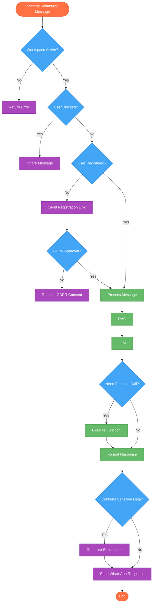
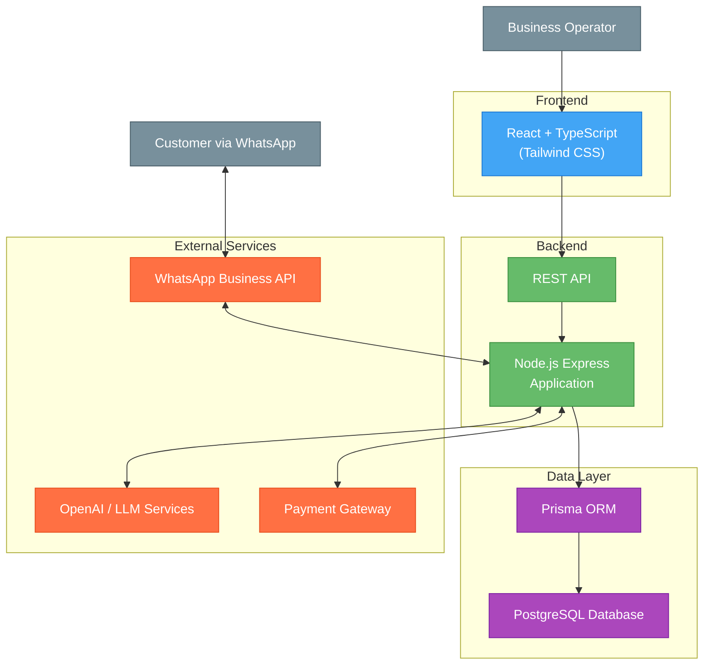
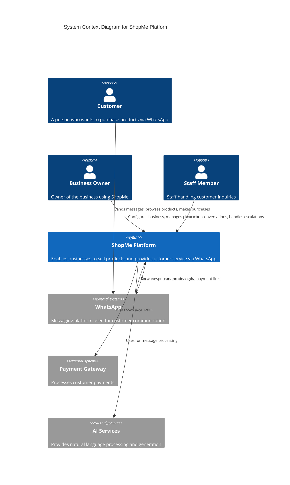
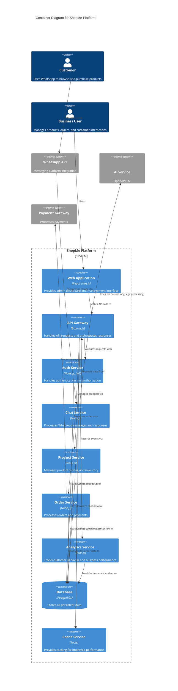
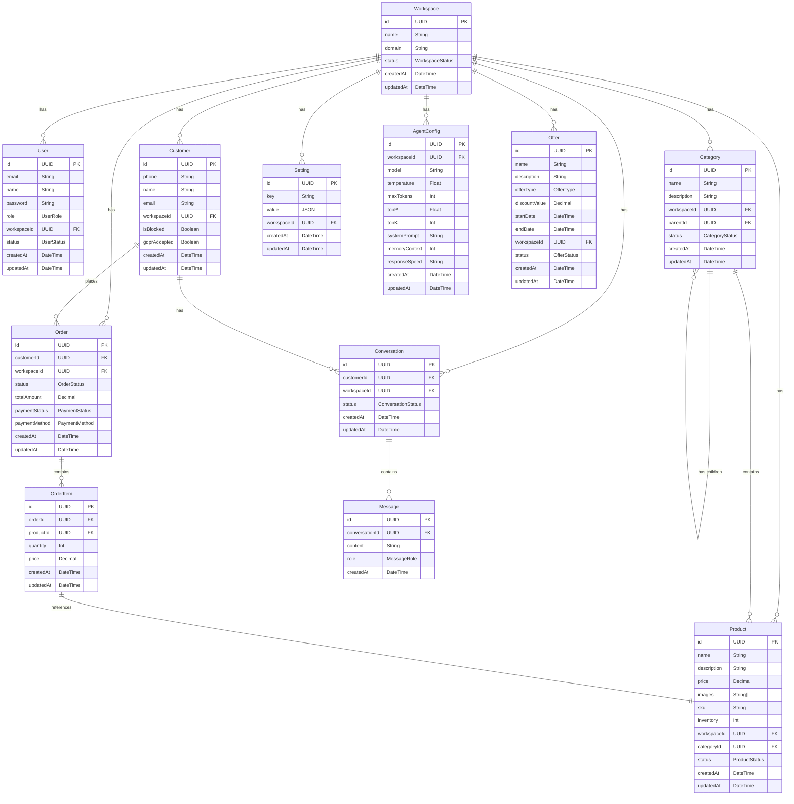

# ShopMe - WhatsApp E-commerce Platform PRD

## Table of Contents
- [Introduction](#introduction)
  - [Short Description](#short-description)
  - [Business Model](#business-model)
  - [Message Processing Flow](#message-processing-flow)
- [UI Screenshots](#ui-screenshots)
- [Dialog Examples](#dialog-examples)
  - [User Registration](#registro-de-nuevo-usuario)
  - [Product Discovery and Purchase](#descubrimiento-y-compra-de-productos)
- [Main Features](#main-features)
  - [Dashboard Overview](#dashboard-overview)
  - [Push Notification System](#push-notification-system)
  - [Products Catalog Management](#products-catalog-management)
  - [Agent Configuration Tools](#agent-configuration-tools)
- [Technical Architecture](#technical-architecture)
  - [Architecture Diagram](#architecture-diagram)
  - [C4 Model](#c4-model)
  - [Frontend Architecture](#frontend-architecture)
  - [Backend Architecture](#backend-architecture)
  - [Database and Prisma ORM](#database-and-prisma-orm)
  - [Data Model](#data-model)
  - [Folder Structure](#folder-structure)
  - [AI and Function Call Documentation](#ai-and-function-call-documentation)
  - [AI Configuration Options](#ai-configuration-options)
  - [Authentication and Token Management](#authentication-and-token-management)
  - [API Rate Limiting Implementation](#api-rate-limiting-implementation)
  - [API Endpoints](#api-endpoints)
  - [Security Implementation (OWASP)](#security-implementation-owasp)
  - [Testing Strategy](#testing-strategy)
- [Subscription Plans](#subscription-plans)
- [Development Roadmap](#development-roadmap)
- [Out of Scope Features (MVP)](#out-of-scope-features-mvp)
- [Minimum Marketable Product (MMP)](#minimum-marketable-product-mmp)

## INTRODUCTION

### Short Description
ShopMe is a multilingual SaaS platform (Italian, English, Spanish) that turns WhatsApp into a complete sales channel. Customers can create smart chatbots, manage products, receive orders, and send invoices to their clients without any technical skills. Our AI technology automates customer-care responses, manages push notifications, and offers a 24/7 conversational shopping experience, all directly in the world's most popular messaging app.

All sensitive operations are handled securely through temporary links with security tokens. These links direct customers to our secure website for registration forms, payments, invoices, and accessing personal data. This keeps all sensitive information outside of chat conversations, ensuring data protection while maintaining a smooth customer experience.

### Business Model

```
+-------------------------+-------------------------+-------------------------+-------------------------+-------------------------+
| 1. PROBLEM              | 2. SOLUTION             | 3. UNIQUE VALUE         | 4. UNFAIR ADVANTAGE     | 5. CUSTOMER SEGMENTS    |
|                         |                         |    PROPOSITION          |                         |                         |
+-------------------------+-------------------------+-------------------------+-------------------------+-------------------------+
| • E-commerce and        | • WhatsApp-based        | • Unified commerce and  | • 2.7+ billion active   | • Small businesses      |
|   customer service      |   chatbot platform      |   customer care in      |   WhatsApp users       |   without technical     |
|   are separate systems  |   with AI integration   |   one platform          | • 98% message open      |   expertise             |
|                         |                         |                         |   rate vs 20% email     |                         |
| • Technical barriers    | • No-code product and   | • Single conversation   | • Rich media product    | • Mid-sized retailers   |
|   for WhatsApp          |   catalog management    |   thread for discovery, |   catalog support in a  |   seeking omnichannel   |
|   commerce integration  |                         |   purchase & support    |   familiar interface    |   solutions             |
|                         |                         |                         |                         |                         |
| • Limited personalization| • Secure token-based   | • 42% higher conversion | • Contextual memory of  | • Food/grocery          |
|   in traditional        |   handling of sensitive |   rate vs traditional   |   past interactions     |   businesses with       |
|   e-commerce            |   operations            |   websites              |   for personalization   |   perishable inventory  |
|                         |                         |                         |                         |                         |
| • Lost sales from       | • Multi-language        | • 67% faster response   | • Persistent customer   | • Service businesses    |
|   abandoned carts and   |   support (IT/EN/ES)    |   inquiries             |   outlasts web visits   |   requiring booking     |
|   unanswered queries    |   with AI automation    |   inquiries             |   outlasts web visits   |   and follow-up         |
+-------------------------+-------------------------+-------------------------+-------------------------+-------------------------+
| 6. KEY METRICS                                    | 7. CHANNELS                                                                |
|                                                   |                                                                            |
| • Conversion rate (42% higher than traditional)   | • Direct enterprise sales team                                             |
| • Customer response time (67% reduction)          | • Partner network of e-commerce consultants                                |
| • Average order value (28% increase)              | • WhatsApp Business Platform                                               |
| • Cart abandonment (53% decrease)                 | • Digital marketing (content, webinars, demos)                             |
| • Customer retention (3.2x higher)                | • Free trial program with guided onboarding                                |
+---------------------------------------------------+----------------------------------------------------------------------------+
| 8. COST STRUCTURE                                 | 9. REVENUE STREAMS                                                         |
|                                                   |                                                                            |
| • Development team                                | • Tiered subscription model:                                               |
| • AI/ML model costs                               |   - Basic Plan (€49/month): Single WhatsApp line, 1000 AI messages         |
| • WhatsApp Business API fees                      |   - Professional Plan (€149/month): 3 numbers, 5000 AI messages            |
| • Cloud infrastructure                            |   - Enterprise Plan (custom): Unlimited connections, white-label           |
| • Customer success team                           | • Implementation and customization services                                |
| • Sales & marketing                               | • API access fees for third-party integrations                             |
+---------------------------------------------------+----------------------------------------------------------------------------+
```

### Message Processing Flow



## UI SCREENSHOTS

[SCREENSHOT 1: Dashboard Overview]
[SCREENSHOT 2: Product Management Interface]
[SCREENSHOT 3: Customer Interaction Panel]

## DIALOG EXAMPLES

### Registro de Nuevo Usuario

**Cliente**: "Hola, me gustaría comprar algunos productos."

**ShopMe**: "¡Hola! Estaré encantado de ayudarle con su compra. Para ofrecerle la mejor experiencia y poder procesar sus pedidos, necesitamos que se registre primero. 

He creado un enlace de registro seguro para usted: [https://shopme.com/registro/token_u7d9f3a1b5]

Este enlace es personal y caduca en 24 horas por motivos de seguridad."

**Cliente**: "¿Es seguro? ¿Qué pasa con mis datos?"

**ShopMe**: "Entiendo su preocupación por la privacidad. Su seguridad es nuestra prioridad:

1. El enlace utiliza un token único y temporal para proteger su proceso de registro
2. Todos sus datos se almacenan de forma segura en nuestros servidores encriptados
3. No compartimos sus datos personales con ningún modelo de IA externo
4. Cumplimos totalmente con la normativa GDPR de protección de datos

Una vez registrado, podrá realizar compras, seguir sus pedidos y recibir facturas electrónicas fácilmente."

**Cliente**: *[Completa el registro a través del enlace]*

**ShopMe**: "¡Gracias por registrarse! Su cuenta ha sido creada correctamente. 

Nos complace informarle que valoramos su privacidad y seguridad. Todos sus datos se guardan exclusivamente en nuestra base de datos segura y no se comparten con modelos de IA externos.

¿En qué puedo ayudarle hoy? Puedo mostrarle nuestros productos destacados, ayudarle a encontrar algo específico o responder cualquier pregunta sobre nuestros servicios."

### Descubrimiento y Compra de Productos

**Cliente**: "Hola, estoy buscando productos típicos sicilianos para regalar."

**ShopMe**: "¡Buenos días! Estaré encantado de ayudarle a encontrar productos típicos sicilianos para un regalo. Para sugerirle las mejores opciones, ¿podría saber:

1. ¿Tiene un presupuesto en mente?
2. ¿Prefiere productos dulces, salados o un surtido?
3. ¿La persona que recibirá el regalo tiene alergias o intolerancias alimentarias?"

**Cliente**: "Mi presupuesto es de unos 50€. Preferiría un surtido de dulces y salados. No hay alergias a considerar."

**ShopMe**: "Según sus preferencias, aquí tiene tres packs de regalo que podrían interesarle:

1. **Box Sicilia Clásica** (45€)
   - 1 botella de passito de Pantelleria (375ml)
   - 250g de pistachos de Bronte
   - 200g de pasta de almendras
   - 100g de caponata artesanal
   - Caja de regalo con lazo

2. **Degustación Siciliana** (55€)
   - 1 crema de pistacho para untar (200g)
   - 1 pesto de pistacho (180g)
   - 250g de cantucci de almendras
   - 200g de chocolate de Módica a la naranja
   - 1 mermelada de higos chumbos (240g)
   - Caja artesanal de madera

3. **Sabores de la Isla** (48€)
   - 500g de pasta extruida en bronce
   - 1 botella de aceite de oliva virgen extra (250ml)
   - 1 tarro de pesto trapanés (180g)
   - 100g de sal marina con hierbas sicilianas
   - 150g de crujiente de sésamo
   - Envoltorio de regalo con papel personalizado

¿Cuál de estas opciones le interesa más?"

**Cliente**: "La Degustación Siciliana parece excelente. ¿Cómo se puede utilizar la crema de pistacho?"

**ShopMe**: "La crema de pistacho es un producto versátil y delicioso. Puede utilizarse de varias formas:
- Untada en rebanadas de pan o croissants para un desayuno goloso
- Como relleno para tartas, galletas o pasteles
- Añadida al helado de vainilla para darle un toque de sabor
- Para preparar tiramisú o tarta de queso de pistacho
- Simplemente disfrutada a cucharadas como postre

Está elaborada con pistachos de Bronte DOP (40%), azúcar moreno y aceite de girasol. No contiene conservantes ni colorantes.

¿Desea proceder con la compra de la Degustación Siciliana o preferiría ver otras opciones?"

**Cliente**: "Me llevo la Degustación Siciliana. ¿Puede entregarse antes del próximo viernes?"

**ShopMe**: "¡Excelente elección! Sí, podemos garantizar la entrega antes del próximo viernes. El artículo está disponible en almacén y califica para envío exprés gratuito.

¿Quiere proceder con el pedido? Puedo crear el pedido y enviarle un enlace de pago seguro."

**Cliente**: "Sí, gracias."

**ShopMe**: "He creado su pedido para la Degustación Siciliana (55€). Aquí tiene el enlace de pago seguro: [Enlace de Pago]

Una vez completado el pago, recibirá:
1. Un email de confirmación del pedido con la información de seguimiento
2. Actualizaciones sobre la entrega vía WhatsApp
3. Su factura electrónica

La fecha estimada de entrega es el viernes 12 de mayo. ¿Puedo ayudarle con algo más?"

**Cliente**: "Eso es todo, ¡gracias!"

**ShopMe**: "¡Gracias por su compra! Apreciamos su confianza. Su pedido está siendo procesado y recibirá en breve la información de seguimiento. Si tiene preguntas sobre su pedido o productos, no dude en contactarnos aquí. ¡Le deseo un buen día!"

## MAIN FEATURES

### Dashboard Overview
- Real-time customer activity monitoring
- Sales performance metrics and trends
- Chatbot performance analytics
- Product catalog management
- Customer interaction history
- Order status tracking

### Push Notification System
- Automated order status updates
- Personalized promotions based on user behavior
- Re-engagement campaigns for abandoned carts
- Shipping and delivery notifications
- Custom notification templates

### Products Catalog Management
- Multi-category organization
- Rich media product cards
- Variant management (size, color, etc.)
- Inventory tracking
- Discount and promotion configuration
- Bulk import/export functionality

### Agent Configuration Tools
- AI behavior customization
- Response tone and style settings
- Product recommendation rules
- Conversation flow design
- Fallback response management
- Custom function configuration

## TECHNICAL ARCHITECTURE

### Architecture Diagram



### C4 Model

#### System Context Diagram



#### Container Diagram



### Frontend Architecture

The ShopMe frontend is built with a modern React architecture:

- **Core Technologies**:
  - React 18+ with functional components and hooks
  - TypeScript for type safety and improved developer experience
  - Tailwind CSS for utility-first styling approach
  - Next.js for server-side rendering and optimized performance

- **Key Frontend Components**:
  - Component library with atomic design principles
  - Responsive layouts for all device types
  - Custom hooks for business logic reuse
  - Context API for state management
  - React Query for data fetching and caching
  - Form handling with React Hook Form

- **User Interface Features**:
  - Dark/light mode support
  - Internationalization (i18n) for multiple languages
  - Accessibility compliance (WCAG 2.1 AA)
  - Progressive loading and skeleton screens
  - Custom animations and transitions
  - Interactive data visualizations

### Backend Architecture

The backend follows a Domain-Driven Design (DDD) architecture:

- **Core Technologies**:
  - Node.js with Express framework
  - TypeScript for type safety across the stack
  - Prisma ORM for database access
  - PostgreSQL for data persistence
  - Redis for caching and session management

- **Layer Separation**:
  - **Domain Layer**: Core business entities and rules
  - **Application Layer**: Use cases and application services
  - **Infrastructure Layer**: Technical implementations and external services
  - **Interfaces Layer**: API controllers and routes

- **Key Design Principles**:
  - Business domain at the center of design
  - Clear boundaries between layers
  - Repository pattern for data access
  - Dependency inversion principle

- **Backend Services**:
  - Authentication service with JWT
  - Media handling and storage service
  - Notification service
  - Analytics service
  - External integrations service (WhatsApp, payment providers)
  - Background job processing

### Database and Prisma ORM

- **Primary Database**: PostgreSQL
- **ORM**: Prisma for type-safe database access
- **Migrations**: Prisma Migration for version control
- **Backup Strategy**: Automated daily backups with point-in-time recovery

### Data Model



### Folder Structure

#### Backend Structure

```
/backend
  /src
    /domain                # Core business logic
      /entities            # Business models
      /repositories        # Data access interfaces
      /value-objects       # Immutable value objects
    /application           # Application logic
      /services            # Business orchestration
      /use-cases           # Specific features
      /dto                 # Data transfer objects
    /infrastructure        # Technical implementations
      /repositories        # Database access
      /persistence         # ORM configurations
      /external-services   # 3rd party integrations
    /interfaces            # External interfaces
      /http
        /controllers       # Request handlers
        /routes            # API routes
      /websockets          # WebSocket handlers
    /config                # Configuration settings
    /utils                 # Utility functions
  /tests
    /unit                  # Unit tests
    /integration           # Integration tests
    /e2e                   # End-to-end tests
  /prisma                  # Prisma schema and migrations
  /scripts                 # Build and deployment scripts
```

#### Frontend Structure

```
/frontend
  /src
    /components
      /shared              # Reusable components
      /layout              # Layout components
      /forms               # Form components
      /ui                  # UI primitives
    /hooks                 # Custom React hooks
    /pages                 # Page components
    /contexts              # React contexts
    /services              # API services
    /utils                 # Utility functions
    /types                 # TypeScript type definitions
    /styles                # Global styles
    /assets                # Images, fonts, etc.
  /public                  # Static assets
  /tests                   # Frontend tests
```

### AI and Function Call Documentation

The system implements several AI function calls to handle specific operations:

```
+-------------------------+--------------------------------------+----------------+
| FUNCTION NAME           | DESCRIPTION                          | STATUS         |
+-------------------------+--------------------------------------+----------------+
| get_product_info        | Get details about a specific product | Implemented    |
+-------------------------+--------------------------------------+----------------+
| get_event_by_date       | Get events scheduled for a date      | Implemented    |
+-------------------------+--------------------------------------+----------------+
| get_service_info        | Get details about a specific service | Implemented    |
+-------------------------+--------------------------------------+----------------+
| welcome_user            | Generate welcome message for users   | Implemented    |
+-------------------------+--------------------------------------+----------------+
| create_order            | Create a new order from cart items   | Implemented    |
+-------------------------+--------------------------------------+----------------+
| get_cart_info           | Get contents of a user's cart        | Implemented    |
+-------------------------+--------------------------------------+----------------+
| get_order_status        | Check status of specific order       | Implemented    |
+-------------------------+--------------------------------------+----------------+
| add_to_cart             | Add product to shopping cart         | Implemented    |
+-------------------------+--------------------------------------+----------------+
| remove_from_cart        | Remove product from shopping cart    | Implemented    |
+-------------------------+--------------------------------------+----------------+
| get_product_list        | Get list of available products       | Implemented    |
+-------------------------+--------------------------------------+----------------+
| get_products_by_category| Get products filtered by category    | Planned        |
+-------------------------+--------------------------------------+----------------+
| get_categories          | Get list of all product categories   | Planned        |
+-------------------------+--------------------------------------+----------------+
| get_faq_info            | Get information from FAQ database    | Implemented    |
+-------------------------+--------------------------------------+----------------+
| get_generic_response    | Handle general conversation/fallback | Implemented    |
+-------------------------+--------------------------------------+----------------+
```

### AI Configuration Options

Under each plan, businesses can customize their AI agent with the following parameters:

| Parameter | Description | Default Value | Available Options |
|-----------|-------------|--------------|-------------------|
| **Model Selection** | AI model used for responses | GPT-3.5-turbo | GPT-4, Claude, Mistral, Llama |
| **Temperature** | Response creativity level | 0.7 | 0.1-1.0 in 0.1 increments |
| **Max Tokens** | Maximum response length | 250 | 50-1000 |
| **Top-P** | Nucleus sampling threshold | 0.95 | 0.5-1.0 |
| **Top-K** | Number of highest probability tokens to consider | 40 | 10-100 |
| **System Prompt** | Base instructions for AI | Basic retail template | Custom templates available |
| **Memory Context** | Number of previous messages to include | 10 | 1-20 |
| **Response Speed** | Balance between quality and speed | Balanced | Fast, Balanced, Quality |

### Authentication and Token Management

Our system uses JWT (JSON Web Token) authentication to keep user accounts secure:

- **Token Types**:
  - Access Token (1 hour validity, HTTP-only cookie)
  - Refresh Token (7 days validity, HTTP-only cookie)

- **Security Measures**:
  - Regular secret key rotation
  - HS256 algorithm for token signing
  - Minimal payload information
  - HTTP header validation
  - Rate limiting on auth endpoints

- **Role-Based Access Control**:
  - Admin: Full system access
  - Manager: Workspace management capabilities
  - Agent: Customer service operations
  - Workspace-scoped permissions

### API Rate Limiting Implementation

We protect all API endpoints with smart rate limiting:

- 30 requests per minute per user
- Customizable daily limits per workspace
- Different limits for different endpoint priorities
- Response headers with limit information
- Graceful handling of rate limit exceeded scenarios

### API Endpoints

#### Authentication API

- `POST /api/auth/login`
  - **Description**: Authenticates a user and returns tokens
  - **Body**: `{ email, password }`
  - **Returns**: Access token and refresh token

- `POST /api/auth/refresh`
  - **Description**: Refreshes an expired access token
  - **Body**: (Uses refresh token from HTTP-only cookie)
  - **Returns**: New access token

- `POST /api/auth/logout`
  - **Description**: Invalidates user tokens
  - **Returns**: Success confirmation

#### Workspace API

- `GET /api/workspaces`
  - **Description**: Lists workspaces accessible to the user
  - **Parameters**: `page`, `limit`, `status`
  - **Returns**: Paginated workspace list

- `POST /api/workspaces`
  - **Description**: Creates a new workspace
  - **Body**: Workspace details
  - **Returns**: Created workspace details

- `GET /api/workspaces/:id`
  - **Description**: Gets details of a specific workspace
  - **Returns**: Complete workspace information

#### Products API

- `GET /api/products`
  - **Description**: Lists products
  - **Parameters**: 
    - `workspace_id` (required): Workspace identifier
    - Various filters: `category`, `status`, `price_min`, `price_max`
    - Pagination: `page`, `limit`
    - Sorting: `sort_by`, `sort_dir`
  - **Returns**: Paginated product list

- `POST /api/products`
  - **Description**: Creates a new product
  - **Body**: Product details with category and workspace information
  - **Returns**: Created product

- `GET /api/products/:id`
  - **Description**: Gets details of a specific product
  - **Returns**: Complete product information including variants and images

- `PUT /api/products/:id`
  - **Description**: Updates a product
  - **Body**: Fields to update
  - **Returns**: Updated product

- `DELETE /api/products/:id`
  - **Description**: Deletes a product
  - **Returns**: Deletion confirmation

#### Categories API

- `GET /api/categories`
  - **Description**: Lists categories
  - **Parameters**: `workspace_id`, `parent_id`, `status`, `page`, `limit`
  - **Returns**: Paginated category list

- `POST /api/categories`
  - **Description**: Creates a new category
  - **Body**: Category details with parent info
  - **Returns**: Created category

- `GET /api/categories/:id`
  - **Description**: Gets details of a specific category
  - **Returns**: Category information including subcategories and products

#### Customers API

- `GET /api/customers`
  - **Description**: Lists customers
  - **Parameters**: `workspace_id`, various filters, pagination
  - **Returns**: Paginated customer list

- `GET /api/customers/:id`
  - **Description**: Gets customer profile
  - **Returns**: Customer details with order history

- `PUT /api/customers/:id`
  - **Description**: Updates customer information
  - **Body**: Fields to update
  - **Returns**: Updated customer profile

#### Offers API

- `GET /api/offers`
  - **Description**: Retrieves offers and promotions list
  - **Parameters**: 
    - `workspace_id` (required): Workspace identifier
    - `status` (optional): Filter by active, upcoming, or expired
    - `page`, `limit` (optional): Pagination parameters
  - **Returns**: List of offers with details

- `POST /api/offers`
  - **Description**: Creates a new offer
  - **Body**: 
    - `name`: Offer name
    - `description`: Offer description 
    - `offer_type`: Discount type (percentage, fixed, buy_x_get_y)
    - `discount_value`: Value of discount
    - `products`: List of applicable product IDs
    - `categories`: List of applicable category IDs
    - `start_date`: Offer start date
    - `end_date`: Offer end date
    - `min_purchase`: Minimum purchase requirement
    - `usage_limit`: Maximum redemptions allowed
    - `code`: Promo code (optional)
  - **Returns**: Created offer details

- `GET /api/offers/:id`
  - **Description**: Gets details of a specific offer
  - **Parameters**: `id` (required): Offer ID
  - **Returns**: Complete offer details including usage statistics

#### Agent Configuration API

- `GET /api/agent-config`
  - **Description**: Gets AI agent configuration
  - **Parameters**: `workspace_id`
  - **Returns**: Current AI configuration

- `PUT /api/agent-config`
  - **Description**: Updates AI agent configuration
  - **Body**: Configuration parameters to update
  - **Returns**: Updated configuration

#### WhatsApp Integration API

- `POST /api/whatsapp/webhook`
  - **Description**: Webhook for incoming WhatsApp messages
  - **Body**: Message payload from WhatsApp Business API
  - **Returns**: Acknowledgment of receipt

- `POST /api/whatsapp/send`
  - **Description**: Sends message to a customer via WhatsApp
  - **Body**: Message content, recipient, and options
  - **Returns**: Delivery status

### Security Implementation (OWASP)

The platform follows OWASP security guidelines:
- Input validation and sanitization
- Protection against XSS, CSRF, SQLi
- Secure authentication and authorization
- Data encryption in transit and at rest
- Regular security audits

### Testing Strategy

Comprehensive testing approach:
- Unit tests for domain logic
- Integration tests for services
- End-to-end tests for key flows
- Performance and load testing
- Security and penetration testing

## SUBSCRIPTION PLANS

### Subscription Plans & Pricing

#### 1. Basic Plan (€49/month)
- Single WhatsApp number connection
- Up to 1,000 AI-powered messages/month
- Maximum 5 products/services
- Standard response time (24h)
- Basic analytics dashboard
- Email support

#### 2. Professional Plan (€149/month)
- Up to 3 WhatsApp number connections
- Up to 5,000 AI-powered messages/month
- Maximum 100 products/services
- Priority response time (12h)
- Advanced analytics and reporting
- Phone and email support
- Custom AI training

#### 3. Enterprise Plan (Custom pricing)
- Unlimited WhatsApp number connections
- Custom AI message volume
- Unlimited products/services
- Dedicated response team (4h SLA)
- Full API access
- White-label options
- Dedicated account manager
- Custom integrations
- On-premises deployment option

## DEVELOPMENT ROADMAP

### Phase 1: Core Data Management (Months 1-2)
- Complete CRUD functionality for all core entities
- Multi-tenant workspace architecture
- User role management and permissions
- Basic admin interface

### Phase 2: Communication Platform (Months 3-4)
- WhatsApp API integration
- Chat flow builder
- Administrative dashboard
- Customer survey tools
- Conversation templates
- Basic RAG implementation

### Phase 3: Monetization & Notifications (Months 5-6)
- Payment gateway integration
- Invoice generation system
- Push notification infrastructure
- Beta testing program
- Performance optimization
- Security hardening

### Phase 4: Marketing & MMP Enhancements (Months 7-8)
- Marketing automation tools
- Enhanced analytics
- Customer segmentation
- Campaign management tools
- Enhanced AI capabilities
- Vertical market adaptations

### Phase 5: Full Deployment & Quality Assurance (Months 9-10)
- Comprehensive testing
- Performance benchmarking
- Security audits
- Documentation completion
- Support system implementation
- Full public launch

## OUT OF SCOPE FEATURES (MVP)

The following features are outside the scope of the initial MVP release:

### Orders Management
- Order processing and tracking
- Order status management
- Invoice generation and management
- Shipping integration and tracking
- Returns and refund processing

### Analytics
- Real-time analytics dashboard
- Custom report generation
- Data visualization tools
- Export capabilities
- Performance metrics and KPIs

### Advanced Push Notifications
- A/B testing for notification content
- Advanced segmentation based on behavior
- Rich media notifications
- Location-based targeting
- Frequency optimization

### Payment Integration
- Integrated payment processing
- Payment plan implementation
- Subscription management
- Payment gateway integration
- Fraud prevention tools

## MINIMUM MARKETABLE PRODUCT (MMP)

Features planned for the MMP phase, after the initial MVP release:

### Enhanced Orders Management
- Complete order lifecycle management
- Order fulfillment workflows
- Custom order statuses
- Automated order notifications
- Bulk order processing capabilities

### Advanced Analytics Dashboard
- Customer behavior analysis
- Conversion funnel visualization
- Revenue and sales performance tracking
- Chat quality and sentiment analysis
- Custom report builder with export options

### Full Payment Integration
- Multiple payment gateway integrations
- Saved payment methods for customers
- Subscription and recurring payment handling
- Advanced fraud detection and prevention
- Automated refund processing

### Multi-Agent Collaboration
- Team inbox with shared conversation access
- Agent routing and assignment rules
- Supervisor monitoring and intervention tools
- Agent performance metrics and reporting
- Shift management and availability tracking

### Enhanced AI Capabilities
- Advanced sentiment analysis and emotional intelligence
- Proactive customer outreach based on behavior
- Personalized product recommendations based on preferences
- Automated follow-up sequences for abandoned carts
- A/B testing of different AI prompts and approaches
