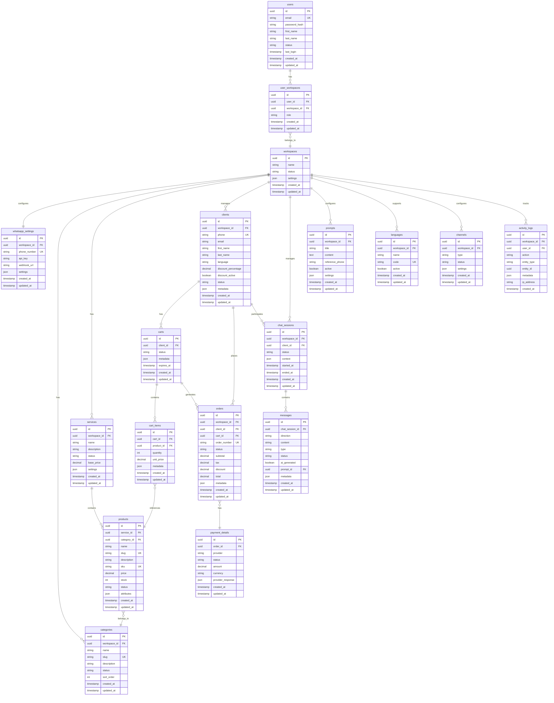
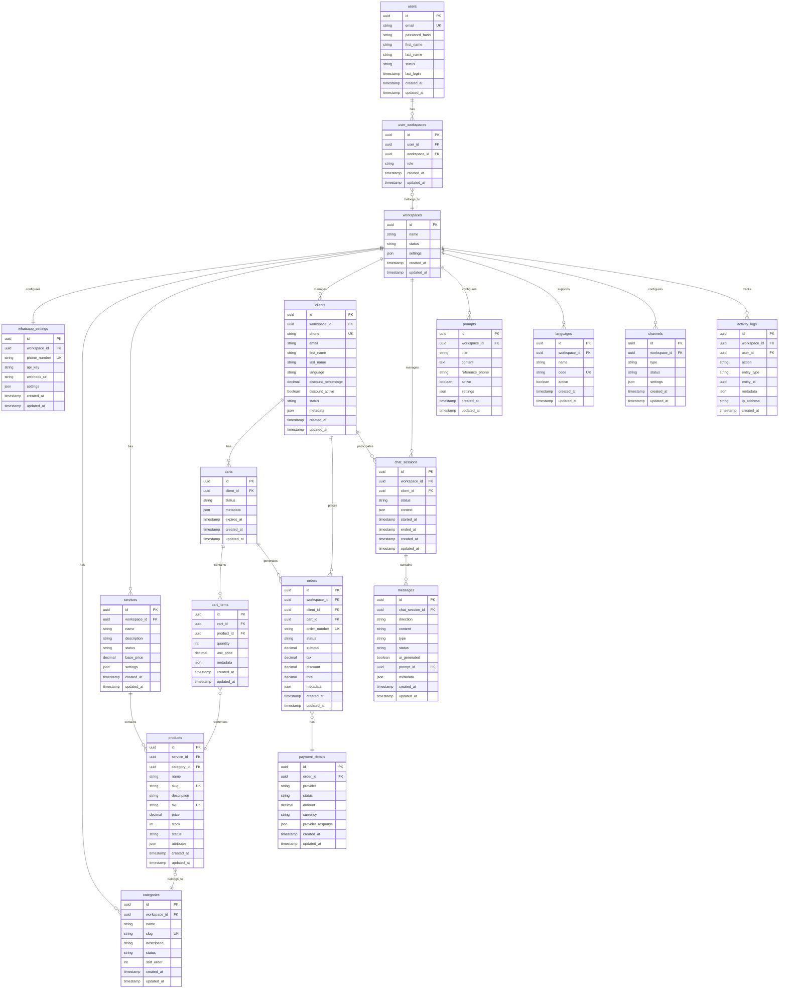

# ShopMe - WhatsApp E-commerce Platform - Product Requirements Document

## 1. Project Vision

The ShopMe project aims to develop a WhatsApp-based e-commerce platform that leverages the WhatsApp Business API and AI technology to automate client support and order management. The goal is to provide immediate and continuous 24/7 assistance, enhancing client experience and streamlining business operations.

The platform is designed for any business that offers products or services to clients, from retail stores and service providers to hospitality businesses like hotels, restaurants, gyms, and fitness centers. This versatility allows businesses to not only sell products but also manage appointments, reservations, and memberships through conversational interfaces.

## 2. User Journey

### Administrator Experience

- Access a web dashboard to:
  - Create and manage multiple workspaces.
  - Configure WhatsApp channels (phone numbers, API tokens, webhooks).
  - Customize AI prompts, add products (with photos, text, pricing), and organize them into service categories.
  - Manage products, services, and clients through intuitive interfaces.

### End User Experience

- Interact exclusively through WhatsApp:
  - New users receive a welcome message and a request for basic registration information.
  - Existing users receive a personalized greeting and can request information, place orders, and receive communications.

## 3. Objectives

### Business Goals

- Significantly reduce client service time through automation.
- Provide 24/7 client support.
- Build client loyalty through future push campaigns (e.g., greetings, promotions, appointment reminders).
- Enable businesses of all types to engage with clients through familiar messaging interfaces.
- Create a versatile platform adaptable to various industries and business models.

### Non-Goals (MVP)

- Implement an integrated payment system (external bank link will be used).
- Save detailed conversation history.
- Track detailed user usage data while maintaining the cost model (5 cents per question, 20 cents per push).

## 4. Technical Architecture

- **Frontend**: React (latest version) with shadcn/ui library and Tailwind CSS to accelerate development.
- **Backend**: Node.js with Domain Driven Design (DDD) pattern.
- **Database**: PostgreSQL.
- **Workflow Automation**: n8n.
- **AI Service**: OpenRouter (RAG).
- **WhatsApp Integration**: Official Meta API.
- **Security**: HTTPS, JWT tokens, encrypted sensitive data in the database.
- **Environments**: Development, test, and production; each workspace can activate debug mode with a test number.

## 5. Acceptance Criteria

- Fully operational CRUD functionality for workspaces, products, prompts, services, languages, and users.
- Chatbot responses generated within seconds.
- API communication protected via JWT tokens.
- Intuitive dashboard with 2FA authentication.
- Seamless integration between n8n and exposed APIs.

## 6. Key Features

1. **User Management:**

   - Registration and Login: Secure authentication and profile management.
   - Password Recovery: Functionality for credential reset.

2. **Product Catalog:**

   - Product Display: List and detailed view of products with images, descriptions, and prices.
   - Search and Filtering: Tools to search products by category, price, popularity, etc.
   - Categories: Management of product categories for better organization.

3. **WhatsApp Cart Management:**

   - Conversational Interface: Allows users to manage their cart via WhatsApp messages.
   - Add/Remove Products: Commands to add or remove products from the cart.
   - Cart Status Display: Sending cart summaries and updates via WhatsApp.

4. **Checkout and Online Payments:**

   - Order Confirmation: After cart management on WhatsApp, the user is redirected to a web platform to confirm the order.
   - Online Payments: Secure and integrated payment procedure on the online platform.

5. **AI Integration:**

   - Assistance Chatbot: Virtual support to answer questions and guide users during the purchase process.

6. **Order Management and Tracking:**

   - Order History: View past purchases and current order status.
   - Shipment Tracking: Real-time updates on shipment status, sent via WhatsApp or email.

7. **Client Management:**

   - Client Profiles: Maintain comprehensive records of all clients.
   - Purchase History: Track client purchasing patterns and preferences.
   - Communication Log: Access past interactions with clients.
   - Reservation Management: Track and manage client bookings and appointments (future expansion).
   - Push Notifications: Send targeted messages for marketing, reminders, and loyalty programs.

8. **Chat History:**

   - Conversation Logs: Review and analyze WhatsApp conversations with clients.
   - Message Search: Search through chat history for specific information.

9. **Usage Analytics:**

   - Usage Monitoring: Collection and analysis of platform usage data to understand user behavior.
   - Usage Reports: Generation of reports and statistics to improve experience and optimize features.

10. **Administrative Dashboard:**

- Content Management: Tools to add, modify, or remove products and categories.
- Reports and Analysis: Statistics on sales, traffic, and system performance.

11. **Reservation and Booking System (Future Expansion):**

    - Appointment Scheduling: Allow clients to book services via WhatsApp.
    - Table Reservations: Enable restaurant booking management.
    - Room Bookings: Handle hotel room reservations.
    - Class Registrations: Manage gym class sign-ups and attendance.
    - Capacity Management: Track availability and prevent overbooking.
    - Automated Reminders: Send notifications before appointments.

12. **Push Notification Campaigns:**
    - Targeted Messaging: Send personalized offers based on client history.
    - Automatic Reminders: Notify clients about upcoming appointments or reservations.
    - Re-engagement Campaigns: Reach out to inactive clients.
    - Special Promotions: Announce limited-time offers and discounts.
    - Loyalty Programs: Update clients on points, rewards, and milestones.
    - Event Notifications: Inform clients about upcoming events or new services.

## 7. Use Cases

### Admin Use Case:

- [Admin Dashboard] → [Workspace Management]
  - [CRUD WhatsApp Settings]
  - [CRUD Products]
  - [CRUD Categories]
  - [CRUD Services]
  - [CRUD Prompts]
  - [CRUD Clients and Campaigns]

### Registered WhatsApp User Use Case:

- [Registered WhatsApp User] → [Sends Message]
  - [n8n Workflow]
  - [Retrieval of workspace, profile, products, services data]
  - [Response generation with OpenRouter (RAG)]
  - [Response sending via Meta WhatsApp API]

### New WhatsApp User Use Case:

- [New WhatsApp User] → [Sends First Message]
  - [n8n Workflow]
  - [User identification: not registered]
  - [Sending welcome message and request for basic data]
  - [User registration and profile creation]

### Push Offers Use Case:

- [Admin creates Push Campaign] → [Automatic Sending via WhatsApp API]
  - [Users receive message]
  - [Option to unsubscribe]

## 8. Exposed APIs (for n8n)

### Prompt Management

- `GET /api/prompt/:phone`

  - **Description**: Retrieves the active prompt for a specific phone number.
  - **Parameters**: `phone` (required): WhatsApp phone number.
  - **Returns**: Active prompt text, language configurations, context settings.

- `GET /api/prompts`

  - **Description**: Retrieves all prompts in the workspace.
  - **Parameters**: `workspace_id` (required): Workspace identifier.
  - **Returns**: List of prompts with active/inactive status.

- `POST /api/prompt`

  - **Description**: Creates a new prompt.
  - **Body**: `prompt_text`, `reference_phone`, `workspace_id`.

- `PUT /api/prompt/:id`

  - **Description**: Updates an existing prompt.
  - **Parameters**: `id` (required): Prompt ID.
  - **Body**: `prompt_text`, `active`.

- `DELETE /api/prompt/:id`
  - **Description**: Deletes a prompt.
  - **Parameters**: `id` (required): Prompt ID.

### User Management

- `GET /api/users/:phone`
  - **Description**: User identification and profile retrieval via WhatsApp number.
  - **Parameters**: `phone` (required): User's WhatsApp phone number.

### Product and Service Management

- `GET /api/products`

  - **Description**: Retrieves complete product list.
  - **Parameters**: `workspace_id` (required): Workspace identifier.

- `GET /api/categories`

  - **Description**: Retrieves product categories.
  - **Parameters**: `workspace_id` (required): Workspace identifier.

- `GET /api/services`
  - **Description**: Retrieves list of available services.
  - **Parameters**: `workspace_id` (required): Workspace identifier.

### Order Management

- `POST /api/orders`
  - **Description**: Saves orders placed via chatbot.
  - **Body**: Order details including products, quantities, client information.

### Client Management

- `GET /api/clients`

  - **Description**: Retrieves list of clients.
  - **Parameters**: `workspace_id` (required): Workspace identifier.

- `GET /api/clients/:id`

  - **Description**: Retrieves client details.
  - **Parameters**: `id` (required): Client identifier.

- `POST /api/clients`

  - **Description**: Creates a new client.
  - **Body**: Client details including name, phone, email.

- `PUT /api/clients/:id`
  - **Description**: Updates client information.
  - **Parameters**: `id` (required): Client identifier.
  - **Body**: Updated client details.

### Cart Management

- `GET /api/cart/:user_id`

  - **Description**: Retrieves user's cart.
  - **Parameters**: `user_id` (required): User identifier.

- `POST /api/cart`

  - **Description**: Adds a product to the cart.
  - **Body**: `user_id`, `product_id`, `quantity`.

- `PUT /api/cart`

  - **Description**: Modifies a product in the cart.
  - **Body**: `cart_id`, `product_id`, `quantity`.

- `DELETE /api/cart`
  - **Description**: Removes a product from the cart.
  - **Body**: `cart_id`, `product_id`.

**Cross-cutting Requirements**:

- All APIs are protected by JWT tokens.
- Communication exclusively via HTTPS.
- Request logging and tracking.
- Standardized error handling.

### Analytics API

- `GET /api/analytics/overview`

  - **Description**: Retrieves general statistics.
  - **Returns**: Total active users, total messages, revenue, growth percentages.

- `GET /api/analytics/recent-activity`
  - **Description**: Retrieves recent activities.
  - **Returns**: New registrations, added products, received orders, activity timestamps.

### Dashboard API

- `GET /api/dashboard/stats`
  - **Description**: Retrieves statistics for the dashboard.
  - **Parameters**: `period` (optional): daily/weekly/monthly.
  - **Returns**: Active Users count, Total Messages count, Revenue, Growth percentages.

### User Management API

- `GET /api/users`

  - **Description**: List of users with filters.
  - **Parameters**: `status` (optional), `search` (optional).
  - **Returns**: User list with cart and order details.

- `POST /api/users`
  - **Description**: Creates new user.
  - **Body**: User data (name, phone, email, etc.).

## 9. Data Model



## 10. Database Schema

The database uses PostgreSQL with the following key elements:

- **UUID-Based Primary Keys**: All tables use UUID primary keys for better security and distribution.
- **Enum Types**: Custom enum types for status fields and message types.
- **Base Entity Template**: Common fields inherited by most tables:
  - `created_at`: Timestamp of creation
  - `updated_at`: Timestamp of last update
  - `deleted_at`: Soft delete timestamp
  - `created_by`: UUID of creator
  - `updated_by`: UUID of last updater

### Core Tables:

- **users**: Admin users who manage workspaces
- **workspaces**: Isolated environments for each business
- **whatsapp_settings**: WhatsApp configuration per workspace
- **categories**: Product categories
- **services**: Service offerings that contain products
- **products**: Individual items for sale
- **clients**: End users who interact via WhatsApp
- **carts**: Shopping carts for clients
- **orders**: Completed purchases
- **chat_sessions**: WhatsApp conversation sessions
- **prompts**: AI prompts for WhatsApp automation
- **messages**: Individual messages in chat sessions

### Indexes and Constraints:

- Foreign key constraints on all relationships
- Unique constraints on business identifiers
- Indexes on frequently queried fields

## 11. UI Design Rules and Shared Components

### General UI Rules

- **Language**: All UI text must be in English to maintain consistency across the application.
- **Color Scheme**:
  - Primary background: White (#FFFFFF)
  - Primary accent color: Green (#10B981) for buttons and interactive elements
  - Secondary accent: Blue (#3B82F6) for secondary elements
  - Danger color: Red (#EF4444) for delete actions and error messages
  - Text colors: Primary (#111827), Secondary (#6B7280)
- **Typography**:
  - Font family: Inter, system-ui fallbacks
  - Base font size: 16px (1rem)
  - Heading scales: h1 (2rem), h2 (1.5rem), h3 (1.25rem)
  - Line heights: 1.5 for body text, 1.2 for headings
- **Spacing System**:
  - Consistent 8px-based spacing system (0.5rem, 1rem, 1.5rem, 2rem, etc.)
  - Card padding: 1.5rem
  - Section margins: 2rem
  - Form element spacing: 1rem between fields
- **Visual Consistency**:
  - Consistent rounding on UI elements (0.375rem border radius)
  - Uniform shadow styles for elevated components
  - Consistent hover and focus states for interactive elements
- **Responsive Design**:
  - Mobile-first approach with breakpoints at 640px, 768px, 1024px, and 1280px
  - No visible scrollbars except when necessary
  - Adaptive layouts for different screen sizes

### Layout Elements

#### Header Component

- **Position**: Fixed at the top of the screen, full width
- **Height**: 64px
- **Content**:
  - Left side: Workspace selector with current workspace name and phone number
  - Right side: Navigation items including:
    - Settings dropdown (Users, Categories, Languages, Channel Settings)
    - User profile dropdown (Profile, Logout)
- **Behavior**:
  - Settings dropdown opens downward with a panel of options
  - User profile shows user initials in a circle
  - Dropdown menus close when clicking outside
- **Implementation**:
  - Uses shadcn/ui Dropdown component
  - Sticky positioning with z-index to appear above other content

#### Sidebar Component

- **Position**: Fixed to the left side of the screen
- **Width**: 280px
- **Content**:
  - App logo and name at top (ShopMe)
  - Primary navigation menu with the following items:
    - Dashboard (icon: home)
    - Chat History (icon: message-square)
    - Clients (icon: users)
    - Orders (icon: shopping-cart)
    - Products (icon: box)
    - Categories (icon: package)
    - Services (icon: wrench)
    - Prompts (icon: message-square)
  - Settings section with:
    - Languages (icon: globe)
    - Settings (icon: cog)
  - Each item shows an icon and label
- **Behavior**:
  - Current page is highlighted with green background
  - Hover state shows slight background change
  - Optional collapsible functionality for mobile views
- **Implementation**:
  - Uses proper navigation components
  - SVG icons from Lucide icon set
  - Active states managed via React Router

### Page-Specific Rules

#### Login Page

- **Layout**: Two-column design with equal width columns
- **Left Column**:
  - Login form centered vertically
  - Form components:
    - Email input field
    - Password input field with show/hide toggle
    - "Remember me" checkbox
    - "Forgot password?" link
    - Login button (green, full width)
  - Form validation shows inline error messages
- **Right Column**:
  - Full-height background image showing e-commerce/messaging concept
  - Image has slight overlay to ensure text readability if needed
  - App logo and tagline positioned centrally
- **Responsive Behavior**:
  - On mobile: Image column disappears, form takes full width
  - Form maintains consistent padding across device sizes

#### Dashboard Page

- **Layout**: Multiple card-based sections organized in a grid
- **Top Section**: 4 metric cards in a row showing:
  - Total Orders (icon: shopping-cart)
  - Pending Orders (icon: clock)
  - New Users (icon: users)
  - Usage Statistics (icon: activity)
- **Middle Section**: 3 "Top" cards showing:
  - Top Product (with image, name, price, and sales count)
  - Top Client (with name, company, order count, and total spent)
  - Top Order (with order number, client, date, and amount)
- **Bottom Sections**:
  - Recent Orders table (showing ID, Client, Date, Status, Amount, Download Invoice action)
  - Recent Chats section (horizontal cards with user avatar, name, and preview of last message)
- **Implementation**:
  - Cards use shadcn/ui Card component
  - Tables use shadcn/ui Table component
  - Status indicators use color-coded badges

#### Products, Services, and Other List Pages

- **Layout**: Full-width data table with header section
- **Header Section**:
  - Page title (left-aligned)
  - Action bar (right-aligned) containing:
    - Search input
    - Add button (green with "+" icon)
- **Table Section**:
  - Sortable columns with appropriate headings
  - Row actions (Edit, Delete, etc.) in the rightmost column
  - Empty state shows helpful message when no data exists
- **Implementation**:
  - Uses shadcn/ui Table with DataTable wrapper
  - Supports sorting, filtering, and pagination
  - Delete actions trigger confirmation dialog

### Shared Components

#### 1. List Component

- **Purpose**: Standardized way to display tabular data across the application
- **Structure**:
  - Header section with title, search, and add button
  - Table with sortable columns
  - Optional pagination controls
- **Features**:
  - Search field with debounced input
  - Add button that opens form dialog
  - Row-level action buttons
  - Consistent empty and loading states
- **Implementation Details**:
  - Built on shadcn/ui Table component
  - Uses React hooks for search and filter functionality
  - Configurable columns and actions
  - Example usage: Users list, Services list, Products list

#### 2. Data Table Component

- **Purpose**: Enhanced table for managing complex data with advanced filtering and comprehensive data manipulation capabilities
- **Structure**:
  - Table with fixed header and horizontally/vertically scrollable body
  - Advanced filtering panel that can be toggled open/closed
  - Pagination controls with customizable page size options (10/25/50/100)
  - Column selector dropdown menu to show/hide table columns
  - Export buttons for CSV/Excel/PDF formats
  - Responsive layout that adapts to screen size
- **Features**:

  - **Search and Filtering**:

    - Global search across all columns
    - Per-column filtering with appropriate input types (text, select, date pickers)
    - Advanced filter combinations with AND/OR operators
    - Saved filter presets for quick access
    - Filter highlighting to indicate active filters

  - **Data Sorting and Manipulation**:

    - Multi-column sorting (shift+click for secondary sort)
    - Column resizing and reordering via drag-and-drop
    - Cell editing with inline validation
    - Context menu with row-specific actions
    - Keyboard navigation and shortcuts for power users

  - **Selection and Bulk Actions**:

    - Row selection with checkboxes (single/multiple/all)
    - Bulk action toolbar that appears when items are selected
    - Customizable bulk actions (delete, status change, export, etc.)
    - Selection persistence across page navigation

  - **Data Visualization**:

    - Conditional row formatting based on data values
    - Expandable rows for hierarchical data or additional details
    - Custom cell renderers for complex data types (tags, images, progress bars)
    - Empty and error states with actionable guidance

  - **Performance Optimizations**:
    - Virtualized rendering for handling large datasets (10,000+ rows)
    - Lazy loading of data with infinite scroll option
    - Optimistic UI updates for immediate feedback
    - Background data refreshing with visual indicators

- **Implementation Details**:

  - **Architecture**:

    - Built on TanStack Table (React Table v8) library
    - Wrapper components for consistent styling and behavior
    - Custom hooks for data fetching, filtering, and state management
    - Modular component structure for extensibility

  - **State Management**:

    - URL query parameter synchronization for shareable views
    - Persistent user preferences via localStorage
    - Optimized re-rendering with memoization
    - Controlled vs. uncontrolled component options

  - **Data Processing Options**:

    - Client-side processing for smaller datasets
    - Server-side processing with API integration for large datasets
    - Streaming data support for real-time updates
    - Batch processing for high-throughput operations

  - **Styling and Customization**:

    - Tailwind CSS for styling with consistent design system
    - Theme customization options (light/dark mode)
    - Customizable templates for header, footer, empty states
    - Responsive breakpoints with adaptive layouts

  - **Accessibility**:
    - Full keyboard navigation support
    - ARIA attributes and screen reader compatibility
    - Focus management for modal dialogs
    - High contrast mode support

- **Example Implementations**:
  - Orders management with status filtering and bulk processing
  - Client list with detailed expandable profiles
  - Products inventory with inline editing and category filtering
  - Analytics tables with exportable data and custom visualizations
  - Activity logs with advanced timestamp filtering and user filtering

## 12. Implementation Considerations

### Security

- **Data Protection**:
  - All sensitive data is encrypted at rest and in transit
  - API keys and credentials are stored securely using environment variables
  - Passwords are hashed using bcrypt with appropriate salt rounds
- **Authentication & Authorization**:

  - JWT-based authentication with refresh token mechanism
  - Role-based access control at the workspace level
  - Token expiration and rotation policies
  - Rate limiting on authentication endpoints

- **API Security**:

  - Input validation on all endpoints
  - CSRF protection for browser-based clients
  - Content Security Policy implementation
  - Security headers (X-Frame-Options, X-Content-Type-Options, etc.)

- **Audit & Monitoring**:
  - Comprehensive activity logging for all significant actions
  - Login attempt monitoring with account lockout mechanism
  - Regular security scanning and penetration testing

### Performance

- **Database Optimization**:

  - Optimized database queries with proper indexing
  - Connection pooling for database efficiency
  - Query caching for frequently accessed data
  - Normalization with strategic denormalization where needed

- **Frontend Optimization**:

  - Code splitting for faster initial load
  - Image optimization and lazy loading
  - Efficient React rendering with memoization
  - Bundle size optimization

- **Caching Strategies**:

  - API response caching with appropriate invalidation
  - Static asset caching with versioning
  - Memory caching for frequently accessed data
  - CDN integration for global distribution

- **Data Loading**:
  - Pagination for large data sets
  - Infinite scrolling where appropriate
  - Skeleton loading states for perceived performance
  - Background data fetching and prefetching

### Scalability

- **Horizontal Scaling**:

  - Stateless application design for easy replication
  - Load balancing across multiple instances
  - Session management via distributed cache

- **Database Scaling**:

  - Read replicas for query distribution
  - Database sharding capability for large datasets
  - Eventual consistency model where appropriate

- **Architecture Patterns**:

  - Microservices architecture for key components
  - Event-driven design for system integration
  - CQRS pattern for read/write separation
  - API gateway for request routing and aggregation

- **Processing Strategies**:
  - Queue-based processing for high-volume operations
  - Background workers for asynchronous tasks
  - Scheduled jobs for recurring operations
  - Retry mechanisms with exponential backoff

### Cross-cutting Concerns

- **Error Handling**:

  - Centralized error handling and logging
  - User-friendly error messages
  - Graceful degradation of functionality
  - Monitoring and alerting for system errors

- **Data Validation**:

  - Consistent validation logic across frontend and backend
  - Schema-based validation using Zod
  - Sanitization of user input
  - Appropriate error messaging

- **Observability**:

  - Structured logging with correlation IDs
  - Performance metrics collection
  - Distributed tracing for request flows
  - Real-time monitoring dashboards

- **Internationalization**:
  - Text externalization using i18next
  - RTL support for appropriate languages
  - Date, time, and number formatting
  - Translation management workflow

## 13. Complete Database Schema

The following is the complete PostgreSQL database schema for the ShopMe platform, including all tables, relationships, indexes, and utility functions:

```sql
-- Enable UUID extension
CREATE EXTENSION IF NOT EXISTS "uuid-ossp";

-- Create enum types
CREATE TYPE user_status AS ENUM ('active', 'inactive', 'suspended');
CREATE TYPE workspace_status AS ENUM ('active', 'inactive', 'suspended');
CREATE TYPE product_status AS ENUM ('active', 'inactive', 'draft', 'out_of_stock');
CREATE TYPE order_status AS ENUM ('pending', 'confirmed', 'processing', 'shipped', 'delivered', 'cancelled');
CREATE TYPE payment_status AS ENUM ('pending', 'authorized', 'completed', 'failed', 'refunded');
CREATE TYPE message_direction AS ENUM ('inbound', 'outbound');
CREATE TYPE message_type AS ENUM ('text', 'image', 'document', 'location', 'contact');
CREATE TYPE channel_type AS ENUM ('whatsapp', 'telegram', 'messenger', 'line');

-- Base table template
CREATE TABLE base_entity (
    created_at TIMESTAMP WITH TIME ZONE DEFAULT CURRENT_TIMESTAMP,
    updated_at TIMESTAMP WITH TIME ZONE DEFAULT CURRENT_TIMESTAMP,
    deleted_at TIMESTAMP WITH TIME ZONE,
    created_by UUID,
    updated_by UUID
);

-- Core User Management
CREATE TABLE users (
    id UUID PRIMARY KEY DEFAULT uuid_generate_v4(),
    email VARCHAR(255) UNIQUE NOT NULL,
    password_hash VARCHAR(255) NOT NULL,
    first_name VARCHAR(100),
    last_name VARCHAR(100),
    status user_status DEFAULT 'active',
    last_login TIMESTAMP WITH TIME ZONE,
    LIKE base_entity INCLUDING ALL
);

CREATE TABLE workspaces (
    id UUID PRIMARY KEY DEFAULT uuid_generate_v4(),
    name VARCHAR(100) NOT NULL,
    status workspace_status DEFAULT 'active',
    settings JSONB DEFAULT '{}',
    LIKE base_entity INCLUDING ALL
);

CREATE TABLE user_workspaces (
    id UUID PRIMARY KEY DEFAULT uuid_generate_v4(),
    user_id UUID NOT NULL REFERENCES users(id),
    workspace_id UUID NOT NULL REFERENCES workspaces(id),
    role VARCHAR(50) NOT NULL,
    LIKE base_entity INCLUDING ALL,
    UNIQUE(user_id, workspace_id)
);

-- WhatsApp Settings
CREATE TABLE whatsapp_settings (
    id UUID PRIMARY KEY DEFAULT uuid_generate_v4(),
    workspace_id UUID NOT NULL REFERENCES workspaces(id),
    phone_number VARCHAR(20) UNIQUE NOT NULL,
    api_key TEXT NOT NULL,
    webhook_url TEXT,
    settings JSONB DEFAULT '{}',
    LIKE base_entity INCLUDING ALL,
    UNIQUE(workspace_id)
);

-- Product Management
CREATE TABLE categories (
    id UUID PRIMARY KEY DEFAULT uuid_generate_v4(),
    workspace_id UUID NOT NULL REFERENCES workspaces(id),
    name VARCHAR(100) NOT NULL,
    slug VARCHAR(100) NOT NULL,
    description TEXT,
    status product_status DEFAULT 'active',
    sort_order INTEGER DEFAULT 0,
    LIKE base_entity INCLUDING ALL,
    UNIQUE(workspace_id, slug)
);

CREATE TABLE services (
    id UUID PRIMARY KEY DEFAULT uuid_generate_v4(),
    workspace_id UUID NOT NULL REFERENCES workspaces(id),
    name VARCHAR(200) NOT NULL,
    description TEXT,
    status product_status DEFAULT 'active',
    base_price DECIMAL(10,2),
    settings JSONB DEFAULT '{}',
    LIKE base_entity INCLUDING ALL
);

CREATE TABLE products (
    id UUID PRIMARY KEY DEFAULT uuid_generate_v4(),
    service_id UUID NOT NULL REFERENCES services(id),
    category_id UUID NOT NULL REFERENCES categories(id),
    name VARCHAR(200) NOT NULL,
    slug VARCHAR(200) NOT NULL,
    description TEXT,
    sku VARCHAR(50),
    price DECIMAL(10,2) NOT NULL,
    stock INTEGER DEFAULT 0,
    status product_status DEFAULT 'active',
    attributes JSONB DEFAULT '{}',
    LIKE base_entity INCLUDING ALL,
    UNIQUE(service_id, slug),
    UNIQUE(service_id, sku)
);

-- Client Management
CREATE TABLE clients (
    id UUID PRIMARY KEY DEFAULT uuid_generate_v4(),
    workspace_id UUID NOT NULL REFERENCES workspaces(id),
    phone VARCHAR(20) NOT NULL,
    email VARCHAR(255),
    first_name VARCHAR(100),
    last_name VARCHAR(100),
    language VARCHAR(10),
    discount_percentage DECIMAL(5,2) DEFAULT 0,
    discount_active BOOLEAN DEFAULT false,
    status user_status DEFAULT 'active',
    metadata JSONB DEFAULT '{}',
    LIKE base_entity INCLUDING ALL,
    UNIQUE(workspace_id, phone)
);

-- Order Management
CREATE TABLE carts (
    id UUID PRIMARY KEY DEFAULT uuid_generate_v4(),
    client_id UUID NOT NULL REFERENCES clients(id),
    status VARCHAR(50) DEFAULT 'active',
    metadata JSONB DEFAULT '{}',
    expires_at TIMESTAMP WITH TIME ZONE,
    LIKE base_entity INCLUDING ALL
);

CREATE TABLE cart_items (
    id UUID PRIMARY KEY DEFAULT uuid_generate_v4(),
    cart_id UUID NOT NULL REFERENCES carts(id),
    product_id UUID NOT NULL REFERENCES products(id),
    quantity INTEGER NOT NULL CHECK (quantity > 0),
    unit_price DECIMAL(10,2) NOT NULL,
    metadata JSONB DEFAULT '{}',
    LIKE base_entity INCLUDING ALL,
    UNIQUE(cart_id, product_id)
);

CREATE TABLE orders (
    id UUID PRIMARY KEY DEFAULT uuid_generate_v4(),
    workspace_id UUID NOT NULL REFERENCES workspaces(id),
    client_id UUID NOT NULL REFERENCES clients(id),
    cart_id UUID REFERENCES carts(id),
    order_number VARCHAR(50) NOT NULL,
    status order_status DEFAULT 'pending',
    subtotal DECIMAL(10,2) NOT NULL,
    tax DECIMAL(10,2) DEFAULT 0,
    discount DECIMAL(10,2) DEFAULT 0,
    total DECIMAL(10,2) NOT NULL,
    metadata JSONB DEFAULT '{}',
    LIKE base_entity INCLUDING ALL,
    UNIQUE(workspace_id, order_number)
);

CREATE TABLE payment_details (
    id UUID PRIMARY KEY DEFAULT uuid_generate_v4(),
    order_id UUID NOT NULL REFERENCES orders(id),
    provider VARCHAR(50) NOT NULL,
    status payment_status DEFAULT 'pending',
    amount DECIMAL(10,2) NOT NULL,
    currency VARCHAR(3) DEFAULT 'USD',
    provider_response JSONB DEFAULT '{}',
    LIKE base_entity INCLUDING ALL
);

-- Communication
CREATE TABLE chat_sessions (
    id UUID PRIMARY KEY DEFAULT uuid_generate_v4(),
    workspace_id UUID NOT NULL REFERENCES workspaces(id),
    client_id UUID NOT NULL REFERENCES clients(id),
    status VARCHAR(50) DEFAULT 'active',
    context JSONB DEFAULT '{}',
    started_at TIMESTAMP WITH TIME ZONE DEFAULT CURRENT_TIMESTAMP,
    ended_at TIMESTAMP WITH TIME ZONE,
    LIKE base_entity INCLUDING ALL
);

CREATE TABLE prompts (
    id UUID PRIMARY KEY DEFAULT uuid_generate_v4(),
    workspace_id UUID NOT NULL REFERENCES workspaces(id),
    title VARCHAR(200) NOT NULL,
    content TEXT NOT NULL,
    reference_phone VARCHAR(20),
    active BOOLEAN DEFAULT false,
    settings JSONB DEFAULT '{}',
    LIKE base_entity INCLUDING ALL
);

CREATE TABLE messages (
    id UUID PRIMARY KEY DEFAULT uuid_generate_v4(),
    chat_session_id UUID NOT NULL REFERENCES chat_sessions(id),
    direction message_direction NOT NULL,
    content TEXT NOT NULL,
    type message_type DEFAULT 'text',
    status VARCHAR(50) DEFAULT 'sent',
    ai_generated BOOLEAN DEFAULT false,
    prompt_id UUID REFERENCES prompts(id),
    metadata JSONB DEFAULT '{}',
    LIKE base_entity INCLUDING ALL
);

-- Settings & Configuration
CREATE TABLE languages (
    id UUID PRIMARY KEY DEFAULT uuid_generate_v4(),
    workspace_id UUID NOT NULL REFERENCES workspaces(id),
    name VARCHAR(100) NOT NULL,
    code VARCHAR(10) NOT NULL,
    active BOOLEAN DEFAULT true,
    LIKE base_entity INCLUDING ALL,
    UNIQUE(workspace_id, code)
);

CREATE TABLE channels (
    id UUID PRIMARY KEY DEFAULT uuid_generate_v4(),
    workspace_id UUID NOT NULL REFERENCES workspaces(id),
    type channel_type NOT NULL,
    status VARCHAR(50) DEFAULT 'active',
    settings JSONB DEFAULT '{}',
    LIKE base_entity INCLUDING ALL,
    UNIQUE(workspace_id, type)
);

-- Audit
CREATE TABLE activity_logs (
    id UUID PRIMARY KEY DEFAULT uuid_generate_v4(),
    workspace_id UUID NOT NULL REFERENCES workspaces(id),
    user_id UUID REFERENCES users(id),
    action VARCHAR(100) NOT NULL,
    entity_type VARCHAR(50) NOT NULL,
    entity_id UUID,
    metadata JSONB DEFAULT '{}',
    ip_address VARCHAR(45),
    created_at TIMESTAMP WITH TIME ZONE DEFAULT CURRENT_TIMESTAMP
);

-- Indexes
CREATE INDEX idx_user_workspaces_user ON user_workspaces(user_id);
CREATE INDEX idx_user_workspaces_workspace ON user_workspaces(workspace_id);
CREATE INDEX idx_products_service ON products(service_id);
CREATE INDEX idx_products_category ON products(category_id);
CREATE INDEX idx_products_status ON products(status);
CREATE INDEX idx_orders_workspace ON orders(workspace_id);
CREATE INDEX idx_orders_client ON orders(client_id);
CREATE INDEX idx_orders_status ON orders(status);
CREATE INDEX idx_orders_created_at ON orders(created_at);
CREATE INDEX idx_chat_sessions_workspace ON chat_sessions(workspace_id);
CREATE INDEX idx_chat_sessions_client ON chat_sessions(client_id);
CREATE INDEX idx_messages_chat_session ON messages(chat_session_id);
CREATE INDEX idx_messages_created_at ON messages(created_at);
CREATE INDEX idx_activity_logs_workspace ON activity_logs(workspace_id);
CREATE INDEX idx_activity_logs_created_at ON activity_logs(created_at);

-- Triggers
CREATE OR REPLACE FUNCTION update_updated_at()
RETURNS TRIGGER AS $$
BEGIN
    NEW.updated_at = CURRENT_TIMESTAMP;
    RETURN NEW;
END;
$$ language 'plpgsql';

CREATE TRIGGER update_user_updated_at
    BEFORE UPDATE ON users
    FOR EACH ROW
    EXECUTE FUNCTION update_updated_at();

-- Add similar triggers for all tables that inherit from base_entity

-- Functions
CREATE OR REPLACE FUNCTION get_workspace_statistics(workspace_uuid UUID)
RETURNS TABLE (
    total_clients BIGINT,
    total_orders BIGINT,
    total_revenue DECIMAL,
    total_products BIGINT
) AS $$
BEGIN
    RETURN QUERY
    SELECT
        COUNT(DISTINCT c.id) as total_clients,
        COUNT(DISTINCT o.id) as total_orders,
        COALESCE(SUM(o.total), 0) as total_revenue,
        COUNT(DISTINCT p.id) as total_products
    FROM workspaces w
    LEFT JOIN clients c ON c.workspace_id = w.id
    LEFT JOIN orders o ON o.workspace_id = w.id
    LEFT JOIN services s ON s.workspace_id = w.id
    LEFT JOIN products p ON p.service_id = s.id
    WHERE w.id = workspace_uuid
    AND w.deleted_at IS NULL;
END;
$$ LANGUAGE plpgsql;

-- Order Management Functions
CREATE OR REPLACE FUNCTION create_order_from_cart(cart_uuid UUID)
RETURNS UUID AS $$
DECLARE
    v_client_id UUID;
    v_workspace_id UUID;
    v_order_number VARCHAR(50);
    v_subtotal DECIMAL(10,2) := 0;
    v_total DECIMAL(10,2) := 0;
    v_discount DECIMAL(10,2) := 0;
    v_tax DECIMAL(10,2) := 0;
    v_order_id UUID;
    v_discount_percentage DECIMAL(5,2) := 0;
BEGIN
    -- Get client and workspace info
    SELECT c.id, c.workspace_id, c.discount_percentage
    INTO v_client_id, v_workspace_id, v_discount_percentage
    FROM carts cart
    JOIN clients c ON cart.client_id = c.id
    WHERE cart.id = cart_uuid;

    -- Generate order number (format: WS-prefix + timestamp + random)
    SELECT 'ORD-' || to_char(CURRENT_TIMESTAMP, 'YYMMDD') || '-' ||
           lpad(floor(random() * 10000)::text, 4, '0')
    INTO v_order_number;

    -- Calculate subtotal
    SELECT COALESCE(SUM(ci.quantity * ci.unit_price), 0)
    INTO v_subtotal
    FROM cart_items ci
    WHERE ci.cart_id = cart_uuid;

    -- Apply discount if active
    SELECT CASE
        WHEN c.discount_active THEN v_subtotal * (c.discount_percentage / 100)
        ELSE 0
    END
    INTO v_discount
    FROM clients c
    WHERE c.id = v_client_id;

    -- Calculate tax (example: flat 10% tax)
    v_tax := (v_subtotal - v_discount) * 0.1;

    -- Calculate total
    v_total := v_subtotal - v_discount + v_tax;

    -- Create order
    INSERT INTO orders (
        workspace_id,
        client_id,
        cart_id,
        order_number,
        status,
        subtotal,
        tax,
        discount,
        total
    ) VALUES (
        v_workspace_id,
        v_client_id,
        cart_uuid,
        v_order_number,
        'pending',
        v_subtotal,
        v_tax,
        v_discount,
        v_total
    )
    RETURNING id INTO v_order_id;

    -- Mark cart as converted
    UPDATE carts
    SET status = 'converted_to_order'
    WHERE id = cart_uuid;

    RETURN v_order_id;
END;
$$ LANGUAGE plpgsql;

-- Create triggers for all tables inheriting from base_entity
DO $$
DECLARE
    tables CURSOR FOR
        SELECT table_name::text
        FROM information_schema.tables
        WHERE table_schema = 'public'
        AND table_name != 'base_entity'
        AND table_type = 'BASE TABLE';
BEGIN
    FOR table_record IN tables LOOP
        -- Check if the table inherits from base_entity
        IF EXISTS (
            SELECT 1
            FROM pg_attribute a
            JOIN pg_class c ON a.attrelid = c.oid
            WHERE c.relname = table_record.table_name
            AND a.attname = 'updated_at'
        ) THEN
            EXECUTE format('
                CREATE TRIGGER update_%s_updated_at
                BEFORE UPDATE ON %I
                FOR EACH ROW
                EXECUTE FUNCTION update_updated_at();
            ', table_record.table_name, table_record.table_name);
        END IF;
    END LOOP;
END;
$$;

-- Sample Views for Common Use Cases
CREATE VIEW active_clients_view AS
SELECT
    c.id,
    c.phone,
    c.email,
    c.first_name,
    c.last_name,
    w.name as workspace_name,
    COUNT(DISTINCT o.id) as total_orders,
    COALESCE(SUM(o.total), 0) as lifetime_value,
    MAX(o.created_at) as last_order_date
FROM clients c
JOIN workspaces w ON c.workspace_id = w.id
LEFT JOIN orders o ON o.client_id = c.id
WHERE c.status = 'active'
AND c.deleted_at IS NULL
AND w.deleted_at IS NULL
GROUP BY c.id, c.phone, c.email, c.first_name, c.last_name, w.name;

CREATE VIEW product_inventory_view AS
SELECT
    p.id,
    p.name,
    p.sku,
    p.price,
    p.stock,
    p.status,
    c.name as category_name,
    s.name as service_name,
    w.name as workspace_name,
    COALESCE(SUM(ci.quantity), 0) as units_in_carts,
    COALESCE(SUM(CASE WHEN o.status = 'pending' THEN ci.quantity ELSE 0 END), 0) as units_in_pending_orders
FROM products p
JOIN services s ON p.service_id = s.id
JOIN categories c ON p.category_id = c.id
JOIN workspaces w ON s.workspace_id = w.id
LEFT JOIN cart_items ci ON ci.product_id = p.id
LEFT JOIN carts cart ON ci.cart_id = cart.id
LEFT JOIN orders o ON o.cart_id = cart.id
WHERE p.deleted_at IS NULL
GROUP BY p.id, p.name, p.sku, p.price, p.stock, p.status, c.name, s.name, w.name;

CREATE VIEW workspace_activity_view AS
SELECT
    w.id as workspace_id,
    w.name as workspace_name,
    COUNT(DISTINCT u.id) as admin_users_count,
    COUNT(DISTINCT c.id) as clients_count,
    COUNT(DISTINCT p.id) as products_count,
    COUNT(DISTINCT o.id) as orders_count,
    COUNT(DISTINCT cs.id) as chat_sessions_count,
    COUNT(DISTINCT m.id) as messages_count,
    MAX(o.created_at) as last_order_date,
    MAX(cs.created_at) as last_chat_date,
    COALESCE(SUM(o.total), 0) as total_revenue
FROM workspaces w
LEFT JOIN user_workspaces uw ON w.id = uw.workspace_id
LEFT JOIN users u ON uw.user_id = u.id
LEFT JOIN clients c ON w.id = c.workspace_id
LEFT JOIN services s ON w.id = s.workspace_id
LEFT JOIN products p ON s.id = p.service_id
LEFT JOIN orders o ON w.id = o.workspace_id
LEFT JOIN chat_sessions cs ON w.id = cs.workspace_id
LEFT JOIN messages m ON cs.id = m.chat_session_id
WHERE w.deleted_at IS NULL
GROUP BY w.id, w.name
ORDER BY total_revenue DESC;
```

### Key Database Design Concepts

1. **Inheritance Pattern**:

   - All tables inherit from `base_entity` to ensure consistent audit fields
   - Triggers automatically update the `updated_at` timestamp on all changes

2. **Multi-tenancy**:

   - Workspace-based multi-tenancy model
   - Each entity is associated with a specific workspace
   - Unique constraints within workspace context

3. **Soft Delete Pattern**:

   - All entities support soft deletion via `deleted_at` timestamp
   - Queries filter out soft-deleted records by default
   - Data retention policies can be applied to permanently delete old data

4. **Performance Considerations**:

   - Strategic indexing on frequently queried fields
   - Composite indexes for common query patterns
   - Views for complex aggregation queries
   - Database functions for transaction-safe operations

5. **Security Features**:

   - UUID primary keys for enhanced security
   - Password hashing for user authentication
   - API key storage for external service integration
   - Workspace isolation to prevent data leakage

6. **Data Integrity**:
   - Referential integrity through foreign key constraints
   - Check constraints for data validation (e.g., positive quantities)
   - ENUM types for controlled value sets
   - Unique constraints to prevent duplicates

## 14. Additional Data Model Documentation

# ShopMe Data Model

## Overview

This document describes the data model for the ShopMe application, a WhatsApp-based e-commerce platform that allows businesses to manage their products, services, orders, and client communications through WhatsApp.

## Entity Relationship Diagram



## Key Features

1. **Multi-Workspace Support**

   - Each user can belong to multiple workspaces
   - Workspaces are isolated environments with their own settings, products, and clients
   - Role-based access control within each workspace

2. **WhatsApp Integration**

   - Each workspace has one WhatsApp channel configuration
   - Support for multiple messaging channels (WhatsApp, Telegram, etc.)
   - Automated responses and AI-powered chat management

3. **Product Management**

   - Hierarchical organization: Services > Products
   - Category-based classification
   - Inventory tracking
   - Flexible pricing and attributes

4. **Client Management**

   - Client profiles with communication preferences
   - Order history tracking
   - Discount management
   - Language preferences

5. **Order Processing**

   - Cart-based ordering system
   - Multiple payment methods support
   - Order status tracking
   - Invoice generation

6. **Communication**

   - Chat session management
   - AI-powered responses using prompts
   - Message history tracking
   - Multi-language support

7. **Audit & Security**
   - Comprehensive activity logging
   - Soft delete support for all entities
   - Created/Updated timestamps for all records
   - Role-based access control

## Common Fields

All tables include these standard fields:

- `id`: UUID primary key
- `created_at`: Timestamp of record creation
- `updated_at`: Timestamp of last update
- `deleted_at`: Soft delete timestamp (nullable)
- `created_by`: UUID of the user who created the record (nullable)
- `updated_by`: UUID of the user who last updated the record (nullable)

## Indexes and Constraints

- Foreign key constraints on all relationships
- Unique constraints on business identifiers
- Indexes on frequently queried fields
- Composite indexes for common query patterns

## Security Considerations

- All sensitive data is encrypted at rest
- API keys and credentials are stored securely
- Role-based access control at the workspace level
- Audit logging for all significant actions

## Data Flow Diagrams

### Registration Flow

```
New WhatsApp User → Sends Message → n8n Workflow → User Not Found → Request Info → Create User → Send Welcome
```

### Order Flow

```
Client → Send Product Request → AI Processing → Add to Cart → Checkout Prompt → Generate Order → Payment Link → Order Confirmation
```

### Admin Dashboard Flow

```
Admin → Login → View Metrics → Manage Products/Services/Orders → Update Settings → View Logs → Logout
```

## Database Optimization Strategies

1. **Query Optimization**

   - Strategic indexing on frequently queried fields
   - Denormalization where appropriate for read-heavy operations
   - Prepared statements for all database interactions
   - Query caching for repetitive operations

2. **Data Partitioning**

   - Workspace-based logical partitioning
   - Time-based partitioning for logs and messages
   - Archiving strategy for historical data

3. **Transaction Management**

   - ACID compliance for critical operations
   - Optimistic locking for concurrent updates
   - Batch processing for bulk operations

4. **Data Validation**
   - Server-side validation with clear error messages
   - Database constraints as the last line of defense
   - Input sanitization to prevent injection attacks

## Migration and Versioning Strategy

1. **Schema Migrations**

   - Version-controlled migration scripts
   - Forward and rollback capabilities
   - Blue-green deployment strategy for zero-downtime updates

2. **Data Migrations**

   - Incremental data transformation
   - Validation routines to ensure data integrity
   - Audit trails for migration processes

3. **API Versioning**
   - Semantic versioning for endpoints
   - Backward compatibility for at least one version
   - Deprecation notices before removing features

## 15. Future Roadmap and Industry Expansions

The ShopMe platform is initially focused on product-based businesses but is designed to expand into various industries with specific enhancements for each sector:

### Hospitality Industry (Hotels & Accommodations)

1. **Reservation Management:**

   - Room booking and availability checking via WhatsApp
   - Automated check-in/check-out reminders
   - Special requests handling through chat interface
   - Room service ordering through messaging

2. **Guest Experience:**

   - Local recommendations delivered through chatbot
   - Feedback collection during and after stay
   - Issue resolution through real-time messaging
   - Loyalty program integration and points tracking

3. **Industry-Specific Features:**
   - Integration with property management systems (PMS)
   - Seasonal pricing and availability management
   - Group booking handling
   - Extended stay and recurring booking support

### Restaurant Industry

1. **Table Reservations:**

   - Booking management through WhatsApp
   - Automatic confirmation and reminder messages
   - Special occasion notes and preferences storage
   - Wait list management during peak hours

2. **Order Management:**

   - Digital menu browsing via chat interface
   - Pre-ordering for dine-in or takeaway
   - Dietary preference tracking and suggestions
   - Repeat order functionality for regular clients

3. **Industry-Specific Features:**
   - Integration with table management systems
   - Special event bookings (private dining, catering)
   - Delivery coordination through messaging
   - Chef's specials and limited-time offer promotion

### Fitness Industry (Gyms & Studios)

1. **Class Booking:**

   - Class schedule viewing and registration via WhatsApp
   - Waitlist management and notifications
   - Instructor information and class details
   - Attendance tracking and reminders

2. **Membership Management:**

   - Membership status checks and renewals through chat
   - Personal training session scheduling
   - Fitness goal tracking and progress updates
   - Workout plan delivery through messaging

3. **Industry-Specific Features:**
   - Integration with fitness management software
   - Capacity management for equipment and facilities
   - Membership freeze/hold requests handling
   - Fitness challenge participation and tracking

### Push Notification Strategy

The push notification system is a critical component across all industry implementations, allowing businesses to:

1. **Drive Engagement:**

   - Personalized marketing messages based on client history and preferences
   - Time-sensitive offers with clear call-to-action
   - Re-engagement campaigns for dormant clients

2. **Improve Operations:**

   - Appointment and reservation reminders to reduce no-shows
   - Important updates about business hours or service changes
   - Post-service feedback requests at optimal timing

3. **Build Loyalty:**

   - Birthday and anniversary greetings with special offers
   - Loyalty program status updates and rewards notifications
   - Exclusive early access to new products or services
   - Personalized recommendations based on past interactions

4. **Revenue Growth:**
   - Cross-selling and upselling opportunities based on purchase history
   - Flash sale announcements and limited-time promotions
   - Seasonal campaigns aligned with business peaks

The push notification system will include:

- Campaign creation tools with templates
- Scheduling capabilities for optimal timing
- Segmentation based on client attributes and behavior
- Performance analytics to measure engagement
- A/B testing functionality to optimize messaging
- Compliance tools for opt-in/opt-out management

### Implementation Timeline

1. **Phase 1 (Current):** Product-based business support with basic order management
2. **Phase 2 (Q3 2024):** Service booking functionality for appointment-based businesses
3. **Phase 3 (Q4 2024):** Restaurant-specific features including table reservations
4. **Phase 4 (Q1 2025):** Hotel and accommodation reservation management
5. **Phase 5 (Q2 2025):** Fitness industry tools for class bookings and memberships

Each phase will include industry-specific enhancements to the core platform while maintaining the central value proposition of WhatsApp-based client engagement and AI-powered automation.
