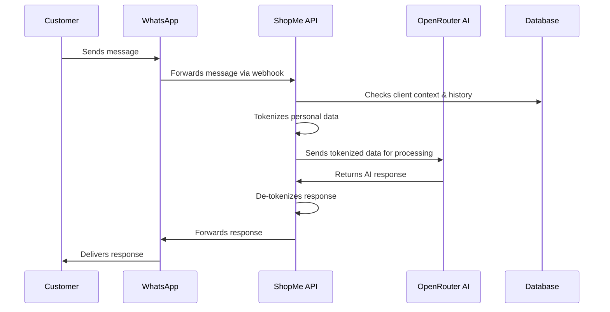

# ShopMe - WhatsApp E-commerce Platform

# PARTE I: REQUISITI DI BUSINESS E FUNZIONALI

## 1. Panoramica Esecutiva

ShopMe è una piattaforma SaaS rivoluzionaria che trasforma WhatsApp in un potente canale e-commerce, connettendo le aziende direttamente con i clienti attraverso conversazioni intelligenti e automatizzate. Costruita sulle fondamenta dell'AI e del commercio conversazionale, ShopMe consente alle aziende di fornire esperienze di acquisto senza soluzione di continuità e un servizio clienti eccezionale attraverso l'app di messaggistica più popolare al mondo.

### Perché ShopMe è importante

Nel panorama digitale odierno, le aziende affrontano numerose sfide:

- Il supporto clienti deve essere sempre più disponibile 24/7
- L'attenzione dei consumatori è frammentata su più piattaforme
- L'e-commerce tradizionale richiede ai clienti di scaricare app o navigare su siti web
- Le piccole e medie imprese non dispongono delle risorse necessarie per soluzioni digitali complete

ShopMe risolve queste sfide incontrando i clienti dove già si trovano—su WhatsApp, con oltre 2 miliardi di utenti attivi in tutto il mondo. La nostra soluzione elimina l'attrito nel percorso di acquisto consentendo transazioni complete attraverso conversazioni naturali, senza richiedere ai clienti di abbandonare la loro piattaforma di messaggistica preferita.

### Vantaggi principali

1. **Servizio clienti 24/7**: I nostri chatbot alimentati dall'AI forniscono risposte immediate in qualsiasi momento, garantendo che le richieste dei clienti non rimangano mai senza risposta e che le opportunità di vendita non vadano mai perse.

2. **Aumento dei tassi di conversione**: Riducendo l'attrito nel percorso di acquisto e fornendo assistenza personalizzata, le aziende possono convertire più richieste in vendite.

3. **Miglioramento del coinvolgimento dei clienti**: Le conversazioni in linguaggio naturale creano interazioni più coinvolgenti e simili a quelle umane rispetto alle interfacce di e-commerce tradizionali.

4. **Efficienza operativa**: L'automazione delle richieste e dei processi di routine riduce il carico di lavoro del personale e i costi operativi, migliorando al contempo i tempi di risposta.

5. **Informazioni preziose sui clienti**: Ogni conversazione genera dati preziosi che aiutano le aziende a comprendere le preferenze dei clienti e a migliorare le loro offerte nel tempo.

6. **Scalabilità senza complessità**: Il modello SaaS consente alle aziende di qualsiasi dimensione di implementare sofisticate capacità di e-commerce senza competenze tecniche o investimenti importanti.

ShopMe rappresenta la prossima evoluzione nell'e-commerce—uno in cui il commercio avviene in modo conversazionale, le aziende sono sempre disponibili e lo shopping è semplice come inviare un messaggio.

### Visione del progetto

Il progetto ShopMe mira a sviluppare una piattaforma di e-commerce basata su WhatsApp che sfrutta l'API WhatsApp Business e la tecnologia AI per automatizzare il supporto clienti e la gestione degli ordini. Progettata come soluzione Software as a Service (SaaS), la piattaforma consente alle aziende di creare la propria presenza e-commerce white-label con configurazione minima. L'obiettivo è fornire assistenza immediata e continua 24/7, migliorando l'esperienza del cliente e semplificando le operazioni aziendali.

#### Caso d'uso iniziale: Chatbot per prodotti italiani

Come prima implementazione, la piattaforma sarà specializzata nella vendita di prodotti italiani di alta qualità. Gli utenti potranno:

**Scoperta e informazioni sui prodotti**:

- Accedere a informazioni dettagliate sui prodotti
- Ricevere consigli personalizzati sui prodotti
- Conoscere le storie dei produttori e i metodi di produzione tradizionali

**Gestione degli ordini**:

- Effettuare ordini direttamente tramite chatbot WhatsApp
- Ricevere conferme d'ordine immediate
- Monitorare lo stato della spedizione
- Scaricare fatture e documenti fiscali
- Gestire resi e reclami

**Assistenza clienti**:

- Richiedere informazioni sui prodotti e consigli
- Ricevere consigli su abbinamenti e utilizzo dei prodotti
- Ricevere assistenza post-vendita
- Accedere a FAQ e guide sui prodotti

## 2. Casi d'Uso e Segmenti di Mercato

### Espansione futura del settore

Mentre l'MVP iniziale si concentra esclusivamente sull'e-commerce per prodotti italiani, la piattaforma è architettonicamente progettata per supportare la futura espansione in vari settori basati sui servizi, tra cui:

**Palestre e centri fitness**:

- Prenotazione di lezioni e gestione degli abbonamenti
- Programmazione delle sessioni di personal training
- Consegna di piani di allenamento tramite messaggistica
- Monitoraggio degli obiettivi di fitness e aggiornamenti sui progressi

**Ristoranti e caffè**:

- Prenotazioni di tavoli e gestione delle liste d'attesa
- Navigazione nel menu digitale tramite interfaccia di chat
- Prenotazioni per eventi speciali (cene private, catering)
- Coordinamento della consegna tramite messaggistica

**Hotel e alloggi**:

- Prenotazione di camere e verifica della disponibilità tramite WhatsApp
- Promemoria automatici per check-in/check-out
- Gestione delle richieste speciali tramite interfaccia di chat
- Ordinazione del servizio in camera tramite messaggistica

Questa espansione pianificata sarà sviluppata nelle fasi future dopo che la funzionalità core di e-commerce sarà stata implementata con successo e convalidata sul mercato.

La piattaforma è progettata per qualsiasi azienda che offra prodotti o servizi ai clienti, dai negozi al dettaglio e fornitori di servizi alle attività di ospitalità come hotel, ristoranti, palestre e centri fitness. Questa versatilità consente alle aziende non solo di vendere prodotti, ma anche di gestire appuntamenti, prenotazioni e abbonamenti attraverso interfacce conversazionali.

## 3. Journey Utente

### Esperienza dell'amministratore

- Accesso a una dashboard web per:
  - Creare e gestire più workspace.
  - Configurare canali WhatsApp (numeri di telefono, token API, webhook).
  - Personalizzare prompt AI, aggiungere prodotti (con foto, testo, prezzi, offerte) e organizzarli in categorie di servizi.
  - Gestire prodotti, servizi e clienti attraverso interfacce intuitive.

### Esperienza dell'utente finale

- Interazione esclusivamente tramite WhatsApp:
  - **Primo contatto**: I nuovi utenti ricevono un messaggio di benvenuto che introduce il servizio.
  - **Processo di registrazione**:
    - Per gli utenti non registrati, il sistema genera automaticamente e invia un link di registrazione unico tramite WhatsApp.
    - Il link indirizza gli utenti a un modulo di registrazione web sicuro.
    - Il modulo di registrazione raccoglie informazioni essenziali:
      - Nome (obbligatorio)
      - Cognome (obbligatorio)
      - Nome azienda (obbligatorio)
      - Selezione della lingua preferita (obbligatorio) - La lingua predefinita viene rilevata dal browser dell'utente
      - Selezione della valuta preferita (obbligatorio) - EUR predefinito
      - Consenso GDPR con testo completo della politica sulla privacy visualizzato per la revisione
      - Casella di consenso per le notifiche push con etichetta: "Sei interessato a ricevere offerte con notifiche push? Potrai annullare l'iscrizione quando vorrai" (facoltativo)
      - Pulsante Invia per completare la registrazione
    - Dopo l'invio con successo, l'utente viene registrato nel sistema e può continuare immediatamente la sua interazione tramite WhatsApp.
    - Viene inviato un messaggio di benvenuto personalizzato nella lingua selezionata dall'utente, che conferma la registrazione e spiega le misure di protezione dei dati, incluso un link a una pagina dedicata con informazioni dettagliate sul sistema di crittografia utilizzato per proteggere i dati.
  - **Utenti abituali**: Gli utenti esistenti ricevono un saluto personalizzato e possono richiedere informazioni, effettuare ordini e ricevere comunicazioni.
  - **Esperienza continua**: Tutte le interazioni successive avvengono senza interruzioni all'interno di WhatsApp, creando un'esperienza di acquisto senza attrito.

## 4. Requisiti Funzionali

### Gestione utenti:

- Registrazione e login: Autenticazione sicura e gestione del profilo.
- Recupero password: Funzionalità per il reset delle credenziali.

### Catalogo prodotti:

- Visualizzazione prodotti: Elenco e vista dettagliata dei prodotti con immagini, descrizioni e prezzi.
- Ricerca e filtro: Strumenti per cercare prodotti per categoria, prezzo, popolarità, ecc.
- Categorie: Gestione delle categorie di prodotti per una migliore organizzazione.

### Gestione carrello tramite WhatsApp:

- Interfaccia conversazionale: Consente agli utenti di gestire il proprio carrello tramite messaggi WhatsApp.
- Aggiungere/rimuovere prodotti: Comandi per aggiungere o rimuovere prodotti dal carrello.
- Visualizzazione stato carrello: Invio di riepiloghi e aggiornamenti del carrello tramite WhatsApp.

### Checkout e pagamenti online:

- Conferma ordine: Dopo la gestione del carrello su WhatsApp, l'utente viene reindirizzato a una piattaforma web per confermare l'ordine.
- Pagamenti online: Procedura di pagamento sicura e integrata sulla piattaforma online.

### Integrazione AI:

- Implementazione RAG: Generazione aumentata da recupero per un migliore contesto aziendale con dati dei clienti.
- Prompt personalizzabili: Configurare le risposte AI per riflettere la voce e le politiche aziendali.
- Consapevolezza del contesto: L'AI comprende la cronologia delle conversazioni e le preferenze dell'utente.
- Pseudonimizzazione dei dati: Protezione della privacy durante l'elaborazione dei dati con modelli esterni.
- Traduzioni automatiche: Supporto per più lingue nella stessa conversazione.
- Test dei prompt: Possibilità di testare prompt alternativi in sessioni isolate senza influire sul prompt di produzione attivo. Questo consente agli amministratori di sperimentare in sicurezza comportamenti AI diversi prima di implementarli per i clienti.
- Duplicazione dei prompt: Possibilità di duplicare i prompt esistenti per creare variazioni o backup, mantenendo la struttura originale consentendo modifiche alla copia. Questa funzionalità consente agli utenti di iterare su prompt di successo esistenti senza dover partire da zero.

### Gestione ordini e monitoraggio:

> ⚠️ Nota: Questa funzionalità è stata spostata in "Fuori Ambito". Vedere la sezione "Funzionalità fuori ambito" per i dettagli.

La seguente funzionalità era originariamente pianificata ma è ora fuori ambito:

- Cronologia ordini: Visualizzazione degli acquisti passati e dello stato dell'ordine corrente
- Monitoraggio spedizione: Aggiornamenti in tempo reale sullo stato della spedizione
- Gestione fatture: Generazione e download delle fatture
- Elaborazione resi: Gestione dei resi di prodotti e rimborsi

Per la versione attuale, gli utenti possono sfogliare i prodotti e interagire con il chatbot, ma l'elaborazione effettiva degli ordini dovrà essere gestita tramite sistemi esterni.

### Gestione clienti:

- Profili cliente: Mantenere registri completi di tutti i clienti.
- Cronologia acquisti: Tracciare i modelli di acquisto e le preferenze dei clienti.
- Registro comunicazioni: Accesso alle interazioni passate con i clienti.
- Blocco utenti: Possibilità di bloccare specifici utenti dall'interagire con il sistema attraverso l'interfaccia di chat, prevenendo potenziali abusi.
- Gestione prenotazioni: Tracciare e gestire prenotazioni e appuntamenti dei clienti (espansione futura).
- Notifiche push: Inviare messaggi mirati per marketing, promemoria e programmi di fidelizzazione.

### Cronologia chat:

- Registri conversazioni: Revisione e analisi delle conversazioni WhatsApp con i clienti.
- Ricerca messaggi: Ricerca nella cronologia chat per informazioni specifiche.

### Analisi utilizzo:

- Monitoraggio utilizzo: Raccolta e analisi dei dati di utilizzo della piattaforma per comprendere il comportamento degli utenti.
- Report di utilizzo: Generazione di report e statistiche per migliorare l'esperienza e ottimizzare le funzionalità.

### Dashboard amministrativa:

- Gestione contenuti: Strumenti per aggiungere, modificare o rimuovere prodotti e categorie.
- Report e analisi: Statistiche su vendite, traffico e prestazioni del sistema.

### Sistema di prenotazione (espansione futura):

- Programmazione appuntamenti: Consentire ai clienti di prenotare servizi tramite WhatsApp.
- Prenotazioni tavoli: Abilitare la gestione delle prenotazioni ristorante.
- Prenotazioni camere: Gestire le prenotazioni delle camere d'albergo.
- Registrazioni corsi: Gestire le iscrizioni e la partecipazione ai corsi in palestra.
- Gestione capacità: Monitorare la disponibilità e prevenire il sovraffollamento.
- Promemoria automatici: Inviare notifiche prima degli appuntamenti.

### Campagne di notifiche push:

- Messaggistica mirata: Inviare offerte personalizzate basate sulla cronologia dei clienti.
- Promemoria automatici: Notificare ai clienti appuntamenti o prenotazioni imminenti.
- Campagne di riattivazione: Raggiungere clienti inattivi.
- Promozioni speciali: Annunciare offerte e sconti a tempo limitato.
- Programmi fedeltà: Aggiornare i clienti su punti, premi e traguardi.
- Notifiche eventi: Informare i clienti su eventi imminenti o nuovi servizi.

## 5. Accettazione e Anti-Abuso

### Criteri di accettazione

- Funzionalità CRUD completamente operativa per workspaces, prodotti, prompt, servizi, lingue e utenti.
- Risposte del chatbot generate in pochi secondi.
- Comunicazione API protetta tramite token JWT.
- Dashboard intuitiva con autenticazione 2FA.
- Sistema di protezione anti-abuso che blocca automaticamente gli utenti che inviano più di 8 messaggi al minuto.
- Funzionalità di blocco manuale che consente agli amministratori di bloccare specifici utenti direttamente dall'interfaccia di chat quando necessario.

### Sistema Anti-Abuso

Per prevenire l'abuso del sistema e garantire un'equa allocazione delle risorse, la piattaforma implementa un meccanismo automatico di limitazione della frequenza:

- Se un utente invia più di 8 messaggi in una finestra di 60 secondi, lo stato del suo profilo viene automaticamente modificato in "bloccato"
- Il sistema risponde con un messaggio: "Il tuo numero è stato bloccato a causa di un uso improprio. Contatta l'amministratore per sbloccarlo."
- Gli amministratori possono visualizzare gli utenti bloccati nella dashboard e sbloccare manualmente gli utenti legittimi
- Il sistema mantiene registri degli eventi di blocco per l'analisi della sicurezza

Inoltre, gli amministratori possono bloccare manualmente gli utenti problematici direttamente dall'interfaccia di chat:

- Un pulsante di blocco nell'intestazione della chat consente il blocco immediato dell'utente corrente
- Quando vengono bloccati manualmente, gli utenti ricevono una notifica sul loro stato di blocco
- Gli amministratori possono visualizzare e gestire tutti gli utenti bloccati da una sezione centralizzata nella dashboard
- Le azioni di blocco/sblocco vengono registrate per scopi di audit

Questo approccio duale (blocco automatico e manuale) protegge dagli attacchi spam, previene lo spreco di risorse AI e garantisce un'esperienza fluida per tutti gli utenti legittimi. I limiti di frequenza e le politiche di blocco sono configurabili dagli amministratori del workspace per soddisfare le diverse esigenze aziendali e i modelli di utilizzo.

## 6. Obiettivi e Non-Obiettivi

### Obiettivi di business

- Ridurre significativamente il tempo del servizio clienti attraverso l'automazione.
- Fornire supporto clienti 24/7.
- Fidelizzare i clienti attraverso future campagne push (ad es. saluti, promozioni, promemoria di appuntamenti).
- Consentire alle aziende di tutti i tipi di coinvolgere i clienti attraverso interfacce di messaggistica familiari.
- Creare una piattaforma versatile adattabile a vari settori e modelli di business.

### Non-Obiettivi (MVP)

- **Sistema di pagamento integrato e piano di pagamento funzionante:**

  - Questo combina l'originale "Implementare un sistema di pagamento integrato" e "Utilizzo e un piano funzionale per i pagamenti."
  - È cruciale affermare che _sia_ l'_implementazione_ che un _piano dettagliato_ sono fuori dall'ambito dell'MVP.
  - **Motivazione:** Anche un piano di alto livello ha implicazioni di design. Se si rimandano _tutte_ le considerazioni di pagamento, si rischiano problemi architetturali in seguito. Tuttavia, nell'MVP, l'_integrazione effettiva_ e il _flusso di pagamento completo_ non sono richiesti.

- **Statistiche di utilizzo e analisi:**

  - Questo è più chiaro di "Utilizzo" e lo separa da altre preoccupazioni.
  - **Motivazione:** Raccogliere e visualizzare analisi dettagliate può essere complesso. L'MVP dovrebbe concentrarsi sulla funzionalità di base.

- **Campagne push e automazione marketing:**

  - Questo è più specifico di "Campagne push."
  - **Motivazione:** Le funzionalità di automazione del marketing vengono spesso aggiunte in seguito per migliorare il coinvolgimento degli utenti.

- **Autenticazione e sicurezza avanzata:**

  - Questo raggruppa funzionalità di sicurezza correlate.
  - Include:
    - JSON Web Tokens (JWT) per l'autenticazione (se si sta utilizzando un'autenticazione più semplice per l'MVP)
    - Autenticazione 2FA (Two-Factor Authentication)
    - Funzionalità "Password dimenticata"
    - "Crea utente" (se si sta gestendo la creazione utente in modo molto basilare per l'MVP)
  - **Motivazione:** Mentre la sicurezza di base è essenziale, l'autenticazione più complessa può essere rimandata.

- **Infrastruttura di scalabilità e monitoraggio:**

  - Questo è più specifico di "scalare e monitorare il sistema."
  - **Motivazione:** Mentre è necessario _progettare_ per la scalabilità, la _completa infrastruttura_ e la configurazione di monitoraggio possono essere incrementali.
    - Per l'MVP, la scalabilità potrebbe essere gestita manualmente o con strumenti di base.
    - Il monitoraggio dettagliato delle prestazioni e la scalabilità automatizzata possono arrivare in seguito.

- **Implementazione completa della conformità GDPR:**

  - Questo è formulato con attenzione. **Deve** _considerare_ il GDPR fin dall'inizio, ma l'_implementazione completa e rifinita_ può essere graduale.
  - **Motivazione:**

    - Non si può ignorare la privacy. Il design deve preservare la privacy.
    - Tuttavia, funzionalità come la gestione dettagliata del consenso, l'esportazione della portabilità dei dati e i log di audit completi possono essere sviluppati in modo incrementale.
    - I principi _fondamentali_ (minimizzazione dei dati, sicurezza) _devono_ essere in atto.

- **Upload immagini prodotto su S3/Cloud Storage:**

  - Integrazione con servizi di cloud storage per il caricamento e la gestione delle immagini dei prodotti.
  - **Motivazione:** Mentre la gestione delle immagini dei prodotti è importante, l'MVP può utilizzare approcci più semplici come riferimenti URL alle immagini esistenti. La piena integrazione con S3 o servizi di cloud storage simili sarà implementata nelle versioni future.

  - Gli ambienti di sviluppo e l'infrastruttura di monitoraggio possono essere gradualmente implementati.
  - Offerte di prodotti

### Funzionalità fuori ambito

Queste funzionalità sono state determinate essere completamente fuori dall'ambito della versione attuale del prodotto. A differenza dei Non-Obiettivi (MVP) che saranno implementati nelle fasi future, queste funzionalità non sono pianificate per l'implementazione nella roadmap immediata.

1. **Sistema di gestione ordini:**

   - Elaborazione e monitoraggio completo degli ordini
   - Gestione dello stato dell'ordine
   - Generazione e gestione delle fatture
   - Integrazione con la spedizione e monitoraggio
   - Elaborazione di resi e rimborsi
   - **Motivazione:** Dopo la valutazione, abbiamo determinato che il sistema completo di gestione degli ordini richiede una significativa integrazione con sistemi esterni (pagamento, spedizione, ecc.) e una logica di business complessa che andrebbe oltre la nostra attuale capacità di sviluppo. Gli utenti possono ancora sfogliare i prodotti e interagire con il chatbot, ma l'elaborazione effettiva degli ordini dovrà essere gestita attraverso sistemi esterni.

2. **Gestione campagne marketing:**

   - Creazione e pianificazione di campagne
   - Strumenti di test A/B
   - Analisi delle campagne
   - Segmentazione del pubblico
   - **Motivazione:** Le funzionalità delle campagne di marketing richiedono un'integrazione complessa con i sistemi di analisi e tracciamento del comportamento degli utenti che va oltre il nostro ambito attuale.

3. **Dashboard analitica avanzata:**
   - Analisi in tempo reale
   - Generazione di report personalizzati
   - Strumenti di visualizzazione dati
   - Capacità di esportazione
   - **Motivazione:** L'analisi avanzata richiede significative capacità di elaborazione e archiviazione dei dati che non sono allineate con i nostri attuali piani infrastrutturali.

# PARTE II: SPECIFICHE TECNICHE

## 1. Architettura Tecnica

- **Frontend**: React (ultima versione) con libreria shadcn/ui e Tailwind CSS per accelerare lo sviluppo.
- **Backend**: Node.js con pattern Domain Driven Design (DDD).
- **Database**: PostgreSQL.
- **Architettura SaaS**: Design multi-tenant con completo isolamento dei dati tra workspace.
- **Servizio AI**: OpenRouter (RAG) con pseudonimizzazione dei dati.
- **Integrazione WhatsApp**: API ufficiale Meta.
- **Sicurezza**: HTTPS, token JWT, dati sensibili crittografati nel database.
- **Ambienti**: Sviluppo, test e produzione; ogni workspace può attivare la modalità debug con un numero di test.

### Integrazione OpenRouter e Flusso Dati

Il sistema utilizza le capacità di Generazione Aumentata da Recupero (RAG) di OpenRouter per alimentare le interazioni assistite dall'AI all'interno della piattaforma. Ecco come fluiscono i dati:



1. **Raccolta Dati**: Quando viene ricevuto un messaggio WhatsApp da un cliente, arriva attraverso l'API Meta.

2. **Pre-elaborazione**: Il backend identifica qualsiasi informazione personale o sensibile nel messaggio in entrata.

3. **Pseudonimizzazione**: Prima di inviare i dati a OpenRouter, tutti gli identificatori personali vengono sostituiti con token.

4. **Elaborazione AI**: I dati tokenizzati vengono inviati a OpenRouter, che genera risposte contestualmente appropriate basate sui modelli di prompt e sulle informazioni sui prodotti.

5. **Post-elaborazione**: Il backend sostituisce i token nella risposta AI con i dati personali effettivi prima di inviare la risposta al cliente.

6. **Consegna Risposta**: La risposta elaborata finale viene inviata al cliente tramite l'API WhatsApp.

Questa architettura garantisce che nessuna informazione personale identificabile (PII) sia esposta ai servizi AI esterni, mantenendo al contempo la qualità conversazionale e la personalizzazione delle risposte.

### Architettura Multi-Tenant

La piattaforma ShopMe segue una rigorosa architettura multi-tenant in cui ogni attività cliente opera all'interno del proprio workspace isolato. Questo approccio architettonico garantisce isolamento dei dati, sicurezza e scalabilità.

#### Isolamento Dati Basato su Workspace

1. **Implementazione Database**:

   - Ogni entità principale nel database include un riferimento di chiave esterna `workspace_id`
   - I vincoli del database garantiscono che le entità possano essere associate solo a un singolo workspace
   - Le query sono sempre limitate a uno specifico workspace_id per prevenire la perdita di dati tra tenant
   - I trigger del database applicano l'isolamento dei dati del workspace nelle operazioni di inserimento/aggiornamento

2. **Filtraggio Richieste API**:

   - Tutti gli endpoint API (eccetto l'autenticazione) richiedono un contesto di workspace
   - L'identificazione del workspace viene gestita attraverso:
     - Parametro esplicito `workspace_id` per richieste GET
     - Campo `workspace_id` nei corpi delle richieste per richieste POST/PUT
     - Payload del token JWT contenente il contesto del workspace per richieste autenticate
   - Il middleware API applica automaticamente il filtraggio per workspace a tutte le query del database
   - I tentativi di accedere a dati attraverso workspace sono bloccati con risposte 403 Forbidden

3. **Relazione Utente-Workspace**:
   - Gli utenti possono essere associati a più workspace attraverso la tabella di giunzione `user_workspaces`
   - Ogni associazione utente-workspace ha un ruolo specifico (admin, manager, agent, ecc.)
   - La gestione delle sessioni include il contesto del workspace attivo
   - Il cambio di workspace richiede un'azione esplicita dell'utente e il ristabilimento del contesto della sessione

#### Misure di Sicurezza per l'Isolamento del Tenant

1. **Sicurezza a Livello di Query**:

   - Il livello ORM/Repository implementa il filtraggio per workspace come middleware non bypassabile
   - Le query SQL dirette sono proibite; tutti gli accessi al database passano attraverso repository consapevoli del workspace
   - La validazione del workspace avviene a livello di controller, servizio e repository (difesa in profondità)

2. **Allocazione Risorse**:

   - Ogni workspace ha limiti di risorse configurabili (limiti di frequenza API, quote di storage, ecc.)
   - Il monitoraggio delle risorse tiene traccia dell'utilizzo per workspace
   - L'isolamento del tenant impedisce che il consumo di risorse da parte di un tenant influisca su altri

3. **Esportazione/Importazione Dati**:
   - Le funzioni di esportazione dati includono la validazione del workspace
   - Le operazioni in blocco mantengono il contesto del workspace per tutti i record interessati
   - I processi ETL applicano i confini del workspace

L'architettura multi-tenant garantisce che:

- I dati di ogni cliente rimangano completamente isolati da altri clienti
- Le richieste API siano sempre limitate al workspace del cliente richiedente
- Le operazioni del database mantengano i confini del tenant in ogni momento
- Gli utenti con accesso a più workspace possano operare solo all'interno di un contesto di workspace alla volta

Questo approccio consente al sistema di servire in modo sicuro più aziende mantenendo una rigorosa separazione dei dati e ottimizzando l'utilizzo delle risorse.

## 2. Frontend

### Implementazione Frontend

Il frontend sarà costruito utilizzando Vite e React, insieme a Tailwind CSS e shadcn/ui per lo styling. Questa architettura offre diversi vantaggi:

- **Sviluppo Veloce**: HMR (Hot Module Replacement) ultra veloce di Vite
- **Proxy API**: Configurazione proxy integrata per una integrazione API senza soluzione di continuità
- **Isolamento Componenti**: Chiara separazione delle preoccupazioni con componenti modulari
- **Sicurezza dei Tipi**: Supporto completo TypeScript
- **Styling**: Approccio utility-first con Tailwind CSS per sviluppo rapido
- **Componenti UI**: Shadcn/ui per componenti coerenti e accessibili

### Layout Dashboard

La dashboard segue un design moderno e pulito con enfasi su usabilità ed efficienza:

- **Navigazione**: Barra laterale sinistra con icone di categoria chiare
- **Area Contenuto**: Allineamento centrale con design responsive
- **Controlli**: Posizionati in modo coerente nella parte superiore delle sezioni di contenuto
- **Visualizzazione Dati**: Organizzati in tabelle e card con spaziatura coerente

### Schema Colori

L'applicazione segue uno schema colori coerente per mantenere l'identità del marchio:

- **Primario**: Verde (#10b981) - Utilizzato per azioni primarie, pulsanti ed elementi UI chiave
- **Secondario**: Grigio (#6b7280) - Utilizzato per elementi secondari, testo e bordi
- **Accento**: Blu (#3b82f6) - Utilizzato con parsimonia per evidenziare informazioni importanti
- **Neutro**: Bianco (#f9fafb) - Utilizzato per sfondi e spaziatura
- **Errore**: Rosso (#ef4444) - Utilizzato per errori, avvisi e azioni distruttive
- **Avviso**: Giallo (#f59e0b) - Utilizzato per avvertimenti e notifiche di cautela
- **Successo**: Verde (#10b981) - Utilizzato per messaggi di successo e conferme

### Badge di Notifica

L'applicazione implementa un sistema di badge di notifica nella navigazione laterale per avvisare gli utenti su azioni in sospeso ed elementi che richiedono attenzione:

#### Badge Cronologia Chat

- **Scopo**: Visualizza il conteggio totale di messaggi non letti in tutte le conversazioni chat
- **Aspetto Visivo**: Un piccolo badge circolare rosso contenente un numero bianco
- **Comportamento**:
  - Inizialmente mostra un conteggio di 2 messaggi non letti quando l'applicazione si carica
  - Si aggiorna in tempo reale quando arrivano nuovi messaggi
  - Quando un utente apre una chat, i messaggi associati vengono segnati come letti
  - Il conteggio del badge diminuisce man mano che i messaggi vengono letti
  - Il badge scompare completamente quando tutti i messaggi sono letti (conteggio uguale a zero)
  - Dopo la lettura di tutti i messaggi, l'icona Cronologia Chat rimane senza badge fino all'arrivo di nuovi messaggi non letti

#### Badge Clienti

- **Scopo**: Indica il numero di clienti sconosciuti che richiedono identificazione o completamento del profilo
- **Aspetto Visivo**: Badge circolare rosso simile con numero bianco
- **Comportamento**:
  - Mostra un conteggio costante di 2 clienti sconosciuti per impostazione predefinita
  - Rappresenta i clienti che hanno contattato l'azienda ma non sono stati profilati correttamente
  - Quando gli amministratori identificano e categorizzano correttamente questi clienti, il conteggio del badge dovrebbe aggiornarsi
  - Serve come promemoria per mantenere registri dei clienti puliti e completi

#### Dettagli Implementazione

- I conteggi dei badge sono memorizzati in variabili di stato del componente e aggiornati attraverso chiamate API
- Il sistema aggiorna i conteggi dei badge in questi scenari:
  - Al caricamento iniziale della pagina
  - Quando un utente legge i messaggi
  - Quando arriva un nuovo messaggio (tramite polling o websocket)
  - Quando i profili dei clienti vengono aggiornati
- Lo stile visivo del badge è coerente in tutta l'applicazione:
  - Dimensione: Compatta (diametro 16-20px)
  - Posizione: Angolo superiore destro dell'elemento di navigazione associato
  - Colore: Sfondo rosso (#ef4444) con testo bianco
  - Animazione: Sottile animazione di entrata quando il conteggio cambia

Questo sistema di notifica migliora l'efficienza del flusso di lavoro fornendo indizi visivi per le azioni in sospeso, aiutando gli amministratori a dare priorità ai loro compiti e garantire risposte tempestive ai clienti.

## 3. Backend

### Panoramica

Il sistema backend di questa applicazione PDR sarà sviluppato utilizzando Node.js con il framework Express.js, adottando il pattern architetturale Domain-Driven Design (DDD) e implementato come monorepo utilizzando Turborepo. Questa architettura consente un'efficiente organizzazione del codice, dipendenze condivise e build ottimizzate su più pacchetti.

La struttura monorepo, alimentata da Turborepo, offre diversi vantaggi chiave:

- Gestione centralizzata del codice con configurazioni condivise
- Pipeline di build ottimizzata con caching intelligente
- Esperienza di sviluppo coerente su più pacchetti
- Gestione efficiente delle dipendenze
- Tooling e processi standardizzati

### Funzionalità Chiave

#### Messaggi di Benvenuto Multilingue

Il sistema supporta messaggi di benvenuto configurabili in più lingue:

- **Lingue**: Italiano (IT), Inglese (EN) e Spagnolo (ES)
- **Archiviazione**: I messaggi di benvenuto sono memorizzati nelle impostazioni del Workspace come dati JSON
- **Configurazione**: Gli utenti amministratori possono personalizzare i messaggi di benvenuto per ogni lingua attraverso l'interfaccia Impostazioni
- **Utilizzo**: La versione linguistica appropriata viene selezionata automaticamente in base a:
  - Preferenza linguistica esplicita dell'utente (se impostata)
  - Rilevamento della lingua del saluto iniziale (Hola → Spagnolo, Hello → Inglese, Ciao → Italiano)
  - Lingua predefinita del workspace (fallback)
- **Formato**: I messaggi possono includere emoji e formattazione per un'esperienza amichevole e coinvolgente

Questa funzionalità garantisce che gli utenti ricevano saluti culturalmente appropriati che stabiliscono il tono giusto per la conversazione fin dall'inizio, migliorando la personalizzazione dell'esperienza del cliente.

### Struttura Monorepo

```
.
├── apps/
│   ├── web/          # Applicazione frontend Next.js
│   └── backend/      # Applicazione backend Node.js
├── packages/
│   ├── eslint-config/    # Configurazione ESLint condivisa
│   ├── typescript-config/ # Configurazione TypeScript condivisa
│   └── ui/              # Componenti UI condivisi
├── package.json     # package.json root
└── turbo.json      # Configurazione Turborepo
```

### Implementazione Sicurezza

La sicurezza del sistema è una priorità. Pertanto, saranno implementate misure di sicurezza raccomandate da OWASP, tra cui:

- Validazione input per prevenire attacchi di iniezione
- Gestione sicura delle sessioni per proteggere l'autenticazione utente
- Protezione contro SQL injection e Cross-Site Scripting (XSS) per garantire l'integrità dei dati
- Validazione token JWT e meccanismi di refresh
- Rate limiting e throttling delle richieste
- Implementazione header di sicurezza
- Configurazione policy CORS

### Stack Tecnico e Organizzazione

#### Tecnologie Core

- Node.js con Express.js
- PostgreSQL con Prisma ORM
- Redis per caching
- Docker per containerizzazione

#### Livelli Architettura

1. **Livello Routes**

   - Definizioni endpoint API
   - Validazione richieste
   - Formattazione risposte
   - Middleware gestione errori

2. **Livello Use Cases**

   - Implementazione logica business
   - Gestione transazioni
   - Gestione eventi
   - Orchestrazione servizi

3. **Livello Services**

   - Logica di dominio
   - Integrazione servizi esterni
   - Trasformazione dati
   - Applicazione regole business

4. **Livello Repository**
   - Pattern accesso dati
   - Ottimizzazione query
   - Gestione cache
   - Persistenza dati

### Gestione errori e logging

- Gestione errori centralizzata
- Logging strutturato con Winston
- Tracciamento ID richiesta
- Monitoraggio performance
- Segnalazione errori e allerta

### Flusso API Messaggistica WhatsApp

La piattaforma implementa un flusso di messaggistica completo attraverso la `MessageProcessorAPI` che gestisce tutte le comunicazioni WhatsApp. Questa API funge da middleware principale tra i messaggi WhatsApp in entrata e le risposte alimentate dall'AI.

#### Architettura del Flusso

Il flusso di messaggistica segue questa sequenza:

1. **Ricezione**: I messaggi in entrata da WhatsApp vengono ricevuti tramite webhook
2. **Verifica Challenge**: Il sistema controlla se il workspace è attivo
3. **Identificazione Utente**: Il sistema identifica l'utente e controlla se è nuovo o esistente
4. **Selezione Agente**: Per gli utenti esistenti, viene selezionato l'agente specializzato appropriato in base al contesto del messaggio
5. **Caricamento Contesto**: Vengono recuperati i dati utente, la cronologia degli ordini e i messaggi precedenti
6. **Protezione Dati**: I dati personali vengono tokenizzati prima dell'elaborazione
7. **Elaborazione AI**: Il messaggio tokenizzato viene elaborato dall'AI OpenRouter
8. **Formattazione Risposta**: La risposta AI viene resa conversazionale
9. **Ripristino Dati**: I token vengono sostituiti con i dati utente effettivi
10. **Tracciamento Cronologia**: Lo scambio viene registrato nella cronologia chat
11. **Consegna**: La risposta viene inviata all'utente tramite WhatsApp

#### Implementazione

L'API è implementata attraverso la seguente funzione principale:

```javascript
try {
  // Check if challenge is active
  if (!isChallengeActive()) {
    inactiveMessage = getInactiveMessage()
    sendMessage(inactiveMessage)
    return
  }

  let systemResp
  const message = GetQuestion()
  const userID = GetUserId()
  const userInfo = getUserData(userID)
  const isNewUser = isPresent(userInfo) ? false : true

  if (isNewUser) {
    // New link to the registration form
    return "LINK"
  } else {
    // 0. GET DATA
    routerAgent = getRouterAgent()
    const agentSelected = GetAgentDedicatedFromRouterAgent(routerAgent, message)
    const prompt = loadPrompt(agentSelected)
    const orders = getOrders()
    const products = getProducts()
    const historyMessages = GetHistory("last 30 messages")

    // 1. TOKENIZE (ora restituisce anche la mappa)
    const { fakeMessage, fakeUserInfo, tokenMap } = Tokenize(message, userInfo)

    // 2. OPENROUTER
    systemResp = getResponse(
      prompt,
      agentSelected,
      historyMessages,
      fakeMessage,
      fakeUserInfo,
      orders,
      products
    )
    // Attach a calling function when we have the order details
    // Attach a calling function when we have to send the invoices

    // 4. CONVERSIONAL RESPONSE
    systemResp = conversationalResponse(
      "metti la frase in maniera discorsiva:" + systemResp
    )

    // 5. DETOKENIZE
    const resp = Detokenize(systemResp, systemResp)

    // 6. SAVE TO HISTORY
    saveToChatHistory(userID, agentSelected, message, resp)

    return resp
  }
} catch (error) {
  console.error("Errore in main:", error)
}
```

#### Requisiti Database

Per supportare questo flusso di messaggistica, il database include le seguenti entità chiave:

- **ChatSession**: Tiene traccia delle conversazioni in corso con metadati
- **Message**: Memorizza singoli messaggi con direzione, contenuto e stato
- **Prompts**: Memorizza configurazioni e prompt degli agenti AI
- **Customers**: Contiene dati utente e preferenze

Questi modelli supportano l'interfaccia conversazionale mostrata nell'interfaccia chat della piattaforma.

## 4. Database

### Modello Database

L'applicazione utilizza PostgreSQL come sistema di database, con Prisma ORM per l'accesso ai dati e la gestione delle migrazioni. Di seguito è riportato lo schema completo definito in Prisma:

```prisma
generator client {
  provider = "prisma-client-js"
}

datasource db {
  provider = "postgresql"
  url      = env("DATABASE_URL")
}

model Workspace {
  id                  String            @id @default(cuid())
  name                String
  slug                String            @unique
  whatsappPhoneNumber String?
  whatsappApiKey      String?
  notificationEmail   String?
  webhookUrl          String?
  isActive            Boolean           @default(true)
  language            String            @default("ENG")
  createdAt           DateTime          @default(now())
  updatedAt           DateTime          @updatedAt
  isDelete            Boolean           @default(false)
  currency            String            @default("EUR")
  challengeStatus     Boolean           @default(false)
  wipMessages         Json?             @default("{\"it\": \"Lavori in corso. Contattaci più tardi.\", \"en\": \"Work in progress. Please contact us later.\", \"es\": \"Trabajos en curso. Por favor, contáctenos más tarde.\", \"pt\": \"Em manutenção. Por favor, contacte-nos mais tarde.\"}")
  description         String?
  messageLimit        Int               @default(50)
  blocklist           String?           @default("")
  url                 String?
  welcomeMessages     Json?             @default("{\"it\": \"Benvenuto!\", \"en\": \"Welcome!\", \"es\": \"¡Bienvenido!\"}")
  carts               Carts[]
  categories          Categories[]
  chatSessions        ChatSession[]
  customers           Customers[]
  events              Events[]
  faqs                FAQ[]
  languages           Languages[]
  orders              Orders[]
  products            Products[]
  prompts             Prompts[]
  services            Services[]
  users               UserWorkspace[]
  whatsappSettings    WhatsappSettings?
}
```

### Modelli Chiave Database

1. **Workspace**: Entità centrale che contiene la configurazione per l'istanza di ogni tenant
2. **User e UserWorkspace**: Gestisce l'autenticazione e l'appartenenza al workspace
3. **Products e Categories**: Catalogo prodotti e-commerce core
4. **Customers**: Profili utente che interagiscono con il sistema
5. **Orders e OrderItems**: Gestisce le transazioni di acquisto
6. **Carts e CartItems**: Funzionalità carrello acquisti
7. **ChatSession e Message**: Supporto per interazioni conversazionali
8. **Services e Events**: Capacità offerta estesa
9. **Prompts**: Template conversazione AI

Questo schema implementa un'architettura multi-tenant con completo isolamento dei dati tra workspace, garantendo sicurezza e scalabilità.

## 5. API e Endpoints

Il frontend comunica con il backend attraverso un'architettura API RESTful organizzata in queste categorie principali:

### Authentication API
- `POST /api/auth/login`
  - **Descrizione**: Autentica un utente e restituisce un token JWT
  - **Body**: `email`, `password`
  - **Restituisce**: Token JWT, informazioni utente

- `POST /api/auth/logout`
  - **Descrizione**: Disconnette l'utente corrente
  - **Headers**: `Authorization` con token JWT
  - **Restituisce**: Messaggio di successo

- `POST /api/auth/refresh`
  - **Descrizione**: Aggiorna il token JWT
  - **Headers**: `Authorization` con token JWT corrente
  - **Restituisce**: Nuovo token JWT

- `GET /api/auth/me`
  - **Descrizione**: Ottiene le informazioni dell'utente autenticato corrente
  - **Headers**: `Authorization` con token JWT
  - **Restituisce**: Informazioni profilo utente

### Chat Management
- `GET /api/chats`
  - **Descrizione**: Recupera tutte le chat per il workspace
  - **Parametri**: `workspace_id` (richiesto): Identificatore workspace
  - **Restituisce**: Lista di chat con informazioni di base

- `GET /api/chat/:id`
  - **Descrizione**: Recupera i dettagli di una chat specifica
  - **Parametri**: `id` (richiesto): Identificatore chat
  - **Restituisce**: Dettagli chat inclusi i messaggi

### Prompt Management
- `GET /api/prompt/:phone`
  - **Descrizione**: Recupera il prompt attivo per un numero di telefono specifico
  - **Parametri**: `phone` (richiesto): Numero telefono WhatsApp
  - **Restituisce**: Testo prompt attivo, configurazioni lingua, impostazioni contesto
  - **Nota**: Solo un prompt può essere attivo per numero di telefono in qualsiasi momento

- `GET /api/prompts`
  - **Descrizione**: Recupera tutti i prompt nel workspace
  - **Parametri**: `workspace_id` (richiesto): Identificatore workspace
  - **Restituisce**: Lista di prompt con stato attivo/inattivo

### Product and Category Management
- `GET /api/products`
  - **Descrizione**: Recupera lista completa prodotti
  - **Parametri**: `workspace_id` (richiesto), `category_id`, `page`, `limit`
  - **Restituisce**: Lista paginata di prodotti

- `POST /api/products`
  - **Descrizione**: Crea un nuovo prodotto
  - **Body**: `name`, `description`, `price`, `category_id`, `images`, `stock`
  - **Restituisce**: Dettagli prodotto creato

### Workspace Management
- `GET /api/workspaces`
  - **Descrizione**: Recupera tutti i workspace per l'utente
  - **Headers**: `Authorization` con token JWT
  - **Restituisce**: Lista di workspace a cui l'utente ha accesso

- `POST /api/workspaces`
  - **Descrizione**: Crea un nuovo workspace
  - **Body**: `name`, `description`, `settings`
  - **Restituisce**: Dettagli workspace creato

### Requisiti Trasversali

- Tutte le API sono protette da token JWT
- Comunicazione esclusivamente via HTTPS
- Logging e tracking delle richieste
- Gestione errori standardizzata

## 6. Infrastruttura e DevOps

### Hosting e Infrastruttura

L'applicazione sarà ospitata sulla piattaforma cloud di Heroku, fornendo i seguenti servizi:

1. **Hosting Applicazione**:
   - Ambiente runtime Node.js per il backend
   - Scaling e load balancing automatico
   - Crittografia SSL/TLS
   - Integrazione deployment continuo

2. **Database**:
   - Heroku Postgres per database primario
   - Backup automatizzati e recovery point-in-time
   - Metriche e monitoraggio database
   - Connection pooling

3. **Soluzioni Storage**:
   - Add-on Bucketeer per storage file S3-compatibile
   - Utilizzato per memorizzare fatture, immagini prodotti e documenti
   - Backup e versioning automatico
   - Integrazione CDN per consegna file più veloce

4. **Strategia Deployment**:
   - Workflow deployment basato su Git
   - App di revisione per pull request
   - Ambienti staging e produzione
   - Deployment senza tempi di inattività

### Architettura Docker

La piattaforma ShopMe utilizza un'architettura containerizzata semplificata con Docker per garantire coerenza tra gli ambienti di sviluppo, test e produzione. Il sistema è costruito con un approccio minimalista, concentrandosi solo sui container essenziali:

#### Architettura Container

- **Container PostgreSQL**:
  - Immagine: PostgreSQL 14
  - Scopo: Database primario che memorizza tutti i dati dell'applicazione
  - Porte: 5432
  - Volumi: Dati database, backup periodici
  - Configurazione: Ottimizzato per le prestazioni con allocazione memoria appropriata e connection pooling

#### Strategia Deployment

Questo approccio snello è coerente tra gli ambienti di sviluppo locale e di produzione:

**Sviluppo Locale:**
- Docker Compose orchestrato per entrambi i container
- Mount volumi locali per facile sviluppo e debugging
- Variabili ambiente gestite tramite file .env (non committate nel controllo versione)

**Produzione (Heroku):**
- Entrambi i container deployati utilizzando il registry container Heroku
- PostgreSQL configurato con add-on Heroku PostgreSQL per servizio database gestito
- Variabili ambiente gestite tramite config vars Heroku
- Backup automatizzati configurati per entrambi i container

Questa strategia container minimalista riduce la complessità operativa fornendo tutta la funzionalità necessaria per l'applicazione. Il frontend e l'API sono deployati utilizzando i buildpack standard di Heroku piuttosto che i container, semplificando ulteriormente l'architettura.

# PARTE III: OPERATIONAL

## 1. Security e Privacy

### Autenticazione e Autorizzazione

Il sistema implementa un meccanismo di autenticazione sicuro utilizzando JSON Web Tokens (JWT) memorizzati in cookie HTTP-only:

1. **Autenticazione basata su JWT**:
   - I token sono memorizzati in cookie HTTP-only per prevenire l'accesso JavaScript
   - I token sono sicuri, con tempi di scadenza appropriati
   - È implementata la protezione CSRF
   - Fallback agli header Authorization per retrocompatibilità

2. **Processo di Login**:
   - L'utente invia le credenziali (email/password)
   - Il sistema convalida le credenziali contro il database
   - Dopo l'autenticazione riuscita, viene generato un token JWT memorizzato in un cookie HTTP-only
   - Le informazioni utente vengono restituite al frontend (senza il token)

3. **Middleware di Autenticazione**:
   - Controlla prima il token nei cookie, poi ricorre all'header Authorization
   - Verifica validità e firma del token
   - Allega il contesto utente alla richiesta per uso downstream
   - Gestisce errori di autenticazione in modo appropriato

4. **Processo di Logout**:
   - Cancella il cookie HTTP-only sul server
   - Rimuove i dati utente dallo storage locale sul client
   - Reindirizza alla pagina di login

5. **Controllo Accessi**:
   - Autorizzazione basata sui ruoli (Admin, Owner, Standard User)
   - Permessi specifici per workspace
   - Controlli accesso a livello di risorsa

Il payload del token contiene ID, email e ruolo dell'utente, consentendo adeguati controlli di autorizzazione in tutta l'applicazione.

### Gestione Preferenze Utente e Cancellazione Account

Per garantire il pieno controllo sui propri dati e rispettare i requisiti GDPR, la piattaforma fornisce agli utenti opzioni self-service complete per gestire il proprio account:

#### 1. Gestione Preferenze Utente

- **Metodo di Accesso**: Gli utenti possono richiedere un link di gestione preferenze tramite WhatsApp con il comando "aggiorna le mie preferenze"
- **Sicurezza**: Il link contiene un token sicuro a tempo limitato valido per 24 ore
- **Informazioni Modificabili**:
  - Dettagli personali (nome, azienda)
  - Preferenza lingua
  - Preferenza valuta
  - Impostazioni notifiche push
  - Preferenze comunicazione
- **Flusso Processo**:
  1. L'utente richiede link aggiornamento preferenze via WhatsApp
  2. Il sistema genera un token sicuro e crea un URL unico
  3. L'URL viene inviato all'utente via WhatsApp
  4. L'utente accede all'interfaccia web con impostazioni correnti precompilate
  5. L'utente effettua le modifiche desiderate e invia il modulo
  6. Il sistema aggiorna il profilo e conferma le modifiche
  7. L'utente riceve messaggio di conferma via WhatsApp

#### 2. Processo Cancellazione Account

- **Metodo di Accesso**: Nella pagina gestione preferenze, gli utenti hanno accesso a un'opzione "Elimina Il Mio Account"
- **Processo di Conferma**:
  - Gli utenti devono digitare il proprio numero di telefono per confermare l'eliminazione
  - Viene mostrato un chiaro avviso sulla natura permanente dell'eliminazione
  - Verifica in due passaggi con un messaggio di conferma WhatsApp
- **Gestione Dati**:
  - **Eliminati Immediatamente**:
    - Informazioni personali identificative (nome, email, dettagli contatto)
    - Cronologia chat e log conversazione
    - Preferenze e record consenso
  - **Dati Conservati**:
    - Record ordini (anonimizzati con un ID riferimento)
    - Cronologia transazioni (richiesta per record legali e finanziari)
    - Statistiche utilizzo aggregate (completamente anonimizzate)
- **Implementazione Tecnica**:
  - Il record utente non viene fisicamente eliminato ma pseudonimizzato
  - Il nome viene sostituito con "Utente Eliminato"
  - Le informazioni di contatto vengono annullate
  - Viene registrato un timestamp di eliminazione
  - La cronologia chat associata viene fisicamente eliminata
- **Conferma**:
  - L'utente riceve conferma finale dell'eliminazione account
  - Istruzioni per recupero dati durante periodo di grazia (30 giorni)
  - Informazioni contatto per eventuali domande sui dati rimanenti

Questo approccio completo garantisce che gli utenti mantengano il controllo sui propri dati mentre la piattaforma conserva le informazioni necessarie per scopi legali e di continuità aziendale.

## 2. Piani di Test e QA

### Processo Quality Assurance

- **Test Automatizzati**
  - Test unitari: Jest per logica frontend e backend
  - Test integrazione: Testing endpoint API con Supertest
  - Test end-to-end: Cypress per percorsi utente critici
  - Test performance: k6 per load testing
  - Test accessibilità: pa11y per conformità WCAG

- **Test Manuali**
  - Sessioni UAT con stakeholder in staging
  - Test esplorativo dal team QA
  - Test compatibilità cross-browser
  - Test responsive mobile

- **Monitoraggio e Osservabilità**
  - Tracciamento errori: Sentry per errori frontend e backend
  - Monitoraggio performance: New Relic per performance applicazione
  - Gestione log: Papertrail per logging centralizzato
  - Monitoraggio sintetico: Controlli uptime ogni 5 minuti
  - Monitoraggio utenti reali: Metriche performance da utenti effettivi

### Strategia di Test

#### 1. Test Unitari
- **Scope**: Funzioni individuali e componenti
- **Tecnologie**: Jest per backend, React Testing Library per componenti
- **Criteri**: 80% copertura codice minima
- **Integrazione CI**: Eseguiti in ogni pull request

#### 2. Test Integrazione
- **Scope**: Interazioni API, flussi dati multi-servizio
- **Focus**: Validare comunicazione corretta tra componenti
- **Automazione**: Test API endpoint con parametri validi/invalidi
- **Database**: Usa un database di test dedicato con fixtures precaricate

#### 3. Test End-to-End
- **Scope**: Percorsi utente completi, principali flussi di business
- **Scenari**:
  - Registrazione cliente e onboarding
  - Gestione prodotto e catalogo
  - Configurazione workspace e preferenze
  - Flusso conversazione WhatsApp e risposte AI
- **Frequenza**: Eseguiti prima di ogni release in staging

#### 4. Test Sicurezza
- **Tipi di Test**:
  - Scanning vulnerabilità
  - Test penetrazione
  - Revisione codice sicurezza
- **Focus**: Protezione dati, autenticazione, autorizzazione
- **Cadenza**: Test completi ogni trimestre o con cambiamenti architetturali significativi

#### 5. Test Performance
- **Metriche**:
  - Tempo risposta API (<300ms per 95% richieste)
  - Tempo caricamento pagina (<2s per scenari tipici)
  - Utilizzo CPU e memoria sotto carico
- **Scenari**: Simulazione 1000 utenti simultanei con comportamento realistico

## 3. Rischi e Mitigazioni

### Rischi Tecnici

1. **Interruzioni API WhatsApp**
   - **Rischio**: Meta potrebbe modificare l'API o avere interruzioni di servizio
   - **Impatto**: Impossibilità per gli utenti di comunicare attraverso la piattaforma
   - **Mitigazione**: 
     - Sistema di retry e coda messaggi
     - Monitoraggio stato API
     - Notifica agli utenti durante interruzioni conosciute
     - Piano di comunicazione alternativa

2. **Limiti di scala AI**
   - **Rischio**: Alta latenza o costi elevati con l'aumento del volume di messaggi
   - **Impatto**: Risposte lente o alti costi operativi
   - **Mitigazione**:
     - Strategie di caching per risposte comuni
     - Modelli efficienti per domande frequenti
     - Sistema di prioritizzazione messaggi
     - Monitoraggio uso e costi in tempo reale

3. **Vulnerabilità Dati**
   - **Rischio**: Accesso non autorizzato ai dati sensibili cliente
   - **Impatto**: Violazione privacy, danni reputazionali, sanzioni GDPR
   - **Mitigazione**:
     - Crittografia dati a riposo e in transito
     - Audit regolari sicurezza
     - Minimizzazione dati raccolti
     - Pseudonimizzazione informazioni personali

### Rischi di Business

1. **Adozione utente limitata**
   - **Rischio**: Gli utenti potrebbero resistere all'interazione con un assistente AI
   - **Impatto**: Basso engagement e churn cliente
   - **Mitigazione**:
     - Onboarding chiaro con esempi casi d'uso
     - Opzione per passaggio a operatore umano
     - Miglioramento continuo prompt basato sui feedback
     - Test A/B interfaccia conversazionale

2. **Cannibalizzazione canali esistenti**
   - **Rischio**: Le aziende temono che il bot WhatsApp cannibalizza altri canali
   - **Impatto**: Resistenza all'adozione da parte dei business
   - **Mitigazione**:
     - Strategie integrazione multicanale
     - Formazione su utilizzo complementare canali
     - Metriche che dimostrano incremento totale engagement

3. **Mancata scala con richieste specifiche settore**
   - **Rischio**: Difficoltà adattare la piattaforma a diverse nicchie di mercato
   - **Impatto**: Limitata espansione verso nuovi segmenti verticali
   - **Mitigazione**:
     - Architettura modulare con estensioni specifiche settore
     - Programmi early adopter per nuovi settori
     - Partnership con esperti industria
