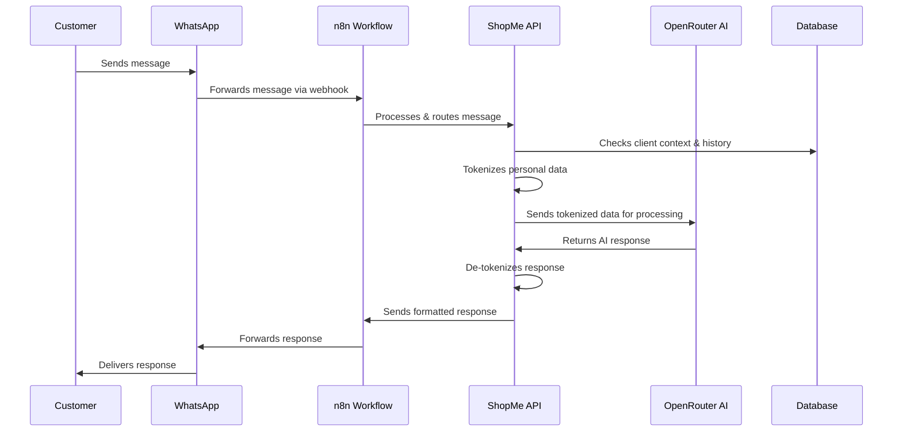
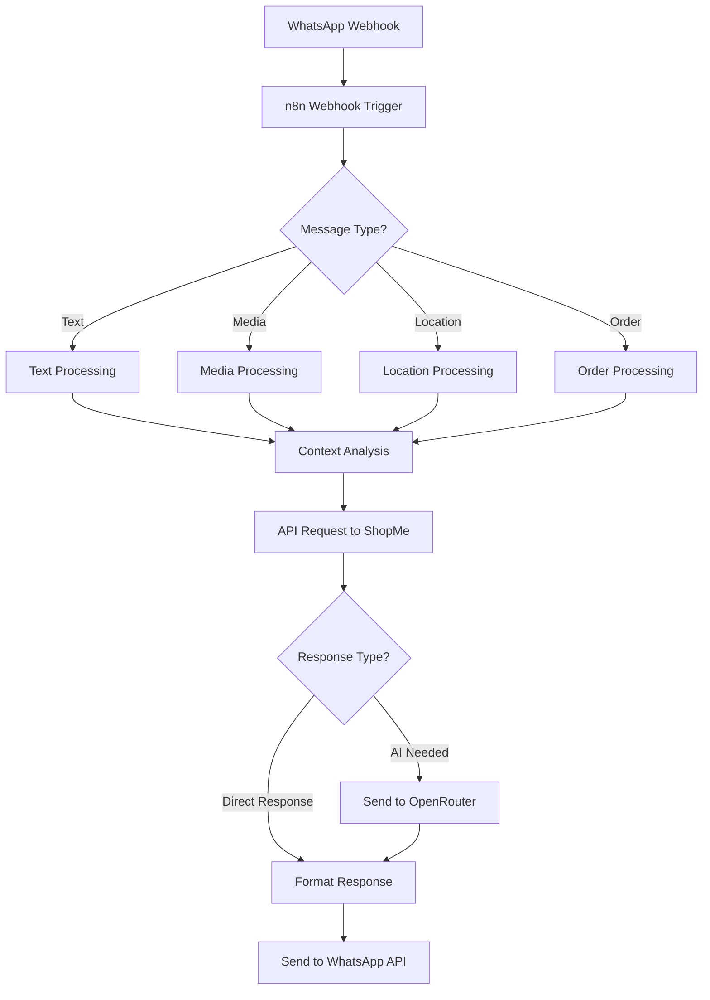
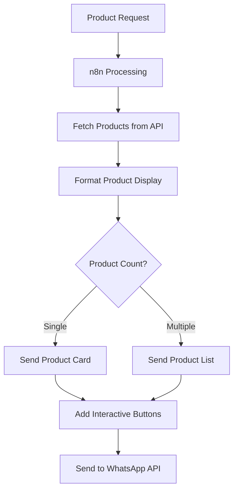
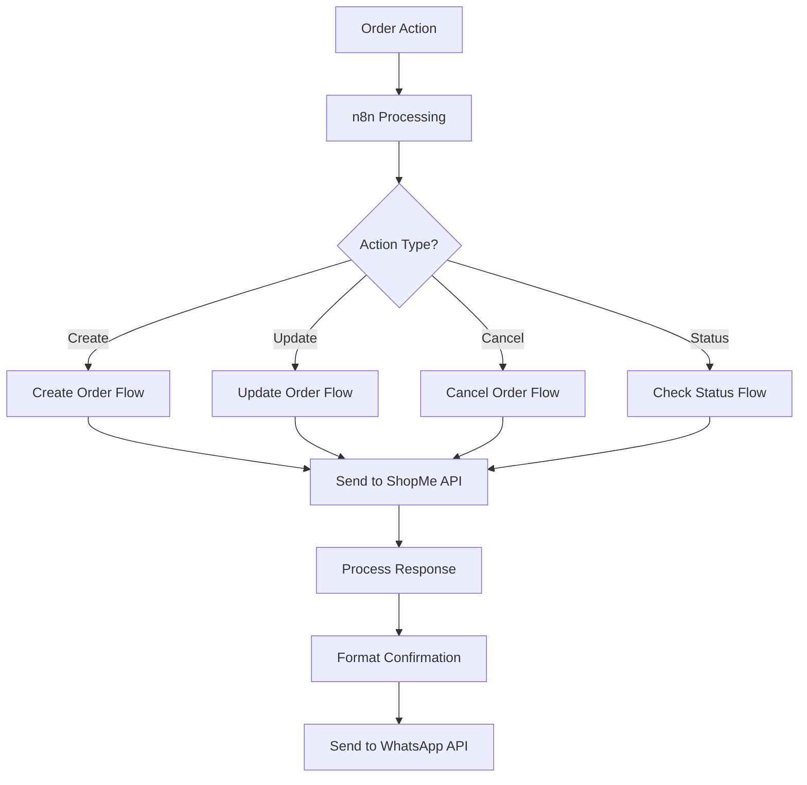
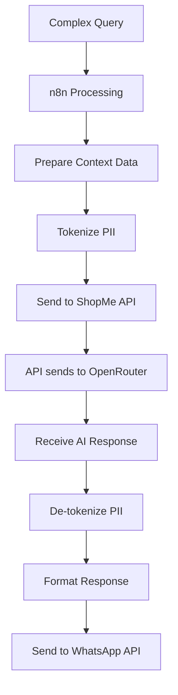

# ShopMe - WhatsApp E-commerce Platform - Product Requirements Document

## Executive Overview

ShopMe is a revolutionary SaaS platform that transforms WhatsApp into a powerful e-commerce channel by connecting businesses directly with customers through intelligent, automated conversations. Built on the foundations of AI and conversational commerce, ShopMe enables businesses to provide seamless shopping experiences and exceptional customer service through the world's most popular messaging app.

### Why ShopMe Matters

In today's digital landscape, businesses face numerous challenges:

- Customer support is increasingly expected to be available 24/7
- Consumer attention is fragmented across multiple platforms
- Traditional e-commerce requires customers to download apps or navigate websites
- Small and medium businesses lack resources for comprehensive digital solutions

ShopMe solves these challenges by meeting customers where they already are—on WhatsApp, with over 2 billion active users worldwide. Our solution eliminates friction in the shopping journey by enabling complete transactions through natural conversation, without requiring customers to leave their preferred messaging platform.

### Core Benefits

1. **24/7 Customer Service**: Our AI-powered chatbots provide immediate responses at any time, ensuring customer queries never go unanswered and sales opportunities are never missed.

2. **Increased Conversion Rates**: By reducing friction in the purchase journey and providing personalized assistance, businesses can convert more inquiries into sales.

3. **Enhanced Customer Engagement**: Natural language conversations create more engaging and human-like interactions compared to traditional e-commerce interfaces.

4. **Operational Efficiency**: Automation of routine inquiries and processes reduces staff workload and operational costs while improving response times.

5. **Rich Customer Insights**: Every conversation generates valuable data that helps businesses understand customer preferences and improve their offerings over time.

6. **Scalability Without Complexity**: The SaaS model allows businesses of any size to implement sophisticated e-commerce capabilities without technical expertise or major investments.

ShopMe represents the next evolution in e-commerce—one where commerce happens conversationally, businesses are always available, and shopping is as simple as sending a message.

## 1. Project Vision

The ShopMe project aims to develop a WhatsApp-based e-commerce platform that leverages the WhatsApp Business API and AI technology to automate client support and order management. Designed as a Software as a Service (SaaS) solution, the platform enables businesses to create their own white-labeled e-commerce presence with minimal setup. The goal is to provide immediate and continuous 24/7 assistance, enhancing client experience and streamlining business operations.

### 1.1 Initial Use Case: Italian Products Chatbots

As our first implementation, the platform will be specialized in selling high-quality Italian products. Users will be able to:

**Product Discovery and Information**:

- Access detailed product information
- Receive personalized product recommendations
- Learn about producers' stories and traditional production methods

**Order Management**:

- Place orders directly through WhatsApp chatbot
- Receive immediate order confirmations
- Track shipment status
- Download invoices and fiscal documents
- Manage returns and complaints

**Customer Support**:

- Request product information and recommendations
- Get advice on product pairings and usage
- Receive post-sale assistance
- Access FAQ and product guides

### 1.2 Future Industry Expansion

While the initial MVP focuses exclusively on e-commerce for Italian products, the platform is architecturally designed to support future expansion into various service-based industries including:

**Gym & Fitness Centers**:

- Class booking and membership management
- Personal training session scheduling
- Workout plan delivery through messaging
- Fitness goal tracking and progress updates

**Restaurants & Cafes**:

- Table reservations and wait list management
- Digital menu browsing via chat interface
- Special event bookings (private dining, catering)
- Delivery coordination through messaging

**Hotels & Accommodations**:

- Room booking and availability checking via WhatsApp
- Automated check-in/check-out reminders
- Special requests handling through chat interface
- Room service ordering through messaging

This planned expansion will be developed in future phases after the core e-commerce functionality is successfully implemented and validated in the marketplace.

The platform is designed for any business that offers products or services to clients, from retail stores and service providers to hospitality businesses like hotels, restaurants, gyms, and fitness centers. This versatility allows businesses to not only sell products but also manage appointments, reservations, and memberships through conversational interfaces.

## 2. User Journey

### Administrator Experience

- Access a web dashboard to:
  - Create and manage multiple workspaces.
  - Configure WhatsApp channels (phone numbers, API tokens, webhooks).
  - Customize AI prompts, add products (with photos, text, pricing,offerts), and organize them into service categories.
  - Manage products, services, and clients through intuitive interfaces.

### End User Experience

- Interact exclusively through WhatsApp:
  - **Initial Contact**: New users receive a welcome message introducing the service.
  - **Registration Process**:
    - For unregistered users, the system automatically generates and sends a unique registration link via WhatsApp.
    - The link directs users to a secure web-based registration form.
    - The registration form collects essential information:
      - First Name (required)
      - Last Name (required)
      - Company Name (required)
      - Language preference selection (required) - Default language is detected from user's browser
      - Currency preference selection (required) - Default EUR
      - GDPR consent with full text of the privacy policy displayed for review
      - Push notification consent checkbox with label: "Are you interested to receive offers with push notifications? You will be able to unsubscribe whenever you want" (optional)
      - Submit button to complete registration
    - Upon successful submission, the user is registered in the system and can immediately continue their interaction through WhatsApp.
    - A personalized welcome message is sent in the user's selected language, confirming their registration and explaining data protection measures, including a link to a dedicated page with detailed information about the encryption system used to protect their data.
  - **Returning Users**: Existing users receive a personalized greeting and can request information, place orders, and receive communications.
  - **Continuous Experience**: All subsequent interactions happen seamlessly within WhatsApp, creating a frictionless shopping experience.

## 3. Objectives

### Business Goals

- Significantly reduce client service time through automation.
- Provide 24/7 client support.
- Build client loyalty through future push campaigns (e.g., greetings, promotions, appointment reminders).
- Enable businesses of all types to engage with clients through familiar messaging interfaces.
- Create a versatile platform adaptable to various industries and business models.

### Non-Goals (MVP)

- **Integrated Payment System and Workable Payment Plan:**

  - This combines the original "Implement an integrated payment system" and "Usage and a workable plan for payments."
  - It's crucial to state that _both_ the _implementation_ and a _detailed plan_ are out of scope for the MVP.
  - **Rationale:** Even a high-level plan has design implications. If you defer _all_ payment considerations, you risk architectural issues later. However, in the MVP, the _actual integration_ and _full payment flow_ are not required.

- **Usage Statistics and Analytics:**

  - This is clearer than just "Usage" and separates it from other concerns.
  - **Rationale:** Gathering and displaying detailed analytics can be complex. The MVP should focus on core functionality.

- **Push Campaigns and Marketing Automation:**

  - This is more specific than just "Push campaigns."
  - **Rationale:** Marketing automation features are often added later to enhance user engagement.

- **Advanced Authentication and Security:**

  - This groups related security features.
  - Includes:
    - JSON Web Tokens (JWT) for authentication (if you're using a simpler auth for MVP)
    - 2FA authentication (Two-Factor Authentication)
    - "Forgot Password" functionality
    - "Create User" (if you're handling user creation in a very basic way for MVP)
  - **Rationale:** While basic security is essential, more complex auth can be deferred.

- **Scalability and Monitoring Infrastructure:**

  - This is more specific than just "scale and monitor the system."
  - **Rationale:** While you need to _design_ for scalability, the _full infrastructure_ and monitoring setup can be iterative.
    - For MVP, you might handle scaling manually or with basic tools.
    - Detailed performance monitoring and automated scaling can come later.

- **Comprehensive GDPR Compliance Implementation:**

  - This is carefully worded. You **must** _consider_ GDPR from the start, but the _full and polished implementation_ can be phased.
  - **Rationale:**

    - You can't ignore privacy. Design must be privacy-preserving.
    - However, features like detailed consent management, data portability exports, and full audit logs can be developed iteratively.
    - The _core_ principles (data minimization, security) _must_ be in place.

- **Product Image Upload to S3/Cloud Storage:**

  - Integration with cloud storage services for product image upload and management.
  - **Rationale:** While product image management is important, the MVP can use simpler approaches like URL references to existing images. Full integration with S3 or similar cloud storage services will be implemented in future versions.

  - development environments and monitoring infrastructure can be phased.
  - Product offerts

### Out of Scope Features

These features have been determined to be completely out of scope for the current version of the product. Unlike Non-Goals (MVP) which will be implemented in future phases, these features are not planned for implementation in the immediate roadmap.

1. **Order Management System:**

   - Complete order processing and tracking
   - Order status management
   - Invoice generation and management
   - Shipping integration and tracking
   - Returns and refunds processing
   - **Rationale:** After evaluation, we've determined that the full order management system requires significant integration with external systems (payment, shipping, etc.) and complex business logic that would extend beyond our current development capacity. Users can still browse products and interact with the chatbot, but actual order processing will need to be handled through external systems.

2. **Marketing Campaign Management:**

   - Campaign creation and scheduling
   - A/B testing tools
   - Campaign analytics
   - Audience segmentation
   - **Rationale:** Marketing campaign features require complex integration with analytics and user behavior tracking systems that are beyond our current scope.

3. **Advanced Analytics Dashboard:**
   - Real-time analytics
   - Custom report generation
   - Data visualization tools
   - Export capabilities
   - **Rationale:** Advanced analytics require significant data processing and storage capabilities that are not aligned with our current infrastructure plans.

## 4. Technical Architecture

- **Frontend**: React (latest version) with shadcn/ui library and Tailwind CSS to accelerate development.
- **Backend**: Node.js with Domain Driven Design (DDD) pattern.
- **Database**: PostgreSQL.
- **SaaS Architecture**: Multi-tenant design with complete data isolation between workspaces.
- **Workflow Automation**: n8n.
- **AI Service**: OpenRouter (RAG) with data pseudonymization.
- **WhatsApp Integration**: Official Meta API.
- **Security**: HTTPS, JWT tokens, encrypted sensitive data in the database.
- **Environments**: Development, test, and production; each workspace can activate debug mode with a test number.

### Frontend Implementation

The frontend will be built using Vite and React, coupled with Tailwind CSS and shadcn/ui for styling. This architecture provides several advantages:

- **Fast Development**: Vite's lightning-fast HMR (Hot Module Replacement)
- **API Proxy**: Built-in proxy configuration for seamless API integration
- **Component isolation**: Clear separation of concerns with modular components
- **Type Safety**: Full TypeScript support
- **Styling**: Utility-first approach with Tailwind CSS for rapid development
- **UI Components**: Shadcn/ui for consistent and accessible components

#### Core API Integration

The frontend communicates with the backend through a RESTful API architecture:

1. **Authentication API**:

   - Login/Register flows
   - JWT token management
   - User session handling

2. **Workspace API**:

   - Workspace management
   - Settings and configurations
   - User permissions

3. **Products API**:

   - Product catalog management
   - Categories CRUD
   - Image upload handling

4. **Orders API**:

   - Order processing
   - Cart management
   - Order status tracking

5. **Clients API**:

   - Client profile management
   - Purchase history
   - GDPR compliance

6. **Settings API**:
   - Workspace configuration
   - User preferences
   - System settings
   - Phone Number Blocklist: Ability to block specific phone numbers from interacting with the system, preventing potential abuse by adding phone numbers to a blocklist. Messages from these numbers will be automatically ignored.

The frontend uses a proxy configuration to route all `/api/*` requests to the backend server, handling CORS and other cross-origin concerns automatically.

### OpenRouter Integration and Data Flow

The system uses OpenRouter's Retrieval Augmented Generation (RAG) capabilities to power the AI-assisted interactions within the platform. Here's how the data flows:



1. **Data Collection**: When a WhatsApp message is received from a client, it arrives through the Meta API.

2. **Pre-processing**: The backend identifies any personal or sensitive information in the incoming message.

3. **Pseudonymization**: Before sending data to OpenRouter, all personal identifiers are replaced with tokens (see Security section on Pseudonymization for details).

4. **AI Processing**: The tokenized data is sent to OpenRouter, which generates contextually appropriate responses based on the prompt templates and product information.

5. **Post-processing**: The backend replaces any tokens in the AI response with the actual personal data before sending the response back to the client.

6. **Response Delivery**: The final processed response is sent to the client via the WhatsApp API.

This architecture ensures that no personally identifiable information (PII) is exposed to external AI services while maintaining the conversational quality and personalization of responses.

### Hosting and Infrastructure

The application will be hosted on Heroku's cloud platform, providing the following services:

1. **Application Hosting**:

   - Node.js runtime environment for the backend
   - Automatic scaling and load balancing
   - SSL/TLS encryption
   - Continuous deployment integration

2. **Database**:

   - Heroku Postgres for primary database
   - Automated backups and point-in-time recovery
   - Database metrics and monitoring
   - Connection pooling

3. **Storage Solutions**:

   - Bucketeer add-on for S3-compatible file storage
   - Used for storing invoices, product images, and documents
   - Automatic backup and versioning
   - CDN integration for faster file delivery

4. **Deployment Strategy**:
   - Git-based deployment workflow
   - Review apps for pull requests
   - Staging and production environments
   - Zero-downtime deployments

### Environment Setup and CI/CD Pipeline (Out of Scope for MVP)

The following environment structure and CI/CD pipeline represents the target infrastructure state that will be implemented in future phases after the MVP release. This section is explicitly excluded from the MVP scope as outlined in Section 3 (Non-Goals). When implemented in future versions, the application will utilize three distinct environments with a comprehensive CI/CD pipeline to ensure quality, reliability, and efficient deployment:

#### 1. Environment Structure (out of scope for MVP)\*\*

- **Development (dev)**

  - Purpose: Active development and feature implementation
  - URL structure: `https://dev.shopme.app` or `https://dev-[feature-branch].shopme.app`
  - Database: Separate dev database with anonymized production data
  - Deployed on: Heroku development dynos
  - WhatsApp integration: Testing phone number with Meta API sandbox
  - Features:
    - Debug tools and extended logging
    - Feature flags for in-development capabilities
    - Automatic database schema reset option
    - Performance monitoring with non-optimized assets

- **Staging (staging)**

  - Purpose: Pre-production testing, QA, and UAT
  - URL structure: `https://staging.shopme.app`
  - Database: Clone of production database with anonymized sensitive data
  - Deployed on: Heroku standard dynos
  - WhatsApp integration: Testing phone number with full API capabilities
  - Features:
    - Production-like environment
    - A/B testing capabilities
    - Performance testing tools
    - Automated test suite execution
    - Security scanning

- **Production (prod)**
  - Purpose: Live environment for end users
  - URL structure: `https://shopme.app` and client subdomains
  - Database: Production database with regular backups
  - Deployed on: Heroku performance dynos with auto-scaling
  - WhatsApp integration: Client production phone numbers
  - Features:
    - High availability configuration
    - Optimized performance
    - Comprehensive monitoring
    - Automated rollback capabilities
    - Regular security audits

#### 2. CI/CD Pipeline

- **Continuous Integration**

  - Platform: GitHub Actions
  - Triggered on: Pull request creation and updates
  - Steps:
    - Static code analysis (ESLint, TypeScript checking)
    - Unit test execution
    - Integration test execution
    - Build process verification
    - Bundle size analysis
    - Dependency vulnerability scanning
    - Code coverage reporting
  - Pass criteria: All tests pass, no critical vulnerabilities, code coverage above 80%

- **Continuous Deployment**

  - **Development Deployment**

    - Trigger: Merge to development branch
    - Target: Development environment
    - Process: Automated deployment with post-deployment tests
    - Notification: Slack alerts for team

  - **Staging Deployment**

    - Trigger: Manual promotion from development
    - Target: Staging environment
    - Process:
      - Database migration verification
      - Automated deployment
      - Smoke test execution
      - End-to-end test suite execution
      - Performance benchmark comparison
    - Notification: Slack alerts for team and QA

  - **Production Deployment**
    - Trigger: Manual promotion from staging
    - Approval: Required from technical lead and product owner
    - Schedule: During defined maintenance windows (non-peak hours)
    - Target: Production environment
    - Process:
      - Database backup
      - Blue/green deployment
      - Canary testing (initial 10% traffic)
      - Gradual rollout with health monitoring
      - Automated rollback if health checks fail
    - Notification: Slack alerts for all stakeholders

#### 3. Quality Assurance Process

- **Automated Testing**

  - Unit tests: Jest for frontend and backend logic
  - Integration tests: API endpoint testing with Supertest
  - End-to-end tests: Cypress for critical user journeys
  - Performance tests: k6 for load testing
  - Accessibility tests: pa11y for WCAG compliance

- **Manual Testing**

  - UAT sessions with stakeholders in staging
  - Exploratory testing by QA team
  - Cross-browser compatibility testing
  - Mobile responsiveness testing

- **Monitoring and Observability**
  - Error tracking: Sentry for frontend and backend errors
  - Performance monitoring: New Relic for application performance
  - Log management: Papertrail for centralized logging
  - Synthetic monitoring: Uptime checks every 5 minutes
  - Real user monitoring: Performance metrics from actual users

#### 4. Disaster Recovery

- **Backup Strategy**

  - Database: Hourly incremental backups, daily full backups
  - Storage: Redundant storage with versioning
  - Configuration: Infrastructure as Code with version control

- **Recovery Process**
  - Defined runbooks for common failure scenarios
  - Regular recovery drills (quarterly)
  - Maximum tolerable downtime: 1 hour
  - Recovery time objective (RTO): 30 minutes
  - Recovery point objective (RPO): 1 hour

This multi-environment approach combined with a robust CI/CD pipeline ensures reliable, consistent deployments while maintaining high quality standards across the application lifecycle.

## 5. Acceptance Criteria

- Fully operational CRUD functionality for workspaces, products, prompts, services, languages, and users.
- Chatbot responses generated within seconds.
- API communication protected via JWT tokens.
- Intuitive dashboard with 2FA authentication.
- Seamless integration between n8n and exposed APIs.
- Anti-abuse protection system that automatically blocks users sending more than 8 messages per minute.
- Manual blocking functionality allowing administrators to block specific users directly from the chat interface when necessary.

### Anti-Abuse System

To prevent system abuse and ensure fair resource allocation, the platform implements an automated rate-limiting mechanism:

- If a user sends more than 8 messages within a 60-second window, their profile status is automatically changed to "blocked"
- The system responds with a message: "Your number has been blocked due to improper use. Please contact the administrator to unblock it."
- Administrators can view blocked users in the dashboard and manually unblock legitimate users
- The system maintains logs of blocking events for security analysis

Additionally, administrators can manually block problematic users directly from the chat interface:

- A block button in the chat header allows for immediate blocking of the current user
- When manually blocked, users receive notification about their blocked status
- Administrators can view and manage all blocked users from a centralized section in the dashboard
- Block/unblock actions are logged for audit purposes

This dual approach (automatic and manual blocking) protects against spam attacks, prevents AI resource waste, and ensures a smooth experience for all legitimate users. Rate limits and blocking policies are configurable by workspace administrators to accommodate different business needs and usage patterns.

## 6. Key Features

1. **User Management:**

   - Registration and Login: Secure authentication and profile management.
   - Password Recovery: Functionality for credential reset.

2. **Product Catalog:**

   - Product Display: List and detailed view of products with images, descriptions, and prices.
   - Search and Filtering: Tools to search products by category, price, popularity, etc.
   - Categories: Management of product categories for better organization.

3. **WhatsApp Cart Management:**

   - Conversational Interface: Allows users to manage their cart via WhatsApp messages.
   - Add/Remove Products: Commands to add or remove products from the cart.
   - Cart Status Display: Sending cart summaries and updates via WhatsApp.

4. **Checkout and Online Payments:**

   - Order Confirmation: After cart management on WhatsApp, the user is redirected to a web platform to confirm the order.
   - Online Payments: Secure and integrated payment procedure on the online platform.

5. **AI Integration:**

   - RAG Implementation: Retrieval Augmented Generation for better business context with customer data.
   - Customizable Prompts: Configure AI responses to reflect business voice and policies.
   - Context Awareness: AI understands conversation history and user preferences.
   - Data Pseudonymization: Privacy protection when processing data with external models.
   - Automatic Translations: Support for multiple languages in the same conversation.
   - Prompt Testing: Ability to test alternative prompts in isolated sessions without affecting the active production prompt. This allows administrators to safely experiment with different AI behaviors before deploying them to customers.
   - Prompt Duplication: Ability to duplicate existing prompts to create variations or backups, maintaining the original structure while allowing modifications to the copy. This feature enables users to iterate on existing successful prompts without starting from scratch.

6. **Order Management and Tracking:**

   > ⚠️ Note: This feature has been moved to Out of Scope. See "Out of Scope Features" section for details.

   The following functionality was originally planned but is now out of scope:

   - Order History: View past purchases and current order status
   - Shipment Tracking: Real-time updates on shipment status
   - Invoice Management: Generate and download invoices
   - Returns Processing: Handle product returns and refunds

   For the current version, users can browse products and interact with the chatbot, but actual order processing will need to be handled through external systems.

7. **Client Management:**

   - Client Profiles: Maintain comprehensive records of all clients.
   - Purchase History: Track client purchasing patterns and preferences.
   - Communication Log: Access past interactions with clients.
   - User Blocking: Ability to block specific users from interacting with the system through the chat interface, preventing potential abuse.
   - Reservation Management: Track and manage client bookings and appointments (future expansion).
   - Push Notifications: Send targeted messages for marketing, reminders, and loyalty programs.

8. **Chat History:**

   - Conversation Logs: Review and analyze WhatsApp conversations with clients.
   - Message Search: Search through chat history for specific information.

9. **Usage Analytics:**

   - Usage Monitoring: Collection and analysis of platform usage data to understand user behavior.
   - Usage Reports: Generation of reports and statistics to improve experience and optimize features.

10. **Administrative Dashboard:**

- Content Management: Tools to add, modify, or remove products and categories.
- Reports and Analysis: Statistics on sales, traffic, and system performance.

11. **Reservation and Booking System (Future Expansion):**

    - Appointment Scheduling: Allow clients to book services via WhatsApp.
    - Table Reservations: Enable restaurant booking management.
    - Room Bookings: Handle hotel room reservations.
    - Class Registrations: Manage gym class sign-ups and attendance.
    - Capacity Management: Track availability and prevent overbooking.
    - Automated Reminders: Send notifications before appointments.

12. **Push Notification Campaigns:**
    - Targeted Messaging: Send personalized offers based on client history.
    - Automatic Reminders: Notify clients about upcoming appointments or reservations.
    - Re-engagement Campaigns: Reach out to inactive clients.
    - Special Promotions: Announce limited-time offers and discounts.
    - Loyalty Programs: Update clients on points, rewards, and milestones.
    - Event Notifications: Inform clients about upcoming events or new services.

## 6.5 WhatsApp Messaging Flow API

The platform implements a comprehensive messaging flow through the `MessageProcessorAPI` that handles all WhatsApp communications. This API serves as the core middleware between incoming WhatsApp messages and AI-powered responses.

### 6.5.1 Flow Architecture

The messaging flow follows this sequence:

1. **Reception**: Incoming messages from WhatsApp are received via webhook
2. **Challenge Verification**: System checks if the workspace is active
3. **User Identification**: System identifies the user and checks if they're new or existing
4. **Agent Selection**: For existing users, the appropriate specialized agent is selected based on message context
5. **Context Loading**: User data, order history, and previous messages are retrieved
6. **Data Protection**: Personal data is tokenized before processing
7. **AI Processing**: The tokenized message is processed by OpenRouter AI
8. **Response Formatting**: AI response is made conversational
9. **Data Restoration**: Tokens are replaced with actual user data
10. **History Tracking**: The exchange is logged in the chat history
11. **Delivery**: The response is sent back to the user via WhatsApp

### 6.5.2 Implementation

The API is implemented through the following core function:

```javascript
try {
  // Check if challenge is active
  if (!isChallengeActive()) {
    inactiveMessage = getInactiveMessage()
    sendMessage(inactiveMessage)
    return
  }

  let systemResp
  const message = GetQuestion()
  const userID = GetUserId()
  const userInfo = getUserData(userID)
  const isNewUser = isPresent(userInfo) ? false : true

  if (isNewUser) {
    // New link to the registration form
    return "LINK"
  } else {
    // 0. GET DATA
    routerAgent = getRouterAgent()
    const agentSelected = GetAgentDedicatedFromRouterAgent(routerAgent, message)
    const prompt = loadPrompt(agentSelected)
    const orders = getOrders()
    const products = getProducts()
    const historyMessages = GetHistory("last 30 messages")

    // 1. TOKENIZE (ora restituisce anche la mappa)
    const { fakeMessage, fakeUserInfo, tokenMap } = Tokenize(message, userInfo)

    // 2. OPENROUTER
    systemResp = getResponse(
      prompt,
      agentSelected,
      historyMessages,
      fakeMessage,
      fakeUserInfo,
      orders,
      products
    )
    // Attach a calling function when we have the order details
    // Attach a calling function when we have to send the invoices

    // 4. CONVERSIONAL RESPONSE
    systemResp = conversationalResponse(
      "metti la frase in maniera discorsiva:" + systemResp
    )

    // 5. DETOKENIZE
    const resp = Detokenize(systemResp, systemResp)

    // 6. SAVE TO HISTORY
    saveToChatHistory(userID, agentSelected, message, resp)

    return resp
  }
} catch (error) {
  console.error("Errore in main:", error)
}
```

### 6.5.3 Database Requirements

To support this messaging flow, the database includes the following key entities:

- **ChatSession**: Tracks ongoing conversations with metadata
- **Message**: Stores individual messages with direction, content, and status
- **Prompts**: Stores AI agent configurations and prompts
- **Customers**: Contains user data and preferences

These models support the conversational interface shown in the platform's chat interface:


The interface provides:

- List of recent conversations on the left panel
- Detailed conversation view on the right panel
- Real-time message exchange with timestamps
- Order tracking and status information
- Clear visual distinction between incoming and outgoing messages

## 7. Use Cases

### Admin Use Case:

- [Admin Dashboard] → [Workspace Management]
  - [CRUD WhatsApp Settings]
  - [CRUD Products]
  - [CRUD Categories]
  - [CRUD Services]
  - [CRUD Prompts]
  - [CRUD Clients and Campaigns]

### Registered WhatsApp User Use Case:

- [Registered WhatsApp User] → [Sends Message]
  - [n8n Workflow]
  - [Retrieval of workspace, profile, products, services data]
  - [Response generation with OpenRouter (RAG)]
  - [Response sending via Meta WhatsApp API]

### New WhatsApp User Use Case:

- [New WhatsApp User] → [Sends First Message]
  - [n8n Workflow]
  - [User identification: not registered]
  - [Sending welcome message and request for basic data]
  - [GDPR consent collection]
  - [User registration and profile creation]

### GDPR Consent Flow

To ensure GDPR compliance, the platform implements a structured consent collection process during registration:

1. **Initial Contact**: When a new user sends their first message, the system sends a welcome message that introduces the service and immediately addresses data privacy:

   ```
   Hello [User Name]! 👋 I'm your ShopMe AI assistant and I'll be helping you explore our Italian products and services.

   Before we begin, I want to reassure you about how we handle your personal data. We prioritize your privacy - your information will never be shared with third parties and is only used to provide you with the best shopping experience.

   You can review our complete Privacy Policy here: [GDPR_POLICY_URL]

   If you're ready to continue, we can get started with your shopping experience today!
   ```

2. **Consent Request**: After the welcome message, the user receives the formal consent request:

   ```
   Before we continue, we need your consent to process your data according to our Privacy Policy
   (full text: {privacy_policy_url}).

   This includes storing your contact information and message history to provide you with shopping
   assistance and order processing. You can withdraw consent at any time.

   Please reply with "I ACCEPT" to continue.
   ```

3. **Consent Recording**: When the user replies with acceptance:
   - The system records the current privacy policy version in `last_privacy_version_accepted`
   - The timestamp is recorded in `privacy_accepted_at`
   - This data is stored in the user profile for audit and compliance purposes

#### Consent Verification for Returning Users

For existing users who have previously interacted with the system, the consent flow works differently:

1. **Consent Verification**: At the beginning of each interaction session:
   - The system checks if the user has an existing record with a valid `last_privacy_version_accepted` field
   - The system compares the accepted version with the current privacy policy version
2. **Outcome Scenarios**:

   - **Valid Consent Exists**: If the user has already accepted the current version, no consent prompt is shown and the interaction proceeds normally without interruption
   - **Outdated Consent**: If the user had accepted an older version of the policy, they receive a notification about the update with a summary of changes and must provide fresh consent
   - **No Consent Record**: If the user has no consent record (rare edge case for existing users), they go through the full consent flow

3. **Minimal Disruption Principle**: The system is designed to minimize disruption to returning users:
   - Consent verification happens silently in the background for users with valid consent
   - Users are only prompted when legally necessary (policy changes or missing consent)
   - The consent UI for returning users emphasizes what has changed since their last acceptance

This approach ensures GDPR compliance while maintaining a smooth user experience for returning customers.

#### Consent Data Storage

The user's privacy consent information is stored in the `clients` table in the database with the following specific fields:

- **`last_privacy_version_accepted`**: A string field that stores the version identifier of the privacy policy that was accepted (e.g., "1.2.0")
- **`privacy_accepted_at`**: A timestamp field that records the exact date and time when the user provided consent

This implementation allows the system to:

- Track which specific version of the policy each user has accepted
- Maintain a complete audit trail for GDPR compliance
- Identify users who need to renew consent when the privacy policy is updated
- Provide timestamped proof of consent in case of regulatory inquiries

Every time a user interacts with the system, these fields are checked to ensure the user has accepted the current version of the privacy policy. If not, the consent flow is triggered again.

4. **Privacy Updates**: When the privacy policy is updated:

   - Users are notified of changes with a summary of updates
   - They must provide fresh consent before continuing to use the service
   - The `last_privacy_version_accepted` field is updated

5. **Consent Management**: Users can:
   - Request to view their stored data
   - Request data deletion (triggering GDPR right to be forgotten workflow)
   - Withdraw consent (which flags the account for limited processing)

All consent interactions are logged with timestamps and specific version information to maintain a complete audit trail for compliance purposes.

### Push Offers Use Case:

- [Admin creates Push Campaign] → [Automatic Sending via WhatsApp API]
  - [Users receive message]
  - [Option to unsubscribe]

### Initial Data and Seed Content

For the initial deployment focused on Italian products e-commerce, the platform will be pre-populated with a comprehensive and consistent dataset of Italian products as seed data. This includes:

- **Curated Product Catalog**: A coherent collection of premium Italian products across various categories including:

  - Artisanal food products (pasta, olive oil, preserves, cheeses, wines)
  - Home goods and kitchenware
  - Clothing and accessories from Italian designers
  - Traditional crafts and decorative items

- **Consistent Data Structure**: Each product in the seed database will have complete and consistent information:

  - Detailed descriptions highlighting authentic Italian origin and traditional production methods
  - High-quality images showing the products from multiple angles
  - Accurate pricing and inventory information
  - Categorization aligned with Italian product taxonomy
  - Origin information (region, city, producer)

- **Category Organization**: Logical organization of products that reflects traditional Italian classifications and shopping patterns, facilitating natural conversation flow during WhatsApp interactions.

- **Sample Prompts**: Pre-configured AI prompts specifically designed to showcase Italian products with appropriate cultural context and terminology.

This comprehensive Italian product seed database serves multiple purposes:

1. Demonstrates the platform's capabilities with realistic, market-ready content
2. Provides new businesses with a reference implementation showcasing best practices
3. Enables meaningful testing and user experience evaluation with authentic data
4. Establishes a pattern for future data organization when businesses customize their own catalogs

The seed data ensures that from day one, the platform delivers a rich, coherent shopping experience focused on Italian products, while establishing a template for how merchants should structure their own product information.

## 8. Backend Architecture and Implementation

### Overview

The backend system of this PDR application will be developed using Node.js with the Express.js framework, adopting the Domain-Driven Design (DDD) architectural pattern and implemented as a monorepo using Turborepo. This architecture allows for efficient code organization, shared dependencies, and optimized builds across multiple packages.

The monorepo structure, powered by Turborepo, provides several key benefits:

- Centralized code management with shared configurations
- Optimized build pipeline with intelligent caching
- Consistent development experience across packages
- Efficient dependency management
- Standardized tooling and processes

### Key Features

#### Multilingual Welcome Messages

The system supports configurable welcome messages in multiple languages:

- **Languages**: Italian (IT), English (EN), and Spanish (ES)
- **Storage**: Welcome messages are stored in the Workspace settings as JSON data
- **Configuration**: Admin users can customize welcome messages for each language through the Settings interface
- **Usage**: The appropriate language version is automatically selected based on:
  - User's explicit language preference (if set)
  - Initial greeting language detection (Hola → Spanish, Hello → English, Ciao → Italian)
  - Workspace default language (fallback)
- **Format**: Messages can include emojis and formatting for a friendly, engaging experience

This feature ensures users receive culturally appropriate greetings that establish the right tone for the conversation from the very beginning, enhancing the personalization of the customer experience.

### Monorepo Structure

```
.
├── apps/
│   ├── web/          # Next.js frontend application
│   └── backend/      # Node.js backend application
├── packages/
│   ├── eslint-config/    # Shared ESLint configuration
│   ├── typescript-config/ # Shared TypeScript configuration
│   └── ui/              # Shared UI components
├── package.json     # Root package.json
└── turbo.json      # Turborepo configuration
```

### Security Implementation

System security is a priority. Therefore, security measures recommended by OWASP will be implemented, including:

- Input validation to prevent injection attacks
- Secure session management to protect user authentication
- Protection against SQL injection and Cross-Site Scripting (XSS) to ensure data integrity
- JWT token validation and refresh mechanisms
- Rate limiting and request throttling
- Security headers implementation
- CORS policy configuration

### Technical Stack and Organization

#### Core Technologies

- Node.js with Express.js
- PostgreSQL with Prisma ORM
- Redis for caching
- Docker for containerization
- n8n for workflow automation

#### Architecture Layers

1. **Routes Layer**

   - API endpoint definitions
   - Request validation
   - Response formatting
   - Error handling middleware

2. **Use Cases Layer**

   - Business logic implementation
   - Transaction management
   - Event handling
   - Service orchestration

3. **Services Layer**

   - Domain logic
   - External service integration
   - Data transformation
   - Business rules enforcement

4. **Repository Layer**
   - Data access patterns
   - Query optimization
   - Cache management
   - Data persistence

### Development Guidelines

#### Project Structure

```
src/
├── config/         # Configuration files
├── routes/         # API routes
├── useCases/      # Business logic
├── services/      # Domain services
├── repositories/  # Data access
├── models/        # Data models
├── middleware/    # Custom middleware
├── utils/         # Utility functions
└── tests/         # Test files
```

#### Code Organization

- Clear separation of concerns
- Dependency injection pattern
- Repository pattern for data access
- Factory pattern for object creation
- Strategy pattern for flexible algorithms

### Error Handling and Logging

- Centralized error handling
- Structured logging with Winston
- Request ID tracking
- Performance monitoring
- Error reporting and alerting

### Documentation

- Swagger/OpenAPI documentation
- API endpoint documentation
- Database schema documentation
- Development setup guide
- Deployment instructions

### Development Workflow

- Git workflow guidelines
- Code review process
- Testing requirements
- CI/CD pipeline configuration
- Environment management

### Monitoring and Maintenance

- Health check endpoints
- Performance metrics
- Resource monitoring
- Backup strategies
- Scaling guidelines

### Docker Architecture

The ShopMe platform utilizes a simplified containerized architecture with Docker to ensure consistency across development, testing, and production environments. The system is built with a minimalist approach, focusing only on essential containers:

#### Container Architecture

- **PostgreSQL Container**:

  - Image: PostgreSQL 14
  - Purpose: Primary database storing all application data
  - Ports: 5432
  - Volumes: Database data, periodic backups
  - Configuration: Optimized for performance with appropriate memory allocation and connection pooling

- **n8n Workflow Container**:
  - Image: n8n (official image)
  - Purpose: Executes all workflow automation, handling communication between WhatsApp API and ShopMe backend
  - Ports: 5678
  - Volumes: Workflow data, credentials (encrypted)
  - Configuration: Customized for WhatsApp business message processing

#### Deployment Strategy

This streamlined two-container approach is consistent across both local development and production environments:

**Local Development:**

- Docker Compose orchestrates both containers
- Uses the free version of n8n
- Local volume mounts for easy development and debugging
- Environment variables managed through .env files (not committed to version control)

**Production (Heroku):**

- Both containers deployed using Heroku container registry
- PostgreSQL configured with Heroku PostgreSQL add-on for managed database service
- n8n container deployed with persistent storage for workflow data
- Environment variables managed through Heroku config vars
- Automated backups configured for both containers

This minimalist container strategy reduces operational complexity while providing all necessary functionality for the application. The frontend and API are deployed using Heroku's standard buildpacks rather than containers, further simplifying the architecture.

This architecture will ensure a robust, secure, and scalable backend system, in line with the digitization and resilience objectives of the PDR.

## 9. API Endpoints

### Authentication

- `POST /api/auth/login`

  - **Description**: Authenticates a user and returns a JWT token
  - **Body**: `email`, `password`
  - **Returns**: JWT token, user information

- `POST /api/auth/logout`

  - **Description**: Logs out the current user
  - **Headers**: `Authorization` with JWT token
  - **Returns**: Success message

- `POST /api/auth/refresh`

  - **Description**: Refreshes the JWT token
  - **Headers**: `Authorization` with current JWT token
  - **Returns**: New JWT token

- `GET /api/auth/me`
  - **Description**: Gets the current authenticated user's information
  - **Headers**: `Authorization` with JWT token
  - **Returns**: User profile information

### Chat Management

- `GET /api/chats`

  - **Description**: Retrieves all chats for the workspace
  - **Parameters**: `workspace_id` (required): Workspace identifier
  - **Returns**: List of chats with basic information

- `GET /api/chat/:id`

  - **Description**: Retrieves details of a specific chat
  - **Parameters**: `id` (required): Chat identifier
  - **Returns**: Chat details including messages

- `GET /api/chat/:id/messages`

  - **Description**: Retrieves messages for a specific chat
  - **Parameters**: `id` (required): Chat identifier, `page`, `limit`
  - **Returns**: Paginated list of messages

- `POST /api/chat/message`

  - **Description**: Sends a new message in a chat
  - **Body**: `chat_id`, `content`, `sender_type`
  - **Returns**: Created message details

- `PUT /api/chat/message/:id/read`
  - **Description**: Marks messages as read
  - **Parameters**: `id` (required): Message identifier
  - **Returns**: Updated message status

### Prompt Management

- `GET /api/prompt/:phone`

  - **Description**: Retrieves the active prompt for a specific phone number
  - **Parameters**: `phone` (required): WhatsApp phone number
  - **Returns**: Active prompt text, language configurations, context settings
  - **Note**: Only one prompt can be active per phone number at any time

- `GET /api/prompts`

  - **Description**: Retrieves all prompts in the workspace
  - **Parameters**: `workspace_id` (required): Workspace identifier
  - **Returns**: List of prompts with active/inactive status

- `POST /api/prompt`

  - **Description**: Creates a new prompt
  - **Body**: `prompt_text`, `reference_phone`, `workspace_id`, `active` (boolean)
  - **Returns**: Created prompt details
  - **Note**: If `active` is set to true, any previously active prompt for the same phone number will be automatically deactivated

- `PUT /api/prompt/:id`

  - **Description**: Updates an existing prompt
  - **Parameters**: `id` (required): Prompt ID
  - **Body**: `prompt_text`, `active` (boolean)
  - **Returns**: Updated prompt details
  - **Note**: If `active` is set to true, any previously active prompt for the same phone number will be automatically deactivated

- `DELETE /api/prompt/:id`

  - **Description**: Deletes a prompt
  - **Parameters**: `id` (required): Prompt ID
  - **Returns**: Success message

- `POST /api/prompt/test-session`

  - **Description**: Creates a temporary test session with an alternative prompt
  - **Body**: `prompt_text`, `reference_phone`, `workspace_id`, `session_duration` (minutes)
  - **Returns**: Session ID and expiration time
  - **Note**: This allows testing alternative prompts without modifying the active production prompt

- `GET /api/prompt/test-session/:id`

  - **Description**: Retrieves a test session prompt
  - **Parameters**: `id` (required): Session ID
  - **Returns**: Test prompt details and remaining session time

- `DELETE /api/prompt/test-session/:id`
  - **Description**: Ends a test session early
  - **Parameters**: `id` (required): Session ID
  - **Returns**: Success message

### Notification Management

- `GET /api/notifications`

  - **Description**: Retrieves all notifications for the workspace
  - **Parameters**: `workspace_id` (required), `page`, `limit`
  - **Returns**: Paginated list of notifications

- `POST /api/notifications`

  - **Description**: Creates a new push notification
  - **Body**: `title`, `message`, `target_users`, `schedule_time`
  - **Returns**: Created notification details

- `PUT /api/notifications/:id`

  - **Description**: Updates a notification's status or content
  - **Parameters**: `id` (required): Notification ID
  - **Body**: `status`, `title`, `message`
  - **Returns**: Updated notification details

- `DELETE /api/notifications/:id`
  - **Description**: Deletes a notification
  - **Parameters**: `id` (required): Notification ID
  - **Returns**: Success message

### Product and Category Management

- `GET /api/products`

  - **Description**: Retrieves complete product list
  - **Parameters**: `workspace_id` (required), `category_id`, `page`, `limit`
  - **Returns**: Paginated list of products

- `POST /api/products`

  - **Description**: Creates a new product
  - **Body**: `name`, `description`, `price`, `category_id`, `images`, `stock`
  - **Returns**: Created product details

- `PUT /api/products/:id`

  - **Description**: Updates a product
  - **Parameters**: `id` (required): Product ID
  - **Body**: Product details to update
  - **Returns**: Updated product details

- `DELETE /api/products/:id`

  - **Description**: Deletes a product
  - **Parameters**: `id` (required): Product ID
  - **Returns**: Success message

- `GET /api/categories`

  - **Description**: Retrieves product categories
  - **Parameters**: `workspace_id` (required): Workspace identifier
  - **Returns**: List of categories with products count

- `POST /api/categories`

  - **Description**: Creates a new category
  - **Body**: `name`, `description`, `parent_id`
  - **Returns**: Created category details

- `PUT /api/categories/:id`

  - **Description**: Updates a category
  - **Parameters**: `id` (required): Category ID
  - **Body**: Category details to update
  - **Returns**: Updated category details

- `DELETE /api/categories/:id`
  - **Description**: Deletes a category
  - **Parameters**: `id` (required): Category ID
  - **Returns**: Success message

### Service Management

- `GET /api/services`

  - **Description**: Retrieves list of available services
  - **Parameters**: `workspace_id` (required): Workspace identifier
  - **Returns**: List of services

- `POST /api/services`

  - **Description**: Creates a new service
  - **Body**: `name`, `description`, `price`, `duration`
  - **Returns**: Created service details

- `PUT /api/services/:id`

  - **Description**: Updates a service
  - **Parameters**: `id` (required): Service ID
  - **Body**: Service details to update
  - **Returns**: Updated service details

- `DELETE /api/services/:id`
  - **Description**: Deletes a service
  - **Parameters**: `id` (required): Service ID
  - **Returns**: Success message

### Order Management

- `GET /api/orders`

  - **Description**: Retrieves all orders
  - **Parameters**: `workspace_id` (required), `status`, `page`, `limit`
  - **Returns**: Paginated list of orders

- `GET /api/orders/:id`

  - **Description**: Retrieves details of a specific order
  - **Parameters**: `id` (required): Order ID
  - **Returns**: Complete order details with items

- `POST /api/orders`

  - **Description**: Creates a new order
  - **Body**: Order details including products, quantities, client information
  - **Returns**: Created order details

- `PUT /api/orders/:id`

  - **Description**: Updates an order's status or details
  - **Parameters**: `id` (required): Order ID
  - **Body**: Order details to update
  - **Returns**: Updated order details

- `DELETE /api/orders/:id`
  - **Description**: Cancels/deletes an order
  - **Parameters**: `id` (required): Order ID
  - **Returns**: Success message

### Client Management

- `GET /api/clients`

  - **Description**: Retrieves list of clients
  - **Parameters**: `workspace_id` (required), `page`, `limit`
  - **Returns**: Paginated list of clients

- `GET /api/clients/:id`

  - **Description**: Retrieves client details
  - **Parameters**: `id` (required): Client identifier
  - **Returns**: Complete client profile with order history

- `POST /api/clients`

  - **Description**: Creates a new client
  - **Body**: Client details including name, phone, email
  - **Returns**: Created client details

- `PUT /api/clients/:id`

  - **Description**: Updates client information
  - **Parameters**: `id` (required): Client identifier
  - **Body**: Updated client details
  - **Returns**: Updated client profile

- `POST /api/clients/register`

  - **Description**: Handles registration from WhatsApp-generated registration link
  - **Body**: `first_name`, `last_name`, `company`, `phone` (pre-filled), `workspace_id` (pre-filled), `language`, `currency`, `gdpr_consent` (boolean), `push_notifications_consent` (boolean, optional)
  - **Returns**: Registration confirmation and redirect to WhatsApp with instructions to continue the conversation
  - **Note**: This endpoint is specifically designed for the web form accessed via the registration link sent through WhatsApp to new users

### Cart Management

- `GET /api/cart/:user_id`

  - **Description**: Retrieves user's cart
  - **Parameters**: `user_id` (required): User identifier
  - **Returns**: Cart contents with product details

- `POST /api/cart`

  - **Description**: Adds a product to the cart
  - **Body**: `user_id`, `product_id`, `quantity`
  - **Returns**: Updated cart contents

- `PUT /api/cart`

  - **Description**: Modifies a product in the cart
  - **Body**: `cart_id`, `product_id`, `quantity`
  - **Returns**: Updated cart contents

- `DELETE /api/cart`
  - **Description**: Removes a product from the cart
  - **Body**: `cart_id`, `product_id`
  - **Returns**: Updated cart contents

### Workspace Management

- `GET /api/workspaces`

  - **Description**: Retrieves all workspaces for the user
  - **Headers**: `Authorization` with JWT token
  - **Returns**: List of workspaces user has access to

- `POST /api/workspaces`

  - **Description**: Creates a new workspace
  - **Body**: `name`, `description`, `settings`
  - **Returns**: Created workspace details

- `PUT /api/workspaces/:id`

  - **Description**: Updates workspace settings
  - **Parameters**: `id` (required): Workspace ID
  - **Body**: Workspace details to update
  - **Returns**: Updated workspace details

- `DELETE /api/workspaces/:id`
  - **Description**: Deletes a workspace
  - **Parameters**: `id` (required): Workspace ID
  - **Returns**: Success message

### Settings Management

- `GET /api/settings`

  - **Description**: Retrieves workspace settings
  - **Parameters**: `workspace_id` (required): Workspace identifier
  - **Returns**: All workspace settings

- `PUT /api/settings`
  - **Description**: Updates workspace settings
  - **Body**: `workspace_id`, settings to update
  - **Returns**: Updated settings

### AI Configuration Settings

- `GET /api/settings/ai`

  - **Description**: Retrieves AI generation settings for the workspace
  - **Parameters**: `workspace_id` (required): Workspace identifier
  - **Returns**: Current AI configuration parameters including temperature, top_p, and top_k values

- `PUT /api/settings/ai`

  - **Description**: Updates AI generation parameters
  - **Parameters**: `workspace_id` (required): Workspace identifier
  - **Body**:
    ```
    {
      "temperature": float, // Value between 0.0-1.0 controlling randomness
      "top_p": float,       // Nucleus sampling parameter (0.0-1.0)
      "top_k": integer,     // Limits token selection to top K options
      "max_tokens": integer // Maximum tokens to generate in responses
    }
    ```
  - **Returns**: Updated AI settings

The AI configuration settings control how the AI model generates responses:

- **Temperature**: Controls randomness. Lower values (e.g., 0.2) make responses more focused and deterministic, while higher values (e.g., 0.8) make output more creative and diverse.
- **Top_p (Nucleus Sampling)**: Controls diversity by dynamically selecting from tokens whose cumulative probability exceeds the top_p value. Lower values (e.g., 0.5) make responses more focused, while higher values allow for more variety.
- **Top_k**: Limits the model to consider only the top k most likely tokens at each step, reducing the chance of generating low-probability or irrelevant tokens.
- **Max Tokens**: Defines the maximum length of generated responses to control verbosity and resource usage.

These parameters allow workspace administrators to fine-tune the AI behavior to match their specific business needs, brand voice, and customer communication style.

### User Management

- `GET /api/users/:phone`

  - **Description**: User identification and profile retrieval
  - **Parameters**: `phone` (required): User's phone number
  - **Returns**: User profile information

- `GET /api/users`

  - **Description**: Retrieves all users in the workspace
  - **Parameters**: `workspace_id` (required), `role`, `page`, `limit`
  - **Returns**: Paginated list of users

- `POST /api/users`

  - **Description**: Creates a new user
  - **Body**: `email`, `password`, `name`, `role`, `workspace_id`
  - **Returns**: Created user details

- `PUT /api/users/:id`

  - **Description**: Updates user information
  - **Parameters**: `id` (required): User ID
  - **Body**: User details to update
  - **Returns**: Updated user details

- `DELETE /api/users/:id`
  - **Description**: Deletes a user
  - **Parameters**: `id` (required): User ID
  - **Returns**: Success message

### Analytics API

- `GET /api/analytics/overview`

  - **Description**: Retrieves general statistics
  - **Returns**: Total active users, total messages, revenue, growth percentages

- `GET /api/analytics/recent-activity`
  - **Description**: Retrieves recent activities
  - **Returns**: New registrations, added products, received orders, activity timestamps

### Dashboard API

- `GET /api/dashboard/stats`
  - **Description**: Retrieves statistics for the dashboard
  - **Parameters**: `period` (optional): daily/weekly/monthly
  - **Returns**: Active Users count, Total Messages count, Revenue, Growth percentages

**Cross-cutting Requirements**:

- All APIs are protected by JWT tokens
- Communication exclusively via HTTPS
- Request logging and tracking
- Standardized error handling

## 9. n8n Integration and Workflow Automation

### Overview

n8n is a workflow automation platform that serves as a crucial middleware component in the ShopMe architecture. It provides low-code/no-code capabilities to create complex workflows that connect WhatsApp messages with the ShopMe API and other services. This integration layer allows for flexible processing of message data, implementing business logic, and handling the communication flow between customers and the system.

### Core Functionality

- **Message Routing**: Acts as the central hub for incoming and outgoing WhatsApp messages
- **Webhook Management**: Receives webhooks from WhatsApp Business API and forwards processed data
- **Data Transformation**: Formats data between different systems in the architecture
- **Conditional Logic**: Implements business rules for message processing
- **API Integration**: Connects with the ShopMe API and third-party services
- **Error Handling**: Manages exceptions and provides retry mechanisms

### Key Workflows

#### 1. Incoming Message Processing



This workflow handles all incoming messages from WhatsApp:

1. **Initial Processing**:

   - Receives webhook data from WhatsApp
   - Extracts relevant information (sender, message content, timestamp)
   - Identifies message type (text, media, location, order)

2. **Context Building**:

   - Retrieves conversation history
   - Identifies the client and their associated workspace
   - Determines the appropriate handling for the message

3. **API Integration**:

   - Sends the processed message to the ShopMe API
   - Receives response data with instructions on how to respond

4. **Response Handling**:
   - Formats the response according to WhatsApp message standards
   - Sends the response back to the customer via WhatsApp API

#### 2. Product Catalog Workflow



This workflow manages product catalog browsing via WhatsApp:

1. **Request Identification**:

   - Recognizes product catalog requests or product searches
   - Prepares query parameters for the API

2. **Product Retrieval**:

   - Fetches product data from the ShopMe API
   - Processes and filters results based on customer request

3. **Display Formatting**:

   - Creates visually appealing product cards with images
   - Generates interactive elements for browsing and selection

4. **Interactive Options**:
   - Adds buttons for Add to Cart, View Details, etc.
   - Creates navigation options for catalog browsing

#### 3. Order Management Workflow



This workflow handles order-related operations:

1. **Order Action Detection**:

   - Identifies order-related requests (create, modify, cancel, status check)
   - Validates the customer's permissions for the requested action

2. **Order Processing**:

   - Sends the order data to the ShopMe API
   - Processes the response to confirm successful operations

3. **Confirmation Generation**:
   - Creates confirmation messages with order details
   - Provides next steps or alternative options

#### 4. AI Response Workflow



This workflow manages AI-assisted responses:

1. **Query Preparation**:

   - Identifies complex queries requiring AI assistance
   - Collects relevant context information

2. **Security Processing**:

   - Tokenizes personally identifiable information (PII)
   - Ensures sensitive data is protected

3. **AI Integration**:

   - Routes the processed query to the ShopMe API
   - API forwards to OpenRouter for AI processing

4. **Response Handling**:
   - Receives and de-tokenizes the AI response
   - Formats the response for WhatsApp delivery

#### Data Tokenization Implementation

To protect user privacy and ensure GDPR compliance, the system implements a tokenization service for all data processed by external AI models. This process replaces sensitive information with non-identifying tokens before sending data to OpenRouter, then reverses the process when receiving the response.

##### Tokenization Process

1. **Sensitive Data Identification**: The system identifies PII such as names, phone numbers, addresses, and other sensitive information in incoming messages
2. **Token Generation**: Each piece of sensitive data is replaced with a unique token
3. **Mapping Storage**: A mapping between tokens and original values is created and stored temporarily in the session
4. **Processing**: The tokenized data is processed by the AI model
5. **De-tokenization**: AI responses are scanned for tokens, which are replaced with the original values before sending back to the user

##### Technical Implementation

The tokenization service is implemented as follows:

```typescript
// Types definition
export type SensitiveItem = {
  type: string // e.g. 'NAME', 'PHONE', 'ADDRESS'
  value: string
}

export type TokenMapping = Record<string, string>

/**
 * Tokenizes sensitive information in text
 * @param text Original text containing sensitive information
 * @param sensitiveData Array of sensitive items to tokenize
 * @returns Object containing tokenized text and mapping for detokenization
 */
export function tokenize(
  text: string,
  sensitiveData: SensitiveItem[]
): { tokenizedText: string; mapping: TokenMapping } {
  const mapping: TokenMapping = {}
  let tokenizedText = text

  sensitiveData.forEach((item, index) => {
    const token = `TOKEN_${item.type}_${index + 1}`
    mapping[token] = item.value

    // Replace all occurrences (case-sensitive)
    const escaped = item.value.replace(/[.*+?^${}()|[\]\\]/g, "\\$&")
    const regex = new RegExp(escaped, "g")
    tokenizedText = tokenizedText.replace(regex, token)
  })

  return { tokenizedText, mapping }
}

/**
 * Detokenizes text by replacing tokens with original values
 * @param text Tokenized text
 * @param mapping Token to original value mapping
 * @returns Detokenized text with original values
 */
export function detokenize(text: string, mapping: TokenMapping): string {
  let result = text
  for (const [token, value] of Object.entries(mapping)) {
    const regex = new RegExp(token, "g")
    result = result.replace(regex, value)
  }
  return result
}
```

##### Example Usage

```typescript
import { tokenize, detokenize } from "./tokenizer"

// Original message with sensitive information
const message =
  "Ciao, sono Andrea Gelsomino. Il mio numero è +34 612345678 e vivo a Barcellona."

// Identified sensitive data
const sensitiveData = [
  { type: "NAME", value: "Andrea Gelsomino" },
  { type: "PHONE", value: "+34 612345678" },
  { type: "CITY", value: "Barcellona" },
]

// Tokenize the message
const { tokenizedText, mapping } = tokenize(message, sensitiveData)

// Result: "Ciao, sono TOKEN_NAME_1. Il mio numero è TOKEN_PHONE_2 e vivo a TOKEN_CITY_3."
console.log("Tokenized:", tokenizedText)

// Send tokenized text to AI service

// Simulated AI response containing tokens
const aiReply = `Grazie TOKEN_NAME_1, ho registrato il numero TOKEN_PHONE_2 per l'utente a TOKEN_CITY_3.`

// Detokenize the AI response
const finalResponse = detokenize(aiReply, mapping)

// Result: "Grazie Andrea Gelsomino, ho registrato il numero +34 612345678 per l'utente a Barcellona."
console.log("Final AI Reply:", finalResponse)
```

### Implementation Strategy

#### 1. Development Approach

- **Template Workflows**: Pre-built workflow templates for common scenarios
- **Modular Design**: Reusable components for different parts of message processing
- **Environment Configuration**: Separate development, staging, and production environments
- **Version Control**: Workflows stored in Git repositories for tracking changes

#### 2. Deployment Process

- **Initial Setup**: Configuration of n8n instance with connection to WhatsApp API
- **Workflow Deployment**: Automated deployment of workflows via CI/CD pipeline
- **Testing Strategy**: Comprehensive testing with mock WhatsApp messages

#### 3. Monitoring and Maintenance

- **Performance Monitoring**: Tracking of workflow execution times and success rates
- **Error Alerts**: Notification system for failed workflows
- **Audit Logging**: Detailed logs of all message processing for debugging
- **Capacity Planning**: Regular assessment of workflow capacity needs

### Integration Points

#### 1. WhatsApp Business API

- **Webhook Configuration**: Setup to receive all incoming WhatsApp messages
- **Message Types**: Processing of text, media, location, and interactive messages
- **Templates**: Management of pre-approved message templates
- **Authentication**: Secure token management for API access

#### 2. ShopMe API

- **Authentication**: JWT-based authentication for secure API access
- **Endpoints**: Integration with various API endpoints (products, orders, clients)
- **Error Handling**: Graceful handling of API errors and retries
- **Rate Limiting**: Respect for API rate limits and throttling

#### 3. Third-Party Services

- **Payment Gateways**: Integration with payment processing for orders
- **Media Storage**: Handling of images and other media files
- **Notification Services**: Integration with email or SMS providers for alerts

### Deployment Strategy

The n8n workflow automation component will be deployed using a two-phase approach:

#### 1. Development Environment

- **Local Development**: The free version of n8n will be used during development and testing
- **Self-Hosted Setup**: Developers will run n8n locally to create and test workflows
- **Docker-Based**: Local instances will use Docker for consistent environment configuration
- **Workflow Export/Import**: Workflows will be exported as JSON for version control and sharing
- **Mock Webhook Endpoints**: Development uses tools like ngrok to test webhook functionality

#### 2. Production Environment

- **Heroku Deployment**: Production environment will be hosted on Heroku
- **Heroku Add-ons**:
  - PostgreSQL for workflow storage
  - Redis for caching and queue management
- **Autoscaling Configuration**: Configured to handle varying loads
- **Persistent Storage**: Ensuring workflow data isn't lost between deployments
- **TLS Encryption**: Secure communication for all webhook endpoints
- **Backup Strategy**: Regular automated backups of workflow configurations
- **Monitoring Integration**: Connected to application monitoring services

This deployment strategy allows for cost-effective development while ensuring scalable, reliable performance in production.

### Security Considerations

- **Credential Management**: Secure storage of API keys and tokens
- **Data Encryption**: Encryption of sensitive data in transit
- **Access Control**: Limited access to workflow configuration
- **Audit Trails**: Comprehensive logging of all workflow executions
- **Data Retention**: Policies for retaining message and order data

### Business Continuity

- **Failover Mechanisms**: Redundant n8n instances for high availability
- **Backup Procedures**: Regular backups of workflow configurations
- **Disaster Recovery**: Procedures for quickly restoring workflow functionality
- **Scaling Strategy**: Horizontal scaling to handle increased message volume

## 10. API Endpoints

## 11. Casi Speciali di Gestione dei Messaggi

Per garantire un'esperienza utente ottimale e proteggere il sistema da utilizzi impropri, la piattaforma implementa una serie di casi speciali nella gestione dei messaggi. Questa sezione descrive in dettaglio come il sistema si comporta in vari scenari.

### 11.1 Gestione dei Nuovi Utenti

#### Primo Contatto

- **Solo saluti standard**: Il sistema risponde solo se il primo messaggio dell'utente è uno dei saluti standard riconosciuti: "Ciao", "Hello", "Hola" o "Olá"
- **Rilevamento lingua**: La lingua del saluto determina la lingua della risposta di benvenuto
- **Link di registrazione**: L'utente riceve un messaggio di benvenuto nella lingua rilevata con un link di registrazione
- **Altri messaggi**: Se un nuovo utente invia un messaggio che non è un saluto standard, il sistema non risponde

#### Esempio di flusso:

1. **Utente** (nuovo): "Ciao"
2. **Sistema**: "Benvenuto! Per continuare, completa la registrazione qui: [link]" (in italiano)
3. **Utente** (nuovo): "Hello"
4. **Sistema**: "Welcome! To continue, please complete the registration here: [link]" (in inglese)
5. **Utente** (nuovo): "Come posso ordinare?"
6. **Sistema**: _Nessuna risposta_ (poiché non è un saluto standard)

### 11.2 Gestione Utenti in Blacklist

Il sistema implementa un meccanismo di protezione contro utenti indesiderati:

- **Nessuna risposta**: Se un numero di telefono è nella blacklist, il sistema non risponde ai suoi messaggi
- **Nessun log**: I messaggi da utenti in blacklist non vengono salvati nei log
- **Comportamento silenzioso**: L'utente bloccato scriverà a vuoto senza ricevere alcuna risposta o notifica
- **Priorità alta**: La verifica della blacklist è uno dei primi controlli effettuati, prima di qualsiasi altra elaborazione

### 11.3 Controllo Manuale dell'Operatore

La piattaforma consente la disattivazione temporanea del chatbot per specifici utenti:

- **Flag activeChatbot**: Ogni utente ha un flag `activeChatbot` che può essere impostato a `false`
- **Nessuna risposta automatica**: Quando `activeChatbot` è `false`, il sistema non invia risposte automatiche
- **Tracciamento**: I messaggi vengono comunque salvati nel database con `agentSelected` = "Manual Operator Control"
- **Risposta vuota**: Il sistema ritorna una stringa vuota invece di una risposta generata dall'AI

### 11.4 Gestione Messaggi Multilingua

Il sistema supporta la comunicazione in più lingue:

- **Per nuovi utenti**: La lingua viene determinata dal saluto iniziale
- **Per utenti registrati**: La lingua viene salvata nel profilo dell'utente
- **Fallback**: Se la lingua preferita non è disponibile, il sistema utilizza l'inglese
- **Sostituzione dinamica**: I prompt degli agenti AI contengono placeholder `{customerLanguage}` che vengono sostituiti con la lingua dell'utente

#### Lingue supportate per i saluti iniziali:

- 🇮🇹 Italiano: "Ciao", "Buongiorno", "Buonasera", "Salve"
- 🇬🇧 Inglese: "Hello", "Hi", "Hey", "Good morning", "Good evening"
- 🇪🇸 Spagnolo: "Hola", "Buenos dias", "Buenos días", "Buenas tardes", "Buenas noches"
- 🇵🇹 Portoghese: "Olá", "Ola", "Oi", "Bom dia", "Boa tarde", "Boa notte"

### 11.5 Prevenzione Messaggi Duplicati

Per evitare spam e risposte ripetitive:

- **Rilevamento saluti ripetuti**: Se un utente invia un saluto e ha già ricevuto un messaggio di benvenuto nelle ultime 24 ore, non riceverà un nuovo messaggio di benvenuto
- **Tag NoResponse**: I messaggi di saluto ripetuti vengono salvati con `agentSelected` = "NoResponse"
- **Risposta vuota**: Il sistema ritorna una stringa vuota invece di inviare nuovamente il messaggio di benvenuto
- **Durata**: Il rilevamento dei saluti ripetuti considera i messaggi inviati nelle ultime 24 ore

### 11.6 Filtri Sui Contenuti

Il sistema filtra automaticamente i contenuti inappropriati:

- **Prodotti inattivi**: Solo i prodotti con `isActive` = `true` vengono mostrati nelle risposte
- **Servizi inattivi**: Solo i servizi con `isActive` = `true` vengono mostrati nelle risposte
- **Link obbligatorio**: I messaggi di benvenuto devono sempre contenere il link di registrazione; se non viene rilevato, il sistema lo aggiunge automaticamente

### 11.7 Gestione Canale Inattivo

Quando un workspace è disattivato:

- **Messaggio multilingua**: Gli utenti ricevono un messaggio nella loro lingua preferita
- **Configurazione personalizzabile**: I messaggi di inattività possono essere personalizzati per ogni lingua
- **Fallback**: Se non è disponibile un messaggio nella lingua dell'utente, viene utilizzato il messaggio in inglese
- **Messaggio predefinito**: Se non sono configurati messaggi personalizzati, viene mostrato "WhatsApp channel is inactive"

### Authentication

- `POST /api/auth/login`

  - **Description**: Authenticates a user and returns a JWT token
  - **Body**: `email`, `password`
  - **Returns**: JWT token, user information

- `POST /api/auth/logout`

  - **Description**: Logs out the current user
  - **Headers**: `Authorization` with JWT token
  - **Returns**: Success message

- `POST /api/auth/refresh`

  - **Description**: Refreshes the JWT token
  - **Headers**: `Authorization` with current JWT token
  - **Returns**: New JWT token

- `GET /api/auth/me`
  - **Description**: Gets the current authenticated user's information
  - **Headers**: `Authorization` with JWT token
  - **Returns**: User profile information

### Chat Management

- `GET /api/chats`

  - **Description**: Retrieves all chats for the workspace
  - **Parameters**: `workspace_id` (required): Workspace identifier
  - **Returns**: List of chats with basic information

- `GET /api/chat/:id`

  - **Description**: Retrieves details of a specific chat
  - **Parameters**: `id` (required): Chat identifier
  - **Returns**: Chat details including messages

- `GET /api/chat/:id/messages`

  - **Description**: Retrieves messages for a specific chat
  - **Parameters**: `id` (required): Chat identifier, `page`, `limit`
  - **Returns**: Paginated list of messages

- `POST /api/chat/message`

  - **Description**: Sends a new message in a chat
  - **Body**: `chat_id`, `content`, `sender_type`
  - **Returns**: Created message details

- `PUT /api/chat/message/:id/read`
  - **Description**: Marks messages as read
  - **Parameters**: `id` (required): Message identifier
  - **Returns**: Updated message status

### Prompt Management

- `GET /api/prompt/:phone`

  - **Description**: Retrieves the active prompt for a specific phone number
  - **Parameters**: `phone` (required): WhatsApp phone number
  - **Returns**: Active prompt text, language configurations, context settings
  - **Note**: Only one prompt can be active per phone number at any time

- `GET /api/prompts`

  - **Description**: Retrieves all prompts in the workspace
  - **Parameters**: `workspace_id` (required): Workspace identifier
  - **Returns**: List of prompts with active/inactive status

- `POST /api/prompt`

  - **Description**: Creates a new prompt
  - **Body**: `prompt_text`, `reference_phone`, `workspace_id`, `active` (boolean)
  - **Returns**: Created prompt details
  - **Note**: If `active` is set to true, any previously active prompt for the same phone number will be automatically deactivated

- `PUT /api/prompt/:id`

  - **Description**: Updates an existing prompt
  - **Parameters**: `id` (required): Prompt ID
  - **Body**: `prompt_text`, `active` (boolean)
  - **Returns**: Updated prompt details
  - **Note**: If `active` is set to true, any previously active prompt for the same phone number will be automatically deactivated

- `DELETE /api/prompt/:id`

  - **Description**: Deletes a prompt
  - **Parameters**: `id` (required): Prompt ID
  - **Returns**: Success message

- `POST /api/prompt/test-session`

  - **Description**: Creates a temporary test session with an alternative prompt
  - **Body**: `prompt_text`, `reference_phone`, `workspace_id`, `session_duration` (minutes)
  - **Returns**: Session ID and expiration time
  - **Note**: This allows testing alternative prompts without modifying the active production prompt

- `GET /api/prompt/test-session/:id`

  - **Description**: Retrieves a test session prompt
  - **Parameters**: `id` (required): Session ID
  - **Returns**: Test prompt details and remaining session time

- `DELETE /api/prompt/test-session/:id`
  - **Description**: Ends a test session early
  - **Parameters**: `id` (required): Session ID
  - **Returns**: Success message

### Notification Management

- `GET /api/notifications`

  - **Description**: Retrieves all notifications for the workspace
  - **Parameters**: `workspace_id` (required), `page`, `limit`
  - **Returns**: Paginated list of notifications

- `POST /api/notifications`

  - **Description**: Creates a new push notification
  - **Body**: `title`, `message`, `target_users`, `schedule_time`
  - **Returns**: Created notification details

- `PUT /api/notifications/:id`

  - **Description**: Updates a notification's status or content
  - **Parameters**: `id` (required): Notification ID
  - **Body**: `status`, `title`, `message`
  - **Returns**: Updated notification details

- `DELETE /api/notifications/:id`
  - **Description**: Deletes a notification
  - **Parameters**: `id` (required): Notification ID
  - **Returns**: Success message

### Product and Category Management

- `GET /api/products`

  - **Description**: Retrieves complete product list
  - **Parameters**: `workspace_id` (required), `category_id`, `page`, `limit`
  - **Returns**: Paginated list of products

- `POST /api/products`

  - **Description**: Creates a new product
  - **Body**: `name`, `description`, `price`, `category_id`, `images`, `stock`
  - **Returns**: Created product details

- `PUT /api/products/:id`

  - **Description**: Updates a product
  - **Parameters**: `id` (required): Product ID
  - **Body**: Product details to update
  - **Returns**: Updated product details

- `DELETE /api/products/:id`

  - **Description**: Deletes a product
  - **Parameters**: `id` (required): Product ID
  - **Returns**: Success message

- `GET /api/categories`

  - **Description**: Retrieves product categories
  - **Parameters**: `workspace_id` (required): Workspace identifier
  - **Returns**: List of categories with products count

- `POST /api/categories`

  - **Description**: Creates a new category
  - **Body**: `name`, `description`, `parent_id`
  - **Returns**: Created category details

- `PUT /api/categories/:id`

  - **Description**: Updates a category
  - **Parameters**: `id` (required): Category ID
  - **Body**: Category details to update
  - **Returns**: Updated category details

- `DELETE /api/categories/:id`
  - **Description**: Deletes a category
  - **Parameters**: `id` (required): Category ID
  - **Returns**: Success message

### Service Management

- `GET /api/services`

  - **Description**: Retrieves list of available services
  - **Parameters**: `workspace_id` (required): Workspace identifier
  - **Returns**: List of services

- `POST /api/services`

  - **Description**: Creates a new service
  - **Body**: `name`, `description`, `price`, `duration`
  - **Returns**: Created service details

- `PUT /api/services/:id`

  - **Description**: Updates a service
  - **Parameters**: `id` (required): Service ID
  - **Body**: Service details to update
  - **Returns**: Updated service details

- `DELETE /api/services/:id`
  - **Description**: Deletes a service
  - **Parameters**: `id` (required): Service ID
  - **Returns**: Success message

### Order Management

- `GET /api/orders`

  - **Description**: Retrieves all orders
  - **Parameters**: `workspace_id` (required), `status`, `page`, `limit`
  - **Returns**: Paginated list of orders

- `GET /api/orders/:id`

  - **Description**: Retrieves details of a specific order
  - **Parameters**: `id` (required): Order ID
  - **Returns**: Complete order details with items

- `POST /api/orders`

  - **Description**: Creates a new order
  - **Body**: Order details including products, quantities, client information
  - **Returns**: Created order details

- `PUT /api/orders/:id`

  - **Description**: Updates an order's status or details
  - **Parameters**: `id` (required): Order ID
  - **Body**: Order details to update
  - **Returns**: Updated order details

- `DELETE /api/orders/:id`
  - **Description**: Cancels/deletes an order
  - **Parameters**: `id` (required): Order ID
  - **Returns**: Success message

### Client Management

- `GET /api/clients`

  - **Description**: Retrieves list of clients
  - **Parameters**: `workspace_id` (required), `page`, `limit`
  - **Returns**: Paginated list of clients

- `GET /api/clients/:id`

  - **Description**: Retrieves client details
  - **Parameters**: `id` (required): Client identifier
  - **Returns**: Complete client profile with order history

- `POST /api/clients`

  - **Description**: Creates a new client
  - **Body**: Client details including name, phone, email
  - **Returns**: Created client details

- `PUT /api/clients/:id`

  - **Description**: Updates client information
  - **Parameters**: `id` (required): Client identifier
  - **Body**: Updated client details
  - **Returns**: Updated client profile

- `POST /api/clients/register`

  - **Description**: Handles registration from WhatsApp-generated registration link
  - **Body**: `first_name`, `last_name`, `company`, `phone` (pre-filled), `workspace_id` (pre-filled), `language`, `currency`, `gdpr_consent` (boolean), `push_notifications_consent` (boolean, optional)
  - **Returns**: Registration confirmation and redirect to WhatsApp with instructions to continue the conversation
  - **Note**: This endpoint is specifically designed for the web form accessed via the registration link sent through WhatsApp to new users

### Cart Management

- `GET /api/cart/:user_id`

  - **Description**: Retrieves user's cart
  - **Parameters**: `user_id` (required): User identifier
  - **Returns**: Cart contents with product details

- `POST /api/cart`

  - **Description**: Adds a product to the cart
  - **Body**: `user_id`, `product_id`, `quantity`
  - **Returns**: Updated cart contents

- `PUT /api/cart`

  - **Description**: Modifies a product in the cart
  - **Body**: `cart_id`, `product_id`, `quantity`
  - **Returns**: Updated cart contents

- `DELETE /api/cart`
  - **Description**: Removes a product from the cart
  - **Body**: `cart_id`, `product_id`
  - **Returns**: Updated cart contents

### Workspace Management

- `GET /api/workspaces`

  - **Description**: Retrieves all workspaces for the user
  - **Headers**: `Authorization` with JWT token
  - **Returns**: List of workspaces user has access to

- `POST /api/workspaces`

  - **Description**: Creates a new workspace
  - **Body**: `name`, `description`, `settings`
  - **Returns**: Created workspace details

- `PUT /api/workspaces/:id`

  - **Description**: Updates workspace settings
  - **Parameters**: `id` (required): Workspace ID
  - **Body**: Workspace details to update
  - **Returns**: Updated workspace details

- `DELETE /api/workspaces/:id`
  - **Description**: Deletes a workspace
  - **Parameters**: `id` (required): Workspace ID
  - **Returns**: Success message

### Settings Management

- `GET /api/settings`

  - **Description**: Retrieves workspace settings
  - **Parameters**: `workspace_id` (required): Workspace identifier
  - **Returns**: All workspace settings

- `PUT /api/settings`
  - **Description**: Updates workspace settings
  - **Body**: `workspace_id`, settings to update
  - **Returns**: Updated settings

### AI Configuration Settings

- `GET /api/settings/ai`

  - **Description**: Retrieves AI generation settings for the workspace
  - **Parameters**: `workspace_id` (required): Workspace identifier
  - **Returns**: Current AI configuration parameters including temperature, top_p, and top_k values

- `PUT /api/settings/ai`

  - **Description**: Updates AI generation parameters
  - **Parameters**: `workspace_id` (required): Workspace identifier
  - **Body**:
    ```
    {
      "temperature": float, // Value between 0.0-1.0 controlling randomness
      "top_p": float,       // Nucleus sampling parameter (0.0-1.0)
      "top_k": integer,     // Limits token selection to top K options
      "max_tokens": integer // Maximum tokens to generate in responses
    }
    ```
  - **Returns**: Updated AI settings

The AI configuration settings control how the AI model generates responses:

- **Temperature**: Controls randomness. Lower values (e.g., 0.2) make responses more focused and deterministic, while higher values (e.g., 0.8) make output more creative and diverse.
- **Top_p (Nucleus Sampling)**: Controls diversity by dynamically selecting from tokens whose cumulative probability exceeds the top_p value. Lower values (e.g., 0.5) make responses more focused, while higher values allow for more variety.
- **Top_k**: Limits the model to consider only the top k most likely tokens at each step, reducing the chance of generating low-probability or irrelevant tokens.
- **Max Tokens**: Defines the maximum length of generated responses to control verbosity and resource usage.

These parameters allow workspace administrators to fine-tune the AI behavior to match their specific business needs, brand voice, and customer communication style.

### User Management

- `GET /api/users/:phone`

  - **Description**: User identification and profile retrieval
  - **Parameters**: `phone` (required): User's phone number
  - **Returns**: User profile information

- `GET /api/users`

  - **Description**: Retrieves all users in the workspace
  - **Parameters**: `workspace_id` (required), `role`, `page`, `limit`
  - **Returns**: Paginated list of users

- `POST /api/users`

  - **Description**: Creates a new user
  - **Body**: `email`, `password`, `name`, `role`, `workspace_id`
  - **Returns**: Created user details

- `PUT /api/users/:id`

  - **Description**: Updates user information
  - **Parameters**: `id` (required): User ID
  - **Body**: User details to update
  - **Returns**: Updated user details

- `DELETE /api/users/:id`
  - **Description**: Deletes a user
  - **Parameters**: `id` (required): User ID
  - **Returns**: Success message

### Analytics API

- `GET /api/analytics/overview`

  - **Description**: Retrieves general statistics
  - **Returns**: Total active users, total messages, revenue, growth percentages

- `GET /api/analytics/recent-activity`
  - **Description**: Retrieves recent activities
  - **Returns**: New registrations, added products, received orders, activity timestamps

### Dashboard API

- `GET /api/dashboard/stats`
  - **Description**: Retrieves statistics for the dashboard
  - **Parameters**: `period` (optional): daily/weekly/monthly
  - **Returns**: Active Users count, Total Messages count, Revenue, Growth percentages

**Cross-cutting Requirements**:

- All APIs are protected by JWT tokens
- Communication exclusively via HTTPS
- Request logging and tracking
- Standardized error handling

## 9. n8n Integration and Workflow Automation

### Overview

n8n is a workflow automation platform that serves as a crucial middleware component in the ShopMe architecture. It provides low-code/no-code capabilities to create complex workflows that connect WhatsApp messages with the ShopMe API and other services. This integration layer allows for flexible processing of message data, implementing business logic, and handling the communication flow between customers and the system.

### Core Functionality

- **Message Routing**: Acts as the central hub for incoming and outgoing WhatsApp messages
- **Webhook Management**: Receives webhooks from WhatsApp Business API and forwards processed data
- **Data Transformation**: Formats data between different systems in the architecture
- **Conditional Logic**: Implements business rules for message processing
- **API Integration**: Connects with the ShopMe API and third-party services
- **Error Handling**: Manages exceptions and provides retry mechanisms

### Key Workflows

#### 1. Incoming Message Processing


This workflow handles all incoming messages from WhatsApp:

1. **Initial Processing**:

   - Receives webhook data from WhatsApp
   - Extracts relevant information (sender, message content, timestamp)
   - Identifies message type (text, media, location, order)

2. **Context Building**:

   - Retrieves conversation history
   - Identifies the client and their associated workspace
   - Determines the appropriate handling for the message

3. **API Integration**:

   - Sends the processed message to the ShopMe API
   - Receives response data with instructions on how to respond

4. **Response Handling**:
   - Formats the response according to WhatsApp message standards
   - Sends the response back to the customer via WhatsApp API

#### 2. Product Catalog Workflow


This workflow manages product catalog browsing via WhatsApp:

1. **Request Identification**:

   - Recognizes product catalog requests or product searches
   - Prepares query parameters for the API

2. **Product Retrieval**:

   - Fetches product data from the ShopMe API
   - Processes and filters results based on customer request

3. **Display Formatting**:

   - Creates visually appealing product cards with images
   - Generates interactive elements for browsing and selection

4. **Interactive Options**:
   - Adds buttons for Add to Cart, View Details, etc.
   - Creates navigation options for catalog browsing

#### 3. Order Management Workflow


This workflow handles order-related operations:

1. **Order Action Detection**:

   - Identifies order-related requests (create, modify, cancel, status check)
   - Validates the customer's permissions for the requested action

2. **Order Processing**:

   - Sends the order data to the ShopMe API
   - Processes the response to confirm successful operations

3. **Confirmation Generation**:
   - Creates confirmation messages with order details
   - Provides next steps or alternative options

#### 4. AI Response Workflow


This workflow manages AI-assisted responses:

1. **Query Preparation**:

   - Identifies complex queries requiring AI assistance
   - Collects relevant context information

2. **Security Processing**:

   - Tokenizes personally identifiable information (PII)
   - Ensures sensitive data is protected

3. **AI Integration**:

   - Routes the processed query to the ShopMe API
   - API forwards to OpenRouter for AI processing

4. **Response Handling**:
   - Receives and de-tokenizes the AI response
   - Formats the response for WhatsApp delivery

#### Data Tokenization Implementation

To protect user privacy and ensure GDPR compliance, the system implements a tokenization service for all data processed by external AI models. This process replaces sensitive information with non-identifying tokens before sending data to OpenRouter, then reverses the process when receiving the response.

##### Tokenization Process

1. **Sensitive Data Identification**: The system identifies PII such as names, phone numbers, addresses, and other sensitive information in incoming messages
2. **Token Generation**: Each piece of sensitive data is replaced with a unique token
3. **Mapping Storage**: A mapping between tokens and original values is created and stored temporarily in the session
4. **Processing**: The tokenized data is processed by the AI model
5. **De-tokenization**: AI responses are scanned for tokens, which are replaced with the original values before sending back to the user

##### Technical Implementation

The tokenization service is implemented as follows:

```typescript
// Types definition
export type SensitiveItem = {
  type: string // e.g. 'NAME', 'PHONE', 'ADDRESS'
  value: string
}

export type TokenMapping = Record<string, string>

/**
 * Tokenizes sensitive information in text
 * @param text Original text containing sensitive information
 * @param sensitiveData Array of sensitive items to tokenize
 * @returns Object containing tokenized text and mapping for detokenization
 */
export function tokenize(
  text: string,
  sensitiveData: SensitiveItem[]
): { tokenizedText: string; mapping: TokenMapping } {
  const mapping: TokenMapping = {}
  let tokenizedText = text

  sensitiveData.forEach((item, index) => {
    const token = `TOKEN_${item.type}_${index + 1}`
    mapping[token] = item.value

    // Replace all occurrences (case-sensitive)
    const escaped = item.value.replace(/[.*+?^${}()|[\]\\]/g, "\\$&")
    const regex = new RegExp(escaped, "g")
    tokenizedText = tokenizedText.replace(regex, token)
  })

  return { tokenizedText, mapping }
}

/**
 * Detokenizes text by replacing tokens with original values
 * @param text Tokenized text
 * @param mapping Token to original value mapping
 * @returns Detokenized text with original values
 */
export function detokenize(text: string, mapping: TokenMapping): string {
  let result = text
  for (const [token, value] of Object.entries(mapping)) {
    const regex = new RegExp(token, "g")
    result = result.replace(regex, value)
  }
  return result
}
```

##### Example Usage

```typescript
import { tokenize, detokenize } from "./tokenizer"

// Original message with sensitive information
const message =
  "Ciao, sono Andrea Gelsomino. Il mio numero è +34 612345678 e vivo a Barcellona."

// Identified sensitive data
const sensitiveData = [
  { type: "NAME", value: "Andrea Gelsomino" },
  { type: "PHONE", value: "+34 612345678" },
  { type: "CITY", value: "Barcellona" },
]

// Tokenize the message
const { tokenizedText, mapping } = tokenize(message, sensitiveData)

// Result: "Ciao, sono TOKEN_NAME_1. Il mio numero è TOKEN_PHONE_2 e vivo a TOKEN_CITY_3."
console.log("Tokenized:", tokenizedText)

// Send tokenized text to AI service

// Simulated AI response containing tokens
const aiReply = `Grazie TOKEN_NAME_1, ho registrato il numero TOKEN_PHONE_2 per l'utente a TOKEN_CITY_3.`

// Detokenize the AI response
const finalResponse = detokenize(aiReply, mapping)

// Result: "Grazie Andrea Gelsomino, ho registrato il numero +34 612345678 per l'utente a Barcellona."
console.log("Final AI Reply:", finalResponse)
```

### Implementation Strategy

#### 1. Development Approach

- **Template Workflows**: Pre-built workflow templates for common scenarios
- **Modular Design**: Reusable components for different parts of message processing
- **Environment Configuration**: Separate development, staging, and production environments
- **Version Control**: Workflows stored in Git repositories for tracking changes

#### 2. Deployment Process

- **Initial Setup**: Configuration of n8n instance with connection to WhatsApp API
- **Workflow Deployment**: Automated deployment of workflows via CI/CD pipeline
- **Testing Strategy**: Comprehensive testing with mock WhatsApp messages

#### 3. Monitoring and Maintenance

- **Performance Monitoring**: Tracking of workflow execution times and success rates
- **Error Alerts**: Notification system for failed workflows
- **Audit Logging**: Detailed logs of all message processing for debugging
- **Capacity Planning**: Regular assessment of workflow capacity needs

### Integration Points

#### 1. WhatsApp Business API

- **Webhook Configuration**: Setup to receive all incoming WhatsApp messages
- **Message Types**: Processing of text, media, location, and interactive messages
- **Templates**: Management of pre-approved message templates
- **Authentication**: Secure token management for API access

#### 2. ShopMe API

- **Authentication**: JWT-based authentication for secure API access
- **Endpoints**: Integration with various API endpoints (products, orders, clients)
- **Error Handling**: Graceful handling of API errors and retries
- **Rate Limiting**: Respect for API rate limits and throttling

#### 3. Third-Party Services

- **Payment Gateways**: Integration with payment processing for orders
- **Media Storage**: Handling of images and other media files
- **Notification Services**: Integration with email or SMS providers for alerts

### Deployment Strategy

The n8n workflow automation component will be deployed using a two-phase approach:

#### 1. Development Environment

- **Local Development**: The free version of n8n will be used during development and testing
- **Self-Hosted Setup**: Developers will run n8n locally to create and test workflows
- **Docker-Based**: Local instances will use Docker for consistent environment configuration
- **Workflow Export/Import**: Workflows will be exported as JSON for version control and sharing
- **Mock Webhook Endpoints**: Development uses tools like ngrok to test webhook functionality

#### 2. Production Environment

- **Heroku Deployment**: Production environment will be hosted on Heroku
- **Heroku Add-ons**:
  - PostgreSQL for workflow storage
  - Redis for caching and queue management
- **Autoscaling Configuration**: Configured to handle varying loads
- **Persistent Storage**: Ensuring workflow data isn't lost between deployments
- **TLS Encryption**: Secure communication for all webhook endpoints
- **Backup Strategy**: Regular automated backups of workflow configurations
- **Monitoring Integration**: Connected to application monitoring services

This deployment strategy allows for cost-effective development while ensuring scalable, reliable performance in production.

### Security Considerations

- **Credential Management**: Secure storage of API keys and tokens
- **Data Encryption**: Encryption of sensitive data in transit
- **Access Control**: Limited access to workflow configuration
- **Audit Trails**: Comprehensive logging of all workflow executions
- **Data Retention**: Policies for retaining message and order data

### Business Continuity

- **Failover Mechanisms**: Redundant n8n instances for high availability
- **Backup Procedures**: Regular backups of workflow configurations
- **Disaster Recovery**: Procedures for quickly restoring workflow functionality
- **Scaling Strategy**: Horizontal scaling to handle increased message volume

## 10. API Endpoints

### Authentication

- `POST /api/auth/login`

  - **Description**: Authenticates a user and returns a JWT token
  - **Body**: `email`, `password`
  - **Returns**: JWT token, user information

- `POST /api/auth/logout`

  - **Description**: Logs out the current user
  - **Headers**: `Authorization` with JWT token
  - **Returns**: Success message

- `POST /api/auth/refresh`

  - **Description**: Refreshes the JWT token
  - **Headers**: `Authorization` with current JWT token
  - **Returns**: New JWT token

- `GET /api/auth/me`
  - **Description**: Gets the current authenticated user's information
  - **Headers**: `Authorization` with JWT token
  - **Returns**: User profile information

### Chat Management

- `GET /api/chats`

  - **Description**: Retrieves all chats for the workspace
  - **Parameters**: `workspace_id` (required): Workspace identifier
  - **Returns**: List of chats with basic information

- `GET /api/chat/:id`

  - **Description**: Retrieves details of a specific chat
  - **Parameters**: `id` (required): Chat identifier
  - **Returns**: Chat details including messages

- `GET /api/chat/:id/messages`

  - **Description**: Retrieves messages for a specific chat
  - **Parameters**: `id` (required): Chat identifier, `page`, `limit`
  - **Returns**: Paginated list of messages

- `POST /api/chat/message`

  - **Description**: Sends a new message in a chat
  - **Body**: `chat_id`, `content`, `sender_type`
  - **Returns**: Created message details

- `PUT /api/chat/message/:id/read`
  - **Description**: Marks messages as read
  - **Parameters**: `id` (required): Message identifier
  - **Returns**: Updated message status

### Prompt Management

- `GET /api/prompt/:phone`

  - **Description**: Retrieves the active prompt for a specific phone number
  - **Parameters**: `phone` (required): WhatsApp phone number
  - **Returns**: Active prompt text, language configurations, context settings
  - **Note**: Only one prompt can be active per phone number at any time

- `GET /api/prompts`

  - **Description**: Retrieves all prompts in the workspace
  - **Parameters**: `workspace_id` (required): Workspace identifier
  - **Returns**: List of prompts with active/inactive status

- `POST /api/prompt`

  - **Description**: Creates a new prompt
  - **Body**: `prompt_text`, `reference_phone`, `workspace_id`, `active` (boolean)
  - **Returns**: Created prompt details
  - **Note**: If `active` is set to true, any previously active prompt for the same phone number will be automatically deactivated

- `PUT /api/prompt/:id`

  - **Description**: Updates an existing prompt
  - **Parameters**: `id` (required): Prompt ID
  - **Body**: `prompt_text`, `active` (boolean)
  - **Returns**: Updated prompt details
  - **Note**: If `active` is set to true, any previously active prompt for the same phone number will be automatically deactivated

- `DELETE /api/prompt/:id`

  - **Description**: Deletes a prompt
  - **Parameters**: `id` (required): Prompt ID
  - **Returns**: Success message

- `POST /api/prompt/test-session`

  - **Description**: Creates a temporary test session with an alternative prompt
  - **Body**: `prompt_text`, `reference_phone`, `workspace_id`, `session_duration` (minutes)
  - **Returns**: Session ID and expiration time
  - **Note**: This allows testing alternative prompts without modifying the active production prompt

- `GET /api/prompt/test-session/:id`

  - **Description**: Retrieves a test session prompt
  - **Parameters**: `id` (required): Session ID
  - **Returns**: Test prompt details and remaining session time

- `DELETE /api/prompt/test-session/:id`
  - **Description**: Ends a test session early
  - **Parameters**: `id` (required): Session ID
  - **Returns**: Success message

### Notification Management

- `GET /api/notifications`

  - **Description**: Retrieves all notifications for the workspace
  - **Parameters**: `workspace_id` (required), `page`, `limit`
  - **Returns**: Paginated list of notifications

- `POST /api/notifications`

  - **Description**: Creates a new push notification
  - **Body**: `title`, `message`, `target_users`, `schedule_time`
  - **Returns**: Created notification details

- `PUT /api/notifications/:id`

  - **Description**: Updates a notification's status or content
  - **Parameters**: `id` (required): Notification ID
  - **Body**: `status`, `title`, `message`
  - **Returns**: Updated notification details

- `DELETE /api/notifications/:id`
  - **Description**: Deletes a notification
  - **Parameters**: `id` (required): Notification ID
  - **Returns**: Success message

### Product and Category Management

- `GET /api/products`

  - **Description**: Retrieves complete product list
  - **Parameters**: `workspace_id` (required), `category_id`, `page`, `limit`
  - **Returns**: Paginated list of products

- `POST /api/products`

  - **Description**: Creates a new product
  - **Body**: `name`, `description`, `price`, `category_id`, `images`, `stock`
  - **Returns**: Created product details

- `PUT /api/products/:id`

  - **Description**: Updates a product
  - **Parameters**: `id` (required): Product ID
  - **Body**: Product details to update
  - **Returns**: Updated product details

- `DELETE /api/products/:id`

  - **Description**: Deletes a product
  - **Parameters**: `id` (required): Product ID
  - **Returns**: Success message

- `GET /api/categories`

  - **Description**: Retrieves product categories
  - **Parameters**: `workspace_id` (required): Workspace identifier
  - **Returns**: List of categories with products count

- `POST /api/categories`

  - **Description**: Creates a new category
  - **Body**: `name`, `description`, `parent_id`
  - **Returns**: Created category details

- `PUT /api/categories/:id`

  - **Description**: Updates a category
  - **Parameters**: `id` (required): Category ID
  - **Body**: Category details to update
  - **Returns**: Updated category details

- `DELETE /api/categories/:id`
  - **Description**: Deletes a category
  - **Parameters**: `id` (required): Category ID
  - **Returns**: Success message

### Service Management

- `GET /api/services`

  - **Description**: Retrieves list of available services
  - **Parameters**: `workspace_id` (required): Workspace identifier
  - **Returns**: List of services

- `POST /api/services`

  - **Description**: Creates a new service
  - **Body**: `name`, `description`, `price`, `duration`
  - **Returns**: Created service details

- `PUT /api/services/:id`

  - **Description**: Updates a service
  - **Parameters**: `id` (required): Service ID
  - **Body**: Service details to update
  - **Returns**: Updated service details

- `DELETE /api/services/:id`
  - **Description**: Deletes a service
  - **Parameters**: `id` (required): Service ID
  - **Returns**: Success message

### Order Management

- `GET /api/orders`

  - **Description**: Retrieves all orders
  - **Parameters**: `workspace_id` (required), `status`, `page`, `limit`
  - **Returns**: Paginated list of orders

- `GET /api/orders/:id`

  - **Description**: Retrieves details of a specific order
  - **Parameters**: `id` (required): Order ID
  - **Returns**: Complete order details with items

- `POST /api/orders`

  - **Description**: Creates a new order
  - **Body**: Order details including products, quantities, client information
  - **Returns**: Created order details

- `PUT /api/orders/:id`

  - **Description**: Updates an order's status or details
  - **Parameters**: `id` (required): Order ID
  - **Body**: Order details to update
  - **Returns**: Updated order details

- `DELETE /api/orders/:id`
  - **Description**: Cancels/deletes an order
  - **Parameters**: `id` (required): Order ID
  - **Returns**: Success message

### Client Management

- `GET /api/clients`

  - **Description**: Retrieves list of clients
  - **Parameters**: `workspace_id` (required), `page`, `limit`
  - **Returns**: Paginated list of clients

- `GET /api/clients/:id`

  - **Description**: Retrieves client details
  - **Parameters**: `id` (required): Client identifier
  - **Returns**: Complete client profile with order history

- `POST /api/clients`

  - **Description**: Creates a new client
  - **Body**: Client details including name, phone, email
  - **Returns**: Created client details

- `PUT /api/clients/:id`

  - **Description**: Updates client information
  - **Parameters**: `id` (required): Client identifier
  - **Body**: Updated client details
  - **Returns**: Updated client profile

- `POST /api/clients/register`

  - **Description**: Handles registration from WhatsApp-generated registration link
  - **Body**: `first_name`, `last_name`, `company`, `phone` (pre-filled), `workspace_id` (pre-filled), `language`, `currency`, `gdpr_consent` (boolean), `push_notifications_consent` (boolean, optional)
  - **Returns**: Registration confirmation and redirect to WhatsApp with instructions to continue the conversation
  - **Note**: This endpoint is specifically designed for the web form accessed via the registration link sent through WhatsApp to new users

### Cart Management

- `GET /api/cart/:user_id`

  - **Description**: Retrieves user's cart
  - **Parameters**: `user_id` (required): User identifier
  - **Returns**: Cart contents with product details

- `POST /api/cart`

  - **Description**: Adds a product to the cart
  - **Body**: `user_id`, `product_id`, `quantity`
  - **Returns**: Updated cart contents

- `PUT /api/cart`

  - **Description**: Modifies a product in the cart
  - **Body**: `cart_id`, `product_id`, `quantity`
  - **Returns**: Updated cart contents

- `DELETE /api/cart`
  - **Description**: Removes a product from the cart
  - **Body**: `cart_id`, `product_id`
  - **Returns**: Updated cart contents

### Workspace Management

- `GET /api/workspaces`

  - **Description**: Retrieves all workspaces for the user
  - **Headers**: `Authorization` with JWT token
  - **Returns**: List of workspaces user has access to

- `POST /api/workspaces`

  - **Description**: Creates a new workspace
  - **Body**: `name`, `description`, `settings`
  - **Returns**: Created workspace details

- `PUT /api/workspaces/:id`

  - **Description**: Updates workspace settings
  - **Parameters**: `id` (required): Workspace ID
  - **Body**: Workspace details to update
  - **Returns**: Updated workspace details

- `DELETE /api/workspaces/:id`
  - **Description**: Deletes a workspace
  - **Parameters**: `id` (required): Workspace ID
  - **Returns**: Success message

### Settings Management

- `GET /api/settings`

  - **Description**: Retrieves workspace settings
  - **Parameters**: `workspace_id` (required): Workspace identifier
  - **Returns**: All workspace settings

- `PUT /api/settings`
  - **Description**: Updates workspace settings
  - **Body**: `workspace_id`, settings to update
  - **Returns**: Updated settings

### AI Configuration Settings

- `GET /api/settings/ai`

  - **Description**: Retrieves AI generation settings for the workspace
  - **Parameters**: `workspace_id` (required): Workspace identifier
  - **Returns**: Current AI configuration parameters including temperature, top_p, and top_k values

- `PUT /api/settings/ai`

  - **Description**: Updates AI generation parameters
  - **Parameters**: `workspace_id` (required): Workspace identifier
  - **Body**:
    ```
    {
      "temperature": float, // Value between 0.0-1.0 controlling randomness
      "top_p": float,       // Nucleus sampling parameter (0.0-1.0)
      "top_k": integer,     // Limits token selection to top K options
      "max_tokens": integer // Maximum tokens to generate in responses
    }
    ```
  - **Returns**: Updated AI settings

The AI configuration settings control how the AI model generates responses:

- **Temperature**: Controls randomness. Lower values (e.g., 0.2) make responses more focused and deterministic, while higher values (e.g., 0.8) make output more creative and diverse.
- **Top_p (Nucleus Sampling)**: Controls diversity by dynamically selecting from tokens whose cumulative probability exceeds the top_p value. Lower values (e.g., 0.5) make responses more focused, while higher values allow for more variety.
- **Top_k**: Limits the model to consider only the top k most likely tokens at each step, reducing the chance of generating low-probability or irrelevant tokens.
- **Max Tokens**: Defines the maximum length of generated responses to control verbosity and resource usage.

These parameters allow workspace administrators to fine-tune the AI behavior to match their specific business needs, brand voice, and customer communication style.

### User Management

- `GET /api/users/:phone`

  - **Description**: User identification and profile retrieval
  - **Parameters**: `phone` (required): User's phone number
  - **Returns**: User profile information

- `GET /api/users`

  - **Description**: Retrieves all users in the workspace
  - **Parameters**: `workspace_id` (required), `role`, `page`, `limit`
  - **Returns**: Paginated list of users

- `POST /api/users`

  - **Description**: Creates a new user
  - **Body**: `email`, `password`, `name`, `role`, `workspace_id`
  - **Returns**: Created user details

- `PUT /api/users/:id`

  - **Description**: Updates user information
  - **Parameters**: `id` (required): User ID
  - **Body**: User details to update
  - **Returns**: Updated user details

- `DELETE /api/users/:id`
  - **Description**: Deletes a user
  - **Parameters**: `id` (required): User ID
  - **Returns**: Success message

### Analytics API

- `GET /api/analytics/overview`

  - **Description**: Retrieves general statistics
  - **Returns**: Total active users, total messages, revenue, growth percentages

- `GET /api/analytics/recent-activity`
  - **Description**: Retrieves recent activities
  - **Returns**: New registrations, added products, received orders, activity timestamps

### Dashboard API

- `GET /api/dashboard/stats`
  - **Description**: Retrieves statistics for the dashboard
  - **Parameters**: `period` (optional): daily/weekly/monthly
  - **Returns**: Active Users count, Total Messages count, Revenue, Growth percentages

**Cross-cutting Requirements**:

- All APIs are protected by JWT tokens
- Communication exclusively via HTTPS
- Request logging and tracking
- Standardized error handling

## 9. n8n Integration and Workflow Automation

### Overview

n8n is a workflow automation platform that serves as a crucial middleware component in the ShopMe architecture. It provides low-code/no-code capabilities to create complex workflows that connect WhatsApp messages with the ShopMe API and other services. This integration layer allows for flexible processing of message data, implementing business logic, and handling the communication flow between customers and the system.

### Core Functionality

- **Message Routing**: Acts as the central hub for incoming and outgoing WhatsApp messages
- **Webhook Management**: Receives webhooks from WhatsApp Business API and forwards processed data
- **Data Transformation**: Formats data between different systems in the architecture
- **Conditional Logic**: Implements business rules for message processing
- **API Integration**: Connects with the ShopMe API and third-party services
- **Error Handling**: Manages exceptions and provides retry mechanisms

### Key Workflows

#### 1. Incoming Message Processing


This workflow handles all incoming messages from WhatsApp:

1. **Initial Processing**:

   - Receives webhook data from WhatsApp
   - Extracts relevant information (sender, message content, timestamp)
   - Identifies message type (text, media, location, order)

2. **Context Building**:

   - Retrieves conversation history
   - Identifies the client and their associated workspace
   - Determines the appropriate handling for the message

3. **API Integration**:

   - Sends the processed message to the ShopMe API
   - Receives response data with instructions on how to respond

4. **Response Handling**:
   - Formats the response according to WhatsApp message standards
   - Sends the response back to the customer via WhatsApp API

#### 2. Product Catalog Workflow


This workflow manages product catalog browsing via WhatsApp:

1. **Request Identification**:

   - Recognizes product catalog requests or product searches
   - Prepares query parameters for the API

2. **Product Retrieval**:

   - Fetches product data from the ShopMe API
   - Processes and filters results based on customer request

3. **Display Formatting**:

   - Creates visually appealing product cards with images
   - Generates interactive elements for browsing and selection

4. **Interactive Options**:
   - Adds buttons for Add to Cart, View Details, etc.
   - Creates navigation options for catalog browsing

#### 3. Order Management Workflow


This workflow handles order-related operations:

1. **Order Action Detection**:

   - Identifies order-related requests (create, modify, cancel, status check)
   - Validates the customer's permissions for the requested action

2. **Order Processing**:

   - Sends the order data to the ShopMe API
   - Processes the response to confirm successful operations

3. **Confirmation Generation**:
   - Creates confirmation messages with order details
   - Provides next steps or alternative options

#### 4. AI Response Workflow


This workflow manages AI-assisted responses:

1. **Query Preparation**:

   - Identifies complex queries requiring AI assistance
   - Collects relevant context information

2. **Security Processing**:

   - Tokenizes personally identifiable information (PII)
   - Ensures sensitive data is protected

3. **AI Integration**:

   - Routes the processed query to the ShopMe API
   - API forwards to OpenRouter for AI processing

4. **Response Handling**:
   - Receives and de-tokenizes the AI response
   - Formats the response for WhatsApp delivery

#### Data Tokenization Implementation

To protect user privacy and ensure GDPR compliance, the system implements a tokenization service for all data processed by external AI models. This process replaces sensitive information with non-identifying tokens before sending data to OpenRouter, then reverses the process when receiving the response.

##### Tokenization Process

1. **Sensitive Data Identification**: The system identifies PII such as names, phone numbers, addresses, and other sensitive information in incoming messages
2. **Token Generation**: Each piece of sensitive data is replaced with a unique token
3. **Mapping Storage**: A mapping between tokens and original values is created and stored temporarily in the session
4. **Processing**: The tokenized data is processed by the AI model
5. **De-tokenization**: AI responses are scanned for tokens, which are replaced with the original values before sending back to the user

##### Technical Implementation

The tokenization service is implemented as follows:

```typescript
// Types definition
export type SensitiveItem = {
  type: string // e.g. 'NAME', 'PHONE', 'ADDRESS'
  value: string
}

export type TokenMapping = Record<string, string>

/**
 * Tokenizes sensitive information in text
 * @param text Original text containing sensitive information
 * @param sensitiveData Array of sensitive items to tokenize
 * @returns Object containing tokenized text and mapping for detokenization
 */
export function tokenize(
  text: string,
  sensitiveData: SensitiveItem[]
): { tokenizedText: string; mapping: TokenMapping } {
  const mapping: TokenMapping = {}
  let tokenizedText = text

  sensitiveData.forEach((item, index) => {
    const token = `TOKEN_${item.type}_${index + 1}`
    mapping[token] = item.value

    // Replace all occurrences (case-sensitive)
    const escaped = item.value.replace(/[.*+?^${}()|[\]\\]/g, "\\$&")
    const regex = new RegExp(escaped, "g")
    tokenizedText = tokenizedText.replace(regex, token)
  })

  return { tokenizedText, mapping }
}

/**
 * Detokenizes text by replacing tokens with original values
 * @param text Tokenized text
 * @param mapping Token to original value mapping
 * @returns Detokenized text with original values
 */
export function detokenize(text: string, mapping: TokenMapping): string {
  let result = text
  for (const [token, value] of Object.entries(mapping)) {
    const regex = new RegExp(token, "g")
    result = result.replace(regex, value)
  }
  return result
}
```

##### Example Usage

```typescript
import { tokenize, detokenize } from "./tokenizer"

// Original message with sensitive information
const message =
  "Ciao, sono Andrea Gelsomino. Il mio numero è +34 612345678 e vivo a Barcellona."

// Identified sensitive data
const sensitiveData = [
  { type: "NAME", value: "Andrea Gelsomino" },
  { type: "PHONE", value: "+34 612345678" },
  { type: "CITY", value: "Barcellona" },
]

// Tokenize the message
const { tokenizedText, mapping } = tokenize(message, sensitiveData)

// Result: "Ciao, sono TOKEN_NAME_1. Il mio numero è TOKEN_PHONE_2 e vivo a TOKEN_CITY_3."
console.log("Tokenized:", tokenizedText)

// Send tokenized text to AI service

// Simulated AI response containing tokens
const aiReply = `Grazie TOKEN_NAME_1, ho registrato il numero TOKEN_PHONE_2 per l'utente a TOKEN_CITY_3.`

// Detokenize the AI response
const finalResponse = detokenize(aiReply, mapping)

// Result: "Grazie Andrea Gelsomino, ho registrato il numero +34 612345678 per l'utente a Barcellona."
console.log("Final AI Reply:", finalResponse)
```

### Implementation Strategy

#### 1. Development Approach

- **Template Workflows**: Pre-built workflow templates for common scenarios
- **Modular Design**: Reusable components for different parts of message processing
- **Environment Configuration**: Separate development, staging, and production environments
- **Version Control**: Workflows stored in Git repositories for tracking changes

#### 2. Deployment Process

- **Initial Setup**: Configuration of n8n instance with connection to WhatsApp API
- **Workflow Deployment**: Automated deployment of workflows via CI/CD pipeline
- **Testing Strategy**: Comprehensive testing with mock WhatsApp messages

#### 3. Monitoring and Maintenance

- **Performance Monitoring**: Tracking of workflow execution times and success rates
- **Error Alerts**: Notification system for failed workflows
- **Audit Logging**: Detailed logs of all message processing for debugging
- **Capacity Planning**: Regular assessment of workflow capacity needs

### Integration Points

#### 1. WhatsApp Business API

- **Webhook Configuration**: Setup to receive all incoming WhatsApp messages
- **Message Types**: Processing of text, media, location, and interactive messages
- **Templates**: Management of pre-approved message templates
- **Authentication**: Secure token management for API access

#### 2. ShopMe API

- **Authentication**: JWT-based authentication for secure API access
- **Endpoints**: Integration with various API endpoints (products, orders, clients)
- **Error Handling**: Graceful handling of API errors and retries
- **Rate Limiting**: Respect for API rate limits and throttling

#### 3. Third-Party Services

- **Payment Gateways**: Integration with payment processing for orders
- **Media Storage**: Handling of images and other media files
- **Notification Services**: Integration with email or SMS providers for alerts

### Deployment Strategy

The n8n workflow automation component will be deployed using a two-phase approach:

#### 1. Development Environment

- **Local Development**: The free version of n8n will be used during development and testing
- **Self-Hosted Setup**: Developers will run n8n locally to create and test workflows
- **Docker-Based**: Local instances will use Docker for consistent environment configuration
- **Workflow Export/Import**: Workflows will be exported as JSON for version control and sharing
- **Mock Webhook Endpoints**: Development uses tools like ngrok to test webhook functionality

#### 2. Production Environment

- **Heroku Deployment**: Production environment will be hosted on Heroku
- **Heroku Add-ons**:
  - PostgreSQL for workflow storage
  - Redis for caching and queue management
- **Autoscaling Configuration**: Configured to handle varying loads
- **Persistent Storage**: Ensuring workflow data isn't lost between deployments
- **TLS Encryption**: Secure communication for all webhook endpoints
- **Backup Strategy**: Regular automated backups of workflow configurations
- **Monitoring Integration**: Connected to application monitoring services

This deployment strategy allows for cost-effective development while ensuring scalable, reliable performance in production.

### Security Considerations

- **Credential Management**: Secure storage of API keys and tokens
- **Data Encryption**: Encryption of sensitive data in transit
- **Access Control**: Limited access to workflow configuration
- **Audit Trails**: Comprehensive logging of all workflow executions
- **Data Retention**: Policies for retaining message and order data

### Business Continuity

- **Failover Mechanisms**: Redundant n8n instances for high availability
- **Backup Procedures**: Regular backups of workflow configurations
- **Disaster Recovery**: Procedures for quickly restoring workflow functionality
- **Scaling Strategy**: Horizontal scaling to handle increased message volume

## 10. API Endpoints

### Authentication

- `POST /api/auth/login`

  - **Description**: Authenticates a user and returns a JWT token
  - **Body**: `email`, `password`
  - **Returns**: JWT token, user information

- `POST /api/auth/logout`

  - **Description**: Logs out the current user
  - **Headers**: `Authorization` with JWT token
  - **Returns**: Success message

- `POST /api/auth/refresh`

  - **Description**: Refreshes the JWT token
  - **Headers**: `Authorization` with current JWT token
  - **Returns**: New JWT token

- `GET /api/auth/me`
  - **Description**: Gets the current authenticated user's information
  - **Headers**: `Authorization` with JWT token
  - **Returns**: User profile information

### Chat Management

- `GET /api/chats`

  - **Description**: Retrieves all chats for the workspace
  - **Parameters**: `workspace_id` (required): Workspace identifier
  - **Returns**: List of chats with basic information

- `GET /api/chat/:id`

  - **Description**: Retrieves details of a specific chat
  - **Parameters**: `id` (required): Chat identifier
  - **Returns**: Chat details including messages

- `GET /api/chat/:id/messages`

  - **Description**: Retrieves messages for a specific chat
  - **Parameters**: `id` (required): Chat identifier, `page`, `limit`
  - **Returns**: Paginated list of messages

- `POST /api/chat/message`

  - **Description**: Sends a new message in a chat
  - **Body**: `chat_id`, `content`, `sender_type`
  - **Returns**: Created message details

- `PUT /api/chat/message/:id/read`
  - **Description**: Marks messages as read
  - **Parameters**: `id` (required): Message identifier
  - **Returns**: Updated message status

### Prompt Management

- `GET /api/prompt/:phone`

  - **Description**: Retrieves the active prompt for a specific phone number
  - **Parameters**: `phone` (required): WhatsApp phone number
  - **Returns**: Active prompt text, language configurations, context settings
  - **Note**: Only one prompt can be active per phone number at any time

- `GET /api/prompts`

  - **Description**: Retrieves all prompts in the workspace
  - **Parameters**: `workspace_id` (required): Workspace identifier
  - **Returns**: List of prompts with active/inactive status

- `POST /api/prompt`

  - **Description**: Creates a new prompt
  - **Body**: `prompt_text`, `reference_phone`, `workspace_id`, `active` (boolean)
  - **Returns**: Created prompt details
  - **Note**: If `active` is set to true, any previously active prompt for the same phone number will be automatically deactivated

- `PUT /api/prompt/:id`

  - **Description**: Updates an existing prompt
  - **Parameters**: `id` (required): Prompt ID
  - **Body**: `prompt_text`, `active` (boolean)
  - **Returns**: Updated prompt details
  - **Note**: If `active` is set to true, any previously active prompt for the same phone number will be automatically deactivated

- `DELETE /api/prompt/:id`

  - **Description**: Deletes a prompt
  - **Parameters**: `id` (required): Prompt ID
  - **Returns**: Success message

- `POST /api/prompt/test-session`

  - **Description**: Creates a temporary test session with an alternative prompt
  - **Body**: `prompt_text`, `reference_phone`, `workspace_id`, `session_duration` (minutes)
  - **Returns**: Session ID and expiration time
  - **Note**: This allows testing alternative prompts without modifying the active production prompt

- `GET /api/prompt/test-session/:id`

  - **Description**: Retrieves a test session prompt
  - **Parameters**: `id` (required): Session ID
  - **Returns**: Test prompt details and remaining session time

- `DELETE /api/prompt/test-session/:id`
  - **Description**: Ends a test session early
  - **Parameters**: `id` (required): Session ID
  - **Returns**: Success message

### Notification Management

- `GET /api/notifications`

  - **Description**: Retrieves all notifications for the workspace
  - **Parameters**: `workspace_id` (required), `page`, `limit`
  - **Returns**: Paginated list of notifications

- `POST /api/notifications`

  - **Description**: Creates a new push notification
  - **Body**: `title`, `message`, `target_users`, `schedule_time`
  - **Returns**: Created notification details

- `PUT /api/notifications/:id`

  - **Description**: Updates a notification's status or content
  - **Parameters**: `id` (required): Notification ID
  - **Body**: `status`, `title`, `message`
  - **Returns**: Updated notification details

- `DELETE /api/notifications/:id`
  - **Description**: Deletes a notification
  - **Parameters**: `id` (required): Notification ID
  - **Returns**: Success message

### Product and Category Management

- `GET /api/products`

  - **Description**: Retrieves complete product list
  - **Parameters**: `workspace_id` (required), `category_id`, `page`, `limit`
  - **Returns**: Paginated list of products

- `POST /api/products`

  - **Description**: Creates a new product
  - **Body**: `name`, `description`, `price`, `category_id`, `images`, `stock`
  - **Returns**: Created product details

- `PUT /api/products/:id`

  - **Description**: Updates a product
  - **Parameters**: `id` (required): Product ID
  - **Body**: Product details to update
  - **Returns**: Updated product details

- `DELETE /api/products/:id`

  - **Description**: Deletes a product
  - **Parameters**: `id` (required): Product ID
  - **Returns**: Success message

- `GET /api/categories`

  - **Description**: Retrieves product categories
  - **Parameters**: `workspace_id` (required): Workspace identifier
  - **Returns**: List of categories with products count

- `POST /api/categories`

  - **Description**: Creates a new category
  - **Body**: `name`, `description`, `parent_id`
  - **Returns**: Created category details

- `PUT /api/categories/:id`

  - **Description**: Updates a category
  - **Parameters**: `id` (required): Category ID
  - **Body**: Category details to update
  - **Returns**: Updated category details

- `DELETE /api/categories/:id`
  - **Description**: Deletes a category
  - **Parameters**: `id` (required): Category ID
  - **Returns**: Success message

### Service Management

- `GET /api/services`

  - **Description**: Retrieves list of available services
  - **Parameters**: `workspace_id` (required): Workspace identifier
  - **Returns**: List of services

- `POST /api/services`

  - **Description**: Creates a new service
  - **Body**: `name`, `description`, `price`, `duration`
  - **Returns**: Created service details

- `PUT /api/services/:id`

  - **Description**: Updates a service
  - **Parameters**: `id` (required): Service ID
  - **Body**: Service details to update
  - **Returns**: Updated service details

- `DELETE /api/services/:id`
  - **Description**: Deletes a service
  - **Parameters**: `id` (required): Service ID
  - **Returns**: Success message

### Order Management

- `GET /api/orders`

  - **Description**: Retrieves all orders
  - **Parameters**: `workspace_id` (required), `status`, `page`, `limit`
  - **Returns**: Paginated list of orders

- `GET /api/orders/:id`

  - **Description**: Retrieves details of a specific order
  - **Parameters**: `id` (required): Order ID
  - **Returns**: Complete order details with items

- `POST /api/orders`

  - **Description**: Creates a new order
  - **Body**: Order details including products, quantities, client information
  - **Returns**: Created order details

- `PUT /api/orders/:id`

  - **Description**: Updates an order's status or details
  - **Parameters**: `id` (required): Order ID
  - **Body**: Order details to update
  - **Returns**: Updated order details

- `DELETE /api/orders/:id`
  - **Description**: Cancels/deletes an order
  - **Parameters**: `id` (required): Order ID
  - **Returns**: Success message

### Client Management

- `GET /api/clients`

  - **Description**: Retrieves list of clients
  - **Parameters**: `workspace_id` (required), `page`, `limit`
  - **Returns**: Paginated list of clients

- `GET /api/clients/:id`

  - **Description**: Retrieves client details
  - **Parameters**: `id` (required): Client identifier
  - **Returns**: Complete client profile with order history

- `POST /api/clients`

  - **Description**: Creates a new client
  - **Body**: Client details including name, phone, email
  - **Returns**: Created client details

- `PUT /api/clients/:id`

  - **Description**: Updates client information
  - **Parameters**: `id` (required): Client identifier
  - **Body**: Updated client details
  - **Returns**: Updated client profile

- `POST /api/clients/register`

  - **Description**: Handles registration from WhatsApp-generated registration link
  - **Body**: `first_name`, `last_name`, `company`, `phone` (pre-filled), `workspace_id` (pre-filled), `language`, `currency`, `gdpr_consent` (boolean), `push_notifications_consent` (boolean, optional)
  - **Returns**: Registration confirmation and redirect to WhatsApp with instructions to continue the conversation
  - **Note**: This endpoint is specifically designed for the web form accessed via the registration link sent through WhatsApp to new users

### Cart Management

- `GET /api/cart/:user_id`

  - **Description**: Retrieves user's cart
  - **Parameters**: `user_id` (required): User identifier
  - **Returns**: Cart contents with product details

- `POST /api/cart`

  - **Description**: Adds a product to the cart
  - **Body**: `user_id`, `product_id`, `quantity`
  - **Returns**: Updated cart contents

- `PUT /api/cart`

  - **Description**: Modifies a product in the cart
  - **Body**: `cart_id`, `product_id`, `quantity`
  - **Returns**: Updated cart contents

- `DELETE /api/cart`
  - **Description**: Removes a product from the cart
  - **Body**: `cart_id`, `product_id`
  - **Returns**: Updated cart contents

### Workspace Management

- `GET /api/workspaces`

  - **Description**: Retrieves all workspaces for the user
  - **Headers**: `Authorization` with JWT token
  - **Returns**: List of workspaces user has access to

- `POST /api/workspaces`

  - **Description**: Creates a new workspace
  - **Body**: `name`, `description`, `settings`
  - **Returns**: Created workspace details

- `PUT /api/workspaces/:id`

  - **Description**: Updates workspace settings
  - **Parameters**: `id` (required): Workspace ID
  - **Body**: Workspace details to update
  - **Returns**: Updated workspace details

- `DELETE /api/workspaces/:id`
  - **Description**: Deletes a workspace
  - **Parameters**: `id` (required): Workspace ID
  - **Returns**: Success message

### Settings Management

- `GET /api/settings`

  - **Description**: Retrieves workspace settings
  - **Parameters**: `workspace_id` (required): Workspace identifier
  - **Returns**: All workspace settings

- `PUT /api/settings`
  - **Description**: Updates workspace settings
  - **Body**: `workspace_id`, settings to update
  - **Returns**: Updated settings

### AI Configuration Settings

- `GET /api/settings/ai`

  - **Description**: Retrieves AI generation settings for the workspace
  - **Parameters**: `workspace_id` (required): Workspace identifier
  - **Returns**: Current AI configuration parameters including temperature, top_p, and top_k values

- `PUT /api/settings/ai`

  - **Description**: Updates AI generation parameters
  - **Parameters**: `workspace_id` (required): Workspace identifier
  - **Body**:
    ```
    {
      "temperature": float, // Value between 0.0-1.0 controlling randomness
      "top_p": float,       // Nucleus sampling parameter (0.0-1.0)
      "top_k": integer,     // Limits token selection to top K options
      "max_tokens": integer // Maximum tokens to generate in responses
    }
    ```
  - **Returns**: Updated AI settings

The AI configuration settings control how the AI model generates responses:

- **Temperature**: Controls randomness. Lower values (e.g., 0.2) make responses more focused and deterministic, while higher values (e.g., 0.8) make output more creative and diverse.
- **Top_p (Nucleus Sampling)**: Controls diversity by dynamically selecting from tokens whose cumulative probability exceeds the top_p value. Lower values (e.g., 0.5) make responses more focused, while higher values allow for more variety.
- **Top_k**: Limits the model to consider only the top k most likely tokens at each step, reducing the chance of generating low-probability or irrelevant tokens.
- **Max Tokens**: Defines the maximum length of generated responses to control verbosity and resource usage.

These parameters allow workspace administrators to fine-tune the AI behavior to match their specific business needs, brand voice, and customer communication style.

### User Management

- `GET /api/users/:phone`

  - **Description**: User identification and profile retrieval
  - **Parameters**: `phone` (required): User's phone number
  - **Returns**: User profile information

- `GET /api/users`

  - **Description**: Retrieves all users in the workspace
  - **Parameters**: `workspace_id` (required), `role`, `page`, `limit`
  - **Returns**: Paginated list of users

- `POST /api/users`

  - **Description**: Creates a new user
  - **Body**: `email`, `password`, `name`, `role`, `workspace_id`
  - **Returns**: Created user details

- `PUT /api/users/:id`

  - **Description**: Updates user information
  - **Parameters**: `id` (required): User ID
  - **Body**: User details to update
  - **Returns**: Updated user details

- `DELETE /api/users/:id`
  - **Description**: Deletes a user
  - **Parameters**: `id` (required): User ID
  - **Returns**: Success message

### Analytics API

- `GET /api/analytics/overview`

  - **Description**: Retrieves general statistics
  - **Returns**: Total active users, total messages, revenue, growth percentages

- `GET /api/analytics/recent-activity`
  - **Description**: Retrieves recent activities
  - **Returns**: New registrations, added products, received orders, activity timestamps

### Dashboard API

- `GET /api/dashboard/stats`
  - **Description**: Retrieves statistics for the dashboard
  - **Parameters**: `period` (optional): daily/weekly/monthly
  - **Returns**: Active Users count, Total Messages count, Revenue, Growth percentages

**Cross-cutting Requirements**:

- All APIs are protected by JWT tokens
- Communication exclusively via HTTPS
- Request logging and tracking
- Standardized error handling

## 9. n8n Integration and Workflow Automation

### Overview

n8n is a workflow automation platform that serves as a crucial middleware component in the ShopMe architecture. It provides low-code/no-code capabilities to create complex workflows that connect WhatsApp messages with the ShopMe API and other services. This integration layer allows for flexible processing of message data, implementing business logic, and handling the communication flow between customers and the system.

### Core Functionality

- **Message Routing**: Acts as the central hub for incoming and outgoing WhatsApp messages
- **Webhook Management**: Receives webhooks from WhatsApp Business API and forwards processed data
- **Data Transformation**: Formats data between different systems in the architecture
- **Conditional Logic**: Implements business rules for message processing
- **API Integration**: Connects with the ShopMe API and third-party services
- **Error Handling**: Manages exceptions and provides retry mechanisms

### Key Workflows

#### 1. Incoming Message Processing


This workflow handles all incoming messages from WhatsApp:

1. **Initial Processing**:

   - Receives webhook data from WhatsApp
   - Extracts relevant information (sender, message content, timestamp)
   - Identifies message type (text, media, location, order)

2. **Context Building**:

   - Retrieves conversation history
   - Identifies the client and their associated workspace
   - Determines the appropriate handling for the message

3. **API Integration**:

   - Sends the processed message to the ShopMe API
   - Receives response data with instructions on how to respond

4. **Response Handling**:
   - Formats the response according to WhatsApp message standards
   - Sends the response back to the customer via WhatsApp API

#### 2. Product Catalog Workflow


This workflow manages product catalog browsing via WhatsApp:

1. **Request Identification**:

   - Recognizes product catalog requests or product searches
   - Prepares query parameters for the API

2. **Product Retrieval**:

   - Fetches product data from the ShopMe API
   - Processes and filters results based on customer request

3. **Display Formatting**:

   - Creates visually appealing product cards with images
   - Generates interactive elements for browsing and selection

4. **Interactive Options**:
   - Adds buttons for Add to Cart, View Details, etc.
   - Creates navigation options for catalog browsing

#### 3. Order Management Workflow


This workflow handles order-related operations:

1. **Order Action Detection**:

   - Identifies order-related requests (create, modify, cancel, status check)
   - Validates the customer's permissions for the requested action

2. **Order Processing**:

   - Sends the order data to the ShopMe API
   - Processes the response to confirm successful operations

3. **Confirmation Generation**:
   - Creates confirmation messages with order details
   - Provides next steps or alternative options

#### 4. AI Response Workflow


This workflow manages AI-assisted responses:

1. **Query Preparation**:

   - Identifies complex queries requiring AI assistance
   - Collects relevant context information

2. **Security Processing**:

   - Tokenizes personally identifiable information (PII)
   - Ensures sensitive data is protected

3. **AI Integration**:

   - Routes the processed query to the ShopMe API
   - API forwards to OpenRouter for AI processing

4. **Response Handling**:
   - Receives and de-tokenizes the AI response
   - Formats the response for WhatsApp delivery

#### Data Tokenization Implementation

To protect user privacy and ensure GDPR compliance, the system implements a tokenization service for all data processed by external AI models. This process replaces sensitive information with non-identifying tokens before sending data to OpenRouter, then reverses the process when receiving the response.

##### Tokenization Process

1. **Sensitive Data Identification**: The system identifies PII such as names, phone numbers, addresses, and other sensitive information in incoming messages
2. **Token Generation**: Each piece of sensitive data is replaced with a unique token
3. **Mapping Storage**: A mapping between tokens and original values is created and stored temporarily in the session
4. **Processing**: The tokenized data is processed by the AI model
5. **De-tokenization**: AI responses are scanned for tokens, which are replaced with the original values before sending back to the user

##### Technical Implementation

The tokenization service is implemented as follows:

```typescript
// Types definition
export type SensitiveItem = {
  type: string // e.g. 'NAME', 'PHONE', 'ADDRESS'
  value: string
}

export type TokenMapping = Record<string, string>

/**
 * Tokenizes sensitive information in text
 * @param text Original text containing sensitive information
 * @param sensitiveData Array of sensitive items to tokenize
 * @returns Object containing tokenized text and mapping for detokenization
 */
export function tokenize(
  text: string,
  sensitiveData: SensitiveItem[]
): { tokenizedText: string; mapping: TokenMapping } {
  const mapping: TokenMapping = {}
  let tokenizedText = text

  sensitiveData.forEach((item, index) => {
    const token = `TOKEN_${item.type}_${index + 1}`
    mapping[token] = item.value

    // Replace all occurrences (case-sensitive)
    const escaped = item.value.replace(/[.*+?^${}()|[\]\\]/g, "\\$&")
    const regex = new RegExp(escaped, "g")
    tokenizedText = tokenizedText.replace(regex, token)
  })

  return { tokenizedText, mapping }
}

/**
 * Detokenizes text by replacing tokens with original values
 * @param text Tokenized text
 * @param mapping Token to original value mapping
 * @returns Detokenized text with original values
 */
export function detokenize(text: string, mapping: TokenMapping): string {
  let result = text
  for (const [token, value] of Object.entries(mapping)) {
    const regex = new RegExp(token, "g")
    result = result.replace(regex, value)
  }
  return result
}
```

##### Example Usage

```typescript
import { tokenize, detokenize } from "./tokenizer"

// Original message with sensitive information
const message =
  "Ciao, sono Andrea Gelsomino. Il mio numero è +34 612345678 e vivo a Barcellona."

// Identified sensitive data
const sensitiveData = [
  { type: "NAME", value: "Andrea Gelsomino" },
  { type: "PHONE", value: "+34 612345678" },
  { type: "CITY", value: "Barcellona" },
]

// Tokenize the message
const { tokenizedText, mapping } = tokenize(message, sensitiveData)

// Result: "Ciao, sono TOKEN_NAME_1. Il mio numero è TOKEN_PHONE_2 e vivo a TOKEN_CITY_3."
console.log("Tokenized:", tokenizedText)

// Send tokenized text to AI service

// Simulated AI response containing tokens
const aiReply = `Grazie TOKEN_NAME_1, ho registrato il numero TOKEN_PHONE_2 per l'utente a TOKEN_CITY_3.`

// Detokenize the AI response
const finalResponse = detokenize(aiReply, mapping)

// Result: "Grazie Andrea Gelsomino, ho registrato il numero +34 612345678 per l'utente a Barcellona."
console.log("Final AI Reply:", finalResponse)
```

### Implementation Strategy

#### 1. Development Approach

- **Template Workflows**: Pre-built workflow templates for common scenarios
- **Modular Design**: Reusable components for different parts of message processing
- **Environment Configuration**: Separate development, staging, and production environments
- **Version Control**: Workflows stored in Git repositories for tracking changes

#### 2. Deployment Process

- **Initial Setup**: Configuration of n8n instance with connection to WhatsApp API
- **Workflow Deployment**: Automated deployment of workflows via CI/CD pipeline
- **Testing Strategy**: Comprehensive testing with mock WhatsApp messages

#### 3. Monitoring and Maintenance

- **Performance Monitoring**: Tracking of workflow execution times and success rates
- **Error Alerts**: Notification system for failed workflows
- **Audit Logging**: Detailed logs of all message processing for debugging
- **Capacity Planning**: Regular assessment of workflow capacity needs

### Integration Points

#### 1. WhatsApp Business API

- **Webhook Configuration**: Setup to receive all incoming WhatsApp messages
- **Message Types**: Processing of text, media, location, and interactive messages
- **Templates**: Management of pre-approved message templates
- **Authentication**: Secure token management for API access

#### 2. ShopMe API

- **Authentication**: JWT-based authentication for secure API access
- **Endpoints**: Integration with various API endpoints (products, orders, clients)
- **Error Handling**: Graceful handling of API errors and retries
- **Rate Limiting**: Respect for API rate limits and throttling

#### 3. Third-Party Services

- **Payment Gateways**: Integration with payment processing for orders
- **Media Storage**: Handling of images and other media files
- **Notification Services**: Integration with email or SMS providers for alerts

### Deployment Strategy

The n8n workflow automation component will be deployed using a two-phase approach:

#### 1. Development Environment

- **Local Development**: The free version of n8n will be used during development and testing
- **Self-Hosted Setup**: Developers will run n8n locally to create and test workflows
- **Docker-Based**: Local instances will use Docker for consistent environment configuration
- **Workflow Export/Import**: Workflows will be exported as JSON for version control and sharing
- **Mock Webhook Endpoints**: Development uses tools like ngrok to test webhook functionality

#### 2. Production Environment

- **Heroku Deployment**: Production environment will be hosted on Heroku
- **Heroku Add-ons**:
  - PostgreSQL for workflow storage
  - Redis for caching and queue management
- **Autoscaling Configuration**: Configured to handle varying loads
- **Persistent Storage**: Ensuring workflow data isn't lost between deployments
- **TLS Encryption**: Secure communication for all webhook endpoints
- **Backup Strategy**: Regular automated backups of workflow configurations
- **Monitoring Integration**: Connected to application monitoring services

This deployment strategy allows for cost-effective development while ensuring scalable, reliable performance in production.

### Security Considerations

- **Credential Management**: Secure storage of API keys and tokens
- **Data Encryption**: Encryption of sensitive data in transit
- **Access Control**: Limited access to workflow configuration
- **Audit Trails**: Comprehensive logging of all workflow executions
- **Data Retention**: Policies for retaining message and order data

### Business Continuity

- **Failover Mechanisms**: Redundant n8n instances for high availability
- **Backup Procedures**: Regular backups of workflow configurations
- **Disaster Recovery**: Procedures for quickly restoring workflow functionality
- **Scaling Strategy**: Horizontal scaling to handle increased message volume

## 10. API Endpoints

### Authentication

- `POST /api/auth/login`

  - **Description**: Authenticates a user and returns a JWT token
  - **Body**: `email`, `password`
  - **Returns**: JWT token, user information

- `POST /api/auth/logout`

  - **Description**: Logs out the current user
  - **Headers**: `Authorization` with JWT token
  - **Returns**: Success message

- `POST /api/auth/refresh`

  - **Description**: Refreshes the JWT token
  - **Headers**: `Authorization` with current JWT token
  - **Returns**: New JWT token

- `GET /api/auth/me`
  - **Description**: Gets the current authenticated user's information
  - **Headers**: `Authorization` with JWT token
  - **Returns**: User profile information

### Chat Management

- `GET /api/chats`

  - **Description**: Retrieves all chats for the workspace
  - **Parameters**: `workspace_id` (required): Workspace identifier
  - **Returns**: List of chats with basic information

- `GET /api/chat/:id`

  - **Description**: Retrieves details of a specific chat
  - **Parameters**: `id` (required): Chat identifier
  - **Returns**: Chat details including messages

- `GET /api/chat/:id/messages`

  - **Description**: Retrieves messages for a specific chat
  - **Parameters**: `id` (required): Chat identifier, `page`, `limit`
  - **Returns**: Paginated list of messages

- `POST /api/chat/message`

  - **Description**: Sends a new message in a chat
  - **Body**: `chat_id`, `content`, `sender_type`
  - **Returns**: Created message details

- `PUT /api/chat/message/:id/read`
  - **Description**: Marks messages as read
  - **Parameters**: `id` (required): Message identifier
  - **Returns**: Updated message status

### Prompt Management

- `GET /api/prompt/:phone`

  - **Description**: Retrieves the active prompt for a specific phone number
  - **Parameters**: `phone` (required): WhatsApp phone number
  - **Returns**: Active prompt text, language configurations, context settings
  - **Note**: Only one prompt can be active per phone number at any time

- `GET /api/prompts`

  - **Description**: Retrieves all prompts in the workspace
  - **Parameters**: `workspace_id` (required): Workspace identifier
  - **Returns**: List of prompts with active/inactive status

- `POST /api/prompt`

  - **Description**: Creates a new prompt
  - **Body**: `prompt_text`, `reference_phone`, `workspace_id`, `active` (boolean)
  - **Returns**: Created prompt details
  - **Note**: If `active` is set to true, any previously active prompt for the same phone number will be automatically deactivated

- `PUT /api/prompt/:id`

  - **Description**: Updates an existing prompt
  - **Parameters**: `id` (required): Prompt ID
  - **Body**: `prompt_text`, `active` (boolean)
  - **Returns**: Updated prompt details
  - **Note**: If `active` is set to true, any previously active prompt for the same phone number will be automatically deactivated

- `DELETE /api/prompt/:id`

  - **Description**: Deletes a prompt
  - **Parameters**: `id` (required): Prompt ID
  - **Returns**: Success message

- `POST /api/prompt/test-session`

  - **Description**: Creates a temporary test session with an alternative prompt
  - **Body**: `prompt_text`, `reference_phone`, `workspace_id`, `session_duration` (minutes)
  - **Returns**: Session ID and expiration time
  - **Note**: This allows testing alternative prompts without modifying the active production prompt

- `GET /api/prompt/test-session/:id`

  - **Description**: Retrieves a test session prompt
  - **Parameters**: `id` (required): Session ID
  - **Returns**: Test prompt details and remaining session time

- `DELETE /api/prompt/test-session/:id`
  - **Description**: Ends a test session early
  - **Parameters**: `id` (required): Session ID
  - **Returns**: Success message

### Notification Management

- `GET /api/notifications`

  - **Description**: Retrieves all notifications for the workspace
  - **Parameters**: `workspace_id` (required), `page`, `limit`
  - **Returns**: Paginated list of notifications

- `POST /api/notifications`

  - **Description**: Creates a new push notification
  - **Body**: `title`, `message`, `target_users`, `schedule_time`
  - **Returns**: Created notification details

- `PUT /api/notifications/:id`

  - **Description**: Updates a notification's status or content
  - **Parameters**: `id` (required): Notification ID
  - **Body**: `status`, `title`, `message`
  - **Returns**: Updated notification details

- `DELETE /api/notifications/:id`
  - **Description**: Deletes a notification
  - **Parameters**: `id` (required): Notification ID
  - **Returns**: Success message

### Product and Category Management

- `GET /api/products`

  - **Description**: Retrieves complete product list
  - **Parameters**: `workspace_id` (required), `category_id`, `page`, `limit`
  - **Returns**: Paginated list of products

- `POST /api/products`

  - **Description**: Creates a new product
  - **Body**: `name`, `description`, `price`, `category_id`, `images`, `stock`
  - **Returns**: Created product details

- `PUT /api/products/:id`

  - **Description**: Updates a product
  - **Parameters**: `id` (required): Product ID
  - **Body**: Product details to update
  - **Returns**: Updated product details

- `DELETE /api/products/:id`

  - **Description**: Deletes a product
  - **Parameters**: `id` (required): Product ID
  - **Returns**: Success message

- `GET /api/categories`

  - **Description**: Retrieves product categories
  - **Parameters**: `workspace_id` (required): Workspace identifier
  - **Returns**: List of categories with products count

- `POST /api/categories`

  - **Description**: Creates a new category
  - **Body**: `name`, `description`, `parent_id`
  - **Returns**: Created category details

- `PUT /api/categories/:id`

  - **Description**: Updates a category
  - **Parameters**: `id` (required): Category ID
  - **Body**: Category details to update
  - **Returns**: Updated category details

- `DELETE /api/categories/:id`
  - **Description**: Deletes a category
  - **Parameters**: `id` (required): Category ID
  - **Returns**: Success message

### Service Management

- `GET /api/services`

  - **Description**: Retrieves list of available services
  - **Parameters**: `workspace_id` (required): Workspace identifier
  - **Returns**: List of services

- `POST /api/services`

  - **Description**: Creates a new service
  - **Body**: `name`, `description`, `price`, `duration`
  - **Returns**: Created service details

- `PUT /api/services/:id`

  - **Description**: Updates a service
  - **Parameters**: `id` (required): Service ID
  - **Body**: Service details to update
  - **Returns**: Updated service details

- `DELETE /api/services/:id`
  - **Description**: Deletes a service
  - **Parameters**: `id` (required): Service ID
  - **Returns**: Success message

### Order Management

- `GET /api/orders`

  - **Description**: Retrieves all orders
  - **Parameters**: `workspace_id` (required), `status`, `page`, `limit`
  - **Returns**: Paginated list of orders

- `GET /api/orders/:id`

  - **Description**: Retrieves details of a specific order
  - **Parameters**: `id` (required): Order ID
  - **Returns**: Complete order details with items

- `POST /api/orders`

  - **Description**: Creates a new order
  - **Body**: Order details including products, quantities, client information
  - **Returns**: Created order details

- `PUT /api/orders/:id`

  - **Description**: Updates an order's status or details
  - **Parameters**: `id` (required): Order ID
  - **Body**: Order details to update
  - **Returns**: Updated order details

- `DELETE /api/orders/:id`
  - **Description**: Cancels/deletes an order
  - **Parameters**: `id` (required): Order ID
  - **Returns**: Success message

### Client Management

- `GET /api/clients`

  - **Description**: Retrieves list of clients
  - **Parameters**: `workspace_id` (required), `page`, `limit`
  - **Returns**: Paginated list of clients

- `GET /api/clients/:id`

  - **Description**: Retrieves client details
  - **Parameters**: `id` (required): Client identifier
  - **Returns**: Complete client profile with order history

- `POST /api/clients`

  - **Description**: Creates a new client
  - **Body**: Client details including name, phone, email
  - **Returns**: Created client details

- `PUT /api/clients/:id`

  - **Description**: Updates client information
  - **Parameters**: `id` (required): Client identifier
  - **Body**: Updated client details
  - **Returns**: Updated client profile

- `POST /api/clients/register`

  - **Description**: Handles registration from WhatsApp-generated registration link
  - **Body**: `first_name`, `last_name`, `company`, `phone` (pre-filled), `workspace_id` (pre-filled), `language`, `currency`, `gdpr_consent` (boolean), `push_notifications_consent` (boolean, optional)
  - **Returns**: Registration confirmation and redirect to WhatsApp with instructions to continue the conversation
  - **Note**: This endpoint is specifically designed for the web form accessed via the registration link sent through WhatsApp to new users

### Cart Management

- `GET /api/cart/:user_id`

  - **Description**: Retrieves user's cart
  - **Parameters**: `user_id` (required): User identifier
  - **Returns**: Cart contents with product details

- `POST /api/cart`

  - **Description**: Adds a product to the cart
  - **Body**: `user_id`, `product_id`, `quantity`
  - **Returns**: Updated cart contents

- `PUT /api/cart`

  - **Description**: Modifies a product in the cart
  - **Body**: `cart_id`, `product_id`, `quantity`
  - **Returns**: Updated cart contents

- `DELETE /api/cart`
  - **Description**: Removes a product from the cart
  - **Body**: `cart_id`, `product_id`
  - **Returns**: Updated cart contents

### Workspace Management

- `GET /api/workspaces`

  - **Description**: Retrieves all workspaces for the user
  - **Headers**: `Authorization` with JWT token
  - **Returns**: List of workspaces user has access to

- `POST /api/workspaces`

  - **Description**: Creates a new workspace
  - **Body**: `name`, `description`, `settings`
  - **Returns**: Created workspace details

- `PUT /api/workspaces/:id`

  - **Description**: Updates workspace settings
  - **Parameters**: `id` (required): Workspace ID
  - **Body**: Workspace details to update
  - **Returns**: Updated workspace details

- `DELETE /api/workspaces/:id`
  - **Description**: Deletes a workspace
  - **Parameters**: `id` (required): Workspace ID
  - **Returns**: Success message

### Settings Management

- `GET /api/settings`

  - **Description**: Retrieves workspace settings
  - **Parameters**: `workspace_id` (required): Workspace identifier
  - **Returns**: All workspace settings

- `PUT /api/settings`
  - **Description**: Updates workspace settings
  - **Body**: `workspace_id`, settings to update
  - **Returns**: Updated settings

### AI Configuration Settings

- `GET /api/settings/ai`

  - **Description**: Retrieves AI generation settings for the workspace
  - **Parameters**: `workspace_id` (required): Workspace identifier
  - **Returns**: Current AI configuration parameters including temperature, top_p, and top_k values

- `PUT /api/settings/ai`

  - **Description**: Updates AI generation parameters
  - **Parameters**: `workspace_id` (required): Workspace identifier
  - **Body**:
    ```
    {
      "temperature": float, // Value between 0.0-1.0 controlling randomness
      "top_p": float,       // Nucleus sampling parameter (0.0-1.0)
      "top_k": integer,     // Limits token selection to top K options
      "max_tokens": integer // Maximum tokens to generate in responses
    }
    ```
  - **Returns**: Updated AI settings

The AI configuration settings control how the AI model generates responses:

- **Temperature**: Controls randomness. Lower values (e.g., 0.2) make responses more focused and deterministic, while higher values (e.g., 0.8) make output more creative and diverse.
- **Top_p (Nucleus Sampling)**: Controls diversity by dynamically selecting from tokens whose cumulative probability exceeds the top_p value. Lower values (e.g., 0.5) make responses more focused, while higher values allow for more variety.
- **Top_k**: Limits the model to consider only the top k most likely tokens at each step, reducing the chance of generating low-probability or irrelevant tokens.
- **Max Tokens**: Defines the maximum length of generated responses to control verbosity and resource usage.

These parameters allow workspace administrators to fine-tune the AI behavior to match their specific business needs, brand voice, and customer communication style.

### User Management

- `GET /api/users/:phone`

  - **Description**: User identification and profile retrieval
  - **Parameters**: `phone` (required): User's phone number
  - **Returns**: User profile information

- `GET /api/users`

  - **Description**: Retrieves all users in the workspace
  - **Parameters**: `workspace_id` (required), `role`, `page`, `limit`
  - **Returns**: Paginated list of users

- `POST /api/users`

  - **Description**: Creates a new user
  - **Body**: `email`, `password`, `name`, `role`, `workspace_id`
  - **Returns**: Created user details

- `PUT /api/users/:id`

  - **Description**: Updates user information
  - **Parameters**: `id` (required): User ID
  - **Body**: User details to update
  - **Returns**: Updated user details

- `DELETE /api/users/:id`
  - **Description**: Deletes a user
  - **Parameters**: `id` (required): User ID
  - **Returns**: Success message

### Analytics API

- `GET /api/analytics/overview`

  - **Description**: Retrieves general statistics
  - **Returns**: Total active users, total messages, revenue, growth percentages

- `GET /api/analytics/recent-activity`
  - **Description**: Retrieves recent activities
  - **Returns**: New registrations, added products, received orders, activity timestamps

### Dashboard API

- `GET /api/dashboard/stats`
  - **Description**: Retrieves statistics for the dashboard
  - **Parameters**: `period` (optional): daily/weekly/monthly
  - **Returns**: Active Users count, Total Messages count, Revenue, Growth percentages

**Cross-cutting Requirements**:

- All APIs are protected by JWT tokens
- Communication exclusively via HTTPS
- Request logging and tracking
- Standardized error handling

## 9. n8n Integration and Workflow Automation

### Overview

n8n is a workflow automation platform that serves as a crucial middleware component in the ShopMe architecture. It provides low-code/no-code capabilities to create complex workflows that connect WhatsApp messages with the ShopMe API and other services. This integration layer allows for flexible processing of message data, implementing business logic, and handling the communication flow between customers and the system.

### Core Functionality

- **Message Routing**: Acts as the central hub for incoming and outgoing WhatsApp messages
- **Webhook Management**: Receives webhooks from WhatsApp Business API and forwards processed data
- **Data Transformation**: Formats data between different systems in the architecture
- **Conditional Logic**: Implements business rules for message processing
- **API Integration**: Connects with the ShopMe API and third-party services
- **Error Handling**: Manages exceptions and provides retry mechanisms

### Key Workflows

#### 1. Incoming Message Processing


This workflow handles all incoming messages from WhatsApp:

1. **Initial Processing**:

   - Receives webhook data from WhatsApp
   - Extracts relevant information (sender, message content, timestamp)
   - Identifies message type (text, media, location, order)

2. **Context Building**:

   - Retrieves conversation history
   - Identifies the client and their associated workspace
   - Determines the appropriate handling for the message

3. **API Integration**:

   - Sends the processed message to the ShopMe API
   - Receives response data with instructions on how to respond

4. **Response Handling**:
   - Formats the response according to WhatsApp message standards
   - Sends the response back to the customer via WhatsApp API

#### 2. Product Catalog Workflow


This workflow manages product catalog browsing via WhatsApp:

1. **Request Identification**:

   - Recognizes product catalog requests or product searches
   - Prepares query parameters for the API

2. **Product Retrieval**:

   - Fetches product data from the ShopMe API
   - Processes and filters results based on customer request

3. **Display Formatting**:

   - Creates visually appealing product cards with images
   - Generates interactive elements for browsing and selection

4. **Interactive Options**:
   - Adds buttons for Add to Cart, View Details, etc.
   - Creates navigation options for catalog browsing

#### 3. Order Management Workflow


This workflow handles order-related operations:

1. **Order Action Detection**:

   - Identifies order-related requests (create, modify, cancel, status check)
   - Validates the customer's permissions for the requested action

2. **Order Processing**:

   - Sends the order data to the ShopMe API
   - Processes the response to confirm successful operations

3. **Confirmation Generation**:
   - Creates confirmation messages with order details
   - Provides next steps or alternative options

#### 4. AI Response Workflow

```mermaid
flowchart TD
    A[Complex Query] --> B[n8n Processing]
    B --> C[Prepare Context Data]
    C --> D[Tokenize PII]
    D --> E[Send to ShopMe API]
    E --> F[API sends to OpenRouter]
    F --> G[Receive AI Response]
    G --> H[De-tokenize PII]
    H --> I[Format Response]
    I --> J[Send to WhatsApp API]
```

This workflow manages AI-assisted responses:

1. **Query Preparation**:

   - Identifies complex queries requiring AI assistance
   - Collects relevant context information

2. **Security Processing**:

   - Tokenizes personally identifiable information (PII)
   - Ensures sensitive data is protected

3. **AI Integration**:

   - Routes the processed query to the ShopMe API
   - API forwards to OpenRouter for AI processing

4. **Response Handling**:
   - Receives and de-tokenizes the AI response
   - Formats the response for WhatsApp delivery

#### Data Tokenization Implementation

To protect user privacy and ensure GDPR compliance, the system implements a tokenization service for all data processed by external AI models. This process replaces sensitive information with non-identifying tokens before sending data to OpenRouter, then reverses the process when receiving the response.

##### Tokenization Process

1. **Sensitive Data Identification**: The system identifies PII such as names, phone numbers, addresses, and other sensitive information in incoming messages
2. **Token Generation**: Each piece of sensitive data is replaced with a unique token
3. **Mapping Storage**: A mapping between tokens and original values is created and stored temporarily in the session
4. **Processing**: The tokenized data is processed by the AI model
5. **De-tokenization**: AI responses are scanned for tokens, which are replaced with the original values before sending back to the user

##### Technical Implementation

The tokenization service is implemented as follows:

```typescript
// Types definition
export type SensitiveItem = {
  type: string // e.g. 'NAME', 'PHONE', 'ADDRESS'
  value: string
}

export type TokenMapping = Record<string, string>

/**
 * Tokenizes sensitive information in text
 * @param text Original text containing sensitive information
 * @param sensitiveData Array of sensitive items to tokenize
 * @returns Object containing tokenized text and mapping for detokenization
 */
export function tokenize(
  text: string,
  sensitiveData: SensitiveItem[]
): { tokenizedText: string; mapping: TokenMapping } {
  const mapping: TokenMapping = {}
  let tokenizedText = text

  sensitiveData.forEach((item, index) => {
    const token = `TOKEN_${item.type}_${index + 1}`
    mapping[token] = item.value

    // Replace all occurrences (case-sensitive)
    const escaped = item.value.replace(/[.*+?^${}()|[\]\\]/g, "\\$&")
    const regex = new RegExp(escaped, "g")
    tokenizedText = tokenizedText.replace(regex, token)
  })

  return { tokenizedText, mapping }
}

/**
 * Detokenizes text by replacing tokens with original values
 * @param text Tokenized text
 * @param mapping Token to original value mapping
 * @returns Detokenized text with original values
 */
export function detokenize(text: string, mapping: TokenMapping): string {
  let result = text
  for (const [token, value] of Object.entries(mapping)) {
    const regex = new RegExp(token, "g")
    result = result.replace(regex, value)
  }
  return result
}
```

##### Example Usage

```typescript
import { tokenize, detokenize } from "./tokenizer"

// Original message with sensitive information
const message =
  "Ciao, sono Andrea Gelsomino. Il mio numero è +34 612345678 e vivo a Barcellona."

// Identified sensitive data
const sensitiveData = [
  { type: "NAME", value: "Andrea Gelsomino" },
  { type: "PHONE", value: "+34 612345678" },
  { type: "CITY", value: "Barcellona" },
]

// Tokenize the message
const { tokenizedText, mapping } = tokenize(message, sensitiveData)

// Result: "Ciao, sono TOKEN_NAME_1. Il mio numero è TOKEN_PHONE_2 e vivo a TOKEN_CITY_3."
console.log("Tokenized:", tokenizedText)

// Send tokenized text to AI service

// Simulated AI response containing tokens
const aiReply = `Grazie TOKEN_NAME_1, ho registrato il numero TOKEN_PHONE_2 per l'utente a TOKEN_CITY_3.`

// Detokenize the AI response
const finalResponse = detokenize(aiReply, mapping)

// Result: "Grazie Andrea Gelsomino, ho registrato il numero +34 612345678 per l'utente a Barcellona."
console.log("Final AI Reply:", finalResponse)
```

### Implementation Strategy

#### 1. Development Approach

- **Template Workflows**: Pre-built workflow templates for common scenarios
- **Modular Design**: Reusable components for different parts of message processing
- **Environment Configuration**: Separate development, staging, and production environments
- **Version Control**: Workflows stored in Git repositories for tracking changes

#### 2. Deployment Process

- **Initial Setup**: Configuration of n8n instance with connection to WhatsApp API
- **Workflow Deployment**: Automated deployment of workflows via CI/CD pipeline
- **Testing Strategy**: Comprehensive testing with mock WhatsApp messages

#### 3. Monitoring and Maintenance

- **Performance Monitoring**: Tracking of workflow execution times and success rates
- **Error Alerts**: Notification system for failed workflows
- **Audit Logging**: Detailed logs of all message processing for debugging
- **Capacity Planning**: Regular assessment of workflow capacity needs

### Integration Points

#### 1. WhatsApp Business API

- **Webhook Configuration**: Setup to receive all incoming WhatsApp messages
- **Message Types**: Processing of text, media, location, and interactive messages
- **Templates**: Management of pre-approved message templates
- **Authentication**: Secure token management for API access

#### 2. ShopMe API

- **Authentication**: JWT-based authentication for secure API access
- **Endpoints**: Integration with various API endpoints (products, orders, clients)
- **Error Handling**: Graceful handling of API errors and retries
- **Rate Limiting**: Respect for API rate limits and throttling

#### 3. Third-Party Services

- **Payment Gateways**: Integration with payment processing for orders
- **Media Storage**: Handling of images and other media files
- **Notification Services**: Integration with email or SMS providers for alerts

### Deployment Strategy

The n8n workflow automation component will be deployed using a two-phase approach:

#### 1. Development Environment

- **Local Development**: The free version of n8n will be used during development and testing
- **Self-Hosted Setup**: Developers will run n8n locally to create and test workflows
- **Docker-Based**: Local instances will use Docker for consistent environment configuration
- **Workflow Export/Import**: Workflows will be exported as JSON for version control and sharing
- **Mock Webhook Endpoints**: Development uses tools like ngrok to test webhook functionality

#### 2. Production Environment

- **Heroku Deployment**: Production environment will be hosted on Heroku
- **Heroku Add-ons**:
  - PostgreSQL for workflow storage
  - Redis for caching and queue management
- **Autoscaling Configuration**: Configured to handle varying loads
- **Persistent Storage**: Ensuring workflow data isn't lost between deployments
- **TLS Encryption**: Secure communication for all webhook endpoints
- **Backup Strategy**: Regular automated backups of workflow configurations
- **Monitoring Integration**: Connected to application monitoring services

This deployment strategy allows for cost-effective development while ensuring scalable, reliable performance in production.

### Security Considerations

- **Credential Management**: Secure storage of API keys and tokens
- **Data Encryption**: Encryption of sensitive data in transit
- **Access Control**: Limited access to workflow configuration
- **Audit Trails**: Comprehensive logging of all workflow executions
- **Data Retention**: Policies for retaining message and order data

### Business Continuity

- **Failover Mechanisms**: Redundant n8n instances for high availability
- **Backup Procedures**: Regular backups of workflow configurations
- **Disaster Recovery**: Procedures for quickly restoring workflow functionality
- **Scaling Strategy**: Horizontal scaling to handle increased message volume

## 10. API Endpoints

### Authentication

- `POST /api/auth/login`

  - **Description**: Authenticates a user and returns a JWT token
  - **Body**: `email`, `password`
  - **Returns**: JWT token, user information

- `POST /api/auth/logout`

  - **Description**: Logs out the current user
  - **Headers**: `Authorization` with JWT token
  - **Returns**: Success message

- `POST /api/auth/refresh`

  - **Description**: Refreshes the JWT token
  - **Headers**: `Authorization` with current JWT token
  - **Returns**: New JWT token

- `GET /api/auth/me`
  - **Description**: Gets the current authenticated user's information
  - **Headers**: `Authorization` with JWT token
  - **Returns**: User profile information

### Chat Management

- `GET /api/chats`

  - **Description**: Retrieves all chats for the workspace
  - **Parameters**: `workspace_id` (required): Workspace identifier
  - **Returns**: List of chats with basic information

- `GET /api/chat/:id`

  - **Description**: Retrieves details of a specific chat
  - **Parameters**: `id` (required): Chat identifier
  - **Returns**: Chat details including messages

- `GET /api/chat/:id/messages`

  - **Description**: Retrieves messages for a specific chat
  - **Parameters**: `id` (required): Chat identifier, `page`, `limit`
  - **Returns**: Paginated list of messages

- `POST /api/chat/message`

  - **Description**: Sends a new message in a chat
  - **Body**: `chat_id`, `content`, `sender_type`
  - **Returns**: Created message details

- `PUT /api/chat/message/:id/read`
  - **Description**: Marks messages as read
  - **Parameters**: `id` (required): Message identifier
  - **Returns**: Updated message status

### Prompt Management

- `GET /api/prompt/:phone`

  - **Description**: Retrieves the active prompt for a specific phone number
  - **Parameters**: `phone` (required): WhatsApp phone number
  - **Returns**: Active prompt text, language configurations, context settings
  - **Note**: Only one prompt can be active per phone number at any time

- `GET /api/prompts`

  - **Description**: Retrieves all prompts in the workspace
  - **Parameters**: `workspace_id` (required): Workspace identifier
  - **Returns**: List of prompts with active/inactive status

- `POST /api/prompt`

  - **Description**: Creates a new prompt
  - **Body**: `prompt_text`, `reference_phone`, `workspace_id`, `active` (boolean)
  - **Returns**: Created prompt details
  - **Note**: If `active` is set to true, any previously active prompt for the same phone number will be automatically deactivated

- `PUT /api/prompt/:id`

  - **Description**: Updates an existing prompt
  - **Parameters**: `id` (required): Prompt ID
  - **Body**: `prompt_text`, `active` (boolean)
  - **Returns**: Updated prompt details
  - **Note**: If `active` is set to true, any previously active prompt for the same phone number will be automatically deactivated

- `DELETE /api/prompt/:id`

  - **Description**: Deletes a prompt
  - **Parameters**: `id` (required): Prompt ID
  - **Returns**: Success message

- `POST /api/prompt/test-session`

  - **Description**: Creates a temporary test session with an alternative prompt
  - **Body**: `prompt_text`, `reference_phone`, `workspace_id`, `session_duration` (minutes)
  - **Returns**: Session ID and expiration time
  - **Note**: This allows testing alternative prompts without modifying the active production prompt

- `GET /api/prompt/test-session/:id`

  - **Description**: Retrieves a test session prompt
  - **Parameters**: `id` (required): Session ID
  - **Returns**: Test prompt details and remaining session time

- `DELETE /api/prompt/test-session/:id`
  - **Description**: Ends a test session early
  - **Parameters**: `id` (required): Session ID
  - **Returns**: Success message

### Notification Management

- `GET /api/notifications`

  - **Description**: Retrieves all notifications for the workspace
  - **Parameters**: `workspace_id` (required), `page`, `limit`
  - **Returns**: Paginated list of notifications

- `POST /api/notifications`

  - **Description**: Creates a new push notification
  - **Body**: `title`, `message`, `target_users`, `schedule_time`
  - **Returns**: Created notification details

- `PUT /api/notifications/:id`

  - **Description**: Updates a notification's status or content
  - **Parameters**: `id` (required): Notification ID
  - **Body**: `status`, `title`, `message`
  - **Returns**: Updated notification details

- `DELETE /api/notifications/:id`
  - **Description**: Deletes a notification
  - **Parameters**: `id` (required): Notification ID
  - **Returns**: Success message

### Product and Category Management

- `GET /api/products`

  - **Description**: Retrieves complete product list
  - **Parameters**: `workspace_id` (required), `category_id`, `page`, `limit`
  - **Returns**: Paginated list of products

- `POST /api/products`

  - **Description**: Creates a new product
  - **Body**: `name`, `description`, `price`, `category_id`, `images`, `stock`
  - **Returns**: Created product details

- `PUT /api/products/:id`

  - **Description**: Updates a product
  - **Parameters**: `id` (required): Product ID
  - **Body**: Product details to update
  - **Returns**: Updated product details

- `DELETE /api/products/:id`

  - **Description**: Deletes a product
  - **Parameters**: `id` (required): Product ID
  - **Returns**: Success message

- `GET /api/categories`

  - **Description**: Retrieves product categories
  - **Parameters**: `workspace_id` (required): Workspace identifier
  - **Returns**: List of categories with products count

- `POST /api/categories`

  - **Description**: Creates a new category
  - **Body**: `name`, `description`, `parent_id`
  - **Returns**: Created category details

- `PUT /api/categories/:id`

  - **Description**: Updates a category
  - **Parameters**: `id` (required): Category ID
  - **Body**: Category details to update
  - **Returns**: Updated category details

- `DELETE /api/categories/:id`
  - **Description**: Deletes a category
  - **Parameters**: `id` (required): Category ID
  - **Returns**: Success message

### Service Management

- `GET /api/services`

  - **Description**: Retrieves list of available services
  - **Parameters**: `workspace_id` (required): Workspace identifier
  - **Returns**: List of services

- `POST /api/services`

  - **Description**: Creates a new service
  - **Body**: `name`, `description`, `price`, `duration`
  - **Returns**: Created service details

- `PUT /api/services/:id`

  - **Description**: Updates a service
  - **Parameters**: `id` (required): Service ID
  - **Body**: Service details to update
  - **Returns**: Updated service details

- `DELETE /api/services/:id`
  - **Description**: Deletes a service
  - **Parameters**: `id` (required): Service ID
  - **Returns**: Success message

### Order Management

- `GET /api/orders`

  - **Description**: Retrieves all orders
  - **Parameters**: `workspace_id` (required), `status`, `page`, `limit`
  - **Returns**: Paginated list of orders

- `GET /api/orders/:id`

  - **Description**: Retrieves details of a specific order
  - **Parameters**: `id` (required): Order ID
  - **Returns**: Complete order details with items

- `POST /api/orders`

  - **Description**: Creates a new order
  - **Body**: Order details including products, quantities, client information
  - **Returns**: Created order details

- `PUT /api/orders/:id`

  - **Description**: Updates an order's status or details
  - **Parameters**: `id` (required): Order ID
  - **Body**: Order details to update
  - **Returns**: Updated order details

- `DELETE /api/orders/:id`
  - **Description**: Cancels/deletes an order
  - **Parameters**: `id` (required): Order ID
  - **Returns**: Success message

### Client Management

- `GET /api/clients`

  - **Description**: Retrieves list of clients
  - **Parameters**: `workspace_id` (required), `page`, `limit`
  - **Returns**: Paginated list of clients

- `GET /api/clients/:id`

  - **Description**: Retrieves client details
  - **Parameters**: `id` (required): Client identifier
  - **Returns**: Complete client profile with order history

- `POST /api/clients`

  - **Description**: Creates a new client
  - **Body**: Client details including name, phone, email
  - **Returns**: Created client details

- `PUT /api/clients/:id`

  - **Description**: Updates client information
  - **Parameters**: `id` (required): Client identifier
  - **Body**: Updated client details
  - **Returns**: Updated client profile

- `POST /api/clients/register`

  - **Description**: Handles registration from WhatsApp-generated registration link
  - **Body**: `first_name`, `last_name`, `company`, `phone` (pre-filled), `workspace_id` (pre-filled), `language`, `currency`, `gdpr_consent` (boolean), `push_notifications_consent` (boolean, optional)
  - **Returns**: Registration confirmation and redirect to WhatsApp with instructions to continue the conversation
  - **Note**: This endpoint is specifically designed for the web form accessed via the registration link sent through WhatsApp to new users

### Cart Management

- `GET /api/cart/:user_id`

  - **Description**: Retrieves user's cart
  - **Parameters**: `user_id` (required): User identifier
  - **Returns**: Cart contents with product details

- `POST /api/cart`

  - **Description**: Adds a product to the cart
  - **Body**: `user_id`, `product_id`, `quantity`
  - **Returns**: Updated cart contents

- `PUT /api/cart`

  - **Description**: Modifies a product in the cart
  - **Body**: `cart_id`, `product_id`, `quantity`
  - **Returns**: Updated cart contents

- `DELETE /api/cart`
  - **Description**: Removes a product from the cart
  - **Body**: `cart_id`, `product_id`
  - **Returns**: Updated cart contents

### Workspace Management

- `GET /api/workspaces`

  - **Description**: Retrieves all workspaces for the user
  - **Headers**: `Authorization` with JWT token
  - **Returns**: List of workspaces user has access to

- `POST /api/workspaces`

  - **Description**: Creates a new workspace
  - **Body**: `name`, `description`, `settings`
  - **Returns**: Created workspace details

- `PUT /api/workspaces/:id`

  - **Description**: Updates workspace settings
  - **Parameters**: `id` (required): Workspace ID
  - **Body**: Workspace details to update
  - **Returns**: Updated workspace details

- `DELETE /api/workspaces/:id`
  - **Description**: Deletes a workspace
  - **Parameters**: `id` (required): Workspace ID
  - **Returns**: Success message

### Settings Management

- `GET /api/settings`

  - **Description**: Retrieves workspace settings
  - **Parameters**: `workspace_id` (required): Workspace identifier
  - **Returns**: All workspace settings

- `PUT /api/settings`
  - **Description**: Updates workspace settings
  - **Body**: `workspace_id`, settings to update
  - **Returns**: Updated settings

### AI Configuration Settings

- `GET /api/settings/ai`

  - **Description**: Retrieves AI generation settings for the workspace
  - **Parameters**: `workspace_id` (required): Workspace identifier
  - **Returns**: Current AI configuration parameters including temperature, top_p, and top_k values

- `PUT /api/settings/ai`

  - **Description**: Updates AI generation parameters
  - **Parameters**: `workspace_id` (required): Workspace identifier
  - **Body**:
    ```
    {
      "temperature": float, // Value between 0.0-1.0 controlling randomness
      "top_p": float,       // Nucleus sampling parameter (0.0-1.0)
      "top_k": integer,     // Limits token selection to top K options
      "max_tokens": integer // Maximum tokens to generate in responses
    }
    ```
  - **Returns**: Updated AI settings

The AI configuration settings control how the AI model generates responses:

- **Temperature**: Controls randomness. Lower values (e.g., 0.2) make responses more focused and deterministic, while higher values (e.g., 0.8) make output more creative and diverse.
- **Top_p (Nucleus Sampling)**: Controls diversity by dynamically selecting from tokens whose cumulative probability exceeds the top_p value. Lower values (e.g., 0.5) make responses more focused, while higher values allow for more variety.
- **Top_k**: Limits the model to consider only the top k most likely tokens at each step, reducing the chance of generating low-probability or irrelevant tokens.
- **Max Tokens**: Defines the maximum length of generated responses to control verbosity and resource usage.

These parameters allow workspace administrators to fine-tune the AI behavior to match their specific business needs, brand voice, and customer communication style.

### User Management

- `GET /api/users/:phone`

  - **Description**: User identification and profile retrieval
  - **Parameters**: `phone` (required): User's phone number
  - **Returns**: User profile information

- `GET /api/users`

  - **Description**: Retrieves all users in the workspace
  - **Parameters**: `workspace_id` (required), `role`, `page`, `limit`
  - **Returns**: Paginated list of users

- `POST /api/users`

  - **Description**: Creates a new user
  - **Body**: `email`, `password`, `name`, `role`, `workspace_id`
  - **Returns**: Created user details

- `PUT /api/users/:id`

  - **Description**: Updates user information
  - **Parameters**: `id` (required): User ID
  - **Body**: User details to update
  - **Returns**: Updated user details

- `DELETE /api/users/:id`
  - **Description**: Deletes a user
  - **Parameters**: `id` (required): User ID
  - **Returns**: Success message

### Analytics API

- `GET /api/analytics/overview`

  - **Description**: Retrieves general statistics
  - **Returns**: Total active users, total messages, revenue, growth percentages

- `GET /api/analytics/recent-activity`
  - **Description**: Retrieves recent activities
  - **Returns**: New registrations, added products, received orders, activity timestamps

### Dashboard API

- `GET /api/dashboard/stats`
  - **Description**: Retrieves statistics for the dashboard
  - **Parameters**: `period` (optional): daily/weekly/monthly
  - **Returns**: Active Users count, Total Messages count, Revenue, Growth percentages

**Cross-cutting Requirements**:

- All APIs are protected by JWT tokens
- Communication exclusively via HTTPS
- Request logging and tracking
- Standardized error handling

## 9. n8n Integration and Workflow Automation

### Overview

n8n is a workflow automation platform that serves as a crucial middleware component in the ShopMe architecture. It provides low-code/no-code capabilities to create complex workflows that connect WhatsApp messages with the ShopMe API and other services. This integration layer allows for flexible processing of message data, implementing business logic, and handling the communication flow between customers and the system.

### Core Functionality

- **Message Routing**: Acts as the central hub for incoming and outgoing WhatsApp messages
- **Webhook Management**: Receives webhooks from WhatsApp Business API and forwards processed data
- **Data Transformation**: Formats data between different systems in the architecture
- **Conditional Logic**: Implements business rules for message processing
- **API Integration**: Connects with the ShopMe API and third-party services
- **Error Handling**: Manages exceptions and provides retry mechanisms

### Key Workflows

#### 1. Incoming Message Processing

```mermaid
flowchart TD
    A[WhatsApp Webhook] --> B[n8n Webhook Trigger]
    B --> C{Message Type?}
    C -->|Text| D[Text Processing]
    C -->|Media| E[Media Processing]
    C -->|Location| F[Location Processing]
    C -->|Order| G[Order Processing]
    D --> H[Context Analysis]
    E --> H
    F --> H
    G --> H
    H --> I[API Request to ShopMe]
    I --> J{Response Type?}
    J -->|AI Needed| K[Send to OpenRouter]
    J -->|Direct Response| L[Format Response]
    K --> L
    L --> M[Send to WhatsApp API]
```

This workflow handles all incoming messages from WhatsApp:

1. **Initial Processing**:

   - Receives webhook data from WhatsApp
   - Extracts relevant information (sender, message content, timestamp)
   - Identifies message type (text, media, location, order)

2. **Context Building**:

   - Retrieves conversation history
   - Identifies the client and their associated workspace
   - Determines the appropriate handling for the message

3. **API Integration**:

   - Sends the processed message to the ShopMe API
   - Receives response data with instructions on how to respond

4. **Response Handling**:
   - Formats the response according to WhatsApp message standards
   - Sends the response back to the customer via WhatsApp API

#### 2. Product Catalog Workflow

```mermaid
flowchart TD
    A[Product Request] --> B[n8n Processing]
    B --> C[Fetch Products from API]
    C --> D[Format Product Display]
    D --> E{Product Count?}
    E -->|Single| F[Send Product Card]
    E -->|Multiple| G[Send Product List]
    F --> H[Add Interactive Buttons]
    G --> H
    H --> I[Send to WhatsApp API]
```

This workflow manages product catalog browsing via WhatsApp:

1. **Request Identification**:

   - Recognizes product catalog requests or product searches
   - Prepares query parameters for the API

2. **Product Retrieval**:

   - Fetches product data from the ShopMe API
   - Processes and filters results based on customer request

3. **Display Formatting**:

   - Creates visually appealing product cards with images
   - Generates interactive elements for browsing and selection

4. **Interactive Options**:
   - Adds buttons for Add to Cart, View Details, etc.
   - Creates navigation options for catalog browsing

#### 3. Order Management Workflow

```mermaid
flowchart TD
    A[Order Action] --> B[n8n Processing]
    B --> C{Action Type?}
    C -->|Create| D[Create Order Flow]
    C -->|Update| E[Update Order Flow]
    C -->|Cancel| F[Cancel Order Flow]
    C -->|Status| G[Check Status Flow]
    D --> H[Send to ShopMe API]
    E --> H
    F --> H
    G --> H
    H --> I[Process Response]
    I --> J[Format Confirmation]
    J --> K[Send to WhatsApp API]
```

This workflow handles order-related operations:

1. **Order Action Detection**:

   - Identifies order-related requests (create, modify, cancel, status check)
   - Validates the customer's permissions for the requested action

2. **Order Processing**:

   - Sends the order data to the ShopMe API
   - Processes the response to confirm successful operations

3. **Confirmation Generation**:
   - Creates confirmation messages with order details
   - Provides next steps or alternative options

#### 4. AI Response Workflow

```mermaid
flowchart TD
    A[Complex Query] --> B[n8n Processing]
    B --> C[Prepare Context Data]
    C --> D[Tokenize PII]
    D --> E[Send to ShopMe API]
    E --> F[API sends to OpenRouter]
    F --> G[Receive AI Response]
    G --> H[De-tokenize PII]
    H --> I[Format Response]
    I --> J[Send to WhatsApp API]
```

This workflow manages AI-assisted responses:

1. **Query Preparation**:

   - Identifies complex queries requiring AI assistance
   - Collects relevant context information

2. **Security Processing**:

   - Tokenizes personally identifiable information (PII)
   - Ensures sensitive data is protected

3. **AI Integration**:

   - Routes the processed query to the ShopMe API
   - API forwards to OpenRouter for AI processing

4. **Response Handling**:
   - Receives and de-tokenizes the AI response
   - Formats the response for WhatsApp delivery

#### Data Tokenization Implementation

To protect user privacy and ensure GDPR compliance, the system implements a tokenization service for all data processed by external AI models. This process replaces sensitive information with non-identifying tokens before sending data to OpenRouter, then reverses the process when receiving the response.

##### Tokenization Process

1. **Sensitive Data Identification**: The system identifies PII such as names, phone numbers, addresses, and other sensitive information in incoming messages
2. **Token Generation**: Each piece of sensitive data is replaced with a unique token
3. **Mapping Storage**: A mapping between tokens and original values is created and stored temporarily in the session
4. **Processing**: The tokenized data is processed by the AI model
5. **De-tokenization**: AI responses are scanned for tokens, which are replaced with the original values before sending back to the user

##### Technical Implementation

The tokenization service is implemented as follows:

```typescript
// Types definition
export type SensitiveItem = {
  type: string // e.g. 'NAME', 'PHONE', 'ADDRESS'
  value: string
}

export type TokenMapping = Record<string, string>

/**
 * Tokenizes sensitive information in text
 * @param text Original text containing sensitive information
 * @param sensitiveData Array of sensitive items to tokenize
 * @returns Object containing tokenized text and mapping for detokenization
 */
export function tokenize(
  text: string,
  sensitiveData: SensitiveItem[]
): { tokenizedText: string; mapping: TokenMapping } {
  const mapping: TokenMapping = {}
  let tokenizedText = text

  sensitiveData.forEach((item, index) => {
    const token = `TOKEN_${item.type}_${index + 1}`
    mapping[token] = item.value

    // Replace all occurrences (case-sensitive)
    const escaped = item.value.replace(/[.*+?^${}()|[\]\\]/g, "\\$&")
    const regex = new RegExp(escaped, "g")
    tokenizedText = tokenizedText.replace(regex, token)
  })

  return { tokenizedText, mapping }
}

/**
 * Detokenizes text by replacing tokens with original values
 * @param text Tokenized text
 * @param mapping Token to original value mapping
 * @returns Detokenized text with original values
 */
export function detokenize(text: string, mapping: TokenMapping): string {
  let result = text
  for (const [token, value] of Object.entries(mapping)) {
    const regex = new RegExp(token, "g")
    result = result.replace(regex, value)
  }
  return result
}
```

##### Example Usage

```typescript
import { tokenize, detokenize } from "./tokenizer"

// Original message with sensitive information
const message =
  "Ciao, sono Andrea Gelsomino. Il mio numero è +34 612345678 e vivo a Barcellona."

// Identified sensitive data
const sensitiveData = [
  { type: "NAME", value: "Andrea Gelsomino" },
  { type: "PHONE", value: "+34 612345678" },
  { type: "CITY", value: "Barcellona" },
]

// Tokenize the message
const { tokenizedText, mapping } = tokenize(message, sensitiveData)

// Result: "Ciao, sono TOKEN_NAME_1. Il mio numero è TOKEN_PHONE_2 e vivo a TOKEN_CITY_3."
console.log("Tokenized:", tokenizedText)

// Send tokenized text to AI service

// Simulated AI response containing tokens
const aiReply = `Grazie TOKEN_NAME_1, ho registrato il numero TOKEN_PHONE_2 per l'utente a TOKEN_CITY_3.`

// Detokenize the AI response
const finalResponse = detokenize(aiReply, mapping)

// Result: "Grazie Andrea Gelsomino, ho registrato il numero +34 612345678 per l'utente a Barcellona."
console.log("Final AI Reply:", finalResponse)
```

### Implementation Strategy

#### 1. Development Approach

- **Template Workflows**: Pre-built workflow templates for common scenarios
- **Modular Design**: Reusable components for different parts of message processing
- **Environment Configuration**: Separate development, staging, and production environments
- **Version Control**: Workflows stored in Git repositories for tracking changes

#### 2. Deployment Process

- **Initial Setup**: Configuration of n8n instance with connection to WhatsApp API
- **Workflow Deployment**: Automated deployment of workflows via CI/CD pipeline
- **Testing Strategy**: Comprehensive testing with mock WhatsApp messages

#### 3. Monitoring and Maintenance

- **Performance Monitoring**: Tracking of workflow execution times and success rates
- **Error Alerts**: Notification system for failed workflows
- **Audit Logging**: Detailed logs of all message processing for debugging
- **Capacity Planning**: Regular assessment of workflow capacity needs

### Integration Points

#### 1. WhatsApp Business API

- **Webhook Configuration**: Setup to receive all incoming WhatsApp messages
- **Message Types**: Processing of text, media, location, and interactive messages
- **Templates**: Management of pre-approved message templates
- **Authentication**: Secure token management for API access

#### 2. ShopMe API

- **Authentication**: JWT-based authentication for secure API access
- **Endpoints**: Integration with various API endpoints (products, orders, clients)
- **Error Handling**: Graceful handling of API errors and retries
- **Rate Limiting**: Respect for API rate limits and throttling

#### 3. Third-Party Services

- **Payment Gateways**: Integration with payment processing for orders
- **Media Storage**: Handling of images and other media files
- **Notification Services**: Integration with email or SMS providers for alerts

### Deployment Strategy

The n8n workflow automation component will be deployed using a two-phase approach:

#### 1. Development Environment

- **Local Development**: The free version of n8n will be used during development and testing
- **Self-Hosted Setup**: Developers will run n8n locally to create and test workflows
- **Docker-Based**: Local instances will use Docker for consistent environment configuration
- **Workflow Export/Import**: Workflows will be exported as JSON for version control and sharing
- **Mock Webhook Endpoints**: Development uses tools like ngrok to test webhook functionality

#### 2. Production Environment

- **Heroku Deployment**: Production environment will be hosted on Heroku
- **Heroku Add-ons**:
  - PostgreSQL for workflow storage
  - Redis for caching and queue management
- **Autoscaling Configuration**: Configured to handle varying loads
- **Persistent Storage**: Ensuring workflow data isn't lost between deployments
- **TLS Encryption**: Secure communication for all webhook endpoints
- **Backup Strategy**: Regular automated backups of workflow configurations
- **Monitoring Integration**: Connected to application monitoring services

This deployment strategy allows for cost-effective development while ensuring scalable, reliable performance in production.

### Security Considerations

- **Credential Management**: Secure storage of API keys and tokens
- **Data Encryption**: Encryption of sensitive data in transit
- **Access Control**: Limited access to workflow configuration
- **Audit Trails**: Comprehensive logging of all workflow executions
- **Data Retention**: Policies for retaining message and order data

### Business Continuity

- **Failover Mechanisms**: Redundant n8n instances for high availability
- **Backup Procedures**: Regular backups of workflow configurations
- **Disaster Recovery**: Procedures for quickly restoring workflow functionality
- **Scaling Strategy**: Horizontal scaling to handle increased message volume

## 10. API Endpoints

### Authentication

- `POST /api/auth/login`

  - **Description**: Authenticates a user and returns a JWT token
  - **Body**: `email`, `password`
  - **Returns**: JWT token, user information

- `POST /api/auth/logout`

  - **Description**: Logs out the current user
  - **Headers**: `Authorization` with JWT token
  - **Returns**: Success message

- `POST /api/auth/refresh`

  - **Description**: Refreshes the JWT token
  - **Headers**: `Authorization` with current JWT token
  - **Returns**: New JWT token

- `GET /api/auth/me`
  - **Description**: Gets the current authenticated user's information
  - **Headers**: `Authorization` with JWT token
  - **Returns**: User profile information

### Chat Management

- `GET /api/chats`

  - **Description**: Retrieves all chats for the workspace
  - **Parameters**: `workspace_id` (required): Workspace identifier
  - **Returns**: List of chats with basic information

- `GET /api/chat/:id`

  - **Description**: Retrieves details of a specific chat
  - **Parameters**: `id` (required): Chat identifier
  - **Returns**: Chat details including messages

- `GET /api/chat/:id/messages`

  - **Description**: Retrieves messages for a specific chat
  - **Parameters**: `id` (required): Chat identifier, `page`, `limit`
  - **Returns**: Paginated list of messages

- `POST /api/chat/message`

  - **Description**: Sends a new message in a chat
  - **Body**: `chat_id`, `content`, `sender_type`
  - **Returns**: Created message details

- `PUT /api/chat/message/:id/read`
  - **Description**: Marks messages as read
  - **Parameters**: `id` (required): Message identifier
  - **Returns**: Updated message status

### Prompt Management

- `GET /api/prompt/:phone`

  - **Description**: Retrieves the active prompt for a specific phone number
  - **Parameters**: `phone` (required): WhatsApp phone number
  - **Returns**: Active prompt text, language configurations, context settings
  - **Note**: Only one prompt can be active per phone number at any time

- `GET /api/prompts`

  - **Description**: Retrieves all prompts in the workspace
  - **Parameters**: `workspace_id` (required): Workspace identifier
  - **Returns**: List of prompts with active/inactive status

- `POST /api/prompt`

  - **Description**: Creates a new prompt
  - **Body**: `prompt_text`, `reference_phone`, `workspace_id`, `active` (boolean)
  - **Returns**: Created prompt details
  - **Note**: If `active` is set to true, any previously active prompt for the same phone number will be automatically deactivated

- `PUT /api/prompt/:id`

  - **Description**: Updates an existing prompt
  - **Parameters**: `id` (required): Prompt ID
  - **Body**: `prompt_text`, `active` (boolean)
  - **Returns**: Updated prompt details
  - **Note**: If `active` is set to true, any previously active prompt for the same phone number will be automatically deactivated

- `DELETE /api/prompt/:id`

  - **Description**: Deletes a prompt
  - **Parameters**: `id` (required): Prompt ID
  - **Returns**: Success message

- `POST /api/prompt/test-session`

  - **Description**: Creates a temporary test session with an alternative prompt
  - **Body**: `prompt_text`, `reference_phone`, `workspace_id`, `session_duration` (minutes)
  - **Returns**: Session ID and expiration time
  - **Note**: This allows testing alternative prompts without modifying the active production prompt

- `GET /api/prompt/test-session/:id`

  - **Description**: Retrieves a test session prompt
  - **Parameters**: `id` (required): Session ID
  - **Returns**: Test prompt details and remaining session time

- `DELETE /api/prompt/test-session/:id`
  - **Description**: Ends a test session early
  - **Parameters**: `id` (required): Session ID
  - **Returns**: Success message

### Notification Management

- `GET /api/notifications`

  - **Description**: Retrieves all notifications for the workspace
  - **Parameters**: `workspace_id` (required), `page`, `limit`
  - **Returns**: Paginated list of notifications

- `POST /api/notifications`

  - **Description**: Creates a new push notification
  - **Body**: `title`, `message`, `target_users`, `schedule_time`
  - **Returns**: Created notification details

- `PUT /api/notifications/:id`

  - **Description**: Updates a notification's status or content
  - **Parameters**: `id` (required): Notification ID
  - **Body**: `status`, `title`, `message`
  - **Returns**: Updated notification details

- `DELETE /api/notifications/:id`
  - **Description**: Deletes a notification
  - **Parameters**: `id` (required): Notification ID
  - **Returns**: Success message

### Product and Category Management

- `GET /api/products`

  - **Description**: Retrieves complete product list
  - **Parameters**: `workspace_id` (required), `category_id`, `page`, `limit`
  - **Returns**: Paginated list of products

- `POST /api/products`

  - **Description**: Creates a new product
  - **Body**: `name`, `description`, `price`, `category_id`, `images`, `stock`
  - **Returns**: Created product details

- `PUT /api/products/:id`

  - **Description**: Updates a product
  - **Parameters**: `id` (required): Product ID
  - **Body**: Product details to update
  - **Returns**: Updated product details

- `DELETE /api/products/:id`

  - **Description**: Deletes a product
  - **Parameters**: `id` (required): Product ID
  - **Returns**: Success message

- `GET /api/categories`

  - **Description**: Retrieves product categories
  - **Parameters**: `workspace_id` (required): Workspace identifier
  - **Returns**: List of categories with products count

- `POST /api/categories`

  - **Description**: Creates a new category
  - **Body**: `name`, `description`, `parent_id`
  - **Returns**: Created category details

- `PUT /api/categories/:id`

  - **Description**: Updates a category
  - **Parameters**: `id` (required): Category ID
  - **Body**: Category details to update
  - **Returns**: Updated category details

- `DELETE /api/categories/:id`
  - **Description**: Deletes a category
  - **Parameters**: `id` (required): Category ID
  - **Returns**: Success message

### Service Management

- `GET /api/services`

  - **Description**: Retrieves list of available services
  - **Parameters**: `workspace_id` (required): Workspace identifier
  - **Returns**: List of services

- `POST /api/services`

  - **Description**: Creates a new service
  - **Body**: `name`, `description`, `price`, `duration`
  - **Returns**: Created service details

- `PUT /api/services/:id`

  - **Description**: Updates a service
  - **Parameters**: `id` (required): Service ID
  - **Body**: Service details to update
  - **Returns**: Updated service details

- `DELETE /api/services/:id`
  - **Description**: Deletes a service
  - **Parameters**: `id` (required): Service ID
  - **Returns**: Success message

### Order Management

- `GET /api/orders`

  - **Description**: Retrieves all orders
  - **Parameters**: `workspace_id` (required), `status`, `page`, `limit`
  - **Returns**: Paginated list of orders

- `GET /api/orders/:id`

  - **Description**: Retrieves details of a specific order
  - **Parameters**: `id` (required): Order ID
  - **Returns**: Complete order details with items

- `POST /api/orders`

  - **Description**: Creates a new order
  - **Body**: Order details including products, quantities, client information
  - **Returns**: Created order details

- `PUT /api/orders/:id`

  - **Description**: Updates an order's status or details
  - **Parameters**: `id` (required): Order ID
  - **Body**: Order details to update
  - **Returns**: Updated order details

- `DELETE /api/orders/:id`
  - **Description**: Cancels/deletes an order
  - **Parameters**: `id` (required): Order ID
  - **Returns**: Success message

### Client Management

- `GET /api/clients`

  - **Description**: Retrieves list of clients
  - **Parameters**: `workspace_id` (required), `page`, `limit`
  - **Returns**: Paginated list of clients

- `GET /api/clients/:id`

  - **Description**: Retrieves client details
  - **Parameters**: `id` (required): Client identifier
  - **Returns**: Complete client profile with order history

- `POST /api/clients`

  - **Description**: Creates a new client
  - **Body**: Client details including name, phone, email
  - **Returns**: Created client details

- `PUT /api/clients/:id`

  - **Description**: Updates client information
  - **Parameters**: `id` (required): Client identifier
  - **Body**: Updated client details
  - **Returns**: Updated client profile

- `POST /api/clients/register`

  - **Description**: Handles registration from WhatsApp-generated registration link
  - **Body**: `first_name`, `last_name`, `company`, `phone` (pre-filled), `workspace_id` (pre-filled), `language`, `currency`, `gdpr_consent` (boolean), `push_notifications_consent` (boolean, optional)
  - **Returns**: Registration confirmation and redirect to WhatsApp with instructions to continue the conversation
  - **Note**: This endpoint is specifically designed for the web form accessed via the registration link sent through WhatsApp to new users

### Cart Management

- `GET /api/cart/:user_id`

  - **Description**: Retrieves user's cart
  - **Parameters**: `user_id` (required): User identifier
  - **Returns**: Cart contents with product details

- `POST /api/cart`

  - **Description**: Adds a product to the cart
  - **Body**: `user_id`, `product_id`, `quantity`
  - **Returns**: Updated cart contents

- `PUT /api/cart`

  - **Description**: Modifies a product in the cart
  - **Body**: `cart_id`, `product_id`, `quantity`
  - **Returns**: Updated cart contents

- `DELETE /api/cart`
  - **Description**: Removes a product from the cart
  - **Body**: `cart_id`, `product_id`
  - **Returns**: Updated cart contents

### Workspace Management

- `GET /api/workspaces`

  - **Description**: Retrieves all workspaces for the user
  - **Headers**: `Authorization` with JWT token
  - **Returns**: List of workspaces user has access to

- `POST /api/workspaces`

  - **Description**: Creates a new workspace
  - **Body**: `name`, `description`, `settings`
  - **Returns**: Created workspace details

- `PUT /api/workspaces/:id`

  - **Description**: Updates workspace settings
  - **Parameters**: `id` (required): Workspace ID
  - **Body**: Workspace details to update
  - **Returns**: Updated workspace details

- `DELETE /api/workspaces/:id`
  - **Description**: Deletes a workspace
  - **Parameters**: `id` (required): Workspace ID
  - **Returns**: Success message

### Settings Management

- `GET /api/settings`

  - **Description**: Retrieves workspace settings
  - **Parameters**: `workspace_id` (required): Workspace identifier
  - **Returns**: All workspace settings

- `PUT /api/settings`
  - **Description**: Updates workspace settings
  - **Body**: `workspace_id`, settings to update
  - **Returns**: Updated settings

### AI Configuration Settings

- `GET /api/settings/ai`

  - **Description**: Retrieves AI generation settings for the workspace
  - **Parameters**: `workspace_id` (required): Workspace identifier
  - **Returns**: Current AI configuration parameters including temperature, top_p, and top_k values

- `PUT /api/settings/ai`

  - **Description**: Updates AI generation parameters
  - **Parameters**: `workspace_id` (required): Workspace identifier
  - **Body**:
    ```
    {
      "temperature": float, // Value between 0.0-1.0 controlling randomness
      "top_p": float,       // Nucleus sampling parameter (0.0-1.0)
      "top_k": integer,     // Limits token selection to top K options
      "max_tokens": integer // Maximum tokens to generate in responses
    }
    ```
  - **Returns**: Updated AI settings

The AI configuration settings control how the AI model generates responses:

- **Temperature**: Controls randomness. Lower values (e.g., 0.2) make responses more focused and deterministic, while higher values (e.g., 0.8) make output more creative and diverse.
- **Top_p (Nucleus Sampling)**: Controls diversity by dynamically selecting from tokens whose cumulative probability exceeds the top_p value. Lower values (e.g., 0.5) make responses more focused, while higher values allow for more variety.
- **Top_k**: Limits the model to consider only the top k most likely tokens at each step, reducing the chance of generating low-probability or irrelevant tokens.
- **Max Tokens**: Defines the maximum length of generated responses to control verbosity and resource usage.

These parameters allow workspace administrators to fine-tune the AI behavior to match their specific business needs, brand voice, and customer communication style.

### User Management

- `GET /api/users/:phone`

  - **Description**: User identification and profile retrieval
  - **Parameters**: `phone` (required): User's phone number
  - **Returns**: User profile information

- `GET /api/users`

  - **Description**: Retrieves all users in the workspace
  - **Parameters**: `workspace_id` (required), `role`, `page`, `limit`
  - **Returns**: Paginated list of users

- `POST /api/users`

  - **Description**: Creates a new user
  - **Body**: `email`, `password`, `name`, `role`, `workspace_id`
  - **Returns**: Created user details

- `PUT /api/users/:id`

  - **Description**: Updates user information
  - **Parameters**: `id` (required): User ID
  - **Body**: User details to update
  - **Returns**: Updated user details

- `DELETE /api/users/:id`
  - **Description**: Deletes a user
  - **Parameters**: `id` (required): User ID
  - **Returns**: Success message

### Analytics API

- `GET /api/analytics/overview`

  - **Description**: Retrieves general statistics
  - **Returns**: Total active users, total messages, revenue, growth percentages

- `GET /api/analytics/recent-activity`
  - **Description**: Retrieves recent activities
  - **Returns**: New registrations, added products, received orders, activity timestamps

### Dashboard API

- `GET /api/dashboard/stats`
  - **Description**: Retrieves statistics for the dashboard
  - **Parameters**: `period` (optional): daily/weekly/monthly
  - **Returns**: Active Users count, Total Messages count, Revenue, Growth percentages

**Cross-cutting Requirements**:

- All APIs are protected by JWT tokens
- Communication exclusively via HTTPS
- Request logging and tracking
- Standardized error handling

## 9. n8n Integration and Workflow Automation

### Overview

n8n is a workflow automation platform that serves as a crucial middleware component in the ShopMe architecture. It provides low-code/no-code capabilities to create complex workflows that connect WhatsApp messages with the ShopMe API and other services. This integration layer allows for flexible processing of message data, implementing business logic, and handling the communication flow between customers and the system.

### Core Functionality

- **Message Routing**: Acts as the central hub for incoming and outgoing WhatsApp messages
- **Webhook Management**: Receives webhooks from WhatsApp Business API and forwards processed data
- **Data Transformation**: Formats data between different systems in the architecture
- **Conditional Logic**: Implements business rules for message processing
- **API Integration**: Connects with the ShopMe API and third-party services
- **Error Handling**: Manages exceptions and provides retry mechanisms

### Key Workflows

#### 1. Incoming Message Processing

```mermaid
flowchart TD
    A[WhatsApp Webhook] --> B[n8n Webhook Trigger]
    B --> C{Message Type?}
    C -->|Text| D[Text Processing]
    C -->|Media| E[Media Processing]
    C -->|Location| F[Location Processing]
    C -->|Order| G[Order Processing]
    D --> H[Context Analysis]
    E --> H
    F --> H
    G --> H
    H --> I[API Request to ShopMe]
    I --> J{Response Type?}
    J -->|AI Needed| K[Send to OpenRouter]
    J -->|Direct Response| L[Format Response]
    K --> L
    L --> M[Send to WhatsApp API]
```

This workflow handles all incoming messages from WhatsApp:

1. **Initial Processing**:

   - Receives webhook data from WhatsApp
   - Extracts relevant information (sender, message content, timestamp)
   - Identifies message type (text, media, location, order)

2. **Context Building**:

   - Retrieves conversation history
   - Identifies the client and their associated workspace
   - Determines the appropriate handling for the message

3. **API Integration**:

   - Sends the processed message to the ShopMe API
   - Receives response data with instructions on how to respond

4. **Response Handling**:
   - Formats the response according to WhatsApp message standards
   - Sends the response back to the customer via WhatsApp API

#### 2. Product Catalog Workflow

```mermaid
flowchart TD
    A[Product Request] --> B[n8n Processing]
    B --> C[Fetch Products from API]
    C --> D[Format Product Display]
    D --> E{Product Count?}
    E -->|Single| F[Send Product Card]
    E -->|Multiple| G[Send Product List]
    F --> H[Add Interactive Buttons]
    G --> H
    H --> I[Send to WhatsApp API]
```

This workflow manages product catalog browsing via WhatsApp:

1. **Request Identification**:

   - Recognizes product catalog requests or product searches
   - Prepares query parameters for the API

2. **Product Retrieval**:

   - Fetches product data from the ShopMe API
   - Processes and filters results based on customer request

3. **Display Formatting**:

   - Creates visually appealing product cards with images
   - Generates interactive elements for browsing and selection

4. **Interactive Options**:
   - Adds buttons for Add to Cart, View Details, etc.
   - Creates navigation options for catalog browsing

#### 3. Order Management Workflow

```mermaid
flowchart TD
    A[Order Action] --> B[n8n Processing]
    B --> C{Action Type?}
    C -->|Create| D[Create Order Flow]
    C -->|Update| E[Update Order Flow]
    C -->|Cancel| F[Cancel Order Flow]
    C -->|Status| G[Check Status Flow]
    D --> H[Send to ShopMe API]
    E --> H
    F --> H
    G --> H
    H --> I[Process Response]
    I --> J[Format Confirmation]
    J --> K[Send to WhatsApp API]
```

This workflow handles order-related operations:

1. **Order Action Detection**:

   - Identifies order-related requests (create, modify, cancel, status check)
   - Validates the customer's permissions for the requested action

2. **Order Processing**:

   - Sends the order data to the ShopMe API
   - Processes the response to confirm successful operations

3. **Confirmation Generation**:
   - Creates confirmation messages with order details
   - Provides next steps or alternative options

#### 4. AI Response Workflow

```mermaid
flowchart TD
    A[Complex Query] --> B[n8n Processing]
    B --> C[Prepare Context Data]
    C --> D[Tokenize PII]
    D --> E[Send to ShopMe API]
    E --> F[API sends to OpenRouter]
    F --> G[Receive AI Response]
    G --> H[De-tokenize PII]
    H --> I[Format Response]
    I --> J[Send to WhatsApp API]
```

This workflow manages AI-assisted responses:

1. **Query Preparation**:

   - Identifies complex queries requiring AI assistance
   - Collects relevant context information

2. **Security Processing**:

   - Tokenizes personally identifiable information (PII)
   - Ensures sensitive data is protected

3. **AI Integration**:

   - Routes the processed query to the ShopMe API
   - API forwards to OpenRouter for AI processing

   A[Client sends order via WhatsApp] --> B{Cart exists?}
   B -->|No| C[Create new cart]
   B -->|Yes| D[Update existing cart]
   C --> E[Add products to cart]
   D --> E
   E --> F[Convert cart to order]
   F --> G[Create payment record]
   G --> H{Payment successful?}
   H -->|Yes| I[Update order status to confirmed]
   H -->|No| J[Update order status to payment failed]
   I --> K[Send confirmation to client]
   J --> L[Send payment retry options]

```

### Database Optimization Strategies

1. **Indexing**:

   - Primary indices on all `id` fields
   - Composite indices on `(workspace_id, status)` pairs
   - Full-text search indices on searchable content

2. **Partitioning**:

   - Time-based partitioning for `messages` and `activity_logs`
   - Workspace-based partitioning for large multi-tenant tables

3. **Materialized Views**:

   - For analytical queries and reporting
   - Refreshed on a schedule or triggered by data changes

4. **Query Optimization**:
   - Prepared statements for common queries
   - View-based abstractions for complex joins
   - Query result caching via Redis

### Migration and Versioning Strategy

The database schema will evolve using numbered migrations with the following principles:

1. **Backward Compatibility**: New migrations should not break existing functionality
2. **Transactions**: Each migration runs in a transaction for atomicity
3. **Idempotence**: Migrations can be re-run safely with no side effects
4. **Rollback Support**: Each migration has a corresponding down migration
5. **Testing**: Migrations are tested in a staging environment before production deployment

## 17. Future Roadmap and Industry Expansions

The ShopMe platform is initially focused on product-based businesses but is designed to expand into various industries with specific enhancements for each sector:

### Hospitality Industry (Hotels & Accommodations)

1. **Reservation Management:**

   - Room booking and availability checking via WhatsApp
   - Automated check-in/check-out reminders
   - Special requests handling through chat interface
   - Room service ordering through messaging

2. **Guest Experience:**

   - Local recommendations delivered through chatbot
   - Feedback collection during and after stay
   - Issue resolution through real-time messaging
   - Loyalty program integration and points tracking

3. **Industry-Specific Features:**
   - Integration with property management systems (PMS)
   - Seasonal pricing and availability management
   - Group booking handling
   - Extended stay and recurring booking support

### Restaurant Industry

1. **Table Reservations:**

   - Booking management through WhatsApp
   - Automatic confirmation and reminder messages
   - Special occasion notes and preferences storage
   - Wait list management during peak hours

2. **Order Management:**

   - Digital menu browsing via chat interface
   - Pre-ordering for dine-in or takeaway
   - Dietary preference tracking and suggestions
   - Repeat order functionality for regular clients

3. **Industry-Specific Features:**
   - Integration with table management systems
   - Special event bookings (private dining, catering)
   - Delivery coordination through messaging
   - Chef's specials and limited-time offer promotion

### Fitness Industry (Gyms & Studios)

1. **Class Booking:**

   - Class schedule viewing and registration via WhatsApp
   - Waitlist management and notifications
   - Instructor information and class details
   - Attendance tracking and reminders

2. **Membership Management:**

   - Membership status checks and renewals through chat
   - Personal training session scheduling
   - Fitness goal tracking and progress updates
   - Workout plan delivery through messaging

3. **Industry-Specific Features:**
   - Integration with fitness management software
   - Capacity management for equipment and facilities
   - Membership freeze/hold requests handling
   - Fitness challenge participation and tracking

### Push Notification Strategy (Out of Scope for MVP)

The push notification system is a critical component across all industry implementations that will be developed in future phases. This feature is explicitly excluded from the MVP scope as outlined in Section 3 (Non-Goals). When implemented in future versions, the system will allow businesses to:

1. **Drive Engagement:**

   - Personalized marketing messages based on client history and preferences
   - Time-sensitive offers with clear call-to-action
   - Re-engagement campaigns for dormant clients

2. **Improve Operations:**

   - Appointment and reservation reminders to reduce no-shows
   - Important updates about business hours or service changes
   - Post-service feedback requests at optimal timing

3. **Build Loyalty:**

   - Birthday and anniversary greetings with special offers
   - Loyalty program status updates and rewards notifications
   - Exclusive early access to new products or services
   - Personalized recommendations based on past interactions

4. **Revenue Growth:**
   - Cross-selling and upselling opportunities based on purchase history
   - Flash sale announcements and limited-time promotions
   - Seasonal campaigns aligned with business peaks

The future push notification system will include:

- Campaign creation tools with templates
- Scheduling capabilities for optimal timing
- Segmentation based on client attributes and behavior
- Performance analytics to measure engagement
- A/B testing functionality to optimize messaging
- Compliance tools for opt-in/opt-out management

Note: While the infrastructure design may consider future push notification capabilities, the actual implementation of this feature is deferred to post-MVP releases.

## UI Pages and Components

### User Experience Overview

The ShopMe frontend provides an intuitive and efficient user experience designed to streamline WhatsApp-based e-commerce management. Below is a narrative overview of the main sections and their functionality.

#### Authentication

When a user accesses the application, they are greeted by the **login page** where they can enter their credentials. This page features a simple yet robust form that verifies the authenticity of credentials and handles any errors clearly. Once authenticated, the user is guided to the **workspace selection page**, where they can choose among the various work environments they have access to. This functionality is particularly useful for users who manage multiple stores or separate businesses on the platform. The selection is stored in the session, allowing for fluid navigation within the chosen workspace.

#### Dashboard and Chat History

The heart of the application is the **Chat History**, which also serves as the main page after login. Here, users can view all WhatsApp conversations with customers, intuitively organized with the chat list on the left and messages from the selected chat on the right. The interface allows users to easily search through conversations and filter messages by specific customer. The input area for responding is positioned at the bottom, simulating the familiar experience of messaging apps. Special emphasis is placed on messages generated by AI, which are highlighted to distinguish them from manual responses. The old **Dashboard** page now automatically redirects to Chat History, simplifying the navigation flow.

#### Product Management

The **Products** section allows administrators to efficiently manage the entire catalog. Products are presented in a feature-rich table, with the ability to filter by category and status, as well as quick search by name. For each product, it's possible to view and modify details such as price, availability, and images (currently implemented with placeholders). **Categories** management is accessible both from the products section and from a dedicated page, where users can organize the catalog into logical groups, facilitating navigation by WhatsApp customers.

#### Customer and Order Management

The **Clients** section offers a comprehensive overview of all WhatsApp contacts who have interacted with the business. For each client, it's possible to view contact information, order history, and directly access the chat. Administrators can add specific notes and manage personalized preferences for each customer. The **Orders** page presents the complete transaction history, with a filter system for status (pending, confirmed, shipped, delivered) and a detailed view that includes products, quantities, and prices. From here, it's also possible to download invoices (functionality currently simulated) and follow the timeline of the order status.

#### Content Management

This section includes various features to manage the customer experience content. The **Services** page allows users to create and modify the services offered, to which various products can be associated. The **Prompts** section is particularly innovative, allowing management of response templates for the AI that assists customers on WhatsApp. Administrators can create specific prompts associated with certain phone numbers, thus customizing the customer experience. Finally, the **Offers** page allows creating targeted promotional campaigns, selecting specific products and scheduling the sending of messages to defined customer segments.

#### Settings

The **General Settings** serve as a central hub for workspace configuration, where it's possible to set WhatsApp API parameters, webhooks, operating hours, and automatic messages. This control panel is complemented by specialized sections: **Channel Types** allow configuration of the various messaging platforms supported beyond WhatsApp, while the **Languages** section enables management of languages available for the interface and communications with customers. Finally, **User** management offers tools to administer team accounts, assigning specific roles and permissions to ensure the appropriate level of access for each member.

#### Technical Architecture

At the architectural level, the application is built around a system of highly reusable components. The **Layout** defines the general structure with a sidebar for navigation and a header showing information about the user and active workspace. The **UI Components** represent the basic building blocks of the interface, implemented with shadcn/ui and customized according to the application's needs. **Shared Components** like DataTable and FormDialog are used consistently throughout the application, ensuring a coherent user experience and reducing code duplication.

Regarding cross-cutting functionalities, **Routing** is centrally managed in App.tsx, with route protection for unauthenticated users and a nested structure that reflects the logical organization of the application. **State Management** primarily uses React hooks for local state and Context API for global state, adopting a pragmatic approach that favors stateless components where possible. Finally, the visual interface is based on **TailwindCSS** for styling, with a coherent design system that supports light/dark themes and adapts to different screen sizes thanks to a mobile-first approach.

### 1. Authentication Pages

#### Login Page

- Clean, centered design with logo
- Email and password input fields
- "Remember me" checkbox
- Forgot password link
- Login button with loading state
- Error message display area

#### Reset Password Page

- Email input for password reset
- Confirmation message display
- Back to login link

### 2. Dashboard Pages

#### Main Dashboard (/dashboard)

- Welcome message with user name
- Quick stats cards (total orders, active clients, revenue)
- Recent orders table
- Latest chat messages
- Notifications panel
- Quick action buttons

#### Products Page (/products)

- Product list in grid/table view
- Filters: category, price range, status
- Search bar with instant results
- Add product button
- Product cards with:
  - Product image
  - Name and price
  - Stock status
  - Quick action menu
- Product detail modal/sheet with:
  - Full product information
  - Edit capabilities
  - Delete confirmation

#### Categories Page (/categories)

- Category tree view
- Add/Edit/Delete category controls
- Category details panel
- Products count per category
- Drag-and-drop reordering

#### Orders Page (/orders)

- Order list with status indicators
- Filters: date range, status, client
- Order details expansion panel
- Status update controls
- Invoice download button
- Shipping information
- Payment status

#### Clients Page (/clients)

- Client list with search
- Client profile cards
- Order history per client
- Chat history access
- Contact information
- Notes and preferences

#### Chat History (/chat)

- Chat list with search
- Conversation thread view
- Message timestamp and status
- File/media attachments
- Quick reply templates
- Filter by date/client

#### Settings Pages (/settings/\*)

##### General Settings

- Workspace information
- Business hours
- Currency settings
- Language preferences

##### WhatsApp Settings

- Phone number management
- API configuration
- Webhook setup
- Test mode toggle

##### User Management

- User list with roles
- Add/Edit user forms
- Permission management
- Activity logs

##### Prompt Management

- Prompt templates list
- Prompt editor
- Test prompt interface
- Language variants

### 3. Shared Components

#### Navigation

- **Top Bar**:
  - Workspace selector
  - Search bar
  - Notifications
  - User menu
- **Sidebar**:
  - Collapsible menu
  - Section headers
  - Active state indicators
  - Quick actions

#### Data Display

- **Data Table**:
  - Column sorting
  - Row selection
  - Bulk actions
  - Pagination
  - Export options
- **Cards**:
  - Standard layout
  - Interactive states
  - Loading skeletons
  - Error states

#### Forms

- **Input Fields**:
  - Text input
  - Select
  - Multi-select
  - Date picker
  - File upload
- **Validation**:
  - Error messages
  - Success states
  - Loading states

#### Modals and Sheets

- **Action Sheet**:
  - Title bar
  - Content area
  - Action buttons
  - Close button
- **Confirmation Dialog**:
  - Warning icon
  - Message
  - Confirm/Cancel buttons

#### Notifications

- **Toast Messages**:
  - Success
  - Error
  - Warning
  - Info
- **Alert Banners**:
  - Persistent messages
  - Dismissible alerts

### 4. Responsive Design

- **Breakpoints**:

  - Mobile: < 640px
  - Tablet: 640px - 1024px
  - Desktop: > 1024px

- **Mobile Adaptations**:

  - Collapsible sidebar
  - Simplified tables
  - Stack layouts
  - Touch-friendly controls

- **Tablet Adaptations**:

  - Hybrid layouts
  - Responsive grids
  - Optimized forms

- **Desktop Optimizations**:
  - Multi-column layouts
  - Advanced features
  - Keyboard shortcuts

### 5. Theme and Styling

- **Color Scheme**:

  - Primary: #10B981 (Emerald)
  - Secondary: #3B82F6 (Blue)
  - Accent: #8B5CF6 (Purple)
  - Background: #FFFFFF
  - Text: #111827 (Gray-900)

- **Typography**:

  - Font Family: Inter
  - Base Size: 16px
  - Scale: 1.25 ratio
  - Weights: 400, 500, 600, 700

- **Spacing**:

  - Base Unit: 4px
  - Scale: 4, 8, 12, 16, 24, 32, 48, 64

- **Shadows**:
  - sm: 0 1px 2px rgba(0,0,0,0.05)
  - md: 0 4px 6px rgba(0,0,0,0.1)
  - lg: 0 10px 15px rgba(0,0,0,0.1)

### 6. Accessibility

- ARIA labels on all interactive elements
- Keyboard navigation support
- Color contrast compliance
- Screen reader optimization
- Focus management
- Skip links
- Form error announcements
- METTI TOOLTIPS for form fields
- Form validation messages
- Error handling
- Loading states
- Accessibility audit
- WCAG 2.1 compliance
- ARIA roles and properties
- Screen reader support

## 18. Appendices

### Appendix A: GDPR Privacy Policy Template

Below is the template content for the GDPR Privacy Policy that will be presented to users during the registration process:

```

PRIVACY POLICY

Last Updated: [DATE]
Version: [VERSION NUMBER]

1. INTRODUCTION

Welcome to ShopMe! This Privacy Policy explains how we collect, use, disclose, and safeguard your information when you use our WhatsApp-based e-commerce services.

2. INFORMATION WE COLLECT

We collect the following types of information:

- Contact information (name, phone number, email address)
- Message content and history
- Order and payment information
- Shopping preferences and history
- Device and technical information

3. HOW WE USE YOUR INFORMATION

We use your information to:

- Process orders and payments
- Provide customer support
- Personalize shopping experiences
- Improve our services
- Send order updates and promotional messages (with your consent)
- Comply with legal obligations

4. DATA STORAGE AND SECURITY

Your information is stored securely using industry-standard encryption and security measures. Personal data is pseudonymized when processed by AI services to protect your privacy.

5. SHARING YOUR INFORMATION

We may share your information with:

- Payment processors (to complete transactions)
- Delivery services (to fulfill orders)
- Service providers (who assist in operating our platform)
- Legal authorities (when required by law)

We never sell your personal data to third parties.

6. YOUR RIGHTS UNDER GDPR

You have the right to:

- Access your personal data
- Correct inaccurate data
- Delete your data ("right to be forgotten")
- Restrict or object to processing
- Data portability
- Withdraw consent at any time

To exercise these rights, send a message with "DATA REQUEST" to our customer service.

7. DATA RETENTION

We retain your data for as long as necessary to provide services and comply with legal obligations. Order information is kept for [X] years for tax and accounting purposes.

8. UPDATES TO THIS POLICY

We may update this policy periodically. When we make significant changes, we will notify you and request fresh consent where required by law.

9. CONTACT US

If you have questions about this Privacy Policy, please contact our Data Protection Officer at [EMAIL].

By replying "I ACCEPT", you confirm that you have read and understood this Privacy Policy and consent to the collection and use of your information as described.

```

This template will be customized for each workspace with specific business information, retention periods, and contact details. The system tracks the version and timestamp of acceptance for compliance purposes.

### User Preferences Management and Account Deletion

To ensure full control over their data and comply with GDPR requirements, the platform provides users with comprehensive self-service options for managing their account:

#### 1. User Preferences Management

- **Access Method**: Users can request a preferences management link through WhatsApp with the command "update my preferences"
- **Security**: The link contains a secure, time-limited token valid for 24 hours
- **Editable Information**:
  - Personal details (name, company)
  - Language preference
  - Currency preference
  - Push notification settings
  - Communication preferences
- **Process Flow**:
  1. User requests preferences update link via WhatsApp
  2. System generates a secure token and creates a unique URL
  3. URL is sent to user via WhatsApp
  4. User accesses the web interface with pre-filled current settings
  5. User makes desired changes and submits the form
  6. System updates the profile and confirms changes
  7. User receives confirmation message via WhatsApp

#### 2. Account Deletion Process

- **Access Method**: Within the preferences management page, users have access to an "Delete My Account" option
- **Confirmation Process**:
  - Users must type their phone number to confirm deletion
  - A clear warning about the permanent nature of deletion is shown
  - Two-step verification with a WhatsApp confirmation message
- **Data Handling**:
  - **Deleted Immediately**:
    - Personal identifying information (name, email, contact details)
    - Chat history and conversation logs
    - Preferences and consent records
  - **Preserved Data**:
    - Order records (anonymized with a reference ID)
    - Transaction history (required for legal and financial records)
    - Aggregate usage statistics (fully anonymized)
- **Technical Implementation**:
  - User record is not physically deleted but pseudonymized
  - Name is replaced with "Deleted User"
  - Contact information is nullified
  - A deletion timestamp is recorded
  - Associated chat history is physically deleted
- **Confirmation**:
  - User receives final confirmation of account deletion
  - Instructions for data recovery during grace period (30 days)
  - Contact information for any questions about remaining data

#### 3. API Endpoints

- `GET /api/clients/preferences/:token`
  - **Description**: Retrieves user preferences for editing using a secure token
  - **Returns**: Current user preferences and profile information

- `PUT /api/clients/preferences/:token`
  - **Description**: Updates user preferences
  - **Body**: Modified user preferences
  - **Returns**: Confirmation of updates applied

- `POST /api/clients/deletion-request/:token`
  - **Description**: Initiates account deletion process
  - **Body**: `phone_confirmation` (user's phone for verification)
  - **Returns**: Confirmation and next steps for two-factor verification

- `POST /api/clients/confirm-deletion`
  - **Description**: Completes account deletion after two-factor verification
  - **Body**: `verification_code` sent via WhatsApp
  - **Returns**: Final confirmation of account deletion

This comprehensive approach ensures users maintain control over their data while the platform preserves necessary information for legal and business continuity purposes.

## Multi-Tenant Architecture Implementation

The ShopMe platform follows a strict multi-tenant architecture where each client business operates within its own isolated workspace. This architectural approach ensures data isolation, security, and scalability.

### Workspace-Based Data Isolation

1. **Database Implementation**:

   - Every major entity in the database includes a `workspace_id` foreign key reference
   - Database constraints enforce that entities can only be associated with a single workspace
   - Queries are always scoped to a specific workspace_id to prevent data leakage between tenants
   - Database triggers enforce workspace data isolation on insert/update operations

2. **API Request Filtering**:

   - All API endpoints (except authentication) require a workspace context
   - Workspace identification is handled through:
     - Explicit `workspace_id` parameter for GET requests
     - `workspace_id` field in request bodies for POST/PUT requests
     - JWT token payload containing workspace context for authenticated requests
   - API middleware automatically applies workspace filtering to all database queries
   - Attempts to access data across workspaces are blocked with 403 Forbidden responses

3. **User-Workspace Relationship**:
   - Users can be associated with multiple workspaces through the `user_workspaces` junction table
   - Each user-workspace association has a specific role (admin, manager, agent, etc.)
   - Session management includes the active workspace context
   - Workspace switching requires explicit user action and re-establishing session context

### Security Measures for Tenant Isolation

1. **Query Layer Security**:

   - ORM/Repository layer implements workspace filtering as non-bypassable middleware
   - Raw SQL queries are prohibited; all database access goes through workspace-aware repositories
   - Workspace validation occurs at controller, service, and repository levels (defense in depth)

2. **Resource Allocation**:

   - Each workspace has configurable resource limits (API rate limits, storage quotas, etc.)
   - Resource monitoring tracks usage per workspace
   - Tenant isolation prevents resource consumption by one tenant from affecting others

3. **Data Export/Import**:
   - Data export functions include workspace validation
   - Bulk operations maintain workspace context for all affected records
   - ETL processes enforce workspace boundaries

The multi-tenant architecture ensures that:

- Each client's data remains completely isolated from other clients
- API requests are always scoped to the requesting client's workspace
- Database operations maintain tenant boundaries at all times
- Users with access to multiple workspaces can only operate within one workspace context at a time

This approach enables the system to securely serve multiple businesses while maintaining strict data separation and optimizing resource utilization.

### Security

#### Authentication and Authorization

The system implements a secure authentication mechanism using JSON Web Tokens (JWT) stored in HTTP-only cookies:

1. **JWT-based Authentication**:
   - Tokens are stored in HTTP-only cookies to prevent JavaScript access
   - Tokens are secure, with appropriate expiration times
   - CSRF protection is implemented
   - Fallback to Authorization headers for backward compatibility

2. **Login Process**:
   - User submits credentials (email/password)
   - System validates credentials against the database
   - Upon successful authentication, a JWT token is generated and stored in an HTTP-only cookie
   - User information is returned to the frontend (without the token)

3. **Authentication Middleware**:
   - Checks for token in cookies first, then falls back to Authorization header
   - Verifies token validity and signature
   - Attaches user context to the request for downstream use
   - Handles authentication errors appropriately

4. **Logout Process**:
   - Clears the HTTP-only cookie on the server
   - Removes user data from local storage on the client
   - Redirects to login page

5. **Access Control**:
   - Role-based authorization (Admin, Owner, Standard User)
   - Workspace-specific permissions
   - Resource-level access controls

The token payload contains the user's ID, email, and role, allowing for proper authorization checks across the application.

### WhatsApp Settings Management

- `GET /api/whatsapp-settings/:workspaceId/gdpr`

  - **Description**: Retrieves the GDPR policy content for a workspace
  - **Parameters**: `workspaceId` (required): Workspace identifier
  - **Returns**: GDPR policy text

- `PUT /api/whatsapp-settings/:workspaceId/gdpr`

  - **Description**: Updates the GDPR policy content for a workspace
  - **Parameters**: `workspaceId` (required): Workspace identifier
  - **Body**: `gdpr` (required): GDPR policy text
  - **Returns**: Updated WhatsApp settings

- `GET /api/gdpr/default`

  - **Description**: Retrieves the default GDPR policy text template
  - **Returns**: Default GDPR policy content

## 5. User Interface

### 5.1 Dashboard Layout

The dashboard follows a modern, clean design with an emphasis on usability and efficiency:

- **Navigation**: Left sidebar with clear category icons
- **Content Area**: Center-aligned with responsive design
- **Controls**: Positioned consistently at the top of content sections
- **Data Display**: Organized in tables and cards with consistent spacing

### 5.2 Color Schema

The application follows a consistent color scheme to maintain brand identity:

- **Primary**: Green (#10b981) - Used for primary actions, buttons, and key UI elements
- **Secondary**: Gray (#6b7280) - Used for secondary elements, text, and borders
- **Accent**: Blue (#3b82f6) - Used sparingly for highlighting important information
- **Neutral**: White (#f9fafb) - Used for backgrounds and spacing
- **Error**: Red (#ef4444) - Used for errors, alerts, and destructive actions
- **Warning**: Yellow (#f59e0b) - Used for warnings and caution notifications
- **Success**: Green (#10b981) - Used for success messages and confirmations

### 5.3 Notification Badges

The application implements a notification badge system in the sidebar navigation to alert users about pending actions and items requiring attention:

#### Chat History Badge

- **Purpose**: Displays the total count of unread messages across all chat conversations
- **Visual Appearance**: A small red circular badge containing a white number
- **Behavior**:
  - Initially shows a count of 2 unread messages when the application loads
  - Updates in real-time when new messages arrive
  - When a user opens a chat, the associated messages are marked as read
  - The badge count decreases as messages are read
  - The badge disappears completely when all messages are read (count equals zero)
  - After reading all messages, the Chat History icon remains without a badge until new unread messages arrive

#### Clients Badge

- **Purpose**: Indicates the number of unknown customers who require identification or profile completion
- **Visual Appearance**: Similar red circular badge with white number
- **Behavior**:
  - Shows a consistent count of 2 unknown clients by default
  - Represents customers who have contacted the business but haven't been properly profiled
  - When administrators properly identify and categorize these clients, the badge count should update
  - Serves as a reminder to maintain clean and complete customer records

#### Implementation Details

- Badge counts are stored in component state variables and updated through API calls
- The system updates badge counts in these scenarios:
  - On initial page load
  - When a user reads messages
  - When a new message arrives (via polling or websocket)
  - When customer profiles are updated
- The badge visual style is consistent across the application:
  - Size: Compact (16-20px diameter)
  - Position: Upper right corner of the associated navigation item
  - Color: Red background (#ef4444) with white text
  - Animation: Subtle entrance animation when count changes

This notification system improves workflow efficiency by providing visual cues for pending actions, helping administrators prioritize their tasks and ensure timely responses to customers.

## 6. Key Features

1. **User Management:**

   - Registration and Login: Secure authentication and profile management.
   - Password Recovery: Functionality for credential reset.

2. **Product Catalog:**

   - Product Display: List and detailed view of products with images, descriptions, and prices.
   - Search and Filtering: Tools to search products by category, price, popularity, etc.
   - Categories: Management of product categories for better organization.

3. **WhatsApp Cart Management:**

   - Conversational Interface: Allows users to manage their cart via WhatsApp messages.
   - Add/Remove Products: Commands to add or remove products from the cart.
   - Cart Status Display: Sending cart summaries and updates via WhatsApp.

4. **Checkout and Online Payments:**

   - Order Confirmation: After cart management on WhatsApp, the user is redirected to a web platform to confirm the order.
   - Online Payments: Secure and integrated payment procedure on the online platform.

5. **AI Integration:**

   - RAG Implementation: Retrieval Augmented Generation for better business context with customer data.
   - Customizable Prompts: Configure AI responses to reflect business voice and policies.
   - Context Awareness: AI understands conversation history and user preferences.
   - Data Pseudonymization: Privacy protection when processing data with external models.

### Data Protection and Encryption System

To ensure the highest level of data protection and privacy for users, the platform implements a comprehensive tokenization and encryption system:

#### 1. Tokenization System

- **Personal Data Protection**: The system automatically tokenizes all personally identifiable information (PII) before processing messages with any AI model.
- **How It Works**: When a user sends a message, their personal data (name, phone number, address, etc.) is replaced with random tokens before being sent to the AI for processing.
- **Real-time De-tokenization**: After receiving the AI response, the system automatically replaces tokens with the original data before sending the message back to the user.

#### 2. Dedicated Information Page

- A dedicated informational page explains the encryption and tokenization process in detail.
- The page includes:
  - Visual representation of how data is protected
  - Technical explanation of the tokenization process
  - Information about data storage security measures
  - Compliance with GDPR and other privacy regulations
  - FAQ about data protection

#### 3. Post-Registration Communication

- After successful registration, users receive an automatic welcome message in their selected language that:
  - Welcomes them by name
  - Confirms their successful registration
  - Explains briefly that their data is protected through tokenization
  - Includes a link to the detailed data protection information page
  - Encourages them to continue the conversation

This approach ensures users are well-informed about data protection measures while building trust in the platform's security practices.

### User Preferences Management and Account Deletion
```
