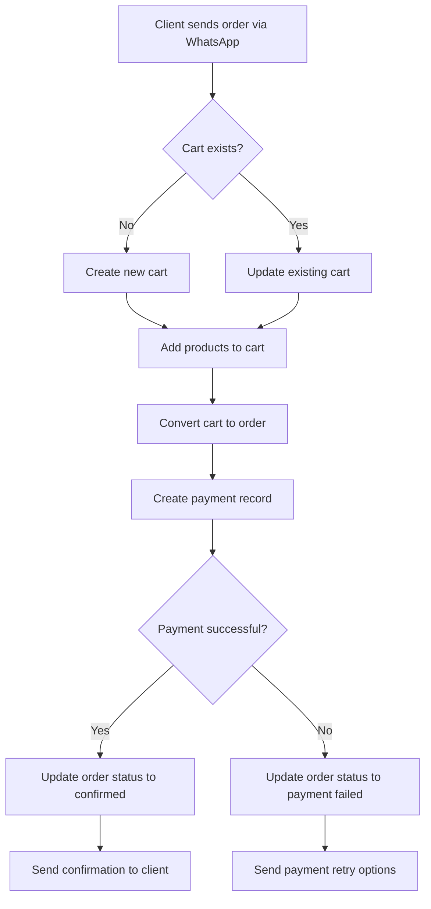

# ShopMe - WhatsApp E-commerce Platform - Product Requirements Document

## 1. Project Vision

The ShopMe project aims to develop a WhatsApp-based e-commerce platform that leverages the WhatsApp Business API and AI technology to automate client support and order management. Designed as a Software as a Service (SaaS) solution, the platform enables businesses to create their own white-labeled e-commerce presence with minimal setup. The goal is to provide immediate and continuous 24/7 assistance, enhancing client experience and streamlining business operations.

### 1.1 Initial Use Case: Italian Products E-commerce

As our first implementation, the platform will be specialized in selling high-quality Italian products. Users will be able to:

**Product Discovery and Information**:

- Browse a curated selection of Italian DOP, IGP, and DOCG products
- Access detailed product information, including origin, certifications, and usage suggestions
- Receive personalized product recommendations
- Learn about producers' stories and traditional production methods

**Order Management**:

- Place orders directly through WhatsApp
- Receive immediate order confirmations
- Track shipment status
- Download invoices and fiscal documents
- Manage returns and complaints

**Customer Support**:

- Request product information and recommendations
- Get advice on product pairings and usage
- Receive post-sale assistance
- Access FAQ and product guides

The platform is designed for any business that offers products or services to clients, from retail stores and service providers to hospitality businesses like hotels, restaurants, gyms, and fitness centers. This versatility allows businesses to not only sell products but also manage appointments, reservations, and memberships through conversational interfaces.

## 2. User Journey

### Administrator Experience

- Access a web dashboard to:
  - Create and manage multiple workspaces.
  - Configure WhatsApp channels (phone numbers, API tokens, webhooks).
  - Customize AI prompts, add products (with photos, text, pricing,offerts), and organize them into service categories.
  - Manage products, services, and clients through intuitive interfaces.

### End User Experience

- Interact exclusively through WhatsApp:
  - New users receive a welcome message and a request for basic registration information.
  - Existing users receive a personalized greeting and can request information, place orders, and receive communications.

## 3. Objectives

### Business Goals

- Significantly reduce client service time through automation.
- Provide 24/7 client support.
- Build client loyalty through future push campaigns (e.g., greetings, promotions, appointment reminders).
- Enable businesses of all types to engage with clients through familiar messaging interfaces.
- Create a versatile platform adaptable to various industries and business models.

### Non-Goals (MVP)

- **Integrated Payment System and Workable Payment Plan:**

  - This combines the original "Implement an integrated payment system" and "Usage and a workable plan for payments."
  - It's crucial to state that _both_ the _implementation_ and a _detailed plan_ are out of scope for the MVP.
  - **Rationale:** Even a high-level plan has design implications. If you defer _all_ payment considerations, you risk architectural issues later. However, in the MVP, the _actual integration_ and _full payment flow_ are not required.

- **Usage Statistics and Analytics:**

  - This is clearer than just "Usage" and separates it from other concerns.
  - **Rationale:** Gathering and displaying detailed analytics can be complex. The MVP should focus on core functionality.

- **Push Campaigns and Marketing Automation:**

  - This is more specific than just "Push campaigns."
  - **Rationale:** Marketing automation features are often added later to enhance user engagement.

- **Advanced Authentication and Security:**

  - This groups related security features.
  - Includes:
    - JSON Web Tokens (JWT) for authentication (if you're using a simpler auth for MVP)
    - 2FA authentication (Two-Factor Authentication)
    - "Forgot Password" functionality
    - "Create User" (if you're handling user creation in a very basic way for MVP)
  - **Rationale:** While basic security is essential, more complex auth can be deferred.

- **Scalability and Monitoring Infrastructure:**

  - This is more specific than just "scale and monitor the system."
  - **Rationale:** While you need to _design_ for scalability, the _full infrastructure_ and monitoring setup can be iterative.
    - For MVP, you might handle scaling manually or with basic tools.
    - Detailed performance monitoring and automated scaling can come later.

- **Comprehensive GDPR Compliance Implementation:**

  - This is carefully worded. You **must** _consider_ GDPR from the start, but the _full and polished implementation_ can be phased.
  - **Rationale:**

    - You can't ignore privacy. Design must be privacy-preserving.
    - However, features like detailed consent management, data portability exports, and full audit logs can be developed iteratively.
    - The _core_ principles (data minimization, security) _must_ be in place.

- **Product Image Upload to S3/Cloud Storage:**

  - Integration with cloud storage services for product image upload and management.
  - **Rationale:** While product image management is important, the MVP can use simpler approaches like URL references to existing images. Full integration with S3 or similar cloud storage services will be implemented in future versions.

  - development environments and monitoring infrastructure can be phased.
  - Product offerts

### Out of Scope Features

These features have been determined to be completely out of scope for the current version of the product. Unlike Non-Goals (MVP) which will be implemented in future phases, these features are not planned for implementation in the immediate roadmap.

1. **Order Management System:**
   - Complete order processing and tracking
   - Order status management
   - Invoice generation and management
   - Shipping integration and tracking
   - Returns and refunds processing
   - **Rationale:** After evaluation, we've determined that the full order management system requires significant integration with external systems (payment, shipping, etc.) and complex business logic that would extend beyond our current development capacity. Users can still browse products and interact with the chatbot, but actual order processing will need to be handled through external systems.

2. **Marketing Campaign Management:**
   - Campaign creation and scheduling
   - A/B testing tools
   - Campaign analytics
   - Audience segmentation
   - **Rationale:** Marketing campaign features require complex integration with analytics and user behavior tracking systems that are beyond our current scope.

3. **Advanced Analytics Dashboard:**
   - Real-time analytics
   - Custom report generation
   - Data visualization tools
   - Export capabilities
   - **Rationale:** Advanced analytics require significant data processing and storage capabilities that are not aligned with our current infrastructure plans.

## 4. Technical Architecture

- **Frontend**: React (latest version) with shadcn/ui library and Tailwind CSS to accelerate development.
- **Backend**: Node.js with Domain Driven Design (DDD) pattern.
- **Database**: PostgreSQL.
- **SaaS Architecture**: Multi-tenant design with complete data isolation between workspaces.
- **Workflow Automation**: n8n.
- **AI Service**: OpenRouter (RAG) with data pseudonymization.
- **WhatsApp Integration**: Official Meta API.
- **Security**: HTTPS, JWT tokens, encrypted sensitive data in the database.
- **Environments**: Development, test, and production; each workspace can activate debug mode with a test number.

### Frontend Implementation

The frontend will be built using Vite and React, coupled with Tailwind CSS and shadcn/ui for styling. This architecture provides several advantages:

- **Fast Development**: Vite's lightning-fast HMR (Hot Module Replacement)
- **API Proxy**: Built-in proxy configuration for seamless API integration
- **Component isolation**: Clear separation of concerns with modular components
- **Type Safety**: Full TypeScript support
- **Styling**: Utility-first approach with Tailwind CSS for rapid development
- **UI Components**: Shadcn/ui for consistent and accessible components

#### Core API Integration

The frontend communicates with the backend through a RESTful API architecture:

1. **Authentication API**:

   - Login/Register flows
   - JWT token management
   - User session handling

2. **Workspace API**:

   - Workspace management
   - Settings and configurations
   - User permissions

3. **Products API**:

   - Product catalog management
   - Categories CRUD
   - Image upload handling

4. **Orders API**:

   - Order processing
   - Cart management
   - Order status tracking

5. **Clients API**:

   - Client profile management
   - Purchase history
   - GDPR compliance

6. **Settings API**:
   - Workspace configuration
   - User preferences
   - System settings
   - Phone Number Blocklist: Ability to block specific phone numbers from interacting with the system, preventing potential abuse by adding phone numbers to a blocklist. Messages from these numbers will be automatically ignored.

The frontend uses a proxy configuration to route all `/api/*` requests to the backend server, handling CORS and other cross-origin concerns automatically.

### OpenRouter Integration and Data Flow

The system uses OpenRouter's Retrieval Augmented Generation (RAG) capabilities to power the AI-assisted interactions within the platform. Here's how the data flows:


1. **Data Collection**: When a WhatsApp message is received from a client, it arrives through the Meta API.

2. **Pre-processing**: The backend identifies any personal or sensitive information in the incoming message.

3. **Pseudonymization**: Before sending data to OpenRouter, all personal identifiers are replaced with tokens (see Security section on Pseudonymization for details).

4. **AI Processing**: The tokenized data is sent to OpenRouter, which generates contextually appropriate responses based on the prompt templates and product information.

5. **Post-processing**: The backend replaces any tokens in the AI response with the actual personal data before sending the response back to the client.

6. **Response Delivery**: The final processed response is sent to the client via the WhatsApp API.

This architecture ensures that no personally identifiable information (PII) is exposed to external AI services while maintaining the conversational quality and personalization of responses.

### Hosting and Infrastructure

The application will be hosted on Heroku's cloud platform, providing the following services:

1. **Application Hosting**:

   - Node.js runtime environment for the backend
   - Automatic scaling and load balancing
   - SSL/TLS encryption
   - Continuous deployment integration

2. **Database**:

   - Heroku Postgres for primary database
   - Automated backups and point-in-time recovery
   - Database metrics and monitoring
   - Connection pooling

3. **Storage Solutions**:

   - Bucketeer add-on for S3-compatible file storage
   - Used for storing invoices, product images, and documents
   - Automatic backup and versioning
   - CDN integration for faster file delivery

4. **Deployment Strategy**:
   - Git-based deployment workflow
   - Review apps for pull requests
   - Staging and production environments
   - Zero-downtime deployments

### Environment Setup and CI/CD Pipeline (Out of Scope for MVP)

The following environment structure and CI/CD pipeline represents the target infrastructure state that will be implemented in future phases after the MVP release. This section is explicitly excluded from the MVP scope as outlined in Section 3 (Non-Goals). When implemented in future versions, the application will utilize three distinct environments with a comprehensive CI/CD pipeline to ensure quality, reliability, and efficient deployment:

#### 1. Environment Structure (out of scope for MVP)\*\*

- **Development (dev)**

  - Purpose: Active development and feature implementation
  - URL structure: `https://dev.shopme.app` or `https://dev-[feature-branch].shopme.app`
  - Database: Separate dev database with anonymized production data
  - Deployed on: Heroku development dynos
  - WhatsApp integration: Testing phone number with Meta API sandbox
  - Features:
    - Debug tools and extended logging
    - Feature flags for in-development capabilities
    - Automatic database schema reset option
    - Performance monitoring with non-optimized assets

- **Staging (staging)**

  - Purpose: Pre-production testing, QA, and UAT
  - URL structure: `https://staging.shopme.app`
  - Database: Clone of production database with anonymized sensitive data
  - Deployed on: Heroku standard dynos
  - WhatsApp integration: Testing phone number with full API capabilities
  - Features:
    - Production-like environment
    - A/B testing capabilities
    - Performance testing tools
    - Automated test suite execution
    - Security scanning

- **Production (prod)**
  - Purpose: Live environment for end users
  - URL structure: `https://shopme.app` and client subdomains
  - Database: Production database with regular backups
  - Deployed on: Heroku performance dynos with auto-scaling
  - WhatsApp integration: Client production phone numbers
  - Features:
    - High availability configuration
    - Optimized performance
    - Comprehensive monitoring
    - Automated rollback capabilities
    - Regular security audits

#### 2. CI/CD Pipeline

- **Continuous Integration**

  - Platform: GitHub Actions
  - Triggered on: Pull request creation and updates
  - Steps:
    - Static code analysis (ESLint, TypeScript checking)
    - Unit test execution
    - Integration test execution
    - Build process verification
    - Bundle size analysis
    - Dependency vulnerability scanning
    - Code coverage reporting
  - Pass criteria: All tests pass, no critical vulnerabilities, code coverage above 80%

- **Continuous Deployment**

  - **Development Deployment**

    - Trigger: Merge to development branch
    - Target: Development environment
    - Process: Automated deployment with post-deployment tests
    - Notification: Slack alerts for team

  - **Staging Deployment**

    - Trigger: Manual promotion from development
    - Target: Staging environment
    - Process:
      - Database migration verification
      - Automated deployment
      - Smoke test execution
      - End-to-end test suite execution
      - Performance benchmark comparison
    - Notification: Slack alerts for team and QA

  - **Production Deployment**
    - Trigger: Manual promotion from staging
    - Approval: Required from technical lead and product owner
    - Schedule: During defined maintenance windows (non-peak hours)
    - Target: Production environment
    - Process:
      - Database backup
      - Blue/green deployment
      - Canary testing (initial 10% traffic)
      - Gradual rollout with health monitoring
      - Automated rollback if health checks fail
    - Notification: Slack alerts for all stakeholders

#### 3. Quality Assurance Process

- **Automated Testing**

  - Unit tests: Jest for frontend and backend logic
  - Integration tests: API endpoint testing with Supertest
  - End-to-end tests: Cypress for critical user journeys
  - Performance tests: k6 for load testing
  - Accessibility tests: pa11y for WCAG compliance

- **Manual Testing**

  - UAT sessions with stakeholders in staging
  - Exploratory testing by QA team
  - Cross-browser compatibility testing
  - Mobile responsiveness testing

- **Monitoring and Observability**
  - Error tracking: Sentry for frontend and backend errors
  - Performance monitoring: New Relic for application performance
  - Log management: Papertrail for centralized logging
  - Synthetic monitoring: Uptime checks every 5 minutes
  - Real user monitoring: Performance metrics from actual users

#### 4. Disaster Recovery

- **Backup Strategy**

  - Database: Hourly incremental backups, daily full backups
  - Storage: Redundant storage with versioning
  - Configuration: Infrastructure as Code with version control

- **Recovery Process**
  - Defined runbooks for common failure scenarios
  - Regular recovery drills (quarterly)
  - Maximum tolerable downtime: 1 hour
  - Recovery time objective (RTO): 30 minutes
  - Recovery point objective (RPO): 1 hour

This multi-environment approach combined with a robust CI/CD pipeline ensures reliable, consistent deployments while maintaining high quality standards across the application lifecycle.

## 5. Acceptance Criteria

- Fully operational CRUD functionality for workspaces, products, prompts, services, languages, and users.
- Chatbot responses generated within seconds.
- API communication protected via JWT tokens.
- Intuitive dashboard with 2FA authentication.
- Seamless integration between n8n and exposed APIs.
- Anti-abuse protection system that automatically blocks users sending more than 8 messages per minute.

### Anti-Abuse System

To prevent system abuse and ensure fair resource allocation, the platform implements an automated rate-limiting mechanism:

- If a user sends more than 8 messages within a 60-second window, their profile status is automatically changed to "blocked"
- The system responds with a message: "Your number has been blocked due to improper use. Please contact the administrator to unblock it."
- Administrators can view blocked users in the dashboard and manually unblock legitimate users
- The system maintains logs of blocking events for security analysis

This mechanism protects against spam attacks, prevents AI resource waste, and ensures a smooth experience for all legitimate users. Rate limits are configurable by workspace administrators to accommodate different business needs and usage patterns.

## 6. Key Features

1. **User Management:**

   - Registration and Login: Secure authentication and profile management.
   - Password Recovery: Functionality for credential reset.

2. **Product Catalog:**

   - Product Display: List and detailed view of products with images, descriptions, and prices.
   - Search and Filtering: Tools to search products by category, price, popularity, etc.
   - Categories: Management of product categories for better organization.

3. **WhatsApp Cart Management:**

   - Conversational Interface: Allows users to manage their cart via WhatsApp messages.
   - Add/Remove Products: Commands to add or remove products from the cart.
   - Cart Status Display: Sending cart summaries and updates via WhatsApp.

4. **Checkout and Online Payments:**

   - Order Confirmation: After cart management on WhatsApp, the user is redirected to a web platform to confirm the order.
   - Online Payments: Secure and integrated payment procedure on the online platform.

5. **AI Integration:**

   - RAG Implementation: Retrieval Augmented Generation for better business context with customer data.
   - Customizable Prompts: Configure AI responses to reflect business voice and policies.
   - Context Awareness: AI understands conversation history and user preferences.
   - Data Pseudonymization: Privacy protection when processing data with external models.
   - Automatic Translations: Support for multiple languages in the same conversation.
   - Prompt Testing: Ability to test alternative prompts in isolated sessions without affecting the active production prompt. This allows administrators to safely experiment with different AI behaviors before deploying them to customers.
   - Prompt Duplication: Ability to duplicate existing prompts to create variations or backups, maintaining the original structure while allowing modifications to the copy. This feature enables users to iterate on existing successful prompts without starting from scratch.

6. **Order Management and Tracking:**

   > ⚠️ Note: This feature has been moved to Out of Scope. See "Out of Scope Features" section for details.
   
   The following functionality was originally planned but is now out of scope:
   - Order History: View past purchases and current order status
   - Shipment Tracking: Real-time updates on shipment status
   - Invoice Management: Generate and download invoices
   - Returns Processing: Handle product returns and refunds

   For the current version, users can browse products and interact with the chatbot, but actual order processing will need to be handled through external systems.

7. **Client Management:**

   - Client Profiles: Maintain comprehensive records of all clients.
   - Purchase History: Track client purchasing patterns and preferences.
   - Communication Log: Access past interactions with clients.
   - Reservation Management: Track and manage client bookings and appointments (future expansion).
   - Push Notifications: Send targeted messages for marketing, reminders, and loyalty programs.

8. **Chat History:**

   - Conversation Logs: Review and analyze WhatsApp conversations with clients.
   - Message Search: Search through chat history for specific information.

9. **Usage Analytics:**

   - Usage Monitoring: Collection and analysis of platform usage data to understand user behavior.
   - Usage Reports: Generation of reports and statistics to improve experience and optimize features.

10. **Administrative Dashboard:**

- Content Management: Tools to add, modify, or remove products and categories.
- Reports and Analysis: Statistics on sales, traffic, and system performance.

11. **Reservation and Booking System (Future Expansion):**

    - Appointment Scheduling: Allow clients to book services via WhatsApp.
    - Table Reservations: Enable restaurant booking management.
    - Room Bookings: Handle hotel room reservations.
    - Class Registrations: Manage gym class sign-ups and attendance.
    - Capacity Management: Track availability and prevent overbooking.
    - Automated Reminders: Send notifications before appointments.

12. **Push Notification Campaigns:**
    - Targeted Messaging: Send personalized offers based on client history.
    - Automatic Reminders: Notify clients about upcoming appointments or reservations.
    - Re-engagement Campaigns: Reach out to inactive clients.
    - Special Promotions: Announce limited-time offers and discounts.
    - Loyalty Programs: Update clients on points, rewards, and milestones.
    - Event Notifications: Inform clients about upcoming events or new services.

## 6.5 WhatsApp Messaging Flow API

The platform implements a comprehensive messaging flow through the `MessageProcessorAPI` that handles all WhatsApp communications. This API serves as the core middleware between incoming WhatsApp messages and AI-powered responses.

### 6.5.1 Flow Architecture

The messaging flow follows this sequence:

1. **Reception**: Incoming messages from WhatsApp are received via webhook
2. **Challenge Verification**: System checks if the workspace is active
3. **User Identification**: System identifies the user and checks if they're new or existing
4. **Agent Selection**: For existing users, the appropriate specialized agent is selected based on message context
5. **Context Loading**: User data, order history, and previous messages are retrieved
6. **Data Protection**: Personal data is tokenized before processing
7. **AI Processing**: The tokenized message is processed by OpenRouter AI
8. **Response Formatting**: AI response is made conversational
9. **Data Restoration**: Tokens are replaced with actual user data
10. **History Tracking**: The exchange is logged in the chat history
11. **Delivery**: The response is sent back to the user via WhatsApp

### 6.5.2 Implementation

The API is implemented through the following core function:

```javascript
try {
    // Check if challenge is active
    if (!isChallengeActive()) {
        inactiveMessage = getInactiveMessage()
        sendMessage(inactiveMessage);
        return;
    }

    let systemResp;
    const message = GetQuestion();  
    const userID = GetUserId();
    const userInfo = getUserData(userID);
    const isNewUser = isPresent(userInfo) ? false : true;
  
    if (isNewUser) {
        // New link to the registration form
         return "LINK";   
    } else {

        // 0. GET DATA
        routerAgent = getRouterAgent()
        const agentSelected = GetAgentDedicatedFromRouterAgent(routerAgent,message);
        const prompt = loadPrompt(agentSelected);  
        const orders = getOrders();
        const products = getProducts();  
        const historyMessages = GetHistory("last 30 messages");

        // 1. TOKENIZE (ora restituisce anche la mappa)
        const { fakeMessage, fakeUserInfo, tokenMap } = Tokenize(message, userInfo);

        // 2. OPENROUTER 
        systemResp = getResponse(prompt, agentSelected, historyMessages, fakeMessage, fakeUserInfo, orders, products);
        // Attach a calling function when we have the order details  
        // Attach a calling function when we have to send the invoices     

         // 4. CONVERSIONAL RESPONSE
        systemResp = conversationalResponse("metti la frase in maniera discorsiva:" + systemResp);
 
        // 5. DETOKENIZE
        const resp = Detokenize(systemResp, systemResp);
        
        // 6. SAVE TO HISTORY
        saveToChatHistory(userID, agentSelected, message, resp);  

        return resp;  
    }

    
} catch (error) {
    console.error("Errore in main:", error);
}
```

### 6.5.3 Database Requirements

To support this messaging flow, the database includes the following key entities:

- **ChatSession**: Tracks ongoing conversations with metadata
- **Message**: Stores individual messages with direction, content, and status
- **Prompts**: Stores AI agent configurations and prompts
- **Customers**: Contains user data and preferences

These models support the conversational interface shown in the platform's chat interface:


The interface provides:
- List of recent conversations on the left panel
- Detailed conversation view on the right panel
- Real-time message exchange with timestamps
- Order tracking and status information
- Clear visual distinction between incoming and outgoing messages

## 7. Use Cases

### Admin Use Case:

- [Admin Dashboard] → [Workspace Management]
  - [CRUD WhatsApp Settings]
  - [CRUD Products]
  - [CRUD Categories]
  - [CRUD Services]
  - [CRUD Prompts]
  - [CRUD Clients and Campaigns]

### Registered WhatsApp User Use Case:

- [Registered WhatsApp User] → [Sends Message]
  - [n8n Workflow]
  - [Retrieval of workspace, profile, products, services data]
  - [Response generation with OpenRouter (RAG)]
  - [Response sending via Meta WhatsApp API]

### New WhatsApp User Use Case:

- [New WhatsApp User] → [Sends First Message]
  - [n8n Workflow]
  - [User identification: not registered]
  - [Sending welcome message and request for basic data]
  - [GDPR consent collection]
  - [User registration and profile creation]

### GDPR Consent Flow

To ensure GDPR compliance, the platform implements a structured consent collection process during registration:

1. **Initial Contact**: When a new user sends their first message, the system sends a welcome message that introduces the service and immediately addresses data privacy:

   ```
   Hello [User Name]! 👋 I'm your ShopMe AI assistant and I'll be helping you explore our Italian products and services.

   Before we begin, I want to reassure you about how we handle your personal data. We prioritize your privacy - your information will never be shared with third parties and is only used to provide you with the best shopping experience.

   You can review our complete Privacy Policy here: [GDPR_POLICY_URL]

   If you're ready to continue, we can get started with your shopping experience today!
   ```

2. **Consent Request**: After the welcome message, the user receives the formal consent request:

   ```
   Before we continue, we need your consent to process your data according to our Privacy Policy
   (full text: {privacy_policy_url}).

   This includes storing your contact information and message history to provide you with shopping
   assistance and order processing. You can withdraw consent at any time.

   Please reply with "I ACCEPT" to continue.
   ```

3. **Consent Recording**: When the user replies with acceptance:
   - The system records the current privacy policy version in `last_privacy_version_accepted`
   - The timestamp is recorded in `privacy_accepted_at`
   - This data is stored in the user profile for audit and compliance purposes

#### Consent Verification for Returning Users

For existing users who have previously interacted with the system, the consent flow works differently:

1. **Consent Verification**: At the beginning of each interaction session:
   - The system checks if the user has an existing record with a valid `last_privacy_version_accepted` field
   - The system compares the accepted version with the current privacy policy version
2. **Outcome Scenarios**:

   - **Valid Consent Exists**: If the user has already accepted the current version, no consent prompt is shown and the interaction proceeds normally without interruption
   - **Outdated Consent**: If the user had accepted an older version of the policy, they receive a notification about the update with a summary of changes and must provide fresh consent
   - **No Consent Record**: If the user has no consent record (rare edge case for existing users), they go through the full consent flow

3. **Minimal Disruption Principle**: The system is designed to minimize disruption to returning users:
   - Consent verification happens silently in the background for users with valid consent
   - Users are only prompted when legally necessary (policy changes or missing consent)
   - The consent UI for returning users emphasizes what has changed since their last acceptance

This approach ensures GDPR compliance while maintaining a smooth user experience for returning customers.

#### Consent Data Storage

The user's privacy consent information is stored in the `clients` table in the database with the following specific fields:

- **`last_privacy_version_accepted`**: A string field that stores the version identifier of the privacy policy that was accepted (e.g., "1.2.0")
- **`privacy_accepted_at`**: A timestamp field that records the exact date and time when the user provided consent

This implementation allows the system to:

- Track which specific version of the policy each user has accepted
- Maintain a complete audit trail for GDPR compliance
- Identify users who need to renew consent when the privacy policy is updated
- Provide timestamped proof of consent in case of regulatory inquiries

Every time a user interacts with the system, these fields are checked to ensure the user has accepted the current version of the privacy policy. If not, the consent flow is triggered again.

4. **Privacy Updates**: When the privacy policy is updated:

   - Users are notified of changes with a summary of updates
   - They must provide fresh consent before continuing to use the service
   - The `last_privacy_version_accepted` field is updated

5. **Consent Management**: Users can:
   - Request to view their stored data
   - Request data deletion (triggering GDPR right to be forgotten workflow)
   - Withdraw consent (which flags the account for limited processing)

All consent interactions are logged with timestamps and specific version information to maintain a complete audit trail for compliance purposes.

### Push Offers Use Case:

- [Admin creates Push Campaign] → [Automatic Sending via WhatsApp API]
  - [Users receive message]
  - [Option to unsubscribe]

### Initial Data and Seed Content

For the initial deployment focused on Italian products e-commerce, the platform will be pre-populated with a comprehensive and consistent dataset of Italian products as seed data. This includes:

- **Curated Product Catalog**: A coherent collection of premium Italian products across various categories including:

  - Artisanal food products (pasta, olive oil, preserves, cheeses, wines)
  - Home goods and kitchenware
  - Clothing and accessories from Italian designers
  - Traditional crafts and decorative items

- **Consistent Data Structure**: Each product in the seed database will have complete and consistent information:

  - Detailed descriptions highlighting authentic Italian origin and traditional production methods
  - High-quality images showing the products from multiple angles
  - Accurate pricing and inventory information
  - Categorization aligned with Italian product taxonomy
  - Origin information (region, city, producer)

- **Category Organization**: Logical organization of products that reflects traditional Italian classifications and shopping patterns, facilitating natural conversation flow during WhatsApp interactions.

- **Sample Prompts**: Pre-configured AI prompts specifically designed to showcase Italian products with appropriate cultural context and terminology.

This comprehensive Italian product seed database serves multiple purposes:

1. Demonstrates the platform's capabilities with realistic, market-ready content
2. Provides new businesses with a reference implementation showcasing best practices
3. Enables meaningful testing and user experience evaluation with authentic data
4. Establishes a pattern for future data organization when businesses customize their own catalogs

The seed data ensures that from day one, the platform delivers a rich, coherent shopping experience focused on Italian products, while establishing a template for how merchants should structure their own product information.

## 8. Backend Architecture and Implementation

### Overview

The backend system of this PDR application will be developed using Node.js with the Express.js framework, adopting the Domain-Driven Design (DDD) architectural pattern and implemented as a monorepo using Turborepo. This architecture allows for efficient code organization, shared dependencies, and optimized builds across multiple packages.

The monorepo structure, powered by Turborepo, provides several key benefits:

- Centralized code management with shared configurations
- Optimized build pipeline with intelligent caching
- Consistent development experience across packages
- Efficient dependency management
- Standardized tooling and processes

### Monorepo Structure

```
.
├── apps/
│   ├── web/          # Next.js frontend application
│   └── backend/      # Node.js backend application
├── packages/
│   ├── eslint-config/    # Shared ESLint configuration
│   ├── typescript-config/ # Shared TypeScript configuration
│   └── ui/              # Shared UI components
├── package.json     # Root package.json
└── turbo.json      # Turborepo configuration
```

### Security Implementation

System security is a priority. Therefore, security measures recommended by OWASP will be implemented, including:

- Input validation to prevent injection attacks
- Secure session management to protect user authentication
- Protection against SQL injection and Cross-Site Scripting (XSS) to ensure data integrity
- JWT token validation and refresh mechanisms
- Rate limiting and request throttling
- Security headers implementation
- CORS policy configuration

### Technical Stack and Organization

#### Core Technologies

- Node.js with Express.js
- PostgreSQL with Prisma ORM
- Redis for caching
- Docker for containerization
- n8n for workflow automation

#### Architecture Layers

1. **Routes Layer**

   - API endpoint definitions
   - Request validation
   - Response formatting
   - Error handling middleware

2. **Use Cases Layer**

   - Business logic implementation
   - Transaction management
   - Event handling
   - Service orchestration

3. **Services Layer**

   - Domain logic
   - External service integration
   - Data transformation
   - Business rules enforcement

4. **Repository Layer**
   - Data access patterns
   - Query optimization
   - Cache management
   - Data persistence

### Development Guidelines

#### Project Structure

```
src/
├── config/         # Configuration files
├── routes/         # API routes
├── useCases/      # Business logic
├── services/      # Domain services
├── repositories/  # Data access
├── models/        # Data models
├── middleware/    # Custom middleware
├── utils/         # Utility functions
└── tests/         # Test files
```

#### Code Organization

- Clear separation of concerns
- Dependency injection pattern
- Repository pattern for data access
- Factory pattern for object creation
- Strategy pattern for flexible algorithms

### Error Handling and Logging

- Centralized error handling
- Structured logging with Winston
- Request ID tracking
- Performance monitoring
- Error reporting and alerting

### Documentation

- Swagger/OpenAPI documentation
- API endpoint documentation
- Database schema documentation
- Development setup guide
- Deployment instructions

### Development Workflow

- Git workflow guidelines
- Code review process
- Testing requirements
- CI/CD pipeline configuration
- Environment management

### Monitoring and Maintenance

- Health check endpoints
- Performance metrics
- Resource monitoring
- Backup strategies
- Scaling guidelines

### Docker Architecture

The ShopMe platform utilizes a simplified containerized architecture with Docker to ensure consistency across development, testing, and production environments. The system is built with a minimalist approach, focusing only on essential containers:

#### Container Architecture

- **PostgreSQL Container**:

  - Image: PostgreSQL 14
  - Purpose: Primary database storing all application data
  - Ports: 5432
  - Volumes: Database data, periodic backups
  - Configuration: Optimized for performance with appropriate memory allocation and connection pooling

- **n8n Workflow Container**:
  - Image: n8n (official image)
  - Purpose: Executes all workflow automation, handling communication between WhatsApp API and ShopMe backend
  - Ports: 5678
  - Volumes: Workflow data, credentials (encrypted)
  - Configuration: Customized for WhatsApp business message processing

#### Deployment Strategy

This streamlined two-container approach is consistent across both local development and production environments:

**Local Development:**

- Docker Compose orchestrates both containers
- Uses the free version of n8n
- Local volume mounts for easy development and debugging
- Environment variables managed through .env files (not committed to version control)

**Production (Heroku):**

- Both containers deployed using Heroku container registry
- PostgreSQL configured with Heroku PostgreSQL add-on for managed database service
- n8n container deployed with persistent storage for workflow data
- Environment variables managed through Heroku config vars
- Automated backups configured for both containers

This minimalist container strategy reduces operational complexity while providing all necessary functionality for the application. The frontend and API are deployed using Heroku's standard buildpacks rather than containers, further simplifying the architecture.

This architecture will ensure a robust, secure, and scalable backend system, in line with the digitization and resilience objectives of the PDR.

## 9. API Endpoints

### Authentication

- `POST /api/auth/login`

  - **Description**: Authenticates a user and returns a JWT token
  - **Body**: `email`, `password`
  - **Returns**: JWT token, user information

- `POST /api/auth/logout`

  - **Description**: Logs out the current user
  - **Headers**: `Authorization` with JWT token
  - **Returns**: Success message

- `POST /api/auth/refresh`

  - **Description**: Refreshes the JWT token
  - **Headers**: `Authorization` with current JWT token
  - **Returns**: New JWT token

- `GET /api/auth/me`
  - **Description**: Gets the current authenticated user's information
  - **Headers**: `Authorization` with JWT token
  - **Returns**: User profile information

### Chat Management

- `GET /api/chats`

  - **Description**: Retrieves all chats for the workspace
  - **Parameters**: `workspace_id` (required): Workspace identifier
  - **Returns**: List of chats with basic information

- `GET /api/chat/:id`

  - **Description**: Retrieves details of a specific chat
  - **Parameters**: `id` (required): Chat identifier
  - **Returns**: Chat details including messages

- `GET /api/chat/:id/messages`

  - **Description**: Retrieves messages for a specific chat
  - **Parameters**: `id` (required): Chat identifier, `page`, `limit`
  - **Returns**: Paginated list of messages

- `POST /api/chat/message`

  - **Description**: Sends a new message in a chat
  - **Body**: `chat_id`, `content`, `sender_type`
  - **Returns**: Created message details

- `PUT /api/chat/message/:id/read`
  - **Description**: Marks messages as read
  - **Parameters**: `id` (required): Message identifier
  - **Returns**: Updated message status

### Prompt Management

- `GET /api/prompt/:phone`

  - **Description**: Retrieves the active prompt for a specific phone number
  - **Parameters**: `phone` (required): WhatsApp phone number
  - **Returns**: Active prompt text, language configurations, context settings
  - **Note**: Only one prompt can be active per phone number at any time

- `GET /api/prompts`

  - **Description**: Retrieves all prompts in the workspace
  - **Parameters**: `workspace_id` (required): Workspace identifier
  - **Returns**: List of prompts with active/inactive status

- `POST /api/prompt`

  - **Description**: Creates a new prompt
  - **Body**: `prompt_text`, `reference_phone`, `workspace_id`, `active` (boolean)
  - **Returns**: Created prompt details
  - **Note**: If `active` is set to true, any previously active prompt for the same phone number will be automatically deactivated

- `PUT /api/prompt/:id`

  - **Description**: Updates an existing prompt
  - **Parameters**: `id` (required): Prompt ID
  - **Body**: `prompt_text`, `active` (boolean)
  - **Returns**: Updated prompt details
  - **Note**: If `active` is set to true, any previously active prompt for the same phone number will be automatically deactivated

- `DELETE /api/prompt/:id`

  - **Description**: Deletes a prompt
  - **Parameters**: `id` (required): Prompt ID
  - **Returns**: Success message

- `POST /api/prompt/test-session`

  - **Description**: Creates a temporary test session with an alternative prompt
  - **Body**: `prompt_text`, `reference_phone`, `workspace_id`, `session_duration` (minutes)
  - **Returns**: Session ID and expiration time
  - **Note**: This allows testing alternative prompts without modifying the active production prompt

- `GET /api/prompt/test-session/:id`

  - **Description**: Retrieves a test session prompt
  - **Parameters**: `id` (required): Session ID
  - **Returns**: Test prompt details and remaining session time

- `DELETE /api/prompt/test-session/:id`
  - **Description**: Ends a test session early
  - **Parameters**: `id` (required): Session ID
  - **Returns**: Success message

### Notification Management

- `GET /api/notifications`

  - **Description**: Retrieves all notifications for the workspace
  - **Parameters**: `workspace_id` (required), `page`, `limit`
  - **Returns**: Paginated list of notifications

- `POST /api/notifications`

  - **Description**: Creates a new push notification
  - **Body**: `title`, `message`, `target_users`, `schedule_time`
  - **Returns**: Created notification details

- `PUT /api/notifications/:id`

  - **Description**: Updates a notification's status or content
  - **Parameters**: `id` (required): Notification ID
  - **Body**: `status`, `title`, `message`
  - **Returns**: Updated notification details

- `DELETE /api/notifications/:id`
  - **Description**: Deletes a notification
  - **Parameters**: `id` (required): Notification ID
  - **Returns**: Success message

### Product and Category Management

- `GET /api/products`

  - **Description**: Retrieves complete product list
  - **Parameters**: `workspace_id` (required), `category_id`, `page`, `limit`
  - **Returns**: Paginated list of products

- `POST /api/products`

  - **Description**: Creates a new product
  - **Body**: `name`, `description`, `price`, `category_id`, `images`, `stock`
  - **Returns**: Created product details

- `PUT /api/products/:id`

  - **Description**: Updates a product
  - **Parameters**: `id` (required): Product ID
  - **Body**: Product details to update
  - **Returns**: Updated product details

- `DELETE /api/products/:id`

  - **Description**: Deletes a product
  - **Parameters**: `id` (required): Product ID
  - **Returns**: Success message

- `GET /api/categories`

  - **Description**: Retrieves product categories
  - **Parameters**: `workspace_id` (required): Workspace identifier
  - **Returns**: List of categories with products count

- `POST /api/categories`

  - **Description**: Creates a new category
  - **Body**: `name`, `description`, `parent_id`
  - **Returns**: Created category details

- `PUT /api/categories/:id`

  - **Description**: Updates a category
  - **Parameters**: `id` (required): Category ID
  - **Body**: Category details to update
  - **Returns**: Updated category details

- `DELETE /api/categories/:id`
  - **Description**: Deletes a category
  - **Parameters**: `id` (required): Category ID
  - **Returns**: Success message

### Service Management

- `GET /api/services`

  - **Description**: Retrieves list of available services
  - **Parameters**: `workspace_id` (required): Workspace identifier
  - **Returns**: List of services

- `POST /api/services`

  - **Description**: Creates a new service
  - **Body**: `name`, `description`, `price`, `duration`
  - **Returns**: Created service details

- `PUT /api/services/:id`

  - **Description**: Updates a service
  - **Parameters**: `id` (required): Service ID
  - **Body**: Service details to update
  - **Returns**: Updated service details

- `DELETE /api/services/:id`
  - **Description**: Deletes a service
  - **Parameters**: `id` (required): Service ID
  - **Returns**: Success message

### Order Management

- `GET /api/orders`

  - **Description**: Retrieves all orders
  - **Parameters**: `workspace_id` (required), `status`, `page`, `limit`
  - **Returns**: Paginated list of orders

- `GET /api/orders/:id`

  - **Description**: Retrieves details of a specific order
  - **Parameters**: `id` (required): Order ID
  - **Returns**: Complete order details with items

- `POST /api/orders`

  - **Description**: Creates a new order
  - **Body**: Order details including products, quantities, client information
  - **Returns**: Created order details

- `PUT /api/orders/:id`

  - **Description**: Updates an order's status or details
  - **Parameters**: `id` (required): Order ID
  - **Body**: Order details to update
  - **Returns**: Updated order details

- `DELETE /api/orders/:id`
  - **Description**: Cancels/deletes an order
  - **Parameters**: `id` (required): Order ID
  - **Returns**: Success message

### Client Management

- `GET /api/clients`

  - **Description**: Retrieves list of clients
  - **Parameters**: `workspace_id` (required), `page`, `limit`
  - **Returns**: Paginated list of clients

- `GET /api/clients/:id`

  - **Description**: Retrieves client details
  - **Parameters**: `id` (required): Client identifier
  - **Returns**: Complete client profile with order history

- `POST /api/clients`

  - **Description**: Creates a new client
  - **Body**: Client details including name, phone, email
  - **Returns**: Created client details

- `PUT /api/clients/:id`
  - **Description**: Updates client information
  - **Parameters**: `id` (required): Client identifier
  - **Body**: Updated client details
  - **Returns**: Updated client profile

### Cart Management

- `GET /api/cart/:user_id`

  - **Description**: Retrieves user's cart
  - **Parameters**: `user_id` (required): User identifier
  - **Returns**: Cart contents with product details

- `POST /api/cart`

  - **Description**: Adds a product to the cart
  - **Body**: `user_id`, `product_id`, `quantity`
  - **Returns**: Updated cart contents

- `PUT /api/cart`

  - **Description**: Modifies a product in the cart
  - **Body**: `cart_id`, `product_id`, `quantity`
  - **Returns**: Updated cart contents

- `DELETE /api/cart`
  - **Description**: Removes a product from the cart
  - **Body**: `cart_id`, `product_id`
  - **Returns**: Updated cart contents

### Workspace Management

- `GET /api/workspaces`

  - **Description**: Retrieves all workspaces for the user
  - **Headers**: `Authorization` with JWT token
  - **Returns**: List of workspaces user has access to

- `POST /api/workspaces`

  - **Description**: Creates a new workspace
  - **Body**: `name`, `description`, `settings`
  - **Returns**: Created workspace details

- `PUT /api/workspaces/:id`

  - **Description**: Updates workspace settings
  - **Parameters**: `id` (required): Workspace ID
  - **Body**: Workspace details to update
  - **Returns**: Updated workspace details

- `DELETE /api/workspaces/:id`
  - **Description**: Deletes a workspace
  - **Parameters**: `id` (required): Workspace ID
  - **Returns**: Success message

### Settings Management

- `GET /api/settings`

  - **Description**: Retrieves workspace settings
  - **Parameters**: `workspace_id` (required): Workspace identifier
  - **Returns**: All workspace settings

- `PUT /api/settings`
  - **Description**: Updates workspace settings
  - **Body**: `workspace_id`, settings to update
  - **Returns**: Updated settings

### AI Configuration Settings

- `GET /api/settings/ai`

  - **Description**: Retrieves AI generation settings for the workspace
  - **Parameters**: `workspace_id` (required): Workspace identifier
  - **Returns**: Current AI configuration parameters including temperature, top_p, and top_k values

- `PUT /api/settings/ai`

  - **Description**: Updates AI generation parameters
  - **Parameters**: `workspace_id` (required): Workspace identifier
  - **Body**:
    ```
    {
      "temperature": float, // Value between 0.0-1.0 controlling randomness
      "top_p": float,       // Nucleus sampling parameter (0.0-1.0)
      "top_k": integer,     // Limits token selection to top K options
      "max_tokens": integer // Maximum tokens to generate in responses
    }
    ```
  - **Returns**: Updated AI settings

The AI configuration settings control how the AI model generates responses:

- **Temperature**: Controls randomness. Lower values (e.g., 0.2) make responses more focused and deterministic, while higher values (e.g., 0.8) make output more creative and diverse.
- **Top_p (Nucleus Sampling)**: Controls diversity by dynamically selecting from tokens whose cumulative probability exceeds the top_p value. Lower values (e.g., 0.5) make responses more focused, while higher values allow for more variety.
- **Top_k**: Limits the model to consider only the top k most likely tokens at each step, reducing the chance of generating low-probability or irrelevant tokens.
- **Max Tokens**: Defines the maximum length of generated responses to control verbosity and resource usage.

These parameters allow workspace administrators to fine-tune the AI behavior to match their specific business needs, brand voice, and customer communication style.

### User Management

- `GET /api/users/:phone`

  - **Description**: User identification and profile retrieval
  - **Parameters**: `phone` (required): User's phone number
  - **Returns**: User profile information

- `GET /api/users`

  - **Description**: Retrieves all users in the workspace
  - **Parameters**: `workspace_id` (required), `role`, `page`, `limit`
  - **Returns**: Paginated list of users

- `POST /api/users`

  - **Description**: Creates a new user
  - **Body**: `email`, `password`, `name`, `role`, `workspace_id`
  - **Returns**: Created user details

- `PUT /api/users/:id`

  - **Description**: Updates user information
  - **Parameters**: `id` (required): User ID
  - **Body**: User details to update
  - **Returns**: Updated user details

- `DELETE /api/users/:id`
  - **Description**: Deletes a user
  - **Parameters**: `id` (required): User ID
  - **Returns**: Success message

### Analytics API

- `GET /api/analytics/overview`

  - **Description**: Retrieves general statistics
  - **Returns**: Total active users, total messages, revenue, growth percentages

- `GET /api/analytics/recent-activity`
  - **Description**: Retrieves recent activities
  - **Returns**: New registrations, added products, received orders, activity timestamps

### Dashboard API

- `GET /api/dashboard/stats`
  - **Description**: Retrieves statistics for the dashboard
  - **Parameters**: `period` (optional): daily/weekly/monthly
  - **Returns**: Active Users count, Total Messages count, Revenue, Growth percentages

**Cross-cutting Requirements**:

- All APIs are protected by JWT tokens
- Communication exclusively via HTTPS
- Request logging and tracking
- Standardized error handling

## 9. n8n Integration and Workflow Automation

### Overview

n8n is a workflow automation platform that serves as a crucial middleware component in the ShopMe architecture. It provides low-code/no-code capabilities to create complex workflows that connect WhatsApp messages with the ShopMe API and other services. This integration layer allows for flexible processing of message data, implementing business logic, and handling the communication flow between customers and the system.

### Core Functionality

- **Message Routing**: Acts as the central hub for incoming and outgoing WhatsApp messages
- **Webhook Management**: Receives webhooks from WhatsApp Business API and forwards processed data
- **Data Transformation**: Formats data between different systems in the architecture
- **Conditional Logic**: Implements business rules for message processing
- **API Integration**: Connects with the ShopMe API and third-party services
- **Error Handling**: Manages exceptions and provides retry mechanisms

### Key Workflows

#### 1. Incoming Message Processing


This workflow handles all incoming messages from WhatsApp:

1. **Initial Processing**:

   - Receives webhook data from WhatsApp
   - Extracts relevant information (sender, message content, timestamp)
   - Identifies message type (text, media, location, order)

2. **Context Building**:

   - Retrieves conversation history
   - Identifies the client and their associated workspace
   - Determines the appropriate handling for the message

3. **API Integration**:

   - Sends the processed message to the ShopMe API
   - Receives response data with instructions on how to respond

4. **Response Handling**:
   - Formats the response according to WhatsApp message standards
   - Sends the response back to the customer via WhatsApp API

#### 2. Product Catalog Workflow


This workflow manages product catalog browsing via WhatsApp:

1. **Request Identification**:

   - Recognizes product catalog requests or product searches
   - Prepares query parameters for the API

2. **Product Retrieval**:

   - Fetches product data from the ShopMe API
   - Processes and filters results based on customer request

3. **Display Formatting**:

   - Creates visually appealing product cards with images
   - Generates interactive elements for browsing and selection

4. **Interactive Options**:
   - Adds buttons for Add to Cart, View Details, etc.
   - Creates navigation options for catalog browsing

#### 3. Order Management Workflow


This workflow handles order-related operations:

1. **Order Action Detection**:

   - Identifies order-related requests (create, modify, cancel, status check)
   - Validates the customer's permissions for the requested action

2. **Order Processing**:

   - Sends the order data to the ShopMe API
   - Processes the response to confirm successful operations

3. **Confirmation Generation**:
   - Creates confirmation messages with order details
   - Provides next steps or alternative options

#### 4. AI Response Workflow


This workflow manages AI-assisted responses:

1. **Query Preparation**:

   - Identifies complex queries requiring AI assistance
   - Collects relevant context information

2. **Security Processing**:

   - Tokenizes personally identifiable information (PII)
   - Ensures sensitive data is protected

3. **AI Integration**:

   - Routes the processed query to the ShopMe API
   - API forwards to OpenRouter for AI processing

4. **Response Handling**:
   - Receives and de-tokenizes the AI response
   - Formats the response for WhatsApp delivery

#### Data Tokenization Implementation

To protect user privacy and ensure GDPR compliance, the system implements a tokenization service for all data processed by external AI models. This process replaces sensitive information with non-identifying tokens before sending data to OpenRouter, then reverses the process when receiving the response.

##### Tokenization Process

1. **Sensitive Data Identification**: The system identifies PII such as names, phone numbers, addresses, and other sensitive information in incoming messages
2. **Token Generation**: Each piece of sensitive data is replaced with a unique token
3. **Mapping Storage**: A mapping between tokens and original values is created and stored temporarily in the session
4. **Processing**: The tokenized data is processed by the AI model
5. **De-tokenization**: AI responses are scanned for tokens, which are replaced with the original values before sending back to the user

##### Technical Implementation

The tokenization service is implemented as follows:

```typescript
// Types definition
export type SensitiveItem = {
  type: string // e.g. 'NAME', 'PHONE', 'ADDRESS'
  value: string
}

export type TokenMapping = Record<string, string>

/**
 * Tokenizes sensitive information in text
 * @param text Original text containing sensitive information
 * @param sensitiveData Array of sensitive items to tokenize
 * @returns Object containing tokenized text and mapping for detokenization
 */
export function tokenize(
  text: string,
  sensitiveData: SensitiveItem[]
): { tokenizedText: string; mapping: TokenMapping } {
  const mapping: TokenMapping = {}
  let tokenizedText = text

  sensitiveData.forEach((item, index) => {
    const token = `TOKEN_${item.type}_${index + 1}`
    mapping[token] = item.value

    // Replace all occurrences (case-sensitive)
    const escaped = item.value.replace(/[.*+?^${}()|[\]\\]/g, "\\$&")
    const regex = new RegExp(escaped, "g")
    tokenizedText = tokenizedText.replace(regex, token)
  })

  return { tokenizedText, mapping }
}

/**
 * Detokenizes text by replacing tokens with original values
 * @param text Tokenized text
 * @param mapping Token to original value mapping
 * @returns Detokenized text with original values
 */
export function detokenize(text: string, mapping: TokenMapping): string {
  let result = text
  for (const [token, value] of Object.entries(mapping)) {
    const regex = new RegExp(token, "g")
    result = result.replace(regex, value)
  }
  return result
}
```

##### Example Usage

```typescript
import { tokenize, detokenize } from "./tokenizer"

// Original message with sensitive information
const message =
  "Ciao, sono Andrea Gelsomino. Il mio numero è +34 612345678 e vivo a Barcellona."

// Identified sensitive data
const sensitiveData = [
  { type: "NAME", value: "Andrea Gelsomino" },
  { type: "PHONE", value: "+34 612345678" },
  { type: "CITY", value: "Barcellona" },
]

// Tokenize the message
const { tokenizedText, mapping } = tokenize(message, sensitiveData)

// Result: "Ciao, sono TOKEN_NAME_1. Il mio numero è TOKEN_PHONE_2 e vivo a TOKEN_CITY_3."
console.log("Tokenized:", tokenizedText)

// Send tokenized text to AI service

// Simulated AI response containing tokens
const aiReply = `Grazie TOKEN_NAME_1, ho registrato il numero TOKEN_PHONE_2 per l'utente a TOKEN_CITY_3.`

// Detokenize the AI response
const finalResponse = detokenize(aiReply, mapping)

// Result: "Grazie Andrea Gelsomino, ho registrato il numero +34 612345678 per l'utente a Barcellona."
console.log("Final AI Reply:", finalResponse)
```

### Implementation Strategy

#### 1. Development Approach

- **Template Workflows**: Pre-built workflow templates for common scenarios
- **Modular Design**: Reusable components for different parts of message processing
- **Environment Configuration**: Separate development, staging, and production environments
- **Version Control**: Workflows stored in Git repositories for tracking changes

#### 2. Deployment Process

- **Initial Setup**: Configuration of n8n instance with connection to WhatsApp API
- **Workflow Deployment**: Automated deployment of workflows via CI/CD pipeline
- **Testing Strategy**: Comprehensive testing with mock WhatsApp messages

#### 3. Monitoring and Maintenance

- **Performance Monitoring**: Tracking of workflow execution times and success rates
- **Error Alerts**: Notification system for failed workflows
- **Audit Logging**: Detailed logs of all message processing for debugging
- **Capacity Planning**: Regular assessment of workflow capacity needs

### Integration Points

#### 1. WhatsApp Business API

- **Webhook Configuration**: Setup to receive all incoming WhatsApp messages
- **Message Types**: Processing of text, media, location, and interactive messages
- **Templates**: Management of pre-approved message templates
- **Authentication**: Secure token management for API access

#### 2. ShopMe API

- **Authentication**: JWT-based authentication for secure API access
- **Endpoints**: Integration with various API endpoints (products, orders, clients)
- **Error Handling**: Graceful handling of API errors and retries
- **Rate Limiting**: Respect for API rate limits and throttling

#### 3. Third-Party Services

- **Payment Gateways**: Integration with payment processing for orders
- **Media Storage**: Handling of images and other media files
- **Notification Services**: Integration with email or SMS providers for alerts

### Deployment Strategy

The n8n workflow automation component will be deployed using a two-phase approach:

#### 1. Development Environment

- **Local Development**: The free version of n8n will be used during development and testing
- **Self-Hosted Setup**: Developers will run n8n locally to create and test workflows
- **Docker-Based**: Local instances will use Docker for consistent environment configuration
- **Workflow Export/Import**: Workflows will be exported as JSON for version control and sharing
- **Mock Webhook Endpoints**: Development uses tools like ngrok to test webhook functionality

#### 2. Production Environment

- **Heroku Deployment**: Production environment will be hosted on Heroku
- **Heroku Add-ons**:
  - PostgreSQL for workflow storage
  - Redis for caching and queue management
- **Autoscaling Configuration**: Configured to handle varying loads
- **Persistent Storage**: Ensuring workflow data isn't lost between deployments
- **TLS Encryption**: Secure communication for all webhook endpoints
- **Backup Strategy**: Regular automated backups of workflow configurations
- **Monitoring Integration**: Connected to application monitoring services

This deployment strategy allows for cost-effective development while ensuring scalable, reliable performance in production.

### Security Considerations

- **Credential Management**: Secure storage of API keys and tokens
- **Data Encryption**: Encryption of sensitive data in transit
- **Access Control**: Limited access to workflow configuration
- **Audit Trails**: Comprehensive logging of all workflow executions
- **Data Retention**: Policies for retaining message and order data

### Business Continuity

- **Failover Mechanisms**: Redundant n8n instances for high availability
- **Backup Procedures**: Regular backups of workflow configurations
- **Disaster Recovery**: Procedures for quickly restoring workflow functionality
- **Scaling Strategy**: Horizontal scaling to handle increased message volume

## 10. API Endpoints

// ... existing code ...

## 11. Data Model

```mermaid
erDiagram
    %% Core User Management
    users ||--o{ user_workspaces : has
    user_workspaces }o--|| workspaces : belongs_to
    workspaces ||--|| whatsapp_settings : configures

    %% Product Management
    workspaces ||--o{ categories : has
    workspaces ||--o{ services : has
    services ||--o{ products : contains
    products }o--|| categories : belongs_to

    %% Client Management
    workspaces ||--o{ clients : manages
    clients ||--o{ carts : has
    clients ||--o{ orders : places

    %% Order Management
    carts ||--o{ cart_items : contains
    cart_items }o--|| products : references
    carts ||--o{ orders : generates
    orders }o--|| payment_details : has

    %% Communication
    workspaces ||--o{ chat_sessions : manages
    chat_sessions ||--o{ messages : contains
    clients ||--o{ chat_sessions : participates
    workspaces ||--o{ prompts : configures

    %% Settings & Configuration
    workspaces ||--o{ languages : supports
    workspaces ||--o{ channels : configures
    workspaces ||--o{ activity_logs : tracks

    %% Entity Definitions
    users {
        uuid id PK
        string email UK
        string password_hash
        string first_name
        string last_name
        string status
        timestamp last_login
        timestamp created_at
        timestamp updated_at
    }

    user_workspaces {
        uuid id PK
        uuid user_id FK
        uuid workspace_id FK
        string role
        timestamp created_at
        timestamp updated_at
    }

    workspaces {
        uuid id PK
        string name
        string status
        json settings
        timestamp created_at
        timestamp updated_at
    }

    whatsapp_settings {
        uuid id PK
        uuid workspace_id FK
        string phone_number UK
        string api_key
        string webhook_url
        json settings
        timestamp created_at
        timestamp updated_at
    }

    categories {
        uuid id PK
        uuid workspace_id FK
        string name
        string slug UK
        string description
        string status
        int sort_order
        timestamp created_at
        timestamp updated_at
    }

    services {
        uuid id PK
        uuid workspace_id FK
        string name
        string description
        string status
        decimal base_price
        json settings
        timestamp created_at
        timestamp updated_at
    }

    products {
        uuid id PK
        uuid service_id FK
        uuid category_id FK
        string name
        string slug UK
        string description
        string sku UK
        decimal price
        int stock
        string status
        json attributes
        timestamp created_at
        timestamp updated_at
    }

    clients {
        uuid id PK
        uuid workspace_id FK
        string phone UK
        string email
        string first_name
        string last_name
        string language
        decimal discount_percentage
        boolean discount_active
        string status
        json metadata
        string last_privacy_version_accepted
        timestamp privacy_accepted_at
        timestamp created_at
        timestamp updated_at
    }

    carts {
        uuid id PK
        uuid client_id FK
        string status
        json metadata
        timestamp expires_at
        timestamp created_at
        timestamp updated_at
    }

    cart_items {
        uuid id PK
        uuid cart_id FK
        uuid product_id FK
        int quantity
        decimal unit_price
        json metadata
        timestamp created_at
        timestamp updated_at
    }

    orders {
        uuid id PK
        uuid workspace_id FK
        uuid client_id FK
        uuid cart_id FK
        string order_number UK
        string status
        decimal subtotal
        decimal tax
        decimal discount
        decimal total
        json metadata
        timestamp created_at
        timestamp updated_at
    }

    payment_details {
        uuid id PK
        uuid order_id FK
        string provider
        string status
        decimal amount
        string currency
        json provider_response
        timestamp created_at
        timestamp updated_at
    }

    chat_sessions {
        uuid id PK
        uuid workspace_id FK
        uuid client_id FK
        string status
        json context
        timestamp started_at
        timestamp ended_at
        timestamp created_at
        timestamp updated_at
    }

    messages {
        uuid id PK
        uuid chat_session_id FK
        string direction
        string content
        string type
        string status
        boolean ai_generated
        uuid prompt_id FK
        json metadata
        timestamp created_at
        timestamp updated_at
    }

    prompts {
        uuid id PK
        uuid workspace_id FK
        string title
        text content
        string reference_phone
        boolean active
        json settings  # Contains AI parameters: temperature, top_p, top_k, max_tokens
        timestamp created_at
        timestamp updated_at
    }

    languages {
        uuid id PK
        uuid workspace_id FK
        string name
        string code UK
        boolean active
        timestamp created_at
        timestamp updated_at
    }

    channels {
        uuid id PK
        uuid workspace_id FK
        string type
        string status
        json settings
        timestamp created_at
        timestamp updated_at
    }

    activity_logs {
        uuid id PK
        uuid workspace_id FK
        uuid user_id FK
        string action
        string entity_type
        uuid entity_id
        json metadata
        string ip_address
        timestamp created_at
    }
```

## 12. Database Schema

The database uses PostgreSQL with the following key elements:

- **UUID-Based Primary Keys**: All tables use UUID primary keys for better security and distribution.
- **Enum Types**: Custom enum types for status fields and message types.
- **Base Entity Template**: Common fields inherited by most tables:
  - `created_at`: Timestamp of creation
  - `updated_at`: Timestamp of last update
  - `deleted_at`: Soft delete timestamp
  - `created_by`: UUID of creator
  - `updated_by`: UUID of last updater

### Core Tables:

- **users**: Admin users who manage workspaces
- **workspaces**: Isolated environments for each business
- **whatsapp_settings**: WhatsApp configuration per workspace
- **categories**: Product categories
- **services**: Service offerings that contain products
- **products**: Individual items for sale
- **clients**: End users who interact via WhatsApp
- **carts**: Shopping carts for clients
- **orders**: Completed purchases
- **chat_sessions**: WhatsApp conversation sessions
- **prompts**: AI prompts for WhatsApp automation
- **messages**: Individual messages in chat sessions

### Indexes and Constraints:

- Foreign key constraints on all relationships
- Unique constraints on business identifiers
- Indexes on frequently queried fields

## 13. UI Design Rules and Shared Components

### General UI Rules

- **Language**: All UI text must be in English to maintain consistency across the application.
- **Color Scheme**:
  - Primary background: White (#FFFFFF)
  - Primary accent color: Green (#10B981) for buttons and interactive elements
  - Secondary accent: Blue (#3B82F6) for secondary elements
  - Danger color: Red (#EF4444) for delete actions and error messages
  - Text colors: Primary (#111827), Secondary (#6B7280)
- **Typography**:
  - Font family: Inter, system-ui fallbacks
  - Base font size: 16px (1rem)
  - Heading scales: h1 (2rem), h2 (1.5rem), h3 (1.25rem)
  - Line heights: 1.5 for body text, 1.2 for headings
- **Spacing System**:
  - Consistent 8px-based spacing system (0.5rem, 1rem, 1.5rem, 2rem, etc.)
  - Card padding: 1.5rem
  - Section margins: 2rem
  - Form element spacing: 1rem between fields
- **Visual Consistency**:
  - Consistent rounding on UI elements (0.375rem border radius)
  - Uniform shadow styles for elevated components
  - Consistent hover and focus states for interactive elements
- **Responsive Design**:
  - Mobile-first approach with breakpoints at 640px, 768px, 1024px, and 1280px
  - No visible scrollbars except when necessary
  - Adaptive layouts for different screen sizes

### Layout Elements

#### Header Component

- **Position**: Fixed at the top of the screen, full width
- **Height**: 64px
- **Content**:
  - Left side: Workspace selector with current workspace name and phone number
  - Right side: Navigation items including:
    - Settings dropdown (Users, Categories, Languages, Channel Settings)
    - User profile dropdown (Profile, Logout)
- **Behavior**:
  - Settings dropdown opens downward with a panel of options
  - User profile shows user initials in a circle
  - Dropdown menus close when clicking outside
- **Implementation**:
  - Uses shadcn/ui Dropdown component
  - Sticky positioning with z-index to appear above other content

#### Sidebar Component

- **Position**: Fixed to the left side of the screen
- **Width**: 280px
- **Content**:
  - App logo and name at top (ShopMe)
  - Primary navigation menu with the following items:
    - Dashboard (icon: home)
    - Chat History (icon: message-square)
    - Clients (icon: users)
    - Orders (icon: shopping-cart)
    - Products (icon: box)
    - Categories (icon: package)
    - Services (icon: wrench)
    - Prompts (icon: message-square)
  - Settings section with:
    - Languages (icon: globe)
    - Settings (icon: cog)
  - Each item shows an icon and label
- **Behavior**:
  - Current page is highlighted with green background
  - Hover state shows slight background change
  - Optional collapsible functionality for mobile views
- **Implementation**:
  - Uses proper navigation components
  - SVG icons from Lucide icon set
  - Active states managed via React Router

### Page-Specific Rules

#### Login Page

- **Layout**: Two-column design with equal width columns
- **Left Column**:
  - Login form centered vertically
  - Form components:
    - Email input field
    - Password input field with show/hide toggle
    - "Remember me" checkbox
    - "Forgot password?" link
    - Login button (green, full width)
  - Form validation shows inline error messages
- **Right Column**:
  - Full-height background image showing e-commerce/messaging concept
  - Image has slight overlay to ensure text readability if needed
  - App logo and tagline positioned centrally
- **Responsive Behavior**:
  - On mobile: Image column disappears, form takes full width
  - Form maintains consistent padding across device sizes

#### Dashboard Page

- **Layout**: Multiple card-based sections organized in a grid
- **Top Section**: 4 metric cards in a row showing:
  - Total Orders (icon: shopping-cart)
  - Pending Orders (icon: clock)
  - New Users (icon: users)
  - Usage Statistics (icon: activity)
- **Middle Section**: 3 "Top" cards showing:
  - Top Product (with image, name, price, and sales count)
  - Top Client (with name, company, order count, and total spent)
  - Top Order (with order number, client, date, and amount)
- **Bottom Sections**:
  - Recent Orders table (showing ID, Client, Date, Status, Amount, Download Invoice action)
  - Recent Chats section (horizontal cards with user avatar, name, and preview of last message)
- **Implementation**:
  - Cards use shadcn/ui Card component
  - Tables use shadcn/ui Table component
  - Status indicators use color-coded badges

#### Products, Services, and Other List Pages

- **Layout**: Full-width data table with header section
- **Header Section**:
  - Page title (left-aligned)
  - Action bar (right-aligned) containing:
    - Search input
    - Add button (green with "+" icon)
- **Table Section**:
  - Sortable columns with appropriate headings
  - Row actions (Edit, Delete, etc.) in the rightmost column
  - Empty state shows helpful message when no data exists
- **Implementation**:
  - Uses shadcn/ui Table withDataTable wrapper
  - Supports sorting, filtering, and pagination
  - Delete actions trigger confirmation dialog

### Shared Components

#### 1. List Component

- **Purpose**: Standardized way to display tabular data across the application
- **Structure**:
  - Header section with title, search, and add button
  - Table with sortable columns
  - Optional pagination controls
- **Features**:
  - Search field with debounced input
  - Add button that opens form dialog
  - Row-level action buttons
  - Consistent empty and loading states
- **Implementation Details**:
  - Built on shadcn/ui Table component
  - Uses React hooks for search and filter functionality
  - Configurable columns and actions
  - Example usage: Users list, Services list, Products list

#### 2. Data Table Component

- **Purpose**: Enhanced table for managing complex data with advanced filtering and comprehensive data manipulation capabilities
- **Structure**:
  - Table with fixed header and horizontally/vertically scrollable body
  - Advanced filtering panel that can be toggled open/closed
  - Pagination controls with customizable page size options (10/25/50/100)
  - Column selector dropdown menu to show/hide table columns
  - Export buttons for CSV/Excel/PDF formats
  - Responsive layout that adapts to screen size
- **Features**:

  - **Search and Filtering**:

    - Global search across all columns
    - Per-column filtering with appropriate input types (text, select, date pickers)
    - Advanced filter combinations with AND/OR operators
    - Saved filter presets for quick access
    - Filter highlighting to indicate active filters

  - **Data Sorting and Manipulation**:

    - Multi-column sorting (shift+click for secondary sort)
    - Column resizing and reordering via drag-and-drop
    - Cell editing with inline validation
    - Context menu with row-specific actions
    - Keyboard navigation and shortcuts for power users

  - **Selection and Bulk Actions**:

    - Row selection with checkboxes (single/multiple/all)
    - Bulk action toolbar that appears when items are selected
    - Customizable bulk actions (delete, status change, export, etc.)
    - Selection persistence across page navigation

  - **Data Visualization**:

    - Conditional row formatting based on data values
    - Expandable rows for hierarchical data or additional details
    - Custom cell renderers for complex data types (tags, images, progress bars)
    - Empty and error states with actionable guidance

  - **Performance Optimizations**:
    - Virtualized rendering for handling large datasets (10,000+ rows)
    - Lazy loading of data with infinite scroll option
    - Optimistic UI updates for immediate feedback
    - Background data refreshing with visual indicators

- **Implementation Details**:

  - **Architecture**:

    - Built on TanStack Table (React Table v8) library
    - Wrapper components for consistent styling and behavior
    - Custom hooks for data fetching, filtering, and state management
    - Modular component structure for extensibility

  - **State Management**:

    - URL query parameter synchronization for shareable views
    - Persistent user preferences via localStorage
    - Optimized re-rendering with memoization
    - Controlled vs. uncontrolled component options

  - **Data Processing Options**:

    - Client-side processing for smaller datasets
    - Server-side processing with API integration for large datasets
    - Streaming data support for real-time updates
    - Batch processing for high-throughput operations

  - **Styling and Customization**:

    - Tailwind CSS for styling with consistent design system
    - Theme customization options (light/dark mode)
    - Customizable templates for header, footer, empty states
    - Responsive breakpoints with adaptive layouts

  - **Accessibility**:
    - Full keyboard navigation support
    - ARIA attributes and screen reader compatibility
    - Focus management for modal dialogs
    - High contrast mode support

- **Example Implementations**:
  - Orders management with status filtering and bulk processing
  - Client list with detailed expandable profiles
  - Products inventory with inline editing and category filtering
  - Analytics tables with exportable data and custom visualizations
  - Activity logs with advanced timestamp filtering and user filtering

## 14. Implementation Considerations

### Security

- **Data Protection**:

  - All sensitive data is encrypted at rest and in transit
  - API keys and credentials are stored securely using environment variables
  - Passwords are hashed using bcrypt with appropriate salt rounds

- **Pseudonymization of Data with Tokenization**:

  To prevent the direct transmission of sensitive personal data to external services (like OpenRouter) and protect user privacy, we will implement a pseudonymization technique based on tokenization. This technique will replace identifying personal data with unique "tokens," preserving application functionality without revealing direct information.

  1. **Tokenization Process**

     The tokenization process will involve the following steps:

     - **Identification**: The backend will identify fields containing personal data (e.g., name, surname, address) within the data to be processed.

     - **Replacement**: The identified personal data will be replaced with unique and artificial tokens. These tokens will have no intrinsic meaning and cannot be easily traced back to the original data.

     - **Mapping**: A mapping table (or secure storage mechanism) will be created and stored exclusively within the backend. This table will associate each token with its corresponding original personal data. Access to this table will be strictly controlled and limited to authorized personnel.

     - **Token Sending**: The data, now containing the tokens instead of the actual personal data, will be sent to the OpenRouter service for processing.

     - **Reconstruction (if necessary)**: Only when strictly necessary and with appropriate authorization, the backend will use the mapping table to reconstruct the original data from the tokens. This will occur within the secure environment of the backend and _not_ within the external service.

  2. **Example**

     Suppose we need to send customer data to the OpenRouter service to process a support request:

     - **Original Data**:

       ```json
       {
         "name": "John Doe",
         "message": "I have a problem with the product..."
       }
       ```

     - **Tokenization**:

       The backend will apply tokenization:

       ```json
       {
         "name": "PERSON_1234",
         "message": "I have a problem with the product..."
       }
       ```

       In this case, "John Doe" has been replaced by the token "PERSON_1234".
       The internal mapping table will record the association:
       `PERSON_1234` -> `John Doe`.

     - **Sending**:

       The tokenized data (with "PERSON_1234") will be sent to OpenRouter.
       OpenRouter will receive "PERSON_1234" and cannot trace it back to the
       customer's real name.

     - **Reconstruction**:

       If, within the backend, it becomes _necessary_ to reconstruct the
       original name (for internal management), the mapping table will be
       used to replace "PERSON_1234" with "John Doe".

  3. **Advantages**

     - **Privacy protection**: Prevents direct exposure of personal data to external services.
     - **GDPR compliance**: Supports the principles of data minimization and purpose limitation.
     - **Control**: Control over data re-identification remains entirely within the backend.

  4. **Considerations**

     - The security of the mapping table is crucial; it must be protected from unauthorized access.
     - Data reconstruction procedures must be strictly controlled and limited.
     - Implementation complexity and performance may be affected by the need to tokenize and reconstruct data.

- **Authentication & Authorization**:

  - JWT-based authentication with refresh token mechanism
  - Role-based access control at the workspace level
  - Token expiration and rotation policies
  - Rate limiting on authentication endpoints

- **API Security**:

  - Input validation on all endpoints
  - CSRF protection for browser-based clients
  - Content Security Policy implementation
  - Security headers (X-Frame-Options, X-Content-Type-Options, etc.)

- **Audit & Monitoring**:
  - Comprehensive activity logging for all significant actions
  - Login attempt monitoring with account lockout mechanism
  - Regular security scanning and penetration testing

### Performance

- **Database Optimization**:

  - Optimized database queries with proper indexing
  - Connection pooling for database efficiency
  - Query caching for frequently accessed data
  - Normalization with strategic denormalization where needed

- **Frontend Optimization**:

  - Code splitting for faster initial load
  - Image optimization and lazy loading
  - Efficient React rendering with memoization
  - Bundle size optimization

- **Caching Strategies**:

  - API response caching with appropriate invalidation
  - Static asset caching with versioning
  - Memory caching for frequently accessed data
  - CDN integration for global distribution

- **Data Loading**:
  - Pagination for large data sets
  - Infinite scrolling where appropriate
  - Skeleton loading states for perceived performance
  - Background data fetching and prefetching

### Scalability

- **Horizontal Scaling**:

  - Stateless application design for easy replication
  - Load balancing across multiple instances
  - Session management via distributed cache

- **Database Scaling**:

  - Read replicas for query distribution
  - Database sharding capability for large datasets
  - Eventual consistency model where appropriate

- **Architecture Patterns**:

  - Microservices architecture for key components
  - Event-driven design for system integration
  - CQRS pattern for read/write separation
  - API gateway for request routing and aggregation

- **Processing Strategies**:
  - Queue-based processing for high-volume operations
  - Background workers for asynchronous tasks
  - Scheduled jobs for recurring operations
  - Retry mechanisms with exponential backoff

### Cross-cutting Concerns

- **Error Handling**:

  - Centralized error handling and logging
  - User-friendly error messages
  - Graceful degradation of functionality
  - Monitoring and alerting for system errors

- **Data Validation**:

  - Consistent validation logic across frontend and backend
  - Schema-based validation using Zod
  - Sanitization of user input
  - Appropriate error messaging

- **Observability**:

  - Structured logging with correlation IDs
  - Performance metrics collection
  - Distributed tracing for request flows
  - Real-time monitoring dashboards

- **Internationalization**:
  - Text externalization using i18next
  - RTL support for appropriate languages
  - Date, time, and number formatting
  - Translation management workflow

## 15. Complete Database Schema

The following is the complete PostgreSQL database schema for the ShopMe platform, including all tables, relationships, indexes, and utility functions:

```sql
-- Enable UUID extension
CREATE EXTENSION IF NOT EXISTS "uuid-ossp";

-- Create enum types
CREATE TYPE user_status AS ENUM ('active', 'inactive', 'suspended');
CREATE TYPE workspace_status AS ENUM ('active', 'inactive', 'suspended');
CREATE TYPE product_status AS ENUM ('active', 'inactive', 'draft', 'out_of_stock');
CREATE TYPE order_status AS ENUM ('pending', 'confirmed', 'processing', 'shipped', 'delivered', 'cancelled');
CREATE TYPE payment_status AS ENUM ('pending', 'authorized', 'completed', 'failed', 'refunded');
CREATE TYPE message_direction AS ENUM ('inbound', 'outbound');
CREATE TYPE message_type AS ENUM ('text', 'image', 'document', 'location', 'contact');
CREATE TYPE channel_type AS ENUM ('whatsapp', 'telegram', 'messenger', 'line');

-- Base table template
CREATE TABLE base_entity (
    created_at TIMESTAMP WITH TIME ZONE DEFAULT CURRENT_TIMESTAMP,
    updated_at TIMESTAMP WITH TIME ZONE DEFAULT CURRENT_TIMESTAMP,
    deleted_at TIMESTAMP WITH TIME ZONE,
    created_by UUID,
    updated_by UUID
);

-- Core User Management
CREATE TABLE users (
    id UUID PRIMARY KEY DEFAULT uuid_generate_v4(),
    email VARCHAR(255) UNIQUE NOT NULL,
    password_hash VARCHAR(255) NOT NULL,
    first_name VARCHAR(100),
    last_name VARCHAR(100),
    status user_status DEFAULT 'active',
    last_login TIMESTAMP WITH TIME ZONE,
    LIKE base_entity INCLUDING ALL
);

CREATE TABLE workspaces (
    id UUID PRIMARY KEY DEFAULT uuid_generate_v4(),
    name VARCHAR(100) NOT NULL,
    status workspace_status DEFAULT 'active',
    settings JSONB DEFAULT '{}',
    LIKE base_entity INCLUDING ALL
);

CREATE TABLE user_workspaces (
    id UUID PRIMARY KEY DEFAULT uuid_generate_v4(),
    user_id UUID NOT NULL REFERENCES users(id),
    workspace_id UUID NOT NULL REFERENCES workspaces(id),
    role VARCHAR(50) NOT NULL,
    LIKE base_entity INCLUDING ALL,
    UNIQUE(user_id, workspace_id)
);

-- WhatsApp Settings
CREATE TABLE whatsapp_settings (
    id UUID PRIMARY KEY DEFAULT uuid_generate_v4(),
    workspace_id UUID NOT NULL REFERENCES workspaces(id),
    phone_number VARCHAR(20) UNIQUE NOT NULL,
    api_key TEXT NOT NULL,
    webhook_url TEXT,
    settings JSONB DEFAULT '{}',
    LIKE base_entity INCLUDING ALL,
    UNIQUE(workspace_id)
);

-- Product Management
CREATE TABLE categories (
    id UUID PRIMARY KEY DEFAULT uuid_generate_v4(),
    workspace_id UUID NOT NULL REFERENCES workspaces(id),
    name VARCHAR(100) NOT NULL,
    slug VARCHAR(100) NOT NULL,
    description TEXT,
    status product_status DEFAULT 'active',
    sort_order INTEGER DEFAULT 0,
    LIKE base_entity INCLUDING ALL,
    UNIQUE(workspace_id, slug)
);

CREATE TABLE services (
    id UUID PRIMARY KEY DEFAULT uuid_generate_v4(),
    workspace_id UUID NOT NULL REFERENCES workspaces(id),
    name VARCHAR(200) NOT NULL,
    description TEXT,
    status product_status DEFAULT 'active',
    base_price DECIMAL(10,2),
    settings JSONB DEFAULT '{}',
    LIKE base_entity INCLUDING ALL
);

CREATE TABLE products (
    id UUID PRIMARY KEY DEFAULT uuid_generate_v4(),
    service_id UUID NOT NULL REFERENCES services(id),
    category_id UUID NOT NULL REFERENCES categories(id),
    name VARCHAR(200) NOT NULL,
    slug VARCHAR(200) NOT NULL,
    description TEXT,
    sku VARCHAR(50),
    price DECIMAL(10,2) NOT NULL,
    stock INTEGER DEFAULT 0,
    status product_status DEFAULT 'active',
    attributes JSONB DEFAULT '{}',
    LIKE base_entity INCLUDING ALL,
    UNIQUE(service_id, slug),
    UNIQUE(service_id, sku)
);

-- Client Management
CREATE TABLE clients (
    id UUID PRIMARY KEY DEFAULT uuid_generate_v4(),
    workspace_id UUID NOT NULL REFERENCES workspaces(id),
    phone VARCHAR(20) NOT NULL,
    email VARCHAR(255),
    first_name VARCHAR(100),
    last_name VARCHAR(100),
    language VARCHAR(10),
    discount_percentage DECIMAL(5,2) DEFAULT 0,
    discount_active BOOLEAN DEFAULT false,
    status user_status DEFAULT 'active',
    metadata JSONB DEFAULT '{}',
    LIKE base_entity INCLUDING ALL,
    UNIQUE(workspace_id, phone)
);

-- Order Management
CREATE TABLE carts (
    id UUID PRIMARY KEY DEFAULT uuid_generate_v4(),
    client_id UUID NOT NULL REFERENCES clients(id),
    status VARCHAR(50) DEFAULT 'active',
    metadata JSONB DEFAULT '{}',
    expires_at TIMESTAMP WITH TIME ZONE,
    LIKE base_entity INCLUDING ALL
);

CREATE TABLE cart_items (
    id UUID PRIMARY KEY DEFAULT uuid_generate_v4(),
    cart_id UUID NOT NULL REFERENCES carts(id),
    product_id UUID NOT NULL REFERENCES products(id),
    quantity INTEGER NOT NULL CHECK (quantity > 0),
    unit_price DECIMAL(10,2) NOT NULL,
    metadata JSONB DEFAULT '{}',
    LIKE base_entity INCLUDING ALL,
    UNIQUE(cart_id, product_id)
);

CREATE TABLE orders (
    id UUID PRIMARY KEY DEFAULT uuid_generate_v4(),
    workspace_id UUID NOT NULL REFERENCES workspaces(id),
    client_id UUID NOT NULL REFERENCES clients(id),
    cart_id UUID REFERENCES carts(id),
    order_number VARCHAR(50) NOT NULL,
    status order_status DEFAULT 'pending',
    subtotal DECIMAL(10,2) NOT NULL,
    tax DECIMAL(10,2) DEFAULT 0,
    discount DECIMAL(10,2) DEFAULT 0,
    total DECIMAL(10,2) NOT NULL,
    metadata JSONB DEFAULT '{}',
    LIKE base_entity INCLUDING ALL,
    UNIQUE(workspace_id, order_number)
);

CREATE TABLE payment_details (
    id UUID PRIMARY KEY DEFAULT uuid_generate_v4(),
    order_id UUID NOT NULL REFERENCES orders(id),
    provider VARCHAR(50) NOT NULL,
    status payment_status DEFAULT 'pending',
    amount DECIMAL(10,2) NOT NULL,
    currency VARCHAR(3) DEFAULT 'USD',
    provider_response JSONB DEFAULT '{}',
    LIKE base_entity INCLUDING ALL
);

-- Communication
CREATE TABLE chat_sessions (
    id UUID PRIMARY KEY DEFAULT uuid_generate_v4(),
    workspace_id UUID NOT NULL REFERENCES workspaces(id),
    client_id UUID NOT NULL REFERENCES clients(id),
    status VARCHAR(50) DEFAULT 'active',
    context JSONB DEFAULT '{}',
    started_at TIMESTAMP WITH TIME ZONE DEFAULT CURRENT_TIMESTAMP,
    ended_at TIMESTAMP WITH TIME ZONE,
    LIKE base_entity INCLUDING ALL
);

CREATE TABLE prompts (
    id UUID PRIMARY KEY DEFAULT uuid_generate_v4(),
    workspace_id UUID NOT NULL REFERENCES workspaces(id),
    title VARCHAR(200) NOT NULL,
    content TEXT NOT NULL,
    reference_phone VARCHAR(20),
    active BOOLEAN DEFAULT false,
    settings JSONB DEFAULT '{}',
    LIKE base_entity INCLUDING ALL
);

CREATE TABLE messages (
    id UUID PRIMARY KEY DEFAULT uuid_generate_v4(),
    chat_session_id UUID NOT NULL REFERENCES chat_sessions(id),
    direction message_direction NOT NULL,
    content TEXT NOT NULL,
    type message_type DEFAULT 'text',
    status VARCHAR(50) DEFAULT 'sent',
    ai_generated BOOLEAN DEFAULT false,
    prompt_id UUID REFERENCES prompts(id),
    metadata JSONB DEFAULT '{}',
    LIKE base_entity INCLUDING ALL
);

-- Settings & Configuration
CREATE TABLE languages (
    id UUID PRIMARY KEY DEFAULT uuid_generate_v4(),
    workspace_id UUID NOT NULL REFERENCES workspaces(id),
    name VARCHAR(100) NOT NULL,
    code VARCHAR(10) NOT NULL,
    active BOOLEAN DEFAULT true,
    LIKE base_entity INCLUDING ALL,
    UNIQUE(workspace_id, code)
);

CREATE TABLE channels (
    id UUID PRIMARY KEY DEFAULT uuid_generate_v4(),
    workspace_id UUID NOT NULL REFERENCES workspaces(id),
    type channel_type NOT NULL,
    status VARCHAR(50) DEFAULT 'active',
    settings JSONB DEFAULT '{}',
    LIKE base_entity INCLUDING ALL,
    UNIQUE(workspace_id, type)
);

-- Audit
CREATE TABLE activity_logs (
    id UUID PRIMARY KEY DEFAULT uuid_generate_v4(),
    workspace_id UUID NOT NULL REFERENCES workspaces(id),
    user_id UUID REFERENCES users(id),
    action VARCHAR(100) NOT NULL,
    entity_type VARCHAR(50) NOT NULL,
    entity_id UUID,
    metadata JSONB DEFAULT '{}',
    ip_address VARCHAR(45),
    created_at TIMESTAMP WITH TIME ZONE DEFAULT CURRENT_TIMESTAMP
);

-- Indexes
CREATE INDEX idx_user_workspaces_user ON user_workspaces(user_id);
CREATE INDEX idx_user_workspaces_workspace ON user_workspaces(workspace_id);
CREATE INDEX idx_products_service ON products(service_id);
CREATE INDEX idx_products_category ON products(category_id);
CREATE INDEX idx_products_status ON products(status);
CREATE INDEX idx_orders_workspace ON orders(workspace_id);
CREATE INDEX idx_orders_client ON orders(client_id);
CREATE INDEX idx_orders_status ON orders(status);
CREATE INDEX idx_orders_created_at ON orders(created_at);
CREATE INDEX idx_chat_sessions_workspace ON chat_sessions(workspace_id);
CREATE INDEX idx_chat_sessions_client ON chat_sessions(client_id);
CREATE INDEX idx_messages_chat_session ON messages(chat_session_id);
CREATE INDEX idx_messages_created_at ON messages(created_at);
CREATE INDEX idx_activity_logs_workspace ON activity_logs(workspace_id);
CREATE INDEX idx_activity_logs_created_at ON activity_logs(created_at);

-- Triggers
CREATE OR REPLACE FUNCTION update_updated_at()
RETURNS TRIGGER AS $$
BEGIN
    NEW.updated_at = CURRENT_TIMESTAMP;
    RETURN NEW;
END;
$$ language 'plpgsql';

CREATE TRIGGER update_user_updated_at
    BEFORE UPDATE ON users
    FOR EACH ROW
    EXECUTE FUNCTION update_updated_at();

-- Add similar triggers for all tables that inherit from base_entity

-- Functions
CREATE OR REPLACE FUNCTION get_workspace_statistics(workspace_uuid UUID)
RETURNS TABLE (
    total_clients BIGINT,
    total_orders BIGINT,
    total_revenue DECIMAL,
    total_products BIGINT
) AS $$
BEGIN
    RETURN QUERY
    SELECT
        COUNT(DISTINCT c.id) as total_clients,
        COUNT(DISTINCT o.id) as total_orders,
        COALESCE(SUM(o.total), 0) as total_revenue,
        COUNT(DISTINCT p.id) as total_products
    FROM workspaces w
    LEFT JOIN clients c ON c.workspace_id = w.id
    LEFT JOIN orders o ON o.workspace_id = w.id
    LEFT JOIN services s ON s.workspace_id = w.id
    LEFT JOIN products p ON p.service_id = s.id
    WHERE w.id = workspace_uuid
    AND w.deleted_at IS NULL;
END;
$$ LANGUAGE plpgsql;

-- Order Management Functions
CREATE OR REPLACE FUNCTION create_order_from_cart(cart_uuid UUID)
RETURNS UUID AS $$
DECLARE
    v_client_id UUID;
    v_workspace_id UUID;
    v_order_number VARCHAR(50);
    v_subtotal DECIMAL(10,2) := 0;
    v_total DECIMAL(10,2) := 0;
    v_discount DECIMAL(10,2) := 0;
    v_tax DECIMAL(10,2) := 0;
    v_order_id UUID;
    v_discount_percentage DECIMAL(5,2) := 0;
BEGIN
    -- Get client and workspace info
    SELECT c.id, c.workspace_id, c.discount_percentage
    INTO v_client_id, v_workspace_id, v_discount_percentage
    FROM carts cart
    JOIN clients c ON cart.client_id = c.id
    WHERE cart.id = cart_uuid;

    -- Generate order number (format: WS-prefix + timestamp + random)
    SELECT 'ORD-' || to_char(CURRENT_TIMESTAMP, 'YYMMDD') || '-' ||
           lpad(floor(random() * 10000)::text, 4, '0')
    INTO v_order_number;

    -- Calculate subtotal
    SELECT COALESCE(SUM(ci.quantity * ci.unit_price), 0)
    INTO v_subtotal
    FROM cart_items ci
    WHERE ci.cart_id = cart_uuid;

    -- Apply discount if active
    SELECT CASE
        WHEN c.discount_active THEN v_subtotal * (c.discount_percentage / 100)
        ELSE 0
    END
    INTO v_discount
    FROM clients c
    WHERE c.id = v_client_id;

    -- Calculate tax (example: flat 10% tax)
    v_tax := (v_subtotal - v_discount) * 0.1;

    -- Calculate total
    v_total := v_subtotal - v_discount + v_tax;

    -- Create order
    INSERT INTO orders (
        workspace_id,
        client_id,
        cart_id,
        order_number,
        status,
        subtotal,
        tax,
        discount,
        total
    ) VALUES (
        v_workspace_id,
        v_client_id,
        cart_uuid,
        v_order_number,
        'pending',
        v_subtotal,
        v_tax,
        v_discount,
        v_total
    )
    RETURNING id INTO v_order_id;

    -- Mark cart as converted
    UPDATE carts
    SET status = 'converted_to_order'
    WHERE id = cart_uuid;

    RETURN v_order_id;
END;
$$ LANGUAGE plpgsql;

-- Create triggers for all tables inheriting from base_entity
DO $$
DECLARE
    tables CURSOR FOR
        SELECT table_name::text
        FROM information_schema.tables
        WHERE table_schema = 'public'
        AND table_name != 'base_entity'
        AND table_type = 'BASE TABLE';
BEGIN
    FOR table_record IN tables LOOP
        -- Check if the table inherits from base_entity
        IF EXISTS (
            SELECT 1
            FROM pg_attribute a
            JOIN pg_class c ON a.attrelid = c.oid
            WHERE c.relname = table_record.table_name
            AND a.attname = 'updated_at'
        ) THEN
            EXECUTE format('
                CREATE TRIGGER update_%s_updated_at
                BEFORE UPDATE ON %I
                FOR EACH ROW
                EXECUTE FUNCTION update_updated_at();
            ', table_record.table_name, table_record.table_name);
        END IF;
    END LOOP;
END;
$$;

-- Sample Views for Common Use Cases
CREATE VIEW active_clients_view AS
SELECT
    c.id,
    c.phone,
    c.email,
    c.first_name,
    c.last_name,
    w.name as workspace_name,
    COUNT(DISTINCT o.id) as total_orders,
    COALESCE(SUM(o.total), 0) as lifetime_value,
    MAX(o.created_at) as last_order_date
FROM clients c
JOIN workspaces w ON c.workspace_id = w.id
LEFT JOIN orders o ON o.client_id = c.id
WHERE c.status = 'active'
AND c.deleted_at IS NULL
AND w.deleted_at IS NULL
GROUP BY c.id, c.phone, c.email, c.first_name, c.last_name, w.name;

CREATE VIEW product_inventory_view AS
SELECT
    p.id,
    p.name,
    p.sku,
    p.price,
    p.stock,
    p.status,
    c.name as category_name,
    s.name as service_name,
    w.name as workspace_name,
    COALESCE(SUM(ci.quantity), 0) as units_in_carts,
    COALESCE(SUM(CASE WHEN o.status = 'pending' THEN ci.quantity ELSE 0 END), 0) as units_in_pending_orders
FROM products p
JOIN services s ON p.service_id = s.id
JOIN categories c ON p.category_id = c.id
JOIN workspaces w ON s.workspace_id = w.id
LEFT JOIN cart_items ci ON ci.product_id = p.id
LEFT JOIN carts cart ON ci.cart_id = cart.id
LEFT JOIN orders o ON o.cart_id = cart.id
WHERE p.deleted_at IS NULL
GROUP BY p.id, p.name, p.sku, p.price, p.stock, p.status, c.name, s.name, w.name;

CREATE VIEW workspace_activity_view AS
SELECT
    w.id as workspace_id,
    w.name as workspace_name,
    COUNT(DISTINCT u.id) as admin_users_count,
    COUNT(DISTINCT c.id) as clients_count,
    COUNT(DISTINCT p.id) as products_count,
    COUNT(DISTINCT o.id) as orders_count,
    COUNT(DISTINCT cs.id) as chat_sessions_count,
    COUNT(DISTINCT m.id) as messages_count,
    MAX(o.created_at) as last_order_date,
    MAX(cs.created_at) as last_chat_date,
    COALESCE(SUM(o.total), 0) as total_revenue
FROM workspaces w
LEFT JOIN user_workspaces uw ON w.id = uw.workspace_id
LEFT JOIN users u ON uw.user_id = u.id
LEFT JOIN clients c ON w.id = c.workspace_id
LEFT JOIN services s ON w.id = s.workspace_id
LEFT JOIN products p ON s.id = p.service_id
LEFT JOIN orders o ON w.id = o.workspace_id
LEFT JOIN chat_sessions cs ON w.id = cs.workspace_id
LEFT JOIN messages m ON cs.id = m.chat_session_id
WHERE w.deleted_at IS NULL
GROUP BY w.id, w.name
ORDER BY total_revenue DESC;
```

### Key Database Design Concepts

1. **Inheritance Pattern**:

   - All tables inherit from `base_entity` to ensure consistent audit fields
   - Triggers automatically update the `updated_at` timestamp on all changes

2. **Multi-tenancy**:

   - Workspace-based multi-tenancy model
   - Each entity is associated with a specific workspace
   - Unique constraints within workspace context

3. **Soft Delete Pattern**:

   - All entities support soft deletion via `deleted_at` timestamp
   - Queries filter out soft-deleted records by default
   - Data retention policies can be applied to permanently delete old data

4. **Performance Considerations**:

   - Strategic indexing on frequently queried fields
   - Composite indexes for common query patterns
   - Views for complex aggregation queries
   - Database functions for transaction-safe operations

5. **Security Features**:

   - UUID primary keys for enhanced security
   - Password hashing for user authentication
   - API key storage for external service integration
   - Workspace isolation to prevent data leakage

6. **Data Integrity**:
   - Referential integrity through foreign key constraints
   - Check constraints for data validation (e.g., positive quantities)
   - ENUM types for controlled value sets
   - Unique constraints to prevent duplicates

## 16. Additional Data Model Documentation

### Overview

This section provides additional documentation and insights about the data model presented in Section 11. While the Entity Relationship Diagram in Section 11 illustrates the structure of the database, this section focuses on implementation details, optimization strategies, and common patterns used throughout the data model.

### Key Features of the Data Model

- **Multi-tenant Architecture**: All primary entities include a `workspace_id` to enable complete data isolation in our SaaS environment
- **Soft Deletion**: Most entities implement a `deleted_at` field for non-destructive data removal
- **Audit Trail**: `created_at`, `updated_at`, `created_by`, and `updated_by` fields track all changes
- **Polymorphic Relationships**: Used for attachments, notifications, and tags to maintain flexibility
- **JSON Fields**: Utilized for schema-flexible data like metadata, settings, and attributes
- **Composite Indexes**: Implemented on frequently queried field combinations for performance
- **Constraint-based Integrity**: Foreign keys, unique constraints, and check constraints maintain data validity

### Common Fields Across Entities

| Field          | Type      | Purpose                                                 |
| -------------- | --------- | ------------------------------------------------------- |
| `id`           | UUID      | Primary key using UUID v4 for distribution and security |
| `workspace_id` | UUID      | Foreign key for multi-tenant data segregation           |
| `created_at`   | TIMESTAMP | Creation timestamp with timezone                        |
| `updated_at`   | TIMESTAMP | Last update timestamp with timezone                     |
| `deleted_at`   | TIMESTAMP | Soft deletion timestamp (null if active)                |
| `created_by`   | UUID      | Reference to the user who created the record            |
| `updated_by`   | UUID      | Reference to the user who last updated the record       |
| `status`       | ENUM      | Entity-specific status values                           |
| `metadata`     | JSONB     | Flexible storage for additional attributes              |

### Security Considerations

- **Personal Data**: Marked with specific data classification for GDPR compliance
- **Encryption**: Sensitive data fields use column-level encryption
- **Access Control**: Row-level security policies restrict access based on workspace membership
- **Anonymization**: Historical data older than retention periods is anonymized
- **Versioning**: Critical entities maintain history records for audit and recovery

### Data Flow Diagrams

The following diagram illustrates the data flow for a typical order process:



### Database Optimization Strategies

1. **Indexing**:

   - Primary indices on all `id` fields
   - Composite indices on `(workspace_id, status)` pairs
   - Full-text search indices on searchable content

2. **Partitioning**:

   - Time-based partitioning for `messages` and `activity_logs`
   - Workspace-based partitioning for large multi-tenant tables

3. **Materialized Views**:

   - For analytical queries and reporting
   - Refreshed on a schedule or triggered by data changes

4. **Query Optimization**:
   - Prepared statements for common queries
   - View-based abstractions for complex joins
   - Query result caching via Redis

### Migration and Versioning Strategy

The database schema will evolve using numbered migrations with the following principles:

1. **Backward Compatibility**: New migrations should not break existing functionality
2. **Transactions**: Each migration runs in a transaction for atomicity
3. **Idempotence**: Migrations can be re-run safely with no side effects
4. **Rollback Support**: Each migration has a corresponding down migration
5. **Testing**: Migrations are tested in a staging environment before production deployment

## 17. Future Roadmap and Industry Expansions

The ShopMe platform is initially focused on product-based businesses but is designed to expand into various industries with specific enhancements for each sector:

### Hospitality Industry (Hotels & Accommodations)

1. **Reservation Management:**

   - Room booking and availability checking via WhatsApp
   - Automated check-in/check-out reminders
   - Special requests handling through chat interface
   - Room service ordering through messaging

2. **Guest Experience:**

   - Local recommendations delivered through chatbot
   - Feedback collection during and after stay
   - Issue resolution through real-time messaging
   - Loyalty program integration and points tracking

3. **Industry-Specific Features:**
   - Integration with property management systems (PMS)
   - Seasonal pricing and availability management
   - Group booking handling
   - Extended stay and recurring booking support

### Restaurant Industry

1. **Table Reservations:**

   - Booking management through WhatsApp
   - Automatic confirmation and reminder messages
   - Special occasion notes and preferences storage
   - Wait list management during peak hours

2. **Order Management:**

   - Digital menu browsing via chat interface
   - Pre-ordering for dine-in or takeaway
   - Dietary preference tracking and suggestions
   - Repeat order functionality for regular clients

3. **Industry-Specific Features:**
   - Integration with table management systems
   - Special event bookings (private dining, catering)
   - Delivery coordination through messaging
   - Chef's specials and limited-time offer promotion

### Fitness Industry (Gyms & Studios)

1. **Class Booking:**

   - Class schedule viewing and registration via WhatsApp
   - Waitlist management and notifications
   - Instructor information and class details
   - Attendance tracking and reminders

2. **Membership Management:**

   - Membership status checks and renewals through chat
   - Personal training session scheduling
   - Fitness goal tracking and progress updates
   - Workout plan delivery through messaging

3. **Industry-Specific Features:**
   - Integration with fitness management software
   - Capacity management for equipment and facilities
   - Membership freeze/hold requests handling
   - Fitness challenge participation and tracking

### Push Notification Strategy (Out of Scope for MVP)

The push notification system is a critical component across all industry implementations that will be developed in future phases. This feature is explicitly excluded from the MVP scope as outlined in Section 3 (Non-Goals). When implemented in future versions, the system will allow businesses to:

1. **Drive Engagement:**

   - Personalized marketing messages based on client history and preferences
   - Time-sensitive offers with clear call-to-action
   - Re-engagement campaigns for dormant clients

2. **Improve Operations:**

   - Appointment and reservation reminders to reduce no-shows
   - Important updates about business hours or service changes
   - Post-service feedback requests at optimal timing

3. **Build Loyalty:**

   - Birthday and anniversary greetings with special offers
   - Loyalty program status updates and rewards notifications
   - Exclusive early access to new products or services
   - Personalized recommendations based on past interactions

4. **Revenue Growth:**
   - Cross-selling and upselling opportunities based on purchase history
   - Flash sale announcements and limited-time promotions
   - Seasonal campaigns aligned with business peaks

The future push notification system will include:

- Campaign creation tools with templates
- Scheduling capabilities for optimal timing
- Segmentation based on client attributes and behavior
- Performance analytics to measure engagement
- A/B testing functionality to optimize messaging
- Compliance tools for opt-in/opt-out management

Note: While the infrastructure design may consider future push notification capabilities, the actual implementation of this feature is deferred to post-MVP releases.

## UI Pages and Components

### User Experience Overview

The ShopMe frontend provides an intuitive and efficient user experience designed to streamline WhatsApp-based e-commerce management. Below is a narrative overview of the main sections and their functionality.

#### Authentication

When a user accesses the application, they are greeted by the **login page** where they can enter their credentials. This page features a simple yet robust form that verifies the authenticity of credentials and handles any errors clearly. Once authenticated, the user is guided to the **workspace selection page**, where they can choose among the various work environments they have access to. This functionality is particularly useful for users who manage multiple stores or separate businesses on the platform. The selection is stored in the session, allowing for fluid navigation within the chosen workspace.

#### Dashboard and Chat History

The heart of the application is the **Chat History**, which also serves as the main page after login. Here, users can view all WhatsApp conversations with customers, intuitively organized with the chat list on the left and messages from the selected chat on the right. The interface allows users to easily search through conversations and filter messages by specific customer. The input area for responding is positioned at the bottom, simulating the familiar experience of messaging apps. Special emphasis is placed on messages generated by AI, which are highlighted to distinguish them from manual responses. The old **Dashboard** page now automatically redirects to Chat History, simplifying the navigation flow.

#### Product Management

The **Products** section allows administrators to efficiently manage the entire catalog. Products are presented in a feature-rich table, with the ability to filter by category and status, as well as quick search by name. For each product, it's possible to view and modify details such as price, availability, and images (currently implemented with placeholders). **Categories** management is accessible both from the products section and from a dedicated page, where users can organize the catalog into logical groups, facilitating navigation by WhatsApp customers.

#### Customer and Order Management

The **Clients** section offers a comprehensive overview of all WhatsApp contacts who have interacted with the business. For each client, it's possible to view contact information, order history, and directly access the chat. Administrators can add specific notes and manage personalized preferences for each customer. The **Orders** page presents the complete transaction history, with a filter system for status (pending, confirmed, shipped, delivered) and a detailed view that includes products, quantities, and prices. From here, it's also possible to download invoices (functionality currently simulated) and follow the timeline of the order status.

#### Content Management

This section includes various features to manage the customer experience content. The **Services** page allows users to create and modify the services offered, to which various products can be associated. The **Prompts** section is particularly innovative, allowing management of response templates for the AI that assists customers on WhatsApp. Administrators can create specific prompts associated with certain phone numbers, thus customizing the customer experience. Finally, the **Offers** page allows creating targeted promotional campaigns, selecting specific products and scheduling the sending of messages to defined customer segments.

#### Settings

The **General Settings** serve as a central hub for workspace configuration, where it's possible to set WhatsApp API parameters, webhooks, operating hours, and automatic messages. This control panel is complemented by specialized sections: **Channel Types** allow configuration of the various messaging platforms supported beyond WhatsApp, while the **Languages** section enables management of languages available for the interface and communications with customers. Finally, **User** management offers tools to administer team accounts, assigning specific roles and permissions to ensure the appropriate level of access for each member.

#### Technical Architecture

At the architectural level, the application is built around a system of highly reusable components. The **Layout** defines the general structure with a sidebar for navigation and a header showing information about the user and active workspace. The **UI Components** represent the basic building blocks of the interface, implemented with shadcn/ui and customized according to the application's needs. **Shared Components** like DataTable and FormDialog are used consistently throughout the application, ensuring a coherent user experience and reducing code duplication.

Regarding cross-cutting functionalities, **Routing** is centrally managed in App.tsx, with route protection for unauthenticated users and a nested structure that reflects the logical organization of the application. **State Management** primarily uses React hooks for local state and Context API for global state, adopting a pragmatic approach that favors stateless components where possible. Finally, the visual interface is based on **TailwindCSS** for styling, with a coherent design system that supports light/dark themes and adapts to different screen sizes thanks to a mobile-first approach.

### 1. Authentication Pages

#### Login Page

- Clean, centered design with logo
- Email and password input fields
- "Remember me" checkbox
- Forgot password link
- Login button with loading state
- Error message display area

#### Reset Password Page

- Email input for password reset
- Confirmation message display
- Back to login link

### 2. Dashboard Pages

#### Main Dashboard (/dashboard)

- Welcome message with user name
- Quick stats cards (total orders, active clients, revenue)
- Recent orders table
- Latest chat messages
- Notifications panel
- Quick action buttons

#### Products Page (/products)

- Product list in grid/table view
- Filters: category, price range, status
- Search bar with instant results
- Add product button
- Product cards with:
  - Product image
  - Name and price
  - Stock status
  - Quick action menu
- Product detail modal/sheet with:
  - Full product information
  - Edit capabilities
  - Delete confirmation

#### Categories Page (/categories)

- Category tree view
- Add/Edit/Delete category controls
- Category details panel
- Products count per category
- Drag-and-drop reordering

#### Orders Page (/orders)

- Order list with status indicators
- Filters: date range, status, client
- Order details expansion panel
- Status update controls
- Invoice download button
- Shipping information
- Payment status

#### Clients Page (/clients)

- Client list with search
- Client profile cards
- Order history per client
- Chat history access
- Contact information
- Notes and preferences

#### Chat History (/chat)

- Chat list with search
- Conversation thread view
- Message timestamp and status
- File/media attachments
- Quick reply templates
- Filter by date/client

#### Settings Pages (/settings/\*)

##### General Settings

- Workspace information
- Business hours
- Currency settings
- Language preferences

##### WhatsApp Settings

- Phone number management
- API configuration
- Webhook setup
- Test mode toggle

##### User Management

- User list with roles
- Add/Edit user forms
- Permission management
- Activity logs

##### Prompt Management

- Prompt templates list
- Prompt editor
- Test prompt interface
- Language variants

### 3. Shared Components

#### Navigation

- **Top Bar**:
  - Workspace selector
  - Search bar
  - Notifications
  - User menu
- **Sidebar**:
  - Collapsible menu
  - Section headers
  - Active state indicators
  - Quick actions

#### Data Display

- **Data Table**:
  - Column sorting
  - Row selection
  - Bulk actions
  - Pagination
  - Export options
- **Cards**:
  - Standard layout
  - Interactive states
  - Loading skeletons
  - Error states

#### Forms

- **Input Fields**:
  - Text input
  - Select
  - Multi-select
  - Date picker
  - File upload
- **Validation**:
  - Error messages
  - Success states
  - Loading states

#### Modals and Sheets

- **Action Sheet**:
  - Title bar
  - Content area
  - Action buttons
  - Close button
- **Confirmation Dialog**:
  - Warning icon
  - Message
  - Confirm/Cancel buttons

#### Notifications

- **Toast Messages**:
  - Success
  - Error
  - Warning
  - Info
- **Alert Banners**:
  - Persistent messages
  - Dismissible alerts

### 4. Responsive Design

- **Breakpoints**:

  - Mobile: < 640px
  - Tablet: 640px - 1024px
  - Desktop: > 1024px

- **Mobile Adaptations**:

  - Collapsible sidebar
  - Simplified tables
  - Stack layouts
  - Touch-friendly controls

- **Tablet Adaptations**:

  - Hybrid layouts
  - Responsive grids
  - Optimized forms

- **Desktop Optimizations**:
  - Multi-column layouts
  - Advanced features
  - Keyboard shortcuts

### 5. Theme and Styling

- **Color Scheme**:

  - Primary: #10B981 (Emerald)
  - Secondary: #3B82F6 (Blue)
  - Accent: #8B5CF6 (Purple)
  - Background: #FFFFFF
  - Text: #111827 (Gray-900)

- **Typography**:

  - Font Family: Inter
  - Base Size: 16px
  - Scale: 1.25 ratio
  - Weights: 400, 500, 600, 700

- **Spacing**:

  - Base Unit: 4px
  - Scale: 4, 8, 12, 16, 24, 32, 48, 64

- **Shadows**:
  - sm: 0 1px 2px rgba(0,0,0,0.05)
  - md: 0 4px 6px rgba(0,0,0,0.1)
  - lg: 0 10px 15px rgba(0,0,0,0.1)

### 6. Accessibility

- ARIA labels on all interactive elements
- Keyboard navigation support
- Color contrast compliance
- Screen reader optimization
- Focus management
- Skip links
- Form error announcements
- METTI TOOLTIPS for form fields
- Form validation messages
- Error handling
- Loading states
- Accessibility audit
- WCAG 2.1 compliance
- ARIA roles and properties
- Screen reader support

## 18. Appendices

### Appendix A: GDPR Privacy Policy Template

Below is the template content for the GDPR Privacy Policy that will be presented to users during the registration process:

```
PRIVACY POLICY

Last Updated: [DATE]
Version: [VERSION NUMBER]

1. INTRODUCTION

Welcome to ShopMe! This Privacy Policy explains how we collect, use, disclose, and safeguard your information when you use our WhatsApp-based e-commerce services.

2. INFORMATION WE COLLECT

We collect the following types of information:
- Contact information (name, phone number, email address)
- Message content and history
- Order and payment information
- Shopping preferences and history
- Device and technical information

3. HOW WE USE YOUR INFORMATION

We use your information to:
- Process orders and payments
- Provide customer support
- Personalize shopping experiences
- Improve our services
- Send order updates and promotional messages (with your consent)
- Comply with legal obligations

4. DATA STORAGE AND SECURITY

Your information is stored securely using industry-standard encryption and security measures. Personal data is pseudonymized when processed by AI services to protect your privacy.

5. SHARING YOUR INFORMATION

We may share your information with:
- Payment processors (to complete transactions)
- Delivery services (to fulfill orders)
- Service providers (who assist in operating our platform)
- Legal authorities (when required by law)

We never sell your personal data to third parties.

6. YOUR RIGHTS UNDER GDPR

You have the right to:
- Access your personal data
- Correct inaccurate data
- Delete your data ("right to be forgotten")
- Restrict or object to processing
- Data portability
- Withdraw consent at any time

To exercise these rights, send a message with "DATA REQUEST" to our customer service.

7. DATA RETENTION

We retain your data for as long as necessary to provide services and comply with legal obligations. Order information is kept for [X] years for tax and accounting purposes.

8. UPDATES TO THIS POLICY

We may update this policy periodically. When we make significant changes, we will notify you and request fresh consent where required by law.

9. CONTACT US

If you have questions about this Privacy Policy, please contact our Data Protection Officer at [EMAIL].

By replying "I ACCEPT", you confirm that you have read and understood this Privacy Policy and consent to the collection and use of your information as described.
```

This template will be customized for each workspace with specific business information, retention periods, and contact details. The system tracks the version and timestamp of acceptance for compliance purposes.

## Multi-Tenant Architecture Implementation

The ShopMe platform follows a strict multi-tenant architecture where each client business operates within its own isolated workspace. This architectural approach ensures data isolation, security, and scalability.

### Workspace-Based Data Isolation

1. **Database Implementation**:

   - Every major entity in the database includes a `workspace_id` foreign key reference
   - Database constraints enforce that entities can only be associated with a single workspace
   - Queries are always scoped to a specific workspace_id to prevent data leakage between tenants
   - Database triggers enforce workspace data isolation on insert/update operations

2. **API Request Filtering**:

   - All API endpoints (except authentication) require a workspace context
   - Workspace identification is handled through:
     - Explicit `workspace_id` parameter for GET requests
     - `workspace_id` field in request bodies for POST/PUT requests
     - JWT token payload containing workspace context for authenticated requests
   - API middleware automatically applies workspace filtering to all database queries
   - Attempts to access data across workspaces are blocked with 403 Forbidden responses

3. **User-Workspace Relationship**:
   - Users can be associated with multiple workspaces through the `user_workspaces` junction table
   - Each user-workspace association has a specific role (admin, manager, agent, etc.)
   - Session management includes the active workspace context
   - Workspace switching requires explicit user action and re-establishing session context

### Security Measures for Tenant Isolation

1. **Query Layer Security**:

   - ORM/Repository layer implements workspace filtering as non-bypassable middleware
   - Raw SQL queries are prohibited; all database access goes through workspace-aware repositories
   - Workspace validation occurs at controller, service, and repository levels (defense in depth)

2. **Resource Allocation**:

   - Each workspace has configurable resource limits (API rate limits, storage quotas, etc.)
   - Resource monitoring tracks usage per workspace
   - Tenant isolation prevents resource consumption by one tenant from affecting others

3. **Data Export/Import**:
   - Data export functions include workspace validation
   - Bulk operations maintain workspace context for all affected records
   - ETL processes enforce workspace boundaries

The multi-tenant architecture ensures that:

- Each client's data remains completely isolated from other clients
- API requests are always scoped to the requesting client's workspace
- Database operations maintain tenant boundaries at all times
- Users with access to multiple workspaces can only operate within one workspace context at a time

This approach enables the system to securely serve multiple businesses while maintaining strict data separation and optimizing resource utilization.

### Security

#### Authentication and Authorization

The system implements a secure authentication mechanism using JSON Web Tokens (JWT) stored in HTTP-only cookies:

1. **JWT-based Authentication**:
   - Tokens are stored in HTTP-only cookies to prevent JavaScript access
   - Tokens are secure, with appropriate expiration times
   - CSRF protection is implemented
   - Fallback to Authorization headers for backward compatibility

2. **Login Process**:
   - User submits credentials (email/password)
   - System validates credentials against the database
   - Upon successful authentication, a JWT token is generated and stored in an HTTP-only cookie
   - User information is returned to the frontend (without the token)

3. **Authentication Middleware**:
   - Checks for token in cookies first, then falls back to Authorization header
   - Verifies token validity and signature
   - Attaches user context to the request for downstream use
   - Handles authentication errors appropriately

4. **Logout Process**:
   - Clears the HTTP-only cookie on the server
   - Removes user data from local storage on the client
   - Redirects to login page

5. **Access Control**:
   - Role-based authorization (Admin, Owner, Standard User)
   - Workspace-specific permissions
   - Resource-level access controls

The token payload contains the user's ID, email, and role, allowing for proper authorization checks across the application.