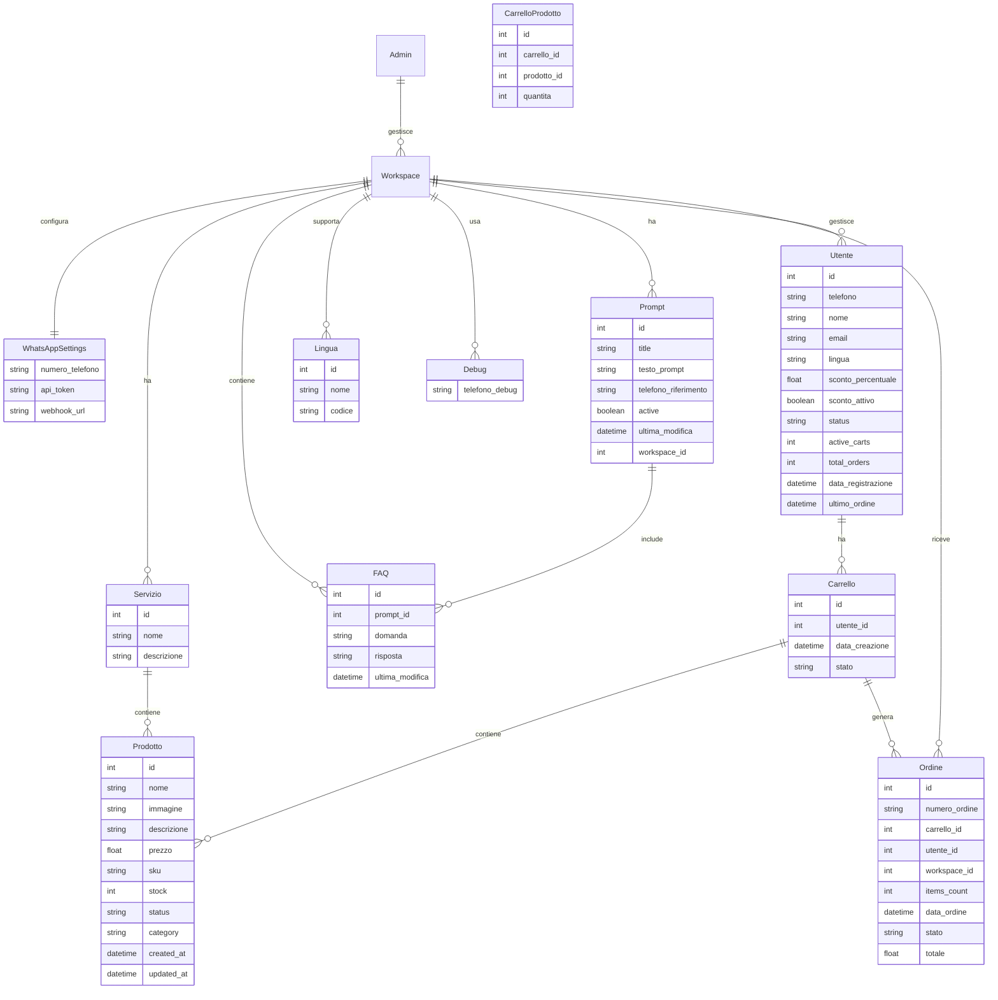

# Documento di Requisiti del Prodotto (PRD) – Chatbot WhatsApp MVP

## 1. Visione del Progetto

Il progetto prevede lo sviluppo di un Chatbot WhatsApp MVP, basato su WhatsApp Business API e Intelligenza Artificiale (AI) tramite OpenRouter con RAG, finalizzato ad automatizzare l'assistenza clienti e la gestione degli ordini. L'obiettivo è fornire risposte immediate e continue 24/7, riducendo il carico di lavoro degli operatori e migliorando l'esperienza dei clienti.

Inoltre, la piattaforma favorirà la fidelizzazione grazie alla possibilità di inviare push commerciali e promozionali. Il modello di business prevede un costo di 5 centesimi per ogni domanda dell'utente e di 20 centesimi per ogni messaggio push.

## 2. Narrativa

Immagina una piattaforma in cui l'utente amministratore accede tramite una dashboard web per:

- Creare e gestire uno o più workspace.
- Configurare il proprio canale WhatsApp inserendo il numero, il token API, il webhook e, in modalità debug, un numero di test.
- Inserire un prompt personalizzato, aggiungere prodotti (con foto, testo, prezzo) e servizi (per categorizzare i prodotti).
- Gestire le FAQ tramite un'interfaccia CRUD; le FAQ, salvate nel database, verranno automaticamente incluse nel prompt per arricchire le risposte AI.

L'utente finale interagisce esclusivamente tramite WhatsApp:

- Se è un nuovo utente, riceve un messaggio di benvenuto e una richiesta di dati minimi per la registrazione.
- Se è già registrato, viene accolto con un messaggio personalizzato e può richiedere informazioni, effettuare ordini e ricevere comunicazioni.

## 3. Obiettivi

### Obiettivi di Business:

- Ridurre significativamente il tempo di assistenza operatoria grazie all'automazione.
- Offrire supporto clienti continuo (24/7).
- Fidelizzare i clienti tramite campagne push future (es. auguri, promozioni).

### Non-Obiettivi (MVP):

- Non implementare un sistema di pagamento integrato (verrà usato un link esterno per i dati bancari).
- Non salvare uno storico dettagliato delle conversazioni.
- Non registrare i dati di usage degli utenti, pur mantenendo il modello di costi (5 centesimi per domanda e 20 centesimi per push).

## 4. Attività Tecniche

- **Frontend**: React con la libreria shadcn/ui (https://ui.shadcn.com/) per velocizzare lo sviluppo.
- **Backend**: Node.js con pattern Domain Driven Design (DDD).
- **Database**: PostgreSQL.
- **Workflow Automation**: n8n.
- **AI Service**: OpenRouter (RAG).
- **WhatsApp Integration**: API ufficiale di Meta.
- **Sicurezza**: HTTPS, token JWT, dati sensibili criptati nel DB.
- **Ambienti**: Sviluppo, test e produzione; ciascun workspace può attivare la modalità debug con numero di test.

## 5. Criteri di Accettazione

- Funzionalità CRUD operativa per workspace, prodotti, prompt, FAQ, servizi, lingue e utenti.
- Risposte del chatbot generate in pochi secondi.
- Comunicazione API protetta tramite token JWT.
- Dashboard intuitiva con autenticazione a 2FA.
- Integrazione fluida tra n8n e le API esposte.

## Funzionalità Chiave

1. **Gestione Utenti:**

   - Registrazione e Login: Autenticazione sicura e gestione dei profili.
   - Recupero Password: Funzionalità per il reset delle credenziali.

2. **Catalogo Prodotti:**

   - Visualizzazione Prodotti: Lista e dettaglio dei prodotti con immagini, descrizioni e prezzi.
   - Ricerca e Filtraggio: Strumenti per cercare prodotti per categoria, prezzo, popolarità, ecc.

3. **Gestione Carrello via WhatsApp:**

   - Interfaccia Conversazionale: Consente agli utenti di gestire il carrello tramite messaggi su WhatsApp.
   - Aggiunta/Rimozione Prodotti: Comandi per aggiungere o rimuovere prodotti dal carrello.
   - Visualizzazione Stato Carrello: Invio di riepiloghi e aggiornamenti del carrello tramite WhatsApp.

4. **Checkout e Pagamenti Online:**

   - Conferma Ordine: Dopo la gestione del carrello su WhatsApp, l'utente viene reindirizzato a una piattaforma web per confermare l'ordine.
   - Pagamenti Online: Procedura di pagamento sicura e integrata sulla piattaforma online.

5. **Integrazione con IA:**

   - Chatbot di Assistenza: Supporto virtuale per rispondere a domande e guidare l'utente durante il processo d'acquisto.

6. **Gestione Ordini e Tracking:**

   - Storico Ordini: Visualizzazione degli acquisti passati e stato degli ordini attuali.
   - Tracking Spedizioni: Aggiornamenti in tempo reale sullo stato della spedizione, inviati su WhatsApp o via email.

7. **Feedback e Recensioni:**

   - Sistema di Recensioni: Possibilità per gli utenti di lasciare feedback sui prodotti.
   - Valutazioni: Meccanismo di rating per valutare i prodotti.

8. **Usage Analytics:**

   - Monitoraggio dell'Uso: Raccolta e analisi dei dati sull'utilizzo della piattaforma per comprendere il comportamento degli utenti.
   - Report di Utilizzo: Generazione di report e statistiche per migliorare l'esperienza e ottimizzare le funzionalità.

9. **Dashboard Amministrativa:**
   - Gestione Contenuti: Strumenti per aggiungere, modificare o rimuovere prodotti e categorie.
   - Report e Analisi: Statistiche su vendite, traffico e performance del sistema.

## 6. Casi d'Uso

### Caso d'Uso Admin:

[Dashboard Admin] → [Gestione Workspace]

- [CRUD WhatsApp Settings]
- [CRUD Prodotti]
- [CRUD Servizi]
- [CRUD FAQ]
- [CRUD Prompt]
- [CRUD Utenti e Campagne]

### Caso d'Uso Utente WhatsApp (Registrato):

[Utente WhatsApp Registrato] → [Invia Messaggio]

- [n8n Workflow]
- [Recupero dati workspace, profilo, prodotti, servizi e FAQ]
- [Generazione risposta con OpenRouter (RAG)]
- [Invio risposta via API Meta WhatsApp]

### Caso d'Uso Nuovo Utente WhatsApp:

[Nuovo Utente WhatsApp] → [Invia Primo Messaggio]

- [n8n Workflow]
- [Identificazione utente: non registrato]
- [Invio messaggio di benvenuto e richiesta dati minimi]
- [Registrazione utente e creazione profilo]

### Caso d'Uso Push Offerte:

[Admin crea Campagna Push] → [Invio Automatico tramite API WhatsApp]

- [Utenti ricevono messaggio]
- [Opzione per disiscrizione]

## 7. API Esposte (per n8n)

Le API esposte sono progettate per supportare in modo essenziale i workflow di n8n:

### Prompt Management

- `GET /prompt/:telefono`

  - **Descrizione**: Recupera il prompt attivo per un numero di telefono specifico
  - **Parametri**:
    - `telefono` (obbligatorio): Numero di telefono WhatsApp
  - **Restituisce**:
    - Testo del prompt attivo
    - FAQ associate
    - Configurazioni linguistiche
    - Impostazioni di contesto

- `GET /prompts`

  - **Descrizione**: Recupera tutti i prompt del workspace
  - **Parametri**:
    - `workspace_id` (obbligatorio): Identificativo del workspace
  - **Restituisce**:
    - Lista dei prompt con stato attivo/inattivo

- `POST /prompt`

  - **Descrizione**: Crea un nuovo prompt
  - **Body**:
    - `testo_prompt`: Testo del prompt
    - `telefono_riferimento`: Numero di telefono associato
    - `workspace_id`: ID del workspace

- `PUT /prompt/:id`

  - **Descrizione**: Aggiorna un prompt esistente
  - **Parametri**:
    - `id` (obbligatorio): ID del prompt
  - **Body**:
    - `testo_prompt`: Nuovo testo del prompt
    - `active`: Stato attivo/inattivo

- `DELETE /prompt/:id`
  - **Descrizione**: Elimina un prompt
  - **Parametri**:
    - `id` (obbligatorio): ID del prompt

### Gestione Utenti

- `GET /utenti/:telefono`
  - Identificazione e recupero profilo utente tramite numero WhatsApp

### Gestione Prodotti e Servizi

- `GET /prodotti`
  - Elenco completo dei prodotti
- `GET /servizi`
  - Elenco dei servizi disponibili

### Gestione Ordini

- `POST /ordine`
  - Salvataggio dell'ordine effettuato tramite chatbot

### Gestione Carrello

- `GET /carrello/:utente_id`
  - Recupero del carrello dell'utente
- `POST /carrello`
  - Aggiunta di un prodotto al carrello
- `PUT /carrello`
  - Modifica di un prodotto nel carrello
- `DELETE /carrello`
  - Rimozione di un prodotto dal carrello

**Requisiti Trasversali**:

- Tutte le API sono protette da token JWT
- Comunicazione esclusivamente tramite HTTPS
- Logging e tracciamento delle richieste
- Gestione degli errori standardizzata

### Analytics API

- `GET /analytics/overview`

  - **Descrizione**: Recupera le statistiche generali
  - **Restituisce**:
    - Totale utenti attivi
    - Totale messaggi
    - Revenue
    - Percentuali di crescita

- `GET /analytics/recent-activity`
  - **Descrizione**: Recupera le attività recenti
  - **Restituisce**:
    - Nuove registrazioni
    - Prodotti aggiunti
    - Ordini ricevuti
    - Timestamp delle attività

### Dashboard API

- `GET /dashboard/stats`
  - **Descrizione**: Recupera le statistiche per la dashboard
  - **Parametri**:
    - `period` (opzionale): daily/weekly/monthly
  - **Restituisce**:
    - Active Users count
    - Total Messages count
    - Revenue
    - Growth percentages

### User Management API

- `GET /users`

  - **Descrizione**: Lista degli utenti con filtri
  - **Parametri**:
    - `status` (opzionale): Filtra per stato
    - `search` (opzionale): Ricerca per nome/telefono
  - **Restituisce**:
    - Lista utenti con dettagli carrelli e ordini

- `POST /users`
  - **Descrizione**: Crea nuovo utente
  - **Body**:
    - Dati utente (nome, telefono, email, etc.)

## 8. Modello di Dati

## 9. Gestione del Prompt

La gestione dei prompt avviene tramite un'interfaccia CRUD dedicata:

- Ogni workspace può avere più prompt, ciascuno associato a un numero di telefono specifico
- Ogni prompt include:
  - `testo_prompt`: Il testo base del prompt per il servizio AI
  - `telefono_riferimento`: Il numero di telefono WhatsApp associato al prompt
  - `active`: Flag che indica se il prompt è attualmente attivo
  - `ultima_modifica`: Data e ora dell'ultima modifica
  - `title`: Titolo del prompt
  - `workspace_id`: ID del workspace associato
