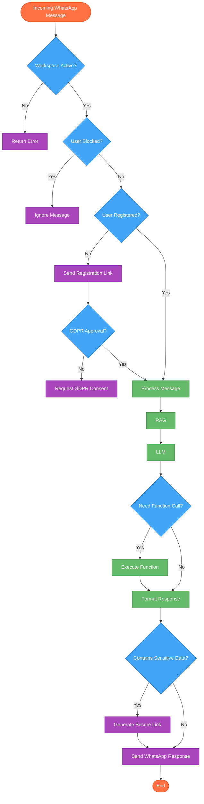
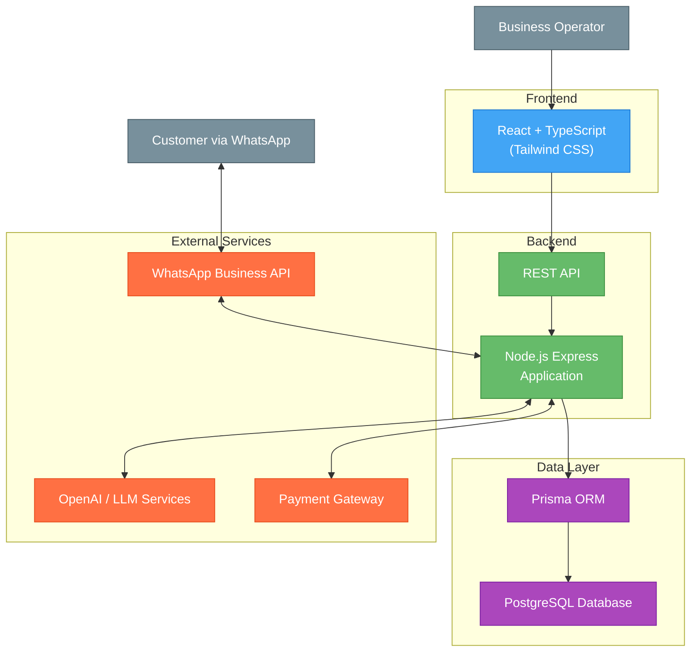

# ShopMe - WhatsApp E-commerce Platform PRD

## INTRODUCTION

### Short Description
ShopMe is a multilingual SaaS platform (Italian, English, Spanish) that turns WhatsApp into a complete sales channel. Customers can create smart chatbots, manage products, receive orders, and send invoices to their clients without any technical skills. Our AI technology automates customer-care responses, manages push notifications, and offers a 24/7 conversational shopping experience, all directly in the world's most popular messaging app.

All sensitive operations are handled securely through temporary links with security tokens. These links direct customers to our secure website for registration forms, payments, invoices, and accessing personal data. This keeps all sensitive information outside of chat conversations, ensuring data protection while maintaining a smooth customer experience.

### Message Processing Flow



## UI SCREENSHOTS

[SCREENSHOT 1: Dashboard Overview]
[SCREENSHOT 2: Product Management Interface]
[SCREENSHOT 3: Customer Interaction Panel]

## DIALOG EXAMPLES

### Registro de Nuevo Usuario

**Cliente**: "Hola, me gustaría comprar algunos productos."

**ShopMe**: "¡Hola! Estaré encantado de ayudarle con su compra. Para ofrecerle la mejor experiencia y poder procesar sus pedidos, necesitamos que se registre primero. 

He creado un enlace de registro seguro para usted: [https://shopme.com/registro/token_u7d9f3a1b5]

Este enlace es personal y caduca en 24 horas por motivos de seguridad."

**Cliente**: "¿Es seguro? ¿Qué pasa con mis datos?"

**ShopMe**: "Entiendo su preocupación por la privacidad. Su seguridad es nuestra prioridad:

1. El enlace utiliza un token único y temporal para proteger su proceso de registro
2. Todos sus datos se almacenan de forma segura en nuestros servidores encriptados
3. No compartimos sus datos personales con ningún modelo de IA externo
4. Cumplimos totalmente con la normativa GDPR de protección de datos

Una vez registrado, podrá realizar compras, seguir sus pedidos y recibir facturas electrónicas fácilmente."

**Cliente**: *[Completa el registro a través del enlace]*

**ShopMe**: "¡Gracias por registrarse! Su cuenta ha sido creada correctamente. 

Nos complace informarle que valoramos su privacidad y seguridad. Todos sus datos se guardan exclusivamente en nuestra base de datos segura y no se comparten con modelos de IA externos.

¿En qué puedo ayudarle hoy? Puedo mostrarle nuestros productos destacados, ayudarle a encontrar algo específico o responder cualquier pregunta sobre nuestros servicios."

### Descubrimiento y Compra de Productos

**Cliente**: "Hola, estoy buscando productos típicos sicilianos para regalar."

**ShopMe**: "¡Buenos días! Estaré encantado de ayudarle a encontrar productos típicos sicilianos para un regalo. Para sugerirle las mejores opciones, ¿podría saber:

1. ¿Tiene un presupuesto en mente?
2. ¿Prefiere productos dulces, salados o un surtido?
3. ¿La persona que recibirá el regalo tiene alergias o intolerancias alimentarias?"

**Cliente**: "Mi presupuesto es de unos 50€. Preferiría un surtido de dulces y salados. No hay alergias a considerar."

**ShopMe**: "Según sus preferencias, aquí tiene tres packs de regalo que podrían interesarle:

1. **Box Sicilia Clásica** (45€)
   - 1 botella de passito de Pantelleria (375ml)
   - 250g de pistachos de Bronte
   - 200g de pasta de almendras
   - 100g de caponata artesanal
   - Caja de regalo con lazo

2. **Degustación Siciliana** (55€)
   - 1 crema de pistacho para untar (200g)
   - 1 pesto de pistacho (180g)
   - 250g de cantucci de almendras
   - 200g de chocolate de Módica a la naranja
   - 1 mermelada de higos chumbos (240g)
   - Caja artesanal de madera

3. **Sabores de la Isla** (48€)
   - 500g de pasta extruida en bronce
   - 1 botella de aceite de oliva virgen extra (250ml)
   - 1 tarro de pesto trapanés (180g)
   - 100g de sal marina con hierbas sicilianas
   - 150g de crujiente de sésamo
   - Envoltorio de regalo con papel personalizado

¿Cuál de estas opciones le interesa más?"

**Cliente**: "La Degustación Siciliana parece excelente. ¿Cómo se puede utilizar la crema de pistacho?"

**ShopMe**: "La crema de pistacho es un producto versátil y delicioso. Puede utilizarse de varias formas:
- Untada en rebanadas de pan o croissants para un desayuno goloso
- Como relleno para tartas, galletas o pasteles
- Añadida al helado de vainilla para darle un toque de sabor
- Para preparar tiramisú o tarta de queso de pistacho
- Simplemente disfrutada a cucharadas como postre

Está elaborada con pistachos de Bronte DOP (40%), azúcar moreno y aceite de girasol. No contiene conservantes ni colorantes.

¿Desea proceder con la compra de la Degustación Siciliana o preferiría ver otras opciones?"

**Cliente**: "Me llevo la Degustación Siciliana. ¿Puede entregarse antes del próximo viernes?"

**ShopMe**: "¡Excelente elección! Sí, podemos garantizar la entrega antes del próximo viernes. El artículo está disponible en almacén y califica para envío exprés gratuito.

¿Quiere proceder con el pedido? Puedo crear el pedido y enviarle un enlace de pago seguro."

**Cliente**: "Sí, gracias."

**ShopMe**: "He creado su pedido para la Degustación Siciliana (55€). Aquí tiene el enlace de pago seguro: [Enlace de Pago]

Una vez completado el pago, recibirá:
1. Un email de confirmación del pedido con la información de seguimiento
2. Actualizaciones sobre la entrega vía WhatsApp
3. Su factura electrónica

La fecha estimada de entrega es el viernes 12 de mayo. ¿Puedo ayudarle con algo más?"

**Cliente**: "Eso es todo, ¡gracias!"

**ShopMe**: "¡Gracias por su compra! Apreciamos su confianza. Su pedido está siendo procesado y recibirá en breve la información de seguimiento. Si tiene preguntas sobre su pedido o productos, no dude en contactarnos aquí. ¡Le deseo un buen día!"

## MAIN FEATURES

### Dashboard Overview
- Real-time customer activity monitoring
- Sales performance metrics and trends
- Chatbot performance analytics
- Product catalog management
- Customer interaction history
- Order status tracking

### Push Notification System
- Automated order status updates
- Personalized promotions based on user behavior
- Re-engagement campaigns for abandoned carts
- Shipping and delivery notifications
- Custom notification templates

### Products Catalog Management
- Multi-category organization
- Rich media product cards
- Variant management (size, color, etc.)
- Inventory tracking
- Discount and promotion configuration
- Bulk import/export functionality

### Agent Configuration Tools
- AI behavior customization
- Response tone and style settings
- Product recommendation rules
- Conversation flow design
- Fallback response management
- Custom function configuration

## TECHNICAL ARCHITECTURE

### Architecture Diagram



### Frontend Architecture

The ShopMe frontend is built with a modern React architecture:

- **Core Technologies**:
  - React 18+ with functional components and hooks
  - TypeScript for type safety and improved developer experience
  - Tailwind CSS for utility-first styling approach
  - Next.js for server-side rendering and optimized performance

- **Key Frontend Components**:
  - Component library with atomic design principles
  - Responsive layouts for all device types
  - Custom hooks for business logic reuse
  - Context API for state management
  - React Query for data fetching and caching
  - Form handling with React Hook Form

- **User Interface Features**:
  - Dark/light mode support
  - Internationalization (i18n) for multiple languages
  - Accessibility compliance (WCAG 2.1 AA)
  - Progressive loading and skeleton screens
  - Custom animations and transitions
  - Interactive data visualizations

### Backend Architecture

The backend follows a Domain-Driven Design (DDD) architecture:

- **Core Technologies**:
  - Node.js with Express framework
  - TypeScript for type safety across the stack
  - Prisma ORM for database access
  - PostgreSQL for data persistence
  - Redis for caching and session management

- **Layer Separation**:
  - **Domain Layer**: Core business entities and rules
  - **Application Layer**: Use cases and application services
  - **Infrastructure Layer**: Technical implementations and external services
  - **Interfaces Layer**: API controllers and routes

- **Key Design Principles**:
  - Business domain at the center of design
  - Clear boundaries between layers
  - Repository pattern for data access
  - Dependency inversion principle

- **Backend Services**:
  - Authentication service with JWT
  - Media handling and storage service
  - Notification service
  - Analytics service
  - External integrations service (WhatsApp, payment providers)
  - Background job processing

### Database and Prisma ORM

- **Primary Database**: PostgreSQL
- **ORM**: Prisma for type-safe database access
- **Migrations**: Prisma Migration for version control
- **Backup Strategy**: Automated daily backups with point-in-time recovery

### AI and Function Call Documentation

The system implements several AI function calls to handle specific operations:

```
+-------------------------+--------------------------------------+----------------+
| FUNCTION NAME           | DESCRIPTION                          | STATUS         |
+-------------------------+--------------------------------------+----------------+
| get_product_info        | Get details about a specific product | Implemented    |
+-------------------------+--------------------------------------+----------------+
| get_event_by_date       | Get events scheduled for a date      | Implemented    |
+-------------------------+--------------------------------------+----------------+
| get_service_info        | Get details about a specific service | Implemented    |
+-------------------------+--------------------------------------+----------------+
| welcome_user            | Generate welcome message for users   | Implemented    |
+-------------------------+--------------------------------------+----------------+
| create_order            | Create a new order from cart items   | Implemented    |
+-------------------------+--------------------------------------+----------------+
| get_cart_info           | Get contents of a user's cart        | Implemented    |
+-------------------------+--------------------------------------+----------------+
| get_order_status        | Check status of specific order       | Implemented    |
+-------------------------+--------------------------------------+----------------+
| add_to_cart             | Add product to shopping cart         | Implemented    |
+-------------------------+--------------------------------------+----------------+
| remove_from_cart        | Remove product from shopping cart    | Implemented    |
+-------------------------+--------------------------------------+----------------+
| get_product_list        | Get list of available products       | Implemented    |
+-------------------------+--------------------------------------+----------------+
| get_products_by_category| Get products filtered by category    | Planned        |
+-------------------------+--------------------------------------+----------------+
| get_categories          | Get list of all product categories   | Planned        |
+-------------------------+--------------------------------------+----------------+
| get_faq_info            | Get information from FAQ database    | Implemented    |
+-------------------------+--------------------------------------+----------------+
| get_generic_response    | Handle general conversation/fallback | Implemented    |
+-------------------------+--------------------------------------+----------------+
```

### Authentication and Token Management

Our system uses JWT (JSON Web Token) authentication to keep user accounts secure:

- **Token Types**:
  - Access Token (1 hour validity, HTTP-only cookie)
  - Refresh Token (7 days validity, HTTP-only cookie)

- **Security Measures**:
  - Regular secret key rotation
  - HS256 algorithm for token signing
  - Minimal payload information
  - HTTP header validation
  - Rate limiting on auth endpoints

- **Role-Based Access Control**:
  - Admin: Full system access
  - Manager: Workspace management capabilities
  - Agent: Customer service operations
  - Workspace-scoped permissions

### API Rate Limiting Implementation

We protect all API endpoints with smart rate limiting:

- 30 requests per minute per user
- Customizable daily limits per workspace
- Different limits for different endpoint priorities
- Response headers with limit information
- Graceful handling of rate limit exceeded scenarios

### API Endpoints

Key API groups include:

- **Authentication**: Login, logout, token refresh
- **Products Management**: CRUD operations for products and variants
- **Categories Management**: Hierarchical category structure
- **Customer Management**: User profiles and preferences
- **Offers Management**: Promotions, discounts, and special deals
- **Agent Settings**: AI behavior configuration
- **Channel Settings**: WhatsApp integration configuration

### Project Folder Structure

Clean organization following DDD principles with clear separation of:
- Domain layer (core business entities)
- Application layer (use cases)
- Infrastructure layer (external implementations)
- Interface layer (API endpoints)

### AI Configuration Options

Customizable AI parameters:
- Model selection (GPT-3.5-turbo, GPT-4, Claude, etc.)
- Temperature (0.1-1.0)
- Response length limits
- Memory context size
- System prompts and instructions
- Response style and tone

### Security Implementation (OWASP)

The platform follows OWASP security guidelines:
- Input validation and sanitization
- Protection against XSS, CSRF, SQLi
- Secure authentication and authorization
- Data encryption in transit and at rest
- Regular security audits

### Testing Strategy

Comprehensive testing approach:
- Unit tests for domain logic
- Integration tests for services
- End-to-end tests for key flows
- Performance and load testing
- Security and penetration testing

## SUBSCRIPTION PLANS

### Subscription Plans & Pricing

#### 1. Basic Plan (€49/month)
- Single WhatsApp number connection
- Up to 1,000 AI-powered messages/month
- Maximum 5 products/services
- Standard response time (24h)
- Basic analytics dashboard
- Email support

#### 2. Professional Plan (€149/month)
- Up to 3 WhatsApp number connections
- Up to 5,000 AI-powered messages/month
- Maximum 100 products/services
- Priority response time (12h)
- Advanced analytics and reporting
- Phone and email support
- Custom AI training

#### 3. Enterprise Plan (Custom pricing)
- Unlimited WhatsApp number connections
- Custom AI message volume
- Unlimited products/services
- Dedicated response team (4h SLA)
- Full API access
- White-label options
- Dedicated account manager
- Custom integrations
- On-premises deployment option

## DEVELOPMENT ROADMAP

### Phase 1: Core Data Management (Months 1-2)
- Complete CRUD functionality for all core entities
- Multi-tenant workspace architecture
- User role management and permissions
- Basic admin interface

### Phase 2: Communication Platform (Months 3-4)
- WhatsApp API integration
- Chat flow builder
- Administrative dashboard
- Customer survey tools
- Conversation templates
- Basic RAG implementation

### Phase 3: Monetization & Notifications (Months 5-6)
- Payment gateway integration
- Invoice generation system
- Push notification infrastructure
- Beta testing program
- Performance optimization
- Security hardening

### Phase 4: Marketing & MMP Enhancements (Months 7-8)
- Marketing automation tools
- Enhanced analytics
- Customer segmentation
- Campaign management tools
- Enhanced AI capabilities
- Vertical market adaptations

### Phase 5: Full Deployment & Quality Assurance (Months 9-10)
- Comprehensive testing
- Performance benchmarking
- Security audits
- Documentation completion
- Support system implementation
- Full public launch

## OUT OF SCOPE FEATURES (MVP)

The following features are outside the scope of the initial MVP release:

### Orders Management
- Order processing and tracking
- Order status management
- Invoice generation and management
- Shipping integration and tracking
- Returns and refund processing

### Analytics
- Real-time analytics dashboard
- Custom report generation
- Data visualization tools
- Export capabilities
- Performance metrics and KPIs

### Advanced Push Notifications
- A/B testing for notification content
- Advanced segmentation based on behavior
- Rich media notifications
- Location-based targeting
- Frequency optimization

### Payment Integration
- Integrated payment processing
- Payment plan implementation
- Subscription management
- Payment gateway integration
- Fraud prevention tools

## MINIMUM MARKETABLE PRODUCT (MMP)

Features planned for the MMP phase, after the initial MVP release:

### Enhanced Orders Management
- Complete order lifecycle management
- Order fulfillment workflows
- Custom order statuses
- Automated order notifications
- Bulk order processing capabilities

### Advanced Analytics Dashboard
- Customer behavior analysis
- Conversion funnel visualization
- Revenue and sales performance tracking
- Chat quality and sentiment analysis
- Custom report builder with export options

### Full Payment Integration
- Multiple payment gateway integrations
- Saved payment methods for customers
- Subscription and recurring payment handling
- Advanced fraud detection and prevention
- Automated refund processing

### Multi-Agent Collaboration
- Team inbox with shared conversation access
- Agent routing and assignment rules
- Supervisor monitoring and intervention tools
- Agent performance metrics and reporting
- Shift management and availability tracking

### Enhanced AI Capabilities
- Advanced sentiment analysis and emotional intelligence
- Proactive customer outreach based on behavior
- Personalized product recommendations based on preferences
- Automated follow-up sequences for abandoned carts
- A/B testing of different AI prompts and approaches 