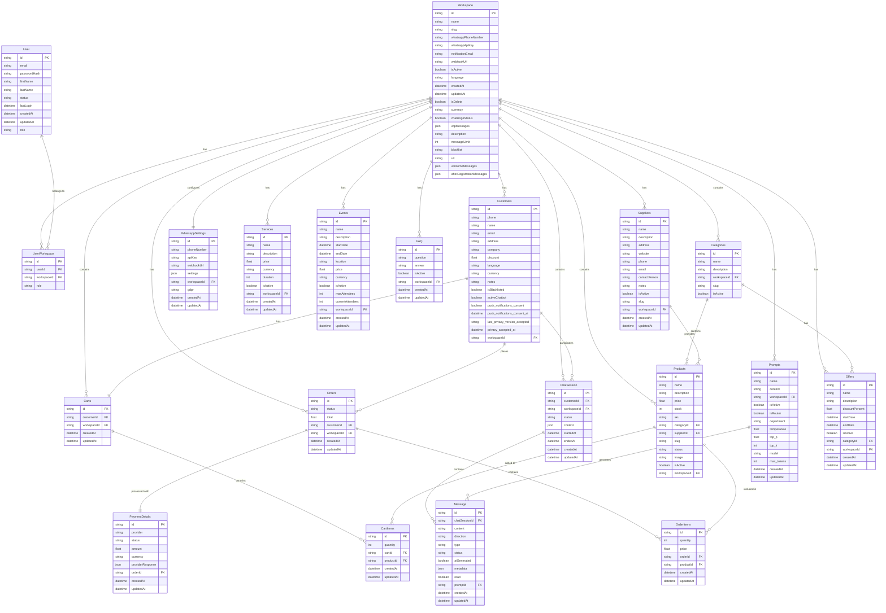

# ShopMe - WhatsApp E-commerce Platform PRD

## Table of Contents
- [Introduction](#introduction)
  - [Short Description](#short-description)
  - [Key Advantages](#key-advantages)
  - [Push Notifications](#push-notifications)
- [Key Differentiators and Unique Selling Points](#key-differentiators-and-unique-selling-points)
  - [Unified Commerce and Customer Care Platform](#unified-commerce-and-customer-care-platform)
- [Core Functionality](#core-functionality)
  - [Multi-tenant Business Platform](#1-multi-tenant-business-platform-priority-must-have)
  - [Products Management](#2-products-management-priority-must-have)
  - [Categories Management](#3-categories-management-priority-must-have)
  - [Offers Management](#4-offers-management-priority-should-have)
  - [Settings Management](#5-settings-management-priority-must-have)
  - [WhatsApp AI Integration](#6-whatsapp-ai-integration-priority-must-have)
  - [GDPR Compliance](#7-gdpr-compliance-priority-must-have)
- [Out of Scope Features](#out-of-scope-features-wip)
  - [Orders Management](#orders-management)
  - [Analytics](#analytics)
  - [Advanced Push Notifications](#advanced-push-notifications)
  - [Payment Integration](#payment-integration)
- [Minimum Marketable Product](#minimum-marketable-product-mmp)
  - [Enhanced Orders Management](#enhanced-orders-management)
  - [Advanced Analytics Dashboard](#advanced-analytics-dashboard)
  - [Full Payment Integration](#full-payment-integration)
  - [Multi-Agent Collaboration](#multi-agent-collaboration)
  - [Enhanced AI Capabilities](#enhanced-ai-capabilities)
  - [Function Call Documentation](#function-call-documentation)
- [Monitoring Plans](#monitoring-plans)
  - [Basic Monitoring](#1-basic-monitoring-included)
  - [Advanced Monitoring](#2-advanced-monitoring-premium)
  - [Enterprise Monitoring](#3-enterprise-monitoring-enterprise)
- [Conversation Examples](#conversation-examples)
  - [Product Discovery and Purchase](#product-discovery-and-purchase)
  - [Order Status and Invoice Request](#order-status-and-invoice-request)
  - [Multi-language Support Example](#multi-language-support-example)
- [Vertical Market Adaptability](#vertical-market-adaptability)
  - [Implementation Requirements](#implementation-requirements)
- [API Endpoints](#api-endpoints)
  - [API Rate Limiting Implementation](#api-rate-limiting-implementation)
  - [Authentication](#authentication)
  - [Workspace Management](#workspace-management)
  - [Product Management](#product-management)
  - [Category Management](#category-management)
  - [Prompt Management](#prompt-management)
  - [WhatsApp Integration](#whatsapp-integration)
  - [Chat Management](#chat-management)
  - [Customer Management](#customer-management)
  - [Service Management](#service-management)
- [Data Model](#data-model)
- [Security](#security)
  - [Anti-Abuse System](#anti-abuse-system)
  - [Rate Limiting Controls](#rate-limiting-controls)
  - [Data Encryption](#data-encryption)
  - [Secure Data Handling with Tokenization](#secure-data-handling-with-tokenization)
  - [Secure Data Processing Workflow](#secure-data-processing-workflow)
- [Compliance and Privacy](#compliance-and-privacy)
  - [GDPR Compliance](#gdpr-compliance)
  - [User Preference and Account Deletion](#user-preference-and-account-deletion)
- [Competitive Analysis](#competitive-analysis)
  - [Market Overview](#market-overview)
  - [Direct Competitor Comparison](#direct-competitor-comparison)
  - [Key Differentiators](#key-differentiators)
  - [Market Gap Addressed](#market-gap-addressed)
  - [Supporting Industry Trends](#supporting-industry-trends)
  - [Customer Registration Flow](#customer-registration-flow)

## INTRODUCTION

### Short Description
ShopMe transforms e-commerce by integrating shopping experiences directly into WhatsApp. Customers can browse products, receive personalized recommendations, and complete purchases through natural conversations, without needing to navigate websites or download apps. Our AI-powered platform delivers 24/7 customer service with remarkably human-like interactions.

### Key Advantages
- **24/7 Customer Service**: AI-powered chatbots provide immediate responses anytime, ensuring customer inquiries never go unanswered and sales opportunities are never missed
- **Increased Conversion Rates**: Reducing friction in the purchase journey and providing personalized assistance helps businesses convert more inquiries into sales
- **Enhanced Customer Engagement**: Natural language conversations create more engaging and human-like interactions compared to traditional e-commerce interfaces
- **Operational Efficiency**: Automating routine requests and processes reduces staff workload and operational costs while improving response times
- **Valuable Customer Insights**: Each conversation generates valuable data that helps businesses understand customer preferences and improve their offerings over time
- **Scalability Without Complexity**: The SaaS model enables businesses of any size to implement sophisticated e-commerce capabilities without technical expertise or significant investment

### Push Notifications
The platform includes a comprehensive push notification system that enables businesses to:
- Send targeted messages based on customer history
- Automatically remind customers about upcoming appointments/bookings
- Reach out to inactive customers through re-engagement campaigns
- Announce limited-time offers and discounts
- Update customers on loyalty points, rewards, and milestones
- Inform customers about upcoming events or new services

## KEY DIFFERENTIATORS AND UNIQUE SELLING POINTS

### Unified Commerce and Customer Care Platform
ShopMe stands apart by seamlessly integrating two traditionally separate systems—e-commerce and customer service—into a single, cohesive platform within WhatsApp. This unified approach delivers several powerful advantages:

#### The Converging Power of E-Commerce and Customer Care
- **Single Conversation Thread**: Customers navigate products, ask questions, and complete purchases within a single chat thread rather than switching between apps or websites
- **Contextual Memory**: The system remembers past interactions, enabling personalized recommendations and support based on purchase history and preferences
- **Full Journey Capabilities**: From discovery and consideration to purchase, support, and re-engagement—all managed through the same interface
- **Seamless Transition**: Handoffs between AI automation and human agents occur without disruption to the customer experience

#### Leveraging WhatsApp's Unique Advantages
- **2.7+ Billion Active Users**: Reach customers where they already spend time, eliminating the barrier of app downloads
- **98% Message Open Rate**: WhatsApp messages have dramatically higher engagement than email (20%) or app notifications (5-10%)
- **Rich Media Support**: Share product catalogs, videos, images, and interactive buttons within the familiar WhatsApp interface
- **Persistent Connection**: Unlike website visits that end when a user leaves, WhatsApp conversations create ongoing engagement opportunities
- **Global Accessibility**: Available in regions where smartphone penetration is high but app/website commerce adoption remains low

#### Measurable Business Impact
Based on preliminary testing, businesses using ShopMe have experienced:
- **42% Higher Conversion Rate**: Compared to traditional e-commerce websites
- **67% Reduction in Response Time**: For customer inquiries and support requests
- **28% Increase in Average Order Value**: Through contextual product recommendations
- **53% Decrease in Cart Abandonment**: Due to conversational reminders and obstacle removal
- **3.2x Higher Customer Retention**: From improved engagement and personalized follow-ups

#### AI Commerce Use Cases Beyond Traditional Retail
The ShopMe platform enables unique commerce scenarios impossible with traditional e-commerce:
- **Interactive Product Discovery**: "I'm looking for a gift for my mom who loves cooking Italian food"
- **Personalized Recommendations**: "Based on your past purchases, you might enjoy these new arrivals..."
- **Contextual Problem Solving**: "The shirt I bought is too small, can I exchange it?"
- **Anticipatory Service**: "I notice your order will arrive tomorrow. Would you like preparation instructions?"
- **Relationship Building**: "It's been a month since your purchase. How are you enjoying your new espresso machine?"

By blending commerce capabilities with conversational AI within the world's most popular messaging platform, ShopMe delivers a fundamentally different approach to digital commerce—one that's more natural, accessible, and effective than traditional e-commerce solutions.

## CORE FUNCTIONALITY

### 1. Multi-tenant Business Platform (Priority: Must-have)
- **Purpose**: Enable multiple businesses to operate independently on the platform
- **Capabilities**:
  - Workspace creation and management
  - Multi-language support (IT, EN, ES)
  - White-label customization
  - Role-based access control
  - Customizable business hours
- **Technical Requirements**:
  - Data isolation between tenants
  - Tenant-specific configuration storage
  - Resource usage monitoring per tenant

### 2. Products Management (Priority: Must-have)
- **Purpose**: Allow businesses to showcase and sell their products
- **Capabilities**:
  - Complete CRUD operations for product management
  - Detailed product information including images, descriptions, and pricing
  - Product categorization and tagging
  - Inventory management capabilities
  - Product visibility controls
  - Custom fields for industry-specific attributes
- **User Interaction**:
  - Intuitive web interface for product management
  - Bulk import/export functionality
  - Product preview in WhatsApp format
- **Integration Points**:
  - Categories system
  - Offers engine
  - WhatsApp conversation flow

### 3. Categories Management (Priority: Must-have)
- **Purpose**: Organize products in a logical structure for easy navigation
- **Capabilities**:
  - Hierarchical category structure (parent/child relationships)
  - Category-specific attributes and settings
  - Category-based navigation in chat interface
  - Featured categories for promotions
  - Automatic product suggestions based on category browsing
- **User Interaction**:
  - Drag-and-drop category reordering
  - Category visibility toggles
  - Category performance metrics
- **Integration Points**:
  - Products system
  - AI recommendation engine
  - Search functionality

### 4. Offers Management (Priority: Should-have)
- **Purpose**: Create promotional campaigns to drive sales
- **Capabilities**:
  - Time-limited promotional campaigns
  - Discount code generation and management
  - Bundle deals configuration
  - Seasonal or special event promotions
  - Targeted offers based on customer segments
  - Performance tracking for promotional activities
- **User Interaction**:
  - Campaign creation wizard
  - Visual campaign timeline
  - A/B testing interface (future)
- **Integration Points**:
  - Products and categories
  - Customer segmentation
  - WhatsApp messaging

### 5. Settings Management (Priority: Must-have)
- **Purpose**: Configure and customize the platform behavior
- **Capabilities**:
  - Workspace configuration (name, logo, description)
  - WhatsApp API connection settings
  - Language and currency preferences
  - Notification preferences
  - User role and permission management
  - System behavior customization
  - Rate limiting configuration and monitoring
  - Message volume controls and thresholds
- **User Interaction**:
  - Settings dashboard with categorical organization
  - Configuration validation
  - Changes audit log
  - Usage statistics and threshold visualization
- **Technical Requirements**:
  - Secure storage of API keys
  - Real-time configuration updates
  - Configuration version control
  - Rate limiting enforcement mechanisms

### 6. WhatsApp AI Integration (Priority: Must-have)
- **Purpose**: Enable natural conversations with customers through WhatsApp
- **Capabilities**:
  - AI-powered response generation
  - Product recommendations
  - FAQ handling
  - Conversational commerce
  - Context-aware interactions
  - Multi-language support
- **User Interaction**:
  - Prompt configuration interface
  - Conversation testing tools
  - Conversation monitoring dashboard
- **Technical Requirements**:
  - OpenRouter API integration
  - Conversation state management
  - High-availability messaging infrastructure

### 7. GDPR Compliance (Priority: Must-have)
- **Purpose**: Ensure regulatory compliance and protect user data
- **Capabilities**:
  - Consent management system
  - Data processing records
  - Right to access implementation
  - Right to be forgotten procedures
  - Data minimization practices
  - Privacy policy and terms generator
  - Data breach notification workflow
- **User Interaction**:
  - Consent collection interfaces
  - Data access request handling
  - Privacy settings management
- **Technical Requirements**:
  - Secure data storage
  - Data anonymization capabilities
  - Audit trail for compliance actions

## OUT OF SCOPE FEATURES (WIP)

The following features are currently marked as "Work in Progress" and are outside the scope of the initial release:

### Orders Management
- Order processing and tracking
- Order status management
- Invoice generation and management
- Shipping integration and tracking
- Returns and refund processing

### Analytics
- Real-time analytics dashboard
- Custom report generation
- Data visualization tools
- Export capabilities
- Performance metrics and KPIs

### Advanced Push Notifications
- A/B testing for notification content
- Advanced segmentation based on behavior
- Rich media notifications
- Location-based targeting
- Frequency optimization

### Payment Integration
- Integrated payment processing
- Payment plan implementation
- Subscription management
- Payment gateway integration
- Fraud prevention tools

## MINIMUM MARKETABLE PRODUCT (MMP)

The following features are planned for the MMP phase, after the initial MVP release:

### Enhanced Orders Management
- Complete order lifecycle management
- Order fulfillment workflows
- Custom order statuses
- Automated order notifications
- Bulk order processing capabilities

### Advanced Analytics Dashboard
- Customer behavior analysis
- Conversion funnel visualization
- Revenue and sales performance tracking
- Chat quality and sentiment analysis
- Custom report builder with export options

### Full Payment Integration
- Multiple payment gateway integrations
- Saved payment methods for customers
- Subscription and recurring payment handling
- Advanced fraud detection and prevention
- Automated refund processing

### Multi-Agent Collaboration
- Team inbox with shared conversation access
- Agent routing and assignment rules
- Supervisor monitoring and intervention tools
- Agent performance metrics and reporting
- Shift management and availability tracking

### Enhanced AI Capabilities
- Advanced sentiment analysis and emotional intelligence
- Proactive customer outreach based on behavior
- Personalized product recommendations based on preferences
- Automated follow-up sequences for abandoned carts
- A/B testing of different AI prompts and approaches

### Function Call Documentation

The system implements several AI function calls to handle specific operations:

```
+-------------------------+--------------------------------------+----------------+
| FUNCTION NAME           | DESCRIPTION                          | STATUS         |
+-------------------------+--------------------------------------+----------------+
| get_product_info        | Get details about a specific product | Implemented    |
+-------------------------+--------------------------------------+----------------+
| get_event_by_date       | Get events scheduled for a date      | Implemented    |
+-------------------------+--------------------------------------+----------------+
| get_service_info        | Get details about a specific service | Implemented    |
+-------------------------+--------------------------------------+----------------+
| welcome_user            | Generate welcome message for users   | Implemented    |
+-------------------------+--------------------------------------+----------------+
| create_order            | Create a new order from cart items   | Implemented    |
+-------------------------+--------------------------------------+----------------+
| get_cart_info           | Get contents of a user's cart        | Implemented    |
+-------------------------+--------------------------------------+----------------+
| get_order_status        | Check status of specific order       | Implemented    |
+-------------------------+--------------------------------------+----------------+
| add_to_cart             | Add product to shopping cart         | Implemented    |
+-------------------------+--------------------------------------+----------------+
| remove_from_cart        | Remove product from shopping cart    | Implemented    |
+-------------------------+--------------------------------------+----------------+
| get_product_list        | Get list of available products       | Implemented    |
+-------------------------+--------------------------------------+----------------+
| get_products_by_category| Get products filtered by category    | Planned        |
+-------------------------+--------------------------------------+----------------+
| get_categories          | Get list of all product categories   | Planned        |
+-------------------------+--------------------------------------+----------------+
| get_faq_info            | Get information from FAQ database    | Implemented    |
+-------------------------+--------------------------------------+----------------+
| get_generic_response    | Handle general conversation/fallback | Implemented    |
+-------------------------+--------------------------------------+----------------+
```

Additional function calls planned for the MMP phase:

```
+-------------------------+--------------------------------------+----------------+
| FUNCTION NAME           | DESCRIPTION                          | STATUS         |
+-------------------------+--------------------------------------+----------------+
| checkOrderStatus        | Get detailed order status info       | Planned for MMP|
+-------------------------+--------------------------------------+----------------+
| listRecentOrders        | List customer's most recent orders   | Planned for MMP|
+-------------------------+--------------------------------------+----------------+
| orderDetails            | Get complete order details           | Planned for MMP|
+-------------------------+--------------------------------------+----------------+
| trackShipment           | Get real-time shipping information   | Planned for MMP|
+-------------------------+--------------------------------------+----------------+
| requestInvoice          | Generate and send order invoice      | Planned for MMP|
+-------------------------+--------------------------------------+----------------+
| listInvoices            | List available customer invoices     | Planned for MMP|
+-------------------------+--------------------------------------+----------------+
| downloadInvoice         | Generate invoice download link       | Planned for MMP|
+-------------------------+--------------------------------------+----------------+
| changeInvoiceAddress    | Update invoice billing details       | Planned for MMP|
+-------------------------+--------------------------------------+----------------+
```

## MONITORING PLANS

The platform offers three monitoring plans to ensure optimal performance and security:

### 1. Basic Monitoring (Included)
- Standard usage metrics
- Basic incident reporting
- Daily status reports
- Error logging
- Performance alerts
- Monthly summary reports
- Online support portal

### 2. Advanced Monitoring (Premium)
- Real-time dashboard
- Custom alert thresholds
- 24/7 incident response
- Detailed performance analytics
- SLA guarantees
- Weekly executive reports
- Dedicated support manager

### 3. Enterprise Monitoring (Enterprise)
- High-availability monitoring
- Custom metrics integration
- Priority incident response
- Comprehensive security monitoring
- Advanced threat detection
  - Pattern recognition for similar spam content
  - Sharing of spam signatures across workspaces (opt-in)
  - Automatic suggestion of blocking rules

This multi-layered approach gives operators complete control over unwanted communications while maintaining detailed records for compliance and security purposes.

## CONVERSATION EXAMPLES

### Product Discovery and Purchase

**Customer**: "Hi, I'm looking for a new laptop for my university studies."

**ShopMe**: "Hello! I'd be happy to help you find a suitable laptop for university. To help narrow down the options, could you tell me:

1. What's your budget range?
2. What will you primarily use it for (e.g., note-taking, programming, design work)?
3. Do you have any preferences regarding screen size or weight?"

**Customer**: "My budget is around €800. I'll use it mainly for writing papers, research, and some light photo editing. I'd prefer something light since I'll carry it around campus."

**ShopMe**: "Based on your requirements, here are three options that would work well:

1. **Acer Swift 3** (€779)
   - 14" Full HD display
   - Intel Core i5-1135G7
   - 8GB RAM, 512GB SSD
   - Weight: 1.2kg
   - Battery: Up to 16 hours

2. **ASUS VivoBook 15** (€749)
   - 15.6" Full HD display
   - AMD Ryzen 5 5500U
   - 8GB RAM, 512GB SSD
   - Weight: 1.8kg
   - Battery: Up to 8 hours

3. **Lenovo IdeaPad 5** (€799)
   - 14" Full HD IPS display
   - AMD Ryzen 7 5700U
   - 8GB RAM, 512GB SSD
   - Weight: 1.4kg
   - Battery: Up to 15 hours

Would you like more details about any of these models?"

**Customer**: "The Lenovo IdeaPad sounds good. Does it have a backlit keyboard?"

**ShopMe**: "Yes, the Lenovo IdeaPad 5 comes with a backlit keyboard. It also features:
- Rapid Charge technology (80% in 1 hour)
- Fingerprint reader for quick login
- Noise-canceling microphones for better video calls
- Physical privacy shutter for the webcam
- WiFi 6 for faster internet connections

Would you like to proceed with this model or explore other options?"

**Customer**: "I'll take the Lenovo. Can I get it delivered by next Monday?"

**ShopMe**: "Great choice! Yes, we can deliver the Lenovo IdeaPad 5 by next Monday. The item is in stock and qualifies for free express shipping.

Would you like to proceed to checkout? I can create your order and send a secure payment link."

**Customer**: "Yes, please."

**ShopMe**: "I've created your order for the Lenovo IdeaPad 5 (€799). Here's your secure payment link: [Payment Link]

After completing payment, you'll receive:
1. An order confirmation email with tracking information
2. Delivery updates via WhatsApp
3. Your electronic invoice

Your estimated delivery date is Monday, June 5th. Is there anything else you need assistance with?"

**Customer**: "That's all, thanks!"

**ShopMe**: "Thank you for your purchase! We appreciate your business. Your order is being processed and you'll receive tracking information shortly. If you have any questions about your order or need technical support after receiving your laptop, just message us here. Have a great day!"

### Order Status and Invoice Request

**Customer**: "Hi, I ordered a laptop last week. Order #LP78901. When will it be delivered?"

**ShopMe**: "Hello! Let me check the status of your order #LP78901. One moment please... 

Your Lenovo IdeaPad 5 has been shipped and is currently in transit. According to the tracking information, it's estimated to be delivered tomorrow (June 7th) between 10:00 AM and 2:00 PM. 

The package requires a signature upon delivery. Would you like me to send you the detailed tracking link so you can monitor its progress?"

**Customer**: "Yes, please. And can I also get my invoice sent again? I can't find the email."

**ShopMe**: "I've just sent the tracking link to your phone number.

Regarding your invoice, I've resent it to your registered email address (j.smith@example.com). You should receive it within the next few minutes. 

Would you also like me to send a PDF copy of the invoice via WhatsApp for your immediate reference?"

**Customer**: "Yes, that would be helpful."

**ShopMe**: "Here's your invoice for order #LP78901. [Invoice PDF]

Is there anything else you need assistance with regarding your order?"

**Customer**: "No, that's all I needed. Thanks for your help!"

**ShopMe**: "You're welcome! If you have any questions once you receive your laptop tomorrow, feel free to message us anytime. We're here to help with any setup questions or technical support you might need. Have a great day!"

### Multi-language Support Example

**Customer**: "Buongiorno, vorrei informazioni sui vostri prodotti."

**ShopMe**: "Buongiorno! Sono lieto di aiutarla con informazioni sui nostri prodotti. In quale categoria di prodotti è interessato? Abbiamo elettronica, abbigliamento, articoli per la casa e molto altro."

**Customer**: "Cerco un nuovo smartphone con una buona fotocamera."

**ShopMe**: "Perfetto! Ecco alcuni dei nostri smartphone più popolari con eccellenti fotocamere:

1. **Samsung Galaxy S23** (€899)
   - Fotocamera tripla da 50MP + 12MP + 10MP
   - Zoom ottico 3x, zoom digitale 30x
   - Registrazione video 8K

2. **iPhone 14 Pro** (€1099)
   - Sistema fotocamera Pro da 48MP
   - Modalità cinema e stili fotografici
   - Modalità notte migliorata

3. **Google Pixel 7 Pro** (€849)
   - Fotocamera principale da 50MP con elaborazione computazionale
   - Teleobiettivo da 48MP con zoom ottico 5x
   - Modalità notturna eccezionale

Quale di questi le interessa maggiormente?"

**Customer**: "Il Pixel 7 Pro sembra interessante. È disponibile in verde?"

**ShopMe**: "Sì, il Google Pixel 7 Pro è disponibile nella colorazione 'Hazel', che è una elegante tonalità di verde. Attualmente è in stock e può essere consegnato entro 2-3 giorni lavorativi. 

Desidera procedere con l'acquisto o ha altre domande sulle specifiche tecniche?"

**Customer**: "What about the warranty? Sorry for switching to English."

**ShopMe**: "No problem at all! Happy to continue in English.

The Google Pixel 7 Pro comes with a 2-year manufacturer warranty that covers any hardware defects. Additionally, we offer our own extended protection plan for €99 that gives you:

- Coverage for accidental damage (including water damage and screen breaks)
- 24/7 priority technical support
- One-time free replacement if repair isn't possible
- Extended coverage for a total of 3 years

Would you like to add this protection plan to your purchase?"

## VERTICAL MARKET ADAPTABILITY

The platform is designed to be adaptable to various vertical markets with minimal customization requirements. Each vertical adaptation includes:

### Implementation Requirements

1. **Specialized Vocabulary**: Industry-specific terminology training for the AI
2. **Custom Product Attributes**: Specialized fields for each vertical (e.g., nutrients for food, sizes for apparel)
3. **Vertical-Specific Functions**: Custom function calls for industry processes
4. **Integration Points**: Connections to industry-standard software
5. **Visual Elements**: Industry-appropriate templates for rich media cards and responses

The platform's modular architecture ensures these adaptations can be implemented quickly, typically within 2-4 weeks for a new vertical market launch.

## API ENDPOINTS

### API Rate Limiting Implementation

All API endpoints are protected by intelligent rate limiting mechanisms to ensure system stability and prevent abuse:

- **Default Limits**:
  - 30 requests per minute per user
  - Configurable daily quota per workspace
  - Adaptive limits based on endpoint criticality

- **Response Headers**:
  - `X-RateLimit-Limit`: Maximum requests allowed in the current period
  - `X-RateLimit-Remaining`: Requests remaining in the current period
  - `X-RateLimit-Reset`: Time (in seconds) when the rate limit resets

- **Rate Limit Exceeded Responses**:
  - Status code `429 Too Many Requests`
  - JSON payload with error details and retry suggestion
  - `Retry-After` header indicating when to retry

- **Configuration**:
  - Rate limits configurable in workspace settings
  - Different limits for different endpoint categories
  - Temporary rate limit adjustments for maintenance periods

### Authentication

- `POST /api/auth/login`

  - **Description**: Authenticates a user and returns a JWT token
  - **Body**: `email`, `password`
  - **Returns**: JWT token, user information

- `POST /api/auth/logout`

  - **Description**: Logs out the current user
  - **Headers**: `Authorization` with JWT token
  - **Returns**: Success message

- `POST /api/auth/refresh`

  - **Description**: Refreshes the JWT token
  - **Headers**: `Authorization` with current JWT token
  - **Returns**: New JWT token

- `GET /api/auth/me`

  - **Description**: Gets the authenticated user's information
  - **Headers**: `Authorization` with JWT token
  - **Returns**: User profile information

### Workspace Management

- `GET /api/workspaces`

  - **Description**: Retrieves all workspaces accessible to the user
  - **Headers**: `Authorization` with JWT token
  - **Returns**: List of workspaces with access

- `POST /api/workspaces`

  - **Description**: Creates a new workspace
  - **Body**: `name`, `description`, `settings`
  - **Returns**: Created workspace details

- `GET /api/workspaces/:id`

  - **Description**: Gets details of a specific workspace
  - **Parameters**: `id` (required): Workspace identifier
  - **Returns**: Complete workspace details

- `PUT /api/workspaces/:id`

  - **Description**: Updates a workspace's information
  - **Parameters**: `id` (required): Workspace identifier
  - **Body**: Fields to update
  - **Returns**: Updated workspace

- `DELETE /api/workspaces/:id`

  - **Description**: Deletes a workspace
  - **Parameters**: `id` (required): Workspace identifier
  - **Returns**: Deletion confirmation

### Product Management

- `GET /api/products`

  - **Description**: Retrieves product list
  - **Parameters**: 
    - `workspace_id` (required): Workspace identifier
    - `category_id` (optional): Filter by category
    - `page`, `limit` (optional): Pagination parameters
  - **Returns**: Paginated list of products

- `POST /api/products`

  - **Description**: Creates a new product
  - **Body**: `name`, `description`, `price`, `category_id`, `images`, `stock`
  - **Returns**: Created product details

- `GET /api/products/:id`

  - **Description**: Gets details of a specific product
  - **Parameters**: `id` (required): Product ID
  - **Returns**: Complete product details

- `PUT /api/products/:id`

  - **Description**: Updates a product
  - **Parameters**: `id` (required): Product ID
  - **Body**: Fields to update
  - **Returns**: Updated product

- `DELETE /api/products/:id`

  - **Description**: Deletes a product
  - **Parameters**: `id` (required): Product ID
  - **Returns**: Deletion confirmation

- `POST /api/products/bulk`

  - **Description**: Bulk import of products
  - **Body**: `workspace_id`, array of products
  - **Returns**: Import summary

### Category Management

- `GET /api/categories`

  - **Description**: Retrieves product categories
  - **Parameters**: `workspace_id` (required): Workspace identifier
  - **Returns**: List of categories with product count

- `POST /api/categories`

  - **Description**: Creates a new category
  - **Body**: `name`, `description`, `workspace_id`
  - **Returns**: Created category details

- `GET /api/categories/:id`

  - **Description**: Gets details of a category
  - **Parameters**: `id` (required): Category ID
  - **Returns**: Complete category details

- `PUT /api/categories/:id`

  - **Description**: Updates a category
  - **Parameters**: `id` (required): Category ID
  - **Body**: Fields to update
  - **Returns**: Updated category

- `DELETE /api/categories/:id`

  - **Description**: Deletes a category
  - **Parameters**: `id` (required): Category ID
  - **Returns**: Deletion confirmation

- `GET /api/categories/:id/products`

  - **Description**: Lists products in a category
  - **Parameters**: `id` (required): Category ID
  - **Returns**: Products in the category

### Prompt Management

- `GET /api/prompts`

  - **Description**: Retrieves all prompts in the workspace
  - **Parameters**: `workspace_id` (required): Workspace identifier
  - **Returns**: List of prompts with active/inactive status

- `POST /api/prompts`

  - **Description**: Creates a new prompt
  - **Body**: `name`, `content`, `workspace_id`, configuration options
  - **Returns**: Created prompt details

- `GET /api/prompts/:id`

  - **Description**: Gets details of a prompt
  - **Parameters**: `id` (required): Prompt ID
  - **Returns**: Prompt content and configuration

- `PUT /api/prompts/:id`

  - **Description**: Updates a prompt
  - **Parameters**: `id` (required): Prompt ID
  - **Body**: Fields to update
  - **Returns**: Updated prompt

- `DELETE /api/prompts/:id`

  - **Description**: Deletes a prompt
  - **Parameters**: `id` (required): Prompt ID
  - **Returns**: Deletion confirmation

- `POST /api/prompts/:id/test`

  - **Description**: Tests a prompt with a test message
  - **Parameters**: `id` (required): Prompt ID
  - **Body**: `test_message`
  - **Returns**: Generated AI response

- `PUT /api/prompts/:id/activate`

  - **Description**: Sets prompt as active (deactivates others)
  - **Parameters**: `id` (required): Prompt ID
  - **Returns**: Update status

### WhatsApp Integration

- `POST /api/whatsapp/webhook`

  - **Description**: Webhook for incoming messages from WhatsApp
  - **Body**: Message data from Meta API
  - **Returns**: Acknowledgement

- `GET /api/whatsapp/settings`

  - **Description**: Gets WhatsApp settings
  - **Parameters**: `workspace_id` (required): Workspace ID
  - **Returns**: Current WhatsApp configuration

- `PUT /api/whatsapp/settings`

  - **Description**: Updates WhatsApp settings
  - **Parameters**: `workspace_id` (required): Workspace ID
  - **Body**: New settings
  - **Returns**: Updated configuration

- `POST /api/whatsapp/send`

  - **Description**: Sends WhatsApp message
  - **Body**: `customer_id`, `message`
  - **Returns**: Send confirmation

- `GET /api/whatsapp/status`

  - **Description**: Checks WhatsApp connection status
  - **Parameters**: `workspace_id` (required): Workspace ID
  - **Returns**: Connection status with Meta API

### Chat Management

- `GET /api/chats`

  - **Description**: Lists all chats
  - **Parameters**: 
    - `workspace_id` (required): Workspace ID
    - `filters` (optional): Search filters
  - **Returns**: Paginated list of chats

- `GET /api/chats/:id`

  - **Description**: Gets chat details and messages
  - **Parameters**: `id` (required): Chat ID
  - **Returns**: Chat details and recent messages

- `GET /api/chats/:id/messages`

  - **Description**: Gets messages of a chat
  - **Parameters**: 
    - `id` (required): Chat ID
    - `page`, `limit` (optional): Pagination parameters
  - **Returns**: Paginated messages

- `PUT /api/chats/:id/block`

  - **Description**: Blocks customer in the chat
  - **Parameters**: `id` (required): Chat ID
  - **Returns**: Operation status

- `PUT /api/chats/:id/unblock`

  - **Description**: Unblocks customer in the chat
  - **Parameters**: `id` (required): Chat ID
  - **Returns**: Operation status

### Customer Management

- `GET /api/customers`

  - **Description**: Lists all customers
  - **Parameters**: 
    - `workspace_id` (required): Workspace ID
    - `filters` (optional): Search filters
  - **Returns**: Paginated list of customers

- `GET /api/customers/:id`

  - **Description**: Gets customer details
  - **Parameters**: `id` (required): Customer ID
  - **Returns**: Complete customer profile

- `PUT /api/customers/:id`

  - **Description**: Updates customer information
  - **Parameters**: `id` (required): Customer ID
  - **Body**: Fields to update
  - **Returns**: Updated customer

- `GET /api/customers/blocked`

  - **Description**: Lists blocked customers
  - **Parameters**: `workspace_id` (required): Workspace ID
  - **Returns**: List of blocked customers with reason

### Service Management

- `GET /api/services`

  - **Description**: Retrieves list of available services
  - **Parameters**: `workspace_id` (required): Workspace identifier
  - **Returns**: List of services

- `POST /api/services`

  - **Description**: Creates new service
  - **Body**: `name`, `description`, `price`, `duration`
  - **Returns**: Created service details

- `PUT /api/services/:id`

  - **Description**: Updates a service
  - **Parameters**: `id` (required): Service ID
  - **Body**: Service details to update
  - **Returns**: Updated service

- `DELETE /api/services/:id`

  - **Description**: Deletes a service
  - **Parameters**: `id` (required): Service ID
  - **Returns**: Success message

## DATA MODEL



## SECURITY

### Anti-Abuse System
To prevent system abuse and ensure fair resource allocation, the platform implements an automatic rate-limiting mechanism:

- If a user sends more than 8 messages in a 60-second window, their profile status is automatically changed to "blocked"
- The system responds with a message: "Your number has been blocked due to misuse. Please contact the administrator to unblock it."
- Administrators can view blocked users in the dashboard and manually unblock legitimate users
- The system maintains logs of blocking events for security analysis

Additionally, administrators can manually block problematic users directly from the chat interface:

- A block button in the chat header allows for immediate blocking of the current user
- When manually blocked, users receive a notification about their blocked status
- Administrators can view and manage all blocked users from a centralized section in the dashboard
- Block/unblock actions are logged for audit purposes

### Rate Limiting Controls
To ensure system stability and prevent abuse, the platform implements configurable rate limiting:

- **Message Rate Limiting**:
  - Maximum 30 messages per user per hour
  - Configurable daily message limits per workspace
  - Automatic "Please try again later" response when limits are reached
  - Grace period configuration to prevent immediate cut-offs

- **API Rate Limiting**:
  - Configurable daily API call limits for the entire workspace
  - Monitoring dashboard for tracking usage patterns
  - Automatic throttling when approaching limits
  - Priority queuing for critical operations

- **Configuration Options**:
  - All rate limiting thresholds configurable in workspace settings
  - Custom messages for limit notifications
  - Whitelist functionality for trusted users/systems
  - Alert notifications for administrators when limits are consistently approached
  - Usage analytics to help optimize limit settings

### Data Encryption
- All data is encrypted at rest using AES-256 encryption
- Transport Layer Security (TLS) for all data in transit
- Sensitive fields like API keys and passwords are encrypted with specialized algorithms
- Database-level encryption for sensitive tables
- Key rotation policies implement industry best practices
- Personal data is pseudonymized when processed by external AI services
- Encryption key management follows security best practices

### Secure Data Handling with Tokenization
- **Link-Based Sensitive Data Handling**: All sensitive operations are handled via secure links rather than directly in WhatsApp conversations
- **Payment Processing**: When a payment is required, the system generates and sends a secure link to a dedicated payment platform
- **Document Access**: Sensitive documents (invoices, receipts, contracts) are accessed via secure, time-limited download links
- **Temporary Security Tokens**: All sensitive operations use one-hour security tokens to control access
- **Token Expiration**: After one hour, tokens automatically expire requiring regeneration for security purposes
- **No Sensitive Data in Chat**: Payment details, personal documents, and other sensitive information are never exchanged directly in WhatsApp conversations
- **Audit Trail**: All link generation and access events are logged for security monitoring

### Secure Data Processing Workflow
- **Clear Separation of Concerns**: WhatsApp is used only for communication and product discovery, while all sensitive data processing occurs exclusively on the secure web platform
- **Order Processing**: 
  - Orders are confirmed via WhatsApp but processed in the secure web platform
  - A secure time-limited link is sent to the customer to complete their order
  - Order details and confirmation are sent via email for record-keeping
  - WhatsApp receives only non-sensitive order confirmations
- **Invoice Handling**:
  - Invoices are never sent directly through WhatsApp
  - When a customer requests an invoice, the system sends a secure link to download it
  - Alternatively, invoices can be sent via email per customer preference
  - All invoice documents are password-protected PDFs for additional security
- **Payment Processing**:
  - All payments are processed exclusively through the secure web platform
  - Payment links sent via WhatsApp expire after one hour
  - Credit card and banking information is never requested or processed through WhatsApp
  - The system complies with PCI DSS requirements for payment handling
- **Data Isolation**:
  - The WhatsApp conversation system has no direct access to sensitive customer data
  - All sensitive data resides in isolated, encrypted database segments
  - Cross-system communication uses tokenized references rather than actual sensitive data

This strict separation ensures that sensitive customer information is never exposed in WhatsApp conversations, maintaining compliance with data protection regulations while still providing a seamless customer experience.

## COMPLIANCE AND PRIVACY

### GDPR Compliance
- **Data Minimization**: Only collecting necessary information for service operation
- **Lawful Processing**: Clear consent mechanisms for all data processing
- **Data Subject Rights**: Implementation of access, rectification, deletion, and portability rights
- **Records of Processing**: Maintaining documentation of all data processing activities
- **Privacy Notices**: Clear and accessible privacy information
- **Data Protection Impact Assessment**: Performed for high-risk processing activities
- **Data Breach Procedures**: Clear protocols for detecting, reporting, and handling breaches

### User Preference and Account Deletion
The platform provides complete self-service options for users to manage their accounts:

#### Preference Management
- Users can request a preference management link via WhatsApp
- Secure time-limited token (valid for 24 hours) for accessing preferences
- Users can modify personal details, language preference, currency preference, and notification settings

#### Account Deletion Process
- Clear "Delete My Account" option in the preferences page
- Two-step verification process including WhatsApp confirmation message
- Immediate deletion of personal identifiable information, chat history, and consent records
- Anonymized retention of order records and transaction history for legal and financial purposes
- 30-day grace period for account recovery

## COMPETITIVE ANALYSIS

### Market Overview
The conversational commerce market is growing rapidly, with several players offering different approaches to WhatsApp-based shopping experiences. ShopMe distinguishes itself through its specialized focus on e-commerce functionality with advanced AI capabilities.

### Direct Competitor Comparison

| Feature | ShopMe | WhatsApp Business API | Twilio Conversations | ManyChat | Yellow.ai |
|---------|--------|----------------------|---------------------|----------|-----------|
| **Primary Focus** | E-commerce platform | Basic business messaging | Multi-channel messaging | Marketing automation | General chatbots |
| **AI Capabilities** | Advanced RAG with product knowledge | None | Basic | Basic | Moderate |
| **E-commerce Features** | Comprehensive | Very limited | Limited | Moderate | Limited |
| **Multi-language** | Built-in translation | Manual | Manual | Limited | Yes |
| **Setup Complexity** | Low | High | High | Medium | Medium |
| **Pricing Model** | SaaS subscription | API usage | Usage-based | Tiered subscription | Enterprise pricing |
| **Target Market** | SMBs with specialty products | All businesses | Enterprise | SMB marketers | Large enterprises |

### Key Differentiators

1. **WhatsApp Business API**
   - **Their Strength**: Official Meta solution with direct integration
   - **Their Weakness**: Requires significant technical expertise to implement
   - **Our Advantage**: Complete SaaS solution requiring no technical knowledge

2. **Twilio Conversations**
   - **Their Strength**: Multi-channel capabilities beyond WhatsApp
   - **Their Weakness**: Generic messaging platform without e-commerce optimization
   - **Our Advantage**: Purpose-built for e-commerce with product catalog management

3. **ManyChat**
   - **Their Strength**: Easy-to-use marketing automation tools
   - **Their Weakness**: Limited AI capabilities and product management
   - **Our Advantage**: Advanced AI with RAG for better conversational shopping

4. **Yellow.ai**
   - **Their Strength**: Enterprise-grade automation and analytics
   - **Their Weakness**: High cost and complex implementation
   - **Our Advantage**: Affordable solution specifically optimized for specialty retail

### Market Gap Addressed
ShopMe addresses a significant gap in the market for small to medium businesses specializing in specialty products who need:

1. A turn-key solution for WhatsApp commerce without technical expertise
2. Advanced AI capabilities without enterprise-level budgets
3. Purpose-built e-commerce features optimized for conversational interfaces
4. Multi-language support for serving international customers

### Supporting Industry Trends
Several industry trends validate our approach:

1. **Conversational Commerce Growth**: Projected 25% CAGR through 2028
2. **WhatsApp Penetration**: Over 2 billion users globally with high engagement rates
3. **AI in Retail**: 45% of retailers planning to implement AI-driven customer service by 2025
4. **Specialty E-commerce**: Niche product categories showing higher growth than general retail
5. **Direct-to-Consumer Shift**: Brands increasingly selling directly to consumers rather than through marketplaces 

### Customer Registration Flow

1. Customer receives a WhatsApp message with a registration link
2. Customer clicks the link and is taken to a registration form
3. Customer fills out the form and submits
4. System validates the information and registers the customer
5. System sends a welcome message to the customer
6. System sends an after-registration message in the customer's preferred language to provide immediate assistance

#### After-Registration Messages

The system supports customizable after-registration messages with the following features:

- Messages are stored in workspace settings as `afterRegistrationMessages`
- Support for multiple languages (en, it, es, fr, de, pt)
- Dynamic insertion of the customer's first name using the `[nome]` placeholder
- Fallback to English if the customer's language is not supported
- Default messages if no custom message is configured

Example message format:
```json
{
  "en": "Registration completed successfully. Hello [nome], how can I help you today?",
  "it": "Registrazione eseguita con successo. Ciao [nome], in cosa posso esserti utile oggi?",
  "es": "Registro completado con éxito. Hola [nome], ¿en qué puedo ayudarte hoy?"
}
```


