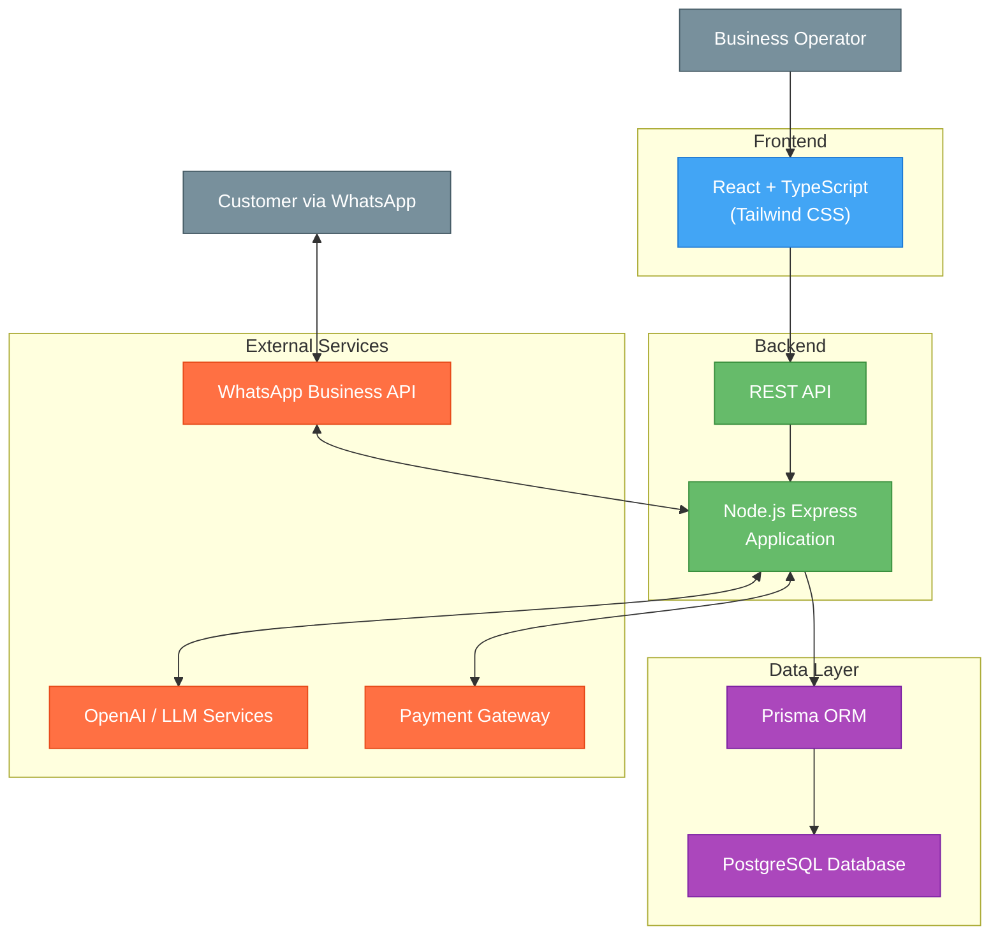
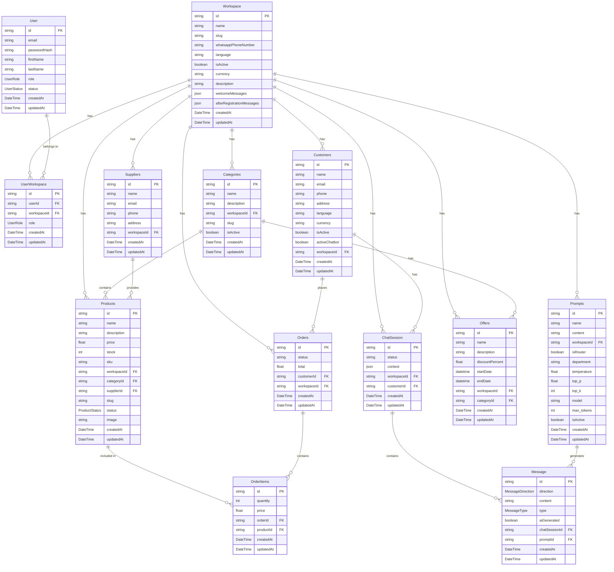

## Index

0. [Project information](#0-project-information)
1. [General product description](#1-general-product-description)
2. [System architecture](#2-system-architecture)
3. [Data model](#3-data-model)
4. [API specification](#4-api-specification)
5. [User stories](#5-user-stories)
6. [Work tickets](#6-work-tickets)
7. [Core Development Tasks](#7-core-development-tasks)

---

## 0. Project information

### **0.1. Andrea Gelsomino**

### **0.2. ShopMe**

### **0.3. Brief project description:**
ShopMe is a multilingual SaaS platform (Italian, English, Spanish) that turns WhatsApp into a sales channel. Businesses can create chatbots, manage products, receive orders, and send invoices without technical skills. Our AI automates customer support, manages notifications, and offers 24/7 shopping through WhatsApp.

### **0.4. Project URL:**
*Not available*

### 0.5. Repository URL or compressed file
*Not available*

---

## 1. General product description

### **1.1. Objective:**

ShopMe helps businesses manage customer interactions through WhatsApp. The AI chatbot executes function calls during conversations to handle customer requests. When a customer asks about an invoice, the system finds it and sends a download link, while also answering questions about products, orders, and other information.

The platform helps businesses:
- Provide 24/7 customer service without more staff
- Handle routine questions automatically
- Offer service directly through WhatsApp
- Build customer loyalty through fast responses

### **1.2. Key features and functionalities:**

ShopMe transforms WhatsApp into a sales and service channel with these key features:

The platform supports multiple businesses with isolated workspaces, custom branding, and role-based access. Each business manages their product catalog with images, inventory tracking, and organized categories.

The system sends smart notifications for order updates and keeps customers engaged through an AI-powered chat interface that provides contextual responses.

Business owners can customize settings including branding, language support (Italian, English, Spanish), and AI behavior parameters (temperature, token limits).

All sensitive operations use secure temporary links rather than being handled in chat conversations.

### **1.3. Design and user experience:**

User interaction happens through WhatsApp. Customers message a business number, receive a registration link, and then interact with the AI assistant to ask questions, place orders, and manage their account.

The platform includes an admin panel where business owners can manage:
- AI Prompts and settings
- Products and categories
- Special offers
- Customer data
- Performance metrics

### **1.4. Installation instructions:**

Currently in development.

---

## 2. System architecture

### **2.1. Architecture diagram:**

### **2.2. Description of main components:**

- **Frontend**: React with TypeScript and Tailwind CSS for the admin interface where businesses manage products and monitor customer interactions.

- **Backend**: Node.js Express application using Domain-Driven Design architecture to handle business logic and API routes.

- **Data Layer**: Prisma ORM with PostgreSQL database for data storage and retrieval.

- **External Services**:
  - **WhatsApp Business API**: For customer communication
  - **OpenAI / LLM Services**: Powers the AI chatbot
  - **Payment Gateway**: Handles secure payments

### **2.3. High-level project description**

The project follows a Domain-Driven Design architecture with clear separation of concerns:

**Backend Architecture**
- **Domain Layer**: Core business entities and rules
- **Application Layer**: Use cases and business operations
- **Infrastructure Layer**: Database access and external services
- **Interface Layer**: API endpoints and controllers

**Frontend Architecture**
- Component-based React application with Tailwind CSS
- State management with React contexts
- Service modules for API communication

**Database**
- PostgreSQL with Prisma ORM
- Type-safe database access
- Migration management

### **2.4. Security**

ShopMe implements these security measures:

1. **Authentication**:
   - JWT-based authentication with short-lived tokens
   - Refresh tokens in HTTP-only cookies
   - Rate limiting on authentication endpoints

2. **Secure Operations**:
   - Sensitive operations use time-limited secure links
   - Encrypted tokens with expiration times

3. **Data Protection**:
   - HTTPS for all communications
   - Role-based access controls
   - Workspace isolation for multi-tenant security

### **2.5.1 Authentication Token**

The system uses JWT (JSON Web Token) for authentication:

1. **Token Generation**: Login creates a signed JWT with:
   - User identifier
   - User roles and permissions
   - Expiration time (1 hour for access tokens)

2. **Token Usage**: Include in API requests as:
   `Authorization: Bearer [token]`

### **2.5.2 AI Parameters**

The system allows customizing AI behavior with these parameters:

1. **content**: Base prompt that guides the AI's responses.

2. **max_tokens**: Controls response length.
   - Lower values: Short responses
   - Higher values: Detailed answers
   
3. **temperature**: Controls randomness (0.0 to 1.0).
   - Low: Consistent, focused responses
   - High: More creative, varied responses
   
4. **top_p**: Controls response diversity.
   - Lower values: Focus on likely responses
   - Higher values: Consider more possibilities
   
5. **top_k**: Restricts token selection.
   - Lower values: Common word choices
   - Higher values: More varied vocabulary

---

## 3. Data model

### **3.1. Data model diagram:**

### **3.2. Description of main entities:**

- **Workspace**: Business tenant with unique settings
- **User**: Admin users who manage workspaces
- **UserWorkspace**: Links users to workspaces with specific role permissions
- **Categories**: Product organization structure
- **Products**: Items available for sale
- **Customers**: End users who interact through WhatsApp 
- **Orders**: Purchase records with items and payment status
- **Prompts**: AI configurations including instruction templates and parameters
- **Offers**: Time-limited discounts and promotions
- **ChatSession**: Conversation contexts between customers and the system
- **Message**: Individual messages within conversations
- **OrderItems**: Individual items within an order
- **Suppliers**: Product suppliers with contact information

---

## 4. API specification

Below are the most important endpoints of the ShopMe platform:

### 1. WhatsApp Messages API

**Endpoint**: `POST /api/messages/receive`

**Description**: Receives incoming WhatsApp messages and processes them using AI.

**Query Parameters**:
- `workspaceId`: Workspace ID (required)
- `channel`: Message channel type (required)
- `messageId`: Unique message identifier
- `token`: Authentication token (required)

**Status Codes**:
- `200 OK`: Message processed successfully
- `400 Bad Request`: Incorrect request format
- `401 Unauthorized`: Invalid credentials
- `403 Forbidden`: Access denied

### 2. Conversation History API

**Endpoint**: `GET /api/conversations/{customerId}/history`

**Description**: Gets conversation history with a customer.

**Query Parameters**:
- `workspaceId`: Workspace ID (required)
- `limit`: Maximum messages to retrieve
- `token`: Authentication token (required)

**Status Codes**:
- `200 OK`: History retrieved successfully
- `401 Unauthorized`: Invalid credentials
- `404 Not Found`: Customer not found

### 3. Agent Settings API

**Endpoint**: `POST /api/workspaces/{workspaceId}/agents`

**Description**: Creates or updates agent settings for AI customization.

**Query Parameters**:
- `token`: Authentication token (required)
  

**Status Codes**:
- `201 Created`: Agent created successfully
- `400 Bad Request`: Incorrect parameters
- `401 Unauthorized`: Invalid credentials

---

## 5. User stories

### **User Story 1: Platform Access**

**As** a business owner,  
**I want** to log in and create my sales channel,  
**So that** I can connect with customers.

**Key features:**
1. Registration and login with email and password
2. Create workspace with business information
3. Connect WhatsApp number
4. Configure welcome messages
5. Invite team members with different roles

**Technical aspects:**
- JWT authentication
- Role-based access control
- Secure password handling

### **User Story 2: Product Management**

**As** a business administrator,  
**I want** to manage my product catalog,  
**So that** I can showcase products to customers.

**Key features:**
1. Add products with details and images
2. Organize products into categories
3. Update inventory levels
4. Activate/deactivate products

**Technical aspects:**
- Image handling
- Database optimization for searches
- Inventory tracking

### **User Story 3: AI Agent Configuration**

**As** a business manager,  
**I want** to configure AI behavior,  
**So that** automated responses match my business needs.

**Key features:**
1. Create and edit AI prompts
2. Adjust AI parameters (temperature, max tokens)
3. Set up specialized agents for different tasks
4. Monitor conversation quality

**Technical aspects:**
- Integration with language models
- Context management for conversations
- Parameter tuning interface

---

## 6. Work tickets

### **Ticket 1: Authentication System**

**Title**: Implement JWT Authentication

**Description**:  
Create a secure authentication system with user and workspace management.

**Key Tasks**:
1. JWT token implementation with refresh mechanism
2. User registration and login endpoints
3. Workspace creation process
4. Role-based permissions
5. WhatsApp connection setup

**Acceptance criteria**:
- Users can register and log in securely
- Workspaces are properly isolated
- Role permissions are enforced
- WhatsApp connection works correctly

### **Ticket 2: Product Management**

**Title**: Develop Product Management System

**Description**:  
Create product catalog management with categories and inventory.

**Key Tasks**:
1. Product data models and API endpoints
2. Category management system
3. Image upload handling
4. Inventory tracking
5. Search functionality

**Acceptance criteria**:
- Products can be created, updated, and deleted
- Categories organize products effectively
- Images are properly handled
- Inventory is tracked accurately

### **Ticket 3: Agent Configuration**

**Title**: Implement AI Agent Configuration

**Description**:  
Build a system for configuring AI agents for customer interactions.

**Key Tasks**:
1. AI configuration data models
2. Parameter adjustment interface
3. Conversation context handling
4. Multi-language support
5. Configuration testing system

**Acceptance criteria**:
- Businesses can create and edit AI configurations
- Parameters can be adjusted for different scenarios
- AI responds according to configuration settings
- Multiple languages are supported

---

## 7. Core Development Tasks

Based on the requirements, these are the main tasks:

### **Task 1: Authentication & Workspace**

**Description**:  
Implement user authentication and workspace creation.

**Key Features**:
- JWT authentication
- User registration and login
- Workspace configuration
- Role-based access control
- WhatsApp integration

**Deliverables**:
- Authentication API endpoints
- Workspace management interface
- User role system

### **Task 2: Product Management**

**Description**:  
Build product catalog system with categories.

**Key Features**:
- Product CRUD operations
- Category organization
- Image handling
- Inventory tracking
- Search functionality

**Deliverables**:
- Product management interface
- Category system
- Image upload functionality
- Inventory controls

### **Task 3: AI Configuration**

**Description**:  
Create system for AI agent settings.

**Key Features**:
- AI parameter customization
- Agent creation and management
- Multi-language support
- Agent types and specializations

**Deliverables**:
- Agent management interface
- Parameter controls
- Agent listing dashboard

---

