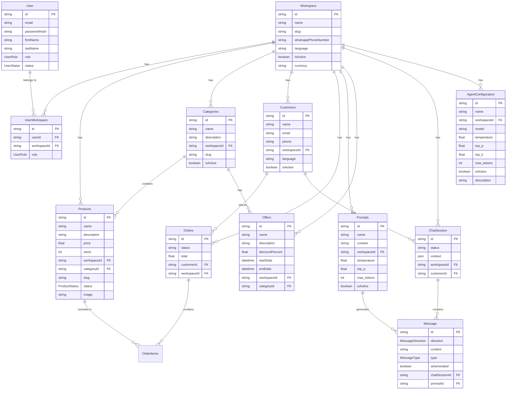

## Index

0. [Project information](#0-project-information)
1. [General product description](#1-general-product-description)
2. [System architecture](#2-system-architecture)
3. [Data model](#3-data-model)
4. [API specification](#4-api-specification)
5. [User stories](#5-user-stories)
6. [Work tickets](#6-work-tickets)
7. [Core Development Tasks](#7-core-development-tasks)

---

## 0. Project information

### **0.1. Andrea Gelsomino**

### **0.2. ShopMe**

### **0.3. Brief project description:**
ShopMe is a multilingual SaaS platform (Italian, English, Spanish) that turns WhatsApp into a complete sales channel. Customers can create smart chatbots, manage products, receive orders, and send invoices to their clients without any technical skills. Our AI technology automates customer-care responses, manages push notifications, and offers a 24/7 conversational shopping experience, all directly to Whatsapp  the world's most popular messaging app

### **0.4. Project URL:**
*Not available*

### 0.5. Repository URL or compressed file
*Not available*

---

## 1. General product description

### **1.1. Objective:**

The primary purpose of ShopMe is to provide businesses with a comprehensive platform to manage customer inquiries through WhatsApp. The system uses an AI-powered chatbot that executes specific function calls during conversations to deliver immediate responses to customer requests. For example, when a customer asks for their latest invoice, the system queries the database and returns a secure download link, while also handling other inquiries about products, order tracking, legal information, and contracts.

Rather than solving a specific problem, ShopMe significantly enhances the quality of service businesses can offer to their customers by providing an automated first-level support system. This allows companies to:
- Provide 24/7 customer service without increasing staffing costs
- Handle routine inquiries automatically, freeing up human agents for more complex issues
- Offer a seamless customer experience directly within WhatsApp, the messaging app many customers already use daily
- Build customer loyalty through responsive and accurate service

### **1.2. Key features and functionalities:**

ShopMe transforms WhatsApp into a complete sales and customer service channel with these core capabilities:

The platform operates as a **multi-tenant system** where multiple businesses can create isolated workspaces with customized branding and role-based access controls. Each business manages their own **product catalog** with support for variants, multiple images, inventory tracking, and custom attributes.

Products are organized in **hierarchical categories** with specific filters and visual representations, while **special offers** can be created with various discount types, time limitations, and targeting options.

The system keeps customers engaged through **smart notifications** for order updates, personalized recommendations, abandoned cart reminders, and delivery tracking. All customer interactions are handled through an **AI-powered conversational interface** that makes contextual responses and executes function calls for complex operations.

Business owners can customize their workspace through **comprehensive settings** including branding options, multilingual support (Italian, English, Spanish), business hours, and AI behavior configuration (adjusting model parameters like temperature and token limits).

For security, all sensitive operations (payments, registrations, personal data access) are handled through **temporary secure links** rather than within chat conversations.

### **1.3. Design and user experience:**

The application interface is currently in active development (Work In Progress).

User interaction with the system is primarily through WhatsApp. When a user sends a message to the business's WhatsApp number, they receive a registration link. After completing the registration process, they can interact with the AI-powered assistant directly through normal WhatsApp conversations, asking questions, placing orders, and managing their account without needing to download additional apps or visit external websites for most operations.

The platform also includes a SaaS admin panel, accessible with login credentials. This dashboard allows business owners to manage:
- AI Prompts and Agent settings
- Products and inventory
- Categories and organization
- Special offers and discounts
- Customer data and conversations
- Performance analytics

### **1.4. Installation instructions:**

Currently in development (Work In Progress).

---

## 2. System architecture

### **2.1. Architecture diagram:**

### **2.2. Description of main components:**

- **Frontend**: Built with React and TypeScript, using Tailwind CSS for styling. The frontend provides the administrative interface for business operators to manage their products, categories, settings, and monitor customer interactions.

- **Backend**: Node.js Express application that implements a Domain-Driven Design architecture. It serves as the core of the system, handling business logic, API routes, and integration with external services.

- **Data Layer**: Utilizes Prisma ORM for type-safe database access, with PostgreSQL as the primary database. This layer manages data persistence, relationships, and provides a clean interface for the backend services.

- **External Services**:
  - **WhatsApp Business API**: Enables direct communication with customers through WhatsApp.
  - **OpenAI / LLM Services**: Powers the AI chatbot capabilities, understanding customer queries and generating appropriate responses.
  - **Payment Gateway**: Handles secure payment processing for customer orders.

### **2.3. High-level project description and file structure**

The project follows a clean Domain-Driven Design architecture, dividing functionality into clear conceptual areas:

**Backend Architecture**
The backend is structured around a hexagonal architecture pattern that separates core business logic from external concerns:

- **Domain Layer**: Contains business entities, repositories interfaces, and value objects that represent the core model
- **Application Layer**: Orchestrates use cases and business operations without external dependencies
- **Infrastructure Layer**: Implements technical details like database access and external service integrations
- **Interface Layer**: Provides REST endpoints, controllers, and WebSocket handlers for client communication
- **Support Modules**: Configuration, utilities, and cross-cutting concerns like logging

**Frontend Architecture**
The React frontend follows a component-based architecture focused on reusability and maintainability:

- **Component Library**: Organized by function with shared UI elements, forms, and layouts
- **State Management**: Uses React contexts and custom hooks for efficient data flow
- **API Integration**: Service modules that handle backend communication
- **Page Structure**: Feature-based organization with routing

**Persistence**
Database management uses Prisma ORM with PostgreSQL as the primary database, providing:
- Type-safe database access
- Migration management
- Schema definition with relationships
- Efficient query optimization

### **2.4. Infrastructure and deployment**

The system uses a modern cloud infrastructure with the following components:

- **Application Hosting**: Cloud-based containers for scalable deployment
- **Database**: Managed PostgreSQL database service with automated backups
- **CI/CD Pipeline**: Automated testing and deployment through GitHub Actions
- **Environment Strategy**: Development, Staging, and Production environments
- **Deployment Process**: Blue-green deployment for zero downtime updates
- **Monitoring**: Comprehensive application and infrastructure monitoring

### **2.5. Security**

ShopMe implements comprehensive security measures to protect both business and customer data:

1. **Authentication and Token Management**:
   - JWT-based authentication with short-lived access tokens (1 hour)
   - Refresh tokens stored in HTTP-only cookies with 7-day expiration
   - Regular rotation of secret keys
   - Token signing with HS256 algorithm
   - Source validation through HTTP headers
   - Rate limiting on authentication endpoints

2. **Secure Operations with Temporary Links**:
   - All sensitive operations use time-limited secure links
   - Links include encrypted tokens with operation type, resources, and expiration
   - Example flow for payment processing:
     1. Customer requests to complete purchase
     2. System generates unique temporary token valid for 1 hour
     3. System sends secure payment link to customer
     4. Customer completes payment on secure page
     5. System verifies token, processes payment, and invalidates token
     6. Confirmation sent via WhatsApp

3. **Data Protection**:
   - HTTPS encryption for all communications
   - Database encryption at rest
   - Sensitive data tokenization
   - Redaction of personal information in logs

4. **Access Controls**:
   - Role-based permissions system
   - Workspace isolation for multi-tenant security
   - Principle of least privilege applied throughout
   - Regular permission audits

5. **Anti-Abuse System**:
   - Smart rate limiting to prevent misuse
   - Suspicious activity monitoring
   - Automatic blocking of potential attacks
   - Customizable security thresholds per workspace

### **2.6. Tests**

The testing strategy for ShopMe is currently in development (Work In Progress) and will include:

1. **Unit Tests**: Testing individual components and functions in isolation
2. **Integration Tests**: Verifying interactions between different components and services

Each test type will be implemented to ensure code quality, reliability, and to prevent regressions during development.

### **2.5.1 Authentication Token Generation**

The system uses JWT (JSON Web Token) for secure authentication across all APIs:

1. **Token Generation**: When a user logs in, the system generates a signed JWT with:
   - A unique user identifier
   - The user's roles and permissions
   - Workspace access information
   - An expiration time (1 hour for access tokens)

2. **Token Structure**: Each token consists of three parts:
   - Header: Algorithm information (HS256)
   - Payload: User data and claims
   - Signature: Ensures token integrity

3. **Token Usage**: Include the token in all API requests in the Authorization header:
   `Authorization: Bearer [token]`

4. **Token Renewal**: When tokens approach expiration, use the refresh endpoint to obtain a new token without re-authentication.

### **2.5.2 AI Parameter Definitions**

The system enables fine-tuning of AI agent behavior through several key parameters:

1. **prompt**: The base text instructions that guide the AI's behavior and responses. Defines the AI's personality, knowledge boundaries, and response format. Example: "You are a helpful customer service agent for an Italian restaurant. Answer questions about our menu, opening hours, and reservations in a friendly tone."

2. **max_token**: Limits the length of the AI's response. Each token represents approximately 4 characters or 0.75 words.
   - Lower values (50-150): Short, concise responses
   - Medium values (150-500): Detailed explanations
   - Higher values (500-1000): Comprehensive answers
   
3. **temperature**: Controls randomness in responses, ranging from 0.0 to 1.0.
   - Low (0.1-0.3): Consistent, deterministic, focused responses
   - Medium (0.4-0.7): Balanced creativity and focus
   - High (0.8-1.0): More diverse, creative, and unpredictable responses
   
4. **top_P**: Controls response diversity using nucleus sampling, ranging from 0.0 to 1.0.
   - Lower values: Consider only the most probable tokens
   - Higher values: Consider a wider range of possible tokens
   
5. **top_K**: Restricts token selection to the K most likely tokens at each step.
   - Lower values (10-20): More focused on common word choices
   - Higher values (40-100): More varied vocabulary options

These parameters allow businesses to customize their AI agents for different scenarios, from factual customer support to creative product recommendations.

---

## 3. Data model

### **3.1. Data model diagram:**

### **3.2. Description of main entities:**

- **Workspace**: Represents a business tenant with unique settings and data isolation
- **User**: Admin users who manage workspaces
- **UserWorkspace**: Links users to workspaces with specific roles
- **Categories**: Product organization structure
- **Products**: Items available for sale
- **Customers**: End users who interact through WhatsApp 
- **Orders**: Purchase records with items and payment status
- **Prompts**: AI instruction templates for different conversation scenarios
- **AgentConfiguration**: AI agent settings including model, temperature and token parameters
- **Offers**: Time-limited discounts and promotions
- **ChatSession**: Conversation contexts between customers and the system
- **Message**: Individual messages within conversations

---

## 4. API specification

Below are three of the most important endpoints of the ShopMe platform:

### 1. WhatsApp Messages API

**Endpoint**: `POST /api/messages/receive`

**Description**: This endpoint receives incoming WhatsApp messages and processes them using the AI system to generate appropriate responses.

**Query Parameters**:
- `workspaceId`: Workspace ID (required)
- `channel`: Message channel type (required)
- `messageId`: Unique message identifier
- `debug`: Enable debug mode
- `token`: Authentication token (required)

**Status Codes**:
- `200 OK`: Message received and processed successfully
- `400 Bad Request`: Incorrect request format
- `401 Unauthorized`: Invalid credentials
- `403 Forbidden`: Forbidden access to workspace
- `429 Too Many Requests`: Rate limit exceeded
- `500 Internal Server Error`: Error processing the message

### 2. Conversation History API

**Endpoint**: `GET /api/conversations/{customerId}/history`

**Description**: Retrieves the conversation history with a specific customer, allowing you to see the context of previous interactions.

**Query Parameters**:
- `workspaceId`: Workspace ID (required)
- `limit`: Maximum number of messages (default: 50)
- `before`: Timestamp for pagination
- `token`: Authentication token (required)

**Status Codes**:
- `200 OK`: History retrieved successfully
- `400 Bad Request`: Incorrect parameters
- `401 Unauthorized`: Invalid credentials
- `403 Forbidden`: No permission to access history
- `404 Not Found`: Customer not found
- `429 Too Many Requests`: Rate limit exceeded

### 3. Agent Settings API

**Endpoint**: `POST /api/agents/settings`

**Description**: This endpoint allows creating or updating settings for a specific agent, including AI parameters for customizing responses.

**Query Parameters**:
- `workspaceId`: Workspace ID (required)
- `agentId`: Agent ID (required)
- `prompt`: Base prompt template
- `max_token`: Response length limit
- `token`: Authentication token (required)

**Status Codes**:
- `200 OK`: Settings updated successfully
- `201 Created`: New settings created successfully
- `400 Bad Request`: Incorrect parameters
- `401 Unauthorized`: Invalid credentials
- `403 Forbidden`: Insufficient permissions
- `404 Not Found`: Agent not found
- `429 Too Many Requests`: Rate limit exceeded

---

## 5. User stories

### **User Story 1: Platform Access and Channel Setup**

**As** a business owner wanting to use the platform,  
**I want** to securely log into the system and create my own sales channel,  
**So that** I can begin configuring my business presence and connect with customers.

**Acceptance criteria:**
1. I can register on the ShopMe platform with my email and a secure password
2. I can securely log in using my credentials
3. Once logged in, I can create a new sales channel by providing a name, description, and logo
4. I can set up basic business information (opening hours, contact details, business category)
5. I can add my WhatsApp phone number to the channel
6. I can configure branding options including colors and font styles
7. I can invite team members with different access levels (admin, agent, viewer)
8. I can configure basic response templates and welcome messages

**Technical details:**
- The authentication system must use JWT tokens with proper expiration and refresh mechanisms
- Passwords must be securely hashed using bcrypt
- The system must support multi-factor authentication for enhanced security
- Role-based access control must be strictly enforced
- Channel creation must be isolated to ensure complete multi-tenancy

### **User Story 2: Product Management and Catalog**

**As** a business administrator,  
**I want** to be able to easily create, edit, and organize my product catalog,  
**So that** I can maintain an up-to-date inventory and effectively showcase my offerings to customers.

**Acceptance criteria:**
1. I can access an intuitive admin panel to manage my products
2. I can add new products with all relevant information (name, description, price, images, stock)
3. I can organize products into categories and subcategories with clear hierarchies
4. I can set specific attributes based on product category (sizes for clothing, ingredients for food, etc.)
5. I can upload multiple images per product to show different perspectives
6. I can temporarily activate/deactivate products without removing them from the catalog
7. I can set product variations (size, color, material, etc.) with individual pricing and stock
8. I can import products in bulk using a CSV file and export my catalog

**Technical details:**
- The system must optimize images for better performance and storage efficiency
- The admin panel must be responsive to work correctly on mobile and desktop devices
- The database must be properly indexed for fast searches with high-volume catalogs
- A caching system must be implemented to improve performance for frequent catalog queries
- All product changes must be versioned with an audit trail

### **User Story 3: Agent Management and Customer Support**

**As** a business manager,  
**I want** to be able to set up and manage support agents with different roles and permissions,  
**So that** my team can efficiently handle customer inquiries and provide excellent service.

**Acceptance criteria:**
1. I can create agent accounts with specific roles and permissions
2. I can assign agents to specific departments or categories
3. I can set working hours and availability status for each agent
4. I can monitor agent performance metrics (response time, customer satisfaction)
5. I can set up automated routing rules for incoming customer inquiries
6. I can create predefined responses for common questions that agents can quickly use
7. I can review agent conversations and provide feedback
8. I can see analytics on agent efficiency and customer satisfaction
9. I can set up escalation paths for complex issues

**Technical details:**
- The system must support role-based access control with granular permissions
- Real-time status updates for agent availability
- Secure access to customer conversation history with privacy controls
- Workload distribution algorithms to balance inquiries among available agents
- Performance metrics must be calculated in real-time with dashboards

### **User Story 4: Conversational Commerce Experience**

**As** a business user of the platform,  
**I want** to provide my customers with an intuitive conversational shopping experience,  
**So that** they can easily browse products, ask questions, and complete purchases through a chat interface.

**Acceptance criteria:**
1. Customers can browse product categories through interactive messages
2. Customers can search for specific products using natural language
3. Product details are displayed with images, descriptions, and prices in the chat
4. Customers can add products to a cart during the conversation
5. Customers can review their cart and modify quantities or remove products
6. Customers can ask questions about products and get relevant answers
7. The system can handle basic support inquiries without agent intervention
8. Conversation history is maintained for context in future interactions
9. Customers can receive order status updates through the same interface

**Technical details:**
- Natural language understanding capabilities to interpret customer requests
- Context-awareness to maintain conversation flow
- Rich media support for displaying products attractively
- Secure handling of cart and checkout information
- Analytics to track conversational flows and identify improvement opportunities

---

## 6. Work tickets

### **Ticket 1 (Authentication): JWT Authentication System for SaaS Platform**

**Title**: Implement JWT Authentication System with Channel Creation

**Description**:  
Develop a secure authentication system using JWT tokens for both frontend and backend, allowing users to create and manage their own channels within the multi-tenant SaaS platform.

**Objective**:  
Create a robust authentication and authorization system that ensures secure access to the platform and enables users to create their own branded channels for customer interaction.

**Tasks**:
1. Implement JWT token-based authentication flow with refresh token mechanism
2. Create secure user registration and login endpoints
3. Develop password reset and account recovery functionality
4. Implement role-based access control (RBAC) system
5. Create a secure channel creation process where users can:
   - Define a channel name and description
   - Upload branding assets (logo, colors)
   - Configure WhatsApp connectivity by providing phone number and channel name
   - Set default channel settings
6. Implement secure storage for WhatsApp integration tokens
7. Create middleware for route protection based on user roles and permissions
8. Develop profile management functionality
9. Implement multi-factor authentication (MFA) for enhanced security
10. Create comprehensive API documentation for authentication flows

**Acceptance criteria**:
- User registration and login flows work seamlessly across devices
- JWT tokens have appropriate expiration times with secure refresh mechanism
- Password storage implements industry-standard security practices
- Channel creation is isolated and enforces multi-tenancy
- Users can only access resources they have permission to view/edit
- WhatsApp connection tokens are securely stored with encryption
- Session management allows for secure login/logout
- API endpoints are protected with appropriate middleware
- Comprehensive tests cover all authentication flows
- Documentation clearly explains all authentication processes

**Estimation**: 8 story points (approximately 5-6 days of development)

**Priority**: Critical (blocking)

**Dependencies**:
- User and channel data models defined
- Frontend UI components for authentication
- Database connectivity established

**Additional resources**:
- [JWT Authentication Best Practices](https://auth0.com/blog/jwt-authentication-best-practices/)
- [OWASP Authentication Guidelines](https://cheatsheetseries.owasp.org/cheatsheets/Authentication_Cheat_Sheet.html)
- [User Authentication Flow Diagram](/diagrams/auth-flow.png)

### **Ticket 2 (Products): Product Management CRUD Implementation**

**Title**: Develop Complete Product Management System

**Description**:  
Create a comprehensive product management system with full CRUD functionality, category management, and support for product variants and attributes.

**Objective**:  
Provide businesses with a robust and user-friendly system to create, read, update, and delete products, supporting complex product structures and efficient catalog management.

**Tasks**:
1. Design and implement product data models supporting:
   - Basic product information (name, description, price)
   - Product variants (size, color, etc.)
   - Custom attributes based on product categories
   - Multiple images per product
   - Inventory tracking
2. Develop backend API endpoints for all CRUD operations
3. Create frontend components for product management:
   - Product list view with filtering and sorting
   - Product detail form with image upload
   - Category management interface
   - Bulk actions for product updates
   - Product import/export functionality
4. Implement product search functionality with filters
5. Create product categorization system with hierarchical categories
6. Add inventory management features including low stock alerts
7. Implement product analytics tracking (views, clicks, purchases)
8. Create data validation for all product fields
9. Develop database indexing strategy for optimal performance
10. Add product versioning and audit history

**Acceptance criteria**:
- All product CRUD operations function correctly
- Product variants can be properly created and managed
- Categories can be organized in a hierarchical structure
- Product images can be uploaded, cropped, and managed
- Bulk operations work efficiently on large catalogs
- Product search returns relevant results quickly
- The system handles at least 10,000 products without performance degradation
- All product data is properly validated before saving
- Product changes are tracked with version history

**Estimation**: 13 story points (approximately 8-10 days of development)

**Priority**: High

**Dependencies**:
- Authentication system implemented
- Database schema finalized
- File storage system for product images

**Additional resources**:
- [Product Data Model Diagram](/diagrams/product-model.png)
- [UI Mockups for Product Management](/designs/product-management-ui.fig)
- [API Documentation Standards](/docs/api-standards.md)

### **Ticket 3 (Agents): Agent Management System Development**

**Title**: Create Agent Management and Performance Tracking System

**Description**:  
Develop a comprehensive agent management system allowing businesses to create agent accounts, set permissions, monitor performance, and manage customer support workflows.

**Objective**:  
Build a robust system that enables businesses to efficiently manage their support team, track agent performance, and ensure optimal customer service delivery.

**Tasks**:
1. Design and implement agent data models with:
   - Role-based permissions
   - Skill profiles and specializations
   - Working hours and availability settings
   - Performance metrics tracking
2. Create backend API endpoints for agent management
3. Develop agent invitation and onboarding flow
4. Implement frontend components for:
   - Agent directory and profiles
   - Performance dashboards with metrics
   - Scheduling and availability management
   - Agent-specific settings
5. Create supervisor tools for conversation monitoring
6. Implement automated work distribution system
7. Develop real-time agent status tracking
8. Build reporting tools for agent performance
9. Create permission management interface
10. Implement notification system for agents

**Acceptance criteria**:
- Businesses can create and manage agent accounts with specific roles
- Supervisors can monitor agent performance through dashboards
- Agents can update their status and availability
- The system can route conversations to appropriate agents based on skills
- Supervisors can provide feedback on agent performance
- The system tracks key metrics including response time and resolution rate
- Permissions are properly enforced for different agent roles
- Agents receive appropriate notifications for assigned conversations

**Estimation**: 10 story points (approximately 7 days of development)

**Priority**: High

**Dependencies**:
- Authentication and user management system
- Basic conversation data models

**Additional resources**:
- [Agent Management Workflow Diagram](/diagrams/agent-workflow.png)
- [Performance Metrics Definitions](/docs/agent-performance-metrics.md)
- [Agent Interface Mockups](/designs/agent-interface.fig)

### **Ticket 5 (AI Configuration): AI Agent Configuration System**

**Title**: Implement AI Agent Configuration and Prompt Management

**Description**:  
Develop a system for configuring AI agents with customizable parameters and prompt templates to optimize the customer service experience across different business scenarios.

**Objective**:  
Provide businesses with a flexible framework to configure and fine-tune their AI assistant's behavior, personality, and capabilities according to their specific needs and customer expectations.

**Tasks**:
1. Design and implement AI configuration data models:
   - AI model selection (GPT-4, GPT-3.5, etc.)
   - Parameter settings (temperature, top_P, top_K, max_tokens)
   - Prompt template management
   - Business context integration
   - Conversation memory settings
2. Develop backend API endpoints for AI configuration management
3. Create frontend configuration interface with:
   - Visual parameter adjustment sliders
   - Prompt template editor with variables
   - Testing console for prompt evaluation
   - Version history and comparison
4. Implement prompt template library with categorized examples
5. Build conversation context management system
6. Add analytics for prompt performance tracking
7. Create A/B testing framework for comparing prompt effectiveness
8. Develop secure integration with LLM providers
9. Implement error handling and fallback mechanisms
10. Add support for multi-language prompt templates

**Acceptance criteria**:
- Businesses can create, edit, and manage multiple AI configurations
- Parameters can be adjusted with real-time feedback
- Prompt templates can include variables for dynamic content
- Templates support multiple languages (Italian, English, Spanish)
- Configuration changes apply immediately to customer interactions
- Performance metrics show impact of different configurations
- A/B testing allows for data-driven optimization
- Configuration history maintains previous versions for rollback
- System handles LLM errors gracefully with fallback options

**Estimation**: 8 story points (approximately 5-6 days of development)

**Priority**: High

**Dependencies**:
- WhatsApp messaging system
- Workspace management system
- Language detection system

**Additional resources**:
- [AI Configuration Best Practices](/docs/ai-configuration.md)
- [Prompt Engineering Guidelines](/docs/prompt-engineering.md)
- [Configuration UI Mockups](/designs/ai-config-ui.fig)

### **Ticket 4 (Chat): Chat Integration System**

**Title**: Develop Conversational Commerce Chat System

**Description**:  
Create a comprehensive chat integration system that enables businesses to engage with customers through conversational interfaces, allowing for product browsing, inquiries, and support.

**Objective**:  
Build a flexible chat system that provides customers with a seamless shopping experience through conversation while giving businesses the tools to manage these interactions effectively.

**Tasks**:
1. Design and implement conversation data models, including:
   - Message threading and history
   - Customer context and preferences
   - Product references in conversations
   - Conversation state management
2. Develop real-time chat infrastructure using WebSockets
3. Create API endpoints for message processing and retrieval
4. Implement frontend components for:
   - Customer-facing chat interface
   - Agent chat dashboard with context panel
   - Quick response templates
   - Rich media message support
5. Build product showcase functionality within chat
6. Implement cart management through chat
7. Create conversation routing logic based on context and inquiries
8. Develop conversation search and filtering
9. Implement analytics for conversation tracking
10. Create conversation tagging and categorization system

**Acceptance criteria**:
- Real-time messaging works reliably with minimal latency
- Conversations maintain context across sessions
- Products can be showcased with images and details in the chat
- Customers can manage their shopping cart through conversation
- Agents can see relevant customer context when handling conversations
- Conversations can be searched and filtered by various parameters
- Rich media (images, videos, files) can be shared in conversations
- Conversation analytics provide insights into customer interactions
- The system can handle concurrent conversations without degradation

**Estimation**: 13 story points (approximately 8-10 days of development)

**Priority**: High

**Dependencies**:
- Authentication system
- Product management system
- Agent management system

**Additional resources**:
- [Chat System Architecture Diagram](/diagrams/chat-architecture.png)
- [Conversation Flow Examples](/docs/conversation-flows.md)
- [Chat Interface Mockups](/designs/chat-interface.fig)

---

## 7. Core Development Tasks

Based on the user stories and requirements, these are the three core development tasks for ShopMe:

### **Task 1: Authentication & Workspace Setup**

**Description**:  
Implement secure user authentication and workspace creation functionality.

**Key Features**:
- JWT-based authentication with refresh token mechanism
- User registration and login system
- Workspace creation and configuration
- Role-based access control (admin, agent, viewer)
- WhatsApp channel integration
- Multi-factor authentication for enhanced security

**Deliverables**:
- Secure authentication API endpoints
- User dashboard for workspace management
- WhatsApp connectivity configuration interface
- Role permission management system

### **Task 2: Product & Category Management**

**Description**:  
Create a comprehensive product catalog system with categories and variants.

**Key Features**:
- Full CRUD operations for products and categories
- Hierarchical category organization
- Product variant management (size, color, etc.)
- Multi-image support for product displays
- Inventory and stock management
- Bulk import/export capabilities

**Deliverables**:
- Product management dashboard
- Category tree editor
- Image upload and optimization system
- Inventory tracking interface
- Product search and filtering functionality

### **Task 3: AI Agent Configuration**

**Description**:  
Develop a system for configuring and fine-tuning AI agents for customer interactions.

**Key Features**:
- Customizable AI parameters (temperature, tokens, etc.)
- Prompt template creation and management
- Conversation context handling
- Multi-language support (Italian, English, Spanish)
- Conversation analytics and performance metrics

**Deliverables**:
- Agent configuration interface
- Prompt template editor with variables
- Testing console for prompt evaluation
- Conversation performance dashboard
- Parameter adjustment controls with guidance

---

