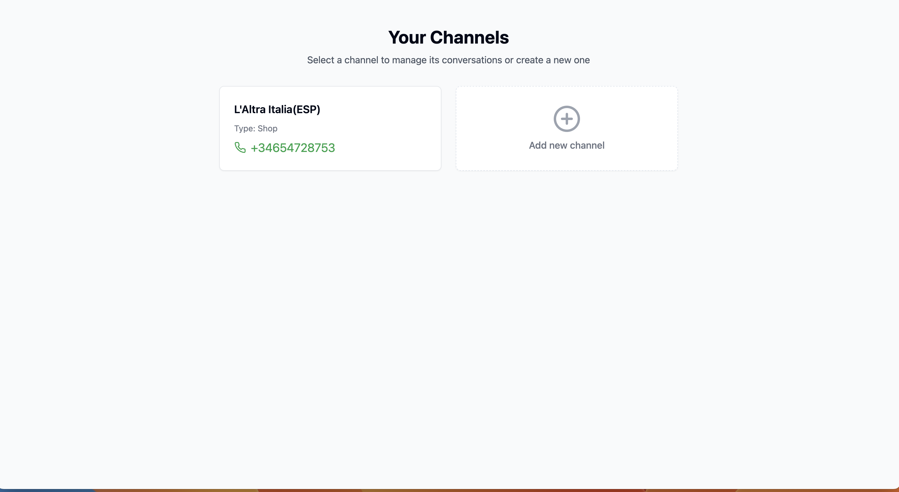
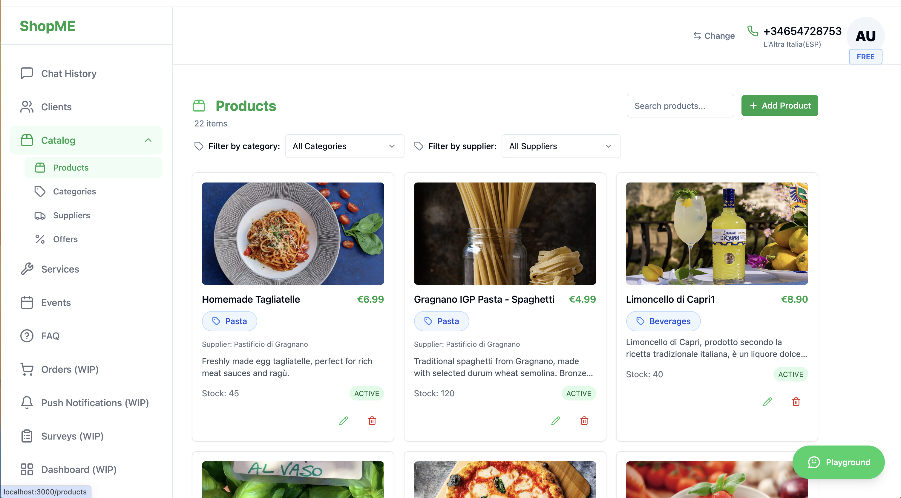
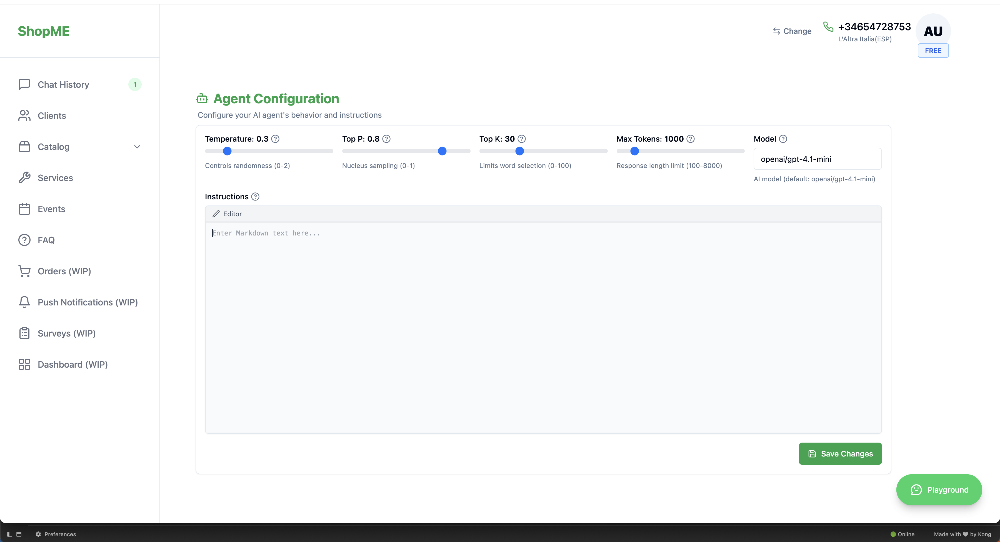
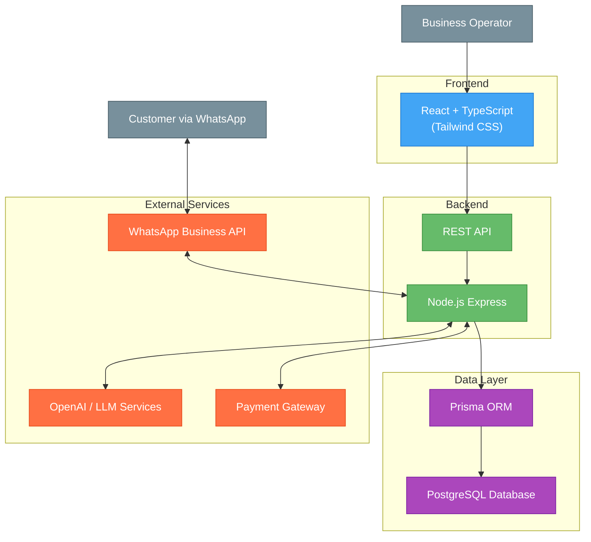
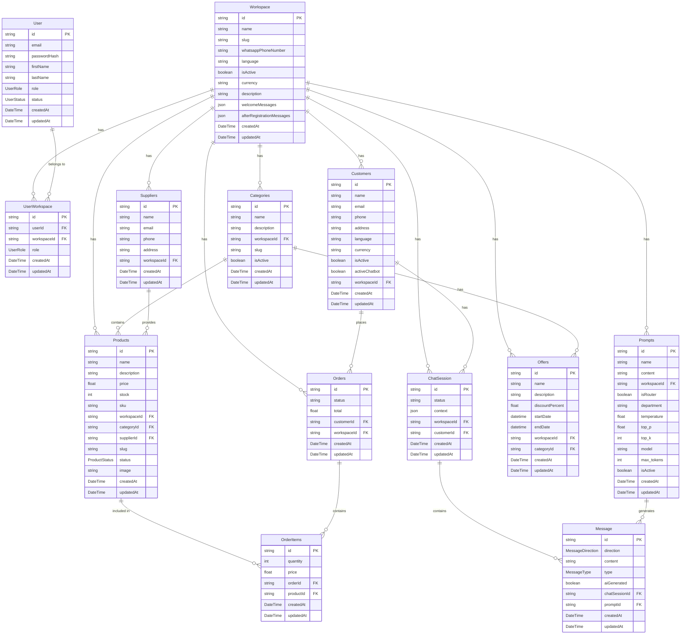

## Index

0. [Project information](#0-project-information)
1. [General product description](#1-general-product-description)
2. [System architecture](#2-system-architecture)
3. [Data model](#3-data-model)
4. [API specification](#4-api-specification)
5. [User stories](#5-user-stories)
6. [Work tickets](#6-work-tickets)
7. [Core Development Tasks](#7-core-development-tasks)

---

## 0. Project information

### **0.1. Andrea Gelsomino**

### **0.2. ShopMe**

### **0.3. Brief project description:**
ShopMe is a multilingual SaaS platform (Italian, English, Spanish) that transforms WhatsApp into a complete sales and customer service channel. Businesses can deploy AI-powered chatbots that handle customer inquiries, manage orders, provide product information, and send digital documents like invoices - all through WhatsApp without requiring technical knowledge. The system automates routine support tasks, delivers targeted promotional notifications, and offers 24/7 availability to enhance customer engagement and satisfaction.

### **0.4. Project URL:**
*Not available*

### 0.5. Repository URL or compressed file
*Not available*

---

## 1. General product description

### **1.1. Objective:**

ShopMe helps businesses manage customer interactions through WhatsApp. The AI chatbot executes function calls during conversations to handle customer requests. When a customer asks about an invoice, the system finds it and sends a download link, while also answering questions about products, orders, and other information.

The platform helps businesses:
- Provide 24/7 customer service and handle routine questions automatically without additional staff
- Offer service directly through WhatsApp
- Send push notifications with special offers and promotions
- Build customer loyalty through fast responses

### **1.2. Key features and functionalities:**

ShopMe transforms WhatsApp into a sales and service channel with these key features:

The platform supports multiple businesses with isolated workspaces. Each business manages their product catalog, offers,services, Faq.

The system sends scheduled notifications for new offers  keeping customers engaged.

Business owners can customize settings including branding, language support (Italian, English, Spanish), and AI behavior parameters (temperature, token limits,etc).

All sensitive operations use secure temporary links rather than being handled in chat conversations.

### **1.3. Design and user experience:**

The platform includes an admin panel where business owners can manage:
- AI Prompts and settings
- Products and categories
- Special offers
- Customer data
- Performance metrics







### **1.4. Installation instructions:**

Currently in development.

---

## 2. System architecture

### **2.1. Architecture diagram:**



### **2.2. Description of main components:**

- **Frontend**: React with TypeScript and Tailwind CSS for the admin interface where businesses manage products,offers,services,faq and monitor customer interactions.

- **Backend**: Node.js Express application using Domain-Driven Design architecture to handle business logic and API routes.

- **Data Layer**: Prisma ORM with PostgreSQL database.

- **External Services**:
  - **WhatsApp Business API**: For customer communication
  - **OpenrRouter / LLM Services**: Powers the AI chatbot
  - **Payment Gateway**: Handles secure payments

### **2.3. High-level project description**

The project follows a Domain-Driven Design architecture with clear separation of concerns:

**Backend Architecture**
- **Domain Layer**: Core business entities and rules
- **Application Layer**: Use cases and business operations
- **Infrastructure Layer**: Database access and external services
- **Interface Layer**: API endpoints and controllers

**Frontend Architecture**
- Component-based React application with Tailwind CSS
- State management with React contexts
- Service modules for API communication

**Database**
- PostgreSQL with Prisma ORM

### **2.4. Security**

ShopMe implements these security measures:

1. **Authentication**:
   - JWT-based authentication with short-lived tokens
   - Refresh tokens in HTTP-only cookies
   - Rate limiting on authentication endpoints

2. **Secure Operations**:
   - Sensitive operations use time-limited secure links
   - Encrypted tokens with expiration times

3. **Data Protection**:
   - HTTPS for all communications
   - Workspace isolation for multi-tenant security
   - Two-factor authentication for enhanced account security

### **2.5.1 Authentication Token**

The system uses JWT (JSON Web Token) for authentication:

1. **Token Generation**: Login creates a signed JWT with:
   - User identifier
   - User roles and permissions
   - Expiration time (1 hour for access tokens)

2. **Token Usage**: Include in API requests as:
   `Authorization: Bearer [token]`

### **2.5.2 AI Parameters**

- **prompt**: Base instructions that guide the AI's behavior
- **max_tokens**: Controls response length (500-1000 for detailed answers)
- **temperature**: Randomness control (0-1); lower = more focused
- **top_p**: Response diversity; higher values consider more options
- **top_k**: Token selection restriction; affects vocabulary variety
- **model**: AI model selection (e.g., GPT-4.1-mini)

All these parameters are configurable directly through the application interface, allowing businesses to fine-tune their AI responses without technical knowledge.

---

## 3. Data model

### **3.1. Data model diagram:**



### **3.2. Description of main entities:**

- **User**: Admin users who manage workspaces
- **Workspace**: Business tenant with unique settings and configurations
- **Categories**: Product organization structure for logical grouping
- **Products**: Items available for sale with prices and inventory
- **Suppliers**: Product suppliers with contact information and addresses
- **Offers**: Time-limited discounts and promotions for products
- **Customers**: End users who interact through WhatsApp messaging
- **Orders**: Purchase records with payment status and customer information
- **Agent Configuration**: AI agent settings with model parameters and behavior controls
- **ChatSession**: Conversation contexts between customers and the system
- **Message receive**: Webhook endpoint that receives incoming WhatsApp messages from WhatsApp Business API

---

## 4. API specification

Below are the most important endpoints of the ShopMe platform:

### 1. WhatsApp Messages API

**Endpoint**: `POST /api/messages/receive`

**Description**: Webhook endpoint that receives incoming WhatsApp messages from WhatsApp Business API and processes them using AI.

**Request Headers**:
- `Authorization`: Bearer token for authentication (required)
- `X-Workspace-Id`: Identifies which workspace should process the message (required)

**Request Body**:
```json
{
  "object": "whatsapp_business_account",
  "entry": [{
    "id": "WHATSAPP_BUSINESS_ID",
    "changes": [{
      "value": {
        "messages": [{
          "from": "PHONE_NUMBER",
          "id": "wamid.ID",
          "timestamp": "TIMESTAMP",
          "text": { "body": "Hola, puedo repitir el ultimo orden echo?" },
          "type": "text"
        }],
        "contacts": [{
          "profile": { "name": "Mario Rossi" },
          "wa_id": "PHONE_NUMBER"
        }]
      },
      "field": "messages"
    }]
  }]
}
```

**Status Codes**:
- `200 OK`: Message processed successfully
- `400 Bad Request`: Incorrect request format
- `401 Unauthorized`: Invalid credentials
- `403 Forbidden`: Access denied

### 2. Conversation History API

**Endpoint**: `GET /api/conversations/{customerId}/history`

**Description**: Gets conversation history with a customer.

**Query Parameters**:
- `workspaceId`: Workspace ID (required)
- `token`: Authentication token (required)

**Status Codes**:
- `200 OK`: History retrieved successfully
- `401 Unauthorized`: Invalid credentials
- `404 Not Found`: Customer not found

### 3. Agent Settings API

**Endpoint**: `POST /api/workspaces/{workspaceId}/agents`

**Description**: Creates or updates agent settings for AI customization.

**Query Parameters**:
- `token`: Authentication token (required)
  

**Status Codes**:
- `201 Created`: Agent created successfully
- `400 Bad Request`: Incorrect parameters
- `401 Unauthorized`: Invalid credentials

---

## 5. User stories

### **User Story 1: Create your first WhatsApp channel**

**As** a business owner,  
**I want** to create and configure my first WhatsApp business channel,  
**So that** I can start engaging with customers through automated AI conversations.

**Acceptance criteria:**
1. I can connect a WhatsApp Business number to the platform
2. I can verify ownership of the number through authentication process
3. I can create a customized welcome message for new customers
4. I can configure business information visible to customers
5. I can test the connection and receive confirmation of successful setup

**Technical aspects:**
- WhatsApp Business API integration
- Secure phone number verification
- Configuration persistence in workspace settings
- Multi-language welcome message support

**Complexity**: Medium

### **User Story 2: Product Management**

**As** a business administrator,  
**I want** to manage my product catalog,  
**So that** I can showcase products to customers.

**Acceptance criteria:**
1. Products can be created with all required fields
2. Products can be edited and deleted when needed
3. Categories system organizes products effectively
4. Images can be uploaded and associated with products
5. Inventory levels are tracked and displayed correctly

**Technical aspects:**
- Image handling and optimization
- Database queries optimization
- Inventory tracking logic

**Complexity**: Medium

### **User Story 3: AI Agent Configuration**

**As** a business manager,  
**I want** to configure AI behavior,  
**So that** automated responses match my business needs.

**Acceptance criteria:**
1. AI parameters can be adjusted (temperature, tokens, etc.)
2. Different agent types can be created (router, department)
3. Changes to AI configuration immediately affect responses
4. Multiple languages are supported in configurations
5. Configuration history is maintained

**Technical aspects:**
- Language model integration
- Parameter validation and limits
- Configuration persistence

**Complexity**: High

---

## 6. Work tickets

### **Ticket 1: Authentication System**

**Title**: Implement JWT Authentication

**Description**:  
Create a secure authentication system with user and workspace management.

**Key Tasks**:
1. JWT token implementation with refresh mechanism
2. User registration and login endpoints
3. Workspace creation process
4. Role-based permissions
5. WhatsApp connection setup

**Acceptance criteria**:
- Users can register with valid email and password
- JWT tokens are issued with appropriate expiration
- Users can log in with valid credentials
- Refresh tokens extend sessions securely
- Workspaces are isolated with proper access controls
- Role permissions are correctly enforced
- WhatsApp connection process completes successfully

**Complexity**: Medium  
**Estimate**: 8 story points (approx. 5 days)  
**Priority**: Critical

### **Ticket 2: Product Management**

**Title**: Develop Product Management System

**Description**:  
Create product catalog management with categories and inventory.

**Key Tasks**:
1. Product data models and API endpoints
2. Category management system
3. Image upload handling
4. Inventory tracking
5. Search functionality

**Acceptance criteria**:
- CRUD operations work for products and categories
- Images can be uploaded, stored, and retrieved
- Categories organize products in logical structure
- Inventory is accurately tracked with updates
- Search returns relevant products efficiently
- Data validation prevents invalid entries
- UI components render product information correctly

**Complexity**: Medium  
**Estimate**: 10 story points (approx. 7 days)  
**Priority**: High

### **Ticket 3: Agent Configuration**

**Title**: Implement AI Agent Configuration

**Description**:  
Build a system for configuring AI agents for customer interactions.

**Key Tasks**:
1. AI configuration data models
2. Parameter adjustment interface
3. Conversation context handling
4. Multi-language support
5. Configuration testing system

**Acceptance criteria**:
- AI parameters can be saved and retrieved
- Interface allows adjustment of all key parameters
- Model selection works with available options
- Department-specific agents can be created
- Router configuration directs to appropriate agents
- Changes apply immediately to new conversations
- Multi-language support works correctly
- Error handling prevents invalid configurations

**Complexity**: High  
**Estimate**: 13 story points (approx. 8 days)  
**Priority**: High

---
