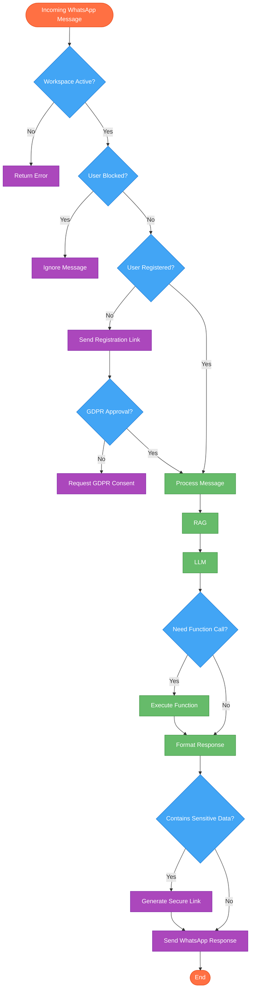

# ShopMe - WhatsApp E-commerce Platform PRD

## Contents
- [About ShopMe](#introduction)
  - [What is ShopMe](#short-description)
  - [Main Benefits](#key-advantages)
  - [Customer Notifications](#push-notifications)
  - [Business Tools](#dashboard-and-surveys)
- [Why Choose ShopMe](#key-differentiators-and-unique-selling-points)
  - [All-in-One Platform](#unified-commerce-and-customer-care-platform)
- [Main Features](#core-functionality)
  - [Multi-Business Support](#1-multi-tenant-business-platform-priority-must-have)
  - [Product Management](#2-products-management-priority-must-have)
  - [Category Organization](#3-categories-management-priority-must-have)
  - [Special Offers](#4-offers-management-priority-should-have)
  - [System Settings](#5-settings-management-priority-must-have)
  - [WhatsApp & AI](#6-whatsapp-ai-integration-priority-must-have)
    - [Data Protection](#7-gdpr-compliance-priority-must-have)
    - [WhatsApp Setup](#whatsapp-business-api-integration)
- [Future Features](#out-of-scope-features-wip)
  - [Order Processing](#orders-management)
  - [Business Insights](#analytics)
  - [Advanced Notifications](#advanced-push-notifications)
  - [Payment Options](#payment-integration)
- [Coming Soon](#minimum-marketable-product-mmp)
  - [Better Order Management](#enhanced-orders-management)
  - [Advanced Business Reports](#advanced-analytics-dashboard)
  - [Complete Payment System](#full-payment-integration)
  - [Team Support](#multi-agent-collaboration)
  - [Smarter AI](#enhanced-ai-capabilities)
  - [System Functions](#function-call-documentation)
- [Support Plans](#monitoring-plans)
  - [Pricing Options](#subscription-plans--pricing)
  - [AI Configuration](#ai-configuration-options)
  - [Basic Support](#1-basic-monitoring-included)
  - [Premium Support](#2-advanced-monitoring-premium)
  - [Enterprise Support](#3-enterprise-monitoring-enterprise)
- [Development Timeline](#development-roadmap)
- [How It Works](#technical-architecture)
- [Example Conversations](#ejemplos-de-conversación)
  - [User Registration](#registro-de-nuevo-usuario)
  - [Product Discovery](#descubrimiento-y-compra-de-productos)
  - [Invoice Requests](#solicitud-de-factura)
  - [Order Tracking](#estado-del-pedido-y-seguimiento)
- [Industry Solutions](#vertical-market-adaptability)
  - [Setup Requirements](#implementation-requirements)
- [System Connections](#api-endpoints)
  - [Access Limits](#api-rate-limiting-implementation)
  - [Login System](#authentication)
  - [Business Areas](#workspace-management)
  - [Product Tools](#product-management)
  - [Category Tools](#category-management)
  - [Customer Tools](#customer-management)
  - [Promotion Tools](#offers-management)
  - [AI Settings](#prompt-management)
  - [WhatsApp Setup](#whatsapp-business-api-integration)
  - [Chat Tools](#chat-management)
  - [Service Tools](#service-management)
- [Data Structure](#data-model)
- [Security Features](#security)
  - [Preventing Misuse](#anti-abuse-system)
  - [Access Control](#rate-limiting-controls)
  - [Data Protection](#data-encryption)
  - [Secure Customer Data](#secure-data-handling-with-tokenization)
  - [Safe Data Handling](#secure-data-processing-workflow)
- [Privacy Compliance](#compliance-and-privacy)
  - [Data Protection Laws](#gdpr-compliance)
  - [Customer Privacy Options](#user-preference-and-account-deletion)
- [Market Analysis](#competitive-analysis)
  - [Industry Overview](#market-overview)
  - [Competitor Comparison](#direct-competitor-comparison)
  - [Our Advantages](#key-differentiators)
  - [Market Needs](#market-gap-addressed)
  - [Industry Trends](#supporting-industry-trends)
  - [Customer Sign-Up](#customer-registration-flow)

## INTRODUCTION

### Short Description
ShopMe is a multilingual SaaS platform (Italian, English, Spanish) that turns WhatsApp into a complete sales channel. Cutomers can create smart chatbots, manage products, receive orders, and send invoices to theri clients without any technical skills. Our AI technology automates customer-care responses, manages push notifications, and offers a 24/7 conversational shopping experience, all directly in the world's most popular messaging app.

All sensitive operations are handled securely through temporary links with security tokens. These links direct customers to our secure website for registration forms, payments, invoices, and accessing personal data. This keeps all sensitive information outside of chat conversations, ensuring data protection while maintaining a smooth customer experience.

### Message Processing Flow

## EJEMPLOS DE CONVERSACIÓN
