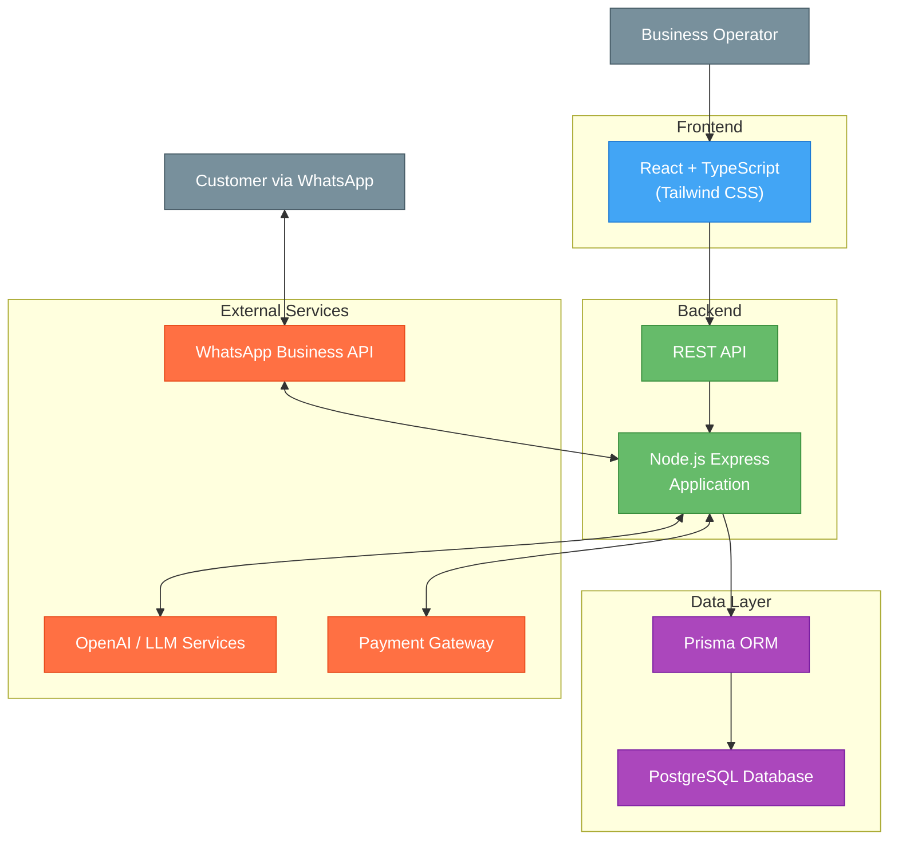

### Architecture Diagram



#### Architecture Pattern and Rationale

ShopMe uses a Domain-Driven Design (DDD) architecture with clean separation of concerns across multiple layers. This architecture was chosen for several reasons:

**Benefits:**

1. **Business Focus**: Places core business concepts at the center of the application, making it easier to align with stakeholder goals
2. **Scalability**: Clear layer separation allows independent scaling of different components
3. **Maintainability**: Well-defined boundaries between layers make the codebase easier to maintain
4. **Testability**: Each layer can be tested in isolation without dependencies on other layers
5. **Flexibility**: External services can be swapped without affecting the core domain logic
6. **Multi-tenant Design**: Supports clean isolation between different businesses on the platform
7. **Security**: Layered approach helps implement security controls at appropriate levels

**Trade-offs:**

1. **Initial Complexity**: More boilerplate and indirection compared to simpler architectures
2. **Learning Curve**: Team members need to understand DDD concepts
3. **Development Speed**: May slow initial development compared to more rapid approaches
4. **Performance Overhead**: Additional abstraction layers can introduce minor performance costs
5. **Decision Overhead**: Requires more architectural decisions during development

The architecture's strengths in maintainability, scalability, and business alignment outweigh these trade-offs for a complex, multi-tenant application like ShopMe that handles sensitive customer data and complex business processes.

### Database
- **Primary Database**: PostgreSQL
- **ORM**: Prisma for type-safe database access
- **Migrations**: Prisma Migration for version control
- **Backup Strategy**: Automated daily backups with point-in-time recovery

### Authentication and Token Management

Our system uses JWT (JSON Web Token) authentication to keep user accounts secure. Here's how it works:

#### Token Types and Security Features

| Token Type | Duration | Storage | Purpose |
|------------|----------|---------|---------|
| Access Token | 1 hour | HTTP-only cookie | Authorizes API calls |
| Refresh Token | 7 days | HTTP-only cookie | Gets new access tokens |

#### How Our System Protects Your Account

We implement multiple security layers to protect user accounts:
- We rotate secret keys regularly to prevent compromise
- We sign tokens with HS256 algorithm for integrity verification
- We include only essential information in token payloads
- We validate token sources through HTTP headers
- We enforce rate limits on all token-related endpoints

#### Permission System

Our role-based access control system includes:

| Role | Access Level | Example Permissions |
|------|--------------|---------------------|
| Admin | Full access | Manage all workspaces, users, and settings |
| Manager | Workspace management | Manage products, orders, and team members |
| Agent | Customer service | Handle customer chats and process orders |

We scope all permissions to specific workspaces, ensuring data isolation between different businesses.

#### Secure Operations with Temporary Links

For sensitive operations like payments, we create secure, time-limited links:

```
Example Flow:
1. Customer wants to complete purchase in WhatsApp chat
2. System generates unique temporary token: "pay_ord_b1f493a2" (valid for 1 hour)
3. System sends link: "https://pay.shopme.com/checkout/pay_ord_b1f493a2"
4. Customer clicks link and is taken to secure payment page
5. After payment, system verifies token, processes payment, and invalidates token
6. System confirms successful payment in WhatsApp chat
```

These tokens contain encrypted information about the operation type, resources involved, and expiration time. We verify tokens before allowing any access to sensitive data or operations.

### Domain-Driven Design Architecture

The backend follows a Domain-Driven Design (DDD) architecture as specified in the project's ARCHITECTURE.md:

- **Layer Separation**:
  - **Domain Layer**: Core business entities and rules
  - **Application Layer**: Use cases and application services
  - **Infrastructure Layer**: Technical implementations and external services
  - **Interfaces Layer**: API controllers and routes

- **Key Design Principles**:
  - Business domain at the center of design
  - Clear boundaries between layers
  - Repository pattern for data access
  - Dependency inversion principle

- **Data Flows**:
  - External requests enter through Interfaces layer
  - Controllers delegate to Application services
  - Application services orchestrate Domain entities
  - Infrastructure layer handles persistence and external communications

- **Testing Approach**:
  - Unit tests for domain logic
  - Integration tests for application services
  - End-to-end tests for API endpoints

### Project Structure

The project is organized as a monorepo using Turborepo for efficient management of multiple packages:

#### Backend Structure

```
/backend
  /src
    /domain                # Core business logic
      /entities            # Business models
      /repositories        # Data access interfaces
      /value-objects       # Immutable value objects
    /application           # Application logic
      /services            # Business orchestration
      /use-cases           # Specific features
      /dto                 # Data transfer objects
    /infrastructure        # Technical implementations
      /repositories        # Database access
      /persistence         # ORM configurations
      /external-services   # 3rd party integrations
    /interfaces            # External interfaces
      /http
        /controllers       # Request handlers
        /routes            # API routes
      /websockets          # WebSocket handlers
    /config                # Configuration settings
    /utils                 # Utility functions
  /tests
    /unit                  # Unit tests
    /integration           # Integration tests
    /e2e                   # End-to-end tests
  /prisma                  # Prisma schema and migrations
  /scripts                 # Build and deployment scripts
```

#### Frontend Structure

```
/frontend
  /src
    /components
      /shared              # Reusable components
      /layout              # Layout components
      /forms               # Form components
      /ui                  # UI primitives
    /hooks                 # Custom React hooks
    /pages                 # Page components
    /contexts              # React contexts
    /services              # API services
    /utils                 # Utility functions
    /types                 # TypeScript type definitions
    /styles                # Global styles
    /assets                # Images, fonts, etc.
  /public                  # Static assets
  /tests                   # Frontend tests
```

### Database Seeding and Migrations

The platform includes a robust database initialization and seeding strategy:

- **Migration Strategy**:
  - Prisma Migration for schema version control
  - Separate migration files for each schema change
  - Sequential migration versioning with timestamps
  - Environment-specific migrations when needed

- **Data Seeding**:
  - Development environment seeding for testing
  - Sample data generation for demo workspaces
  - Seed data categorized by entity types
  - Multi-tenant seed data with workspace isolation
  - Customizable seed data volume

- **Seed Data Categories**:
  - Administrative users with predefined roles
  - Sample product catalog with categories
  - Customer profiles with diverse characteristics
  - Sample chat history and message content
  - Predefined AI prompts and configurations
  - Demo orders with various statuses

### Additional Technical Considerations

- **Error Handling**:
  - Centralized error handling middleware
  - Standardized API error responses
  - Custom error classes for domain-specific errors
  - Client-friendly error messages with internal logging

- **Logging**:
  - Structured logging with Winston
  - Log levels (debug, info, warn, error)
  - Request ID tracking across services
  - Redaction of sensitive information

- **Performance Optimization**:
  - Response caching strategies
  - Database query optimization
  - Connection pooling
  - Asset compression and delivery

- **Deployment Pipeline**:
  - CI/CD integration with GitHub Actions
  - Automated testing before deployment
  - Staged deployment environments
  - Blue-green deployment for zero downtime
  - Rollback capabilities for failed deployments

## MONITORING PLANS

