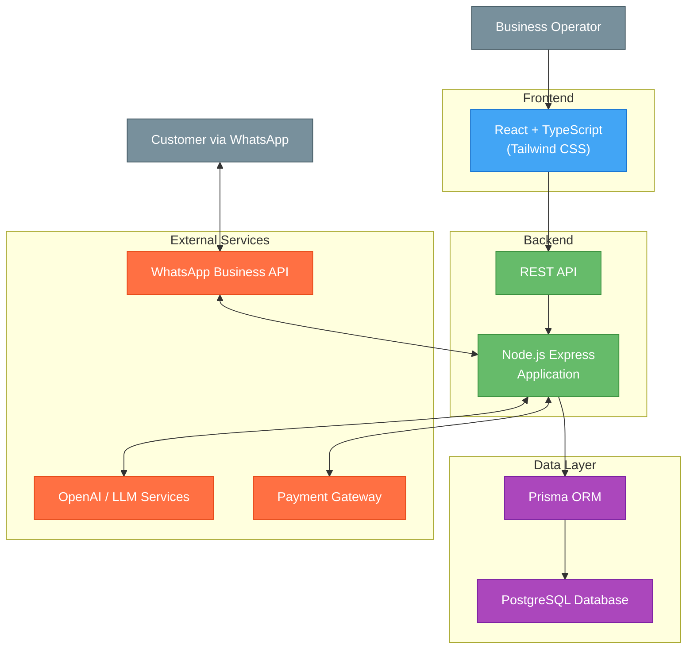

- `GET /api/customers/:id/orders`
  - **Description**: Gets customer's order history
  - **Parameters**: 
    - `id` (required): Customer ID
    - `status` (optional): Filter by order status
    - `page`, `limit` (optional): Pagination parameters
  - **Returns**: Customer's orders

- `GET /api/customers/:id/conversations`
  - **Description**: Gets customer's conversation history
  - **Parameters**: 
    - `id` (required): Customer ID
    - `page`, `limit` (optional): Pagination parameters
  - **Returns**: Customer's WhatsApp conversations

### Offers Management

- `GET /api/offers`
  - **Description**: Retrieves offers and promotions list
  - **Parameters**: 
    - `workspace_id` (required): Workspace identifier
    - `status` (optional): Filter by active, upcoming, or expired
    - `page`, `limit` (optional): Pagination parameters
  - **Returns**: List of offers with details

- `POST /api/offers`
  - **Description**: Creates a new offer
  - **Body**: 
    - `name`: Offer name
    - `description`: Offer description 
    - `offer_type`: Discount type (percentage, fixed, buy_x_get_y)
    - `discount_value`: Value of discount
    - `products`: List of applicable product IDs
    - `categories`: List of applicable category IDs
    - `start_date`: Offer start date
    - `end_date`: Offer end date
    - `min_purchase`: Minimum purchase requirement
    - `usage_limit`: Maximum redemptions allowed
    - `code`: Promo code (optional)
  - **Returns**: Created offer details

- `GET /api/offers/:id`
  - **Description**: Gets details of a specific offer
  - **Parameters**: `id` (required): Offer ID
  - **Returns**: Complete offer details including usage statistics

- `PUT /api/offers/:id`
  - **Description**: Updates an offer
  - **Parameters**: `id` (required): Offer ID
  - **Body**: Fields to update
  - **Returns**: Updated offer

- `DELETE /api/offers/:id`
  - **Description**: Deletes an offer
  - **Parameters**: `id` (required): Offer ID
  - **Returns**: Deletion confirmation

- `POST /api/offers/:id/activate`
  - **Description**: Activates an offer
  - **Parameters**: `id` (required): Offer ID
  - **Returns**: Activated offer status

- `POST /api/offers/:id/deactivate`
  - **Description**: Deactivates an offer
  - **Parameters**: `id` (required): Offer ID
  - **Returns**: Deactivated offer status

- `GET /api/offers/validate/:code`
  - **Description**: Validates a promo code
  - **Parameters**: 
    - `code` (required): Promo code to validate
    - `customer_id` (optional): Customer trying to use code
    - `cart_value` (optional): Current cart value
  - **Returns**: Offer validity and applicable discount

## VERTICAL MARKET ADAPTABILITY

The platform is designed to be adaptable to various vertical markets with minimal customization requirements. Each vertical adaptation includes:

### Implementation Requirements

1. **Specialized Vocabulary**: Industry-specific terminology training for the AI
2. **Custom Product Attributes**: Specialized fields for each vertical (e.g., nutrients for food, sizes for apparel)
3. **Vertical-Specific Functions**: Custom function calls for industry processes
4. **Integration Points**: Connections to industry-standard software
5. **Visual Elements**: Industry-appropriate templates for rich media cards and responses

The platform's modular architecture ensures these adaptations can be implemented quickly, typically within 2-4 weeks for a new vertical market launch.

## OUT OF SCOPE FEATURES (WIP)

The following features are currently marked as "Work in Progress" and are outside the scope of the initial release:

### Orders Management
- Order processing and tracking
- Order status management
- Invoice generation and management
- Shipping integration and tracking
- Returns and refund processing

### Analytics
- Real-time analytics dashboard
- Custom report generation
- Data visualization tools
- Export capabilities
- Performance metrics and KPIs

### Advanced Push Notifications
- A/B testing for notification content
- Advanced segmentation based on behavior
- Rich media notifications
- Location-based targeting
- Frequency optimization

### Payment Integration
- Integrated payment processing
- Payment plan implementation
- Subscription management
- Payment gateway integration
- Fraud prevention tools

## MINIMUM MARKETABLE PRODUCT (MMP)

The following features are planned for the MMP phase, after the initial MVP release:

### Enhanced Orders Management
- Complete order lifecycle management
- Order fulfillment workflows
- Custom order statuses
- Automated order notifications
- Bulk order processing capabilities

### Advanced Analytics Dashboard
- Customer behavior analysis
- Conversion funnel visualization
- Revenue and sales performance tracking
- Chat quality and sentiment analysis
- Custom report builder with export options

### Full Payment Integration
- Multiple payment gateway integrations
- Saved payment methods for customers
- Subscription and recurring payment handling
- Advanced fraud detection and prevention
- Automated refund processing

### Multi-Agent Collaboration
- Team inbox with shared conversation access
- Agent routing and assignment rules
- Supervisor monitoring and intervention tools
- Agent performance metrics and reporting
- Shift management and availability tracking

### Enhanced AI Capabilities
- Advanced sentiment analysis and emotional intelligence
- Proactive customer outreach based on behavior
- Personalized product recommendations based on preferences
- Automated follow-up sequences for abandoned carts
- A/B testing of different AI prompts and approaches

### Function Call Documentation

The system implements several AI function calls to handle specific operations:

```
+-------------------------+--------------------------------------+----------------+
| FUNCTION NAME           | DESCRIPTION                          | STATUS         |
+-------------------------+--------------------------------------+----------------+
| get_product_info        | Get details about a specific product | Implemented    |
+-------------------------+--------------------------------------+----------------+
| get_event_by_date       | Get events scheduled for a date      | Implemented    |
+-------------------------+--------------------------------------+----------------+
| get_service_info        | Get details about a specific service | Implemented    |
+-------------------------+--------------------------------------+----------------+
| welcome_user            | Generate welcome message for users   | Implemented    |
+-------------------------+--------------------------------------+----------------+
| create_order            | Create a new order from cart items   | Implemented    |
+-------------------------+--------------------------------------+----------------+
| get_cart_info           | Get contents of a user's cart        | Implemented    |
+-------------------------+--------------------------------------+----------------+
| get_order_status        | Check status of specific order       | Implemented    |
+-------------------------+--------------------------------------+----------------+
| add_to_cart             | Add product to shopping cart         | Implemented    |
+-------------------------+--------------------------------------+----------------+
| remove_from_cart        | Remove product from shopping cart    | Implemented    |
+-------------------------+--------------------------------------+----------------+
| get_product_list        | Get list of available products       | Implemented    |
+-------------------------+--------------------------------------+----------------+
| get_products_by_category| Get products filtered by category    | Planned        |
+-------------------------+--------------------------------------+----------------+
| get_categories          | Get list of all product categories   | Planned        |
+-------------------------+--------------------------------------+----------------+
| get_faq_info            | Get information from FAQ database    | Implemented    |
+-------------------------+--------------------------------------+----------------+
| get_generic_response    | Handle general conversation/fallback | Implemented    |
+-------------------------+--------------------------------------+----------------+
```

Additional function calls planned for the MMP phase:

```
+-------------------------+--------------------------------------+----------------+
| FUNCTION NAME           | DESCRIPTION                          | STATUS         |
+-------------------------+--------------------------------------+----------------+
| checkOrderStatus        | Get detailed order status info       | Planned for MMP|
+-------------------------+--------------------------------------+----------------+
| listRecentOrders        | List customer's most recent orders   | Planned for MMP|
+-------------------------+--------------------------------------+----------------+
| orderDetails            | Get complete order details           | Planned for MMP|
+-------------------------+--------------------------------------+----------------+
| trackShipment           | Get real-time shipping information   | Planned for MMP|
+-------------------------+--------------------------------------+----------------+
| requestInvoice          | Generate and send order invoice      | Planned for MMP|
+-------------------------+--------------------------------------+----------------+
| listInvoices            | List available customer invoices     | Planned for MMP|
+-------------------------+--------------------------------------+----------------+
| downloadInvoice         | Generate invoice download link       | Planned for MMP|
+-------------------------+--------------------------------------+----------------+
| changeInvoiceAddress    | Update invoice billing details       | Planned for MMP|
+-------------------------+--------------------------------------+----------------+
```

## TECHNICAL ARCHITECTURE

### Architecture Diagram



#### Architecture Pattern and Rationale

ShopMe uses a Domain-Driven Design (DDD) architecture with clean separation of concerns across multiple layers. This architecture was chosen for several reasons:

**Benefits:**

1. **Business Focus**: Places core business concepts at the center of the application, making it easier to align with stakeholder goals
2. **Scalability**: Clear layer separation allows independent scaling of different components
3. **Maintainability**: Well-defined boundaries between layers make the codebase easier to maintain
4. **Testability**: Each layer can be tested in isolation without dependencies on other layers
5. **Flexibility**: External services can be swapped without affecting the core domain logic
6. **Multi-tenant Design**: Supports clean isolation between different businesses on the platform
7. **Security**: Layered approach helps implement security controls at appropriate levels

**Trade-offs:**

1. **Initial Complexity**: More boilerplate and indirection compared to simpler architectures
2. **Learning Curve**: Team members need to understand DDD concepts
3. **Development Speed**: May slow initial development compared to more rapid approaches
4. **Performance Overhead**: Additional abstraction layers can introduce minor performance costs
5. **Decision Overhead**: Requires more architectural decisions during development

The architecture's strengths in maintainability, scalability, and business alignment outweigh these trade-offs for a complex, multi-tenant application like ShopMe that handles sensitive customer data and complex business processes.

### Database
- **Primary Database**: PostgreSQL
- **ORM**: Prisma for type-safe database access
- **Migrations**: Prisma Migration for version control
- **Backup Strategy**: Automated daily backups with point-in-time recovery

### Authentication and Token Management

Our system uses JWT (JSON Web Token) authentication to keep user accounts secure. Here's how it works:

#### Token Types and Security Features

| Token Type | Duration | Storage | Purpose |
|------------|----------|---------|---------|
| Access Token | 1 hour | HTTP-only cookie | Authorizes API calls |
| Refresh Token | 7 days | HTTP-only cookie | Gets new access tokens |

#### How Our System Protects Your Account

We implement multiple security layers to protect user accounts:
- We rotate secret keys regularly to prevent compromise
- We sign tokens with HS256 algorithm for integrity verification
- We include only essential information in token payloads
- We validate token sources through HTTP headers
- We enforce rate limits on all token-related endpoints

#### Permission System
