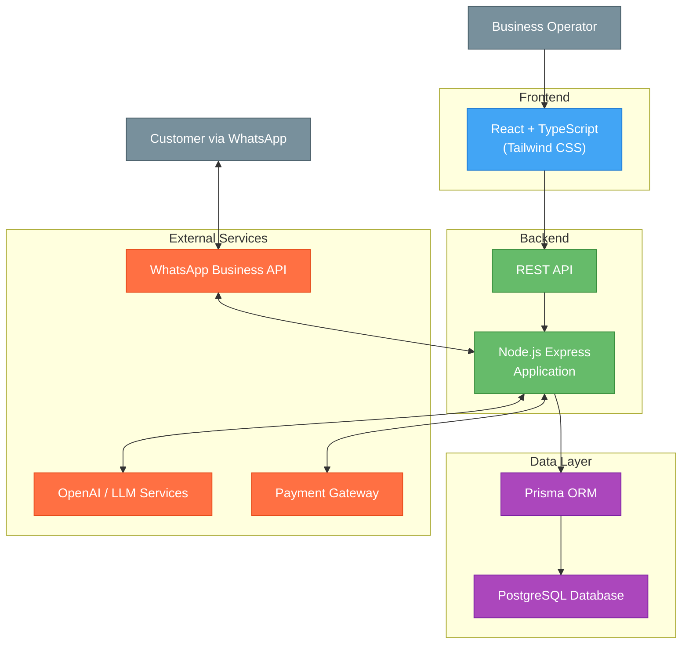

Our role-based access control system includes:

| Role | Access Level | Example Permissions |
|------|--------------|---------------------|
| Admin | Full access | Manage all workspaces, users, and settings |
| Manager | Workspace management | Manage products, orders, and team members |
| Agent | Customer service | Handle customer chats and process orders |

We scope all permissions to specific workspaces, ensuring data isolation between different businesses.

#### Secure Operations with Temporary Links

For sensitive operations like payments, we create secure, time-limited links:

```
Example Flow:
1. Customer wants to complete purchase in WhatsApp chat
2. System generates unique temporary token: "pay_ord_b1f493a2" (valid for 1 hour)
3. System sends link: "https://pay.shopme.com/checkout/pay_ord_b1f493a2"
4. Customer clicks link and is taken to secure payment page
5. After payment, system verifies token, processes payment, and invalidates token
6. System confirms successful payment in WhatsApp chat
```

These tokens contain encrypted information about the operation type, resources involved, and expiration time. We verify tokens before allowing any access to sensitive data or operations.

### Domain-Driven Design Architecture

The backend follows a Domain-Driven Design (DDD) architecture as specified in the project's ARCHITECTURE.md:

- **Layer Separation**:
  - **Domain Layer**: Core business entities and rules
  - **Application Layer**: Use cases and application services
  - **Infrastructure Layer**: Technical implementations and external services
  - **Interfaces Layer**: API controllers and routes

- **Key Design Principles**:
  - Business domain at the center of design
  - Clear boundaries between layers
  - Repository pattern for data access
  - Dependency inversion principle

- **Data Flows**:
  - External requests enter through Interfaces layer
  - Controllers delegate to Application services
  - Application services orchestrate Domain entities
  - Infrastructure layer handles persistence and external communications

- **Testing Approach**:
  - Unit tests for domain logic
  - Integration tests for application services
  - End-to-end tests for API endpoints

### Project Structure

The project is organized as a monorepo using Turborepo for efficient management of multiple packages:

#### Backend Structure

```
/backend
  /src
    /domain                # Core business logic
      /entities            # Business models
      /repositories        # Data access interfaces
      /value-objects       # Immutable value objects
    /application           # Application logic
      /services            # Business orchestration
      /use-cases           # Specific features
      /dto                 # Data transfer objects
    /infrastructure        # Technical implementations
      /repositories        # Database access
      /persistence         # ORM configurations
      /external-services   # 3rd party integrations
    /interfaces            # External interfaces
      /http
        /controllers       # Request handlers
        /routes            # API routes
      /websockets          # WebSocket handlers
    /config                # Configuration settings
    /utils                 # Utility functions
  /tests
    /unit                  # Unit tests
    /integration           # Integration tests
    /e2e                   # End-to-end tests
  /prisma                  # Prisma schema and migrations
  /scripts                 # Build and deployment scripts
```

#### Frontend Structure

```
/frontend
  /src
    /components
      /shared              # Reusable components
      /layout              # Layout components
      /forms               # Form components
      /ui                  # UI primitives
    /hooks                 # Custom React hooks
    /pages                 # Page components
    /contexts              # React contexts
    /services              # API services
    /utils                 # Utility functions
    /types                 # TypeScript type definitions
    /styles                # Global styles
    /assets                # Images, fonts, etc.
  /public                  # Static assets
  /tests                   # Frontend tests
```

### Database Seeding and Migrations

The platform includes a robust database initialization and seeding strategy:

- **Migration Strategy**:
  - Prisma Migration for schema version control
  - Separate migration files for each schema change
  - Sequential migration versioning with timestamps
  - Environment-specific migrations when needed

- **Data Seeding**:
  - Development environment seeding for testing
  - Sample data generation for demo workspaces
  - Seed data categorized by entity types
  - Multi-tenant seed data with workspace isolation
  - Customizable seed data volume

- **Seed Data Categories**:
  - Administrative users with predefined roles
  - Sample product catalog with categories
  - Customer profiles with diverse characteristics
  - Sample chat history and message content
  - Predefined AI prompts and configurations
  - Demo orders with various statuses

### Additional Technical Considerations

- **Error Handling**:
  - Centralized error handling middleware
  - Standardized API error responses
  - Custom error classes for domain-specific errors
  - Client-friendly error messages with internal logging

- **Logging**:
  - Structured logging with Winston
  - Log levels (debug, info, warn, error)
  - Request ID tracking across services
  - Redaction of sensitive information

- **Performance Optimization**:
  - Response caching strategies
  - Database query optimization
  - Connection pooling
  - Asset compression and delivery

- **Deployment Pipeline**:
  - CI/CD integration with GitHub Actions
  - Automated testing before deployment
  - Staged deployment environments
  - Blue-green deployment for zero downtime
  - Rollback capabilities for failed deployments

## MONITORING PLANS

### Subscription Plans & Pricing

#### 1. Basic Plan (€49/month)
- **Features**:
  - Single WhatsApp number connection
  - Up to 1,000 AI-powered messages/month
  - Maximum 5 products/services
  - Standard response time (24h)
  - Basic analytics dashboard
  - Email support
- **Best For**: Small businesses just starting with conversational commerce

#### 2. Professional Plan (€149/month)
- **Features**:
  - Up to 3 WhatsApp number connections
  - Up to 5,000 AI-powered messages/month
  - Maximum 100 products/services
  - Priority response time (12h)
  - Advanced analytics and reporting
  - Phone and email support
  - Custom AI training
- **Best For**: Growing businesses with established product catalogs

#### 3. Enterprise Plan (Custom pricing)
- **Features**:
  - Unlimited WhatsApp number connections
  - Custom AI message volume
  - Unlimited products/services
  - Dedicated response team (4h SLA)
  - Full API access
  - White-label options
  - Dedicated account manager
  - Custom integrations
  - On-premises deployment option
- **Best For**: Large organizations with complex needs and high volume requirements

All plans include:
- GDPR compliance tools
- Security monitoring
- Regular platform updates
- Knowledge base access

### AI Configuration Options

Under each plan, businesses can customize their AI agent with the following parameters:

| Parameter | Description | Default Value | Available Options |
|-----------|-------------|--------------|-------------------|
| **Model Selection** | AI model used for responses | GPT-3.5-turbo | GPT-4, Claude, Mistral, Llama |
| **Temperature** | Response creativity level | 0.7 | 0.1-1.0 in 0.1 increments |
| **Max Tokens** | Maximum response length | 250 | 50-1000 |
| **Top-P** | Nucleus sampling threshold | 0.95 | 0.5-1.0 |
| **Top-K** | Number of highest probability tokens to consider | 40 | 10-100 |
| **System Prompt** | Base instructions for AI | Basic retail template | Custom templates available |
| **Memory Context** | Number of previous messages to include | 10 | 1-20 |
| **Response Speed** | Balance between quality and speed | Balanced | Fast, Balanced, Quality |

Professional and Enterprise plans allow for A/B testing of different AI configurations and provide tools to analyze which settings deliver the best customer experience and conversion rates.

### 1. Basic Monitoring (Included)
- Standard usage metrics
- Basic incident reporting
- Daily status reports
- Error logging
- Performance alerts
- Monthly summary reports
- Online support portal

### 2. Advanced Monitoring (Premium)
- Real-time dashboard
- Custom alert thresholds
- 24/7 incident response
- Detailed performance analytics
- SLA guarantees
- Weekly executive reports
- Dedicated support manager

### 3. Enterprise Monitoring (Enterprise)
- High-availability monitoring
- Custom metrics integration
- Priority incident response
- Comprehensive security monitoring
- Advanced threat detection
- Custom metrics and KPIs
- Business impact analysis
- 24/7 monitoring team
- Monthly executive reports
- Predictive analytics for resource planning

## DEVELOPMENT ROADMAP

### Phase 1: Core Data Management (Months 1-2)
- Complete CRUD functionality for all core entities:
  - Products and services catalog
  - Categories and subcategories
  - Languages and localization
  - AI agents configuration
  - Offers and promotions
  - Chat history and logs
  - GDPR compliance tools
- Multi-tenant workspace architecture
- User role management and permissions
- Basic admin interface

### Phase 2: Communication Platform (Months 3-4)
- WhatsApp API integration and playground
- Chat flow builder and conversation design tools
- Administrative dashboard with basic analytics
- Customer survey and feedback system
- Conversation templates library
- Conversation testing environment
- Basic RAG implementation for knowledge retrieval
- AI model selection and configuration

### Phase 3: Monetization & Notifications (Months 5-6)
- Payment gateway integration
- Invoice generation system
- Push notification infrastructure
- Notification templates and scheduling
- Initial deployment with limited customer base
- Beta testing program with select businesses
- Performance optimization
- Security hardening

### Phase 4: Marketing & MMP Enhancements (Months 7-8)
- Marketing automation tools
- Enhanced analytics dashboard
- Customer segmentation capabilities
- Campaign management tools
- Minimum Marketable Product (MMP) feature set
- Enhanced AI capabilities
- Initial vertical market adaptations
- Integration marketplace

### Phase 5: Full Deployment & Quality Assurance (Months 9-10)
- Comprehensive end-to-end testing
- Performance benchmarking
- Security audits and penetration testing
- Scalability improvements
- Documentation completion
- Support system implementation
- Staff training programs
- Full public launch

## API ENDPOINTS

### API Rate Limiting Implementation

We protect all API endpoints with smart rate limiting to keep the system stable and prevent misuse:

| Feature | Description | Benefit |
|---------|-------------|---------|
| **User Limits** | 30 requests per minute per user | Prevents any single user from overloading the system |
| **Workspace Quotas** | Customizable daily limits per business | Allows businesses to manage their API usage |
| **Smart Throttling** | Different limits for different endpoints | Prioritizes critical operations over less important ones |

#### How You'll Know About Limits

Our API includes helpful response headers that tell you about your usage:

| Header | What It Shows | Example |
|--------|---------------|---------|
| `X-RateLimit-Limit` | Maximum allowed requests | `X-RateLimit-Limit: 30` |
| `X-RateLimit-Remaining` | Requests left in current period | `X-RateLimit-Remaining: 28` |
| `X-RateLimit-Reset` | Seconds until limit resets | `X-RateLimit-Reset: 45` |

When you reach a limit, our system:
1. Returns a `429 Too Many Requests` status code
2. Sends a JSON response explaining the issue
3. Includes a `Retry-After` header telling you when to try again

Business owners can adjust these limits in their workspace settings, with options to set different limits for various API operations or temporarily increase limits during high-traffic periods.

### Authentication

- `POST /api/auth/login`

  - **Description**: Authenticates a user and returns a JWT token
  - **Body**: `email`, `password`
  - **Returns**: JWT token, user information

- `POST /api/auth/logout`

  - **Description**: Logs out the current user
  - **Headers**: `Authorization` with JWT token
  - **Returns**: Success message

- `GET /api/auth/me`

  - **Description**: Gets the authenticated user's information
  - **Headers**: `Authorization` with JWT token
  - **Returns**: User profile information

### Workspace Management

- `GET /api/workspaces`

  - **Description**: Retrieves all workspaces accessible to the user
  - **Headers**: `Authorization` with JWT token
  - **Returns**: List of workspaces with access

- `POST /api/workspaces`

  - **Description**: Creates a new workspace
  - **Body**: `name`, `description`, `settings`
  - **Returns**: Created workspace details

- `GET /api/workspaces/:id`

  - **Description**: Gets details of a specific workspace
  - **Parameters**: `id` (required): Workspace identifier
  - **Returns**: Complete workspace details

- `PUT /api/workspaces/:id`

  - **Description**: Updates a workspace's information
  - **Parameters**: `id` (required): Workspace identifier
  - **Body**: Fields to update
  - **Returns**: Updated workspace

- `DELETE /api/workspaces/:id`

  - **Description**: Deletes a workspace
  - **Parameters**: `id` (required): Workspace identifier
  - **Returns**: Deletion confirmation

### Product Management

- `GET /api/products`
  - **Description**: Retrieves product list with filtering options
  - **Parameters**: 
    - `workspace_id` (required): Workspace identifier
    - `category_id` (optional): Filter by category
    - `page`, `limit` (optional): Pagination parameters
    - `search` (optional): Search by product name or description
    - `sort` (optional): Sort by price, name, created_at, etc.
    - `order` (optional): asc or desc
  - **Returns**: Paginated list of products with metadata

- `POST /api/products`
  - **Description**: Creates a new product
  - **Body**: `name`, `description`, `price`, `category_id`, `images`, `stock`, `attributes`, `tax_rate`, `sku`, `barcode`
  - **Returns**: Created product details

- `GET /api/products/:id`
  - **Description**: Gets details of a specific product
  - **Parameters**: `id` (required): Product ID
  - **Returns**: Complete product details including variants and related products

- `PUT /api/products/:id`
  - **Description**: Updates a product
  - **Parameters**: `id` (required): Product ID
  - **Body**: Fields to update
  - **Returns**: Updated product

- `DELETE /api/products/:id`
  - **Description**: Deletes a product
  - **Parameters**: `id` (required): Product ID
  - **Returns**: Deletion confirmation

- `POST /api/products/:id/images`
  - **Description**: Uploads product images
  - **Parameters**: `id` (required): Product ID
  - **Body**: Image files (multipart/form-data)
  - **Returns**: Updated product with image URLs

- `DELETE /api/products/:id/images/:image_id`
  - **Description**: Removes a product image
  - **Parameters**: 
    - `id` (required): Product ID
    - `image_id` (required): Image ID to delete
  - **Returns**: Updated product images

### Category Management

- `GET /api/categories`
  - **Description**: Retrieves category list
  - **Parameters**: 
    - `workspace_id` (required): Workspace identifier
    - `parent_id` (optional): Filter by parent category
    - `include_products` (optional): Include product count
  - **Returns**: List of categories with hierarchical structure

- `POST /api/categories`
  - **Description**: Creates a new category
  - **Body**: `name`, `description`, `parent_id`, `image`, `display_order`
  - **Returns**: Created category details

- `GET /api/categories/:id`
  - **Description**: Gets details of a specific category
  - **Parameters**: `id` (required): Category ID
  - **Returns**: Category details with optional child categories

- `PUT /api/categories/:id`
  - **Description**: Updates a category
  - **Parameters**: `id` (required): Category ID
  - **Body**: Fields to update
  - **Returns**: Updated category

- `DELETE /api/categories/:id`
  - **Description**: Deletes a category
  - **Parameters**: `id` (required): Category ID
  - **Returns**: Deletion confirmation

- `GET /api/categories/:id/products`
  - **Description**: Gets all products in a category
  - **Parameters**: 
    - `id` (required): Category ID
    - `include_subcategories` (optional): Include products from subcategories
    - `page`, `limit` (optional): Pagination parameters
  - **Returns**: Products in the category

### Customer Management

- `GET /api/customers`
  - **Description**: Retrieves customer list
  - **Parameters**: 
    - `workspace_id` (required): Workspace identifier
    - `page`, `limit` (optional): Pagination parameters
    - `search` (optional): Search by name, email, or phone
    - `sort` (optional): Sort by created_at, name, etc.
  - **Returns**: Paginated list of customers

- `POST /api/customers`
  - **Description**: Creates a new customer
  - **Body**: `name`, `email`, `phone`, `whatsapp_id`, `address`, `notes`, `custom_fields`
  - **Returns**: Created customer details

- `GET /api/customers/:id`
  - **Description**: Gets details of a specific customer
  - **Parameters**: `id` (required): Customer ID
  - **Returns**: Complete customer details including order history

- `PUT /api/customers/:id`
  - **Description**: Updates a customer
  - **Parameters**: `id` (required): Customer ID
  - **Body**: Fields to update
  - **Returns**: Updated customer

- `DELETE /api/customers/:id`
  - **Description**: Deletes a customer
  - **Parameters**: `id` (required): Customer ID
  - **Returns**: Deletion confirmation

- `GET /api/customers/:id/orders`
  - **Description**: Gets customer's order history
  - **Parameters**: 
    - `id` (required): Customer ID
    - `status` (optional): Filter by order status
    - `page`, `limit` (optional): Pagination parameters
  - **Returns**: Customer's orders

- `GET /api/customers/:id/conversations`
  - **Description**: Gets customer's conversation history
  - **Parameters**: 
    - `id` (required): Customer ID
    - `page`, `limit` (optional): Pagination parameters
  - **Returns**: Customer's WhatsApp conversations

### Offers Management

- `GET /api/offers`
  - **Description**: Retrieves offers and promotions list
  - **Parameters**: 
    - `workspace_id` (required): Workspace identifier
    - `status` (optional): Filter by active, upcoming, or expired
    - `page`, `limit` (optional): Pagination parameters
  - **Returns**: List of offers with details

- `POST /api/offers`
  - **Description**: Creates a new offer
  - **Body**: 
    - `name`: Offer name
    - `description`: Offer description 
    - `offer_type`: Discount type (percentage, fixed, buy_x_get_y)
    - `discount_value`: Value of discount
    - `products`: List of applicable product IDs
    - `categories`: List of applicable category IDs
    - `start_date`: Offer start date
    - `end_date`: Offer end date
    - `min_purchase`: Minimum purchase requirement
    - `usage_limit`: Maximum redemptions allowed
    - `code`: Promo code (optional)
  - **Returns**: Created offer details

- `GET /api/offers/:id`
  - **Description**: Gets details of a specific offer
  - **Parameters**: `id` (required): Offer ID
  - **Returns**: Complete offer details including usage statistics

- `PUT /api/offers/:id`
  - **Description**: Updates an offer
  - **Parameters**: `id` (required): Offer ID
  - **Body**: Fields to update
  - **Returns**: Updated offer

- `DELETE /api/offers/:id`
  - **Description**: Deletes an offer
  - **Parameters**: `id` (required): Offer ID
  - **Returns**: Deletion confirmation

- `POST /api/offers/:id/activate`
  - **Description**: Activates an offer
  - **Parameters**: `id` (required): Offer ID
  - **Returns**: Activated offer status

- `POST /api/offers/:id/deactivate`
  - **Description**: Deactivates an offer
  - **Parameters**: `id` (required): Offer ID
  - **Returns**: Deactivated offer status

- `GET /api/offers/validate/:code`
  - **Description**: Validates a promo code
  - **Parameters**: 
    - `code` (required): Promo code to validate
    - `customer_id` (optional): Customer trying to use code
    - `cart_value` (optional): Current cart value
  - **Returns**: Offer validity and applicable discount

## VERTICAL MARKET ADAPTABILITY

The platform is designed to be adaptable to various vertical markets with minimal customization requirements. Each vertical adaptation includes:

### Implementation Requirements

1. **Specialized Vocabulary**: Industry-specific terminology training for the AI
2. **Custom Product Attributes**: Specialized fields for each vertical (e.g., nutrients for food, sizes for apparel)
3. **Vertical-Specific Functions**: Custom function calls for industry processes
4. **Integration Points**: Connections to industry-standard software
5. **Visual Elements**: Industry-appropriate templates for rich media cards and responses

The platform's modular architecture ensures these adaptations can be implemented quickly, typically within 2-4 weeks for a new vertical market launch.

## OUT OF SCOPE FEATURES (WIP)

The following features are currently marked as "Work in Progress" and are outside the scope of the initial release:

### Orders Management
- Order processing and tracking
- Order status management
- Invoice generation and management
- Shipping integration and tracking
- Returns and refund processing

### Analytics
- Real-time analytics dashboard
- Custom report generation
- Data visualization tools
- Export capabilities
- Performance metrics and KPIs

### Advanced Push Notifications
- A/B testing for notification content
- Advanced segmentation based on behavior
- Rich media notifications
- Location-based targeting
- Frequency optimization

### Payment Integration
- Integrated payment processing
- Payment plan implementation
- Subscription management
- Payment gateway integration
- Fraud prevention tools

## MINIMUM MARKETABLE PRODUCT (MMP)

The following features are planned for the MMP phase, after the initial MVP release:

### Enhanced Orders Management
- Complete order lifecycle management
- Order fulfillment workflows
- Custom order statuses
- Automated order notifications
- Bulk order processing capabilities

### Advanced Analytics Dashboard
- Customer behavior analysis
- Conversion funnel visualization
- Revenue and sales performance tracking
- Chat quality and sentiment analysis
- Custom report builder with export options

### Full Payment Integration
- Multiple payment gateway integrations
- Saved payment methods for customers
- Subscription and recurring payment handling
- Advanced fraud detection and prevention
- Automated refund processing

### Multi-Agent Collaboration
- Team inbox with shared conversation access
- Agent routing and assignment rules
- Supervisor monitoring and intervention tools
- Agent performance metrics and reporting
- Shift management and availability tracking

### Enhanced AI Capabilities
- Advanced sentiment analysis and emotional intelligence
- Proactive customer outreach based on behavior
- Personalized product recommendations based on preferences
- Automated follow-up sequences for abandoned carts
- A/B testing of different AI prompts and approaches

### Function Call Documentation

The system implements several AI function calls to handle specific operations:

```
+-------------------------+--------------------------------------+----------------+
| FUNCTION NAME           | DESCRIPTION                          | STATUS         |
+-------------------------+--------------------------------------+----------------+
| get_product_info        | Get details about a specific product | Implemented    |
+-------------------------+--------------------------------------+----------------+
| get_event_by_date       | Get events scheduled for a date      | Implemented    |
+-------------------------+--------------------------------------+----------------+
| get_service_info        | Get details about a specific service | Implemented    |
+-------------------------+--------------------------------------+----------------+
| welcome_user            | Generate welcome message for users   | Implemented    |
+-------------------------+--------------------------------------+----------------+
| create_order            | Create a new order from cart items   | Implemented    |
+-------------------------+--------------------------------------+----------------+
| get_cart_info           | Get contents of a user's cart        | Implemented    |
+-------------------------+--------------------------------------+----------------+
| get_order_status        | Check status of specific order       | Implemented    |
+-------------------------+--------------------------------------+----------------+
| add_to_cart             | Add product to shopping cart         | Implemented    |
+-------------------------+--------------------------------------+----------------+
| remove_from_cart        | Remove product from shopping cart    | Implemented    |
+-------------------------+--------------------------------------+----------------+
| get_product_list        | Get list of available products       | Implemented    |
+-------------------------+--------------------------------------+----------------+
| get_products_by_category| Get products filtered by category    | Planned        |
+-------------------------+--------------------------------------+----------------+
| get_categories          | Get list of all product categories   | Planned        |
+-------------------------+--------------------------------------+----------------+
| get_faq_info            | Get information from FAQ database    | Implemented    |
+-------------------------+--------------------------------------+----------------+
| get_generic_response    | Handle general conversation/fallback | Implemented    |
+-------------------------+--------------------------------------+----------------+
```

Additional function calls planned for the MMP phase:

```
+-------------------------+--------------------------------------+----------------+
| FUNCTION NAME           | DESCRIPTION                          | STATUS         |
+-------------------------+--------------------------------------+----------------+
| checkOrderStatus        | Get detailed order status info       | Planned for MMP|
+-------------------------+--------------------------------------+----------------+
| listRecentOrders        | List customer's most recent orders   | Planned for MMP|
+-------------------------+--------------------------------------+----------------+
| orderDetails            | Get complete order details           | Planned for MMP|
+-------------------------+--------------------------------------+----------------+
| trackShipment           | Get real-time shipping information   | Planned for MMP|
+-------------------------+--------------------------------------+----------------+
| requestInvoice          | Generate and send order invoice      | Planned for MMP|
+-------------------------+--------------------------------------+----------------+
| listInvoices            | List available customer invoices     | Planned for MMP|
+-------------------------+--------------------------------------+----------------+
| downloadInvoice         | Generate invoice download link       | Planned for MMP|
+-------------------------+--------------------------------------+----------------+
| changeInvoiceAddress    | Update invoice billing details       | Planned for MMP|
+-------------------------+--------------------------------------+----------------+
```

## TECHNICAL ARCHITECTURE

### Architecture Diagram



#### Architecture Pattern and Rationale

ShopMe uses a Domain-Driven Design (DDD) architecture with clean separation of concerns across multiple layers. This architecture was chosen for several reasons:

**Benefits:**

1. **Business Focus**: Places core business concepts at the center of the application, making it easier to align with stakeholder goals
2. **Scalability**: Clear layer separation allows independent scaling of different components
3. **Maintainability**: Well-defined boundaries between layers make the codebase easier to maintain
4. **Testability**: Each layer can be tested in isolation without dependencies on other layers
5. **Flexibility**: External services can be swapped without affecting the core domain logic
6. **Multi-tenant Design**: Supports clean isolation between different businesses on the platform
7. **Security**: Layered approach helps implement security controls at appropriate levels

**Trade-offs:**

1. **Initial Complexity**: More boilerplate and indirection compared to simpler architectures
2. **Learning Curve**: Team members need to understand DDD concepts
3. **Development Speed**: May slow initial development compared to more rapid approaches
4. **Performance Overhead**: Additional abstraction layers can introduce minor performance costs
5. **Decision Overhead**: Requires more architectural decisions during development

The architecture's strengths in maintainability, scalability, and business alignment outweigh these trade-offs for a complex, multi-tenant application like ShopMe that handles sensitive customer data and complex business processes.

### Database
- **Primary Database**: PostgreSQL
- **ORM**: Prisma for type-safe database access
- **Migrations**: Prisma Migration for version control
- **Backup Strategy**: Automated daily backups with point-in-time recovery

### Authentication and Token Management

Our system uses JWT (JSON Web Token) authentication to keep user accounts secure. Here's how it works:

#### Token Types and Security Features

| Token Type | Duration | Storage | Purpose |
|------------|----------|---------|---------|
| Access Token | 1 hour | HTTP-only cookie | Authorizes API calls |
| Refresh Token | 7 days | HTTP-only cookie | Gets new access tokens |

#### How Our System Protects Your Account

We implement multiple security layers to protect user accounts:
- We rotate secret keys regularly to prevent compromise
- We sign tokens with HS256 algorithm for integrity verification
- We include only essential information in token payloads
- We validate token sources through HTTP headers
- We enforce rate limits on all token-related endpoints

#### Permission System

Our role-based access control system includes:

| Role | Access Level | Example Permissions |
|------|--------------|---------------------|
| Admin | Full access | Manage all workspaces, users, and settings |
| Manager | Workspace management | Manage products, orders, and team members |
| Agent | Customer service | Handle customer chats and process orders |

We scope all permissions to specific workspaces, ensuring data isolation between different businesses.

#### Secure Operations with Temporary Links

For sensitive operations like payments, we create secure, time-limited links:

```
Example Flow:
1. Customer wants to complete purchase in WhatsApp chat
2. System generates unique temporary token: "pay_ord_b1f493a2" (valid for 1 hour)
3. System sends link: "https://pay.shopme.com/checkout/pay_ord_b1f493a2"
4. Customer clicks link and is taken to secure payment page
5. After payment, system verifies token, processes payment, and invalidates token
6. System confirms successful payment in WhatsApp chat
```

These tokens contain encrypted information about the operation type, resources involved, and expiration time. We verify tokens before allowing any access to sensitive data or operations.

### Domain-Driven Design Architecture

The backend follows a Domain-Driven Design (DDD) architecture as specified in the project's ARCHITECTURE.md:

- **Layer Separation**:
  - **Domain Layer**: Core business entities and rules
  - **Application Layer**: Use cases and application services
  - **Infrastructure Layer**: Technical implementations and external services
  - **Interfaces Layer**: API controllers and routes

- **Key Design Principles**:
  - Business domain at the center of design
  - Clear boundaries between layers
  - Repository pattern for data access
  - Dependency inversion principle

- **Data Flows**:
  - External requests enter through Interfaces layer
  - Controllers delegate to Application services
  - Application services orchestrate Domain entities
  - Infrastructure layer handles persistence and external communications

- **Testing Approach**:
  - Unit tests for domain logic
  - Integration tests for application services
  - End-to-end tests for API endpoints

### Project Structure

The project is organized as a monorepo using Turborepo for efficient management of multiple packages:

#### Backend Structure

```
/backend
  /src
    /domain                # Core business logic
      /entities            # Business models
      /repositories        # Data access interfaces
      /value-objects       # Immutable value objects
    /application           # Application logic
      /services            # Business orchestration
      /use-cases           # Specific features
      /dto                 # Data transfer objects
    /infrastructure        # Technical implementations
      /repositories        # Database access
      /persistence         # ORM configurations
      /external-services   # 3rd party integrations
    /interfaces            # External interfaces
      /http
        /controllers       # Request handlers
        /routes            # API routes
      /websockets          # WebSocket handlers
    /config                # Configuration settings
    /utils                 # Utility functions
  /tests
    /unit                  # Unit tests
    /integration           # Integration tests
    /e2e                   # End-to-end tests
  /prisma                  # Prisma schema and migrations
  /scripts                 # Build and deployment scripts
```

#### Frontend Structure

```
/frontend
  /src
    /components
      /shared              # Reusable components
      /layout              # Layout components
      /forms               # Form components
      /ui                  # UI primitives
    /hooks                 # Custom React hooks
    /pages                 # Page components
    /contexts              # React contexts
    /services              # API services
    /utils                 # Utility functions
    /types                 # TypeScript type definitions
    /styles                # Global styles
    /assets                # Images, fonts, etc.
  /public                  # Static assets
  /tests                   # Frontend tests
```

### Database Seeding and Migrations

The platform includes a robust database initialization and seeding strategy:

- **Migration Strategy**:
  - Prisma Migration for schema version control
  - Separate migration files for each schema change
  - Sequential migration versioning with timestamps
  - Environment-specific migrations when needed

- **Data Seeding**:
  - Development environment seeding for testing
  - Sample data generation for demo workspaces
  - Seed data categorized by entity types
  - Multi-tenant seed data with workspace isolation
  - Customizable seed data volume

- **Seed Data Categories**:
  - Administrative users with predefined roles
  - Sample product catalog with categories
  - Customer profiles with diverse characteristics
  - Sample chat history and message content
  - Predefined AI prompts and configurations
  - Demo orders with various statuses

### Additional Technical Considerations

- **Error Handling**:
  - Centralized error handling middleware
  - Standardized API error responses
  - Custom error classes for domain-specific errors
  - Client-friendly error messages with internal logging

- **Logging**:
  - Structured logging with Winston
  - Log levels (debug, info, warn, error)
  - Request ID tracking across services
  - Redaction of sensitive information

- **Performance Optimization**:
  - Response caching strategies
  - Database query optimization
  - Connection pooling
  - Asset compression and delivery

- **Deployment Pipeline**:
  - CI/CD integration with GitHub Actions
  - Automated testing before deployment
  - Staged deployment environments
  - Blue-green deployment for zero downtime
  - Rollback capabilities for failed deployments

## MONITORING PLANS

### Subscription Plans & Pricing

#### 1. Basic Plan (€49/month)
- **Features**:
  - Single WhatsApp number connection
  - Up to 1,000 AI-powered messages/month
  - Maximum 5 products/services
  - Standard response time (24h)
  - Basic analytics dashboard
  - Email support
- **Best For**: Small businesses just starting with conversational commerce

#### 2. Professional Plan (€149/month)
- **Features**:
  - Up to 3 WhatsApp number connections
  - Up to 5,000 AI-powered messages/month
  - Maximum 100 products/services
  - Priority response time (12h)
  - Advanced analytics and reporting
  - Phone and email support
  - Custom AI training
- **Best For**: Growing businesses with established product catalogs

#### 3. Enterprise Plan (Custom pricing)
- **Features**:
  - Unlimited WhatsApp number connections
  - Custom AI message volume
  - Unlimited products/services
  - Dedicated response team (4h SLA)
  - Full API access
  - White-label options
  - Dedicated account manager
  - Custom integrations
  - On-premises deployment option
- **Best For**: Large organizations with complex needs and high volume requirements

All plans include:
- GDPR compliance tools
- Security monitoring
- Regular platform updates
- Knowledge base access

### AI Configuration Options

Under each plan, businesses can customize their AI agent with the following parameters:

| Parameter | Description | Default Value | Available Options |
|-----------|-------------|--------------|-------------------|
| **Model Selection** | AI model used for responses | GPT-3.5-turbo | GPT-4, Claude, Mistral, Llama |
| **Temperature** | Response creativity level | 0.7 | 0.1-1.0 in 0.1 increments |
| **Max Tokens** | Maximum response length | 250 | 50-1000 |
| **Top-P** | Nucleus sampling threshold | 0.95 | 0.5-1.0 |
| **Top-K** | Number of highest probability tokens to consider | 40 | 10-100 |
| **System Prompt** | Base instructions for AI | Basic retail template | Custom templates available |
| **Memory Context** | Number of previous messages to include | 10 | 1-20 |
| **Response Speed** | Balance between quality and speed | Balanced | Fast, Balanced, Quality |

Professional and Enterprise plans allow for A/B testing of different AI configurations and provide tools to analyze which settings deliver the best customer experience and conversion rates.

### 1. Basic Monitoring (Included)
- Standard usage metrics
- Basic incident reporting
- Daily status reports
- Error logging
- Performance alerts
- Monthly summary reports
- Online support portal

### 2. Advanced Monitoring (Premium)
- Real-time dashboard
- Custom alert thresholds
- 24/7 incident response
- Detailed performance analytics
- SLA guarantees
- Weekly executive reports
- Dedicated support manager

### 3. Enterprise Monitoring (Enterprise)
- High-availability monitoring
- Custom metrics integration
- Priority incident response
- Comprehensive security monitoring
- Advanced threat detection
- Custom metrics and KPIs
- Business impact analysis
- 24/7 monitoring team
- Monthly executive reports
- Predictive analytics for resource planning

## DEVELOPMENT ROADMAP

### Phase 1: Core Data Management (Months 1-2)
- Complete CRUD functionality for all core entities:
  - Products and services catalog
  - Categories and subcategories
  - Languages and localization
  - AI agents configuration
  - Offers and promotions
  - Chat history and logs
  - GDPR compliance tools
- Multi-tenant workspace architecture
- User role management and permissions
- Basic admin interface

### Phase 2: Communication Platform (Months 3-4)
- WhatsApp API integration and playground
- Chat flow builder and conversation design tools
- Administrative dashboard with basic analytics
- Customer survey and feedback system
- Conversation templates library
- Conversation testing environment
- Basic RAG implementation for knowledge retrieval
- AI model selection and configuration

### Phase 3: Monetization & Notifications (Months 5-6)
- Payment gateway integration
- Invoice generation system
- Push notification infrastructure
- Notification templates and scheduling
- Initial deployment with limited customer base
- Beta testing program with select businesses
- Performance optimization
- Security hardening

### Phase 4: Marketing & MMP Enhancements (Months 7-8)
- Marketing automation tools
- Enhanced analytics dashboard
- Customer segmentation capabilities
- Campaign management tools
- Minimum Marketable Product (MMP) feature set
- Enhanced AI capabilities
- Initial vertical market adaptations
- Integration marketplace

### Phase 5: Full Deployment & Quality Assurance (Months 9-10)
- Comprehensive end-to-end testing
- Performance benchmarking
- Security audits and penetration testing
- Scalability improvements
- Documentation completion
- Support system implementation
- Staff training programs
- Full public launch

## API ENDPOINTS

### API Rate Limiting Implementation

We protect all API endpoints with smart rate limiting to keep the system stable and prevent misuse:

| Feature | Description | Benefit |
|---------|-------------|---------|
| **User Limits** | 30 requests per minute per user | Prevents any single user from overloading the system |
| **Workspace Quotas** | Customizable daily limits per business | Allows businesses to manage their API usage |
| **Smart Throttling** | Different limits for different endpoints | Prioritizes critical operations over less important ones |

#### How You'll Know About Limits

Our API includes helpful response headers that tell you about your usage:

| Header | What It Shows | Example |
|--------|---------------|---------|
| `X-RateLimit-Limit` | Maximum allowed requests | `X-RateLimit-Limit: 30` |
| `X-RateLimit-Remaining` | Requests left in current period | `X-RateLimit-Remaining: 28` |
| `X-RateLimit-Reset` | Seconds until limit resets | `X-RateLimit-Reset: 45` |

When you reach a limit, our system:
1. Returns a `429 Too Many Requests` status code
2. Sends a JSON response explaining the issue
3. Includes a `Retry-After` header telling you when to try again

Business owners can adjust these limits in their workspace settings, with options to set different limits for various API operations or temporarily increase limits during high-traffic periods.

### Authentication

- `POST /api/auth/login`

  - **Description**: Authenticates a user and returns a JWT token
  - **Body**: `email`, `password`
  - **Returns**: JWT token, user information

- `POST /api/auth/logout`

  - **Description**: Logs out the current user
  - **Headers**: `Authorization` with JWT token
  - **Returns**: Success message

- `GET /api/auth/me`

  - **Description**: Gets the authenticated user's information
  - **Headers**: `Authorization` with JWT token
  - **Returns**: User profile information

### Workspace Management

- `GET /api/workspaces`

  - **Description**: Retrieves all workspaces accessible to the user
  - **Headers**: `Authorization` with JWT token
  - **Returns**: List of workspaces with access

- `POST /api/workspaces`

  - **Description**: Creates a new workspace
  - **Body**: `name`, `description`, `settings`
  - **Returns**: Created workspace details

- `GET /api/workspaces/:id`

  - **Description**: Gets details of a specific workspace
  - **Parameters**: `id` (required): Workspace identifier
  - **Returns**: Complete workspace details

- `PUT /api/workspaces/:id`

  - **Description**: Updates a workspace's information
  - **Parameters**: `id` (required): Workspace identifier
  - **Body**: Fields to update
  - **Returns**: Updated workspace

- `DELETE /api/workspaces/:id`

  - **Description**: Deletes a workspace
  - **Parameters**: `id` (required): Workspace identifier
  - **Returns**: Deletion confirmation

### Product Management

- `GET /api/products`
  - **Description**: Retrieves product list with filtering options
  - **Parameters**: 
    - `workspace_id` (required): Workspace identifier
    - `category_id` (optional): Filter by category
    - `page`, `limit` (optional): Pagination parameters
    - `search` (optional): Search by product name or description
    - `sort` (optional): Sort by price, name, created_at, etc.
    - `order` (optional): asc or desc
  - **Returns**: Paginated list of products with metadata

- `POST /api/products`
  - **Description**: Creates a new product
  - **Body**: `name`, `description`, `price`, `category_id`, `images`, `stock`, `attributes`, `tax_rate`, `sku`, `barcode`
  - **Returns**: Created product details

- `GET /api/products/:id`
  - **Description**: Gets details of a specific product
  - **Parameters**: `id` (required): Product ID
  - **Returns**: Complete product details including variants and related products

- `PUT /api/products/:id`
  - **Description**: Updates a product
  - **Parameters**: `id` (required): Product ID
  - **Body**: Fields to update
  - **Returns**: Updated product

- `DELETE /api/products/:id`
  - **Description**: Deletes a product
  - **Parameters**: `id` (required): Product ID
  - **Returns**: Deletion confirmation

- `POST /api/products/:id/images`
  - **Description**: Uploads product images
  - **Parameters**: `id` (required): Product ID
  - **Body**: Image files (multipart/form-data)
  - **Returns**: Updated product with image URLs

- `DELETE /api/products/:id/images/:image_id`
  - **Description**: Removes a product image
  - **Parameters**: 
    - `id` (required): Product ID
    - `image_id` (required): Image ID to delete
  - **Returns**: Updated product images

### Category Management

- `GET /api/categories`
  - **Description**: Retrieves category list
  - **Parameters**: 
    - `workspace_id` (required): Workspace identifier
    - `parent_id` (optional): Filter by parent category
    - `include_products` (optional): Include product count
  - **Returns**: List of categories with hierarchical structure

- `POST /api/categories`
  - **Description**: Creates a new category
  - **Body**: `name`, `description`, `parent_id`, `image`, `display_order`
  - **Returns**: Created category details

- `GET /api/categories/:id`
  - **Description**: Gets details of a specific category
  - **Parameters**: `id` (required): Category ID
  - **Returns**: Category details with optional child categories

- `PUT /api/categories/:id`
  - **Description**: Updates a category
  - **Parameters**: `id` (required): Category ID
  - **Body**: Fields to update
  - **Returns**: Updated category

- `DELETE /api/categories/:id`
  - **Description**: Deletes a category
  - **Parameters**: `id` (required): Category ID
  - **Returns**: Deletion confirmation

- `GET /api/categories/:id/products`
  - **Description**: Gets all products in a category
  - **Parameters**: 
    - `id` (required): Category ID
    - `include_subcategories` (optional): Include products from subcategories
    - `page`, `limit` (optional): Pagination parameters
  - **Returns**: Products in the category

### Customer Management

- `GET /api/customers`
  - **Description**: Retrieves customer list
  - **Parameters**: 
    - `workspace_id` (required): Workspace identifier
    - `page`, `limit` (optional): Pagination parameters
    - `search` (optional): Search by name, email, or phone
    - `sort` (optional): Sort by created_at, name, etc.
  - **Returns**: Paginated list of customers

- `POST /api/customers`
  - **Description**: Creates a new customer
  - **Body**: `name`, `email`, `phone`, `whatsapp_id`, `address`, `notes`, `custom_fields`
  - **Returns**: Created customer details

- `GET /api/customers/:id`
  - **Description**: Gets details of a specific customer
  - **Parameters**: `id` (required): Customer ID
  - **Returns**: Complete customer details including order history

- `PUT /api/customers/:id`
  - **Description**: Updates a customer
  - **Parameters**: `id` (required): Customer ID
  - **Body**: Fields to update
  - **Returns**: Updated customer

- `DELETE /api/customers/:id`
  - **Description**: Deletes a customer
  - **Parameters**: `id` (required): Customer ID
  - **Returns**: Deletion confirmation

- `GET /api/customers/:id/orders`
  - **Description**: Gets customer's order history
  - **Parameters**: 
    - `id` (required): Customer ID
    - `status` (optional): Filter by order status
    - `page`, `limit` (optional): Pagination parameters
  - **Returns**: Customer's orders

- `GET /api/customers/:id/conversations`
  - **Description**: Gets customer's conversation history
  - **Parameters**: 
    - `id` (required): Customer ID
    - `page`, `limit` (optional): Pagination parameters
  - **Returns**: Customer's WhatsApp conversations

### Offers Management

- `GET /api/offers`
  - **Description**: Retrieves offers and promotions list
  - **Parameters**: 
    - `workspace_id` (required): Workspace identifier
    - `status` (optional): Filter by active, upcoming, or expired
    - `page`, `limit` (optional): Pagination parameters
  - **Returns**: List of offers with details

- `POST /api/offers`
  - **Description**: Creates a new offer
  - **Body**: 
    - `name`: Offer name
    - `description`: Offer description 
    - `offer_type`: Discount type (percentage, fixed, buy_x_get_y)
    - `discount_value`: Value of discount
    - `products`: List of applicable product IDs
    - `categories`: List of applicable category IDs
    - `start_date`: Offer start date
    - `end_date`: Offer end date
    - `min_purchase`: Minimum purchase requirement
    - `usage_limit`: Maximum redemptions allowed
    - `code`: Promo code (optional)
  - **Returns**: Created offer details

- `GET /api/offers/:id`
  - **Description**: Gets details of a specific offer
  - **Parameters**: `id` (required): Offer ID
  - **Returns**: Complete offer details including usage statistics

- `PUT /api/offers/:id`
  - **Description**: Updates an offer
  - **Parameters**: `id` (required): Offer ID
  - **Body**: Fields to update
  - **Returns**: Updated offer

- `DELETE /api/offers/:id`
  - **Description**: Deletes an offer
  - **Parameters**: `id` (required): Offer ID
  - **Returns**: Deletion confirmation

- `POST /api/offers/:id/activate`
  - **Description**: Activates an offer
  - **Parameters**: `id` (required): Offer ID
  - **Returns**: Activated offer status

- `POST /api/offers/:id/deactivate`
  - **Description**: Deactivates an offer
  - **Parameters**: `id` (required): Offer ID
  - **Returns**: Deactivated offer status

- `GET /api/offers/validate/:code`
  - **Description**: Validates a promo code
  - **Parameters**: 
    - `code` (required): Promo code to validate
    - `customer_id` (optional): Customer trying to use code
    - `cart_value` (optional): Current cart value
  - **Returns**: Offer validity and applicable discount

## VERTICAL MARKET ADAPTABILITY

The platform is designed to be adaptable to various vertical markets with minimal customization requirements. Each vertical adaptation includes:

### Implementation Requirements

1. **Specialized Vocabulary**: Industry-specific terminology training for the AI
2. **Custom Product Attributes**: Specialized fields for each vertical (e.g., nutrients for food, sizes for apparel)
3. **Vertical-Specific Functions**: Custom function calls for industry processes
4. **Integration Points**: Connections to industry-standard software
5. **Visual Elements**: Industry-appropriate templates for rich media cards and responses

The platform's modular architecture ensures these adaptations can be implemented quickly, typically within 2-4 weeks for a new vertical market launch.

## OUT OF SCOPE FEATURES (WIP)

The following features are currently marked as "Work in Progress" and are outside the scope of the initial release:

### Orders Management
- Order processing and tracking
- Order status management
- Invoice generation and management
- Shipping integration and tracking
- Returns and refund processing

### Analytics
- Real-time analytics dashboard
- Custom report generation
- Data visualization tools
- Export capabilities
- Performance metrics and KPIs

### Advanced Push Notifications
- A/B testing for notification content
- Advanced segmentation based on behavior
- Rich media notifications
- Location-based targeting
- Frequency optimization

### Payment Integration
- Integrated payment processing
- Payment plan implementation
- Subscription management
- Payment gateway integration
- Fraud prevention tools

## MINIMUM MARKETABLE PRODUCT (MMP)

The following features are planned for the MMP phase, after the initial MVP release:

### Enhanced Orders Management
- Complete order lifecycle management
- Order fulfillment workflows
- Custom order statuses
- Automated order notifications
- Bulk order processing capabilities

### Advanced Analytics Dashboard
- Customer behavior analysis
- Conversion funnel visualization
- Revenue and sales performance tracking
- Chat quality and sentiment analysis
- Custom report builder with export options

### Full Payment Integration
- Multiple payment gateway integrations
- Saved payment methods for customers
- Subscription and recurring payment handling
- Advanced fraud detection and prevention
- Automated refund processing

### Multi-Agent Collaboration
- Team inbox with shared conversation access
- Agent routing and assignment rules
- Supervisor monitoring and intervention tools
- Agent performance metrics and reporting
- Shift management and availability tracking

### Enhanced AI Capabilities
- Advanced sentiment analysis and emotional intelligence
- Proactive customer outreach based on behavior
- Personalized product recommendations based on preferences
- Automated follow-up sequences for abandoned carts
- A/B testing of different AI prompts and approaches

### Function Call Documentation

The system implements several AI function calls to handle specific operations:

```
+-------------------------+--------------------------------------+----------------+
| FUNCTION NAME           | DESCRIPTION                          | STATUS         |
+-------------------------+--------------------------------------+----------------+
| get_product_info        | Get details about a specific product | Implemented    |
+-------------------------+--------------------------------------+----------------+
| get_event_by_date       | Get events scheduled for a date      | Implemented    |
+-------------------------+--------------------------------------+----------------+
| get_service_info        | Get details about a specific service | Implemented    |
+-------------------------+--------------------------------------+----------------+
| welcome_user            | Generate welcome message for users   | Implemented    |
+-------------------------+--------------------------------------+----------------+
| create_order            | Create a new order from cart items   | Implemented    |
+-------------------------+--------------------------------------+----------------+
| get_cart_info           | Get contents of a user's cart        | Implemented    |
+-------------------------+--------------------------------------+----------------+
| get_order_status        | Check status of specific order       | Implemented    |
+-------------------------+--------------------------------------+----------------+
| add_to_cart             | Add product to shopping cart         | Implemented    |
+-------------------------+--------------------------------------+----------------+
| remove_from_cart        | Remove product from shopping cart    | Implemented    |
+-------------------------+--------------------------------------+----------------+
| get_product_list        | Get list of available products       | Implemented    |
+-------------------------+--------------------------------------+----------------+
| get_products_by_category| Get products filtered by category    | Planned        |
+-------------------------+--------------------------------------+----------------+
| get_categories          | Get list of all product categories   | Planned        |
+-------------------------+--------------------------------------+----------------+
| get_faq_info            | Get information from FAQ database    | Implemented    |
+-------------------------+--------------------------------------+----------------+
| get_generic_response    | Handle general conversation/fallback | Implemented    |
+-------------------------+--------------------------------------+----------------+
```

Additional function calls planned for the MMP phase:

```
+-------------------------+--------------------------------------+----------------+
| FUNCTION NAME           | DESCRIPTION                          | STATUS         |
+-------------------------+--------------------------------------+----------------+
| checkOrderStatus        | Get detailed order status info       | Planned for MMP|
+-------------------------+--------------------------------------+----------------+
| listRecentOrders        | List customer's most recent orders   | Planned for MMP|
+-------------------------+--------------------------------------+----------------+
| orderDetails            | Get complete order details           | Planned for MMP|
+-------------------------+--------------------------------------+----------------+
| trackShipment           | Get real-time shipping information   | Planned for MMP|
+-------------------------+--------------------------------------+----------------+
| requestInvoice          | Generate and send order invoice      | Planned for MMP|
+-------------------------+--------------------------------------+----------------+
| listInvoices            | List available customer invoices     | Planned for MMP|
+-------------------------+--------------------------------------+----------------+
| downloadInvoice         | Generate invoice download link       | Planned for MMP|
+-------------------------+--------------------------------------+----------------+
| changeInvoiceAddress    | Update invoice billing details       | Planned for MMP|
+-------------------------+--------------------------------------+----------------+
```

## TECHNICAL ARCHITECTURE

### Architecture Diagram


#### Architecture Pattern and Rationale

ShopMe uses a Domain-Driven Design (DDD) architecture with clean separation of concerns across multiple layers. This architecture was chosen for several reasons:

**Benefits:**

1. **Business Focus**: Places core business concepts at the center of the application, making it easier to align with stakeholder goals
2. **Scalability**: Clear layer separation allows independent scaling of different components
3. **Maintainability**: Well-defined boundaries between layers make the codebase easier to maintain
4. **Testability**: Each layer can be tested in isolation without dependencies on other layers
5. **Flexibility**: External services can be swapped without affecting the core domain logic
6. **Multi-tenant Design**: Supports clean isolation between different businesses on the platform
7. **Security**: Layered approach helps implement security controls at appropriate levels

**Trade-offs:**

1. **Initial Complexity**: More boilerplate and indirection compared to simpler architectures
2. **Learning Curve**: Team members need to understand DDD concepts
3. **Development Speed**: May slow initial development compared to more rapid approaches
4. **Performance Overhead**: Additional abstraction layers can introduce minor performance costs
5. **Decision Overhead**: Requires more architectural decisions during development

The architecture's strengths in maintainability, scalability, and business alignment outweigh these trade-offs for a complex, multi-tenant application like ShopMe that handles sensitive customer data and complex business processes.

### Database
- **Primary Database**: PostgreSQL
- **ORM**: Prisma for type-safe database access
- **Migrations**: Prisma Migration for version control
- **Backup Strategy**: Automated daily backups with point-in-time recovery

### Authentication and Token Management

Our system uses JWT (JSON Web Token) authentication to keep user accounts secure. Here's how it works:

#### Token Types and Security Features

| Token Type | Duration | Storage | Purpose |
|------------|----------|---------|---------|
| Access Token | 1 hour | HTTP-only cookie | Authorizes API calls |
| Refresh Token | 7 days | HTTP-only cookie | Gets new access tokens |

#### How Our System Protects Your Account

We implement multiple security layers to protect user accounts:
- We rotate secret keys regularly to prevent compromise
- We sign tokens with HS256 algorithm for integrity verification
- We include only essential information in token payloads
- We validate token sources through HTTP headers
- We enforce rate limits on all token-related endpoints

#### Permission System

Our role-based access control system includes:

| Role | Access Level | Example Permissions |
|------|--------------|---------------------|
| Admin | Full access | Manage all workspaces, users, and settings |
| Manager | Workspace management | Manage products, orders, and team members |
| Agent | Customer service | Handle customer chats and process orders |

We scope all permissions to specific workspaces, ensuring data isolation between different businesses.

#### Secure Operations with Temporary Links

For sensitive operations like payments, we create secure, time-limited links:

```
Example Flow:
1. Customer wants to complete purchase in WhatsApp chat
2. System generates unique temporary token: "pay_ord_b1f493a2" (valid for 1 hour)
3. System sends link: "https://pay.shopme.com/checkout/pay_ord_b1f493a2"
4. Customer clicks link and is taken to secure payment page
5. After payment, system verifies token, processes payment, and invalidates token
6. System confirms successful payment in WhatsApp chat
```

These tokens contain encrypted information about the operation type, resources involved, and expiration time. We verify tokens before allowing any access to sensitive data or operations.

### Domain-Driven Design Architecture

The backend follows a Domain-Driven Design (DDD) architecture as specified in the project's ARCHITECTURE.md:

- **Layer Separation**:
  - **Domain Layer**: Core business entities and rules
  - **Application Layer**: Use cases and application services
  - **Infrastructure Layer**: Technical implementations and external services
  - **Interfaces Layer**: API controllers and routes

- **Key Design Principles**:
  - Business domain at the center of design
  - Clear boundaries between layers
  - Repository pattern for data access
  - Dependency inversion principle

- **Data Flows**:
  - External requests enter through Interfaces layer
  - Controllers delegate to Application services
  - Application services orchestrate Domain entities
  - Infrastructure layer handles persistence and external communications

- **Testing Approach**:
  - Unit tests for domain logic
  - Integration tests for application services
  - End-to-end tests for API endpoints

### Project Structure

The project is organized as a monorepo using Turborepo for efficient management of multiple packages:

#### Backend Structure

```
/backend
  /src
    /domain                # Core business logic
      /entities            # Business models
      /repositories        # Data access interfaces
      /value-objects       # Immutable value objects
    /application           # Application logic
      /services            # Business orchestration
      /use-cases           # Specific features
      /dto                 # Data transfer objects
    /infrastructure        # Technical implementations
      /repositories        # Database access
      /persistence         # ORM configurations
      /external-services   # 3rd party integrations
    /interfaces            # External interfaces
      /http
        /controllers       # Request handlers
        /routes            # API routes
      /websockets          # WebSocket handlers
    /config                # Configuration settings
    /utils                 # Utility functions
  /tests
    /unit                  # Unit tests
    /integration           # Integration tests
    /e2e                   # End-to-end tests
  /prisma                  # Prisma schema and migrations
  /scripts                 # Build and deployment scripts
```

#### Frontend Structure

```
/frontend
  /src
    /components
      /shared              # Reusable components
      /layout              # Layout components
      /forms               # Form components
      /ui                  # UI primitives
    /hooks                 # Custom React hooks
    /pages                 # Page components
    /contexts              # React contexts
    /services              # API services
    /utils                 # Utility functions
    /types                 # TypeScript type definitions
    /styles                # Global styles
    /assets                # Images, fonts, etc.
  /public                  # Static assets
  /tests                   # Frontend tests
```

### Database Seeding and Migrations

The platform includes a robust database initialization and seeding strategy:

- **Migration Strategy**:
  - Prisma Migration for schema version control
  - Separate migration files for each schema change
  - Sequential migration versioning with timestamps
  - Environment-specific migrations when needed

- **Data Seeding**:
  - Development environment seeding for testing
  - Sample data generation for demo workspaces
  - Seed data categorized by entity types
  - Multi-tenant seed data with workspace isolation
  - Customizable seed data volume

- **Seed Data Categories**:
  - Administrative users with predefined roles
  - Sample product catalog with categories
  - Customer profiles with diverse characteristics
  - Sample chat history and message content
  - Predefined AI prompts and configurations
  - Demo orders with various statuses

### Additional Technical Considerations

- **Error Handling**:
  - Centralized error handling middleware
  - Standardized API error responses
  - Custom error classes for domain-specific errors
  - Client-friendly error messages with internal logging

- **Logging**:
  - Structured logging with Winston
  - Log levels (debug, info, warn, error)
  - Request ID tracking across services
  - Redaction of sensitive information

- **Performance Optimization**:
  - Response caching strategies
  - Database query optimization
  - Connection pooling
  - Asset compression and delivery

- **Deployment Pipeline**:
  - CI/CD integration with GitHub Actions
  - Automated testing before deployment
  - Staged deployment environments
  - Blue-green deployment for zero downtime
  - Rollback capabilities for failed deployments

## MONITORING PLANS

### Subscription Plans & Pricing

#### 1. Basic Plan (€49/month)
- **Features**:
  - Single WhatsApp number connection
  - Up to 1,000 AI-powered messages/month
  - Maximum 5 products/services
  - Standard response time (24h)
  - Basic analytics dashboard
  - Email support
- **Best For**: Small businesses just starting with conversational commerce

#### 2. Professional Plan (€149/month)
- **Features**:
  - Up to 3 WhatsApp number connections
  - Up to 5,000 AI-powered messages/month
  - Maximum 100 products/services
  - Priority response time (12h)
  - Advanced analytics and reporting
  - Phone and email support
  - Custom AI training
- **Best For**: Growing businesses with established product catalogs

#### 3. Enterprise Plan (Custom pricing)
- **Features**:
  - Unlimited WhatsApp number connections
  - Custom AI message volume
  - Unlimited products/services
  - Dedicated response team (4h SLA)
  - Full API access
  - White-label options
  - Dedicated account manager
  - Custom integrations
  - On-premises deployment option
- **Best For**: Large organizations with complex needs and high volume requirements

All plans include:
- GDPR compliance tools
- Security monitoring
- Regular platform updates
- Knowledge base access

### AI Configuration Options

Under each plan, businesses can customize their AI agent with the following parameters:

| Parameter | Description | Default Value | Available Options |
|-----------|-------------|--------------|-------------------|
| **Model Selection** | AI model used for responses | GPT-3.5-turbo | GPT-4, Claude, Mistral, Llama |
| **Temperature** | Response creativity level | 0.7 | 0.1-1.0 in 0.1 increments |
| **Max Tokens** | Maximum response length | 250 | 50-1000 |
| **Top-P** | Nucleus sampling threshold | 0.95 | 0.5-1.0 |
| **Top-K** | Number of highest probability tokens to consider | 40 | 10-100 |
| **System Prompt** | Base instructions for AI | Basic retail template | Custom templates available |
| **Memory Context** | Number of previous messages to include | 10 | 1-20 |
| **Response Speed** | Balance between quality and speed | Balanced | Fast, Balanced, Quality |

Professional and Enterprise plans allow for A/B testing of different AI configurations and provide tools to analyze which settings deliver the best customer experience and conversion rates.

### 1. Basic Monitoring (Included)
- Standard usage metrics
- Basic incident reporting
- Daily status reports
- Error logging
- Performance alerts
- Monthly summary reports
- Online support portal

### 2. Advanced Monitoring (Premium)
- Real-time dashboard
- Custom alert thresholds
- 24/7 incident response
- Detailed performance analytics
- SLA guarantees
- Weekly executive reports
- Dedicated support manager

### 3. Enterprise Monitoring (Enterprise)
- High-availability monitoring
- Custom metrics integration
- Priority incident response
- Comprehensive security monitoring
- Advanced threat detection
- Custom metrics and KPIs
- Business impact analysis
- 24/7 monitoring team
- Monthly executive reports
- Predictive analytics for resource planning

## DEVELOPMENT ROADMAP

### Phase 1: Core Data Management (Months 1-2)
- Complete CRUD functionality for all core entities:
  - Products and services catalog
  - Categories and subcategories
  - Languages and localization
  - AI agents configuration
  - Offers and promotions
  - Chat history and logs
  - GDPR compliance tools
- Multi-tenant workspace architecture
- User role management and permissions
- Basic admin interface

### Phase 2: Communication Platform (Months 3-4)
- WhatsApp API integration and playground
- Chat flow builder and conversation design tools
- Administrative dashboard with basic analytics
- Customer survey and feedback system
- Conversation templates library
- Conversation testing environment
- Basic RAG implementation for knowledge retrieval
- AI model selection and configuration

### Phase 3: Monetization & Notifications (Months 5-6)
- Payment gateway integration
- Invoice generation system
- Push notification infrastructure
- Notification templates and scheduling
- Initial deployment with limited customer base
- Beta testing program with select businesses
- Performance optimization
- Security hardening

### Phase 4: Marketing & MMP Enhancements (Months 7-8)
- Marketing automation tools
- Enhanced analytics dashboard
- Customer segmentation capabilities
- Campaign management tools
- Minimum Marketable Product (MMP) feature set
- Enhanced AI capabilities
- Initial vertical market adaptations
- Integration marketplace

### Phase 5: Full Deployment & Quality Assurance (Months 9-10)
- Comprehensive end-to-end testing
- Performance benchmarking
- Security audits and penetration testing
- Scalability improvements
- Documentation completion
- Support system implementation
- Staff training programs
- Full public launch

## API ENDPOINTS

### API Rate Limiting Implementation

We protect all API endpoints with smart rate limiting to keep the system stable and prevent misuse:

| Feature | Description | Benefit |
|---------|-------------|---------|
| **User Limits** | 30 requests per minute per user | Prevents any single user from overloading the system |
| **Workspace Quotas** | Customizable daily limits per business | Allows businesses to manage their API usage |
| **Smart Throttling** | Different limits for different endpoints | Prioritizes critical operations over less important ones |

#### How You'll Know About Limits

Our API includes helpful response headers that tell you about your usage:

| Header | What It Shows | Example |
|--------|---------------|---------|
| `X-RateLimit-Limit` | Maximum allowed requests | `X-RateLimit-Limit: 30` |
| `X-RateLimit-Remaining` | Requests left in current period | `X-RateLimit-Remaining: 28` |
| `X-RateLimit-Reset` | Seconds until limit resets | `X-RateLimit-Reset: 45` |

When you reach a limit, our system:
1. Returns a `429 Too Many Requests` status code
2. Sends a JSON response explaining the issue
3. Includes a `Retry-After` header telling you when to try again

Business owners can adjust these limits in their workspace settings, with options to set different limits for various API operations or temporarily increase limits during high-traffic periods.

### Authentication

- `POST /api/auth/login`

  - **Description**: Authenticates a user and returns a JWT token
  - **Body**: `email`, `password`
  - **Returns**: JWT token, user information

- `POST /api/auth/logout`

  - **Description**: Logs out the current user
  - **Headers**: `Authorization` with JWT token
  - **Returns**: Success message

- `GET /api/auth/me`

  - **Description**: Gets the authenticated user's information
  - **Headers**: `Authorization` with JWT token
  - **Returns**: User profile information

### Workspace Management

- `GET /api/workspaces`

  - **Description**: Retrieves all workspaces accessible to the user
  - **Headers**: `Authorization` with JWT token
  - **Returns**: List of workspaces with access

- `POST /api/workspaces`

  - **Description**: Creates a new workspace
  - **Body**: `name`, `description`, `settings`
  - **Returns**: Created workspace details

- `GET /api/workspaces/:id`

  - **Description**: Gets details of a specific workspace
  - **Parameters**: `id` (required): Workspace identifier
  - **Returns**: Complete workspace details

- `PUT /api/workspaces/:id`

  - **Description**: Updates a workspace's information
  - **Parameters**: `id` (required): Workspace identifier
  - **Body**: Fields to update
  - **Returns**: Updated workspace

- `DELETE /api/workspaces/:id`

  - **Description**: Deletes a workspace
  - **Parameters**: `id` (required): Workspace identifier
  - **Returns**: Deletion confirmation

### Product Management

- `GET /api/products`
  - **Description**: Retrieves product list with filtering options
  - **Parameters**: 
    - `workspace_id` (required): Workspace identifier
    - `category_id` (optional): Filter by category
    - `page`, `limit` (optional): Pagination parameters
    - `search` (optional): Search by product name or description
    - `sort` (optional): Sort by price, name, created_at, etc.
    - `order` (optional): asc or desc
  - **Returns**: Paginated list of products with metadata

- `POST /api/products`
  - **Description**: Creates a new product
  - **Body**: `name`, `description`, `price`, `category_id`, `images`, `stock`, `attributes`, `tax_rate`, `sku`, `barcode`
  - **Returns**: Created product details

- `GET /api/products/:id`
  - **Description**: Gets details of a specific product
  - **Parameters**: `id` (required): Product ID
  - **Returns**: Complete product details including variants and related products

- `PUT /api/products/:id`
  - **Description**: Updates a product
  - **Parameters**: `id` (required): Product ID
  - **Body**: Fields to update
  - **Returns**: Updated product

- `DELETE /api/products/:id`
  - **Description**: Deletes a product
  - **Parameters**: `id` (required): Product ID
  - **Returns**: Deletion confirmation

- `POST /api/products/:id/images`
  - **Description**: Uploads product images
  - **Parameters**: `id` (required): Product ID
  - **Body**: Image files (multipart/form-data)
  - **Returns**: Updated product with image URLs

- `DELETE /api/products/:id/images/:image_id`
  - **Description**: Removes a product image
  - **Parameters**: 
    - `id` (required): Product ID
    - `image_id` (required): Image ID to delete
  - **Returns**: Updated product images

### Category Management

- `GET /api/categories`
  - **Description**: Retrieves category list
  - **Parameters**: 
    - `workspace_id` (required): Workspace identifier
    - `parent_id` (optional): Filter by parent category
    - `include_products` (optional): Include product count
  - **Returns**: List of categories with hierarchical structure

- `POST /api/categories`
  - **Description**: Creates a new category
  - **Body**: `name`, `description`, `parent_id`, `image`, `display_order`
  - **Returns**: Created category details

- `GET /api/categories/:id`
  - **Description**: Gets details of a specific category
  - **Parameters**: `id` (required): Category ID
  - **Returns**: Category details with optional child categories

- `PUT /api/categories/:id`
  - **Description**: Updates a category
  - **Parameters**: `id` (required): Category ID
  - **Body**: Fields to update
  - **Returns**: Updated category

- `DELETE /api/categories/:id`
  - **Description**: Deletes a category
  - **Parameters**: `id` (required): Category ID
  - **Returns**: Deletion confirmation

- `GET /api/categories/:id/products`
  - **Description**: Gets all products in a category
  - **Parameters**: 
    - `id` (required): Category ID
    - `include_subcategories` (optional): Include products from subcategories
    - `page`, `limit` (optional): Pagination parameters
  - **Returns**: Products in the category

### Customer Management

- `GET /api/customers`
  - **Description**: Retrieves customer list
  - **Parameters**: 
    - `workspace_id` (required): Workspace identifier
    - `page`, `limit` (optional): Pagination parameters
    - `search` (optional): Search by name, email, or phone
    - `sort` (optional): Sort by created_at, name, etc.
  - **Returns**: Paginated list of customers

- `POST /api/customers`
  - **Description**: Creates a new customer
  - **Body**: `name`, `email`, `phone`, `whatsapp_id`, `address`, `notes`, `custom_fields`
  - **Returns**: Created customer details

- `GET /api/customers/:id`
  - **Description**: Gets details of a specific customer
  - **Parameters**: `id` (required): Customer ID
  - **Returns**: Complete customer details including order history

- `PUT /api/customers/:id`
  - **Description**: Updates a customer
  - **Parameters**: `id` (required): Customer ID
  - **Body**: Fields to update
  - **Returns**: Updated customer

- `DELETE /api/customers/:id`
  - **Description**: Deletes a customer
  - **Parameters**: `id` (required): Customer ID
  - **Returns**: Deletion confirmation

- `GET /api/customers/:id/orders`
  - **Description**: Gets customer's order history
  - **Parameters**: 
    - `id` (required): Customer ID
    - `status` (optional): Filter by order status
    - `page`, `limit` (optional): Pagination parameters
  - **Returns**: Customer's orders

- `GET /api/customers/:id/conversations`
  - **Description**: Gets customer's conversation history
  - **Parameters**: 
    - `id` (required): Customer ID
    - `page`, `limit` (optional): Pagination parameters
  - **Returns**: Customer's WhatsApp conversations

### Offers Management

- `GET /api/offers`
  - **Description**: Retrieves offers and promotions list
  - **Parameters**: 
    - `workspace_id` (required): Workspace identifier
    - `status` (optional): Filter by active, upcoming, or expired
    - `page`, `limit` (optional): Pagination parameters
  - **Returns**: List of offers with details

- `POST /api/offers`
  - **Description**: Creates a new offer
  - **Body**: 
    - `name`: Offer name
    - `description`: Offer description 
    - `offer_type`: Discount type (percentage, fixed, buy_x_get_y)
    - `discount_value`: Value of discount
    - `products`: List of applicable product IDs
    - `categories`: List of applicable category IDs
    - `start_date`: Offer start date
    - `end_date`: Offer end date
    - `min_purchase`: Minimum purchase requirement
    - `usage_limit`: Maximum redemptions allowed
    - `code`: Promo code (optional)
  - **Returns**: Created offer details

- `GET /api/offers/:id`
  - **Description**: Gets details of a specific offer
  - **Parameters**: `id` (required): Offer ID
  - **Returns**: Complete offer details including usage statistics

- `PUT /api/offers/:id`
  - **Description**: Updates an offer
  - **Parameters**: `id` (required): Offer ID
  - **Body**: Fields to update
  - **Returns**: Updated offer

- `DELETE /api/offers/:id`
  - **Description**: Deletes an offer
  - **Parameters**: `id` (required): Offer ID
  - **Returns**: Deletion confirmation

- `POST /api/offers/:id/activate`
  - **Description**: Activates an offer
  - **Parameters**: `id` (required): Offer ID
  - **Returns**: Activated offer status

- `POST /api/offers/:id/deactivate`
  - **Description**: Deactivates an offer
  - **Parameters**: `id` (required): Offer ID
  - **Returns**: Deactivated offer status

- `GET /api/offers/validate/:code`
  - **Description**: Validates a promo code
  - **Parameters**: 
    - `code` (required): Promo code to validate
    - `customer_id` (optional): Customer trying to use code
    - `cart_value` (optional): Current cart value
  - **Returns**: Offer validity and applicable discount

## VERTICAL MARKET ADAPTABILITY

The platform is designed to be adaptable to various vertical markets with minimal customization requirements. Each vertical adaptation includes:

### Implementation Requirements

1. **Specialized Vocabulary**: Industry-specific terminology training for the AI
2. **Custom Product Attributes**: Specialized fields for each vertical (e.g., nutrients for food, sizes for apparel)
3. **Vertical-Specific Functions**: Custom function calls for industry processes
4. **Integration Points**: Connections to industry-standard software
5. **Visual Elements**: Industry-appropriate templates for rich media cards and responses

The platform's modular architecture ensures these adaptations can be implemented quickly, typically within 2-4 weeks for a new vertical market launch.

## OUT OF SCOPE FEATURES (WIP)

The following features are currently marked as "Work in Progress" and are outside the scope of the initial release:

### Orders Management
- Order processing and tracking
- Order status management
- Invoice generation and management
- Shipping integration and tracking
- Returns and refund processing

### Analytics
- Real-time analytics dashboard
- Custom report generation
- Data visualization tools
- Export capabilities
- Performance metrics and KPIs

### Advanced Push Notifications
- A/B testing for notification content
- Advanced segmentation based on behavior
- Rich media notifications
- Location-based targeting
- Frequency optimization

### Payment Integration
- Integrated payment processing
- Payment plan implementation
- Subscription management
- Payment gateway integration
- Fraud prevention tools

## MINIMUM MARKETABLE PRODUCT (MMP)

The following features are planned for the MMP phase, after the initial MVP release:

### Enhanced Orders Management
- Complete order lifecycle management
- Order fulfillment workflows
- Custom order statuses
- Automated order notifications
- Bulk order processing capabilities

### Advanced Analytics Dashboard
- Customer behavior analysis
- Conversion funnel visualization
- Revenue and sales performance tracking
- Chat quality and sentiment analysis
- Custom report builder with export options

### Full Payment Integration
- Multiple payment gateway integrations
- Saved payment methods for customers
- Subscription and recurring payment handling
- Advanced fraud detection and prevention
- Automated refund processing

### Multi-Agent Collaboration
- Team inbox with shared conversation access
- Agent routing and assignment rules
- Supervisor monitoring and intervention tools
- Agent performance metrics and reporting
- Shift management and availability tracking

### Enhanced AI Capabilities
- Advanced sentiment analysis and emotional intelligence
- Proactive customer outreach based on behavior
- Personalized product recommendations based on preferences
- Automated follow-up sequences for abandoned carts
- A/B testing of different AI prompts and approaches

### Function Call Documentation

The system implements several AI function calls to handle specific operations:

```
+-------------------------+--------------------------------------+----------------+
| FUNCTION NAME           | DESCRIPTION                          | STATUS         |
+-------------------------+--------------------------------------+----------------+
| get_product_info        | Get details about a specific product | Implemented    |
+-------------------------+--------------------------------------+----------------+
| get_event_by_date       | Get events scheduled for a date      | Implemented    |
+-------------------------+--------------------------------------+----------------+
| get_service_info        | Get details about a specific service | Implemented    |
+-------------------------+--------------------------------------+----------------+
| welcome_user            | Generate welcome message for users   | Implemented    |
+-------------------------+--------------------------------------+----------------+
| create_order            | Create a new order from cart items   | Implemented    |
+-------------------------+--------------------------------------+----------------+
| get_cart_info           | Get contents of a user's cart        | Implemented    |
+-------------------------+--------------------------------------+----------------+
| get_order_status        | Check status of specific order       | Implemented    |
+-------------------------+--------------------------------------+----------------+
| add_to_cart             | Add product to shopping cart         | Implemented    |
+-------------------------+--------------------------------------+----------------+
| remove_from_cart        | Remove product from shopping cart    | Implemented    |
+-------------------------+--------------------------------------+----------------+
| get_product_list        | Get list of available products       | Implemented    |
+-------------------------+--------------------------------------+----------------+
| get_products_by_category| Get products filtered by category    | Planned        |
+-------------------------+--------------------------------------+----------------+
| get_categories          | Get list of all product categories   | Planned        |
+-------------------------+--------------------------------------+----------------+
| get_faq_info            | Get information from FAQ database    | Implemented    |
+-------------------------+--------------------------------------+----------------+
| get_generic_response    | Handle general conversation/fallback | Implemented    |
+-------------------------+--------------------------------------+----------------+
```

Additional function calls planned for the MMP phase:

```
+-------------------------+--------------------------------------+----------------+
| FUNCTION NAME           | DESCRIPTION                          | STATUS         |
+-------------------------+--------------------------------------+----------------+
| checkOrderStatus        | Get detailed order status info       | Planned for MMP|
+-------------------------+--------------------------------------+----------------+
| listRecentOrders        | List customer's most recent orders   | Planned for MMP|
+-------------------------+--------------------------------------+----------------+
| orderDetails            | Get complete order details           | Planned for MMP|
+-------------------------+--------------------------------------+----------------+
| trackShipment           | Get real-time shipping information   | Planned for MMP|
+-------------------------+--------------------------------------+----------------+
| requestInvoice          | Generate and send order invoice      | Planned for MMP|
+-------------------------+--------------------------------------+----------------+
| listInvoices            | List available customer invoices     | Planned for MMP|
+-------------------------+--------------------------------------+----------------+
| downloadInvoice         | Generate invoice download link       | Planned for MMP|
+-------------------------+--------------------------------------+----------------+
| changeInvoiceAddress    | Update invoice billing details       | Planned for MMP|
+-------------------------+--------------------------------------+----------------+
```

## TECHNICAL ARCHITECTURE

### Architecture Diagram


#### Architecture Pattern and Rationale

ShopMe uses a Domain-Driven Design (DDD) architecture with clean separation of concerns across multiple layers. This architecture was chosen for several reasons:

**Benefits:**

1. **Business Focus**: Places core business concepts at the center of the application, making it easier to align with stakeholder goals
2. **Scalability**: Clear layer separation allows independent scaling of different components
3. **Maintainability**: Well-defined boundaries between layers make the codebase easier to maintain
4. **Testability**: Each layer can be tested in isolation without dependencies on other layers
5. **Flexibility**: External services can be swapped without affecting the core domain logic
6. **Multi-tenant Design**: Supports clean isolation between different businesses on the platform
7. **Security**: Layered approach helps implement security controls at appropriate levels

**Trade-offs:**

1. **Initial Complexity**: More boilerplate and indirection compared to simpler architectures
2. **Learning Curve**: Team members need to understand DDD concepts
3. **Development Speed**: May slow initial development compared to more rapid approaches
4. **Performance Overhead**: Additional abstraction layers can introduce minor performance costs
5. **Decision Overhead**: Requires more architectural decisions during development

The architecture's strengths in maintainability, scalability, and business alignment outweigh these trade-offs for a complex, multi-tenant application like ShopMe that handles sensitive customer data and complex business processes.

### Database
- **Primary Database**: PostgreSQL
- **ORM**: Prisma for type-safe database access
- **Migrations**: Prisma Migration for version control
- **Backup Strategy**: Automated daily backups with point-in-time recovery

### Authentication and Token Management

Our system uses JWT (JSON Web Token) authentication to keep user accounts secure. Here's how it works:

#### Token Types and Security Features

| Token Type | Duration | Storage | Purpose |
|------------|----------|---------|---------|
| Access Token | 1 hour | HTTP-only cookie | Authorizes API calls |
| Refresh Token | 7 days | HTTP-only cookie | Gets new access tokens |

#### How Our System Protects Your Account

We implement multiple security layers to protect user accounts:
- We rotate secret keys regularly to prevent compromise
- We sign tokens with HS256 algorithm for integrity verification
- We include only essential information in token payloads
- We validate token sources through HTTP headers
- We enforce rate limits on all token-related endpoints

#### Permission System

Our role-based access control system includes:

| Role | Access Level | Example Permissions |
|------|--------------|---------------------|
| Admin | Full access | Manage all workspaces, users, and settings |
| Manager | Workspace management | Manage products, orders, and team members |
| Agent | Customer service | Handle customer chats and process orders |

We scope all permissions to specific workspaces, ensuring data isolation between different businesses.

#### Secure Operations with Temporary Links

For sensitive operations like payments, we create secure, time-limited links:

```
Example Flow:
1. Customer wants to complete purchase in WhatsApp chat
2. System generates unique temporary token: "pay_ord_b1f493a2" (valid for 1 hour)
3. System sends link: "https://pay.shopme.com/checkout/pay_ord_b1f493a2"
4. Customer clicks link and is taken to secure payment page
5. After payment, system verifies token, processes payment, and invalidates token
6. System confirms successful payment in WhatsApp chat
```

These tokens contain encrypted information about the operation type, resources involved, and expiration time. We verify tokens before allowing any access to sensitive data or operations.

### Domain-Driven Design Architecture

The backend follows a Domain-Driven Design (DDD) architecture as specified in the project's ARCHITECTURE.md:

- **Layer Separation**:
  - **Domain Layer**: Core business entities and rules
  - **Application Layer**: Use cases and application services
  - **Infrastructure Layer**: Technical implementations and external services
  - **Interfaces Layer**: API controllers and routes

- **Key Design Principles**:
  - Business domain at the center of design
  - Clear boundaries between layers
  - Repository pattern for data access
  - Dependency inversion principle

- **Data Flows**:
  - External requests enter through Interfaces layer
  - Controllers delegate to Application services
  - Application services orchestrate Domain entities
  - Infrastructure layer handles persistence and external communications

- **Testing Approach**:
  - Unit tests for domain logic
  - Integration tests for application services
  - End-to-end tests for API endpoints

### Project Structure

The project is organized as a monorepo using Turborepo for efficient management of multiple packages:

#### Backend Structure

```
/backend
  /src
    /domain                # Core business logic
      /entities            # Business models
      /repositories        # Data access interfaces
      /value-objects       # Immutable value objects
    /application           # Application logic
      /services            # Business orchestration
      /use-cases           # Specific features
      /dto                 # Data transfer objects
    /infrastructure        # Technical implementations
      /repositories        # Database access
      /persistence         # ORM configurations
      /external-services   # 3rd party integrations
    /interfaces            # External interfaces
      /http
        /controllers       # Request handlers
        /routes            # API routes
      /websockets          # WebSocket handlers
    /config                # Configuration settings
    /utils                 # Utility functions
  /tests
    /unit                  # Unit tests
    /integration           # Integration tests
    /e2e                   # End-to-end tests
  /prisma                  # Prisma schema and migrations
  /scripts                 # Build and deployment scripts
```

#### Frontend Structure

```
/frontend
  /src
    /components
      /shared              # Reusable components
      /layout              # Layout components
      /forms               # Form components
      /ui                  # UI primitives
    /hooks                 # Custom React hooks
    /pages                 # Page components
    /contexts              # React contexts
    /services              # API services
    /utils                 # Utility functions
    /types                 # TypeScript type definitions
    /styles                # Global styles
    /assets                # Images, fonts, etc.
  /public                  # Static assets
  /tests                   # Frontend tests
```

### Database Seeding and Migrations

The platform includes a robust database initialization and seeding strategy:

- **Migration Strategy**:
  - Prisma Migration for schema version control
  - Separate migration files for each schema change
  - Sequential migration versioning with timestamps
  - Environment-specific migrations when needed

- **Data Seeding**:
  - Development environment seeding for testing
  - Sample data generation for demo workspaces
  - Seed data categorized by entity types
  - Multi-tenant seed data with workspace isolation
  - Customizable seed data volume

- **Seed Data Categories**:
  - Administrative users with predefined roles
  - Sample product catalog with categories
  - Customer profiles with diverse characteristics
  - Sample chat history and message content
  - Predefined AI prompts and configurations
  - Demo orders with various statuses

### Additional Technical Considerations

- **Error Handling**:
  - Centralized error handling middleware
  - Standardized API error responses
  - Custom error classes for domain-specific errors
  - Client-friendly error messages with internal logging

- **Logging**:
  - Structured logging with Winston
  - Log levels (debug, info, warn, error)
  - Request ID tracking across services
  - Redaction of sensitive information

- **Performance Optimization**:
  - Response caching strategies
  - Database query optimization
  - Connection pooling
  - Asset compression and delivery

- **Deployment Pipeline**:
  - CI/CD integration with GitHub Actions
  - Automated testing before deployment
  - Staged deployment environments
  - Blue-green deployment for zero downtime
  - Rollback capabilities for failed deployments

## MONITORING PLANS

### Subscription Plans & Pricing

#### 1. Basic Plan (€49/month)
- **Features**:
  - Single WhatsApp number connection
  - Up to 1,000 AI-powered messages/month
  - Maximum 5 products/services
  - Standard response time (24h)
  - Basic analytics dashboard
  - Email support
- **Best For**: Small businesses just starting with conversational commerce

#### 2. Professional Plan (€149/month)
- **Features**:
  - Up to 3 WhatsApp number connections
  - Up to 5,000 AI-powered messages/month
  - Maximum 100 products/services
  - Priority response time (12h)
  - Advanced analytics and reporting
  - Phone and email support
  - Custom AI training
- **Best For**: Growing businesses with established product catalogs

#### 3. Enterprise Plan (Custom pricing)
- **Features**:
  - Unlimited WhatsApp number connections
  - Custom AI message volume
  - Unlimited products/services
  - Dedicated response team (4h SLA)
  - Full API access
  - White-label options
  - Dedicated account manager
  - Custom integrations
  - On-premises deployment option
- **Best For**: Large organizations with complex needs and high volume requirements

All plans include:
- GDPR compliance tools
- Security monitoring
- Regular platform updates
- Knowledge base access

### AI Configuration Options

Under each plan, businesses can customize their AI agent with the following parameters:

| Parameter | Description | Default Value | Available Options |
|-----------|-------------|--------------|-------------------|
| **Model Selection** | AI model used for responses | GPT-3.5-turbo | GPT-4, Claude, Mistral, Llama |
| **Temperature** | Response creativity level | 0.7 | 0.1-1.0 in 0.1 increments |
| **Max Tokens** | Maximum response length | 250 | 50-1000 |
| **Top-P** | Nucleus sampling threshold | 0.95 | 0.5-1.0 |
| **Top-K** | Number of highest probability tokens to consider | 40 | 10-100 |
| **System Prompt** | Base instructions for AI | Basic retail template | Custom templates available |
| **Memory Context** | Number of previous messages to include | 10 | 1-20 |
| **Response Speed** | Balance between quality and speed | Balanced | Fast, Balanced, Quality |

Professional and Enterprise plans allow for A/B testing of different AI configurations and provide tools to analyze which settings deliver the best customer experience and conversion rates.

### 1. Basic Monitoring (Included)
- Standard usage metrics
- Basic incident reporting
- Daily status reports
- Error logging
- Performance alerts
- Monthly summary reports
- Online support portal

### 2. Advanced Monitoring (Premium)
- Real-time dashboard
- Custom alert thresholds
- 24/7 incident response
- Detailed performance analytics
- SLA guarantees
- Weekly executive reports
- Dedicated support manager

### 3. Enterprise Monitoring (Enterprise)
- High-availability monitoring
- Custom metrics integration
- Priority incident response
- Comprehensive security monitoring
- Advanced threat detection
- Custom metrics and KPIs
- Business impact analysis
- 24/7 monitoring team
- Monthly executive reports
- Predictive analytics for resource planning

## DEVELOPMENT ROADMAP

### Phase 1: Core Data Management (Months 1-2)
- Complete CRUD functionality for all core entities:
  - Products and services catalog
  - Categories and subcategories
  - Languages and localization
  - AI agents configuration
  - Offers and promotions
  - Chat history and logs
  - GDPR compliance tools
- Multi-tenant workspace architecture
- User role management and permissions
- Basic admin interface

### Phase 2: Communication Platform (Months 3-4)
- WhatsApp API integration and playground
- Chat flow builder and conversation design tools
- Administrative dashboard with basic analytics
- Customer survey and feedback system
- Conversation templates library
- Conversation testing environment
- Basic RAG implementation for knowledge retrieval
- AI model selection and configuration

### Phase 3: Monetization & Notifications (Months 5-6)
- Payment gateway integration
- Invoice generation system
- Push notification infrastructure
- Notification templates and scheduling
- Initial deployment with limited customer base
- Beta testing program with select businesses
- Performance optimization
- Security hardening

### Phase 4: Marketing & MMP Enhancements (Months 7-8)
- Marketing automation tools
- Enhanced analytics dashboard
- Customer segmentation capabilities
- Campaign management tools
- Minimum Marketable Product (MMP) feature set
- Enhanced AI capabilities
- Initial vertical market adaptations
- Integration marketplace

### Phase 5: Full Deployment & Quality Assurance (Months 9-10)
- Comprehensive end-to-end testing
- Performance benchmarking
- Security audits and penetration testing
- Scalability improvements
- Documentation completion
- Support system implementation
- Staff training programs
- Full public launch

## API ENDPOINTS

### API Rate Limiting Implementation

We protect all API endpoints with smart rate limiting to keep the system stable and prevent misuse:

| Feature | Description | Benefit |
|---------|-------------|---------|
| **User Limits** | 30 requests per minute per user | Prevents any single user from overloading the system |
| **Workspace Quotas** | Customizable daily limits per business | Allows businesses to manage their API usage |
| **Smart Throttling** | Different limits for different endpoints | Prioritizes critical operations over less important ones |

#### How You'll Know About Limits

Our API includes helpful response headers that tell you about your usage:

| Header | What It Shows | Example |
|--------|---------------|---------|
| `X-RateLimit-Limit` | Maximum allowed requests | `X-RateLimit-Limit: 30` |
| `X-RateLimit-Remaining` | Requests left in current period | `X-RateLimit-Remaining: 28` |
| `X-RateLimit-Reset` | Seconds until limit resets | `X-RateLimit-Reset: 45` |

When you reach a limit, our system:
1. Returns a `429 Too Many Requests` status code
2. Sends a JSON response explaining the issue
3. Includes a `Retry-After` header telling you when to try again

Business owners can adjust these limits in their workspace settings, with options to set different limits for various API operations or temporarily increase limits during high-traffic periods.

### Authentication

- `POST /api/auth/login`

  - **Description**: Authenticates a user and returns a JWT token
  - **Body**: `email`, `password`
  - **Returns**: JWT token, user information

- `POST /api/auth/logout`

  - **Description**: Logs out the current user
  - **Headers**: `Authorization` with JWT token
  - **Returns**: Success message

- `GET /api/auth/me`

  - **Description**: Gets the authenticated user's information
  - **Headers**: `Authorization` with JWT token
  - **Returns**: User profile information

### Workspace Management

- `GET /api/workspaces`

  - **Description**: Retrieves all workspaces accessible to the user
  - **Headers**: `Authorization` with JWT token
  - **Returns**: List of workspaces with access

- `POST /api/workspaces`

  - **Description**: Creates a new workspace
  - **Body**: `name`, `description`, `settings`
  - **Returns**: Created workspace details

- `GET /api/workspaces/:id`

  - **Description**: Gets details of a specific workspace
  - **Parameters**: `id` (required): Workspace identifier
  - **Returns**: Complete workspace details

- `PUT /api/workspaces/:id`

  - **Description**: Updates a workspace's information
  - **Parameters**: `id` (required): Workspace identifier
  - **Body**: Fields to update
  - **Returns**: Updated workspace

- `DELETE /api/workspaces/:id`

  - **Description**: Deletes a workspace
  - **Parameters**: `id` (required): Workspace identifier
  - **Returns**: Deletion confirmation

### Product Management

- `GET /api/products`
  - **Description**: Retrieves product list with filtering options
  - **Parameters**: 
    - `workspace_id` (required): Workspace identifier
    - `category_id` (optional): Filter by category
    - `page`, `limit` (optional): Pagination parameters
    - `search` (optional): Search by product name or description
    - `sort` (optional): Sort by price, name, created_at, etc.
    - `order` (optional): asc or desc
  - **Returns**: Paginated list of products with metadata

- `POST /api/products`
  - **Description**: Creates a new product
  - **Body**: `name`, `description`, `price`, `category_id`, `images`, `stock`, `attributes`, `tax_rate`, `sku`, `barcode`
  - **Returns**: Created product details

- `GET /api/products/:id`
  - **Description**: Gets details of a specific product
  - **Parameters**: `id` (required): Product ID
  - **Returns**: Complete product details including variants and related products

- `PUT /api/products/:id`
  - **Description**: Updates a product
  - **Parameters**: `id` (required): Product ID
  - **Body**: Fields to update
  - **Returns**: Updated product

- `DELETE /api/products/:id`
  - **Description**: Deletes a product
  - **Parameters**: `id` (required): Product ID
  - **Returns**: Deletion confirmation

- `POST /api/products/:id/images`
  - **Description**: Uploads product images
  - **Parameters**: `id` (required): Product ID
  - **Body**: Image files (multipart/form-data)
  - **Returns**: Updated product with image URLs

- `DELETE /api/products/:id/images/:image_id`
  - **Description**: Removes a product image
  - **Parameters**: 
    - `id` (required): Product ID
    - `image_id` (required): Image ID to delete
  - **Returns**: Updated product images

### Category Management

- `GET /api/categories`
  - **Description**: Retrieves category list
  - **Parameters**: 
    - `workspace_id` (required): Workspace identifier
    - `parent_id` (optional): Filter by parent category
    - `include_products` (optional): Include product count
  - **Returns**: List of categories with hierarchical structure

- `POST /api/categories`
  - **Description**: Creates a new category
  - **Body**: `name`, `description`, `parent_id`, `image`, `display_order`
  - **Returns**: Created category details

- `GET /api/categories/:id`
  - **Description**: Gets details of a specific category
  - **Parameters**: `id` (required): Category ID
  - **Returns**: Category details with optional child categories

- `PUT /api/categories/:id`
  - **Description**: Updates a category
  - **Parameters**: `id` (required): Category ID
  - **Body**: Fields to update
  - **Returns**: Updated category

- `DELETE /api/categories/:id`
  - **Description**: Deletes a category
  - **Parameters**: `id` (required): Category ID
  - **Returns**: Deletion confirmation

- `GET /api/categories/:id/products`
  - **Description**: Gets all products in a category
  - **Parameters**: 
    - `id` (required): Category ID
    - `include_subcategories` (optional): Include products from subcategories
    - `page`, `limit` (optional): Pagination parameters
  - **Returns**: Products in the category

### Customer Management

- `GET /api/customers`
  - **Description**: Retrieves customer list
  - **Parameters**: 
    - `workspace_id` (required): Workspace identifier
    - `page`, `limit` (optional): Pagination parameters
    - `search` (optional): Search by name, email, or phone
    - `sort` (optional): Sort by created_at, name, etc.
  - **Returns**: Paginated list of customers

- `POST /api/customers`
  - **Description**: Creates a new customer
  - **Body**: `name`, `email`, `phone`, `whatsapp_id`, `address`, `notes`, `custom_fields`
  - **Returns**: Created customer details

- `GET /api/customers/:id`
  - **Description**: Gets details of a specific customer
  - **Parameters**: `id` (required): Customer ID
  - **Returns**: Complete customer details including order history

- `PUT /api/customers/:id`
  - **Description**: Updates a customer
  - **Parameters**: `id` (required): Customer ID
  - **Body**: Fields to update
  - **Returns**: Updated customer

- `DELETE /api/customers/:id`
  - **Description**: Deletes a customer
  - **Parameters**: `id` (required): Customer ID
  - **Returns**: Deletion confirmation

- `GET /api/customers/:id/orders`
  - **Description**: Gets customer's order history
  - **Parameters**: 
    - `id` (required): Customer ID
    - `status` (optional): Filter by order status
    - `page`, `limit` (optional): Pagination parameters
  - **Returns**: Customer's orders

- `GET /api/customers/:id/conversations`
  - **Description**: Gets customer's conversation history
  - **Parameters**: 
    - `id` (required): Customer ID
    - `page`, `limit` (optional): Pagination parameters
  - **Returns**: Customer's WhatsApp conversations

### Offers Management

- `GET /api/offers`
  - **Description**: Retrieves offers and promotions list
  - **Parameters**: 
    - `workspace_id` (required): Workspace identifier
    - `status` (optional): Filter by active, upcoming, or expired
    - `page`, `limit` (optional): Pagination parameters
  - **Returns**: List of offers with details

- `POST /api/offers`
  - **Description**: Creates a new offer
  - **Body**: 
    - `name`: Offer name
    - `description`: Offer description 
    - `offer_type`: Discount type (percentage, fixed, buy_x_get_y)
    - `discount_value`: Value of discount
    - `products`: List of applicable product IDs
    - `categories`: List of applicable category IDs
    - `start_date`: Offer start date
    - `end_date`: Offer end date
    - `min_purchase`: Minimum purchase requirement
    - `usage_limit`: Maximum redemptions allowed
    - `code`: Promo code (optional)
  - **Returns**: Created offer details

- `GET /api/offers/:id`
  - **Description**: Gets details of a specific offer
  - **Parameters**: `id` (required): Offer ID
  - **Returns**: Complete offer details including usage statistics

- `PUT /api/offers/:id`
  - **Description**: Updates an offer
  - **Parameters**: `id` (required): Offer ID
  - **Body**: Fields to update
  - **Returns**: Updated offer

- `DELETE /api/offers/:id`
  - **Description**: Deletes an offer
  - **Parameters**: `id` (required): Offer ID
  - **Returns**: Deletion confirmation

- `POST /api/offers/:id/activate`
  - **Description**: Activates an offer
  - **Parameters**: `id` (required): Offer ID
  - **Returns**: Activated offer status

- `POST /api/offers/:id/deactivate`
  - **Description**: Deactivates an offer
  - **Parameters**: `id` (required): Offer ID
  - **Returns**: Deactivated offer status

- `GET /api/offers/validate/:code`
  - **Description**: Validates a promo code
  - **Parameters**: 
    - `code` (required): Promo code to validate
    - `customer_id` (optional): Customer trying to use code
    - `cart_value` (optional): Current cart value
  - **Returns**: Offer validity and applicable discount