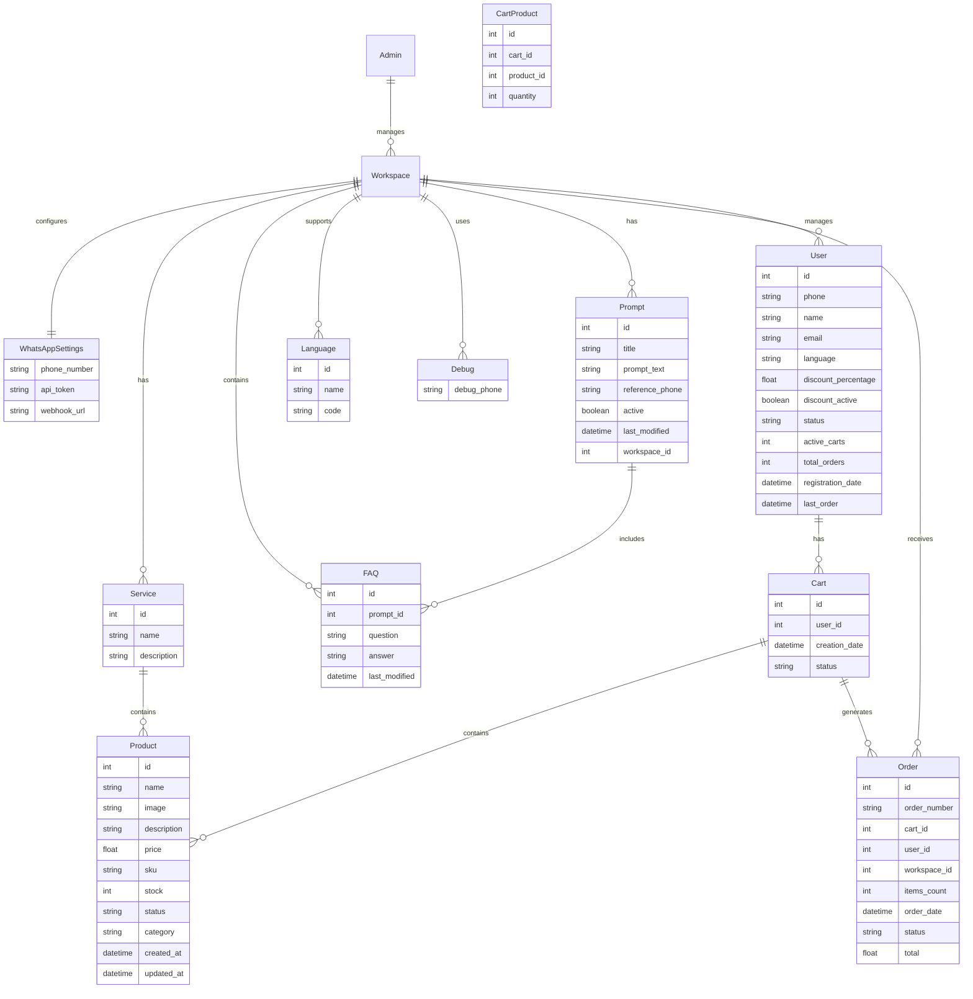

# WhatsApp Chatbot MVP - Product Requirements Document

## 1. Project Vision

The project involves developing a WhatsApp Chatbot MVP using WhatsApp Business API and Artificial Intelligence (OpenRouter with RAG) to automate customer support and order management. The goal is to provide immediate and continuous 24/7 assistance, reducing operator workload and improving customer experience.

The platform will also enhance customer loyalty through commercial and promotional push notifications. The business model includes a cost of 5 cents per user question and 20 cents per push message.

## 2. User Journey

### Administrator Experience

The administrator accesses a web dashboard to:

- Create and manage multiple workspaces
- Configure WhatsApp channels by setting up phone numbers, API tokens, webhooks, and debug test numbers
- Customize AI prompts, add products (with photos, text, pricing), and organize them into service categories
- Manage FAQs through a CRUD interface; these FAQs will be stored in the database and automatically included in the AI prompt to enhance responses

### End User Experience

The end user interacts exclusively through WhatsApp:

- New users receive a welcome message and a request for basic registration information
- Existing users receive a personalized greeting and can request information, place orders, and receive communications

## 3. Objectives

### Business Goals:

- Significantly reduce customer service time through automation
- Provide 24/7 customer support
- Build customer loyalty through future push campaigns (e.g., greetings, promotions)

### Non-Goals (MVP):

- Implement an integrated payment system (external bank link will be used)
- Save detailed conversation history
- Track detailed user usage data, while maintaining the cost model (5 cents per question, 20 cents per push)

## 4. Technical Architecture

- **Frontend**: React (latest version) with shadcn/ui library (https://ui.shadcn.com/) and Tailwind CSS to accelerate development
- **Backend**: Node.js with Domain Driven Design (DDD) pattern
- **Database**: PostgreSQL
- **Workflow Automation**: n8n
- **AI Service**: OpenRouter (RAG)
- **WhatsApp Integration**: Official Meta API
- **Security**: HTTPS, JWT tokens, encrypted sensitive data in the database
- **Environments**: Development, test, and production; each workspace can activate debug mode with a test number

## 5. Acceptance Criteria

- Fully operational CRUD functionality for workspaces, products, prompts, FAQs, services, languages, and users
- Chatbot responses generated within seconds
- API communication protected via JWT tokens
- Intuitive dashboard with 2FA authentication
- Seamless integration between n8n and exposed APIs

## 6. Key Features

1. **User Management:**

   - Registration and Login: Secure authentication and profile management
   - Password Recovery: Functionality for credential reset

2. **Product Catalog:**

   - Product Display: List and detailed view of products with images, descriptions, and prices
   - Search and Filtering: Tools to search products by category, price, popularity, etc.

3. **WhatsApp Cart Management:**

   - Conversational Interface: Allows users to manage their cart via WhatsApp messages
   - Add/Remove Products: Commands to add or remove products from the cart
   - Cart Status Display: Sending cart summaries and updates via WhatsApp

4. **Checkout and Online Payments:**

   - Order Confirmation: After cart management on WhatsApp, the user is redirected to a web platform to confirm the order
   - Online Payments: Secure and integrated payment procedure on the online platform

5. **AI Integration:**

   - Assistance Chatbot: Virtual support to answer questions and guide users during the purchase process

6. **Order Management and Tracking:**

   - Order History: View past purchases and current order status
   - Shipment Tracking: Real-time updates on shipment status, sent via WhatsApp or email

7. **Feedback and Reviews:**

   - Review System: Ability for users to leave feedback on products
   - Ratings: Rating mechanism to evaluate products

8. **Usage Analytics:**

   - Usage Monitoring: Collection and analysis of platform usage data to understand user behavior
   - Usage Reports: Generation of reports and statistics to improve experience and optimize features

9. **Administrative Dashboard:**
   - Content Management: Tools to add, modify, or remove products and categories
   - Reports and Analysis: Statistics on sales, traffic, and system performance

## 7. Use Cases

### Admin Use Case:

[Admin Dashboard] → [Workspace Management]

- [CRUD WhatsApp Settings]
- [CRUD Products]
- [CRUD Services]
- [CRUD FAQs]
- [CRUD Prompts]
- [CRUD Users and Campaigns]

### Registered WhatsApp User Use Case:

[Registered WhatsApp User] → [Sends Message]

- [n8n Workflow]
- [Retrieval of workspace, profile, products, services, and FAQs data]
- [Response generation with OpenRouter (RAG)]
- [Response sending via Meta WhatsApp API]

### New WhatsApp User Use Case:

[New WhatsApp User] → [Sends First Message]

- [n8n Workflow]
- [User identification: not registered]
- [Sending welcome message and request for basic data]
- [User registration and profile creation]

### Push Offers Use Case:

[Admin creates Push Campaign] → [Automatic Sending via WhatsApp API]

- [Users receive message]
- [Option to unsubscribe]

## 8. Exposed APIs (for n8n)

### Prompt Management

- `GET /prompt/:telefono`

  - **Description**: Retrieves the active prompt for a specific phone number
  - **Parameters**:
    - `telefono` (required): WhatsApp phone number
  - **Returns**:
    - Active prompt text
    - Associated FAQs
    - Language configurations
    - Context settings

- `GET /prompts`

  - **Description**: Retrieves all prompts in the workspace
  - **Parameters**:
    - `workspace_id` (required): Workspace identifier
  - **Returns**:
    - List of prompts with active/inactive status

- `POST /prompt`

  - **Description**: Creates a new prompt
  - **Body**:
    - `testo_prompt`: Prompt text
    - `telefono_riferimento`: Associated phone number
    - `workspace_id`: Workspace ID

- `PUT /prompt/:id`

  - **Description**: Updates an existing prompt
  - **Parameters**:
    - `id` (required): Prompt ID
  - **Body**:
    - `testo_prompt`: New prompt text
    - `active`: Active/inactive status

- `DELETE /prompt/:id`
  - **Description**: Deletes a prompt
  - **Parameters**:
    - `id` (required): Prompt ID

### User Management

- `GET /utenti/:telefono`
  - User identification and profile retrieval via WhatsApp number

### Product and Service Management

- `GET /prodotti`
  - Complete product list
- `GET /servizi`
  - List of available services

### Order Management

- `POST /ordine`
  - Saving orders placed via chatbot

### Cart Management

- `GET /carrello/:utente_id`
  - Retrieval of user's cart
- `POST /carrello`
  - Adding a product to the cart
- `PUT /carrello`
  - Modifying a product in the cart
- `DELETE /carrello`
  - Removing a product from the cart

**Cross-cutting Requirements**:

- All APIs are protected by JWT tokens
- Communication exclusively via HTTPS
- Request logging and tracking
- Standardized error handling

### Analytics API

- `GET /analytics/overview`

  - **Description**: Retrieves general statistics
  - **Returns**:
    - Total active users
    - Total messages
    - Revenue
    - Growth percentages

- `GET /analytics/recent-activity`
  - **Description**: Retrieves recent activities
  - **Returns**:
    - New registrations
    - Added products
    - Received orders
    - Activity timestamps

### Dashboard API

- `GET /dashboard/stats`
  - **Description**: Retrieves statistics for the dashboard
  - **Parameters**:
    - `period` (optional): daily/weekly/monthly
  - **Returns**:
    - Active Users count
    - Total Messages count
    - Revenue
    - Growth percentages

### User Management API

- `GET /users`

  - **Description**: List of users with filters
  - **Parameters**:
    - `status` (optional): Filter by status
    - `search` (optional): Search by name/phone
  - **Returns**:
    - User list with cart and order details

- `POST /users`
  - **Description**: Creates new user
  - **Body**:
    - User data (name, phone, email, etc.)

## 9. Data Model

## 10. Prompt Management

Prompts are managed through a dedicated CRUD interface:

- Each workspace can have multiple prompts, each associated with a specific phone number
- Each prompt includes:
  - `prompt_text`: The base prompt text for the AI service
  - `reference_phone`: The associated WhatsApp phone number
  - `active`: Flag indicating if the prompt is currently active (only one can be active)
  - An alert box explains that only one prompt can be active at a time for testing different prompts
  - `last_modified`: Date and time of last modification
  - `title`: Prompt title
  - `workspace_id`: ID of the associated workspace

## 11. UI Design Rules and Shared Components

### General UI Rules

- All UI text must be in ENGLISH
- White background throughout the application
- Consistent icons across all sections (e.g., red for delete, green with pen for edit)
- Consistent spacing with uniform padding, margins, and layout in all pages
- No visible scrollbars
- Fully responsive and cross-browser compatible

### Shared Components

#### 1. Breadcrumb Component

- Must be used in **every page header**
- Always starts with phone number (with phone icon)
- Clickable phone number redirects to /workspace
- If "Dashboard" is present, it's clickable and redirects to /dashboard
- Shows complete page path, examples:
  - +3465656556 > Dashboard > Products
  - +3465656556 > Settings > Users

#### 2. List Component

- Used for: Users, Categories, Products, Prompts, Languages, Orders, Chat histories
- Search field aligned right (placeholder: "Search")
- Green "Add" button with "+" icon to the right of search field
- Title aligned left within the main container
- No pagination
- No scrollbars
- Uniform table style
- Delete actions must show confirmation popup
- Container must be external to the component itself
- Must have padding and be aligned with the section title to the left

### Layout Elements

#### Header

- Top right corner:
  - "Settings" menu with sub-items: Users, Categories, Languages, Channel Settings
  - User icon (circle with initials), on click shows: Profile | Logout

#### Sidebar

- Vertical full-height menu
- Header: App name = ShopMe
- Menu items:
  - Dashboard
  - Services
  - Products
  - Prompts
  - Orders

### Page-Specific Rules

#### Login Page

- Split into two columns: login form + attractive image
- Fields: username, password
- Default credentials: admin@admin.it / pwd
- Login button: blue with "Login" text

#### Workspace Page (/workspace)

- Shows 3 cards:
  - Number 1 + alias (link to dashboard)
  - Number 2 + alias (link to dashboard)
  - Add number (number field + alias)
- No sidebar, only header at top

#### Dashboard (/dashboard/:phoneNumber)

- Use Breadcrumb Component in page header (e.g., +3465757575 > Dashboard)
- Row 1: 4 metric cards
  - Orders, Pending Orders, New Users, Usage
- Row 2: 3 top cards
  - Top Product, Top Client, Top Order
- Row 3: Recent Orders (with "View All")
  - Table: ID | Customer | Date | Status | Amount | Actions (Download Invoice)
- Row 4: Recent Chats (with "View All")
  - Horizontal cards with user icon, name and company
  - Visible last message
  - Not displayed in table format

#### Products

- Use List Component for listing view
- Breadcrumb examples:
  - +3465656556 > Dashboard > Products
  - +3465656556 > Dashboard > Products > Add
  - +3465656556 > Dashboard > Products > Edit
- Only has edit and delete actions

#### Orders

- Use List Component for table
- Sorted by date in DESC order
- Each row is clickable and opens order details
- Breadcrumbs:
  - +3465656556 > Dashboard > Orders
  - +3465656556 > Dashboard > Order Num:1234434
- Table: ID | Customer | Date | Status | Amount | Action (Download Invoice)
- Only has download button

#### Prompts

- Use List Component for prompt list
- Breadcrumbs:
  - +3465656556 > Dashboard > Prompts
  - +3465656556 > Dashboard > Edit (Prompt Title)
  - +3465656556 > Dashboard > New
  - +3465656556 > Dashboard > View

#### Services

- Use List Component for service list
- Breadcrumbs:
  - +3465656556 > Dashboard > Services
  - +3465656556 > Dashboard > Edit (Service Title)
  - +3465656556 > Dashboard > New

#### Users

- URL: /settings/users
- Table: Phone | Name | Surname | Company | Active
- Actions: Add | Edit (only)
- Use List Component for user list
- Breadcrumbs:
  - +3465656556 > Settings > Users
  - +3465656556 > Settings > Users > Edit User (User Name)

#### Categories

- Table: ID | Title
- Actions: Add | Edit | Delete
- Use List Component for category list
- URL: /settings/category
- Breadcrumbs:
  - +3465656556 > Settings > Categories
  - +3465656556 > Settings > Edit Category: (Category Name)

### Additional UI Rules

- Edit pages must not have search or add buttons
- Search and add buttons only appear on list pages
- Save button must be blue with "Save" text
- Cancel button must be white with black text
