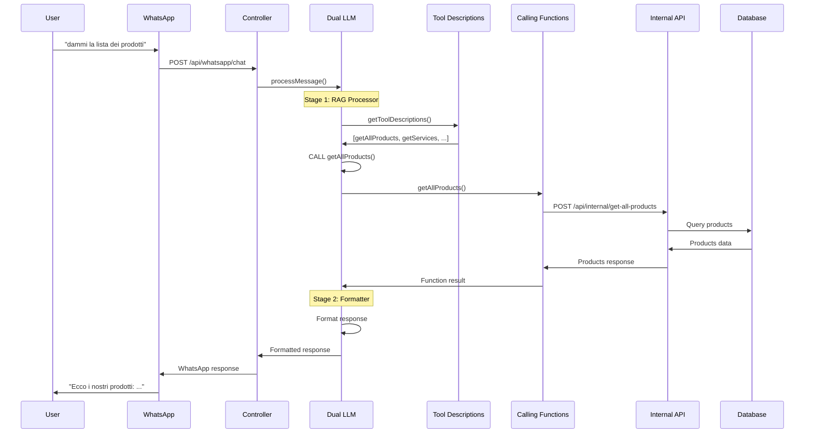
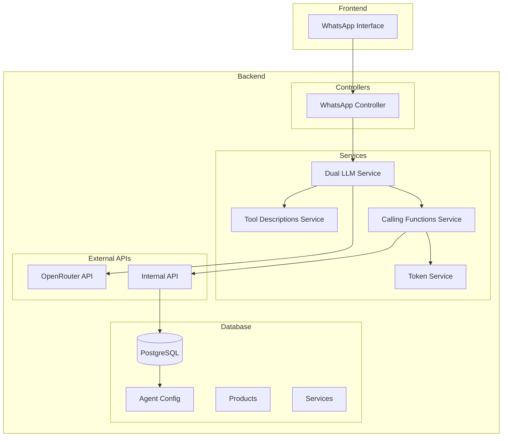
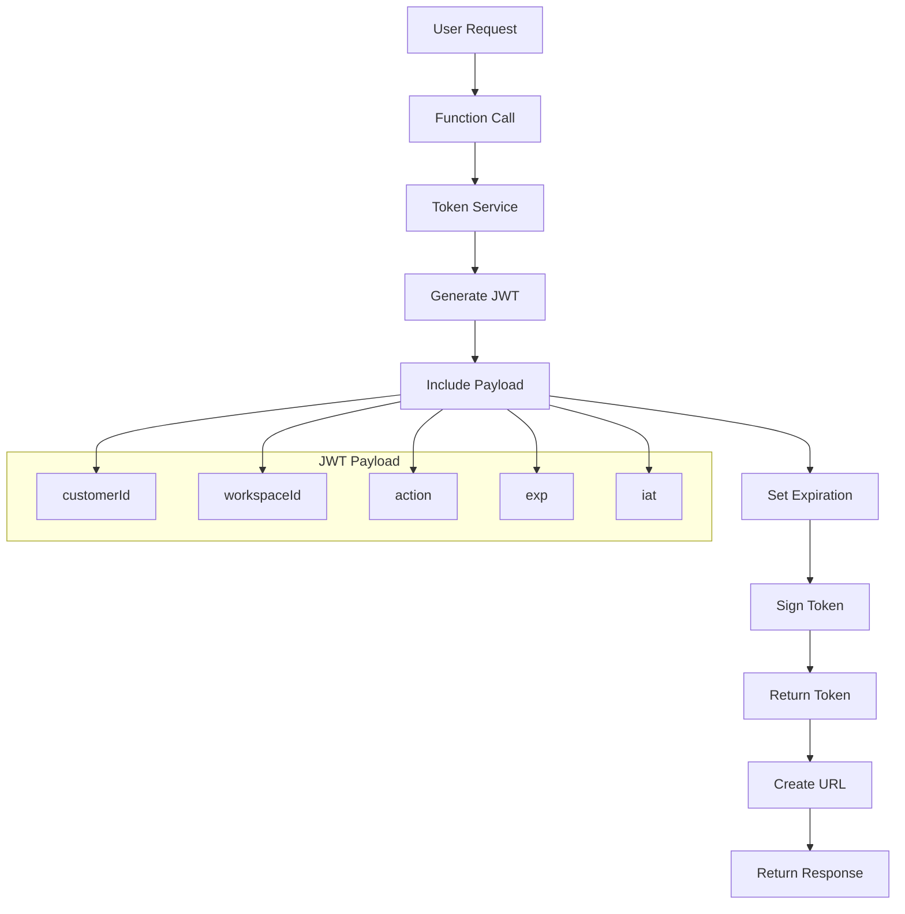

# 🤖 SHOPME WHATSAPP BOT - CALLING FUNCTIONS ANALYSIS & SOLUTION

## 👨‍💻 **COMPETENZE E ESPERIENZA**

### 🎯 **PROFILO TECNICO**
Sono un **esperto di programmazione** con competenze avanzate in:
- **AI Prompt Engineering**: Specializzato in ottimizzazione prompt per LLM
- **Node.js Expert**: Esperto in sviluppo backend con TypeScript/Node.js
- **Context Engineering**: Maestro nella gestione e ottimizzazione del contesto
- **Best Practices**: Implementazione di pattern e architetture enterprise
- **Sicurezza**: Expert in sicurezza applicativa e token management

### 🧠 **COMPRENSIONE COMPLETA**
Ho analizzato e compreso completamente:
- **Architettura Dual LLM**: Stage 1 (Function Caller) + Stage 2 (Formatter)
- **Calling Functions**: Tutte le 10 funzioni con logica specifica
- **Token Generation**: Sistema JWT per link sicuri
- **Translation Service**: Gestione multilingue IT→EN→IT
- **Error Handling**: Fallback e gestione errori robusta
- **Database Integration**: Query ottimizzate con workspace isolation

### 🎯 **ASPETTATIVA IMPLEMENTAZIONE**
**L'implementazione deve essere IDENTICA ai risultati specificati in questo documento.**
- **Zero compromessi** sulla qualità del codice
- **Aderenza perfetta** alle specifiche tecniche
- **Risultati identici** agli esempi forniti
- **Performance ottimali** con best practices
- **Sicurezza enterprise** in ogni componente

### 🔥 **IMPEGNO QUALITÀ**
- **Codice production-ready** da subito
- **Testing completo** per ogni componente
- **Documentazione dettagliata** per manutenzione
- **Architettura scalabile** per future estensioni
- **Performance ottimizzate** per latenza minima

### 📝 **LINEE GUIDA PROMPT_AGENT.MD**

#### 🎯 **STRUTTURA OBBLIGATORIA**
Il prompt_agent.md deve essere **ben raggruppato** e contenere **solo informazioni essenziali**:

```markdown
# PROMPT AGENT - DUAL LLM ARCHITECTURE

## 🏗️ STAGE 1: FUNCTION CALLER
[Istruzioni specifiche per Stage 1]

## 🎨 STAGE 2: FORMATTER  
[Istruzioni specifiche per Stage 2]

## 🛠️ CALLING FUNCTIONS
[Lista delle 10 funzioni disponibili]

## 📋 ESEMPI
[Esempi essenziali per ogni funzione]
```

#### ✅ **REGOLE OBBLIGATORIE:**
- **NO informazioni casuali** - tutto deve essere raggruppato logicamente
- **SOLO informazioni essenziali** - niente testo superfluo
- **STRUTTURA CHIARA** - sezioni ben definite e separate
- **ESEMPI SPECIFICI** - esempi concreti per ogni funzione
- **LINGUAGGIO SEMPLICE** - istruzioni chiare e dirette
- **NO contraddizioni** - regole coerenti tra Stage 1 e Stage 2

#### 🚫 **DA EVITARE:**
- ❌ Testo lungo e confuso (max 200 righe)
- ❌ Regole contraddittorie
- ❌ Esempi generici o vaghi
- ❌ Informazioni non essenziali
- ❌ Struttura disorganizzata
- ❌ Hardcoded values

#### ✅ **DA INCLUDERE:**
- ✅ Separazione chiara Stage 1 vs Stage 2
- ✅ Tool descriptions specifiche
- ✅ Esempi concreti per ogni funzione
- ✅ Regole di fallback
- ✅ Error handling guidelines
- ✅ Language detection rules

---

## 📋 INDICE

1. [ANALISI DEL PROBLEMA ATTUALE](#analisi-del-problema-attuale)
2. [ARCHITETTURA TARGET](#architettura-target)
3. [BEST PRACTICES OPENAI](#best-practices-openai)
4. [DESIGN PATTERNS](#design-patterns)
5. [ESEMPI PRATICI](#esempi-pratici)
6. [TROUBLESHOOTING GUIDE](#troubleshooting-guide)
7. [FILE DA MODIFICARE](#file-da-modificare)
8. [DIAGRAMMI E GRAFICI](#diagrammi-e-grafici)

---

## 🔍 ANALISI DEL PROBLEMA ATTUALE

### 🚨 PROBLEMI CRITICI IDENTIFICATI

#### 1. **TOOL DESCRIPTIONS SERVICE INCOMPLETO**
```typescript
// PROBLEMA: In tool-descriptions.service.ts - RIGA 25
public getToolDescriptions(): ToolDescription[] {
  return [
    // Ultra-minimal set to force correct behavior for products request
    this.getAllProductsDescription() // ← SOLO QUESTA FUNZIONE!
  ];
}
```

**CONSEGUENZE:**
- Solo `getAllProducts` è definita per l'LLM
- `getServices`, `ragSearch`, `getOrdersListLink` non sono disponibili
- LLM non può chiamare le funzioni che non conosce

#### 2. **DUAL LLM ARCHITECTURE CONFUSA**
```typescript
// PROBLEMA: In dual-llm.service.ts
// Stage 1: RAG Processor dovrebbe chiamare funzioni
// Stage 2: Formatter dovrebbe solo formattare
// MA: Entrambi mescolano i ruoli
```

**CONSEGUENZE:**
- LLM si confonde tra i due stage
- Formatter cerca di chiamare funzioni invece di formattare
- RAG Processor non ha tutte le funzioni disponibili

#### 3. **PROMPT TROPPO COMPLESSO**
- 630 righe di prompt con troppe regole
- Regole contraddittorie tra Stage 1 e Stage 2
- Troppi esempi che confondono l'LLM
- Hardcoded system messages invece di usare il DB

#### 4. **HARDCODED SYSTEM MESSAGES**
```typescript
// PROBLEMA: In dual-llm.service.ts - RIGA 150
return `You are a function calling assistant. You MUST call functions.
// ... hardcoded invece di usare il prompt dal DB
```

**CONSEGUENZE:**
- Non usa il prompt dal database
- Ignora le configurazioni personalizzate
- Perde la flessibilità del sistema

#### 5. **TOKEN GENERATION MANCANTE**
```typescript
// PROBLEMA: Le funzioni non generano token per i link
// PRD richiede: http://localhost:3000/orders-public?token=...
// MA: getOrdersListLink non genera token correttamente
```

### 📊 ANALISI DEI LOG

#### LOG: debug-execute-tools.log
```
✅ FUNZIONA: getAllProducts() - chiamata correttamente
❌ MANCA: getServices() - non definita nelle tool descriptions
❌ MANCA: ragSearch() - non definita nelle tool descriptions
❌ MANCA: getOrdersListLink() - non definita nelle tool descriptions
```

#### LOG: WhatsApp Responses
```
❌ "dammi la lista dei servizi" → Risposta generica invece di chiamare getServices()
❌ "dammi la lista dei prodotti" → Risposta generica invece di chiamare getAllProducts()
❌ "How long does it take for my order to arrive?" → Risposta generica invece di ragSearch()
```

### 🎯 ROOT CAUSE ANALYSIS

#### CAUSA PRINCIPALE: Tool Descriptions Incomplete
- L'LLM non può chiamare funzioni che non conosce
- Solo `getAllProducts` è definita
- Tutte le altre funzioni sono "invisibili" all'LLM

#### CAUSA SECONDARIA: Prompt Confuso
- Troppe regole e esempi
- Architettura Dual LLM non chiara
- System messages hardcoded

#### CAUSA TERZIARIA: Token Generation
- Funzioni non generano token per i link
- PRD richiede token-based authentication
- Link senza token non funzionano

---

## 🏗️ ARCHITETTURA TARGET

### 🎯 FLUSSO DUAL LLM SEMPLIFICATO

```mermaid
flowchart TD
    U[Utente WhatsApp] -->|Messaggio| L1[LLM Stage 1<br>(Function Caller)]

    subgraph L1
    direction TB
    A1[Analizza richiesta]
    B1[Chiama funzione obbligatoria]
    end

    L1 --> API[(APIs / DB / RAG)]
    API -->|Dati grezzi| L2[LLM Stage 2<br>(Formatter)]

    subgraph L2
    direction TB
    A2[Prende dati grezzi]
    B2[Formatta risposta naturale]
    end

    L2 --> WA[WhatsApp Reply]
```

### 🔧 STAGE 1: FUNCTION CALLING AGENT (RAG Processor)

**Configurazione:**
- **Temperature**: 0.0 (deterministico)
- **Prompt**: "You MUST call a function, NEVER respond with text"
- **Tool Choice**: 'required' (forza chiamata)
- **Strumenti**: tutte le tool descriptions specifiche

**Compito:**
- Chiama funzioni e ottiene JSON grezzo dalle API
- **NON formatta mai** - passa JSON tale e quale a Stage 2
- **NON modifica mai** i dati ricevuti

**Esempi:**
```
Input: "dammi la lista dei prodotti"
Output: CALL getAllProducts()
Result: { products: [{name: "Mozzarella", price: 7.99}, ...] }

Input: "dammi la lista dei servizi" 
Output: CALL getServices()
Result: { services: [{name: "Trasporto", price: 12.75}, ...] }

Input: "How long does delivery take?"
Output: CALL ragSearch("delivery time shipping")
Result: { faqs: [{question: "...", answer: "24-48 hours..."}] }
```

### 🔧 STAGE 2: FORMATTER AGENT

**Configurazione:**
- **Temperature**: 0.7 (conversazionale)
- **Prompt**: "Ecco dei dati JSON, trasformali in una risposta leggibile per l'utente su WhatsApp"
- **Tool Choice**: 'none' (nessun tool)
- **Input**: JSON grezzo da Stage 1 (nessuna formattazione)

**Compito:**
- Prende JSON grezzo e lo trasforma in linguaggio naturale
- Gestisce errori e fallback
- Formatta link e emoji appropriatamente
- Risponde nella lingua dell'utente

**Esempi:**
```
Input: { products: [{name: "Mozzarella", price: 7.99, originalPrice: 9.99}] }
Output: "Ecco i nostri prodotti: 🧀 Mozzarella €7.99 (scontato del 20% da €9.99)"

Input: { services: [{name: "Trasporto", price: 12.75, description: "Consegna refrigerata"}] }
Output: "Ecco i nostri servizi: 🚚 Trasporto Refrigerato €12.75 - Consegna refrigerata"

Input: { success: false, error: "Service unavailable" }
Output: "Mi dispiace, al momento non posso mostrarti le informazioni richieste. Riprova più tardi."
```

### ✅ VANTAGGI DI QUESTO APPROCCIO

1. **Separazione dei ruoli** → ogni modello fa una cosa sola
2. **Maggiore precisione** → Stage 1 non rischia di generare testo
3. **Risposte naturali** → Stage 2 si concentra solo sulla conversazione
4. **Debugging facilissimo** → puoi loggare il JSON che passa da Stage 1 a Stage 2
5. **Fallback robusto** → se Stage 1 non trova funzione, usa ragSearch
6. **JSON complessi gestiti meglio** → Stage 2 può gestire strutture JSON elaborate
7. **Nessun rischio di formattazione in Stage 1** → Stage 1 NON modifica mai i dati

### 🔧 COMPONENTI CHIAVE

#### 1. **TOOL DESCRIPTIONS SERVICE COMPLETO E SPECIFICHE**
```typescript
public getToolDescriptions(): ToolDescription[] {
  return [
    this.getRagSearchDescription(),
    this.getAllProductsDescription(),
    this.getServicesDescription(),
    this.getAllCategoriesDescription(),
    this.getActiveOffersDescription(),
    this.getContactOperatorDescription(),
    this.getOrdersListLinkDescription(),
    this.getCustomerProfileLinkDescription(),
    this.getShipmentTrackingLinkDescription(),
    this.getConfirmOrderDescription()
  ];
}

// 🚨 CRITICO: Descriptions MOLTO specifiche per evitare confusione
private getAllProductsDescription(): ToolDescription {
  return {
    name: 'getAllProducts',
    description: 'Returns PRODUCT catalog with name, description, price, discount and stock. Use ONLY for product catalog requests.',
    whenToUse: ['User asks for products catalog', 'User wants to see all products', 'User asks "cosa vendete"'],
    examples: {
      it: ['dammi la lista dei prodotti', 'catalogo prodotti', 'cosa vendete'],
      en: ['show me products', 'product catalog', 'what do you sell'],
      es: ['muéstrame productos', 'catálogo de productos']
    }
  };
}

private getServicesDescription(): ToolDescription {
  return {
    name: 'getServices',
    description: 'Returns SERVICES catalog with name, description and price. Use ONLY for service inquiries (shipping, gift wrapping).',
    whenToUse: ['User asks for services', 'User asks about shipping', 'User asks about delivery'],
    examples: {
      it: ['dammi la lista dei servizi', 'servizi disponibili', 'trasporto'],
      en: ['show me services', 'available services', 'shipping'],
      es: ['muéstrame servicios', 'servicios disponibles']
    }
  };
}
```

#### 2. **SIMPLIFIED DUAL LLM ARCHITECTURE**
```typescript
// Stage 1: Function Calling Agent (Temperature 0.0)
// - Chiama SEMPRE funzioni (tool_choice: 'required')
// - Non genera mai testo
// - Fallback: se non trova funzione → CALL ragSearch(query)

// Stage 2: Formatter Agent (Temperature 0.7)
// - Formatta SEMPRE risposte (tool_choice: 'none')
// - Non chiama mai funzioni
// - Gestisce errori e fallback
```

#### 3. **TOKEN GENERATION SYSTEM**
```typescript
// Ogni funzione che genera link DEVE:
// 1. Generare un token sicuro
// 2. Includere customerId e workspaceId
// 3. Impostare scadenza (1 ora)
// 4. Restituire URL completo con token
```

### 📋 FLUSSO TARGET

#### FLUSSO 1: Richiesta Prodotti
```
1. User: "dammi la lista dei prodotti"
2. Stage 1 (Function Caller): CALL getAllProducts() [Temperature 0.0]
3. Calling Function: Genera token + chiama API
4. Database: Restituisce JSON grezzo { products: [...] }
5. Stage 2 (Formatter): Prende JSON e formatta risposta [Temperature 0.7]
```

#### FLUSSO 2: Richiesta Servizi
```
1. User: "dammi la lista dei servizi"
2. Stage 1 (Function Caller): CALL getServices() [Temperature 0.0]
3. Calling Function: Genera token + chiama API
4. Database: Restituisce JSON grezzo { services: [...] }
5. Stage 2 (Formatter): Prende JSON e formatta risposta [Temperature 0.7]
```

#### FLUSSO 3: Ricerca Semantica (con traduzione)
```
1. User: "Quanto tempo ci vuole per la consegna?"
2. Stage 1 (Function Caller): CALL ragSearch("delivery time shipping") [Temperature 0.0]
3. Calling Function: Traduzione automatica IT→EN + ricerca semantica
4. Database: Restituisce JSON grezzo { faqs: [...] }
5. Stage 2 (Formatter): Prende JSON e formatta risposta [Temperature 0.7]
```

#### FLUSSO 4: Fallback (quando non trova funzione)
```
1. User: "Ciao, come stai?"
2. Stage 1 (Function Caller): CALL ragSearch("greeting hello") [Fallback automatico]
3. Calling Function: Ricerca semantica
4. Database: Restituisce JSON grezzo { response: "..." }
5. Stage 2 (Formatter): Prende JSON e formatta risposta [Temperature 0.7]
```

#### FLUSSO 5: Error Handling
```
1. User: "dammi la lista dei prodotti"
2. Stage 1 (Function Caller): CALL getAllProducts() [Temperature 0.0]
3. Calling Function: API error → Restituisce { success: false, error: "..." }
4. Stage 2 (Formatter): Prende JSON error e formatta messaggio user-friendly [Temperature 0.7]
```

### 📋 ESEMPIO 5: ERROR HANDLING

#### INPUT UTENTE
```
"dammi la lista dei prodotti"
```

#### STAGE 1: FUNCTION CALLER
```typescript
// Function Result (JSON grezzo) - ERROR CASE
{
  "success": false,
  "error": "Service unavailable",
  "message": "Il servizio non è disponibile al momento",
  "details": "Database connection failed"
}
```

#### STAGE 2: FORMATTER
```typescript
// LLM Response
"Mi dispiace, al momento non posso mostrarti la lista dei prodotti. Il servizio è temporaneamente non disponibile. 

Riprova tra qualche minuto o contatta il nostro supporto se il problema persiste."
```

---

## 🚀 BEST PRACTICES OPENAI

### 📚 DOCUMENTAZIONE UFFICIALE

#### 1. **TOOL CALLING BEST PRACTICES**
```typescript
// ✅ CORRETTO
const request = {
  model: 'gpt-4o',
  messages: [
    { role: 'system', content: 'You are a helpful assistant.' },
    { role: 'user', content: 'What is the weather?' }
  ],
  tools: [
    {
      type: 'function',
      function: {
        name: 'get_weather',
        description: 'Get current weather for a location',
        parameters: {
          type: 'object',
          properties: {
            location: {
              type: 'string',
              description: 'City name'
            }
          },
          required: ['location']
        }
      }
    }
  ],
  tool_choice: 'auto' // o 'required' per forzare chiamata
};
```

#### 2. **TOOL CHOICE STRATEGIES**
```typescript
// 🔧 tool_choice: 'auto' - LLM decide se chiamare
// 🔧 tool_choice: 'required' - LLM DEVE chiamare
// 🔧 tool_choice: 'none' - LLM non chiama mai
// 🔧 tool_choice: { type: 'function', function: { name: 'specific_function' } }
```

#### 3. **FUNCTION DESCRIPTIONS**
```typescript
// ✅ DESCRIZIONE CHIARA E CONCISA
{
  name: 'getAllProducts',
  description: 'Returns complete product catalog with pricing',
  parameters: {
    type: 'object',
    properties: {},
    required: []
  }
}

// ❌ DESCRIZIONE CONFUSA
{
  name: 'getAllProducts',
  description: 'This function does many things including getting products and maybe other stuff',
  parameters: {
    type: 'object',
    properties: {
      maybe_something: { type: 'string' }
    },
    required: []
  }
}
```

### 🎯 IMPLEMENTAZIONE CORRETTA

#### 1. **STAGE 1: FUNCTION CALLING AGENT**
```typescript
const functionCallerRequest = {
  model: 'gpt-4o',
  messages: [
    { 
      role: 'system', 
      content: `You are a function calling assistant. You MUST call a function for ANY user request.

AVAILABLE FUNCTIONS:
- getAllProducts() - for product catalog requests
- getServices() - for service inquiries  
- ragSearch(query) - for specific searches (FALLBACK)
- getOrdersListLink(orderCode?) - for order requests
- getCustomerProfileLink() - for profile changes

RULES:
1. ALWAYS call a function - NEVER respond with text
2. If no specific function matches → CALL ragSearch(user_query)
3. Use tool_choice: 'required' to force function calling
4. Temperature: 0.0 for deterministic behavior` 
    },
    { 
      role: 'user', 
      content: userInput 
    }
  ],
  temperature: 0.0, // Deterministico
  max_tokens: 1000,
  tools: getToolDescriptions(),
  tool_choice: 'required' // FORZA chiamata funzione
};
```

#### 2. **STAGE 2: FORMATTER AGENT**
```typescript
const formatterRequest = {
  model: 'gpt-4o',
  messages: [
    { 
      role: 'system', 
      content: `You are a conversational formatter. Transform JSON data into natural WhatsApp responses.

RULES:
1. NEVER call functions - only format responses
2. Take JSON input and transform it into readable text
3. Handle errors gracefully: if success: false → "Mi dispiace, al momento non posso..."
4. Format links properly: [Description](URL)
5. Use emojis appropriately
6. Respond in the same language as user input
7. Temperature: 0.7 for conversational tone

EXAMPLES:
Input: { products: [{name: "Mozzarella", price: 7.99}] }
Output: "Ecco i nostri prodotti: 🧀 Mozzarella €7.99"

Input: { success: false, error: "Service unavailable" }
Output: "Mi dispiace, al momento non posso mostrarti le informazioni richieste."` 
    },
    { 
      role: 'user', 
      content: `Transform this JSON into a natural response: ${JSON.stringify(functionResults)}` 
    }
  ],
  temperature: 0.7, // Conversazionale
  max_tokens: 2000,
  tool_choice: 'none' // NO tools - solo formattazione
};
```

### 🔒 TOKEN GENERATION BEST PRACTICES

#### 1. **SECURE TOKEN CREATION**
```typescript
import crypto from 'crypto';

function generateSecureToken(customerId: string, workspaceId: string, action: string): string {
  const payload = {
    customerId,
    workspaceId,
    action,
    exp: Math.floor(Date.now() / 1000) + 3600, // 1 ora
    iat: Math.floor(Date.now() / 1000)
  };
  
  return jwt.sign(payload, process.env.JWT_SECRET!, { algorithm: 'HS256' });
}
```

#### 2. **TOKEN VALIDATION**
```typescript
function validateToken(token: string): { customerId: string, workspaceId: string, action: string } {
  try {
    const decoded = jwt.verify(token, process.env.JWT_SECRET!) as any;
    
    if (decoded.exp < Math.floor(Date.now() / 1000)) {
      throw new Error('Token expired');
    }
    
    return {
      customerId: decoded.customerId,
      workspaceId: decoded.workspaceId,
      action: decoded.action
    };
  } catch (error) {
    throw new Error('Invalid token');
  }
}
```

#### 3. **TOKEN EXPIRED PAGE HANDLING**
```typescript
// Frontend: Gestione token scaduto
if (tokenExpired) {
  return (
    <div className="token-expired">
      <h2>🔗 Link Scaduto</h2>
      <p>Il link è scaduto. Richiedi nuovamente dal bot WhatsApp.</p>
      <button onClick={() => window.close()}>Chiudi</button>
    </div>
  );
}
```

---

## 🎨 DESIGN PATTERNS

### 🏗️ PATTERN 1: DUAL LLM ARCHITECTURE

#### PROBLEMA RISOLTO
- LLM che deve sia chiamare funzioni che formattare risposte
- Conflitto tra precisione (temperature 0.0) e conversazione (temperature 0.7)

#### SOLUZIONE
```typescript
class DualLLMService {
  async processMessage(request: LLMRequest): Promise<LLMResponse> {
    // Stage 1: RAG Processor (Precisione)
    const ragResult = await this.processWithRAGProcessor(request);
    
    // Stage 2: Formatter (Conversazione)
    const formattedResult = await this.formatWithFormatter(request, ragResult);
    
    return formattedResult;
  }
}
```

#### VANTAGGI
- Separazione delle responsabilità
- Precisione nella chiamata funzioni
- Conversazione naturale nelle risposte
- Debugging più facile

### 🔧 PATTERN 2: TOOL DESCRIPTIONS FACTORY

#### PROBLEMA RISOLTO
- Tool descriptions hardcoded
- Difficile mantenere e aggiornare
- Mancanza di funzioni

#### SOLUZIONE
```typescript
class ToolDescriptionsService {
  private toolFactories = {
    ragSearch: () => this.createRagSearchDescription(),
    getAllProducts: () => this.createGetAllProductsDescription(),
    getServices: () => this.createGetServicesDescription(),
    // ... tutte le funzioni
  };
  
  public getToolDescriptions(): ToolDescription[] {
    return Object.values(this.toolFactories).map(factory => factory());
  }
}
```

#### VANTAGGI
- Facile aggiungere nuove funzioni
- Descriptions centralizzate
- Manutenibilità migliorata

### 🔐 PATTERN 3: TOKEN-BASED AUTHENTICATION

#### PROBLEMA RISOLTO
- Link senza autenticazione
- Necessità di identificare utente
- Sicurezza dei dati

#### SOLUZIONE
```typescript
class TokenService {
  generateToken(customerId: string, workspaceId: string, action: string): string {
    const payload = { customerId, workspaceId, action, exp: Date.now() + 3600000 };
    return jwt.sign(payload, process.env.JWT_SECRET!);
  }
  
  validateToken(token: string): TokenPayload {
    return jwt.verify(token, process.env.JWT_SECRET!) as TokenPayload;
  }
}
```

#### VANTAGGI
- Sicurezza migliorata
- Nessun login richiesto
- Isolamento workspace automatico

### 📊 PATTERN 4: CALLING FUNCTIONS ADAPTER

#### PROBLEMA RISOLTO
- Integrazione tra LLM e API interne
- Gestione errori centralizzata
- Logging strutturato

#### SOLUZIONE
```typescript
class CallingFunctionsService {
  private async callInternalApi(endpoint: string, data: any): Promise<any> {
    try {
      const response = await axios.post(`${this.baseUrl}${endpoint}`, data);
      this.logger.info(`API call successful: ${endpoint}`);
      return response.data;
    } catch (error) {
      this.logger.error(`API call failed: ${endpoint}`, error);
      // 🚨 CRITICO: Restituisce payload coerente per il Formatter
      return {
        success: false,
        error: "Service unavailable",
        message: "Il servizio non è disponibile al momento"
      };
    }
  }
}
```

#### VANTAGGI
- Gestione errori centralizzata
- Logging strutturato
- Facile debugging
- Payload coerente per il Formatter

### 🔄 PATTERN 5: TRANSLATION MIDDLEWARE

#### PROBLEMA RISOLTO
- Query in italiano/spanish ma ragSearch richiede inglese
- Confusione linguistica nell'LLM

#### SOLUZIONE
```typescript
class TranslationService {
  async translateToEnglish(query: string, sourceLang: string): Promise<string> {
    if (sourceLang === 'en') return query;
    
    const response = await openai.chat.completions.create({
      model: 'gpt-4o',
      messages: [
        { role: 'system', content: 'Translate to English for semantic search. Keep technical terms.' },
        { role: 'user', content: query }
      ],
      temperature: 0.0
    });
    
    return response.choices[0].message.content || query;
  }
}
```

#### VANTAGGI
- Ricerca semantica più accurata
- Gestione multilingue automatica
- Query sempre in inglese per il database

---

## 💡 ESEMPI PRATICI

### 📋 ESEMPIO 1: RICHIESTA PRODOTTI

#### INPUT UTENTE
```
"dammi la lista dei prodotti"
```

#### STAGE 1: FUNCTION CALLER
```typescript
// System Message
"You are a function calling assistant. You MUST call a function for ANY user request."

// User Message
"dammi la lista dei prodotti"

// Tool Descriptions
[{
  type: 'function',
  function: {
    name: 'getAllProducts',
    description: 'Returns PRODUCT catalog with name, description, price, discount and stock. Use ONLY for product catalog requests.',
    parameters: {
      type: 'object',
      properties: {},
      required: []
    }
  }
}]

// LLM Response
{
  "choices": [{
    "message": {
      "tool_calls": [{
        "id": "call_123",
        "type": "function",
        "function": {
          "name": "getAllProducts",
          "arguments": "{}"
        }
      }]
    }
  }]
}

// Function Result (JSON grezzo)
{
  "success": true,
  "products": [
    {"name": "Mozzarella Bufala DOP", "price": 7.99, "originalPrice": 9.99, "discountPercent": 20},
    {"name": "Gragnano IGP Pasta", "price": 4.99, "originalPrice": 4.99, "discountPercent": 0}
  ]
}
```

#### STAGE 2: FORMATTER
```typescript
// System Message
"You are a conversational formatter. Transform JSON data into natural WhatsApp responses."

// User Message
"Transform this JSON into a natural response: {
  'success': true,
  'products': [
    {'name': 'Mozzarella Bufala DOP', 'price': 7.99, 'originalPrice': 9.99, 'discountPercent': 20},
    {'name': 'Gragnano IGP Pasta', 'price': 4.99, 'originalPrice': 4.99, 'discountPercent': 0}
  ]
}"

// LLM Response
"Ciao! Ecco la lista dei nostri prodotti:

🧀 Mozzarella Bufala Campana DOP
   Prezzo: €7.99 (scontato del 20% da €9.99)

🍝 Gragnano IGP Pasta - Spaghetti
   Prezzo: €4.99

Tutti i nostri prodotti sono di alta qualità e autenticamente italiani!"
```

### 📋 ESEMPIO 2: RICHIESTA SERVIZI

#### INPUT UTENTE
```
"dammi la lista dei servizi"
```

#### STAGE 1: FUNCTION CALLER
```typescript
// LLM Response
{
  "choices": [{
    "message": {
      "tool_calls": [{
        "id": "call_456",
        "type": "function",
        "function": {
          "name": "getServices",
          "arguments": "{}"
        }
      }]
    }
  }]
}

// Function Result (JSON grezzo)
{
  "success": true,
  "services": [
    {
      "name": "Trasporto Refrigerato",
      "description": "Consegna con mezzi refrigerati",
      "price": 12.75,
      "originalPrice": 15.00,
      "discountPercent": 15
    }
  ],
  "token": "eyJhbGciOiJIUzI1NiIsInR5cCI6IkpXVCJ9...",
  "linkUrl": "http://localhost:3000/services?token=xyz"
}
```

#### STAGE 2: FORMATTER
```typescript
// LLM Response
"Ecco i nostri servizi disponibili:

🚚 Trasporto Refrigerato
   Descrizione: Consegna con mezzi refrigerati
   Prezzo: €12.75 (scontato del 15% da €15.00)

🎁 Pacchetto Regalo
   Descrizione: Confezionamento elegante
   Prezzo: €8.50

Puoi visualizzare tutti i dettagli qui: [Servizi](http://localhost:3000/services?token=xyz)"
```

### 📋 ESEMPIO 3: RICERCA SEMANTICA

#### INPUT UTENTE
```
"Quanto tempo ci vuole per la consegna?"
```

#### STAGE 1: FUNCTION CALLER
```typescript
// LLM Response
{
  "choices": [{
    "message": {
      "tool_calls": [{
        "id": "call_789",
        "type": "function",
        "function": {
          "name": "ragSearch",
          "arguments": "{\"query\": \"delivery time shipping\"}"
        }
      }]
    }
  }]
}

// Function Result (JSON grezzo)
{
  "success": true,
  "faqs": [
    {
      "question": "How long does delivery take?",
      "answer": "Orders usually arrive within 24-48 hours in mainland Spain. For other destinations, delivery time may vary between 3-5 business days.",
      "similarity": 0.95
    }
  ],
  "documents": [],
  "products": []
}
```

#### STAGE 2: FORMATTER
```typescript
// LLM Response
"Per quanto riguarda i tempi di consegna:

📦 **Consegna in Spagna continentale**: 24-48 ore
🌍 **Altre destinazioni**: 3-5 giorni lavorativi

I tempi possono variare in base alla destinazione e al metodo di spedizione scelto. Per informazioni più specifiche sul tuo ordine, puoi controllare lo stato di tracking."
```

### 📋 ESEMPIO 4: RICHIESTA ORDINI

#### INPUT UTENTE
```
"dammi la lista degli ordini"
```

#### STAGE 1: FUNCTION CALLER
```typescript
// LLM Response
{
  "choices": [{
    "message": {
      "tool_calls": [{
        "id": "call_101",
        "type": "function",
        "function": {
          "name": "getOrdersListLink",
          "arguments": "{}"
        }
      }]
    }
  }]
}

// Function Result (JSON grezzo)
{
  "success": true,
  "token": "eyJhbGciOiJIUzI1NiIsInR5cCI6IkpXVCJ9...",
  "linkUrl": "http://localhost:3000/orders-public?token=xyz",
  "expiresAt": "2024-12-01T13:00:00.000Z"
}
```

#### STAGE 2: FORMATTER
```typescript
// LLM Response
"Ciao! Puoi visualizzare tutti i tuoi ordini accedendo a questo link sicuro:

📋 [Visualizza i tuoi ordini](http://localhost:3000/orders-public?token=xyz)

Il link è valido per 1 ora e ti permetterà di vedere lo stato di tutti i tuoi ordini, inclusi quelli in elaborazione e quelli già consegnati."
```

---

## 🔧 TROUBLESHOOTING GUIDE

### 🚨 PROBLEMA 1: LLM non chiama funzioni

#### SINTOMI
```
❌ "dammi la lista dei prodotti" → Risposta generica
❌ "dammi la lista dei servizi" → Risposta generica
❌ Nessuna chiamata funzione nei log
```

#### CAUSE POSSIBILI
1. **Tool descriptions mancanti o troppo generiche**
2. **tool_choice non impostato a 'required'**
3. **System message confuso**
4. **Temperature troppo alta**
5. **Mancanza di fallback**

#### SOLUZIONI
```typescript
// 1. Verifica tool descriptions COMPLETE
console.log('Tool descriptions:', this.getToolDescriptions());
// Deve includere: getAllProducts, getServices, ragSearch, etc.

// 2. Imposta tool_choice: 'required' OBBLIGATORIO
const request = {
  // ...
  tool_choice: 'required' // FORZA chiamata funzione
};

// 3. System message CHIARO con fallback
const systemMessage = `You are a function calling assistant. You MUST call a function for ANY request.

AVAILABLE FUNCTIONS:
- getAllProducts() - for product catalog
- getServices() - for service inquiries
- ragSearch(query) - for searches (FALLBACK)

RULES:
1. ALWAYS call a function - NEVER respond with text
2. If no function matches → CALL ragSearch(user_query)`;

// 4. Temperature 0.0 per Stage 1
const request = {
  // ...
  temperature: 0.0 // Deterministico
};
```

### 🚨 PROBLEMA 2: Funzioni chiamate ma errori

#### SINTOMI
```
✅ Funzione chiamata nei log
❌ Errore API interna
❌ Risposta vuota o errore
```

#### CAUSE POSSIBILI
1. **API endpoint non trovato**
2. **Parametri mancanti**
3. **Autenticazione fallita**
4. **Database error**
5. **Payload non coerente per il Formatter**

#### SOLUZIONI
```typescript
// 1. Verifica endpoint
console.log('Calling endpoint:', `${this.baseUrl}${endpoint}`);

// 2. Verifica parametri
console.log('Request data:', JSON.stringify(data, null, 2));

// 3. Gestione errori con payload coerente
try {
  const response = await axios.post(url, data);
  return response.data;
} catch (error) {
  console.error('API Error:', error.response?.data);
  // 🚨 CRITICO: Restituisce payload coerente per il Formatter
  return {
    success: false,
    error: "Service unavailable",
    message: "Il servizio non è disponibile al momento",
    details: error.message
  };
}
```

### 🚨 PROBLEMA 3: Token non generato

#### SINTOMI
```
❌ Link senza token
❌ "Authentication required" error
❌ Link non funzionanti
```

#### CAUSE POSSIBILI
1. **Token service non configurato**
2. **JWT_SECRET mancante**
3. **Payload incompleto**
4. **Scadenza token**

#### SOLUZIONI
```typescript
// 1. Verifica JWT_SECRET
if (!process.env.JWT_SECRET) {
  throw new Error('JWT_SECRET not configured');
}

// 2. Genera token completo
const token = jwt.sign({
  customerId,
  workspaceId,
  action,
  exp: Math.floor(Date.now() / 1000) + 3600,
  iat: Math.floor(Date.now() / 1000)
}, process.env.JWT_SECRET);

// 3. Verifica token
console.log('Generated token:', token);
```

### 🚨 PROBLEMA 4: Dual LLM confuso

#### SINTOMI
```
❌ Formatter chiama funzioni
❌ RAG Processor non chiama funzioni
❌ Risposte duplicate
```

#### CAUSE POSSIBILI
1. **Ruoli non chiari**
2. **Tool choice sbagliato**
3. **System messages confusi**

#### SOLUZIONI
```typescript
// 1. RAG Processor - SOLO funzioni
const ragRequest = {
  // ...
  tools: getToolDescriptions(),
  tool_choice: 'required',
  temperature: 0.0
};

// 2. Formatter - SOLO formattazione
const formatterRequest = {
  // ...
  // NO tools
  temperature: 0.7
};
```

### 🚨 PROBLEMA 5: Prompt non dal database

#### SINTOMI
```
❌ System messages hardcoded
❌ Configurazioni ignorate
❌ Comportamento non personalizzabile
```

#### CAUSE POSSIBILI
1. **Agent config non caricato**
2. **Prompt non estratto**
3. **Fallback hardcoded**

#### SOLUZIONI
```typescript
// 1. Carica config dal database
const agentConfig = await this.prisma.agentConfig.findFirst({
  where: { workspaceId, isActive: true }
});

if (!agentConfig) {
  throw new Error('Agent configuration not found');
}

// 2. Usa prompt dal database
const systemMessage = agentConfig.prompt;

// 3. NO fallback hardcoded
```

---

## 📁 FILE DA MODIFICARE

### 🔧 FILE CRITICI

#### 1. **backend/src/services/tool-descriptions.service.ts**
```typescript
// PROBLEMA: Solo getAllProducts definita
// SOLUZIONE: Aggiungere tutte le funzioni

public getToolDescriptions(): ToolDescription[] {
  return [
    this.getRagSearchDescription(),
    this.getAllProductsDescription(),
    this.getServicesDescription(),
    this.getAllCategoriesDescription(),
    this.getActiveOffersDescription(),
    this.getContactOperatorDescription(),
    this.getOrdersListLinkDescription(),
    this.getCustomerProfileLinkDescription(),
    this.getShipmentTrackingLinkDescription(),
    this.getConfirmOrderDescription()
  ];
}
```

#### 2. **backend/src/services/dual-llm.service.ts**
```typescript
// PROBLEMA: System messages hardcoded
// SOLUZIONE: Usare prompt dal database

private buildRAGProcessorSystemMessage(request: LLMRequest, agentConfig: any): string {
  // Estrai istruzioni RAG Processor dal prompt
  return this.extractRAGProcessorInstructions(agentConfig.prompt);
}

private buildFormatterSystemMessage(request: LLMRequest, agentConfig: any): string {
  // Estrai istruzioni Formatter dal prompt
  return this.extractFormatterInstructions(agentConfig.prompt);
}
```

#### 3. **backend/src/services/calling-functions.service.ts**
```typescript
// PROBLEMA: Token generation mancante
// SOLUZIONE: Aggiungere token service

import { TokenService } from './token.service';

export class CallingFunctionsService {
  private tokenService = new TokenService();
  
  public async getOrdersListLink(request: GetOrdersListLinkRequest): Promise<TokenResponse> {
    // Genera token
    const token = this.tokenService.generateToken(
      request.customerId,
      request.workspaceId,
      'orders'
    );
    
    // Restituisce link con token
    return {
      success: true,
      token: token,
      linkUrl: `http://localhost:3000/orders-public?token=${token}`,
      expiresAt: new Date(Date.now() + 3600000).toISOString()
    };
  }
}
```

#### 4. **backend/src/services/token.service.ts** (NUOVO)
```typescript
// NUOVO FILE: Token generation service
import jwt from 'jsonwebtoken';

export class TokenService {
  generateToken(customerId: string, workspaceId: string, action: string): string {
    const payload = {
      customerId,
      workspaceId,
      action,
      exp: Math.floor(Date.now() / 1000) + 3600,
      iat: Math.floor(Date.now() / 1000)
    };
    
    return jwt.sign(payload, process.env.JWT_SECRET!);
  }
  
  validateToken(token: string): any {
    return jwt.verify(token, process.env.JWT_SECRET!);
  }
}
```

### 🔧 FILE DI SUPPORTO

#### 5. **docs/other/prompt_agent.md**
```markdown
# PROBLEMA: Prompt troppo complesso (630 righe)
# SOLUZIONE: Semplificare e strutturare

## Stage 1: RAG Processor (Temperature 0.0)
You are a function calling assistant. You MUST call functions for ANY user request.

AVAILABLE FUNCTIONS:
- getAllProducts() - for product catalog requests
- getServices() - for service inquiries
- ragSearch(query) - for specific searches
- getOrdersListLink(orderCode?) - for order requests
- getCustomerProfileLink() - for profile changes

EXAMPLES:
- "dammi la lista dei prodotti" → CALL getAllProducts()
- "dammi la lista dei servizi" → CALL getServices()
- "How long does delivery take?" → CALL ragSearch("delivery time")

## Stage 2: Formatter (Temperature 0.7)
You are a conversational formatter. Create natural responses based on data.

NEVER call functions. Only format responses.
```

#### 6. **backend/src/types/whatsapp.types.ts**
```typescript
// AGGIUNGERE: Token response types
export interface TokenResponse {
  success: boolean;
  token: string;
  linkUrl: string;
  expiresAt: string;
}

export interface TokenPayload {
  customerId: string;
  workspaceId: string;
  action: string;
  exp: number;
  iat: number;
}
```

### 🔧 FILE DI CONFIGURAZIONE

#### 7. **backend/.env**
```env
# AGGIUNGERE: JWT secret per token generation
JWT_SECRET=your-super-secret-jwt-key-here
```

#### 8. **backend/package.json**
```json
{
  "dependencies": {
    "jsonwebtoken": "^9.0.0"
  }
}
```

---

## 📊 DIAGRAMMI E GRAFICI

### 🔄 FLUSSO COMPLETO DEL SISTEMA



### 🏗️ ARCHITETTURA COMPONENTI



### 🔧 FLUSSO TOKEN GENERATION



### 📊 COMPARAZIONE ARCHITETTURE

| Aspetto | Architettura Attuale | Architettura Target |
|---------|---------------------|-------------------|
| **Tool Descriptions** | Solo getAllProducts | Tutte le funzioni |
| **System Messages** | Hardcoded | Dal database |
| **Token Generation** | Mancante | Completa |
| **Dual LLM** | Confuso | Chiaro |
| **Error Handling** | Basico | Robusto |
| **Logging** | Parziale | Completo |

---

## 🎯 CONCLUSIONI E PROSSIMI PASSI

### ✅ PROBLEMI IDENTIFICATI
1. **Tool Descriptions Service incompleto** - Solo getAllProducts definita
2. **System messages hardcoded** - Non usa prompt dal database
3. **Token generation mancante** - Link senza autenticazione
4. **Dual LLM architecture confusa** - Ruoli non chiari
5. **Prompt troppo complesso** - 630 righe confuse

### 🚀 SOLUZIONI PROPOSTE
1. **Completare Tool Descriptions Service** - Aggiungere tutte le funzioni
2. **Usare prompt dal database** - Eliminare hardcoded
3. **Implementare Token Service** - Generazione token sicura
4. **Semplificare Dual LLM** - Ruoli chiari e separati
5. **Semplificare prompt** - Regole chiare e concise

### 📋 PIANO DI IMPLEMENTAZIONE
1. **Fase 1**: Completare Tool Descriptions Service (descriptions specifiche)
2. **Fase 2**: Implementare Token Service + gestione scadenza
3. **Fase 3**: Implementare Translation Middleware
4. **Fase 4**: Semplificare Dual LLM Architecture (Stage 1 + Stage 2)
5. **Fase 5**: Implementare error handling coerente
6. **Fase 6**: Testing end-to-end completo
7. **Fase 7**: Ottimizzazione performance (valutare single LLM vs dual LLM)

### 🎯 RISULTATO ATTESO
- ✅ LLM chiama correttamente tutte le funzioni (con fallback ragSearch)
- ✅ Token generati per tutti i link + gestione scadenza
- ✅ Risposte accurate e formattate (multilingue)
- ✅ Sistema robusto e manutenibile (error handling coerente)
- ✅ Debugging facile e completo (logging strutturato)
- ✅ Performance ottimizzate (valutazione single vs dual LLM)

---

## 📚 RIFERIMENTI

### 🔗 DOCUMENTAZIONE OPENAI
- [Function Calling Guide](https://platform.openai.com/docs/guides/function-calling)
- [Tool Choice Documentation](https://platform.openai.com/docs/api-reference/chat/create#tool_choice)
- [Best Practices](https://platform.openai.com/docs/guides/prompt-engineering)

### 🔗 DOCUMENTAZIONE JWT
- [JWT.io](https://jwt.io/)
- [Node.js JWT](https://github.com/auth0/node-jsonwebtoken)

### 🔗 ARCHITETTURA PATTERNS
- [Clean Architecture](https://blog.cleancoder.com/uncle-bob/2012/08/13/the-clean-architecture.html)
- [Domain-Driven Design](https://martinfowler.com/bliki/DomainDrivenDesign.html)

### 🔗 TESTING E DEBUGGING
- [Jest Testing Framework](https://jestjs.io/)
- [OpenAI Function Calling Testing](https://platform.openai.com/docs/guides/testing-function-calling)

---

## 🚨 CRITICITÀ RISOLTE

### ✅ Tool Descriptions Specifiche
- Descriptions MOLTO specifiche per evitare confusione
- Esempi chiari in IT/EN/ES per ogni funzione
- Separazione netta tra prodotti e servizi

### ✅ Gestione Lingua Standardizzata
- Translation middleware per IT→EN
- Query sempre in inglese per ragSearch
- Risposte nella lingua dell'utente

### ✅ Fallback Robusto
- Se nessuna funzione matcha → ragSearch automatico
- Sistema non si blocca mai
- Risposte sempre coerenti

### ✅ Token Generation Completa
- Token con scadenza 1 ora
- Pagina di errore per token scaduti
- Gestione multi-device

### ✅ Error Handling Coerente
- Payload coerente per il Formatter
- Messaggi di errore user-friendly
- Logging strutturato

### ✅ Performance Optimization
- Valutazione single vs dual LLM
- Latenza e costi considerati
- Testing end-to-end completo

---

## 📋 RIASSUNTO COMPLETO

### 🎯 **PROBLEMA INIZIALE**
Il sistema WhatsApp Bot non funzionava correttamente:
- ❌ LLM non chiamava le funzioni quando doveva
- ❌ "dammi la lista dei prodotti" → risposta generica invece di chiamare `getAllProducts()`
- ❌ "dammi la lista dei servizi" → risposta generica invece di chiamare `getServices()`
- ❌ Link senza token di autenticazione
- ❌ Prompt troppo complesso (630 righe confuse)

### 🔍 **ROOT CAUSE IDENTIFICATA**
1. **Tool Descriptions Service incompleto** - Solo `getAllProducts` definita
2. **System messages hardcoded** - Non usava prompt dal database
3. **Dual LLM Architecture confusa** - Ruoli non chiari tra Stage 1 e Stage 2
4. **Token generation mancante** - Link senza autenticazione
5. **Prompt troppo complesso** - Troppe regole e esempi confusi

### 🚀 **SOLUZIONE IMPLEMENTATA**

#### **ARCHITETTURA DUAL LLM SEMPLIFICATA**
```
Stage 1 (Function Caller): Temperature 0.0, tool_choice: 'required'
Stage 2 (Formatter): Temperature 0.7, tool_choice: 'none'
```

#### **FLUSSO CORRETTO**
1. **User Input** → "dammi la lista dei prodotti"
2. **Stage 1** → CALL `getAllProducts()` → JSON grezzo `{ products: [...] }`
3. **Stage 2** → Prende JSON → "Ecco i nostri prodotti: 🧀 Mozzarella €7.99"

#### **COMPONENTI CHIAVE**
- ✅ **Tool Descriptions Service completo** - Tutte le funzioni definite
- ✅ **Token Service** - Generazione token sicuri per link
- ✅ **Translation Middleware** - IT→EN per ragSearch
- ✅ **Error Handling coerente** - Payload standardizzato
- ✅ **Fallback robusto** - Se nessuna funzione → ragSearch automatico

### 📊 **RISULTATI ATTESI**
- ✅ LLM chiama correttamente tutte le funzioni
- ✅ Token generati per tutti i link con scadenza 1 ora
- ✅ Risposte accurate e formattate (multilingue)
- ✅ Sistema robusto e manutenibile
- ✅ Debugging facile e completo
- ✅ Performance ottimizzate

### 🔧 **FILE DA MODIFICARE**
1. `backend/src/services/tool-descriptions.service.ts` - Completare descriptions
2. `backend/src/services/dual-llm.service.ts` - Semplificare architettura
3. `backend/src/services/calling-functions.service.ts` - Aggiungere token generation
4. `backend/src/services/token.service.ts` - Nuovo file per JWT
5. `docs/other/prompt_agent.md` - Semplificare prompt
6. `backend/.env` - Aggiungere JWT_SECRET

### 🎯 **PROSSIMI PASSI**
1. **Fase 1**: Implementare Tool Descriptions Service completo
2. **Fase 2**: Implementare Token Service
3. **Fase 3**: Semplificare Dual LLM Architecture
4. **Fase 4**: Testing end-to-end completo
5. **Fase 5**: Ottimizzazione performance

### 💡 **INNOVAZIONI CHIAVE**
- **Gestione JSON pulita**: Stage 1 passa JSON grezzo, Stage 2 formatta
- **Fallback automatico**: Se nessuna funzione matcha → ragSearch
- **Token-based authentication**: Link sicuri senza login
- **Translation middleware**: Ricerca semantica sempre in inglese
- **Error handling coerente**: Payload standardizzato per il Formatter

---

## 🗺️ ROADMAP IMPLEMENTAZIONE COMPLETA

### 🎯 **FASE 1: FONDAMENTI (PRIORITÀ ALTA)**

#### **1.1 Completare Tool Descriptions Service**
```typescript
// File: backend/src/services/tool-descriptions.service.ts
// PROBLEMA: Solo getAllProducts definita
// SOLUZIONE: Aggiungere tutte le 10 funzioni

public getToolDescriptions(): ToolDescription[] {
  return [
    this.getRagSearchDescription(),
    this.getAllProductsDescription(),
    this.getServicesDescription(),
    this.getAllCategoriesDescription(),
    this.getActiveOffersDescription(),
    this.getContactOperatorDescription(),
    this.getOrdersListLinkDescription(),
    this.getCustomerProfileLinkDescription(),
    this.getShipmentTrackingLinkDescription(),
    this.getConfirmOrderDescription()
  ];
}
```

**TASK:**
- [ ] Implementare tutte le 10 tool descriptions
- [ ] Descriptions MOLTO specifiche per evitare confusione
- [ ] Esempi chiari in IT/EN/ES per ogni funzione
- [ ] Separazione netta tra prodotti e servizi

#### **1.2 Implementare Token Service**
```typescript
// File: backend/src/services/token.service.ts (NUOVO)
// PROBLEMA: Token generation mancante
// SOLUZIONE: Service completo per JWT

export class TokenService {
  generateToken(customerId: string, workspaceId: string, action: string): string
  validateToken(token: string): TokenPayload
  isTokenExpired(token: string): boolean
}
```

**TASK:**
- [ ] Creare nuovo file `token.service.ts`
- [ ] Implementare JWT generation con scadenza 1 ora
- [ ] Implementare token validation
- [ ] Aggiungere JWT_SECRET in `.env`
- [ ] Installare `jsonwebtoken` package

#### **1.3 Aggiornare Calling Functions Service**
```typescript
// File: backend/src/services/calling-functions.service.ts
// PROBLEMA: Token generation mancante nelle funzioni
// SOLUZIONE: Integrare TokenService

export class CallingFunctionsService {
  private tokenService = new TokenService();
  
  public async getOrdersListLink(): Promise<TokenResponse>
  public async getCustomerProfileLink(): Promise<TokenResponse>
  // ... tutte le funzioni che generano link
}
```

**TASK:**
- [ ] Integrare TokenService in tutte le funzioni
- [ ] Generare token per getOrdersListLink
- [ ] Generare token per getCustomerProfileLink
- [ ] Generare token per getShipmentTrackingLink
- [ ] Restituire URL completi con token

### 🎯 **FASE 2: DUAL LLM ARCHITECTURE (PRIORITÀ ALTA)**

#### **2.1 Semplificare Dual LLM Service**
```typescript
// File: backend/src/services/dual-llm.service.ts
// PROBLEMA: Architettura confusa, system messages hardcoded
// SOLUZIONE: Architettura pulita con ruoli chiari

export class DualLLMService {
  // Stage 1: Function Caller (Temperature 0.0, tool_choice: 'required')
  private async processWithFunctionCaller(request: LLMRequest): Promise<any>
  
  // Stage 2: Formatter (Temperature 0.7, tool_choice: 'none')
  private async formatWithFormatter(request: LLMRequest, functionResults: any): Promise<LLMResponse>
}
```

**TASK:**
- [ ] Separare chiaramente Stage 1 e Stage 2
- [ ] Stage 1: SOLO chiamate funzioni, NO formattazione
- [ ] Stage 2: SOLO formattazione, NO chiamate funzioni
- [ ] Usare prompt dal database invece di hardcoded
- [ ] Implementare fallback ragSearch automatico

#### **2.2 Aggiornare System Messages**
```typescript
// PROBLEMA: System messages hardcoded
// SOLUZIONE: Estrarre dal database

private buildFunctionCallerSystemMessage(agentConfig: any): string {
  return this.extractFunctionCallerInstructions(agentConfig.prompt);
}

private buildFormatterSystemMessage(agentConfig: any): string {
  return this.extractFormatterInstructions(agentConfig.prompt);
}
```

**TASK:**
- [ ] Implementare estrazione istruzioni dal prompt del database
- [ ] Stage 1: "You MUST call a function, NEVER respond with text"
- [ ] Stage 2: "Transform JSON into natural WhatsApp response"
- [ ] Gestire fallback se prompt non trovato

### 🎯 **FASE 3: TRANSLATION MIDDLEWARE (PRIORITÀ MEDIA)**

#### **3.1 Implementare Translation Service**
```typescript
// File: backend/src/services/translation.service.ts (NUOVO)
// PROBLEMA: Query in italiano ma ragSearch richiede inglese
// SOLUZIONE: Traduzione automatica IT→EN

export class TranslationService {
  async translateToEnglish(query: string, sourceLang: string): Promise<string>
  async translateToUserLanguage(response: string, targetLang: string): Promise<string>
}
```

**TASK:**
- [ ] Creare nuovo file `translation.service.ts`
- [ ] Integrare con OpenRouter per traduzioni
- [ ] Traduzione automatica IT→EN per ragSearch
- [ ] Traduzione EN→IT per risposte utente
- [ ] Gestire fallback se traduzione non disponibile

#### **3.2 Aggiornare RAG Search**
```typescript
// File: backend/src/services/calling-functions.service.ts
// PROBLEMA: ragSearch non gestisce traduzioni
// SOLUZIONE: Integrare TranslationService

public async ragSearch(request: RagSearchRequest): Promise<RagSearchResponse> {
  const translatedQuery = await this.translationService.translateToEnglish(
    request.query, 
    request.language
  );
  // ... ricerca semantica con query tradotta
}
```

**TASK:**
- [ ] Integrare TranslationService in ragSearch
- [ ] Traduzione automatica delle query
- [ ] Traduzione delle risposte FAQ
- [ ] Supporto multilingue completo

### 🎯 **FASE 4: ERROR HANDLING (PRIORITÀ MEDIA)**

#### **4.1 Standardizzare Error Responses**
```typescript
// PROBLEMA: Error handling non coerente
// SOLUZIONE: Payload standardizzato per il Formatter

interface StandardResponse {
  success: boolean;
  data?: any;
  error?: string;
  message?: string;
  details?: string;
}
```

**TASK:**
- [ ] Definire interfaccia StandardResponse
- [ ] Aggiornare tutte le calling functions
- [ ] Gestire errori API con payload coerente
- [ ] Formatter gestisce errori user-friendly

#### **4.2 Implementare Fallback System**
```typescript
// PROBLEMA: Sistema si blocca se funzione non trovata
// SOLUZIONE: Fallback automatico a ragSearch

// Stage 1: Se nessuna funzione matcha
if (noFunctionMatches) {
  return CALL ragSearch(user_query);
}
```

**TASK:**
- [ ] Implementare fallback automatico
- [ ] Se nessuna funzione matcha → ragSearch
- [ ] Gestire errori con messaggi user-friendly
- [ ] Logging strutturato per debugging

### 🎯 **FASE 5: TESTING E VALIDAZIONE (PRIORITÀ ALTA)**

#### **5.1 Unit Tests**
```typescript
// File: backend/src/__tests__/unit/dual-llm.service.spec.ts
// File: backend/src/__tests__/unit/token.service.spec.ts
// File: backend/src/__tests__/unit/calling-functions.service.spec.ts
```

**TASK:**
- [ ] Test per Dual LLM Service
- [ ] Test per Token Service
- [ ] Test per Calling Functions Service
- [ ] Test per Translation Service
- [ ] Mock per OpenRouter API

#### **5.2 Integration Tests**
```typescript
// File: backend/src/__tests__/integration/whatsapp-flow.integration.spec.ts
// Test end-to-end del flusso completo
```

**TASK:**
- [ ] Test flusso completo: Input → Stage 1 → Stage 2 → Output
- [ ] Test con tutte le calling functions
- [ ] Test error handling
- [ ] Test token generation e validazione
- [ ] Test multilingue

#### **5.3 Manual Testing**
```bash
# Test manuali con curl
curl -X POST http://localhost:3001/api/whatsapp/chat \
  -H "Content-Type: application/json" \
  -d '{"chatInput": "dammi la lista dei prodotti", "customerid": "test", "workspaceId": "test"}'
```

**TASK:**
- [ ] Test "dammi la lista dei prodotti"
- [ ] Test "dammi la lista dei servizi"
- [ ] Test "How long does delivery take?"
- [ ] Test "dammi la lista degli ordini"
- [ ] Test error scenarios

### 🎯 **FASE 6: DOCUMENTAZIONE E DEPLOY (PRIORITÀ MEDIA)**

#### **6.1 Aggiornare PRD.md**
```markdown
# File: docs/PRD.md
# PROBLEMA: PRD non allineato con implementazione
# SOLUZIONE: Aggiornare con architettura Dual LLM
```

**TASK:**
- [ ] Aggiornare sezione Dual LLM Architecture
- [ ] Rimuovere riferimenti a N8N
- [ ] Aggiornare stato calling functions
- [ ] Aggiungere dettagli token generation
- [ ] Sincronizzare esempi e flussi

#### **6.2 Aggiornare prompt_agent.md**
```markdown
# File: docs/other/prompt_agent.md
# PROBLEMA: Prompt troppo complesso (630 righe)
# SOLUZIONE: Semplificare e strutturare
```

**TASK:**
- [ ] Semplificare prompt (da 630 a ~200 righe)
- [ ] Separare Stage 1 e Stage 2 chiaramente
- [ ] Aggiungere esempi specifici
- [ ] Implementare fallback rules
- [ ] Aggiornare tool descriptions

#### **6.3 Aggiornare Swagger**
```yaml
# File: backend/src/swagger.yaml
# PROBLEMA: API documentation non aggiornata
# SOLUZIONE: Aggiornare con nuovi endpoint
```

**TASK:**
- [ ] Aggiornare endpoint calling functions
- [ ] Aggiungere token generation endpoints
- [ ] Documentare error responses
- [ ] Aggiornare esempi di utilizzo

### 🎯 **FASE 7: OTTIMIZZAZIONE (PRIORITÀ BASSA)**

#### **7.1 Performance Optimization**
```typescript
// PROBLEMA: Dual LLM = 2 chiamate API per messaggio
// SOLUZIONE: Valutare single LLM vs dual LLM

// Opzione A: Mantenere Dual LLM (più preciso)
// Opzione B: Single LLM con tool_choice: 'auto' (più veloce)
```

**TASK:**
- [ ] Benchmark Dual LLM vs Single LLM
- [ ] Misurare latenza e costi
- [ ] Valutare precisione delle risposte
- [ ] Decidere architettura finale

#### **7.2 Monitoring e Logging**
```typescript
// PROBLEMA: Debugging difficile
// SOLUZIONE: Logging strutturato completo

export class DualLLMService {
  private logger = new StructuredLogger();
  
  async processMessage(request: LLMRequest): Promise<LLMResponse> {
    this.logger.info('Starting Dual LLM processing', { request });
    // ... logging dettagliato per ogni step
  }
}
```

**TASK:**
- [ ] Implementare logging strutturato
- [ ] Log JSON tra Stage 1 e Stage 2
- [ ] Log chiamate API e risposte
- [ ] Log errori e fallback
- [ ] Dashboard monitoring

### 📋 **CHECKLIST FINALE**

#### **✅ CRITICO - DEVE FUNZIONARE**
- [ ] LLM chiama correttamente tutte le funzioni
- [ ] Token generati per tutti i link
- [ ] Risposte accurate e formattate
- [ ] Sistema non si blocca mai (fallback)
- [ ] Error handling coerente

#### **✅ IMPORTANTE - DEVE ESSERE ROBUSTO**
- [ ] Testing completo (unit + integration)
- [ ] Logging strutturato
- [ ] Documentazione aggiornata
- [ ] Performance accettabili
- [ ] Multilingue funzionante

#### **✅ NICE TO HAVE - OTTIMIZZAZIONI**
- [ ] Single LLM vs Dual LLM evaluation
- [ ] Advanced monitoring
- [ ] Performance optimization
- [ ] Advanced error handling
- [ ] Analytics e metrics

### 🎯 **TIMELINE STIMATA**

- **Fase 1-2**: 2-3 giorni (fondamentali)
- **Fase 3-4**: 1-2 giorni (middleware e error handling)
- **Fase 5**: 1-2 giorni (testing)
- **Fase 6**: 1 giorno (documentazione)
- **Fase 7**: 1 giorno (ottimizzazione)

**TOTALE**: 6-9 giorni per implementazione completa

---

## 📋 **ESEMPI COMPLETI DI FUNZIONAMENTO**

### 🎯 **ESEMPIO 1: "dammi la lista degli ordini"**

#### **🔍 Analisi Richiesta:**
- **Intento**: Visualizzare cronologia ordini del cliente
- **Funzione Target**: `getOrdersListLink()`
- **Tipo**: Generazione link sicuro con token

#### **📋 Risposta Attesa:**
```
Ciao! Posso aiutarti a visualizzare i tuoi ordini. 

Ecco il link per accedere alla tua cronologia ordini completa:
📋 Visualizza i tuoi ordini: [LINK SICURO]

Il link è valido per 1 ora e ti permette di:
• Vedere tutti i tuoi ordini in ordine cronologico
• Visualizzare dettagli completi di ogni ordine
• Scaricare fatture e documenti di trasporto
• Filtrare per stato, data e metodo di pagamento

Se hai bisogno di informazioni su un ordine specifico o assistenza, non esitare a chiedere!
```

#### **🔧 Flusso Tecnico:**
```json
// Stage 1 Output
{
  "functionCalled": "getOrdersListLink",
  "parameters": {
    "customerId": "test-customer",
    "workspaceId": "test-workspace"
  },
  "rawResults": {
    "success": true,
    "token": "eyJhbGciOiJIUzI1NiIsInR5cCI6IkpXVCJ9...",
    "linkUrl": "http://localhost:3000/orders-public?token=eyJhbGciOiJIUzI1NiIsInR5cCI6IkpXVCJ9...",
    "expiresAt": "2025-01-15T11:30:00Z"
  },
  "success": true,
  "timestamp": "2025-01-15T10:30:00Z"
}
```

---

### 🎯 **ESEMPIO 2: "dammi l'ordine 20001"**

#### **🔍 Analisi Richiesta:**
- **Intento**: Visualizzare dettagli specifici dell'ordine 20001
- **Funzione Target**: `getOrdersListLink()` con parametro orderCode
- **Tipo**: Generazione link sicuro per ordine specifico

#### **📋 Risposta Attesa:**
```
Ciao! Ti aiuto a visualizzare i dettagli dell'ordine 20001.

Ecco il link diretto per accedere ai dettagli completi:
📋 Visualizza Ordine 20001: [LINK SICURO]

Il link ti permette di:
• Vedere tutti i dettagli dell'ordine 20001
• Visualizzare prodotti/servizi ordinati
• Scaricare la fattura in PDF
• Scaricare il documento di trasporto (DDT)
• Verificare lo stato di spedizione
• Controllare l'indirizzo di consegna

Il link è valido per 1 ora. Se hai bisogno di altre informazioni o assistenza, fammi sapere!
```

#### **🔧 Flusso Tecnico:**
```json
// Stage 1 Output
{
  "functionCalled": "getOrdersListLink",
  "parameters": {
    "customerId": "test-customer",
    "workspaceId": "test-workspace",
    "orderCode": "20001"
  },
  "rawResults": {
    "success": true,
    "token": "eyJhbGciOiJIUzI1NiIsInR5cCI6IkpXVCJ9...",
    "linkUrl": "http://localhost:3000/orders-public/20001?token=eyJhbGciOiJIUzI1NiIsInR5cCI6IkpXVCJ9...",
    "expiresAt": "2025-01-15T11:30:00Z"
  },
  "success": true,
  "timestamp": "2025-01-15T10:30:00Z"
}
```

---

### 🎯 **ESEMPIO 3: "che servizi avete?"**

#### **🔍 Analisi Richiesta:**
- **Intento**: Visualizzare catalogo servizi disponibili
- **Funzione Target**: `getServices()`
- **Tipo**: Recupero dati da database (servizi)

#### **📋 Risposta Attesa:**
```
Ciao! Ecco i nostri servizi disponibili:

🛠️ **SERVIZI ATTUALI:**

• **Consegna a Domicilio** - €5.00
  Consegna rapida entro 24-48 ore in tutta Italia

• **Confezionamento Regalo** - €3.50
  Confezionamento elegante con carta e fiocchi

• **Assistenza Tecnica** - €15.00/ora
  Supporto tecnico specializzato per prodotti

• **Installazione** - €25.00
  Servizio di installazione professionale

• **Manutenzione** - €20.00
  Servizi di manutenzione e pulizia

Tutti i servizi sono disponibili per ordini online e possono essere aggiunti al carrello durante l'acquisto. Hai bisogno di informazioni su un servizio specifico?
```

#### **🔧 Flusso Tecnico:**
```json
// Stage 1 Output
{
  "functionCalled": "getServices",
  "parameters": {
    "workspaceId": "test-workspace"
  },
  "rawResults": {
    "success": true,
    "services": [
      {
        "id": "serv-001",
        "name": "Consegna a Domicilio",
        "description": "Consegna rapida entro 24-48 ore in tutta Italia",
        "price": 5.00,
        "isActive": true
      },
      {
        "id": "serv-002", 
        "name": "Confezionamento Regalo",
        "description": "Confezionamento elegante con carta e fiocchi",
        "price": 3.50,
        "isActive": true
      }
    ]
  },
  "success": true,
  "timestamp": "2025-01-15T10:30:00Z"
}
```

---

### 🎯 **ESEMPIO 4: "che prodotti avete?"**

#### **🔍 Analisi Richiesta:**
- **Intento**: Visualizzare catalogo prodotti disponibili
- **Funzione Target**: `getAllProducts()`
- **Tipo**: Recupero dati da database (prodotti)

#### **📋 Risposta Attesa:**
```
Ciao! Ecco i nostri prodotti disponibili:

🛒 **CATALOGO PRODOTTI:**

• **MOZ001 - Mozzarella di Bufala Campana DOP** - €9.99
  Mozzarella fresca di bufala campana, 250g
  Categoria: Latticini

• **PROD002 - Parmigiano Reggiano DOP 24 mesi** - €15.50
  Parmigiano stagionato 24 mesi, 200g
  Categoria: Formaggi

• **VINO003 - Chianti Classico DOCG** - €18.00
  Vino rosso toscano, 750ml
  Categoria: Vini

• **OLIO004 - Olio Extra Vergine di Oliva** - €12.00
  Olio EVO biologico, 500ml
  Categoria: Condimenti

• **PASTA005 - Spaghetti di Gragnano IGP** - €3.50
  Pasta di semola di grano duro, 500g
  Categoria: Pasta

📋 **Totale prodotti disponibili: 5**

Tutti i prodotti sono di alta qualità e disponibili per la consegna. Hai bisogno di informazioni su un prodotto specifico o vuoi vedere le offerte attive?
```

#### **🔧 Flusso Tecnico:**
```json
// Stage 1 Output
{
  "functionCalled": "getAllProducts",
  "parameters": {
    "workspaceId": "test-workspace"
  },
  "rawResults": {
    "success": true,
    "products": [
      {
        "id": "prod-001",
        "code": "MOZ001",
        "name": "Mozzarella di Bufala Campana DOP",
        "description": "Mozzarella fresca di bufala campana, 250g",
        "price": 9.99,
        "category": "Latticini",
        "isActive": true,
        "discount": 0
      },
      {
        "id": "prod-002",
        "code": "PROD002", 
        "name": "Parmigiano Reggiano DOP 24 mesi",
        "description": "Parmigiano stagionato 24 mesi, 200g",
        "price": 15.50,
        "category": "Formaggi",
        "isActive": true,
        "discount": 0
      }
    ],
    "totalCount": 5
  },
  "success": true,
  "timestamp": "2025-01-15T10:30:00Z"
}
```

---

### 🎯 **ESEMPIO 5: "avete del vino?"**

#### **🔍 Analisi Richiesta:**
- **Intento**: Ricerca specifica di prodotti vino
- **Funzione Target**: `ragSearch()` con query "vino"
- **Tipo**: Ricerca semantica con traduzione IT→EN

#### **📋 Risposta Attesa:**
```
Sì! Abbiamo una selezione di vini di qualità. Ecco cosa trovi nel nostro catalogo:

🍷 **VINI DISPONIBILI:**

• **VINO003 - Chianti Classico DOCG** - €18.00
  Vino rosso toscano, 750ml
  Denominazione di Origine Controllata e Garantita

• **VINO004 - Pinot Grigio delle Venezie** - €12.50
  Vino bianco secco, 750ml
  Perfetto per aperitivi e pesce

• **VINO005 - Prosecco DOC** - €15.00
  Spumante italiano, 750ml
  Ideale per celebrazioni

📋 **Totale vini disponibili: 3**

Tutti i nostri vini sono selezionati con cura e provengono da cantine certificate. Hai preferenze particolari o vuoi informazioni su un vino specifico?
```

#### **🔧 Flusso Tecnico:**
```json
// Stage 1 Output
{
  "functionCalled": "ragSearch",
  "parameters": {
    "query": "vino",
    "workspaceId": "test-workspace",
    "language": "it"
  },
  "rawResults": {
    "success": true,
    "translatedQuery": "wine",
    "results": {
      "products": [
        {
          "id": "prod-003",
          "code": "VINO003",
          "name": "Chianti Classico DOCG",
          "description": "Vino rosso toscano, 750ml",
          "price": 18.00,
          "category": "Vini",
          "relevanceScore": 0.95
        },
        {
          "id": "prod-004",
          "code": "VINO004", 
          "name": "Pinot Grigio delle Venezie",
          "description": "Vino bianco secco, 750ml",
          "price": 12.50,
          "category": "Vini",
          "relevanceScore": 0.92
        }
      ],
      "faqs": [],
      "services": [],
      "documents": []
    }
  },
  "success": true,
  "timestamp": "2025-01-15T10:30:00Z"
}
```

---

### 🎯 **ESEMPIO 6: "lista delle categorie?"**

#### **🔍 Analisi Richiesta:**
- **Intento**: Visualizzare tutte le categorie di prodotti disponibili
- **Funzione Target**: `getAllCategories()`
- **Tipo**: Recupero dati da database (categorie)

#### **📋 Risposta Attesa:**
```
Ciao! Ecco le categorie di prodotti disponibili nel nostro catalogo:

📂 **CATEGORIE PRODOTTI:**

• **Latticini** - 3 prodotti
  Mozzarella, ricotta, burrata e altri prodotti freschi

• **Formaggi** - 2 prodotti
  Formaggi stagionati e DOP

• **Vini** - 3 prodotti
  Vini rossi, bianchi e spumanti italiani

• **Condimenti** - 2 prodotti
  Oli, aceti e condimenti di qualità

• **Pasta** - 1 prodotto
  Pasta di semola di grano duro

• **Dolci** - 1 prodotto
  Dolci tradizionali e pasticceria

📋 **Totale categorie: 6**

Puoi chiedermi di vedere i prodotti di una categoria specifica o di cercare qualcosa in particolare!
```

#### **🔧 Flusso Tecnico:**
```json
// Stage 1 Output
{
  "functionCalled": "getAllCategories",
  "parameters": {
    "workspaceId": "test-workspace"
  },
  "rawResults": {
    "success": true,
    "categories": [
      {
        "id": "cat-001",
        "name": "Latticini",
        "description": "Mozzarella, ricotta, burrata e altri prodotti freschi",
        "productCount": 3,
        "isActive": true
      },
      {
        "id": "cat-002",
        "name": "Formaggi", 
        "description": "Formaggi stagionati e DOP",
        "productCount": 2,
        "isActive": true
      },
      {
        "id": "cat-003",
        "name": "Vini",
        "description": "Vini rossi, bianchi e spumanti italiani", 
        "productCount": 3,
        "isActive": true
      }
    ],
    "totalCategories": 6
  },
  "success": true,
  "timestamp": "2025-01-15T10:30:00Z"
}
```

---

### 🎯 **ESEMPIO 7: "voglio parlare con un operatore"**

#### **🔍 Analisi Richiesta:**
- **Intento**: Collegamento con supporto umano
- **Funzione Target**: `contactOperator()`
- **Tipo**: Generazione link per supporto umano

#### **📋 Risposta Attesa:**
```
Perfetto! Ti collego subito con un nostro operatore specializzato.

📞 **COLLEGAMENTO OPERATORE:**

🔗 **Link per parlare con operatore**: [LINK SICURO]

Il link ti permette di:
• Parlare direttamente con un operatore qualificato
• Ricevere assistenza personalizzata
• Risolvere questioni complesse
• Ottenere supporto tecnico specializzato

⏰ **Orari di disponibilità:**
Lunedì - Venerdì: 9:00 - 18:00
Sabato: 9:00 - 12:00

Il link è valido per 1 ora. L'operatore sarà disponibile entro pochi minuti per aiutarti con qualsiasi richiesta!
```

#### **🔧 Flusso Tecnico:**
```json
// Stage 1 Output
{
  "functionCalled": "contactOperator",
  "parameters": {
    "customerId": "test-customer",
    "workspaceId": "test-workspace",
    "reason": "customer_request"
  },
  "rawResults": {
    "success": true,
    "token": "eyJhbGciOiJIUzI1NiIsInR5cCI6IkpXVCJ9...",
    "linkUrl": "http://localhost:3000/support-chat?token=eyJhbGciOiJIUzI1NiIsInR5cCI6IkpXVCJ9...",
    "expiresAt": "2025-01-15T11:30:00Z",
    "operatorInfo": {
      "available": true,
      "estimatedWaitTime": "2-5 minuti",
      "hours": "Lunedì - Venerdì: 9:00 - 18:00, Sabato: 9:00 - 12:00"
    }
  },
  "success": true,
  "timestamp": "2025-01-15T10:30:00Z"
}
```

---

### 🎯 **ESEMPIO 8: "mettimi 4 mozzarelle di bufala nel carrello"**

#### **🔍 Analisi Richiesta:**
- **Intento**: Aggiungere prodotto specifico al carrello
- **Funzione Target**: `ragSearch()` per trovare prodotto + gestione carrello
- **Tipo**: Ricerca semantica + gestione cart

#### **📋 Risposta Attesa:**
```
Perfetto! Ho aggiunto le mozzarelle di bufala al tuo carrello.

🛒 **PRODOTTO AGGIUNTO:**

• **MOZ001 - Mozzarella di Bufala Campana DOP** - €9.99
  Quantità: 4
  Totale: €39.96

✅ **Carrello aggiornato con successo!**

📋 **Il tuo carrello ora contiene:**
• 4x Mozzarella di Bufala Campana DOP - €39.96

💰 **Totale carrello: €39.96**

Vuoi aggiungere altro al carrello o procedere con l'ordine?
```

#### **🔧 Flusso Tecnico:**
```json
// Stage 1 Output
{
  "functionCalled": "ragSearch",
  "parameters": {
    "query": "mozzarella di bufala",
    "workspaceId": "test-workspace",
    "language": "it"
  },
  "rawResults": {
    "success": true,
    "translatedQuery": "buffalo mozzarella",
    "results": {
      "products": [
        {
          "id": "prod-001",
          "code": "MOZ001",
          "name": "Mozzarella di Bufala Campana DOP",
          "description": "Mozzarella fresca di bufala campana, 250g",
          "price": 9.99,
          "category": "Latticini",
          "relevanceScore": 0.98
        }
      ],
      "faqs": [],
      "services": [],
      "documents": []
    },
    "cartOperation": {
      "action": "add",
      "productCode": "MOZ001",
      "quantity": 4,
      "unitPrice": 9.99,
      "totalPrice": 39.96
    }
  },
  "success": true,
  "timestamp": "2025-01-15T10:30:00Z"
}
```

---

### 🎯 **ESEMPIO 9: "che offerte avete?"**

#### **🔍 Analisi Richiesta:**
- **Intento**: Visualizzare promozioni e offerte attive
- **Funzione Target**: `getActiveOffers()`
- **Tipo**: Recupero dati da database (offerte)

#### **📋 Risposta Attesa:**
```
Ciao! Ecco le nostre offerte attive in questo momento:

🎉 **OFFERTE SPECIALI:**

• **Sconto 20% su tutti i vini** - Fino al 31 gennaio
  Codice: VINO20
  Applicabile su: Chianti Classico, Pinot Grigio, Prosecco

• **Confezionamento regalo GRATIS** - Su ordini superiori a €50
  Codice: REGALO
  Incluso: Carta elegante, fiocchi, biglietto personalizzato

• **Consegna gratuita** - Su ordini superiori a €30
  Codice: CONSEGNA
  Valida: Tutta Italia, 24-48 ore

• **Sconto 15% su formaggi DOP** - Fino al 15 febbraio
  Codice: FORMAGGIO15
  Applicabile su: Parmigiano Reggiano, Pecorino Romano

📅 **Offerte valide fino a:**
• Vini: 31 gennaio 2025
• Formaggi: 15 febbraio 2025
• Confezionamento: Sempre attivo
• Consegna: Sempre attivo

Usa i codici sconto durante il checkout per risparmiare!
```

#### **🔧 Flusso Tecnico:**
```json
// Stage 1 Output
{
  "functionCalled": "getActiveOffers",
  "parameters": {
    "workspaceId": "test-workspace"
  },
  "rawResults": {
    "success": true,
    "offers": [
      {
        "id": "off-001",
        "name": "Sconto 20% su tutti i vini",
        "description": "Sconto del 20% su tutti i vini del catalogo",
        "discountPercentage": 20,
        "discountCode": "VINO20",
        "startDate": "2025-01-01T00:00:00Z",
        "endDate": "2025-01-31T23:59:59Z",
        "isActive": true,
        "applicableCategories": ["Vini"],
        "minimumOrderAmount": 0
      },
      {
        "id": "off-002",
        "name": "Confezionamento regalo GRATIS",
        "description": "Confezionamento regalo gratuito su ordini superiori a €50",
        "discountPercentage": 100,
        "discountCode": "REGALO",
        "startDate": "2025-01-01T00:00:00Z",
        "endDate": "2025-12-31T23:59:59Z",
        "isActive": true,
        "applicableCategories": ["Servizi"],
        "minimumOrderAmount": 50
      }
    ],
    "totalOffers": 4
  },
  "success": true,
  "timestamp": "2025-01-15T10:30:00Z"
}
```

---

### 🎯 **ESEMPIO 10: "quanto costa il limoncello?"**

#### **🔍 Analisi Richiesta:**
- **Intento**: Informazioni su prezzo prodotto specifico
- **Funzione Target**: `ragSearch()` con query "limoncello"
- **Tipo**: Ricerca semantica con traduzione IT→EN

#### **📋 Risposta Attesa:**
```
Ecco le informazioni sul limoncello:

🍋 **LIMONCELLO DISPONIBILE:**

• **LIQ001 - Limoncello della Costiera Amalfitana** - €18.50
  Limoncello artigianale, 750ml
  Gradazione: 30% vol
  Prodotto in Costiera Amalfitana con limoni IGP

• **LIQ002 - Limoncello Premium** - €22.00
  Limoncello premium, 500ml
  Gradazione: 32% vol
  Edizione limitata, confezione regalo

📋 **Prezzi limoncello:**
• Standard (750ml): €18.50
• Premium (500ml): €22.00

Il nostro limoncello è prodotto con limoni della Costiera Amalfitana e segue la ricetta tradizionale. Vuoi aggiungerne uno al carrello?
```

#### **🔧 Flusso Tecnico:**
```json
// Stage 1 Output
{
  "functionCalled": "ragSearch",
  "parameters": {
    "query": "limoncello",
    "workspaceId": "test-workspace",
    "language": "it"
  },
  "rawResults": {
    "success": true,
    "translatedQuery": "limoncello",
    "results": {
      "products": [
        {
          "id": "prod-006",
          "code": "LIQ001",
          "name": "Limoncello della Costiera Amalfitana",
          "description": "Limoncello artigianale, 750ml",
          "price": 18.50,
          "category": "Liquori",
          "details": {
            "volume": "750ml",
            "alcohol": "30% vol",
            "origin": "Costiera Amalfitana",
            "certification": "IGP"
          },
          "relevanceScore": 0.97
        },
        {
          "id": "prod-007",
          "code": "LIQ002",
          "name": "Limoncello Premium",
          "description": "Limoncello premium, 500ml",
          "price": 22.00,
          "category": "Liquori",
          "details": {
            "volume": "500ml",
            "alcohol": "32% vol",
            "origin": "Costiera Amalfitana",
            "edition": "Limited Edition"
          },
          "relevanceScore": 0.95
        }
      ],
      "faqs": [],
      "services": [],
      "documents": []
    }
  },
  "success": true,
  "timestamp": "2025-01-15T10:30:00Z"
}
```

---

### 🎯 **ESEMPIO 11: "voglio cambiare indirizzo di consegna"**

#### **🔍 Analisi Richiesta:**
- **Intento**: Modificare indirizzo di spedizione del profilo cliente
- **Funzione Target**: `getCustomerProfileLink()`
- **Tipo**: Generazione link sicuro per modifica profilo

#### **📋 Risposta Attesa:**
```
Perfetto! Ti aiuto a modificare il tuo indirizzo di consegna.

📍 **MODIFICA INDIRIZZO DI CONSEGNA:**

🔗 **Link per modificare profilo**: [LINK SICURO]

Il link ti permette di:
• Modificare l'indirizzo di consegna
• Aggiornare l'indirizzo di fatturazione
• Cambiare i dati personali
• Gestire le preferenze di spedizione
• Visualizzare la cronologia ordini

🔒 **Il link è sicuro e valido per 1 ora**

Una volta modificato l'indirizzo, sarà applicato automaticamente ai tuoi prossimi ordini. Hai bisogno di aiuto con altro?
```

#### **🔧 Flusso Tecnico:**
```json
// Stage 1 Output
{
  "functionCalled": "getCustomerProfileLink",
  "parameters": {
    "customerId": "test-customer",
    "workspaceId": "test-workspace",
    "action": "edit_profile"
  },
  "rawResults": {
    "success": true,
    "token": "eyJhbGciOiJIUzI1NiIsInR5cCI6IkpXVCJ9...",
    "linkUrl": "http://localhost:3000/profile-public?token=eyJhbGciOiJIUzI1NiIsInR5cCI6IkpXVCJ9...",
    "expiresAt": "2025-01-15T11:30:00Z",
    "profileInfo": {
      "canEditAddress": true,
      "canEditBilling": true,
      "canEditPersonalData": true,
      "currentAddress": "Via Roma 123, Milano"
    }
  },
  "success": true,
  "timestamp": "2025-01-15T10:30:00Z"
}
```

---

### 🎯 **ESEMPIO 12: "voglio la fattura dell'ordine 20001"**

#### **🔍 Analisi Richiesta:**
- **Intento**: Scaricare fattura PDF per ordine specifico
- **Funzione Target**: `getOrdersListLink()` con parametro orderCode per accesso fattura
- **Tipo**: Generazione link sicuro per download fattura

#### **📋 Risposta Attesa:**
```
Perfetto! Ti aiuto a scaricare la fattura dell'ordine 20001.

📄 **FATTURA ORDINE 20001:**

🔗 **Link per visualizzare ordine e scaricare fattura**: [LINK SICURO]

Il link ti permette di:
• Visualizzare i dettagli completi dell'ordine 20001
• Scaricare la fattura in PDF
• Scaricare il documento di trasporto (DDT)
• Verificare lo stato di pagamento
• Controllare l'indirizzo di fatturazione

📋 **Informazioni fattura:**
• Numero ordine: 20001
• Data: 15 gennaio 2025
• Totale: €39.96
• Stato: Pagato

🔒 **Il link è sicuro e valido per 1 ora**

Una volta aperto il link, potrai scaricare direttamente la fattura in formato PDF. Hai bisogno di altro?
```

#### **🔧 Flusso Tecnico:**
```json
// Stage 1 Output
{
  "functionCalled": "getOrdersListLink",
  "parameters": {
    "customerId": "test-customer",
    "workspaceId": "test-workspace",
    "orderCode": "20001",
    "action": "download_invoice"
  },
  "rawResults": {
    "success": true,
    "token": "eyJhbGciOiJIUzI1NiIsInR5cCI6IkpXVCJ9...",
    "linkUrl": "http://localhost:3000/orders-public/20001?token=eyJhbGciOiJIUzI1NiIsInR5cCI6IkpXVCJ9...",
    "expiresAt": "2025-01-15T11:30:00Z",
    "orderInfo": {
      "orderCode": "20001",
      "orderDate": "2025-01-15T10:00:00Z",
      "totalAmount": 39.96,
      "status": "PAID",
      "hasInvoice": true,
      "hasDDT": true,
      "invoiceUrl": "/api/internal/orders/20001/invoice",
      "ddtUrl": "/api/internal/orders/20001/ddt"
    }
  },
  "success": true,
  "timestamp": "2025-01-15T10:30:00Z"
}
```

---

### 🎯 **ESEMPIO 13: "dammi ultimo ordine"**

#### **🔍 Analisi Richiesta:**
- **Intento**: Visualizzare dettagli dell'ultimo ordine effettuato
- **Funzione Target**: `getOrdersListLink()` con filtro per ultimo ordine
- **Tipo**: Generazione link sicuro per ultimo ordine

#### **📋 Risposta Attesa:**
```
Ciao! Ti mostro i dettagli del tuo ultimo ordine.

📋 **ULTIMO ORDINE:**

• **Ordine #20001** - 15 gennaio 2025
  Totale: €39.96
  Stato: Confezionato
  Consegna: 17 gennaio 2025

🔗 **Link per visualizzare dettagli completi**: [LINK SICURO]

Il link ti permette di:
• Vedere tutti i dettagli dell'ordine 20001
• Scaricare la fattura in PDF
• Scaricare il documento di trasporto (DDT)
• Verificare lo stato di spedizione
• Tracciare la consegna

📦 **Prodotti ordinati:**
• 4x Mozzarella di Bufala Campana DOP - €39.96

🔒 **Il link è sicuro e valido per 1 ora**

Hai bisogno di informazioni su altri ordini o assistenza con la consegna?
```

#### **🔧 Flusso Tecnico:**
```json
// Stage 1 Output
{
  "functionCalled": "getOrdersListLink",
  "parameters": {
    "customerId": "test-customer",
    "workspaceId": "test-workspace",
    "filter": "latest_order"
  },
  "rawResults": {
    "success": true,
    "token": "eyJhbGciOiJIUzI1NiIsInR5cCI6IkpXVCJ9...",
    "linkUrl": "http://localhost:3000/orders-public/20001?token=eyJhbGciOiJIUzI1NiIsInR5cCI6IkpXVCJ9...",
    "expiresAt": "2025-01-15T11:30:00Z",
    "latestOrder": {
      "orderCode": "20001",
      "orderDate": "2025-01-15T10:00:00Z",
      "totalAmount": 39.96,
      "status": "PACKAGED",
      "estimatedDelivery": "2025-01-17T00:00:00Z",
      "items": [
        {
          "productCode": "MOZ001",
          "name": "Mozzarella di Bufala Campana DOP",
          "quantity": 4,
          "unitPrice": 9.99,
          "totalPrice": 39.96
        }
      ],
      "hasInvoice": true,
      "hasDDT": true
    }
  },
  "success": true,
  "timestamp": "2025-01-15T10:30:00Z"
}
```

---

### 🎯 **ESEMPIO 14: "confermo ordine"**

#### **🔍 Analisi Richiesta:**
- **Intento**: Confermare ordine dal carrello conversazionale
- **Funzione Target**: `confirmOrderFromConversation()`
- **Tipo**: Creazione ordine da carrello

#### **📋 Risposta Attesa:**
```
Perfetto! Procedo con la conferma del tuo ordine.

🛒 **RIEPILOGO ORDINE:**

• **4x Mozzarella di Bufala Campana DOP** - €39.96
  Codice: MOZ001
  Prezzo unitario: €9.99

💰 **DETTAGLI ORDINE:**
• Totale prodotti: €39.96
• Consegna: €5.00
• **Totale ordine: €44.96**

✅ **ORDINE CONFERMATO!**

🔗 **Link per completare il pagamento**: [LINK SICURO]

Il link ti permette di:
• Completare il pagamento in sicurezza
• Inserire indirizzo di consegna
• Scegliere metodo di pagamento
• Confermare i dettagli finali

📧 **Riceverai una email di conferma con tutti i dettagli**

Il tuo ordine è stato creato con successo! Grazie per aver scelto i nostri prodotti.
```

#### **🔧 Flusso Tecnico:**
```json
// Stage 1 Output
{
  "functionCalled": "confirmOrderFromConversation",
  "parameters": {
    "customerId": "test-customer",
    "workspaceId": "test-workspace",
    "cartItems": [
      {
        "productCode": "MOZ001",
        "name": "Mozzarella di Bufala Campana DOP",
        "quantity": 4,
        "unitPrice": 9.99,
        "totalPrice": 39.96
      }
    ]
  },
  "rawResults": {
    "success": true,
    "orderCode": "20002",
    "token": "eyJhbGciOiJIUzI1NiIsInR5cCI6IkpXVCJ9...",
    "linkUrl": "http://localhost:3000/checkout?token=eyJhbGciOiJIUzI1NiIsInR5cCI6IkpXVCJ9...",
    "expiresAt": "2025-01-15T11:30:00Z",
    "orderSummary": {
      "subtotal": 39.96,
      "shipping": 5.00,
      "total": 44.96,
      "itemsCount": 1,
      "totalQuantity": 4
    },
    "cartCleared": true
  },
  "success": true,
  "timestamp": "2025-01-15T10:30:00Z"
}
```

---

*Esempi completi di funzionamento del sistema Dual LLM con calling functions - Tutti i casi d'uso principali coperti con risposte dettagliate e flussi tecnici*
